+++
date = '2026-03-21T12:44:47+10:00'
draft = true
title = 'Business Requirement Document - aeo-app.ai (AEO & GEO)'
tags = ['SEO', 'GEO', 'AEO']
summary = "Business idea - Search IQ, a tool to help businesses optimise for AEO and GEO in the age of AI search."
+++
# Business Requirements Document
> *aeo-app.ai — The Unified SEO · AEO · GEO Intelligence Platform*

---
## 1. Executive Summary

aeo-app.ai is a B2B SaaS platform that gives digital marketing agencies, in-house SEO teams, and enterprise content teams a unified command centre for the three pillars of modern search visibility:

- **SEO** — Traditional search engine ranking optimisation
- **AEO** — Answer Engine Optimisation (featured snippets, voice, PAA, Knowledge Panels)
- **GEO** — Generative Engine Optimisation (LLM citation tracking, AI search visibility)

The platform addresses a critical market gap: existing tools (Semrush, Ahrefs, Moz) were built for the pre-LLM era and measure the wrong thing — link rankings. aeo-app.ai measures what actually matters in 2026: **who gets quoted when AI answers a question**.

### Problem Statement

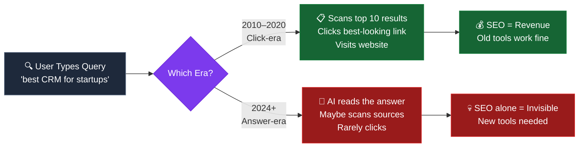

---

## 2. Strategic Pillars

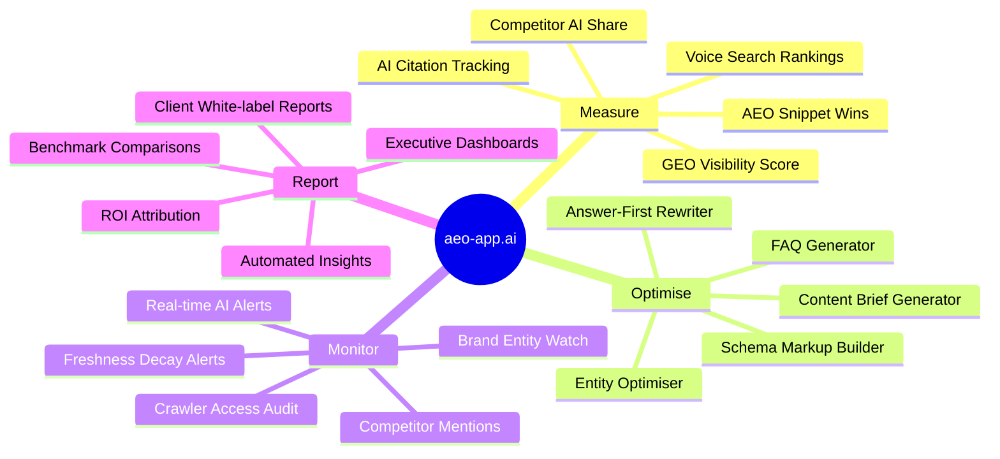

### Competitive Positioning

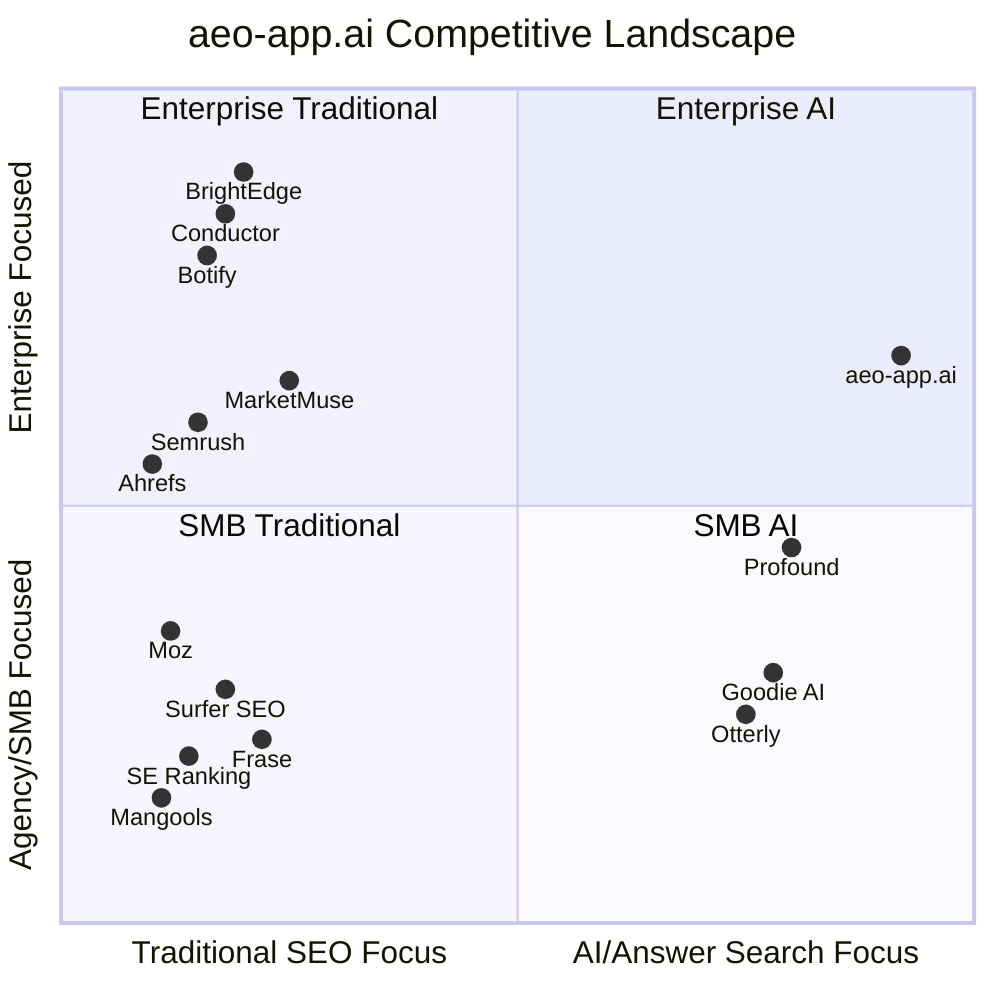

---

## 3. Market Opportunity

| Segment | TAM | SAM | SOM (Y3) |
|---|---|---|---|
| Global SEO Software Market | $1.6B | $400M | $18M |
| AI Search Optimisation (emerging) | $800M (projected) | $200M | $25M |
| Digital Agency Tools | $4.2B | $600M | $30M |
| **Total Addressable** | **~$6.6B** | **~$1.2B** | **$73M** |

### Market Tailwinds

- AI Overview appearances growing at ~40% YoY
- Perplexity growing from 10M → 100M+ monthly queries in 18 months
- 67% of marketers report zero-click rates increasing
- No single platform currently offers unified SEO + AEO + GEO measurement

---

## 4. Stakeholders

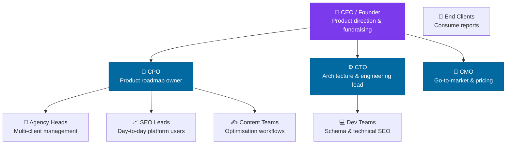

---

## 5. User Personas

### Persona 1: The Agency Director — "Alex"
- **Role:** Head of Digital at a 40-person agency managing 60+ client accounts
- **Pain:** Manually checking AI answers for each client is impossible at scale. Clients ask "are we in ChatGPT?" and there's no good answer.
- **Needs:** White-labelled client reporting, bulk monitoring, ROI dashboards, alerts
- **Willing to pay:** $500–$2,000/month

### Persona 2: The In-House SEO Lead — "Priya"
- **Role:** Senior SEO Manager at a mid-size e-commerce brand
- **Pain:** Knows AI search is important but has no tooling. Justifying investment to the CMO requires data she can't produce.
- **Needs:** GEO score benchmarking, content gap analysis, automated briefs
- **Willing to pay:** $200–$600/month

### Persona 3: The Enterprise Content Strategist — "Marcus"
- **Role:** VP Content at a Fortune 500 financial services firm
- **Pain:** Compliance requires knowing exactly where brand messaging appears. AI citations are ungoverned. Competitor AI mentions are eating their share.
- **Needs:** Enterprise governance, brand entity monitoring, competitor tracking, API access
- **Willing to pay:** $2,000–$10,000/month

---

## 6. Core Product Features

### Feature Map

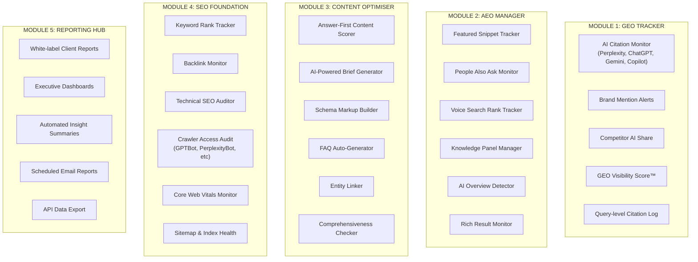

---

## 7. System Architecture — AWS Microservices

### High-Level Architecture

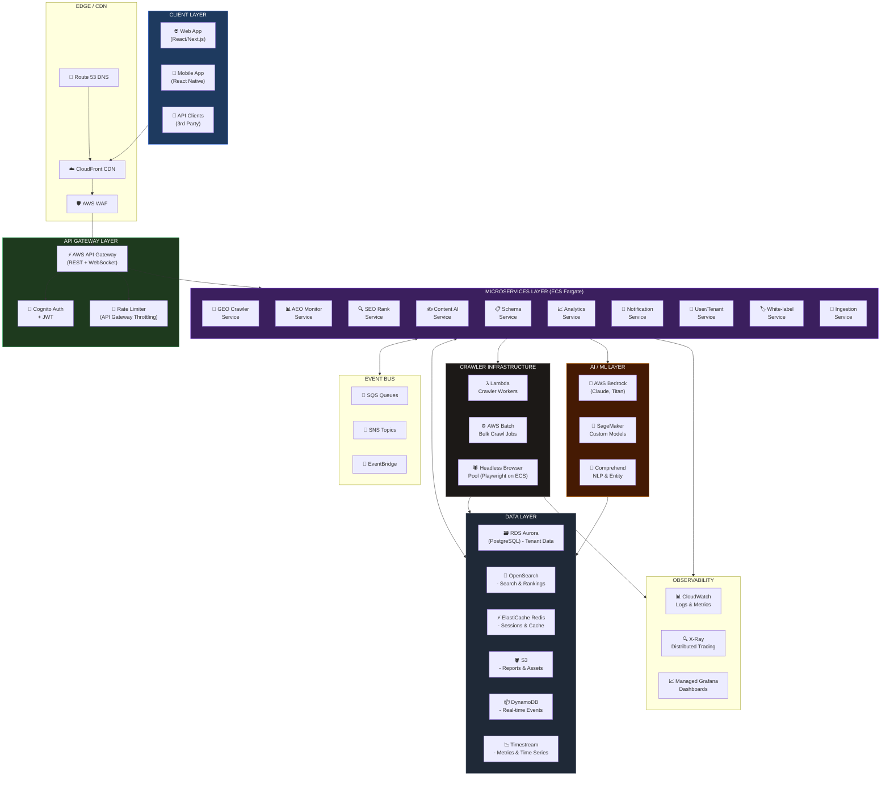

---

### Microservice Detail — Service Responsibilities

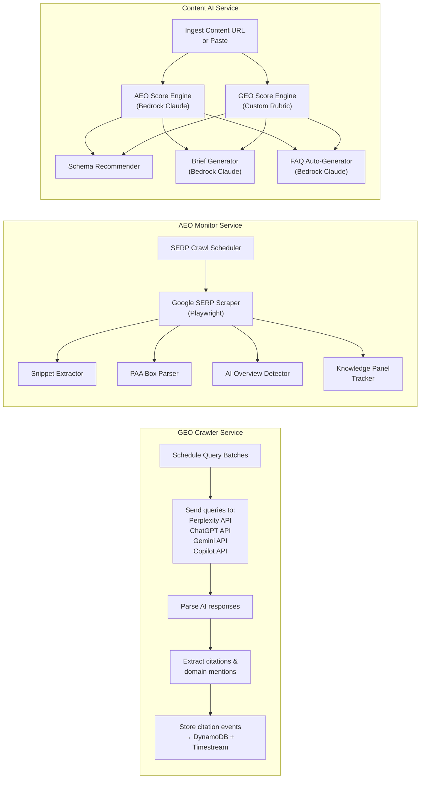

---

### Deployment Architecture

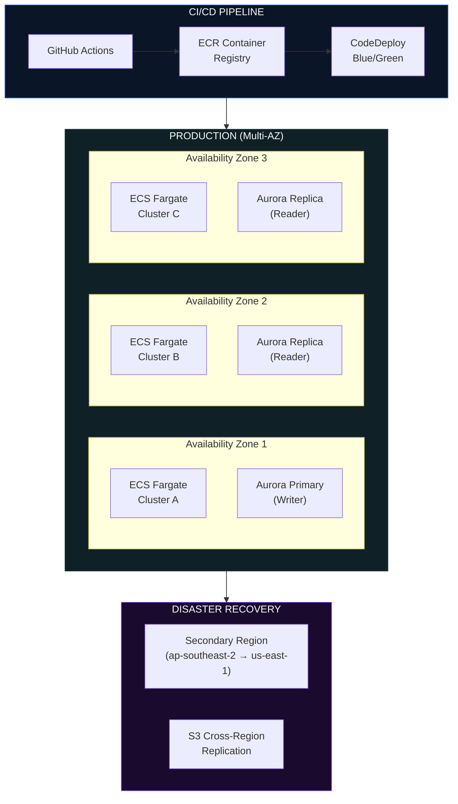

---

### Multi-Tenancy Architecture

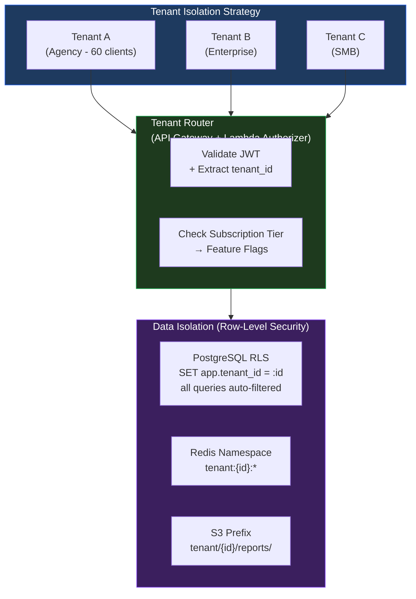

---

## 8. Data Architecture & Data Flow

### Core Data Flow — GEO Tracking

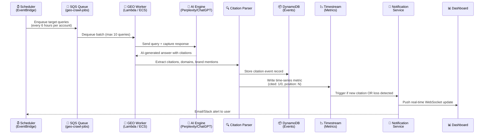

---

### Content Optimisation Flow

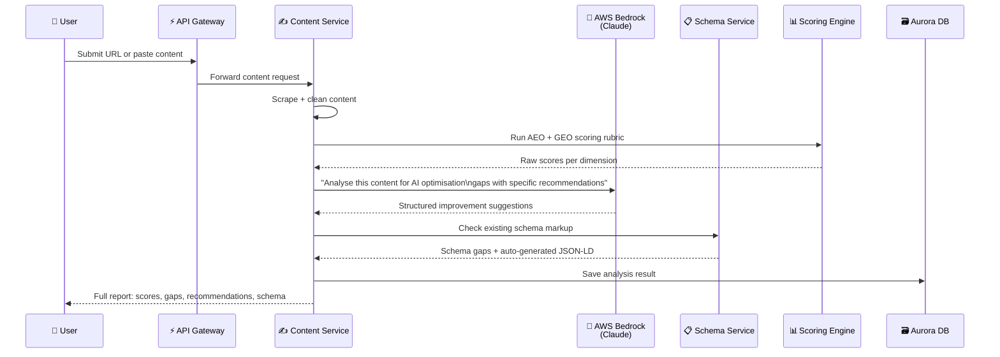

---

### Data Schema (Core Entities)

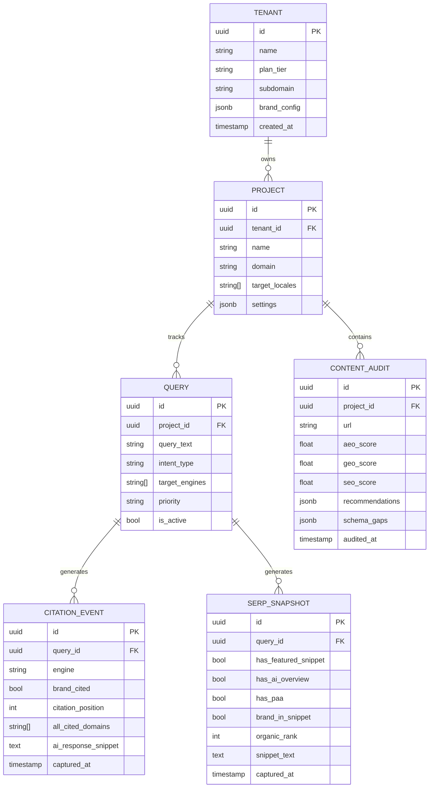

---

## 9. Module Specifications

### Module 1: GEO Visibility Score™

The **GEO Visibility Score** is aeo-app.ai's proprietary metric — a 0–100 composite score representing how visible a brand is across AI-generated search responses.

#### Score Calculation

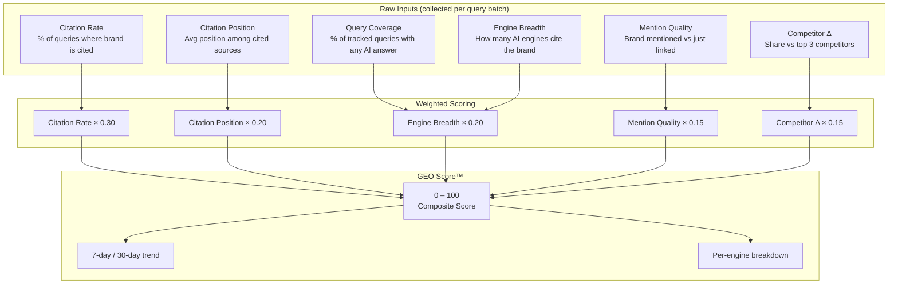

#### GEO Score Bands

| Score | Label | Description |
|---|---|---|
| 85–100 | 🟢 **Dominant** | Cited in most tracked queries across multiple AI engines |
| 65–84 | 🔵 **Established** | Consistently cited; strong single-engine presence |
| 40–64 | 🟡 **Emerging** | Cited sporadically; significant gaps in coverage |
| 15–39 | 🟠 **Weak** | Rarely cited; competitor brands dominate |
| 0–14 | 🔴 **Invisible** | Not found in AI responses; urgent remediation needed |

---

### Module 2: AEO Command Centre

#### SERP Feature Detection Logic

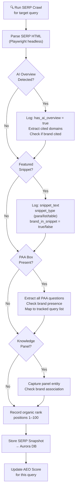

---

### Module 3: Content Optimiser — Scoring Rubric

The Content Optimiser evaluates any piece of content across 6 dimensions:

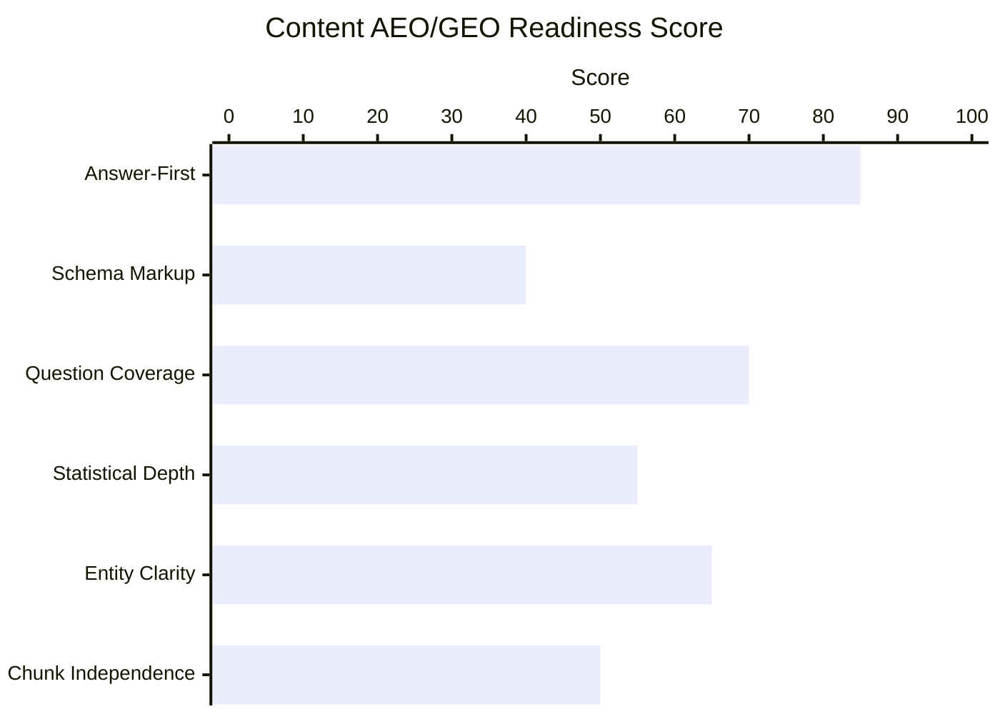

#### Dimension Definitions

| Dimension | Weight | What it measures |
|---|---|---|
| Answer-First Structure | 20% | Does each section open with a direct answer? Inverted pyramid use |
| Schema Markup | 20% | FAQPage, HowTo, Article, Speakable presence and validity |
| Question Coverage | 18% | % of PAA questions for this topic addressed |
| Statistical Depth | 15% | Named, cited, specific statistics per 1,000 words |
| Entity Clarity | 15% | Definitional sentences, named attributions, entity mentions |
| Chunk Independence | 12% | Each section readable without surrounding context |

---

### Module 4: Schema Builder

An interactive, zero-code schema markup generator:

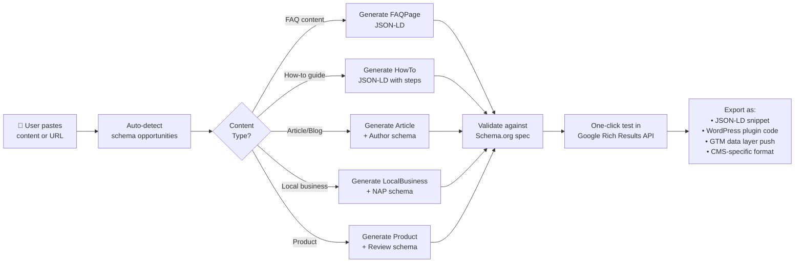

---

### Module 5: AI Crawler Audit

A dedicated tool to ensure all AI crawlers have access to client sites:

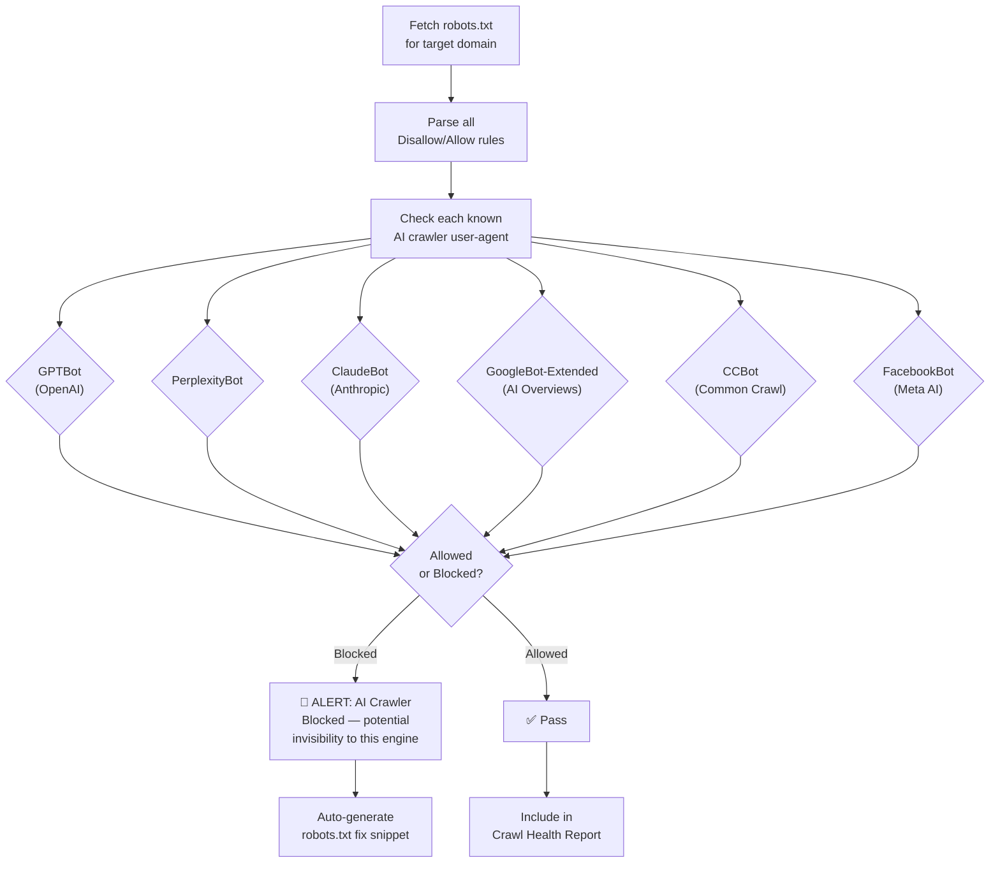

---

## 10. Metrics, Dashboards & KPIs

### Primary Dashboard — Executive View

The executive dashboard surfaces three headline scores plus trend indicators:

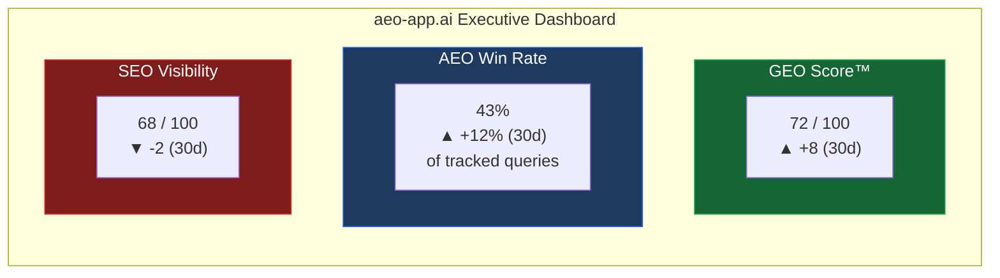

### Key Metrics Tracked

#### GEO Metrics

| Metric | Definition | Frequency |
|---|---|---|
| **GEO Visibility Score™** | Composite 0–100 AI citation score | Daily |
| **Citation Rate** | % of tracked queries where brand is cited by any AI engine | Per crawl |
| **Per-Engine Citation Rate** | Citation rate broken down by Perplexity / ChatGPT / Gemini / Copilot | Per crawl |
| **Citation Position** | Average ranked position of brand among all cited sources | Per crawl |
| **AI Share of Voice** | Brand citations / (Brand + top 3 competitors) citations | Weekly |
| **New Citation Gain** | Queries newly citing brand this period (wasn't cited before) | Weekly |
| **Citation Loss** | Queries that used to cite brand but no longer do | Weekly |
| **Engine Coverage** | Number of distinct AI engines that have cited brand at least once | Monthly |

#### AEO Metrics

| Metric | Definition | Frequency |
|---|---|---|
| **Featured Snippet Win Rate** | % of tracked queries where brand owns the snippet | Daily |
| **PAA Presence Rate** | % of tracked queries where brand appears in PAA box | Daily |
| **AI Overview Citation Rate** | % of tracked queries where brand cited in Google AI Overview | Daily |
| **Voice Rank (Position 1 Rate)** | % of voice-intent queries where brand answer is returned | Weekly |
| **Zero-Click Impact Score** | Estimated impressions captured via answer positions | Weekly |
| **Rich Result Coverage** | % of site content with valid rich result schema | Weekly |

#### SEO Metrics

| Metric | Definition | Frequency |
|---|---|---|
| **Visibility Score** | Weighted rank score across all tracked keywords | Daily |
| **Average Position** | Mean organic position for tracked queries | Daily |
| **Top 3 Rate** | % of queries ranking positions 1–3 | Daily |
| **Crawl Health Score** | Composite of Core Web Vitals + index coverage + redirect chains | Weekly |
| **AI Crawler Access Score** | % of AI crawlers explicitly allowed in robots.txt | Weekly |
| **Backlink Authority Score** | DR-equivalent composite from indexed link profile | Weekly |

---

### Metric Trend Visualisations

#### GEO Score Over Time (Concept)

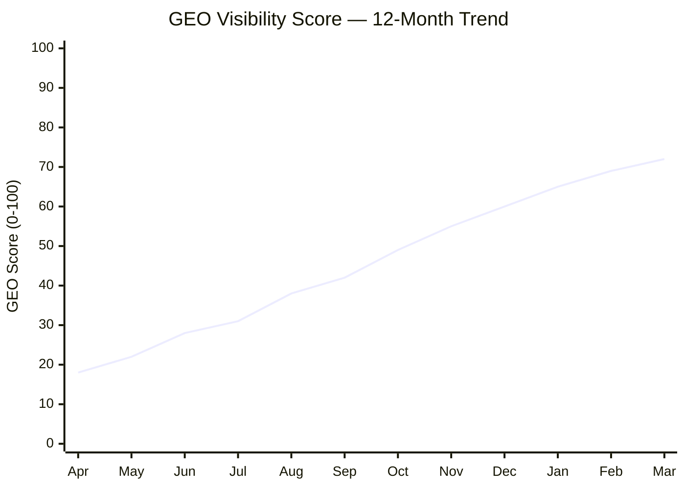

#### AI Share of Voice — Competitor View (Concept)

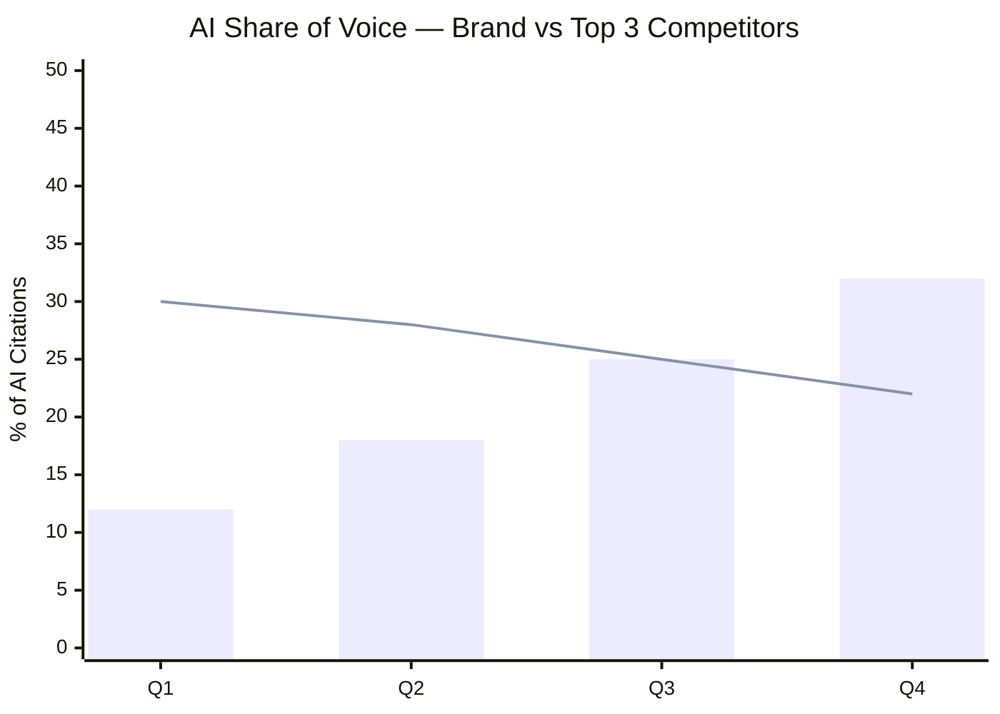

---

### Alerting & Notification Framework

```mermaid
flowchart TD
    EVENT["📊 Metric Change Detected\n(Timestream → Lambda trigger)"] --> CLASSIFY{"Severity\nClassification"}

    CLASSIFY -->|Δ > 20% drop| CRITICAL["🔴 CRITICAL\nImmediate alert"]
    CLASSIFY -->|Δ 10–20% drop| WARN["🟡 WARNING\n24hr digest"]
    CLASSIFY -->|Δ < 10% / positive| INFO["🟢 INFO\nWeekly summary"]

    CRITICAL --> SLACK["Slack Alert\n(channel + @mention)"]
    CRITICAL --> EMAIL_NOW["Immediate Email"]
    CRITICAL --> DASH_BADGE["Dashboard Alert Badge"]

    WARN --> EMAIL_DIGEST["Daily Email Digest"]
    WARN --> DASH_BADGE

    INFO --> WEEKLY_REPORT["Weekly Report\n(auto-generated PDF)"]

    subgraph ALERT_TYPES["Alert Trigger Types"]
        AT1["🆕 New competitor citation\nin tracked query"]
        AT2["📉 Citation loss:\nbrand dropped from AI answer"]
        AT3["🚫 AI crawler newly\nblocked in robots.txt"]
        AT4["🎯 Snippet stolen\nby competitor"]
        AT5["📈 GEO Score milestone\n(every 10 points)"]
        AT6["📋 Schema error\ndetected on key page"]
    end
```

---

## 11. Security & Compliance

### Security Architecture

```mermaid
flowchart TD
    subgraph PERIMETER["Perimeter Security"]
        WAF["AWS WAF\n- OWASP Top 10 rules\n- Rate limiting\n- Bot management"]
        SHIELD["AWS Shield Advanced\nDDoS Protection"]
        CF_SEC["CloudFront\nGeo-blocking if required"]
    end

    subgraph APP_SEC["Application Security"]
        COGNITO["Cognito\nMFA enforced for all users"]
        JWT["JWT Tokens\n15min access / 7d refresh"]
        RBAC["Role-Based Access Control\nOwner / Admin / Analyst / Viewer"]
        SECRETS["Secrets Manager\nAll API keys + DB credentials"]
    end

    subgraph DATA_SEC["Data Security"]
        ENCRYPT_TRANSIT["TLS 1.3\nAll in-transit data"]
        ENCRYPT_REST["AES-256\nAll at-rest (RDS, S3, DynamoDB)"]
        RLS["PostgreSQL RLS\nRow-level tenant isolation"]
        AUDIT_LOG["CloudTrail\nAll API + data access logged"]
    end

    subgraph COMPLIANCE["Compliance"]
        GDPR["GDPR\nData residency controls\nRight to erasure API"]
        SOC2["SOC2 Type II\n(Target: Year 2)"]
        PRIVACY["Privacy by Design\nNo PII in crawler payloads"]
    end

    PERIMETER --> APP_SEC --> DATA_SEC --> COMPLIANCE
```

---

## 12. Infrastructure & Scalability

### Auto-Scaling Strategy

```mermaid
flowchart TB
    subgraph LOAD["Load Patterns"]
        L1["Steady State\n~100 req/sec"]
        L2["Peak: Report Generation\n~500 req/sec"]
        L3["Crawl Burst\n~10,000 queries/hour"]
    end

    subgraph SCALE["Scaling Mechanisms"]
        ECS_SCALE["ECS Fargate Auto-scaling\nTarget tracking: CPU 60%\nMin: 2, Max: 50 tasks"]
        LAMBDA_SCALE["Lambda Concurrency\nReserved: 500\nCrawl workers: on-demand burst"]
        RDS_SCALE["Aurora Serverless v2\nACU: 0.5–128\nAuto-pause in dev"]
        CACHE_SCALE["ElastiCache\nCluster mode\n3 shards × 2 replicas"]
    end

    L1 --> ECS_SCALE
    L2 --> ECS_SCALE & RDS_SCALE
    L3 --> LAMBDA_SCALE & CACHE_SCALE

    style LOAD fill:#1e3a5f,stroke:#2563eb,color:#fff
    style SCALE fill:#1e3a1e,stroke:#16a34a,color:#fff
```

### Infrastructure Cost Model (Monthly — 1,000 Tenants)

| Component | Service | Est. Monthly Cost |
|---|---|---|
| Compute (services) | ECS Fargate | $1,200 |
| Compute (crawlers) | Lambda + ECS Batch | $800 |
| Database | Aurora Serverless v2 | $600 |
| Cache | ElastiCache Redis | $300 |
| Search | OpenSearch | $400 |
| Time-series DB | Timestream | $200 |
| Storage | S3 + DynamoDB | $150 |
| CDN | CloudFront | $100 |
| AI/ML | Bedrock API calls | $1,500 |
| Monitoring | CloudWatch + Grafana | $200 |
| **Total Infrastructure** | | **~$5,450/mo** |
| **Cost per tenant** | | **~$5.45/mo** |

At $299/month average plan, infrastructure is ~1.8% of revenue. Gross margin target: **>80%**.

---

## 13. Integrations

### Integration Architecture

```mermaid
flowchart LR
    subgraph aeo-app.ai["aeo-app.ai Core"]
        INT_HUB["Integration Hub\n(ECS Fargate)"]
        WEBHOOK["Webhook Engine"]
        OAUTH["OAuth 2.0\nManager"]
    end

    subgraph DATA_IN["Data-In Integrations"]
        GSC["Google Search Console\nAPI — rank + impression data"]
        GA4["Google Analytics 4\nTraffic + conversion data"]
        GADS["Google Ads\nPaid keyword context"]
        SEMrush["Semrush API\nBacklink + keyword fallback"]
    end

    subgraph NOTIFY["Notification Integrations"]
        SLACK_INT["Slack\nAlert channels"]
        TEAMS["Microsoft Teams\nAlert channels"]
        EMAIL_INT["SendGrid\nTransactional email"]
        PAGERDUTY["PagerDuty\nCritical alerts"]
    end

    subgraph CMS["CMS Integrations"]
        WP["WordPress Plugin\nSchema injection + score widget"]
        WEBFLOW["Webflow\nSchema embed via script"]
        CONTENTFUL["Contentful\nContent audit webhook"]
        SHOPIFY["Shopify\nProduct schema audit"]
    end

    subgraph EXPORT["Export / BI"]
        SHEETS["Google Sheets\nAuto-export reports"]
        DATASTUDIO["Looker Studio\nLive connector"]
        BIGQUERY["BigQuery\nData warehouse export"]
        ZAPIER["Zapier / Make\nWorkflow automation"]
    end

    INT_HUB --> DATA_IN
    INT_HUB --> NOTIFY
    INT_HUB --> CMS
    INT_HUB --> EXPORT
    OAUTH --> DATA_IN
    WEBHOOK --> NOTIFY & EXPORT
```

---

## 14. Pricing & Packaging

### Tier Structure

```mermaid
flowchart LR
    subgraph STARTER["🌱 Starter — $99/mo"]
        S1["1 domain"]
        S2["50 tracked queries"]
        S3["3 AI engines monitored"]
        S4["Weekly crawl frequency"]
        S5["Basic AEO + GEO dashboard"]
        S6["Email alerts"]
    end

    subgraph GROWTH["🚀 Growth — $299/mo"]
        G1["5 domains"]
        G2["250 tracked queries"]
        G3["All AI engines"]
        G4["Daily crawl frequency"]
        G5["Full AEO + GEO + SEO suite"]
        G6["Content Optimiser (20 audits/mo)"]
        G7["Schema Builder"]
        G8["Slack + Email alerts"]
    end

    subgraph AGENCY["🏢 Agency — $799/mo"]
        A1["25 domains (client accounts)"]
        A2["1,000 tracked queries"]
        A3["All engines + voice"]
        A4["6-hour crawl frequency"]
        A5["White-label client reports"]
        A6["Unlimited content audits"]
        A7["Competitor tracking (3 per domain)"]
        A8["API access"]
        A9["Priority support"]
    end

    subgraph ENTERPRISE["🏛️ Enterprise — Custom"]
        E1["Unlimited domains"]
        E2["Unlimited queries"]
        E3["1-hour crawl frequency"]
        E4["Custom brand entity setup"]
        E5["Dedicated CSM"]
        E6["SLA 99.9%"]
        E7["SSO / SAML"]
        E8["Custom integrations"]
        E9["Data residency options"]
    end

    style STARTER fill:#1f2937,stroke:#4b5563,color:#fff
    style GROWTH fill:#1e3a5f,stroke:#2563eb,color:#fff
    style AGENCY fill:#3b1f5e,stroke:#7c3aed,color:#fff
    style ENTERPRISE fill:#451a03,stroke:#d97706,color:#fff
```

---

## 15. Roadmap

```mermaid
gantt
    title aeo-app.ai Product Roadmap
    dateFormat  YYYY-MM
    section Phase 1 — MVP (Q2 2026)
    GEO Tracker (core)           :active, geo1, 2026-04, 2026-06
    AEO Monitor (snippets + PAA) :active, aeo1, 2026-04, 2026-06
    SEO Rank Tracker             :seo1, 2026-04, 2026-06
    Basic Dashboard              :dash1, 2026-05, 2026-06
    Multi-tenant Auth            :auth1, 2026-04, 2026-05

    section Phase 2 — Growth (Q3 2026)
    Content Optimiser            :cont1, 2026-07, 2026-08
    Schema Builder               :sch1, 2026-07, 2026-08
    AI Crawler Audit Tool        :craw1, 2026-07, 2026-08
    White-label Reports          :rep1, 2026-08, 2026-09
    Slack + Email Alerts         :alert1, 2026-07, 2026-07

    section Phase 3 — Scale (Q4 2026)
    Voice Search Tracking        :voice1, 2026-10, 2026-11
    Competitor AI Share          :comp1, 2026-10, 2026-11
    GSC + GA4 Integration        :gsc1, 2026-10, 2026-11
    Agency Multi-client Hub      :ag1, 2026-11, 2026-12
    WordPress Plugin             :wp1, 2026-11, 2026-12

    section Phase 4 — Enterprise (Q1 2027)
    Enterprise SSO/SAML          :sso1, 2027-01, 2027-02
    BigQuery Export              :bq1, 2027-01, 2027-02
    Custom GEO Rubric Builder    :rubric1, 2027-02, 2027-03
    Agentic Search Monitoring    :agent1, 2027-02, 2027-03
    Multimodal Tracking (Video)  :multi1, 2027-03, 2027-03
```

---

## 16. Risks & Mitigations

```mermaid
quadrantChart
    title Risk Matrix — Likelihood vs Impact
    x-axis "Low Likelihood" --> "High Likelihood"
    y-axis "Low Impact" --> "High Impact"
    quadrant-1 Enterprise AI
    quadrant-2 Enterprise Traditional
    quadrant-3 SMB Traditional
    quadrant-4 SMB AI
    Semrush: [0.15, 0.60]
    Ahrefs: [0.10, 0.55]
    Moz: [0.12, 0.35]
    BrightEdge: [0.20, 0.90]
    Profound: [0.80, 0.45]
    Otterly: [0.75, 0.25]
    aeo-app.ai: [0.85, 0.70]
```

| Risk | Likelihood | Impact | Mitigation |
|---|---|---|---|
| LLM changes citation behaviour | Medium | High | Multi-engine redundancy; monitor model update announcements |
| AI API rate limits / cost increase | High | Medium | Build caching layer; negotiate enterprise contracts; own crawl layer where possible |
| Google blocks SERP scraping | Medium | High | Use official Search Console API where possible; maintain headless browser fallback; legal counsel review |
| Competitor (Semrush, Ahrefs) copies feature | High | Medium | IP moat via proprietary GEO Score™ methodology; brand + customer lock-in |
| Privacy regulation (GDPR AI) | Low-Medium | Medium | Privacy by design from day one; DPA + data residency options |
| AWS Outage | Low | High | Multi-AZ + cross-region DR; 99.9% SLA with 30-min RPO target |

---

## 17. Acceptance Criteria

### Phase 1 MVP Go/No-Go Criteria

```mermaid
flowchart TD
    subgraph MUST["🔴 Must-Have (P0 — MVP blockers)"]
        M1["✅ GEO Tracker queries Perplexity + ChatGPT\nwith < 2hr data freshness"]
        M2["✅ AEO Monitor detects featured snippets\nand PAA with ≥ 90% accuracy vs manual check"]
        M3["✅ Multi-tenant isolation verified:\nno cross-tenant data leakage in pen test"]
        M4["✅ GEO Visibility Score™ computes\ncorrectly for 100 test queries"]
        M5["✅ Dashboard loads in < 2 seconds\nfor accounts with 250 queries"]
        M6["✅ Alert system delivers notifications\nwithin 5 minutes of trigger event"]
    end

    subgraph SHOULD["🟡 Should-Have (P1 — Target at launch)"]
        S1["Content Optimiser scoring\nwithin ±5 points of expert manual review"]
        S2["Schema Builder generates\nvalid JSON-LD passing Rich Results Test"]
        S3["White-label reports\nrender in < 10 seconds"]
        S4["GSC integration imports\ndata within 1 hour of auth"]
    end

    subgraph NICE["🟢 Nice-to-Have (P2 — Post-launch)"]
        N1["Voice search rank tracking"]
        N2["WordPress plugin 1-click install"]
        N3["Competitor AI share tracking"]
    end

    MUST --> LAUNCH["🚀 MVP Launch Decision"]
    SHOULD --> LAUNCH
```

### System Performance SLAs

| Metric | Target | Critical Threshold |
|---|---|---|
| API Response Time (p50) | < 200ms | < 500ms |
| API Response Time (p99) | < 1,000ms | < 2,000ms |
| Dashboard Load Time | < 2s | < 4s |
| GEO Crawl Freshness | ≤ 6 hours | ≤ 12 hours |
| AEO SERP Freshness | ≤ 24 hours | ≤ 48 hours |
| Platform Uptime | 99.9% | 99.5% |
| Data Accuracy (vs manual) | ≥ 90% | ≥ 80% |
| Alert Delivery Time | < 5 minutes | < 15 minutes |

---

## Appendix A — AWS Services Reference

| AWS Service | aeo-app.ai Use Case |
|---|---|
| **ECS Fargate** | All microservices (stateless, containerised) |
| **Lambda** | Crawler workers, event triggers, lightweight transformations |
| **API Gateway** | REST + WebSocket APIs, rate limiting, auth integration |
| **Cognito** | User auth, MFA, JWT issuance |
| **Aurora Serverless v2** | Primary relational DB (tenant + project data) |
| **DynamoDB** | Real-time citation events, high-throughput writes |
| **Timestream** | Time-series metrics for all tracked KPIs |
| **ElastiCache (Redis)** | Session store, query result caching, pub/sub |
| **OpenSearch** | Full-text search, keyword/content indexing |
| **S3** | Report storage, asset storage, data lake |
| **EventBridge** | Scheduled crawl triggers, event routing |
| **SQS** | Crawl job queues, async processing |
| **SNS** | Alert fan-out to email/Slack/webhooks |
| **AWS Batch** | Bulk historical crawl jobs |
| **Bedrock** | Claude / Titan for content analysis and AI generation |
| **SageMaker** | Custom scoring models (GEO rubric training) |
| **Comprehend** | NLP entity extraction from crawled content |
| **Secrets Manager** | API keys, DB credentials |
| **CloudFront** | CDN for web app and static assets |
| **WAF** | OWASP protection, bot rules |
| **Shield Advanced** | DDoS protection |
| **Route 53** | DNS + health-check-based failover |
| **CloudWatch** | Logs, metrics, alarms |
| **X-Ray** | Distributed tracing across microservices |
| **Managed Grafana** | Operational dashboards |
| **CloudTrail** | Audit logging for compliance |
| **CodePipeline + CodeDeploy** | CI/CD with blue/green deployments |
| **ECR** | Container registry |
| **VPC + PrivateLink** | Network isolation + secure service communication |

---

## Appendix B — AEO & GEO Complete Guide

# AEO & GEO: The Complete Guide to Optimising for AI-Powered Search in 2026

> *SEO is no longer enough. The search landscape has fundamentally changed — and if you're not showing up inside AI answers, you're invisible to a growing majority of your audience.*

---
