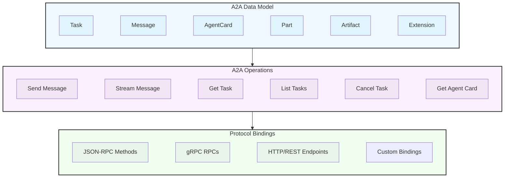

+++
date = '2026-02-17T12:44:47+10:00'
draft = false
title = 'Agent2Agent Protocol (A2A)'
tags = ['A2A', 'Agentic AI']
summary = "Agentic AI using OpenClaw"
+++


Work in Progress 👷


## Introduction
A2A is an open standard protocol that enables seamless communication and collaboration between AI agents, regardless of their underlying architecture or platform. It provides a common language and framework for agents to exchange information, coordinate actions, and work together towards shared goals. 

## Class diagram

### Core Benefits of A2A
Implementing the A2A protocol offers significant advantages across the AI ecosystem:

* Secure collaboration: Without a standard, it's difficult to ensure secure communication between agents. A2A uses HTTPS for secure communication and maintains opaque operations, so agents can't see the inner workings of other agents during collaboration.
* Interoperability: A2A breaks down silos between different AI agent ecosystems, enabling agents from various vendors and frameworks to work together seamlessly.
* Agent autonomy: A2A allows agents to retain their individual capabilities and act as autonomous entities while collaborating with other agents.
* Reduced integration complexity: The protocol standardizes agent communication, enabling teams to focus on the unique value their agents provide.
* Support for LRO: The protocol supports long-running operations (LRO) and streaming with Server-Sent Events (SSE) and asynchronous execution.

### Key Design Principles of A2A
A2A development follows principles that prioritize broad adoption, enterprise-grade capabilities, and future-proofing.

* Simplicity: A2A leverages existing standards like HTTP, JSON-RPC, and Server-Sent Events (SSE). This avoids reinventing core technologies and accelerates developer adoption.
* Enterprise Readiness: A2A addresses critical enterprise needs. It aligns with standard web practices for robust authentication, authorization, security, privacy, tracing, and monitoring.
* Asynchronous: A2A natively supports long-running tasks. It handles scenarios where agents or users might not remain continuously connected. It uses mechanisms like streaming and push notifications.
* Modality Independent: The protocol allows agents to communicate using a wide variety of content types. This enables rich and flexible interactions beyond plain text.
* Opaque Execution: Agents collaborate effectively without exposing their internal logic, memory, or proprietary tools. Interactions rely on declared capabilities and exchanged context. This preserves intellectual property and enhances security.

### Understanding the Agent Stack: A2A, MCP, Agent Frameworks and Models¶
A2A is situated within a broader agent stack, which includes:

* A2A: Standardizes communication among agents deployed in different organizations and developed using diverse frameworks.
* MCP: Connects models to data and external resources.
* Frameworks (like ADK): Provide toolkits for constructing agents.
* Models: Fundamental to an agent's reasoning, these can be any Large Language Model (LLM).

## Core Concepts

A2A revolves around several key concepts. For detailed explanations, please refer to the Key Concepts guide.

* A2A Client: An application or agent that initiates requests to an A2A Server on behalf of a user or another system.
* A2A Server (Remote Agent): An agent or agentic system that exposes an A2A-compliant endpoint, processing tasks and providing responses.
* Agent Card: A JSON metadata document published by an A2A Server, describing its identity, capabilities, skills, service endpoint, and authentication requirements.
* Message: A communication turn between a client and a remote agent, having a role ("user" or "agent") and containing one or more Parts.
* Task: The fundamental unit of work managed by A2A, identified by a unique ID. Tasks are stateful and progress through a defined lifecycle.
* Part: The smallest unit of content within a Message or Artifact. Parts can contain text, file references, or structured data.
* Artifact: An output (e.g., a document, image, structured data) generated by the agent as a result of a task, composed of Parts.
* Streaming: Real-time, incremental updates for tasks (status changes, artifact chunks) delivered via protocol-specific streaming mechanisms.
* Push Notifications: Asynchronous task updates delivered via server-initiated HTTP POST requests to a client-provided webhook URL, for long-running or disconnected scenarios.
* Context: An optional, server-generated identifier to logically group related tasks and messages.
* Extension: A mechanism for agents to provide additional functionality or data beyond the core A2A specification.

## Reference
- [Agent2Agent Protocol (A2A)](https://drive.google.com/file/d/1FXcEFqZCYLyVR4ikWBc8SgWFM54zr9yx/view?usp=drive_link)
