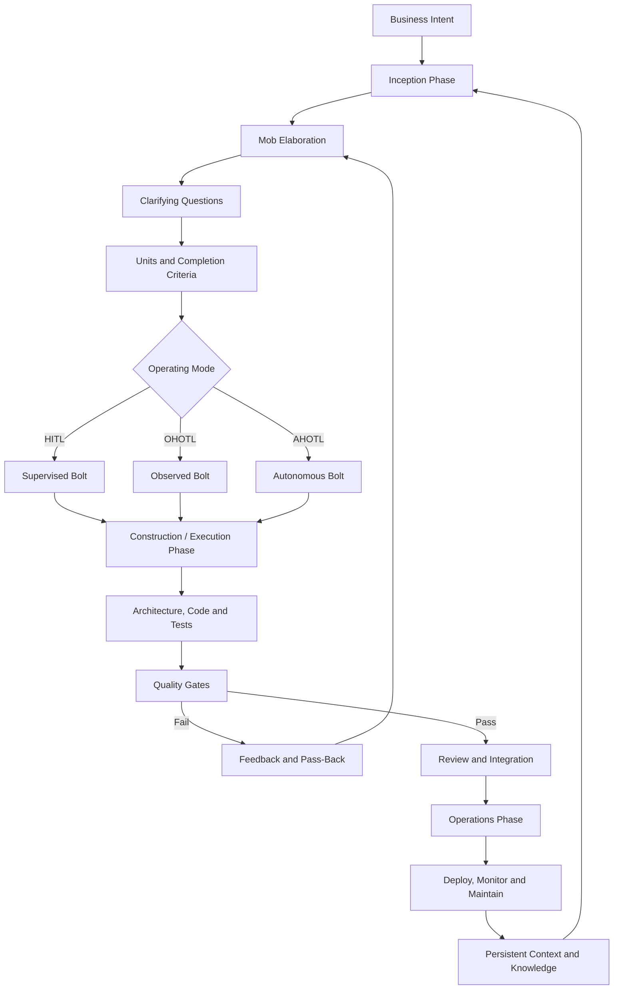

+++
date = '2026-07-01T10:00:00+10:00'
draft = false
title = 'AI-DLC: AI-Driven SDLC'
tags = ['AI-DLC', 'ADLC', 'SDLC', 'AI', 'Software Engineering', 'Methodology', 'Agentic']
summary = 'AI-DLC reimagines SDLC around AI collaboration, human oversight and verification.'
+++

## What Is AI-DLC?

The AI-Driven Development Lifecycle (AI-DLC) is a software development methodology introduced by Raja SP, Principal Solutions Architect at Amazon Web Services, in the AWS DevOps blog post "AI-Driven Development Life Cycle: Reimagining Software Engineering" on 31 July 2025.

The core idea is simple: AI should not be bolted onto Waterfall, Agile or Scrum as a peripheral assistant. It should become a central collaborator that plans, asks clarifying questions, proposes implementation paths and executes with human oversight.

There is one naming caveat. "ADLC" is also used elsewhere for "Agent Development Lifecycle" and related agent lifecycle frameworks. This post is about AWS's AI-DLC and the later AI-DLC 2026 community paper, not IBM's agent lifecycle framing or generic agent operations models.

## Why Existing Methods Fall Short

The AWS post argues that most organizations use AI in two limited ways:

- **AI-assisted development**: AI improves specific tasks such as documentation, code completion and testing
- **AI-autonomous development**: AI is expected to generate whole applications from user requirements with little human involvement

AWS says both patterns have produced suboptimal outcomes in velocity and quality. AI-DLC is the proposed middle path: AI performs heavy execution work while humans supply business context, judgment, validation and accountability.

Traditional software development methods were built for human-driven, long-running processes. Product owners, developers and architects spend significant time on planning, meetings, handoffs and other SDLC rituals. AI changes the economics of iteration: planning, coding, testing and adjustment can happen in much tighter loops, so the methodology needs to preserve context while reducing unnecessary phase friction.

## Source Versions

It is important to separate the sources:

| Source                          | Status                      | What It Contributes                                                                                                          |
| ------------------------------- | --------------------------- | ---------------------------------------------------------------------------------------------------------------------------- |
| AWS blog post, July 2025        | Foundational source         | Three phases, Mob Elaboration, Mob Construction, persistent context, terminology such as Intent, Unit and Bolt               |
| AI-DLC 2026 paper, January 2026 | Later community methodology | HITL/OHOTL/AHOTL modes, Passes, harness-enforced quality gates, completion criteria, knowledge layer and operational details |

The 2026 paper builds on Raja SP's AWS methodology but is more opinionated and implementation-specific. Treat it as an evolution of AI-DLC, not as the original AWS definition.

## Core Concepts

AI-DLC introduces terminology to reflect an AI-centric workflow:

| Term                         | Traditional Equivalent | Definition                                                                                    |
| ---------------------------- | ---------------------- | --------------------------------------------------------------------------------------------- |
| Intent                       | Epic / Initiative      | A high-level statement of purpose that describes what should be achieved                      |
| Unit                         | Feature / Work package | A cohesive, self-contained work element derived from an Intent                                |
| Bolt                         | Sprint                 | A focused work cycle measured in hours or days rather than weeks                              |
| Pass                         | Discipline iteration   | A 2026 concept for iterating through the lifecycle with a design, product or development lens |
| Mob Elaboration              | Requirements gathering | The team validates AI's questions, assumptions and proposed units                             |
| Mob Construction / Execution | Development            | AI proposes architecture, code and tests while the team clarifies decisions                   |
| Completion Criteria          | Definition of done     | Verifiable conditions that determine whether a unit is complete                               |

## ADLC Flow

## Three Phases

The AWS version describes three phases: Inception, Construction and Operations. The AI-DLC 2026 paper keeps Inception and Operations but often uses "Execution" for the build phase. The intent is the same: move from clarified intent to verified implementation and then to operational ownership.

### Inception Phase

Inception turns business intent into units, user stories, risks, non-functional requirements and completion criteria. The central ritual is Mob Elaboration: AI asks clarifying questions and the team validates or corrects the result.

Key activities:

- AI converts intent into candidate requirements and units
- AI asks questions to uncover missing context
- The team validates assumptions and constraints
- Completion criteria are defined for each unit
- Bolt structure and supervision mode are selected

### Construction / Execution Phase

Construction uses the validated context from Inception to produce architecture, domain models, code solutions and tests. In the 2025 AWS framing this is Mob Construction. In the 2026 paper this is commonly described as Execution through Bolts.

Key activities:

- AI proposes architecture and technical design
- AI implements code and supporting artifacts
- AI generates tests and validation checks
- The team reviews trade-offs and higher-risk decisions
- Quality gates provide backpressure when output fails

### Operations Phase

Operations applies the accumulated context to deployment, infrastructure as code, monitoring, rollback and ongoing maintenance. The important point is continuity: plans, requirements, design artifacts and operational knowledge are stored in the project repository so later sessions do not start from scratch.

Key activities:

- AI prepares deployment and infrastructure artifacts
- AI supports operational runbooks and maintenance tasks
- Humans retain oversight for production risk, compliance and business decisions
- Knowledge from completed work feeds future intents

## Three Operating Modes

AI-DLC 2026 introduces three operating modes. They form a spectrum of human involvement rather than a maturity ladder.

### Human-in-the-Loop (HITL)

Human judgment is directly involved in decision-making. AI proposes, the human validates and AI executes after approval.

Use HITL for:

- Novel domains or first-time implementations
- Architecture decisions with long-term consequences
- Production data, security or compliance risk
- Foundational work that shapes later autonomous execution

### Observed Human-on-the-Loop (OHOTL)

The system works while a human observes in real time and can intervene at any moment. Progress is not blocked by approval at each step.

Use OHOTL for:

- UX, design, copy and subjective quality work
- Training and onboarding
- Medium-risk changes that benefit from awareness
- Iterative refinement where taste and judgment matter

### Autonomous Human-on-the-Loop (AHOTL)

The system works autonomously within defined boundaries. Humans receive updates and intervene when needed.

Use AHOTL for:

- Well-defined tasks with measurable acceptance criteria
- Work validated by tests, type checks, linting or benchmarks
- Batch operations such as migrations, refactors and test expansion
- Background work with clear completion criteria

## Core Principles

### Reimagine Rather Than Retrofit

AI-DLC argues that teams should redesign the development method around AI's strengths instead of adding AI to existing rituals. The biggest change is cadence: when implementation and verification can happen in minutes or hours, long planning cycles and heavy handoffs become less useful.

### Backpressure Over Prescription

Instead of prescribing every implementation step, AI-DLC 2026 emphasizes quality gates that reject bad output. A team does not need to tell AI "create interface, implement class, then write unit tests." It can define constraints: tests pass, type checks succeed, linting is clean, security scans clear and coverage exceeds a threshold.

The 2026 paper describes harness-enforced quality gates that run automatically when an agent tries to stop, advance or declare work complete. This is stronger than asking the agent to remember to run tests because the harness itself blocks progress on failure.

### Completion Criteria Enable Autonomy

Autonomy depends on precise criteria. "Make auth better" is too vague. "Users can reset passwords, reset tokens expire after 15 minutes, all auth endpoints have tests and security scan has no critical findings" gives AI a target it can iterate toward.

### Iteration Through Passes

AI-DLC 2026 introduces Passes: typed iterations through elaborate, decompose, execute and review. Built-in pass types include design, product and dev. Pass-backs let later passes return work to earlier passes when new constraints appear.

### Context Must Be Managed

The methodology values persistent context, but not unlimited context stuffing. The 2026 paper warns that large context windows can still degrade performance when filled with irrelevant material. The practical lesson is to keep high-quality project knowledge on disk and load only what the current task needs.

### Everyone Becomes a Builder

AI-DLC does not claim designers, product managers or developers disappear. It changes what they do. Designers can guide working UI, product managers can shape executable behavior and engineers can focus more on architecture, constraints, review and risk.

## Benefits

The AWS post lists these benefits:

- **Velocity**: AI can rapidly generate and refine requirements, stories, designs, code and tests
- **Innovation**: AI handles routine heavy lifting, giving humans more room for creative problem-solving
- **Quality**: Continuous clarification helps teams build closer to business intent and apply organization-specific standards
- **Market responsiveness**: Shorter development cycles help teams react faster to feedback
- **Developer experience**: Developers spend less time on routine coding and more time on judgment-heavy work

## Where The Draft Needed Tightening

The original draft was directionally correct but needed a few adjustments:

- The title used "ADLC" even though the primary methodology is "AI-DLC"; ADLC is an overloaded acronym
- It treated the AWS blog and AI-DLC 2026 paper as one continuous official source; they should be distinguished
- It said "three phases and three operating modes" in the summary, but the three operating modes come from the 2026 paper, not the July 2025 AWS post
- It used "Construction Phase" throughout, while the 2026 paper often uses "Execution Phase"
- It cited several secondary references without using them in the body; better to keep references focused unless those sources add specific claims

## AI-DLC vs Ad-Hoc AI Assistance

| Aspect       | Ad-Hoc AI         | AI-DLC                             |
| ------------ | ----------------- | ---------------------------------- |
| Workflow     | Chat-and-paste    | Structured iteration loops         |
| Verification | Hope it works     | Backpressure through quality gates |
| Criteria     | Vague prompts     | Explicit completion criteria       |
| Mode         | One mode fits all | HITL, OHOTL or AHOTL selection     |
| Context      | Session-bound     | File-based persistent memory       |
| Measurement  | Usually absent    | Metrics and completion tracking    |
| AI role      | Tool              | Collaborator with governance       |

## Is AI-DLC Complete?

As a methodology, AI-DLC is useful but not complete by itself. Teams still need to define:

- Security and compliance controls for their domain
- Human approval boundaries for production and data access
- Repository conventions for persistent context
- Quality gates that actually reflect product risk
- Evaluation metrics for productivity, defect rate, user impact and maintainability
- Rules for when autonomous work must stop and escalate

In short: AI-DLC is a strong lifecycle model for AI-native software delivery, but it is not a substitute for engineering judgment, governance or measurable verification.

## Getting Started

Raja SP outlines three paths for adopting AI-DLC:

1. Read the AI-DLC white paper linked from the AWS post
2. Explore Amazon Q Developer rules and Kiro custom workflows
3. Work with an AWS account team to adapt the method to organizational needs

For a tool-agnostic implementation, start smaller:

1. Pick one low-risk feature
2. Write an Intent with explicit completion criteria
3. Decompose it into one or two Units
4. Choose HITL, OHOTL or AHOTL deliberately
5. Store decisions, requirements and outcomes in the repo
6. Add quality gates before increasing autonomy

## References

- Raja SP, Amazon Web Services — [AI-Driven Development Life Cycle: Reimagining Software Engineering](https://aws.amazon.com/blogs/devops/ai-driven-development-life-cycle/), 31 July 2025
- AI-DLC — [AI-Driven Development Lifecycle 2026](https://ai-dlc.dev/paper), 21 January 2026
