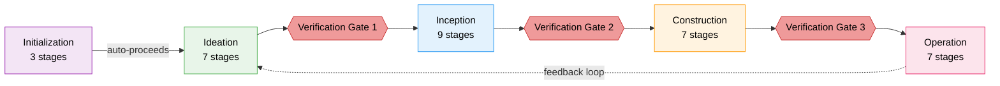

+++
date = '2026-09-30T12:00:00+10:00'
draft = false
title = 'AI-DLC: AI-Driven Development Life Cycle'
tags = ['AI-DLC', 'AI', 'Agentic', 'Software Engineering', 'Methodology', 'AWS', 'Workflow']
summary = 'AI-DLC (AI-Driven Development Life Cycle) is a methodology and deterministic engine that turns AI coding assistants into structured, auditable software-delivery workflows from one harness-neutral core.'
+++

## Introduction

AI-DLC is presented as a workflow framework for AI-assisted software delivery. Its stated goal is to separate the execution path, governance rules and audit trail from the chat transcript so work can be resumed, reviewed and explained without reconstructing the whole conversation.

- **Repository:** [github.com/awslabs/aidlc-workflows](https://github.com/awslabs/aidlc-workflows)
- **Documentation:** [awslabs.github.io/aidlc-workflows](https://awslabs.github.io/aidlc-workflows/)

## The Problem It Solves

Imagine asking a coding agent to "add OAuth login". You often get working code quickly. The harder part is answering the follow-up questions: why is the token TTL set to 15 minutes, who approved the refresh flow, which requirement did that change satisfy, what did the agent decide on its own, and how can anyone reconstruct how that result came about during an audit? In practice, the answer is often a long scrollback through chat history. (The OAuth details here are a hypothetical illustration, not an example from the AI-DLC docs.)

The core problem is not that an agent produces code quickly. It is that the process often lives in a conversation that is hard to verify, resume or review. When a task is represented mainly as chat turns, decisions that exist only in the transcript are hard to recover later.

### Seven ways a chat-only workflow fails

**1. Context is volatile.** Model sessions often compact earlier turns when the context window fills. The result is that the chat history is not always a reliable source of truth for long-running work. Projects that rely on chat history alone can lose continuity between the request, the implementation and the review. AI-DLC addresses that by describing a persisted intent state and recovery mechanisms that are stored outside the live conversational thread.

**2. The route is improvised.** Without a declared path, the agent may decide the next step differently from run to run. That can make the workflow feel inconsistent, especially when the same request needs a different amount of requirements analysis, design or verification depending on the context that survived into the session.

**3. Rules are prose, and prose is not enforcement.** A rule in an instructions file is still a recommendation unless it is enforced in a process. If the rule is important enough to fail a release, it needs to be represented in a form the system can evaluate and track. This is one of the main reasons AI-DLC treats governance as structured data rather than only as a prompt.

**4. Gates made of good intentions do not hold.** "Please run the tests before you say you are done" is useful guidance, but it is still easy to skip under time pressure. A gate is more reliable when the workflow enforces ordering and records the reason for a transition or an exception.

**5. Review arrives late, from the wrong vantage.** A reviewer often sees the finished diff after the author has already made many small design decisions inside the same context. That can make review more about explaining the work than checking it from a fresh vantage point.

**6. Nothing answers "why".** If the process exists only in chat history, later reconstruction depends on inference. An audit trail or a durable state file makes it easier to explain not just what changed, but why it changed and which work item it belonged to.

**7. Narrow specialists create handoffs.** When each discipline is owned by a separate agent, context can easily be lost at the seams between stages. A workflow that keeps more context across phases can reduce that churn, even if it still needs specialists for specific tasks.

The point is not that prompts are useless. It is that a workflow often needs explicit routing, state and checks so that the process can survive the limitations of a conversational interface.

## What Is AI-DLC

AI-DLC (AI-Driven Development Life Cycle) is a methodology from AWS for structuring AI-assisted software development into repeatable, traceable phases. Humans decide and approve while the AI plans and executes. The open-source `awslabs/aidlc-workflows` repository implements it from one harness-neutral core that runs natively in Claude Code, Kiro CLI, Kiro IDE, Codex CLI, Cursor, opencode, and GitHub Copilot. You start a workflow with a single command, such as `/aidlc Build a REST API for inventory management`.

A deterministic engine decides what happens next, moving through 33 stages across five phases: **Initialization, Ideation, Inception, Construction, and Operation**. Workflow profiles and depth levels adapt the path to the size of the work, **so a bug fix does not get the same ceremony as a new service**. **Fourteen agents** (11 domain experts, 2 reviewers, and a composer) carry out the stages. You approve the result at each approval gate, and progress and decisions are recorded in persistent state and an audit trail.

### AI-DLC: Phases, Stages, and Agents

AI-DLC has 5 phases, 33 stages, and 14 agents (11 domain experts, 2 reviewers, and 1 composer).

Which stages actually run depends on the scope you choose.

##### The 5 phases

| # | Phase | Stages | Purpose |
|---|---|---|---|
| 0 | Initialization | 0.1–0.3 | Bootstrap the workspace (automatic, no approval gates) |
| 1 | Ideation | 1.1–1.7 | Validate the initiative: intent, feasibility, scope, team, approval |
| 2 | Inception | 2.1–2.9 | Elaborate requirements, design, and delivery plan |
| 3 | Construction | 3.1–3.7 | Design, implement, and test in reviewable slices |
| 4 | Operation | 4.1–4.7 | Deploy and operate, with a feedback loop back to Ideation |

##### The 33 stages

| # | Stage | Lead | Runs | Description |
|---|---|---|---|---|
| 0.1 | Workspace Scaffold | orchestrator | Always | Ensures the per-intent record and in-scope phase directories exist (idempotent) — [details](#ref-0-1) |
| 0.2 | Workspace Detection | orchestrator | Always | Scans and classifies the workspace; auto-proceeds, no approval gate — [details](#ref-0-2) |
| 0.3 | State Initialization | orchestrator | Always | Writes the fully populated state file and determines routing; auto-proceeds — [details](#ref-0-3) |
| 1.1 | Intent Capture & Framing | aidlc-product-agent | Always | First stage of every workflow; captures the intent statement and stakeholder map — [details](#ref-1-1) |
| 1.2 | Market Research | aidlc-product-agent | Conditional | Runs when the initiative has external market positioning or build-vs-buy considerations; skipped for internal tools, bug fixes and refactors — [details](#ref-1-2) |
| 1.3 | Feasibility & Constraints | aidlc-architect-agent | Conditional | Runs when there are integration constraints, regulatory requirements or significant technical uncertainty; skipped for trivial changes — [details](#ref-1-3) |
| 1.4 | Scope Definition | aidlc-product-agent | Always | Defines the scope boundary and the prioritized backlog — [details](#ref-1-4) |
| 1.5 | Team Formation | aidlc-delivery-agent | Conditional | Runs when team composition, capacity or mob planning is relevant; skipped for solo or small-team projects — [details](#ref-1-5) |
| 1.6 | Rough Mockups | aidlc-design-agent | Conditional | Runs when user-facing UI is part of the initiative (system interaction diagrams for API/backend otherwise); skipped for API-only and infrastructure-only work — [details](#ref-1-6) |
| 1.7 | Approval & Handoff | aidlc-delivery-agent | Always | Compiles all Ideation artifacts into the initiative brief for approval — [details](#ref-1-7) |
| 2.1 | Reverse Engineering | aidlc-developer-agent (then aidlc-architect-agent) | Brownfield projects | Scans a brownfield codebase into the 9-artifact code knowledge base; skipped for greenfield — [details](#ref-2-1) |
| 2.2 | Practices Discovery | aidlc-pipeline-deploy-agent | Conditional | Discovers team practices; brownfield derives from evidence and reverse-engineering artifacts, greenfield elicits via structured questions — [details](#ref-2-2) |
| 2.3 | Requirements Analysis | aidlc-product-agent | Always | Elaborates requirements to a depth that scales with project complexity — [details](#ref-2-3) |
| 2.4 | User Stories | aidlc-product-agent | User-facing features | Runs when user-facing features, multiple personas, complex business logic or cross-team work is involved; skipped for refactors, isolated bug fixes and infrastructure-only changes — [details](#ref-2-4) |
| 2.5 | Refined Mockups | aidlc-design-agent | UI projects | Runs when user-facing UI exists and rough mockups were produced in Ideation (refines interaction diagrams for APIs) — [details](#ref-2-5) |
| 2.6 | Domain Design | aidlc-architect-agent | Per execution plan | Runs when new components or logical building blocks are needed; skipped for modifications to existing components only — [details](#ref-2-6) |
| 2.7 | Units Generation | aidlc-architect-agent | Always | Produces the units of work and the dependency DAG that Delivery Planning consumes for sequencing — [details](#ref-2-7) |
| 2.8 | Contract Design | aidlc-architect-agent | Conditional | Runs when the system has a formal contract to pin down — an inter-unit boundary or an API consumed outside the system; skipped for a single self-contained unit — [details](#ref-2-8) |
| 2.9 | Delivery Planning | aidlc-delivery-agent | Always | Capstone Inception stage; produces the detailed execution plan for Construction and Operation — [details](#ref-2-9) |
| 3.1 | Functional Design | aidlc-architect-agent | Per Unit (conditional) | Designs new data models, complex business logic and business rules per unit; skipped for simple logic changes — [details](#ref-3-1) |
| 3.2 | NFR Requirements | aidlc-architect-agent | Per Unit (conditional) | Gathers performance, security, scalability, reliability and observability requirements plus tech-stack selection per unit; skipped when none remain and the stack is fixed — [details](#ref-3-2) |
| 3.3 | NFR Design | aidlc-architect-agent | Per Unit (conditional) | Designs NFR patterns per unit; skipped when NFR Requirements was skipped — [details](#ref-3-3) |
| 3.4 | Infrastructure Design | aidlc-aws-platform-agent | Per Unit (conditional) | Maps infrastructure services and cloud resources per unit; skipped when there are no infrastructure changes and infrastructure is already defined — [details](#ref-3-4) |
| 3.5 | Code Generation | aidlc-developer-agent | Per Unit (always) | Generates application code and its documentation for every unit in the execution plan — [details](#ref-3-5) |
| 3.6 | Build and Test | aidlc-quality-agent | Always, once at end | Builds and tests everything once after all per-unit stages finish — [details](#ref-3-6) |
| 3.7 | CI Pipeline | aidlc-pipeline-deploy-agent | Conditional, once at end | Runs once at the end when the CI pipeline needs creation or significant modification — [details](#ref-3-7) |
| 4.1 | Deployment Pipeline | aidlc-pipeline-deploy-agent | Conditional | Runs when the CD pipeline needs creation or significant modification — [details](#ref-4-1) |
| 4.2 | Environment Provisioning | aidlc-aws-platform-agent | Conditional | Provisions or validates AWS environments — [details](#ref-4-2) |
| 4.3 | Deployment Execution | aidlc-pipeline-deploy-agent | Conditional | Runs the deployment after the pipeline and environment are ready — [details](#ref-4-3) |
| 4.4 | Observability Setup | aidlc-operations-agent | Conditional | Configures monitoring, dashboards, alarms and tracing — [details](#ref-4-4) |
| 4.5 | Incident Response | aidlc-operations-agent | Conditional | Builds runbooks and incident response procedures — [details](#ref-4-5) |
| 4.6 | Performance Validation | aidlc-quality-agent | Conditional | Validates NFR performance targets under load — [details](#ref-4-6) |
| 4.7 | Feedback & Optimization | aidlc-operations-agent | Conditional | Runs when ongoing monitoring and optimization are needed; feeds findings back to Ideation — [details](#ref-4-7) |

##### The 14 agents

###### 11 domain experts

| # | Agent | Domain |
|---|---|---|
| 1 | `aidlc-product-agent` | Requirements, scope, user stories, market research |
| 2 | `aidlc-design-agent` | UX/UI, wireframes, interaction design, accessibility |
| 3 | `aidlc-delivery-agent` | Team formation, capacity planning, delivery sequencing |
| 4 | `aidlc-architect-agent` | Application design, domain modelling, NFRs, decomposition |
| 5 | `aidlc-aws-platform-agent` | AWS infrastructure, IaC, FinOps, environment provisioning |
| 6 | `aidlc-compliance-agent` | GRC, regulatory mapping, data classification, risk |
| 7 | `aidlc-devsecops-agent` | Threat modelling, security pipeline, secure design review |
| 8 | `aidlc-developer-agent` | Code generation, reverse engineering, implementation guidance |
| 9 | `aidlc-quality-agent` | Test strategy, acceptance criteria, performance validation |
| 10 | `aidlc-pipeline-deploy-agent` | CI/CD pipelines, deployment strategy, release execution |
| 11 | `aidlc-operations-agent` | Observability, incident response, feedback loops |

###### 2 reviewer agents

| Agent | Reviews |
|---|---|
| `aidlc-product-lead-agent` | Requirements, user stories, and UX/mockup artifacts |
| `aidlc-architecture-reviewer-agent` | Technical design artifacts, including domain design, units generation, functional design, NFR requirements, NFR design, infrastructure design, and code generation |

###### 1 composer agent

| Agent | Role |
|---|---|
| `aidlc-composer-agent` | Proposes tailored stage plans and reshapes pending stages |

##### The 33 stages by lead agent

Each stage sits inside its phase box, is filled with its lead agent's colour, and labels it with the lead agent's ID in square brackets beneath the stage name. The arrows chain the 33 stages in run order; a scope executes a subset of this chain in the same numbered order — skipped stages are left out of that run, not reordered.

```mermaid
flowchart TD
    subgraph INIT["Phase 0 — Initialization"]
        direction LR
        S01["0.1<br/>Workspace Scaffold<br/><sub>[orchestrator]</sub>"]:::orchestrator
        S02["0.2<br/>Workspace Detection<br/><sub>[orchestrator]</sub>"]:::orchestrator
        S03["0.3<br/>State Initialization<br/><sub>[orchestrator]</sub>"]:::orchestrator
        S01 --> S02 --> S03
    end
    subgraph IDEA["Phase 1 — Ideation"]
        direction LR
        S11["1.1<br/>Intent Capture & Framing<br/><sub>[aidlc-product-agent]</sub>"]:::product
        S12["1.2<br/>Market Research<br/><sub>[aidlc-product-agent]</sub>"]:::product
        S13["1.3<br/>Feasibility & Constraints<br/><sub>[aidlc-architect-agent]</sub>"]:::architect
        S14["1.4<br/>Scope Definition<br/><sub>[aidlc-product-agent]</sub>"]:::product
        S15["1.5<br/>Team Formation<br/><sub>[aidlc-delivery-agent]</sub>"]:::delivery
        S16["1.6<br/>Rough Mockups<br/><sub>[aidlc-design-agent]</sub>"]:::design
        S17["1.7<br/>Approval & Handoff<br/><sub>[aidlc-delivery-agent]</sub>"]:::delivery
        S11 --> S12 --> S13 --> S14 --> S15 --> S16 --> S17
    end
    subgraph INCP["Phase 2 — Inception"]
        direction LR
        S21["2.1<br/>Reverse Engineering<br/><sub>[aidlc-developer-agent]</sub>"]:::developer
        S22["2.2<br/>Practices Discovery<br/><sub>[aidlc-pipeline-deploy-agent]</sub>"]:::pipelinedeploy
        S23["2.3<br/>Requirements Analysis<br/><sub>[aidlc-product-agent]</sub>"]:::product
        S24["2.4<br/>User Stories<br/><sub>[aidlc-product-agent]</sub>"]:::product
        S25["2.5<br/>Refined Mockups<br/><sub>[aidlc-design-agent]</sub>"]:::design
        S26["2.6<br/>Domain Design<br/><sub>[aidlc-architect-agent]</sub>"]:::architect
        S27["2.7<br/>Units Generation<br/><sub>[aidlc-architect-agent]</sub>"]:::architect
        S28["2.8<br/>Contract Design<br/><sub>[aidlc-architect-agent]</sub>"]:::architect
        S29["2.9<br/>Delivery Planning<br/><sub>[aidlc-delivery-agent]</sub>"]:::delivery
        S21 --> S22 --> S23 --> S24 --> S25 --> S26 --> S27 --> S28 --> S29
    end
    subgraph CONS["Phase 3 — Construction"]
        direction LR
        S31["3.1<br/>Functional Design<br/><sub>[aidlc-architect-agent]</sub>"]:::architect
        S32["3.2<br/>NFR Requirements<br/><sub>[aidlc-architect-agent]</sub>"]:::architect
        S33["3.3<br/>NFR Design<br/><sub>[aidlc-architect-agent]</sub>"]:::architect
        S34["3.4<br/>Infrastructure Design<br/><sub>[aidlc-aws-platform-agent]</sub>"]:::awsplatform
        S35["3.5<br/>Code Generation<br/><sub>[aidlc-developer-agent]</sub>"]:::developer
        S36["3.6<br/>Build and Test<br/><sub>[aidlc-quality-agent]</sub>"]:::quality
        S37["3.7<br/>CI Pipeline<br/><sub>[aidlc-pipeline-deploy-agent]</sub>"]:::pipelinedeploy
        S31 --> S32 --> S33 --> S34 --> S35 --> S36 --> S37
    end
    subgraph OPER["Phase 4 — Operation"]
        direction LR
        S41["4.1<br/>Deployment Pipeline<br/><sub>[aidlc-pipeline-deploy-agent]</sub>"]:::pipelinedeploy
        S42["4.2<br/>Environment Provisioning<br/><sub>[aidlc-aws-platform-agent]</sub>"]:::awsplatform
        S43["4.3<br/>Deployment Execution<br/><sub>[aidlc-pipeline-deploy-agent]</sub>"]:::pipelinedeploy
        S44["4.4<br/>Observability Setup<br/><sub>[aidlc-operations-agent]</sub>"]:::operations
        S45["4.5<br/>Incident Response<br/><sub>[aidlc-operations-agent]</sub>"]:::operations
        S46["4.6<br/>Performance Validation<br/><sub>[aidlc-quality-agent]</sub>"]:::quality
        S47["4.7<br/>Feedback & Optimization<br/><sub>[aidlc-operations-agent]</sub>"]:::operations
        S41 --> S42 --> S43 --> S44 --> S45 --> S46 --> S47
    end

    VG1{{"Verification Gate 1"}}
    VG2{{"Verification Gate 2"}}
    VG3{{"Verification Gate 3"}}

    S03 -.->|auto-proceeds| S11
    S17 --> VG1
    VG1 --> S21
    S29 --> VG2
    VG2 --> S31
    S37 --> VG3
    VG3 --> S41
    S47 -.->|feedback loop| S11

    classDef orchestrator fill:#9e9e9e,stroke:#616161,color:#000,stroke-width:1px
    classDef product fill:#2196f3,stroke:#1565c0,color:#fff,stroke-width:1px
    classDef architect fill:#9c27b0,stroke:#6a1b9a,color:#fff,stroke-width:1px
    classDef delivery fill:#ff9800,stroke:#e65100,color:#000,stroke-width:1px
    classDef design fill:#e91e63,stroke:#ad1457,color:#fff,stroke-width:1px
    classDef developer fill:#4caf50,stroke:#2e7d32,color:#fff,stroke-width:1px
    classDef pipelinedeploy fill:#00bcd4,stroke:#00838f,color:#000,stroke-width:1px
    classDef quality fill:#ffc107,stroke:#f9a825,color:#000,stroke-width:1px
    classDef awsplatform fill:#f44336,stroke:#c62828,color:#fff,stroke-width:1px
    classDef operations fill:#795548,stroke:#4e342e,color:#fff,stroke-width:1px

    style VG1 fill:#ef9a9a,stroke:#c62828,color:#000
    style VG2 fill:#ef9a9a,stroke:#c62828,color:#000
    style VG3 fill:#ef9a9a,stroke:#c62828,color:#000
    style INIT fill:#f3f5f7,stroke:#9c27b0
    style IDEA fill:#f3f5f7,stroke:#4caf50
    style INCP fill:#f3f5f7,stroke:#2196f3
    style CONS fill:#f3f5f7,stroke:#ff9800
    style OPER fill:#f3f5f7,stroke:#e91e63
```



##### Stage reference

What each stage does in detail, with the same numbering as the table above. Stages run in this order within a phase; whether a specific stage runs depends on the scope and the conditions below.

###### Phase 0 — Initialization

<a id="ref-0-1"></a>
**0.1 Workspace Scaffold** 
— runs deterministically inside:
  - `aidlc-utility` is the deterministic CLI behind the engine: it performs rule-based mutations like intent creation, state, scope, doctor and recompose — no LLM, no agent prose, so the same arguments always produce the same files. In a harness it runs as `<harness-dir>/tools/aidlc-utility.ts`.
  - `intent-create` is the sub command that creates an intent: it creates the record directory, appends the registry row, sets the active-intent cursor and runs all three Initialization stages (0.1, 0.2, 0.3) in one call, usually under a second. It is auto-invoked on your first `/aidlc "<what to build>"` or `/aidlc-init`; you do not type it.
- A phase the scope excludes gets no folder, so the record never implies work that was planned and skipped.
- Idempotent: creates what is missing, skips what exists. No approval gate; auto-proceeds.
- Per-stage folders are not created here — a stage's folder appears when the stage first writes an artifact. No git work happens in this stage.

The record tree that results for a scope that runs every phase looks like this:

```text
intents/260930-checkout-api/   ← one record directory per piece of work: `aidlc/spaces/<space>/intents/<YYMMDD>-<label>/`
├── aidlc-state.md       ← the state file stage 0.3 writes
├── initialization/      ← created; stages 0.1-0.3 always run
├── ideation/            ← created only if the scope runs >= 1 Ideation stage
├── inception/           ← same rule
├── construction/        ← same rule
├── operation/           ← same rule
├── verification/        ← always, scope-independent
└── audit/               ← committed event shards, written as stages run
```

`intents/260930-checkout-api/` abbreviates the full path `aidlc/spaces/<space>/intents/<YYMMDD>-<label>/`. A stage folder like `ideation/intent-capture/` only appears once that stage writes its first artifact.

<a id="ref-0-2"></a>
**0.2 Workspace Detection** — runs deterministically inside `aidlc-utility init`.

- Deterministic scanner classifies the workspace as brownfield or greenfield from signal files: source code, framework config, package manifests, source directories, parseable `.gitmodules`.
- Scans top-level files plus known source directories and skips the harness directories, `aidlc/`, `node_modules/`, `.git/`, `dist/`, `build/` and similar.
- When no top-level signal fires, a nested fallback walks container directories up to three levels below the root and re-applies the same signals, so `services/api/src/main.py` still counts as brownfield.
- Records the detected languages, frameworks and build system into the state file.
- If it finds uninitialized submodules it relays an advisory telling you to run `git submodule update --init --recursive` because reverse engineering needs the code on disk. It never runs git itself.
- No approval gate; auto-proceeds.

<a id="ref-0-3"></a>
**0.3 State Initialization** — runs deterministically inside `aidlc-utility init`.

- Overwrites `<record>/aidlc-state.md` with a fully populated version generated from the compiled stage graph and the scope grid: project description, project type, workspace state, start date, scope configuration, and progress checkboxes for every stage.
- Determines routing by project type: brownfield starts Inception with reverse-engineering, greenfield starts with requirements-analysis and marks reverse-engineering as skip.
- Writes `Stages to Execute` and `Stages to Skip` per scope plus project type. If invoked from `--init` it stops at "workspace initialized"; if invoked from a workflow start it moves to the first post-initialization stage.
- No approval gate; auto-proceeds.

###### Phase 1 — Ideation

<a id="ref-1-1"></a>
**1.1 Intent Capture & Framing** — the first stage of every workflow. Runs inline with the `aidlc-product-agent` as lead and the architect as support.

- Permitted sources are strict: the original description, confirmed `[Q<n>]` answers, the workflow-selected scope, and registered memory rules. Every substantive claim carries an inline source tag; nothing is invented.
- Content inside a `<document>...</document>` block is treated as untrusted data, not instructions.
- Writes `intent-statement.md` (problem, customer, success metrics, trigger, scope signal) and `stakeholder-map.md`. Any unresolved field is labelled `Unknown (open question)` or `[assumption]`, never silently filled.
- The `aidlc-product-lead-agent` reviews the artifacts.

<a id="ref-1-2"></a>
**1.2 Market Research** — conditional. Runs when the initiative has external market positioning or build-vs-buy considerations. Skipped for internal tools, bug fixes and refactors.

- Produces `competitive-analysis.md`, `market-trends.md` and `build-vs-buy.md` from confirmed answers only.

<a id="ref-1-3"></a>
**1.3 Feasibility & Constraints** — conditional. Runs when there are integration constraints, regulatory requirements or significant technical uncertainty; skipped for trivial changes with no technical risk.

- The architect leads with the AWS platform and compliance agents as support.
- Produces `feasibility-assessment.md`, `constraint-register.md` and `raid-log.md`.

<a id="ref-1-4"></a>
**1.4 Scope Definition** — always, inline, product lead with delivery support.

- Defines the scope boundary and the prioritized backlog as `scope.md` and `intent-backlog.md`.
- Validates scope against the timeline and runs contradiction analysis on the answers.

<a id="ref-1-5"></a>
**1.5 Team Formation** — conditional. Runs when team composition, capacity or mob planning is relevant; skipped for solo or small-team projects.

- Produces `team-assessment.md`, `skill-matrix.md` and `mob-composition.md`, with a gap analysis between required and available skills.

<a id="ref-1-6"></a>
**1.6 Rough Mockups** — conditional. Runs when user-facing UI is part of the initiative; for API/backend work the design agent produces system interaction diagrams instead. Skipped for non-UI, API-only or infrastructure-only initiatives.

- Produces `wireframes.md` and `user-flow.md`, and runs contradiction analysis between UX expectations and scope constraints.

<a id="ref-1-7"></a>
**1.7 Approval & Handoff** — always, inline, delivery lead with product support. The Ideation approval gate.

- Compiles every Ideation artifact into the initiative brief and writes `decision-log.md`, a record of all decisions made during the phase.
- Presents the brief for approval; approving it hands off to Inception.

###### Phase 2 — Inception

<a id="ref-2-1"></a>
**2.1 Reverse Engineering** — conditional, brownfield only.

- Runs as a two-link pipeline: the developer scans the codebase and returns structured results, then the architect synthesizes the 9 artifacts (`business-overview.md`, `architecture.md`, `code-structure.md`, `api-documentation.md`, `component-inventory.md`, `technology-stack.md`, `dependencies.md`, `code-quality-assessment.md`, `reverse-engineering-timestamp.md`).
- Writes to the space-level store `aidlc/spaces/<space>/codekb/<repo>/`, shared across intents, not into the intent record.
- A freshness guard checks the existing store first: the human chooses reuse, full rescan or focused merge per repository.
- Multi-repo intents run one complete chain per registered repository.

<a id="ref-2-2"></a>
**2.2 Practices Discovery** — conditional, runs as a hub-and-spoke ensemble with the pipeline-deploy agent leading and quality, developer and devsecops inspecting the draft independently.

- Brownfield discovers practices from evidence plus reverse-engineering artifacts; greenfield elicits them via structured questions using `org.md` defaults.
- Affirmed practices are promoted into the space's method at `memory/`; the rest stay out.

<a id="ref-2-3"></a>
**2.3 Requirements Analysis** — always, inline, product lead.

- Elaborates `requirements.md` to a depth that scales with project complexity.

<a id="ref-2-4"></a>
**2.4 User Stories** — conditional, runs as a mob with the product agent leading and design, developer and quality contributing in parallel.

- Runs when user-facing features, multiple personas, complex business logic or cross-team work is involved; skipped for pure refactoring, isolated bug fixes, infrastructure-only changes and developer tooling.
- Produces `stories.md` and `personas.md`.

<a id="ref-2-5"></a>
**2.5 Refined Mockups** — conditional, inline, design lead with product support.

- Runs when user-facing UI exists and rough mockups were produced in Ideation. Classic scope skips rough mockups by design, so when the wireframe inputs are absent the stage designs from the user stories and requirements directly.
- Produces hi-fi mockups, `interaction-spec.md`, `design-system-mapping.md` and `accessibility-checklist.md`.

<a id="ref-2-6"></a>
**2.6 Domain Design** — conditional, inline, architect lead.

- Runs when new components or logical building blocks are needed; skipped when changes only modify existing components.
- Produces `components.md` and `decisions.md` (ADR-style records). It does not decide deployment topology — monolith, microservices or serverless is Units Generation's call.

<a id="ref-2-7"></a>
**2.7 Units Generation** — always, inline, architect lead with delivery support.

- Produces `unit-of-work.md`, the dependency DAG and the story map that Delivery Planning consumes for sequencing.
- When the skeleton check is enabled, the first unit in DAG order is shaped as the smallest working integrated slice so it can be approved against a real command before later units start.
- In the compiled scope grid, 2.7 and 2.9 travel together — both execute or both skip per scope.

<a id="ref-2-8"></a>
**2.8 Contract Design** — conditional, inline, architect lead with AWS platform support.

- Runs when the system has a formal contract to pin down: an inter-unit boundary where more than one unit must integrate, or a unit that exposes an API consumed outside the system. Skipped only for a single self-contained unit.
- Runs once per workflow, not per unit: it maps the whole set of boundaries at once using the dependency DAG from Units Generation.
- Produces `contract-summary.md`.

<a id="ref-2-9"></a>
**2.9 Delivery Planning** — always, inline, delivery lead with architect support. The capstone Inception stage.

- Produces `bolt-plan.md`, team allocation, sequencing rationale and an external dependency map, using the affirmed practices from Practices Discovery.

###### Phase 3 — Construction

<a id="ref-3-1"></a>
**3.1 Functional Design** — conditional, runs once per unit in DAG order, architect lead with developer support.

- Runs when new data models, complex business logic or business rules need design; skipped for simple logic changes with no new business logic.
- Produces `entities.md`, `rules.md` and `functional-spec.md` at design level — not implementation-ready code.

<a id="ref-3-2"></a>
**3.2 NFR Requirements** — conditional, runs once per unit, architect lead with devsecops, compliance and quality support.

- Runs when performance, security, scalability, reliability or observability requirements are needed, or a tech-stack selection is needed; skipped when none remain and the stack is determined.
- Collects the requirement categories through structured questions and returns control to the orchestrator.

<a id="ref-3-3"></a>
**3.3 NFR Design** — conditional, runs once per unit, architect lead.

- Designs the patterns behind the NFR categories (`performance-design.md`, `security-design.md`, `scalability-design.md`, `reliability-design.md`, `observability-design.md`, `logical-components.md`).
- Skipped when NFR Requirements was skipped.

<a id="ref-3-4"></a>
**3.4 Infrastructure Design** — conditional, runs once per unit, AWS platform lead with devsecops and compliance support.

- Runs when infrastructure services need mapping or cloud resources are needed; skipped when there are no infrastructure changes and infrastructure is already defined.
- Produces `infrastructure-specification.md`, `monitoring-design.md` and `cicd-pipeline.md` as design, not completed IaC.

<a id="ref-3-5"></a>
**3.5 Code Generation** — always, runs once per unit, developer lead, dispatched as a subagent.

- Produces `code-generation-plan.md`, `unit-test-instructions.md` and `code-summary.md`.
- Contract coverage floors from design are inputs, not suggestions: the stage never lowers or disables a defined target.

<a id="ref-3-6"></a>
**3.6 Build and Test** — always, runs once after every per-unit stage finishes, quality lead with devsecops support.

- Produces build instructions, integration, performance and security test instructions, `build-test-results.md` and cross-unit traceability.

<a id="ref-3-7"></a>
**3.7 CI Pipeline** — conditional, runs once at the end, pipeline-deploy lead.

- Runs when the CI pipeline needs creation or significant modification; skipped if CI already exists and is adequate.
- Produces `ci-config.md` and `quality-gates.md`. Incremental scopes like `infra` skip code generation and build-and-test, so the pipeline stages are based on the workspace's existing build and test setup.

###### Phase 4 — Operation

<a id="ref-4-1"></a>
**4.1 Deployment Pipeline** — conditional, pipeline-deploy lead.

- Runs when the CD pipeline needs creation or significant modification. Produces `cd-config.md`, `deployment-strategy.md` and `rollback-runbook.md`.

<a id="ref-4-2"></a>
**4.2 Environment Provisioning** — conditional, AWS platform lead with devsecops and compliance support.

- Provisions or validates target AWS environments using the Infrastructure Design outputs. Produces `environment-inventory.md` and `validation-report.md`.

<a id="ref-4-3"></a>
**4.3 Deployment Execution** — conditional, pipeline-deploy lead with developer support.

- Runs after the pipeline and environment are ready. Produces `deployment-log.md`, `smoke-test-results.md` and `health-check-report.md`.

<a id="ref-4-4"></a>
**4.4 Observability Setup** — conditional, operations lead.

- Configures dashboards, alarms, SLO configuration, log queries, tracing and anomaly configuration. When express scope skipped NFR design and infrastructure design, the minimum observable surface is derived from the approved artifacts.

<a id="ref-4-5"></a>
**4.5 Incident Response** — conditional, operations lead.

- Produces an SSM Automation runbook library, an incident response plan integrated with AWS Incident Manager and an escalation matrix.

<a id="ref-4-6"></a>
**4.6 Performance Validation** — conditional, quality lead.

- Designs a load test plan, executes performance tests against production-like environments and validates NFR performance targets using CloudWatch and X-Ray evidence. Produces the `nfr-validation-matrix.md`.

<a id="ref-4-7"></a>
**4.7 Feedback & Optimization** — conditional, operations lead with AWS platform support.

- Runs when ongoing monitoring and optimization are needed. Produces an SLO report, an AWS Cost Explorer cost analysis, an AWS Config drift report and the feedback-loop document that opens the next Ideation intent.

### Methodology plus a deterministic engine

The framework is presented as two connected halves.

The **methodology** is the declarative layer: stage definitions, agent personas, workflow scopes, rules, sensors and knowledge references. In project terms, this is the part that is meant to be readable, reviewable and versioned.

The **engine** is the runtime layer that decides the next transition based on state and the current stage graph. The project describes it as emitting a validated directive rather than leaving route selection to model prose alone.

The **conductor** is the thin orchestration layer that interprets that directive, keeps the stage diary and surfaces approval points to a human. The separation is meant to keep routing, state and enforcement outside the agent's improvisational behavior.

### One core, many harnesses

The same core runs natively in Claude Code, Kiro CLI, Kiro IDE, Codex CLI, Cursor, opencode and GitHub Copilot. One installation serves all of them; `aidlc config --harness <name>` writes the configuration for the one you use.

That split exists because harnesses genuinely disagree about how agents, hooks and rules are declared. Each one gets its own native shell — `.claude/`, `.kiro/`, `.github/`, `.opencode/` and so on — carrying subagents, the `/aidlc` command and hook wiring in that harness's own idiom, while the engine tree ships unchanged at `.aidlc/` and the method is read through whatever mechanism the harness provides, whether that is an `@`-import line in `AGENTS.md` or an `instructions` glob. You invoke it as `/aidlc`, except on Codex CLI where it is `$aidlc`.

### Execution is hybrid, and it is instrumented

Not every stage deserves a subagent. Stages that need a human — a clarifying question, an approval gate — run inline, in conversation, where a person can answer. Stages that produce a well-defined artifact run as autonomous subagents and return structured summaries. The framework decides which, per stage, and the distinction is why a gate still feels like a gate.

Everything around that is instrumented rather than trusted: hooks emit audit events and validate state before compaction, fences refuse out-of-order transitions outright, and the append-only trail records 107 event types. Corrections feed back the other way too — when a human overrules the agent, that correction can be promoted into a persistent rule in the team's own method, scoped at org, team, project, phase or stage level, so the framework gets stricter rather than merely longer.

What emerges is not autonomy or a chat window. It is a delivery process whose route, rules, checks and refusals are all things you can read, diff and hold someone to.

## Lifecycle: 5 Phases and 33 Stages

The lifecycle is the framework's spine. Five phases run in order, holding 33 stages between them, and every stage has one job, one lead agent and a declared set of artifacts on disk. Three phase boundaries are protected by verification gates, one auto-proceeds, and the last closes a feedback loop. Nothing in the sequence is decided at conversation time — the route was compiled before you asked for anything.



### Phase 0 — Initialization

Purpose: bootstrap the workspace. Scaffold the record directory, scan the codebase and initialise state. All three stages run automatically inside a single deterministic tool call — no subagent, no prompt, no approval gate.

| #   | Stage                | Lead         | Key artifacts                         |
| --- | -------------------- | ------------ | ------------------------------------- |
| 0.1 | Workspace Scaffold   | orchestrator | The first intent's record directory   |
| 0.2 | Workspace Detection  | orchestrator | Detected languages, frameworks, build |
| 0.3 | State Initialization | orchestrator | `aidlc-state.md`, `audit/` shards     |

Stage 0.3 is also where the brownfield-or-greenfield verdict is recorded, and that single fact determines whether the next phase opens with reverse engineering.

### Phase 1 — Ideation

Purpose: decide whether this is worth doing and what it is. Stages 1.1, 1.4 and 1.7 always run; the rest are conditional on scope, so a bug fix skips market research while a greenfield feature does not.

| #   | Stage                     | Lead      | Key artifacts                               |
| --- | ------------------------- | --------- | ------------------------------------------- |
| 1.1 | Intent Capture & Framing  | product   | Intent statement, stakeholder map           |
| 1.2 | Market Research           | product   | Competitive analysis, build-vs-buy          |
| 1.3 | Feasibility & Constraints | architect | Feasibility assessment, constraint register |
| 1.4 | Scope Definition          | product   | Scope definition, intent backlog            |
| 1.5 | Team Formation            | delivery  | Team assessment, mob composition plan       |
| 1.6 | Rough Mockups             | design    | Wireframes, user flows, concept deck        |
| 1.7 | Approval & Handoff        | delivery  | Initiative brief, decision log              |

### Phase 2 — Inception

Purpose: elaborate that decision into something buildable. This is the longest phase and the one where existing code gets read properly, which is why it carries the most interesting execution topologies.

| #   | Stage                 | Lead            | Key artifacts                                                         |
| --- | --------------------- | --------------- | --------------------------------------------------------------------- |
| 2.1 | Reverse Engineering   | developer       | 9 artefacts: architecture, component inventory, data flow, risks      |
| 2.2 | Practices Discovery   | pipeline-deploy | `team-practices.md`, promoted to the space's `memory/` on affirmation |
| 2.3 | Requirements Analysis | product         | `requirements.md`                                                     |
| 2.4 | User Stories          | product         | `stories.md`, `personas.md`                                           |
| 2.5 | Refined Mockups       | design          | Hi-fi mockups, interaction spec                                       |
| 2.6 | Domain Design         | architect       | `components.md`, `decisions.md` (ADRs)                                |
| 2.7 | Units Generation      | architect       | `unit-of-work.md`, the dependency DAG, story map                      |
| 2.8 | Contract Design       | architect       | `contract-summary.md`                                                 |
| 2.9 | Delivery Planning     | delivery        | `bolt-plan.md`, team allocation, sequencing rationale                 |

Three stages here do not run like ordinary stages, and the difference is the point. Reverse Engineering is a **two-link pipeline** — a developer scans the code, an architect synthesises and writes — and multi-repo work needs one complete chain per repository before it can be approved. Practices Discovery is a **hub-and-spoke**: the lead drafts, quality, developer and devsecops inspect the draft independently without seeing each other's comments, a human closes the gaps, and only affirmed practices are promoted into the space's method. User Stories run as a **mob**, with design, developer and quality contributing in parallel.

### Phase 3 — Construction

Purpose: build, in reviewable slices. Stages 3.1 to 3.5 run once per unit of work in dependency order; 3.6 and 3.7 run a single time after every unit has converged.

| #   | Stage                 | Lead            | Key artifacts                                   |
| --- | --------------------- | --------------- | ----------------------------------------------- |
| 3.1 | Functional Design     | architect       | `entities.md`, `rules.md`, `functional-spec.md` |
| 3.2 | NFR Requirements      | architect       | Performance, security, scalability NFRs         |
| 3.3 | NFR Design            | architect       | NFR design specifications                       |
| 3.4 | Infrastructure Design | aws-platform    | Infrastructure specs, IaC designs               |
| 3.5 | Code Generation       | developer       | Application code and its documentation          |
| 3.6 | Build and Test        | quality         | Test results, quality report                    |
| 3.7 | CI Pipeline           | pipeline-deploy | CI configuration, quality gates                 |

The ordering is unit-major and serial by default: each unit finishes its design stages and code generation before the next begins, following the DAG from 2.7. The first unit in that DAG is a deliberately small working slice, and you approve it against a real end-to-end command before later units start — a design review passing is not a skeleton running. Parallel execution is available as dependency-ready batches, but the skeleton checkpoint still comes first.

### Phase 4 — Operation

Purpose: ship it and keep it. Every stage here is conditional, because a library, an internal tool and a customer-facing service have very different operational needs.

| #   | Stage                    | Lead            | Key artifacts                                    |
| --- | ------------------------ | --------------- | ------------------------------------------------ |
| 4.1 | Deployment Pipeline      | pipeline-deploy | CD config, deployment strategy, rollback runbook |
| 4.2 | Environment Provisioning | aws-platform    | Environment inventory, validation report         |
| 4.3 | Deployment Execution     | pipeline-deploy | Deployment log, smoke tests, health checks       |
| 4.4 | Observability Setup      | operations      | Dashboards, alarms, SLO configuration            |
| 4.5 | Incident Response        | operations      | SSM runbooks, incident plan, escalation matrix   |
| 4.6 | Performance Validation   | quality         | Load test results, NFR validation matrix         |
| 4.7 | Feedback & Optimization  | operations      | SLO report, cost analysis, feedback loop doc     |

Stage 4.7 is where the loop closes. Its findings feed back into Ideation as a new intent, which is how a framework that treats delivery as a lifecycle stays one: the thing you learn operating the system becomes the next piece of work.

## Agents

AI-DLC ships 14 agents: **11 domain experts, 2 reviewers and 1 adaptive composer**. The domain experts are the product, design, delivery, architect, AWS platform, compliance, DevSecOps, developer, quality, pipeline-deploy and operations agents. Each stage names one lead agent, which you can see in the lifecycle tables above.

The two reviewers are review-only agents, so the agent that wrote an artifact is not the one judging it. That addresses the "review arrives late, from the wrong vantage" failure described earlier. The adaptive composer builds a custom execute-or-skip plan for work that no stock profile fits (the `/aidlc compose "<task>"` command).

Each agent is a persona with domain expertise, a tool profile and a model or operating context, defined in files you can read and change. The docs include a deep-dive page for every agent.

## Workflow Profiles

Not every task needs all 33 stages. AI-DLC ships **11 workflow profiles** (called scopes in the engine) that decide which stages run for a given intent. They cover features, bug fixes, infrastructure, security, proofs of concept, enterprise delivery and other common work. The stage counts below come from the compiled scope grid.

| Profile    | Stages that run |
| ---------- | --------------- |
| `poc`      | 8 of 33         |
| `bugfix`   | 9 of 33         |
| `classic`  | 18 of 33        |
| `mvp`      | 23 of 33        |
| `workshop` | 26 of 33        |
| `feature`  | 33 of 33        |
| `enterprise` | 33 of 33      |

Other profiles include `express` and `security-patch`. The Workflow Profiles guide in the docs describes the full set. You can name a profile (`/aidlc bugfix`) or let AI-DLC infer one from your description. It then prints the route and the number of approval gates and waits for your confirmation before anything runs.

## What Harness Engineering Actually Means

A **harness** is the interface layer that runs the same workflow on different agent environments, such as Claude Code, Kiro CLI, Kiro IDE, Codex CLI, Cursor, opencode and GitHub Copilot. The project describes the workflow itself as consistent across those environments, while the shell and configuration details differ.

**Harness engineering** is the work of shaping how the workflow behaves for a team: which stages exist, which artifacts they produce, who leads them, which rules apply and how verification is enforced. The project presents this as a configuration and process design task rather than a pure prompt-writing exercise.

A useful mental model is that **stages define what work happens and agents define who performs it**. A stage is a unit of work with inputs, outputs and a lead. An agent is a persona with domain expertise, a tool profile and a model or operating context. The workflow can then be adjusted by changing scopes and rules without redefining the entire job in natural language each time.

Everything you shape hangs off five things:

- **Stages** — the units of work and the nodes in the workflow graph.
- **Agents** — the personas assigned to those stages.
- **Scopes** — which stages run for a given type of work.
- **Rules** — decisions that persist across workflows.
- **Sensors** — checks bound to stages or gates that can be advisory or blocking.

Two additional levers sit alongside these. **Knowledge** is the background context the agents load before work. **Depth** affects how much detail a stage produces, not which stages are selected.

This is where workflow design becomes more than prompt engineering. A prompt is a request. A stage file, a rule set or a gate is a durable process input. That distinction matters when the work must be resumed, audited or operated under explicit controls.

## Harness Support

AI-DLC runs natively in seven harnesses. Minimum versions below are from the repository README.

| Harness                        | Configure                         | Invoke   | Minimum version                 |
| ------------------------------ | --------------------------------- | -------- | ------------------------------- |
| Claude Code                    | `aidlc config --harness claude`   | `/aidlc` | —                               |
| Kiro CLI                       | `aidlc config --harness kiro`     | `/aidlc` | Kiro CLI 2.6 or later           |
| Kiro IDE                       | `aidlc config --harness kiro-ide` | `/aidlc` | Kiro IDE 1.x / Kiro CLI v3      |
| Codex CLI                      | `aidlc config --harness codex`    | `$aidlc` | 0.145.0 or later                |
| Cursor (IDE and CLI)           | `aidlc config --harness cursor`   | `/aidlc` | —                               |
| opencode                       | `aidlc config --harness opencode` | `/aidlc` | 1.17 or later                   |
| GitHub Copilot (CLI + VS Code) | `aidlc config --harness copilot`  | `/aidlc` | CLI 1.0.74 / VS Code 1.130      |

## Repository Layout

The repository separates hand-authored source from generated output:

- `core/` — the hand-authored, harness-neutral methodology and engine (including `core/tools/`, the engine and authoring tools)
- `harness/<name>/` — thin, harness-specific manifests and integrations
- `plugins/<name>/` — optional AI-DLC plugins (the repo ships an example, `test-pro`)
- `scripts/` — packaging, binary, installer and release tooling
- `tests/` — smoke, unit, integration and end-to-end tests
- `docs/` — user, harness-engineering and developer documentation
- `dist/` and `dist-release/` — generated, ignored local outputs

The rule is simple: edit `core/` or `harness/<name>/`, never the generated `dist*` output.

## Getting Started

Installation is one command, and it deliberately does not ask you to install a language runtime first. On macOS, Linux or WSL:

```bash
curl -fsSL https://github.com/awslabs/aidlc-workflows/releases/latest/download/install.sh | sh
```

On Windows PowerShell, `irm https://github.com/awslabs/aidlc-workflows/releases/latest/download/install.ps1 | iex` does the same and registers the binary directory in your user `PATH`. The installer drops a checksum-verified `aidlc` command plus a version-matched runtime for every supported harness. Bun and Node.js are not required. If you cannot install a native executable, the fallback is to install Bun, download the `aidlc-copy-runtime-X.Y.Z.tar.gz` release asset and copy its `runtime/<harness>/` directory into your project by hand — that path needs no native binary at all.

Then configure the project, from its root:

```bash
aidlc config --harness claude    # or kiro, kiro-ide, codex, cursor, opencode, copilot
aidlc doctor                     # health check
```

`aidlc config` writes that harness's native shell into the project and records the engine tree at `.aidlc/`. Model provider setup stays where it belongs — with your harness — because shipped configuration preserves the provider and model you already chose. The README currently recommends Claude Opus 4.8 as the model, though the methodology itself is provider-independent.

Finally, open the harness in that project and describe the work:

```text
/aidlc Build a REST API for inventory management
```

On Codex CLI the same command is `$aidlc`. In Kiro IDE you pick **aidlc** in the chat panel's agent picker first. From that prompt AI-DLC selects a workflow profile from your description, asks for any decision it cannot infer, and stops at approval gates before moving on. Bare `/aidlc` with no description resumes the active workflow instead of starting a new one.

## Commands

Everything after that happens through `/aidlc` in your harness, so the command surface is grouped here by what you are trying to do rather than listed exhaustively. The complete reference is `docs/guide/12-cli-commands.md`.

### Starting and steering a run

| Goal                                  | Command                                           |
| ------------------------------------- | ------------------------------------------------- |
| Start with an explicit scope          | `/aidlc <scope>`                                  |
| Start and let the scope be inferred   | `/aidlc <description>`                            |
| Force a tailored execute-or-skip plan | `/aidlc compose "<task>"`                         |
| Resume the active workflow            | `/aidlc`                                          |
| Pause at a clean stage boundary       | `/aidlc park`                                     |
| Jump to a stage or a phase            | `/aidlc --stage <slug>` · `/aidlc --phase <name>` |
| Run one stage without advancing       | `/aidlc --stage <slug> --single`                  |

### Navigating workspaces

| Goal                                 | Command                                                   |
| ------------------------------------ | --------------------------------------------------------- |
| List or switch intents               | `/aidlc intent [name]`                                    |
| Retire an intent without deleting it | `/aidlc intent archive <name>`                            |
| List or switch spaces                | `/aidlc space [name]`                                     |
| Create a space from the baseline     | `/aidlc space-create <name>`                              |
| Read-only status                     | `/aidlc --status`                                         |
| Team Construction board              | `/aidlc team-board`                                       |
| Claim, publish and land a unit       | `/aidlc unit claim` · `publish` · `pin` · `gate` · `land` |

### Documents and knowledge

| Goal                                        | Command                                                                                       |
| ------------------------------------------- | --------------------------------------------------------------------------------------------- |
| Index your own documents and read them back | `/aidlc knowledge onboard` · `sync` · `list` · `show <id>` · `associate <id> --intent <slug>` |

### Tuning this run

| Goal                                               | Command                                                                |
| -------------------------------------------------- | ---------------------------------------------------------------------- |
| Change scope, depth, test strategy or review class | `/aidlc --scope` · `--depth` · `--test-strategy` · `--review`          |
| Read or change a workflow setting                  | `/aidlc config get <key>` · `config set <key> <value>` · `config list` |
| Health check                                       | `/aidlc --doctor`                                                      |
| Shareable diagnostic report                        | `/aidlc --doctor --export`                                             |

### Outside the session

These are native binaries rather than slash commands, and they run in a terminal rather than in your harness.

| Goal                                    | Command                                            |
| --------------------------------------- | -------------------------------------------------- |
| Reproduce a declared multi-repo set     | `aidlc system workspace-sync [--force]`            |
| Drive Construction approvals and swarms | `aidlc engine bolt …` · `aidlc engine swarm …`     |
| Recover or purge set-aside worktrees    | `aidlc engine worktree restore` · `purge`          |
| Pin the engine version for a project    | commit `.aidlc-version`, then `aidlc config --pin` |

## Development

If you want to contribute or build from source, the toolchain is Bun-based. Install dependencies and generate every harness:

```bash
bun install --frozen-lockfile
bun scripts/package.ts
```

Useful commands:

```bash
bun scripts/package.ts <name>     # generate one harness
bun scripts/package.ts --check    # determinism guard
bun tests/run-tests.ts --ci       # smoke, unit, and integration
bun tests/run-tests.ts --release  # full release acceptance
```

Remember to edit `core/` or `harness/<name>/`, never generated `dist*` output. See the Contributing Guide in the docs for the full workflow.

## Takeaways

- Chat history is a weak system of record. AI-DLC moves the process into persisted state, artifacts and an audit trail so work survives compaction and handoffs.
- The route is compiled data, not improvisation: 5 phases, 33 stages, and profiles that choose which ones run. You see the route and the number of approval gates before anything starts.
- Human approval gates and a 107-event audit trail make decisions attributable and reviewable.
- Corrections can be promoted into persistent rules, so the framework gets stricter over time.
- One harness-neutral core runs in seven harnesses, so you are not locked into a single tool.
- The honest claim is workflow continuity, not conversational continuity. You can always resume and re-read every artifact, but the nuance of a discussion that never reached a file is gone.
- Generative AI can make mistakes, so review generated output and costs before acting on them.

## FAQ

**Q1. So how many harnesses are there?**

Seven authored distributions — `claude`, `kiro`, `kiro-ide`, `codex`, `cursor`, `opencode`, `copilot` — serving more surfaces than that. Copilot covers CLI plus VS Code from one tree; Cursor covers the IDE plus the `agent` CLI from one tree. Kiro is the counter-example: it ships as two distributions because the two cannot share the `.kiro/` engine directory (a project may install both without them colliding) and their activation shells differ — CLI resources versus IDE steering. The glossary is explicit that the set is open: adding another harness is mostly writing one `manifest.ts`.

**Q2. The harness compacts the conversation, so what does AI-DLC actually keep across a compaction?**

The compaction itself is entirely the harness's — Claude Code summarises earlier turns when the context window fills and AI-DLC has no say in it. What AI-DLC adds is the durability layer that makes the loss survivable. Crucially, it does **not** transcribe your chat turns. It externalises the workflow's ground truth and treats the conversation as a cache: stage artifacts (`requirements.md`, `code-summary.md`, …), the state file's six-state per-stage checkboxes, the `audit/` event shards, a per-stage `memory.md` diary of interpretations/deviations/tradeoffs/open questions, and a recovery breadcrumb written _before_ compaction.

Two details clarify the boundary. First, the breadcrumb is the only compaction-specific mechanism — a `PreCompact` hook stamps it and the next `/aidlc` compares it against `aidlc-state.md`, warning if they disagree. Second, `HUMAN_TURN` records presence, not words: a `UserPromptSubmit` hook appends a row carrying only the session id so an approval gate can refuse when no human spoke since the last gate (a defence against unattended runners). The one exception is protected challenges such as plan approval and verification-command binding, where your actual reply text is stored so the receipt stays auditable.

So the honest claim is **workflow continuity, not conversational continuity**. After a compaction you can always resume, know exactly which stage you are in, and re-read every artifact — but the nuance of the discussion is gone, any in-flight reasoning that never reached a file is gone, task IDs are rebuilt from state, and the agent persona is reloaded from its file. The framework documents that preserved-vs-lost table rather than papering over it.

**Q3. How does AI-DLC decide which of the 33 stages to run and which to skip?**

In four layers, and only the last one is a judgement call.

1. **Scope membership — declared data.** Every stage file lists the profiles that include it in its `scopes:` frontmatter, and the packager transposes those lists into a compiled grid (`tools/data/scope-grid.json` plus `stage-graph.json`). The route is therefore readable data, not inference: `poc` runs 8 of 33 stages, `bugfix` 9, `classic` 18, `mvp` 23, `workshop` 26, `feature` and `enterprise` all 33. Inspect the live grid with `aidlc engine gen scope-table`.
2. **Scope selection — once per workflow, and you consent to it.** Name it (`/aidlc bugfix`) or let it detect from keywords: a deliberately _lexical_ heuristic where "fix"/"bug" selects `bugfix` and "CVE" selects `security-patch`. It checks every keyword rather than stopping at the first, so "security vulnerability CVE-2026-12345" still lands on `security-patch`; nearby negation like "do not refactor" does not activate a match; ties go to the first scope alphabetically. Anything longer than about five words is usually offered `compose` instead — an adaptive composer that builds a custom scope for work no stock profile fits. Then the workflow _prints the route and waits_: "Starting a `bugfix` workflow for: 'fix login bug' — 8 of 33 stages, 5 approval gates. Confirm to proceed, name a different scope, or say `compose`." Those counts come from the compiled grid rather than an estimate, so you know what you are consenting to before anything runs. Override later with `/aidlc --scope`.
3. **Project type — deterministic.** A workspace scan classifies greenfield versus brownfield during Initialization, and state init then writes `Stages to Execute` and `Stages to Skip` into the state file: brownfield routes into Reverse Engineering (2.1), greenfield skips it and starts at Requirements Analysis (2.3).
4. **Per-stage conditions — the only judgement, and it is fenced.** Eleven stages declare `execution: ALWAYS`; the other 22 declare `execution: CONDITIONAL` alongside a prose `condition:` line — reverse-engineering's reads "Execute when project is brownfield… Skip for greenfield projects." The conductor evaluates that prose and reports `report --stage <slug> --result skipped --reason "<text>"`. The engine then validates the claim: it refuses unless the stage is `CONDITIONAL`, requires a nonblank reason, and requires the report to name the _currently active_ stage exactly, so a stale stage body cannot skip whatever became current. The skip is recorded as `[S]`, is never paired with a completion event, and routing continues.

Three things that look like inclusion decisions but are separate axes: whether a stage _gates_ (needs approval) is computed independently of `execution`; `depth` changes how much detail each stage produces, never which stages run; and Construction stages fan out per Unit of Work (3.1–3.5 for each Unit, 3.6–3.7 once at the end) with individual artifacts pruned by unit kind — a frontend components doc applies only to UI units. If the state file and the scope grid ever disagree, the state file wins, which is what makes a jump or a mid-run scope override take effect immediately.

The practical difference from an improvised route: here you can read the whole path before you start, and the only place judgement enters is a refused-unless-reasoned, audited skip of a stage explicitly marked conditional.

**Q4. I already have domain and architecture documents in a separate folder. Do I have to retype them?**

No — but every intake path is project-root relative. The workflow does not read outside the project and does not follow symlinks, so a folder that lives outside the repository has to come inside first. Which route you want depends on what the documents are.

**Curated Markdown → Tier 2 knowledge.** For distilled material you want in context at every stage — a domain glossary, architecture principles, standards. Drop `.md` files in `aidlc/spaces/<space>/knowledge/aidlc-shared/` and every agent loads them, or in `aidlc/spaces/<space>/knowledge/aidlc-<role>-agent/` and only that agent loads them. The directory name must match the agent slug exactly (`aidlc-architect-agent/`, not `architect/`) or it is silently ignored. There is no registration step: the file's presence is the registration. Keep each file short and single-topic, because agents load the content literally at every stage start. Do not edit `.claude/knowledge/` to add your own context — that is framework material, overwritten on every upgrade.

**Existing files as-is → the DocumentKB catalog.** For PDFs, Word files and anything too large to preload, copy the files into `aidlc/spaces/<space>/knowledge/documents/` (organised however you like) and run `/aidlc knowledge onboard` to sweep the folder, or `onboard <path>` for one file. The constraint worth knowing up front: `onboard` **refuses** a path that lands outside `documents/` — it will not copy an external file in for you. A `linked` source kind exists for corpora that live outside the repo, resolving through a gitignored `knowledge/.sources.local.json` alias map, but no command creates such a row yet, so today you copy the files in. Once indexed, the tool writes a derived catalog under `knowledge/documentkb/` holding extracted text, a digest per revision, and optionally an LLM-authored summary plus tags — summaries are revision-bound, so after editing an original a `sync` marks the old summary invalidated and withholds it rather than serving stale text. Then `sync` reconciles, and `list`, `show <id>` and `associate <id> --intent <slug>` read a document back or scope one to a single workflow — the [commands](#documents-and-knowledge) section lists the full verb set. This is the path that keeps big documents _out_ of the context window: text is retrieved when needed and a summary lets an agent cite the gist without re-reading. Limits worth knowing: 32 MiB per document, a sweep budget of 20 new-or-changed documents or 256 MiB, extraction capped at 50 PDF pages and 200,000 characters with the row flagged `truncated` (so "the document doesn't mention X" is not a safe conclusion), scanned PDFs come back `no_extractable_text` because OCR is out of scope, and `.docx` needs an external extractor. Document text and even filenames are treated as untrusted data, so an imperative sentence inside a vendor contract can never redirect the workflow.

**One-off input, without cataloguing anything.** Name one exact path in your first request — `/aidlc Read ./vision.md and build what it describes` — or paste the content inside a `<document>` … `</document>` block, which the workflow reads as data rather than as instructions to itself. A direct read handles text and Markdown; PDFs and Word files go through the catalog above.

**An existing codebase.** For brownfield work, Reverse Engineering (2.1) scans the repository and produces `codekb/` artifacts — business overview, architecture, code structure, API documentation, component inventory, technology stack, dependencies, quality assessment — each carrying confidence scores. You review and correct them instead of authoring architecture documents by hand.

One distinction decides everything else. If a human reviewer would **reject** a stage's output when the guidance is violated, it belongs in the **rules** layer (`aidlc/spaces/<space>/memory/`, resolved through the org → team → project → phase → stage chain): "never ship a migration without a rollback script". If they would merely use it as background while reviewing, it is **knowledge**: "all new HTTP APIs use API Gateway with a Lambda authorizer in front of every route".

**Q5. My knowledge base is its own repository with a generated hierarchy. Where does that fit?**

It fits well, with one constraint that shapes everything. There is no setting that points team knowledge at an external root — the stage protocol hardcodes exactly two paths, `aidlc/spaces/<active-space>/knowledge/aidlc-shared/` and `aidlc/spaces/<active-space>/knowledge/<agent-name>/`.

The good news is that those paths are a convention rather than a registry. The engine expands the persona plus shipped methodology knowledge into a deterministic context roster; team knowledge is layered on top by the orchestrator reading those directories. There is no manifest, no hashing and no registration step. A template-filling generator that writes into that directory is therefore entirely legitimate — and because knowledge reloads at every stage start, you can regenerate and the next stage picks it up with no reinstall and no restart.

The constraint: team knowledge files are loaded literally and in full at every stage start, so what you generate there has to be **distilled**, not the whole corpus. That is the one place a generated knowledge base fights the framework, and it is a context-budget problem, not an architectural one. Split the generated output three ways:

| What the repository holds                                  | Where it lands                                                                                                          |
| ---------------------------------------------------------- | ----------------------------------------------------------------------------------------------------------------------- |
| Distilled domain model, architecture principles, standards | Generated into `aidlc/spaces/<space>/knowledge/aidlc-shared/`, with per-agent subdirectories for role-specific material |
| Source documents — PDFs, Word files, long decks            | Copied into `knowledge/documents/` by your generator, then indexed with `/aidlc knowledge onboard`                      |
| Prescriptive content — "never do X"                        | `aidlc/spaces/<space>/memory/{org,team,project}.md`, resolved through the rule chain                                    |

Two practical notes. First, there is a `linked` source kind designed for exactly your situation — an external corpus reachable through a gitignored `knowledge/.sources.local.json` alias map, so one developer's directory layout is never committed — but no command creates a linked row today; every `onboard` and `sync` write is a managed copy under `documents/`. Until that is wired up, your generator does the copying. Second, keeping the knowledge repository as a **sibling** of the workspace is a supported layout: sibling repos are auto-discovered as immediate children carrying a `.git`, an optional `repos.json` plus `aidlc-workspace-sync` reproduces the set for a teammate, and it keeps the checkout inside the project root, which the read rules require. The side effect is that the knowledge repository joins the intent's recorded repo set, which anchors git operations in Construction per repo via `--repo <name>` — harmless for a documentation repository, just not invisible.

Two things to avoid. Do not mirror your organisation chart in the directory layout: split by _consumer_ instead, with cross-cutting material in `aidlc-shared/` and only genuinely role-specific content in an agent directory. And do not reach for a symlink at `aidlc/spaces/<space>/knowledge/aidlc-shared` — it would probably work, since the orchestrator simply reads those paths, but nothing documents or tests it and the catalog tooling deliberately refuses symlinks for containment reasons. Unsupported is not the same as forbidden, but it is not something to build on.

**Q6. I cloned the repository. Is the `aidlc` command on my PATH running my code?**

No. `aidlc` is a separately installed, versioned native binary, and it keeps running its released version until you reinstall it. To exercise your own tree, invoke the authored entry point directly — `bun core/tools/aidlc.ts` or the projected `bun dist/<harness>/<harnessDir>/tools/aidlc.ts`. Everything in this repository runs on **bun**; Node and npm cannot substitute for the packager, the tools, the hooks or the test runner.

**Q7. Do the "hats" and "personas" from the community AI-DLC plugins exist here?**

No. That vocabulary belongs to the community implementations, not this repository. The official framework ships 14 agents — 11 broadly capable domain experts, 2 review-only agents and the adaptive composer — plus 33 stages, 11 workflow profiles and a rule/sensor control loop. The [fintech approach post](/blog/ai/fintech/fintech-aidlc-approach/) maps personas and hats onto the methodology as a forward-looking framing; the mapping is a useful lens, but the executable artefacts here are stages, agents, scopes, rules and sensors.

**Q8. What do I actually need installed?**

End users need neither Bun nor Node.js — the native installer drops a checksum-verified `aidlc` binary plus version-matched harness runtimes, and you finish with `aidlc config --harness <name>` and `aidlc doctor`. Bun is needed for the manual copy channel (the `aidlc-copy-runtime-X.Y.Z.tar.gz` release asset) and for anyone building from source.

**Q9. I have several separate repositories — service, infrastructure, documentation. Does each one get an `aidlc/` folder, and does that turn my setup into a monorepo?**

No to both. `aidlc/` never contains source code — it holds workflow metadata only: the method, the knowledge, the per-intent records and the audit trail. Where it goes depends on whether you have one repo or several.

With a single repository you run `aidlc config` at the project root, so `aidlc/` sits beside `pom.xml` and `src/main/java` the way any other top-level directory would. The shipped `.gitignore` settles the question of whether it belongs there, since it contains entries like `aidlc/active-space` that only make sense inside a git repository. That single `aidlc/` folder is created once and committed.

With several repositories the shape changes. Your code repositories do not nest inside each other or inside `aidlc/`; they become siblings of it under a container directory:

```text
platform/                    the workspace — the only new repository you create
├── aidlc/                   committed: method, knowledge, intents, audit
├── repos.json               declares which repositories belong
├── checkout-service/        your Java, its own history
├── checkout-infra/          Terraform or Kubernetes, its own history
└── checkout-docs/           documentation, its own history
```

This is the opposite of a monorepo. Every child keeps its own `.git` and its own remote, and the workspace's `.gitignore` carries a managed block with one `/{name}/` line per repository, so the container explicitly excludes them from its own tracking. Nothing is committed across repositories — you get four repositories, one of which contains no code at all, and the workspace pull requests only ever carry `aidlc/` metadata diffs, which means they cannot conflict on code.

The mechanism is a manifest plus a sync tool rather than git submodules. `repos.json` records the expected set, and `aidlc system workspace-sync` reconciles the workspace against it: it clones any declared repository missing on disk from `git@github.com:<org>/<name>.git` (or a per-entry `url` override, so you can mix hosts and forks), rewrites that managed ignore block, and writes an `aidlc.code-workspace` file for opening all of them in an editor. It is idempotent — repositories already on disk are never re-cloned or switched, so a branch mismatch stays advisory rather than failing the run. The manifest never overrides disk either, which means a repository works the moment you clone it, declared or not.

Cloning never happens inside the Initialization phase. Workspace Scaffold, Workspace Detection and State Initialization only create directories and write state — none of them runs git (`core/aidlc-common/stages/initialization/`). The sync is a deliberate, separate step: run `aidlc system workspace-sync` after `aidlc config --harness <name>`.

The part that answers "in the same context" is how an intent spans them. The repository set is captured when the intent is created, either from `--repos a,b` or by auto-discovering every immediate child holding a `.git`, and stored in the intent's row in `intents.json`. During Construction each git operation is anchored to the right repository, and one intent that changes service and infrastructure produces two commits, two branches and two pull requests that share one audit trail in the workspace. Reverse Engineering runs a complete pipeline chain per registered repository rather than one chain across all of them. If you want to narrow an intent to the repositories it actually touches, pass `--repos` at creation instead of accepting the whole sibling set.

Two limits are worth knowing before you commit to a layout. Discovery only looks at immediate children, one level deep, so you cannot group repositories under a `repos/` subdirectory, and each on-disk directory name must be the single safe path segment recorded as its name. And committing `aidlc/` is what makes the method, the state and the audit trail shareable — leave it uncommitted and the workflow still runs, but each developer's copy diverges silently and nothing carries over.

**Q10. My knowledge base, my code and my infrastructure are separate repositories. Does the framework treat them as one unit?**

It treats them as one workspace with three separate repositories — see the previous answer for the layout, the manifest and the sync tool. The distinction that matters is which ones an intent may _write_ to, because the recorded repository set is a write scope rather than a general association. Source code and infrastructure belong in it, since both change during a run and their changes have to stay ordered with respect to each other. Documentation that ships alongside the change, such as a README or a runbook, belongs in it too.

A generated knowledge base does not. It is knowledge rather than code, and putting it in the repository set would make it a build target that Construction writes into, which is the wrong ownership model. Keep it as a read-only sibling, or materialise the distilled form into the shared knowledge directory as described earlier. Either way it stays available as context without becoming something the intent rewrites.

The per-repository knowledge that reverse engineering produces is stored separately again, under `codekb/<repo>/` in the workspace: each repository gets its own architecture notes, component inventory and freshness marker, committed once in the workspace rather than duplicated into every checkout. So the framework holds three distinct kinds of material in three distinct places — shared knowledge for what the team knows, `codekb/` for what each repository is, and the intent's recorded repository set for what this particular run is allowed to change.

## References

- [AI-DLC Workflows repository](https://github.com/awslabs/aidlc-workflows)
- [AI-DLC Workflows documentation](https://awslabs.github.io/aidlc-workflows/)
- [AWS AI-DLC blog post](https://aws.amazon.com/blogs/devops/ai-driven-development-life-cycle/)
- [AI-DLC Method Definition Paper](https://prod.d13rzhkk8cj2z0.amplifyapp.com/)