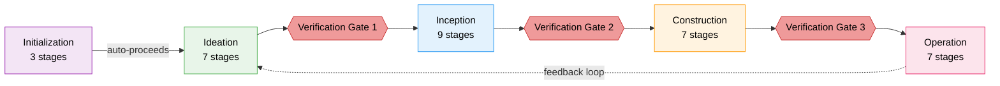

+++
date = '2026-09-30T12:00:00+10:00'
draft = false
title = 'AI-DLC: AI-Driven Development Life Cycle'
tags = ['AI-DLC', 'AI', 'Agentic', 'Software Engineering', 'Methodology', 'AWS', 'Workflow']
summary = 'AI-DLC (AI-Driven Development Life Cycle) is a methodology and deterministic engine that turns AI coding assistants into structured, auditable software-delivery workflows from one harness-neutral core.'
+++

## Introduction

<!-- What AI-DLC is, who builds it, where it lives. One or two paragraphs. -->

- **Repository:** [github.com/awslabs/aidlc-workflows](https://github.com/awslabs/aidlc-workflows)
- **Website / roadmap:** [awslabs.github.io/aidlc-workflows](https://awslabs.github.io/aidlc-workflows/roadmap.html)

## The Problem It Solves

Ask a coding agent to "add OAuth login" and you get working code in minutes. The trouble starts with the questions that come afterwards: why is the token TTL 15 minutes, who approved the refresh flow, which requirement did that satisfy, what did the agent decide on its own, and can anyone reconstruct the same result six months later inside an audit? The answer is usually a scrollback.

That is the core failure mode: **the conversation is the only place the process exists.** The route from request to production lived in chat turns, so everything that does not fit inside a chat turn was never recorded anywhere.

### Seven ways a chat-only workflow fails

**1. Context is volatile.** Harnesses compact when the context window fills, summarizing earlier turns. The framework's own documentation is honest about the boundary — artifacts on disk, the state file and the audit shards survive, while in-memory discussion, work not yet written to files, task IDs and the loaded agent persona are lost. Long-running work is exactly the work that needs continuity, and continuity is exactly what compaction removes. AI-DLC answers this with a per-intent record directory on disk, a state file, and a recovery breadcrumb written _before_ compaction runs, so a resumed session reloads from state rather than from scrollback.

**2. The route is improvised.** With no declared path, the agent decides what to do next on every turn. It may skip requirements analysis for a change that needed it, or produce elaborate architecture for a one-line fix. Nothing records the decision, so the next session quietly makes a different one. The route becomes a decision rather than a preference when a deterministic engine owns the next stage, its scope and its gate.

**3. Rules are prose, and prose is not enforcement.** "Every migration ships a rollback script" in an instructions file is a request, not a constraint. Whether it was honoured depends on whether that file was read this session, how much context survived and how the model felt about it. A rule strong enough to fail a release cannot live only in a prompt, which is why AI-DLC resolves a five-layer rule chain — org, then team, then project, then phase, then stage — once at workflow start.

**4. Gates made of good intentions do not hold.** "Please run the tests before you say you are done" is advice. The agent weighs how urgent the tests are, and the pressure to declare completion is precisely the moment a check gets skipped. A gate that can be talked past is not a gate, so AI-DLC enforces 17 event hooks and 5 fences that refuse an out-of-order transition outright.

**5. Review arrives late, from the wrong vantage.** By the time code is handed over, the agent has already made hundreds of small design decisions inside the same context that wrote the code. A reviewer reading that diff inherits the author's assumptions along with the changes. AI-DLC dispatches two dedicated reviewer agents as separate subagents, before the gate opens, from a context that did not author the code.

**6. Nothing answers "why".** Without a durable record, reconstructing what happened means re-reading a transcript and inferring. Fine for a prototype, useless in a regulated delivery. AI-DLC keeps an append-only audit trail covering 105 event types across 25 categories, so the reasoning survives the session that produced it.

**7. Narrow specialists create handoffs.** This one is about process design rather than tooling. Give each discipline its own agent and you have rebuilt the waterfall — every handoff is a place where context drops and judgement gets deferred to someone who was never in the conversation. AI-DLC inverts this deliberately with 11 broadly capable agents instead of one narrow agent per discipline, each carrying context across several stages and phases.

None of those mechanisms is a prompt. The route, the rules, the checks and the refusals are code or declared data, which is what separates an enforced workflow from a well-written set of instructions.

## What Is AI-DLC

AI-DLC — AI-Driven Development Life Cycle — turns a coding assistant into a software-delivery workflow with a declared route, resolved rules and refusals it cannot argue its way past. The name is the argument. Most "AI development" work treats the assistant as the process; AI-DLC treats it as an execution surface inside a process that was defined before the conversation started.

Its unit of work is the **intent**: one piece of work, given its own record directory, run through five phases and 33 stages, producing artifacts that outlive the session that wrote them. Eleven workflow profiles decide which of those stages a given intent actually runs.

### Methodology plus a deterministic engine

The framework is two halves that meet at a typed contract.

The **methodology** is declarative data — 33 stage definitions, 14 agent personas, workflow scopes, rules, sensors and a two-tier knowledge reference. It is readable, reviewable and versionable, and it describes what should happen without implementing anything.

The **engine** is code, and it owns exactly one question: what happens next. Given the intent's state file and the compiled stage graph, it resolves scope and position and emits **one** typed directive — a JSON contract that is validated before it is printed, so a malformed directive fails loudly rather than becoming an instruction the conductor would act on. It exposes six subcommands: `next` to route, `report` to commit a transition, `park` to pause at a clean boundary, `team-board`, `wait` and an internal `continue`.

The **conductor** is the thin layer that acts on that directive: framing the persona, asking the questions worth asking, keeping the stage diary and surfacing judgement to a human at the gates. The division is deliberate, and the reason is the whole thesis. Routing lives in a tool, never in model prose — handing route-building to a language model would invert the argument this framework exists to make.

### One core, many harnesses

The same core runs natively in Claude Code, Kiro CLI, Kiro IDE, Codex CLI, Cursor, opencode and GitHub Copilot. One installation serves all of them; `aidlc config --harness <name>` writes the configuration for the one you use.

That split exists because harnesses genuinely disagree about how agents, hooks and rules are declared. Each one gets its own native shell — `.claude/`, `.kiro/`, `.github/`, `.opencode/` and so on — carrying subagents, the `/aidlc` command and hook wiring in that harness's own idiom, while the engine tree ships unchanged at `.aidlc/` and the method is read through whatever mechanism the harness provides, whether that is an `@`-import line in `AGENTS.md` or an `instructions` glob. You invoke it as `/aidlc`, except on Codex CLI where it is `$aidlc`.

### Execution is hybrid, and it is instrumented

Not every stage deserves a subagent. Stages that need a human — a clarifying question, an approval gate — run inline, in conversation, where a person can answer. Stages that produce a well-defined artifact run as autonomous subagents and return structured summaries. The framework decides which, per stage, and the distinction is why a gate still feels like a gate.

Everything around that is instrumented rather than trusted: hooks emit audit events and validate state before compaction, fences refuse out-of-order transitions outright, and the append-only trail records 105 event types across 25 categories. Corrections feed back the other way too — when a human overrules the agent, that correction can be promoted into a persistent rule in the team's own method, scoped at org, team, project, phase or stage level, so the framework gets stricter rather than merely longer.

What emerges is not autonomy or a chat window. It is a delivery process whose route, rules, checks and refusals are all things you can read, diff and hold someone to.

## Lifecycle: 5 Phases and 33 Stages

The lifecycle is the framework's spine. Five phases run in order, holding 33 stages between them, and every stage has one job, one lead agent and a declared set of artifacts on disk. Three of the four phase boundaries are protected by verification gates; the fourth closes a feedback loop. Nothing in the sequence is decided at conversation time — the route was compiled before you asked for anything.



### Phase 0 — Initialization

Purpose: bootstrap the workspace. Scaffold the record directory, scan the codebase and initialise state. All three stages run automatically inside a single deterministic tool call — no subagent, no prompt, no approval gate.

| #   | Stage                | Lead         | Key artifacts                         |
| --- | -------------------- | ------------ | ------------------------------------- |
| 0.1 | Workspace Scaffold   | orchestrator | The first intent's record directory   |
| 0.2 | Workspace Detection  | orchestrator | Detected languages, frameworks, build |
| 0.3 | State Initialization | orchestrator | `aidlc-state.md`, `audit/` shards     |

Stage 0.3 is also where the brownfield-or-greenfield verdict is recorded, and that single fact determines whether the next phase opens with reverse engineering.

### Phase 1 — Ideation

Purpose: decide whether this is worth doing and what it is. Stages 1.1, 1.4 and 1.7 always run; the rest are conditional on scope, so a bug fix skips market research while a greenfield feature does not.

| #   | Stage                     | Lead      | Key artifacts                               |
| --- | ------------------------- | --------- | ------------------------------------------- |
| 1.1 | Intent Capture & Framing  | product   | Intent statement, stakeholder map           |
| 1.2 | Market Research           | product   | Competitive analysis, build-vs-buy          |
| 1.3 | Feasibility & Constraints | architect | Feasibility assessment, constraint register |
| 1.4 | Scope Definition          | product   | Scope definition, intent backlog            |
| 1.5 | Team Formation            | delivery  | Team assessment, mob composition plan       |
| 1.6 | Rough Mockups             | design    | Wireframes, user flows, concept deck        |
| 1.7 | Approval & Handoff        | delivery  | Initiative brief, decision log              |

### Phase 2 — Inception

Purpose: elaborate that decision into something buildable. This is the longest phase and the one where existing code gets read properly, which is why it carries the most interesting execution topologies.

| #   | Stage                 | Lead            | Key artifacts                                                         |
| --- | --------------------- | --------------- | --------------------------------------------------------------------- |
| 2.1 | Reverse Engineering   | developer       | 9 artefacts: architecture, component inventory, data flow, risks      |
| 2.2 | Practices Discovery   | pipeline-deploy | `team-practices.md`, promoted to the space's `memory/` on affirmation |
| 2.3 | Requirements Analysis | product         | `requirements.md`                                                     |
| 2.4 | User Stories          | product         | `stories.md`, `personas.md`                                           |
| 2.5 | Refined Mockups       | design          | Hi-fi mockups, interaction spec                                       |
| 2.6 | Domain Design         | architect       | `components.md`, `decisions.md` (ADRs)                                |
| 2.7 | Units Generation      | architect       | `unit-of-work.md`, the dependency DAG, story map                      |
| 2.8 | Contract Design       | architect       | `contract-summary.md`                                                 |
| 2.9 | Delivery Planning     | delivery        | `bolt-plan.md`, team allocation, sequencing rationale                 |

Three stages here do not run like ordinary stages, and the difference is the point. Reverse Engineering is a **two-link pipeline** — a developer scans the code, an architect synthesises and writes — and multi-repo work needs one complete chain per repository before it can be approved. Practices Discovery is a **hub-and-spoke**: the lead drafts, quality, developer and devsecops inspect the draft independently without seeing each other's comments, a human closes the gaps, and only affirmed practices are promoted into the space's method. User Stories run as a **mob**, with design, developer and quality contributing in parallel.

### Phase 3 — Construction

Purpose: build, in reviewable slices. Stages 3.1 to 3.5 run once per unit of work in dependency order; 3.6 and 3.7 run a single time after every unit has converged.

| #   | Stage                 | Lead            | Key artifacts                                   |
| --- | --------------------- | --------------- | ----------------------------------------------- |
| 3.1 | Functional Design     | architect       | `entities.md`, `rules.md`, `functional-spec.md` |
| 3.2 | NFR Requirements      | architect       | Performance, security, scalability NFRs         |
| 3.3 | NFR Design            | architect       | NFR design specifications                       |
| 3.4 | Infrastructure Design | aws-platform    | Infrastructure specs, IaC designs               |
| 3.5 | Code Generation       | developer       | Application code and its documentation          |
| 3.6 | Build and Test        | quality         | Test results, quality report                    |
| 3.7 | CI Pipeline           | pipeline-deploy | CI configuration, quality gates                 |

The ordering is unit-major and serial by default: each unit finishes its design stages and code generation before the next begins, following the DAG from 2.7. The first unit in that DAG is a deliberately small working slice, and you approve it against a real end-to-end command before later units start — a design review passing is not a skeleton running. Parallel execution is available as dependency-ready batches, but the skeleton checkpoint still comes first.

### Phase 4 — Operation

Purpose: ship it and keep it. Every stage here is conditional, because a library, an internal tool and a customer-facing service have very different operational needs.

| #   | Stage                    | Lead            | Key artifacts                                    |
| --- | ------------------------ | --------------- | ------------------------------------------------ |
| 4.1 | Deployment Pipeline      | pipeline-deploy | CD config, deployment strategy, rollback runbook |
| 4.2 | Environment Provisioning | aws-platform    | Environment inventory, validation report         |
| 4.3 | Deployment Execution     | pipeline-deploy | Deployment log, smoke tests, health checks       |
| 4.4 | Observability Setup      | operations      | Dashboards, alarms, SLO configuration            |
| 4.5 | Incident Response        | operations      | SSM runbooks, incident plan, escalation matrix   |
| 4.6 | Performance Validation   | quality         | Load test results, NFR validation matrix         |
| 4.7 | Feedback & Optimization  | operations      | SLO report, cost analysis, feedback loop doc     |

Stage 4.7 is where the loop closes. Its findings feed back into Ideation as a new intent, which is how a framework that treats delivery as a lifecycle stays one: the thing you learn operating the system becomes the next piece of work.

<!-- Initialization, Ideation, Inception, Construction, Operation. Approval gates and feedback loop. -->

## Agents

<!-- 14 agents: 11 domain experts, 2 reviewers, 1 adaptive composer. -->

## Workflow Profiles

<!-- 11 profiles: Classic, Express, features, bug fixes, infrastructure, security, PoCs, enterprise. -->

## What Harness Engineering Actually Means

A **harness** is one command-line agent that the same methodology runs on: Claude Code, Kiro CLI, Kiro IDE, Codex CLI, Cursor, opencode, GitHub Copilot. The stages, agents, scopes and approval gates are identical on every one of them. What changes is the shell — where the config lives, which session events fire, how gates render.

**Harness engineering** is the job of reshaping how AI-DLC behaves for your team. Which stages exist, what each one produces, who leads it, which stages a given piece of work actually runs, which rules hold and which checks verify them. The framework's own design principle is that none of this requires code. You write Markdown with YAML frontmatter and JSON config, and the framework reads it at runtime. Adding a stage, adding an agent, defining a scope: no TypeScript edits anywhere. The moment a change means editing the orchestrator, a hook or a CLI tool, you have crossed into framework development, which is a different job.

The useful mental model is that **stages are what and agents are who**. A stage is a unit of work — it declares the artifacts it consumes and produces, and names the agent that leads it. An agent is a persona — a domain expertise, a tool allowlist, a model. A stage names its lead agent; an agent never names its stages. That asymmetry is on purpose, because it lets you move work around without rewriting the worker, and add a worker without disturbing the workflow until some stage opts to use it.

Everything you shape hangs off five things:

- **Stages** — the units of work and the nodes of the workflow graph.
- **Agents** — the personas loaded into those stages.
- **Scopes** — which stages run for a given kind of work. A bug fix runs 9 of 33; an enterprise feature runs all of them.
- **Rules** — standing decisions that travel into every workflow. Your team's "always do it this way."
- **Sensors** — deterministic checks bound to stages, fired on matching writes or at a gate. A binding is either advisory or blocking.

Two more knobs sit alongside these. **Knowledge** is the domain context agents load before working. **Depth** changes how much detail a stage produces, never which stages run.

This is where harness engineering earns its keep against plain prompt engineering. A prompt is a request, and whether it holds depends on whether the file got read this session, how much context survived the last compaction and how the model happened to feel about it. A stage file is an input to a route that was compiled before you typed anything. The difference shows up in the awkward cases: a conditional stage cannot simply be skipped with a shrug, because the engine refuses the report unless it names the currently active stage and carries a nonblank reason, and records the skip as an audited `[S]`. "Run the tests before you say you are done" is advice. A completion claim without test evidence is a transition the engine will not grant.

One naming trap, if you go read the framework's own docs. _Harness_ carries four senses in that repository: a CLI distribution (the one that matters here), the rule-plus-sensor control loop that was once also called a harness, the `harness/<name>/` source directory, and the `tests/harness/` test helpers. "Harness engineering" is the reshaping activity, not adding a new CLI.

## Harness Support

<!-- Claude Code, Kiro CLI/IDE, Codex CLI, Cursor, opencode, GitHub Copilot. -->

| Harness                        | Configure                         | Invoke   |
| ------------------------------ | --------------------------------- | -------- |
| Claude Code                    | `aidlc config --harness claude`   | `/aidlc` |
| Kiro CLI                       | `aidlc config --harness kiro`     | `/aidlc` |
| Kiro IDE                       | `aidlc config --harness kiro-ide` | `/aidlc` |
| Codex CLI                      | `aidlc config --harness codex`    | `$aidlc` |
| Cursor (IDE and CLI)           | `aidlc config --harness cursor`   | `/aidlc` |
| opencode                       | `aidlc config --harness opencode` | `/aidlc` |
| GitHub Copilot (CLI + VS Code) | `aidlc config --harness copilot`  | `/aidlc` |

## Repository Layout

<!-- core/ as source of truth, harness/ projections, dist* generated. Edit core/, never dist*. -->

## Getting Started

Installation is one command, and it deliberately does not ask you to install a language runtime first. On macOS, Linux or WSL:

```bash
curl -fsSL https://github.com/awslabs/aidlc-workflows/releases/latest/download/install.sh | sh
```

On Windows PowerShell, `irm https://github.com/awslabs/aidlc-workflows/releases/latest/download/install.ps1 | iex` does the same and registers the binary directory in your user `PATH`. The installer drops a checksum-verified `aidlc` command plus a version-matched runtime for every supported harness. Bun and Node.js are not required. If you cannot install a native executable, the fallback is to install Bun, download the `aidlc-copy-runtime-X.Y.Z.tar.gz` release asset and copy its `runtime/<harness>/` directory into your project by hand — that path needs no native binary at all.

Then configure the project, from its root:

```bash
aidlc config --harness claude    # or kiro, kiro-ide, codex, cursor, opencode, copilot
aidlc doctor                     # health check
```

`aidlc config` writes that harness's native shell into the project and records the engine tree at `.aidlc/`. Model provider setup stays where it belongs — with your harness — because shipped configuration preserves the provider and model you already chose.

Finally, open the harness in that project and describe the work:

```text
/aidlc Build a REST API for inventory management
```

On Codex CLI the same command is `$aidlc`. In Kiro IDE you pick **aidlc** in the chat panel's agent picker first. From that prompt AI-DLC selects a workflow profile from your description, asks for any decision it cannot infer, and stops at approval gates before moving on. Bare `/aidlc` with no description resumes the active workflow instead of starting a new one.

## Commands

Everything after that happens through `/aidlc` in your harness, so the command surface is grouped here by what you are trying to do rather than listed exhaustively. The complete reference is `docs/guide/12-cli-commands.md`.

### Starting and steering a run

| Goal                                  | Command                                           |
| ------------------------------------- | ------------------------------------------------- |
| Start with an explicit scope          | `/aidlc <scope>`                                  |
| Start and let the scope be inferred   | `/aidlc <description>`                            |
| Force a tailored execute-or-skip plan | `/aidlc compose "<task>"`                         |
| Resume the active workflow            | `/aidlc`                                          |
| Pause at a clean stage boundary       | `/aidlc park`                                     |
| Jump to a stage or a phase            | `/aidlc --stage <slug>` · `/aidlc --phase <name>` |
| Run one stage without advancing       | `/aidlc --stage <slug> --single`                  |

### Navigating workspaces

| Goal                                 | Command                                                   |
| ------------------------------------ | --------------------------------------------------------- |
| List or switch intents               | `/aidlc intent [name]`                                    |
| Retire an intent without deleting it | `/aidlc intent archive <name>`                            |
| List or switch spaces                | `/aidlc space [name]`                                     |
| Create a space from the baseline     | `/aidlc space-create <name>`                              |
| Read-only status                     | `/aidlc --status`                                         |
| Team Construction board              | `/aidlc team-board`                                       |
| Claim, publish and land a unit       | `/aidlc unit claim` · `publish` · `pin` · `gate` · `land` |

### Documents and knowledge

| Goal                                        | Command                                                                                       |
| ------------------------------------------- | --------------------------------------------------------------------------------------------- |
| Index your own documents and read them back | `/aidlc knowledge onboard` · `sync` · `list` · `show <id>` · `associate <id> --intent <slug>` |

### Tuning this run

| Goal                                               | Command                                                                |
| -------------------------------------------------- | ---------------------------------------------------------------------- |
| Change scope, depth, test strategy or review class | `/aidlc --scope` · `--depth` · `--test-strategy` · `--review`          |
| Read or change a workflow setting                  | `/aidlc config get <key>` · `config set <key> <value>` · `config list` |
| Health check                                       | `/aidlc --doctor`                                                      |
| Shareable diagnostic report                        | `/aidlc --doctor --export`                                             |

### Outside the session

These are native binaries rather than slash commands, and they run in a terminal rather than in your harness.

| Goal                                    | Command                                            |
| --------------------------------------- | -------------------------------------------------- |
| Reproduce a declared multi-repo set     | `aidlc system workspace-sync [--force]`            |
| Drive Construction approvals and swarms | `aidlc engine bolt …` · `aidlc engine swarm …`     |
| Recover or purge set-aside worktrees    | `aidlc engine worktree restore` · `purge`          |
| Pin the engine version for a project    | commit `.aidlc-version`, then `aidlc config --pin` |

## Development

<!-- bun-based toolchain: package, check, tests. -->

## Takeaways

<!-- Key points to remember. -->

## FAQ

**Q1. So how many harnesses are there?**

Seven authored distributions — `claude`, `kiro`, `kiro-ide`, `codex`, `cursor`, `opencode`, `copilot` — serving more surfaces than that. Copilot covers CLI plus VS Code from one tree; Cursor covers the IDE plus the `agent` CLI from one tree. Kiro is the counter-example: it ships as two distributions because the two cannot share the `.kiro/` engine directory (a project may install both without them colliding) and their activation shells differ — CLI resources versus IDE steering. The glossary is explicit that the set is open: adding another harness is mostly writing one `manifest.ts`.

**Q2. The harness compacts the conversation, so what does AI-DLC actually keep across a compaction?**

The compaction itself is entirely the harness's — Claude Code summarises earlier turns when the context window fills and AI-DLC has no say in it. What AI-DLC adds is the durability layer that makes the loss survivable. Crucially, it does **not** transcribe your chat turns. It externalises the workflow's ground truth and treats the conversation as a cache: stage artifacts (`requirements.md`, `code-summary.md`, …), the state file's six-state per-stage checkboxes, the `audit/` event shards, a per-stage `memory.md` diary of interpretations/deviations/tradeoffs/open questions, and a recovery breadcrumb written _before_ compaction.

Two details clarify the boundary. First, the breadcrumb is the only compaction-specific mechanism — a `PreCompact` hook stamps it and the next `/aidlc` compares it against `aidlc-state.md`, warning if they disagree. Second, `HUMAN_TURN` records presence, not words: a `UserPromptSubmit` hook appends a row carrying only the session id so an approval gate can refuse when no human spoke since the last gate (a defence against unattended runners). The one exception is protected challenges such as plan approval and verification-command binding, where your actual reply text is stored so the receipt stays auditable.

So the honest claim is **workflow continuity, not conversational continuity**. After a compaction you can always resume, know exactly which stage you are in, and re-read every artifact — but the nuance of the discussion is gone, any in-flight reasoning that never reached a file is gone, task IDs are rebuilt from state, and the agent persona is reloaded from its file. The framework documents that preserved-vs-lost table rather than papering over it.

**Q3. How does AI-DLC decide which of the 33 stages to run and which to skip?**

In four layers, and only the last one is a judgement call.

1. **Scope membership — declared data.** Every stage file lists the profiles that include it in its `scopes:` frontmatter, and the packager transposes those lists into a compiled grid (`tools/data/scope-grid.json` plus `stage-graph.json`). The route is therefore readable data, not inference: `poc` runs 8 of 33 stages, `bugfix` 9, `classic` 18, `mvp` 23, `workshop` 26, `feature` and `enterprise` all 33. Inspect the live grid with `aidlc engine gen scope-table`.
2. **Scope selection — once per workflow, and you consent to it.** Name it (`/aidlc bugfix`) or let it detect from keywords: a deliberately _lexical_ heuristic where "fix"/"bug" selects `bugfix` and "CVE" selects `security-patch`. It checks every keyword rather than stopping at the first, so "security vulnerability CVE-2026-12345" still lands on `security-patch`; nearby negation like "do not refactor" does not activate a match; ties go to the first scope alphabetically. Anything longer than about five words is usually offered `compose` instead — an adaptive composer that builds a custom scope for work no stock profile fits. Then the workflow _prints the route and waits_: "Starting a `bugfix` workflow for: 'fix login bug' — 8 of 33 stages, 5 approval gates. Confirm to proceed, name a different scope, or say `compose`." Those counts come from the compiled grid rather than an estimate, so you know what you are consenting to before anything runs. Override later with `/aidlc --scope`.
3. **Project type — deterministic.** A workspace scan classifies greenfield versus brownfield during Initialization, and state init then writes `Stages to Execute` and `Stages to Skip` into the state file: brownfield routes into Reverse Engineering (2.1), greenfield skips it and starts at Requirements Analysis (2.3).
4. **Per-stage conditions — the only judgement, and it is fenced.** Eleven stages declare `execution: ALWAYS`; the other 22 declare `execution: CONDITIONAL` alongside a prose `condition:` line — reverse-engineering's reads "Execute when project is brownfield… Skip for greenfield projects." The conductor evaluates that prose and reports `report --stage <slug> --result skipped --reason "<text>"`. The engine then validates the claim: it refuses unless the stage is `CONDITIONAL`, requires a nonblank reason, and requires the report to name the _currently active_ stage exactly, so a stale stage body cannot skip whatever became current. The skip is recorded as `[S]`, is never paired with a completion event, and routing continues.

Three things that look like inclusion decisions but are separate axes: whether a stage _gates_ (needs approval) is computed independently of `execution`; `depth` changes how much detail each stage produces, never which stages run; and Construction stages fan out per Unit of Work (3.1–3.5 for each Unit, 3.6–3.7 once at the end) with individual artifacts pruned by unit kind — a frontend components doc applies only to UI units. If the state file and the scope grid ever disagree, the state file wins, which is what makes a jump or a mid-run scope override take effect immediately.

The practical difference from an improvised route: here you can read the whole path before you start, and the only place judgement enters is a refused-unless-reasoned, audited skip of a stage explicitly marked conditional.

**Q4. I already have domain and architecture documents in a separate folder. Do I have to retype them?**

No — but every intake path is project-root relative. The workflow does not read outside the project and does not follow symlinks, so a folder that lives outside the repository has to come inside first. Which route you want depends on what the documents are.

**Curated Markdown → Tier 2 knowledge.** For distilled material you want in context at every stage — a domain glossary, architecture principles, standards. Drop `.md` files in `aidlc/spaces/<space>/knowledge/aidlc-shared/` and every agent loads them, or in `aidlc/spaces/<space>/knowledge/aidlc-<role>-agent/` and only that agent loads them. The directory name must match the agent slug exactly (`aidlc-architect-agent/`, not `architect/`) or it is silently ignored. There is no registration step: the file's presence is the registration. Keep each file short and single-topic, because agents load the content literally at every stage start. Do not edit `.claude/knowledge/` to add your own context — that is framework material, overwritten on every upgrade.

**Existing files as-is → the DocumentKB catalog.** For PDFs, Word files and anything too large to preload, copy the files into `aidlc/spaces/<space>/knowledge/documents/` (organised however you like) and run `/aidlc knowledge onboard` to sweep the folder, or `onboard <path>` for one file. The constraint worth knowing up front: `onboard` **refuses** a path that lands outside `documents/` — it will not copy an external file in for you. A `linked` source kind exists for corpora that live outside the repo, resolving through a gitignored `knowledge/.sources.local.json` alias map, but no command creates such a row yet, so today you copy the files in. Once indexed, the tool writes a derived catalog under `knowledge/documentkb/` holding extracted text, a digest per revision, and optionally an LLM-authored summary plus tags — summaries are revision-bound, so after editing an original a `sync` marks the old summary invalidated and withholds it rather than serving stale text. Then `sync` reconciles, and `list`, `show <id>` and `associate <id> --intent <slug>` read a document back or scope one to a single workflow — the [commands](#documents-and-knowledge) section lists the full verb set. This is the path that keeps big documents _out_ of the context window: text is retrieved when needed and a summary lets an agent cite the gist without re-reading. Limits worth knowing: 32 MiB per document, a sweep budget of 20 new-or-changed documents or 256 MiB, extraction capped at 50 PDF pages and 200,000 characters with the row flagged `truncated` (so "the document doesn't mention X" is not a safe conclusion), scanned PDFs come back `no_extractable_text` because OCR is out of scope, and `.docx` needs an external extractor. Document text and even filenames are treated as untrusted data, so an imperative sentence inside a vendor contract can never redirect the workflow.

**One-off input, without cataloguing anything.** Name one exact path in your first request — `/aidlc Read ./vision.md and build what it describes` — or paste the content inside a `<document>` … `</document>` block, which the workflow reads as data rather than as instructions to itself. A direct read handles text and Markdown; PDFs and Word files go through the catalog above.

**An existing codebase.** For brownfield work, Reverse Engineering (2.1) scans the repository and produces `codekb/` artifacts — business overview, architecture, code structure, API documentation, component inventory, technology stack, dependencies, quality assessment — each carrying confidence scores. You review and correct them instead of authoring architecture documents by hand.

One distinction decides everything else. If a human reviewer would **reject** a stage's output when the guidance is violated, it belongs in the **rules** layer (`aidlc/spaces/<space>/memory/`, resolved through the org → team → project → phase → stage chain): "never ship a migration without a rollback script". If they would merely use it as background while reviewing, it is **knowledge**: "all new HTTP APIs use API Gateway with a Lambda authorizer in front of every route".

**Q5. My knowledge base is its own repository with a generated hierarchy. Where does that fit?**

It fits well, with one constraint that shapes everything. There is no setting that points team knowledge at an external root — the stage protocol hardcodes exactly two paths, `aidlc/spaces/<active-space>/knowledge/aidlc-shared/` and `aidlc/spaces/<active-space>/knowledge/<agent-name>/`.

The good news is that those paths are a convention rather than a registry. The engine expands the persona plus shipped methodology knowledge into a deterministic context roster; team knowledge is layered on top by the orchestrator reading those directories. There is no manifest, no hashing and no registration step. A template-filling generator that writes into that directory is therefore entirely legitimate — and because knowledge reloads at every stage start, you can regenerate and the next stage picks it up with no reinstall and no restart.

The constraint: team knowledge files are loaded literally and in full at every stage start, so what you generate there has to be **distilled**, not the whole corpus. That is the one place a generated knowledge base fights the framework, and it is a context-budget problem, not an architectural one. Split the generated output three ways:

| What the repository holds                                  | Where it lands                                                                                                          |
| ---------------------------------------------------------- | ----------------------------------------------------------------------------------------------------------------------- |
| Distilled domain model, architecture principles, standards | Generated into `aidlc/spaces/<space>/knowledge/aidlc-shared/`, with per-agent subdirectories for role-specific material |
| Source documents — PDFs, Word files, long decks            | Copied into `knowledge/documents/` by your generator, then indexed with `/aidlc knowledge onboard`                      |
| Prescriptive content — "never do X"                        | `aidlc/spaces/<space>/memory/{org,team,project}.md`, resolved through the rule chain                                    |

Two practical notes. First, there is a `linked` source kind designed for exactly your situation — an external corpus reachable through a gitignored `knowledge/.sources.local.json` alias map, so one developer's directory layout is never committed — but no command creates a linked row today; every `onboard` and `sync` write is a managed copy under `documents/`. Until that is wired up, your generator does the copying. Second, keeping the knowledge repository as a **sibling** of the workspace is a supported layout: sibling repos are auto-discovered as immediate children carrying a `.git`, an optional `repos.json` plus `aidlc-workspace-sync` reproduces the set for a teammate, and it keeps the checkout inside the project root, which the read rules require. The side effect is that the knowledge repository joins the intent's recorded repo set, which anchors git operations in Construction per repo via `--repo <name>` — harmless for a documentation repository, just not invisible.

Two things to avoid. Do not mirror your organisation chart in the directory layout: split by _consumer_ instead, with cross-cutting material in `aidlc-shared/` and only genuinely role-specific content in an agent directory. And do not reach for a symlink at `aidlc/spaces/<space>/knowledge/aidlc-shared` — it would probably work, since the orchestrator simply reads those paths, but nothing documents or tests it and the catalog tooling deliberately refuses symlinks for containment reasons. Unsupported is not the same as forbidden, but it is not something to build on.

**Q6. I cloned the repository. Is the `aidlc` command on my PATH running my code?**

No. `aidlc` is a separately installed, versioned native binary, and it keeps running its released version until you reinstall it. To exercise your own tree, invoke the authored entry point directly — `bun core/tools/aidlc.ts` or the projected `bun dist/<harness>/<harnessDir>/tools/aidlc.ts`. Everything in this repository runs on **bun**; Node and npm cannot substitute for the packager, the tools, the hooks or the test runner.

**Q7. Do the "hats" and "personas" from the community AI-DLC plugins exist here?**

No. That vocabulary belongs to the community implementations, not this repository. The official framework ships 14 agents — 11 broadly capable domain experts, 2 review-only agents and the adaptive composer — plus 33 stages, 11 workflow profiles and a rule/sensor control loop. The [fintech approach post](/blog/ai/fintech/fintech-aidlc-approach/) maps personas and hats onto the methodology as a forward-looking framing; the mapping is a useful lens, but the executable artefacts here are stages, agents, scopes, rules and sensors.

**Q8. What do I actually need installed?**

End users need neither Bun nor Node.js — the native installer drops a checksum-verified `aidlc` binary plus version-matched harness runtimes, and you finish with `aidlc config --harness <name>` and `aidlc doctor`. Bun is needed for the manual copy channel (the `aidlc-copy-runtime-X.Y.Z.tar.gz` release asset) and for anyone building from source.

**Q9. I have several separate repositories — service, infrastructure, documentation. Does each one get an `aidlc/` folder, and does that turn my setup into a monorepo?**

No to both. `aidlc/` never contains source code — it holds workflow metadata only: the method, the knowledge, the per-intent records and the audit trail. Where it goes depends on whether you have one repo or several.

With a single repository you run `aidlc config` at the project root, so `aidlc/` sits beside `pom.xml` and `src/main/java` the way any other top-level directory would. The shipped `.gitignore` settles the question of whether it belongs there, since it contains entries like `aidlc/active-space` that only make sense inside a git repository. That single `aidlc/` folder is created once and committed.

With several repositories the shape changes. Your code repositories do not nest inside each other or inside `aidlc/`; they become siblings of it under a container directory:

```
platform/                    the workspace — the only new repository you create
├── aidlc/                   committed: method, knowledge, intents, audit
├── repos.json               declares which repositories belong
├── checkout-service/        your Java, its own history
├── checkout-infra/          Terraform or Kubernetes, its own history
└── checkout-docs/           documentation, its own history
```

This is the opposite of a monorepo. Every child keeps its own `.git` and its own remote, and the workspace's `.gitignore` carries a managed block with one `/{name}/` line per repository, so the container explicitly excludes them from its own tracking. Nothing is committed across repositories — you get four repositories, one of which contains no code at all, and the workspace pull requests only ever carry `aidlc/` metadata diffs, which means they cannot conflict on code.

The mechanism is a manifest plus a sync tool rather than git submodules. `repos.json` records the expected set, and `aidlc system workspace-sync` reconciles the workspace against it: it clones any declared repository missing on disk from `git@github.com:<org>/<name>.git` (or a per-entry `url` override, so you can mix hosts and forks), rewrites that managed ignore block, and writes an `aidlc.code-workspace` file for opening all of them in an editor. It is idempotent — repositories already on disk are never re-cloned or switched, so a branch mismatch stays advisory rather than failing the run. The manifest never overrides disk either, which means a repository works the moment you clone it, declared or not.

The part that answers "in the same context" is how an intent spans them. The repository set is captured when the intent is created, either from `--repos a,b` or by auto-discovering every immediate child holding a `.git`, and stored in the intent's row in `intents.json`. During Construction each git operation is anchored to the right repository, and one intent that changes service and infrastructure produces two commits, two branches and two pull requests that share one audit trail in the workspace. Reverse Engineering runs a complete pipeline chain per registered repository rather than one chain across all of them. If you want to narrow an intent to the repositories it actually touches, pass `--repos` at creation instead of accepting the whole sibling set.

Two limits are worth knowing before you commit to a layout. Discovery only looks at immediate children, one level deep, so you cannot group repositories under a `repos/` subdirectory, and each on-disk directory name must be the single safe path segment recorded as its name. And committing `aidlc/` is what makes the method, the state and the audit trail shareable — leave it uncommitted and the workflow still runs, but each developer's copy diverges silently and nothing carries over.

**Q10. My knowledge base, my code and my infrastructure are separate repositories. Does the framework treat them as one unit?**

It treats them as one workspace with three separate repositories — see the previous answer for the layout, the manifest and the sync tool. The distinction that matters is which ones an intent may _write_ to, because the recorded repository set is a write scope rather than a general association. Source code and infrastructure belong in it, since both change during a run and their changes have to stay ordered with respect to each other. Documentation that ships alongside the change, such as a README or a runbook, belongs in it too.

A generated knowledge base does not. It is knowledge rather than code, and putting it in the repository set would make it a build target that Construction writes into, which is the wrong ownership model. Keep it as a read-only sibling, or materialise the distilled form into the shared knowledge directory as described earlier. Either way it stays available as context without becoming something the intent rewrites.

The per-repository knowledge that reverse engineering produces is stored separately again, under `codekb/<repo>/` in the workspace: each repository gets its own architecture notes, component inventory and freshness marker, committed once in the workspace rather than duplicated into every checkout. So the framework holds three distinct kinds of material in three distinct places — shared knowledge for what the team knows, `codekb/` for what each repository is, and the intent's recorded repository set for what this particular run is allowed to change.

## References

- [AI-DLC Workflows repository](https://github.com/awslabs/aidlc-workflows)
- [AWS AI-DLC blog post](https://aws.amazon.com/blogs/devops/ai-driven-development-life-cycle/)
- [AI-DLC Method Definition Paper](https://prod.d13rkk8cj2z0.amplifyapp.com/)
