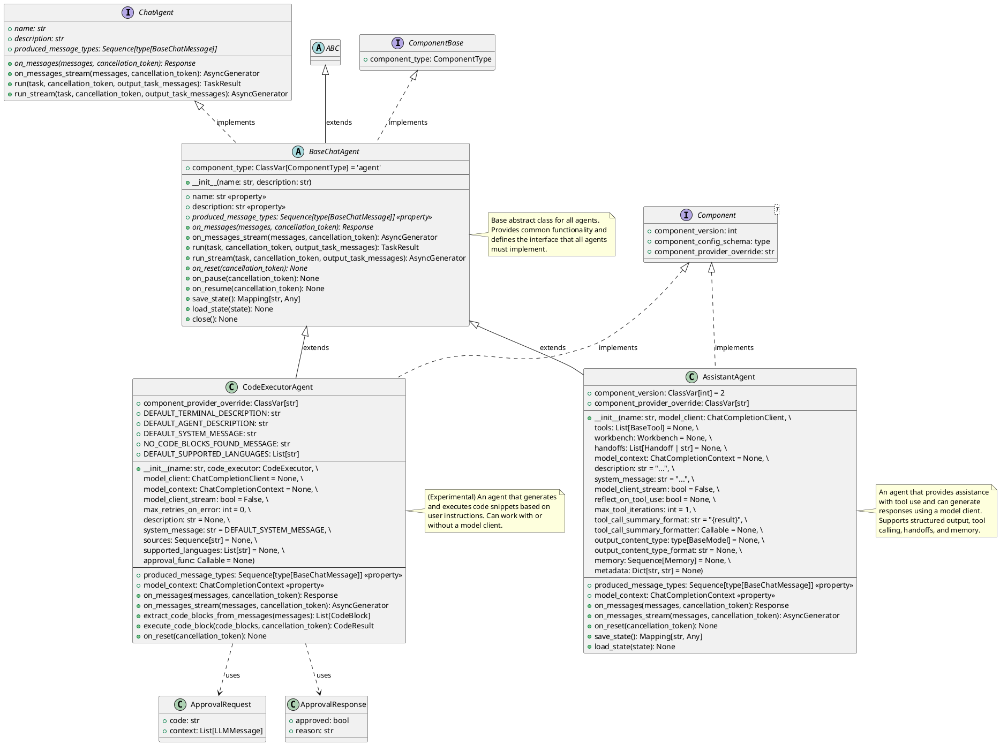

+++
date = '2025-12-22T12:44:47+10:00'
draft = false
title = 'Autogen Patterns'
tags = ['Autogen', 'Agnetic AI', 'Design Patterns']
summary = "Autogen Patterns"
+++

## Introduction

## Architecture

## PlantUML

