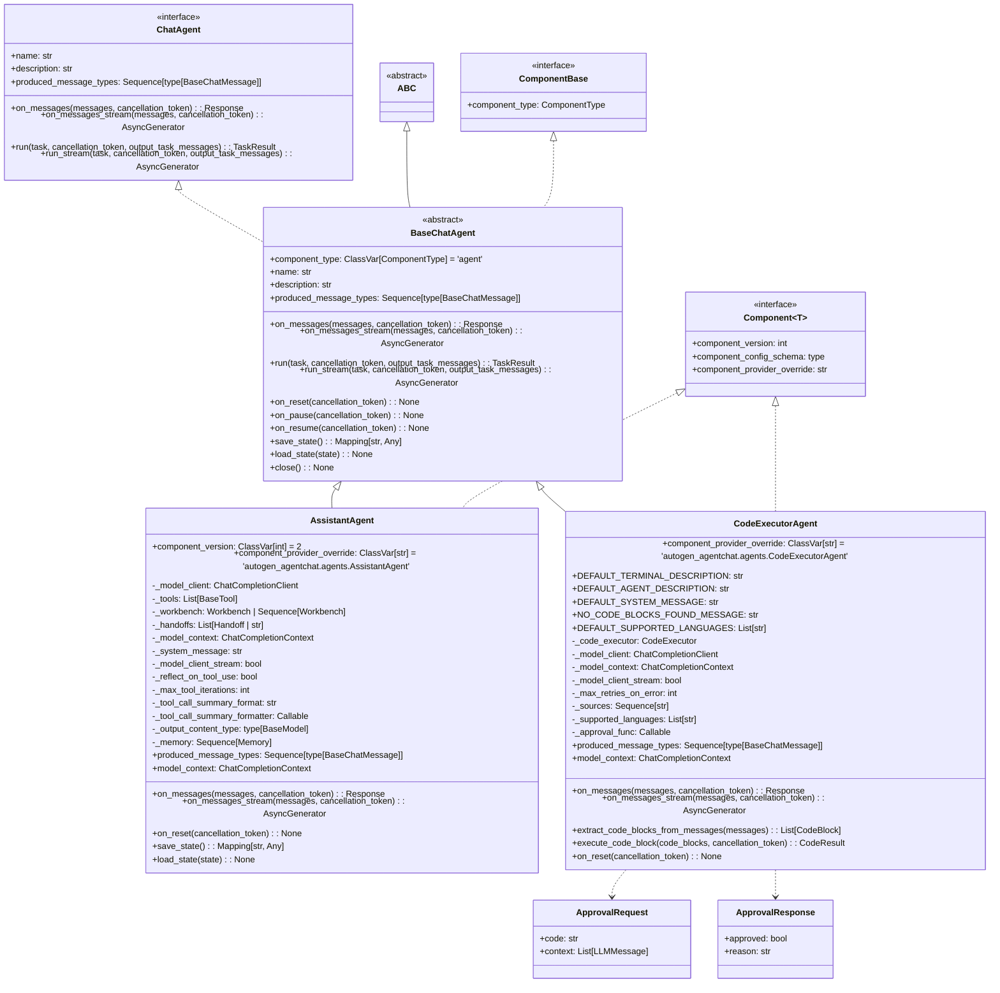

+++
date = '2025-12-22T12:44:47+10:00'
draft = false
title = 'Autogen Patterns'
tags = ['Autogen', 'Agnetic AI', 'Design Patterns']
summary = "Autogen Patterns"
+++

## Introduction

## Architecture

### Components
- [Source](https://github.com/microsoft/autogen/tree/main/python/packages)
#### Apps
- [Magentic One](https://microsoft.github.io/autogen/stable//user-guide/agentchat-user-guide/magentic-one.html) - Prebuilt application by microsoft
#### Frameworks
- [Extension](https://microsoft.github.io/autogen/stable/user-guide/extensions-user-guide/index.html)
- [Agent Chat](https://microsoft.github.io/autogen/stable/user-guide/agentchat-user-guide/index.html)
  - **Definition** - AgentChat is a high-level API for building multi-agent applications. It is built on top of the autogen-core package. For beginner users, AgentChat is the recommended starting point. For advanced users, autogen-core’s event-driven programming model provides more flexibility and control over the underlying components.
- [Core](https://microsoft.github.io/autogen/stable/user-guide/core-user-guide/index.html) 
  - **Definition** - AutoGen core offers an easy way to quickly build event-driven, distributed, scalable, resilient AI agent systems. Agents are developed by using the Actor model. You can build and run your agent system locally and easily move to a distributed system in the cloud when you are ready.
  - is Foundation and is rebuilt in version 0.4 v/s 0.2
  - **Asynchronous Messaging** - Agents communicate through asynchronous messages, enabling event-driven and request/response communication models. 
  - **Scalable & Distributed** - Enable complex scenarios with networks of agents across organizational boundaries. 
  - **Multi-Language Support** - Python & Dotnet interoperating agents today, with more languages coming soon. 
  - **Modular & Extensible** - Highly customizable with features like custom agents, memory as a service, tools registry, and model library. 
  - **Observable & Debuggable** - Easily trace and debug your agent systems. 
- **Event-Driven Architecture** - Build event-driven, distributed, scalable, and resilient AI agent systems.
  
#### Developer Tools
- [Studio](https://microsoft.github.io/autogen/stable/user-guide/autogenstudio-user-guide/index.html)
  - no coding
- Bench
  - Testing ground
  - Test AI models e.g. for
    - performance
    - parallelism
    - cost
   

