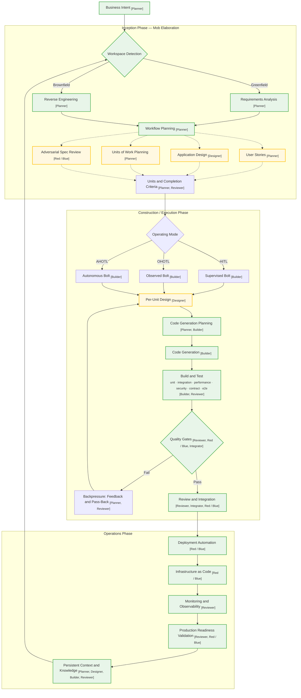

+++
date = '2026-09-01T09:10:00+10:00'
draft = false
title = 'AI-DLC Notes: Trends and the Autonomy Spectrum'
tags = ['AI-DLC','Agentic AI','Fintech','Process']
summary = "Where AI-DLC and the spectrum of AI development autonomy are heading."
+++

### The Autonomy Spectrum: Where Teams Actually Land

### Where the Trend Is Heading

### The AI-DLC Workflow

The workflow combines the three phases, the adaptive workflow stages, the operating modes and the quality-gate loop. Dashed edges are conditional stages; solid edges are mandatory. **Green nodes** are mandatory stages (always run); **yellow nodes** are conditional stages (run only when complexity warrants).

**Hat responsibilities**

Think of these as the roles the AI or team plays at different moments in the workflow. They are not strict job titles; they are responsibilities that help keep planning, design, delivery, review and security separate.

- **[Planner]**
  - Defines the goal and clarifies what is still unknown
  - Breaks the work into smaller Units and turns the goal into clear completion criteria
  - Chooses priorities, dependencies, operating mode and the next step to take
  - Tracks assumptions, open questions, risks and blockers
  - Updates the plan when new evidence or review feedback changes the direction
  - Source: Bushido Collective, "The Hat System — [Planner]", AI-DLC. https://ai-dlc.dev/docs/hats#planner

- **[Designer]**
  - Turns the requirement into a workable design for the system, data, interfaces or user experience
  - Defines the structure, boundaries and flow of the solution
  - Compares options and makes trade-offs explicit
  - Specifies important quality constraints such as usability, accessibility and reliability when needed
  - Produces a design the Builder can implement and the Reviewer can check
  - Source: Bushido Collective, "The Hat System — [Designer]", AI-DLC. https://ai-dlc.dev/docs/hats#designer

- **[Builder]**
  - Implements the agreed plan in small steps
  - Writes or updates code, tests, infrastructure and supporting artifacts
  - Uses tests, linting, type checks and security checks as feedback while building
  - Documents progress, decisions and blockers as work moves forward
  - Keeps iterating until the criteria are met or a human decision is needed
  - Source: Bushido Collective, "The Hat System — [Builder]", AI-DLC. https://ai-dlc.dev/docs/hats#builder

- **[Reviewer]**
  - Checks whether the result actually meets the stated completion criteria
  - Reviews correctness, maintainability, security, edge cases and operational readiness
  - Verifies the relevant tests, quality gates and evidence before approving work
  - Identifies defects with clear, actionable feedback
  - Approves the work or requests changes with a reasoned explanation
  - Source: Bushido Collective, "The Hat System — [Reviewer]", AI-DLC. https://ai-dlc.dev/docs/hats#reviewer

- **[Red / Blue]**
  - **Red Team:** tries to break the design or implementation and looks for security flaws, bypasses and unsafe assumptions
  - **Blue Team:** fixes the confirmed problems and adds defensive controls and regression tests
  - Covers issues such as injection, auth bypass, privilege escalation, data exposure and insecure configuration
  - Keeps attack testing separate from remediation so the review stays objective
  - Re-tests the hardened result and records unresolved risks for human review
  - Source: Bushido Collective, "The Hat System — [Red Team] / [Blue Team]", AI-DLC. https://ai-dlc.dev/docs/hats#red-team

- **[Integrator]**
  - Checks that completed Units work correctly together across the full intent
  - Verifies APIs, contracts, data flow and cross-unit behaviour
  - Runs the final verification across the combined result
  - Confirms the work satisfies the end-to-end criteria for the whole task
  - Accepts the integrated result or sends the relevant Units back for rework
  - Source: Bushido Collective, "The Hat System — [Integrator]", AI-DLC. https://ai-dlc.dev/docs/hats#integrator

#### Stage-by-stage breakdown

- **Business Intent**
  - can be any - **business problem, high-level goal, feature or technical outcome**
  - Key difference from a traditional Epic: an Epic describes _what_ to build (a solution the team already understands); by the time you discuss Epic you have full scope, stories, acceptance criteria and dependencies. **Epic focuses on decomposition**
  - an Intent only describes the _why_ part - outcome you are going get AI to clarify and build. You purposfully make the Intent  ambiguous — it is deliberately vague so the **AI discovers scope through questions** rather than executing a pre-baked plan. **Intent focuses on discovery**
  - There is no one replacement for Epic. AI-DLC distributes that across the repository: 
    - **Intent holds purpose**, **Unit decomposition holds scope**, **the Unit DAG holds dependencies**, **Knowledge Artifacts hold domain context**
  - Example: 
    - Provide accurate, real-time balance visibility and control for telecom customers.
    - I want to migrate a legacy system Flexy into microservice.
    - Reduce API latency by 50% for this endpoint.
    - Costing looks wrong in the current system. Help fix it without breaking the existing calculation.
  - References
    - [Matt Pocock's Grill me skill](https://www.aihero.dev/skills-grill-me)
    - [Matt Pocoks whole Playlist](https://www.youtube.com/watch?v=gaDdrDdczO4&list=PLH-fZ_5p3Lrc&index=1)
    - [Einstellung effect](https://en.wikipedia.org/wiki/Einstellung_effect) the AI's training corpus is its mental set 
      - **AI question bias risk**: . If the AI's questions frame the solution space toward familiar patterns, the answers will be too. For greenfield projects this risk is highest — no existing codebase, no Knowledge Artifacts, nothing domain-specific to ground the AI's questions
  - The defence: context engineering (loading domain-specific knowledge into the window) and human oversight (the team validates or corrects)
    - [Socratic Questioning or Guided Discovery](https://en.wikipedia.org/wiki/Socratic_questioning)

- **Workspace Detection**
  - The workflow branches on whether the project is greenfield or brownfield — (talking to aws folks part...).
  - **Templates**: Empty scaffolds the knowledge layer exists but enforces thought pattern/direction across Fintech.
  - **Knowledge bootstrap**: the AI reads the codebase and produces structured knowledge (architecture, module boundaries, data flow, conventions) with confidence ratings

  - **Greenfield**
    - A greenfield project is a project that starts from scratch with no existing product, codebase, infrastructure, or legacy system to preserve.
    - Opportunity to start Top Down approach from Day 1. **Understand** else **Counter productive.**
    - **The "greenfield gap"**: before Mob Elaboration there is nothing between the Intent and the Units — the decomposition only exists after the AI asks questions and the team validates
  - **Brownfield** 
    - We have teams with 
      - Full Documentation
      - No Documentation 
      - Outdated/incorrect documentation 💀
    - Skills to convert code into a well defined template driven document using concepts like Abstract Syntax Tree, Queryable Knowledge Graph.
 - References
   - [Greenfield Gap](https://ai-dlc.dev/paper#lifecycle-entry-points)

- **Workflow Planning**
  - The AI decides which stages apply based on complexity — this is what makes the workflow _adaptive_ rather than linear
  - A one-line bug fix skips planning and goes straight to code generation; a complex feature runs the full chain (User Stories → Application Design → Units of Work Planning → Adversarial Spec Review)
  - Encodes the mandatory-versus-conditional split: the AI assesses the request's shape and selects which stages to execute
  - **Three properties that make this work** (per AWS): adaptive decisioning (conforms to the problem's shape), transparent checkpoints (human approvals at every gate), end-to-end traceability (every artifact and decision is logged)

- **User Stories (conditional)**
  - Skipped for well-understood tasks (e.g. "context engg compliant", "simple task like adding an end point") where the intent is self-explanatory for other cases where features are complex complex or the scope needs to be broken down into testable, reviewable chunks
  - The AI proposes stories; the team validates or corrects — the conversation _is_ the artifact

- **Application Design (conditional)**
  - Architecture, domain model and interface decisions — only when the work touches specilised or complex architecture e.g. 
    - Specialised Application Design Decisions like a combination of decomposition strategy based e.g. after you have functionally decomposed a system you want to partition a specific function.
    - The test suite, not the architecture document, becomes the source of truth
 
 - **Adversarial Spec Review (conditional)**
  - this stage pushes the team to defend the design before build work starts. 
  - interrogates the proposed plan
  - hidden assumptions and weak spots 
  - we introduced this - it's basically challenging the specs before anything is built — **cost of fixing a bug quickly increases as it goes further in any lifecycle**.
  - **Fresh eyes principle**: a different model or clean session reviews the output, not the same model that generated it. 
    - Claude Code can spawn subagents; 
    - Cursor/Copilot/VS Code can open a new chat or use a different model. 
    - CI/CD integration is the most portable approach

- **Units of Work Planning (conditional)**
  - Decomposes the intent into Units, each with a chosen operating mode (HITL, OHOTL, AHOTL) and completion criteria
  - **A Unit is the unit of autonomy, not just the unit of scope** — it determines how much human oversight the work requires.
  - **Epic v/s Unit**
    - In traditional agile, an Epic is big (spans multiple features, teams, repos and sprints). 
    - A Unit is feature-scoped: a focused piece of work within a single Intent
  - The scope shrinks because AI handles the decomposition that traditionally required human planning — backlog grooming, Epic writing, story splitting
  - The AI-managed part of AI-DLC _is_ this decomposition work, which is why Unit replaces Epic at a smaller granularity

- **Units and Completion Criteria**
  - The validated output of Inception: precise, verifiable conditions per Unit that gate autonomy
  - **"Precision enables autonomy"**: "Make auth better" v/s "users can reset passwords, reset tokens expire after 15 minutes, all auth endpoints have tests and the security scan has no critical findings" gives the agent a target it can iterate toward
  - **Agile v/s AIDLC**
    - **Definition of Done**, is a Agile/Scrum concept - shared checklist e.g. DoD says "code is reviewed"; 
    - **Completion Criteria** - Completion Criteria say exactly what must be true for each **Unit**
      - **Forward-looking idea:** evidence-backed completion verification — the gate produces a human-reviewable proof document (per-criterion scores, justification, line-level references) rather than a bare pass/fail, making the gate's verdict inspectable and auditable

- **Operating Mode selection**
  - Bolt is an execution of a slice of work. 
  - Each Bolt runs depending on the work's shape and risk — **a deliberate choice per Unit** is made here.
  - HITL = Human-in-the-loop
    - the AI does work with direct human approval or guidance at key points used when requirements are unclear, risk is high, or the task is novel 
  - OHOTL = Observed human-over-the-loop
    - the AI works mostly autonomously, but a human watches and can intervene if it drifts used for moderate-risk, somewhat familiar work where oversight is useful but not constant
  - AHOTL = Autonomous human-over-the-loop
    - Here is the real power of what we do.
    - the AI works independently within defined bounds, with humans checking afterwards or only when exceptions arise. 
    - Used when your the task is well-understood and the context is created well enough to let the agent iterate without constant input.

- **Per-Unit Design (conditional)**
  - Design stages that run only when a Unit warrants them — conditional on the Unit's complexity and risk profile
  - For simple Units (e.g. CRUD endpoints, documentation updates) this stage is skipped entirely
  - For complex Units (e.g. implement a specific algorithmic scaling, architecture changes) this produces the per-unit design before code generation begins
  - **Community implementation breaks this into four conditional sub-stages:** 
    - **Functional Design** (unit-level architecture, interface contracts, data models)
    - **NFR Requirements** (performance targets, security constraints, scalability needs)
    - **NFR Design** (caching strategy, auth patterns, capacity planning) 
    - **Infrastructure Design** (Terraform modules, CloudFormation, container definitions). Each runs only when the Unit's complexity warrants it
  - Reads the domain design from Inception as input — Construction does not invent the domain model, it realises it

- **Code Generation Planning**
  - The agent lays out the implementation plan before writing any code — **think before you build**
  - The agent decides: file structure, module boundaries, data flow, interface contracts, test strategy
  - The plan is reviewed before execution begins, catching structural issues before code exists

- **Code Generation**
  - AI implements code and supporting artifacts, unit by unit — the [Builder] hat is the primary executor
  - Multiple Units can run in parallel through Mob Execution: collocated teams each own a Unit, exchange integration specifications (API contracts, event schemas) and coordinate cross-unit concerns at human checkpoints
  - AI collapses the designer-to-developer handoff — the artifact _is_ the design — so every discipline builds through the same loop

- **Build and Test**
  - Six test types run against the implementation: 
    - unit
    - integration
    - performance
    - security
    - contract 
    - end-to-end
  - The test suite is the source of truth — not the architecture document, not the design spec
  - TDD workflow: write failing tests before implementation; BDD-style extends this to acceptance tests written before implementation
  - **"You cannot improve what you do not measure"** — the test suite is the measurement instrument

- **Quality Gates**
  - Harness-enforced checks (tests, lint, types) that block progress until all pass — **the agent cannot advance, hand off or declare work complete otherwise**
  - **"The agent cannot rationalise its way around a failing hook"** — qualitatively different from asking AI to "run the tests"
  - Four properties make enforcement robust:
    1. **Auto-detection during elaboration** — the discovery skill inspects repository tooling (`package.json`, `go.mod`, `pyproject.toml`, `Cargo.toml`) and proposes gate commands, which the team confirms
    2. **Additive merge with a ratchet** — confirmed gates are saved to the Intent's frontmatter; builders may add unit-specific gates during construction, but gates are add-only. Removing a gate triggers a request-changes decision. **Quality standards can only move forward**
    3. **Scoped enforcement** — only building hats (builder, implementer, refactorer) are gate-enforced; planner, reviewer and designer hats skip silently (a failing test should not block a mid-review objective)
    4. **Loop prevention** — a `stop_hook_active` flag lets a subagent that has already been blocked once stop on its second attempt, preventing deadlock in nested scenarios
  - Gates are frontmatter-driven — they live in the Unit's configuration, not scattered across CI scripts

- **Backpressure: Feedback and Pass-Back (fail)**
  - Failing gates push work back through design, code generation and testing until it converges — **the inner feedback loop**
  - This is not "go fix it" — the agent receives structured feedback (which gate failed, what was expected, what was observed) and iterates
  - The loop continues until all gates pass or the agent escalates to human review
  - **Backward flow becomes normal rather than exceptional** — a later pass discovering a constraint that invalidates an earlier assumption sends work back without anyone declaring failure
  - High churn (many iterations per Bolt) usually means poorly written completion criteria — the measurement feedback loop

- **Review and Integration (pass)**
  - Passing work is reviewed, integrated across Units and checked for cross-unit coherence
  - **Review is not a rubber stamp** — the [Reviewer] hat verifies completion criteria, checks diff quality and confirms the Unit meets its declared success conditions
  - Cross-unit integration: when multiple Units run in parallel, this stage catches conflicts, duplicate logic, inconsistent interfaces and broken contracts between Units
  - The [Red Team] hat can be activated here for adversarial code review — probing for spec violations, security issues, edge cases and anti-patterns before the work moves to Operations
  - High-confidence mechanical fixes apply automatically; everything else goes back to the team

- **Deployment Automation (Operations)**
  - Production deployment pipelines, rollback procedures and release orchestration — operational work is **file-based**, not runbook-based
  - Three operation types (each lives as a spec in `.ai-dlc/{intent}/operations/`):
    - **Scheduled** — cron-driven tasks (secret rotation, cache warming, log rotation)
    - **Reactive** — trigger-driven responses (rollback on error-rate spikes, alert on threshold breach)
    - **Process** — human-cadence routines (quarterly security reviews, compliance audits)
  - Agent-owned scripts execute autonomously within boundaries; human-owned checklists are tracked by the agent
  - Each intent ships a **Deployment Unit** bundling code artifacts, configuration, infrastructure definitions and validation suites with automated rollback procedures

- **Infrastructure as Code (Operations)**
  - Infrastructure definitions, configuration management and environment provisioning managed through version-controlled specs
  - IaC lives alongside application code — the same git repository, the same review process, the same quality gates
  - Enables reproducible environments: the same spec produces dev, staging and production environments
  - Infrastructure changes go through the same Construction pipeline as application code — plan, implement, test, gate, review

- **Monitoring and Observability (Operations)**
  - Monitoring setup, alerting, logging and observability configuration to track production behaviour and surface issues
  - **The virtuous loop**: monitoring feeds back into the coding agent's context and informs future Inception cycles — production behaviour becomes input for the next Intent
  - Example: an error-rate spike detected by monitoring triggers a reactive Operation (automatic rollback) and simultaneously feeds context into the next Inception cycle so the root cause is addressed in the next Bolt
  - Observability data becomes part of the Persistent Context — future sessions know what happened in production

- **Production Readiness Validation (Operations)**
  - Pre-deployment checks confirming the system meets SLOs, runbooks are in place and rollback is ready before release
  - **The boundary gate between Construction and Operations** — validates the integrated codebase, not individual Units
  - Checks: architecture-to-code-to-tests alignment, all code traces to design, test coverage meets acceptance criteria
  - Runbooks, rollback readiness and SLO conformance are verified — the system is not released until these are confirmed
  - For regulated domains (fintech): auditable checkpoints at requirements sign-off, design approval, code review and release approval, with autonomous work permitted between them

- **Persistent Context and Knowledge**
  - Plans, requirements, design artifacts and operational knowledge stored in the repo feed the next Inception cycle — **the outer feedback loop**
  - **"Artifacts are memory"**: intents, unit progress and decisions persist as committed files so the context window can be reset without losing ground truth. The community implementation treats `/clear` as a feature, not a bug
  - Five memory providers the agent can query:

    | Layer          | Location                   | Speed   | Purpose                                          |
    | -------------- | -------------------------- | ------- | ------------------------------------------------ |
    | Rules          | Project rule files         | Instant | Conventions, patterns, constraints               |
    | Session        | Working files, scratchpads | Fast    | Current task context and progress                |
    | Project        | Git history, codebase      | Indexed | What was tried and what worked                   |
    | Organisational | Connected systems via MCP  | Query   | Institutional knowledge: tickets, ADRs, runbooks |
    | Runtime        | Monitoring systems         | Query   | Production behaviour and incidents               |

  - **Context economy warning**: model performance degrades once the window passes ~40–60% utilisation (the "dumb zone"). Material buried mid-context receives less attention than whatever sits at the edges. Countermeasures: monitor context budget with alerts, extract static reference material into companion files, inject prior-bolt learnings lazily at point of use, scope context per role (the reviewer hat sees the diff and completion criteria, never the full elaboration history)
  - **The 19-agent trap**: scaffolding one agent per job title (mirroring the org chart) loses context at every handoff. Complex swarms consistently underperform simple loops with rich relevant context. Personas succeed when they bundle review and oversight hats around one build loop, not when they spawn a dedicated agent per role
  - Completion announcements: an intent declares its announcement channels in frontmatter and the completed artifacts generate changelog entries, release notes, social posts or blog drafts — closing the gap between code-complete and users knowing about it

#### AI-DLC Persona-to-Hat Mapping

The AI-DLC personas below can wear one or more hats depending on the work being performed. The mapping combines the implementation's domain agents, reviewer agents and adaptive workflow composer with common Scrum and delivery roles.

| Persona                                               | Hat mapping                                                |
| ----------------------------------------------------- | ---------------------------------------------------------- |
| Product Owner / Product Manager / Business Analyst    | [Planner], [Reviewer], [Red / Blue]                        |
| UX / Product Designer                                 | [Designer], [Builder], [Reviewer]                          |
| Scrum Master / Delivery Manager / Engineering Manager | [Planner], [Integrator], [Reviewer]                        |
| Solutions Architect / Technical Architect             | [Planner], [Designer], [Builder], [Reviewer], [Integrator] |
| AWS Platform Engineer                                 | [Designer], [Builder], [Reviewer]                          |
| Compliance Specialist                                 | [Planner], [Reviewer], [Red / Blue]                        |
| DevSecOps Engineer                                    | [Builder], [Reviewer], [Red / Blue]                        |
| Developer / Scrum Team Developer                      | [Planner], [Builder], [Reviewer]                           |
| QA Engineer / Tester                                  | [Builder], [Reviewer], [Red / Blue]                        |
| Pipeline and Deployment Engineer                      | [Builder], [Integrator], [Reviewer]                        |
| SRE / Operations Engineer                             | [Builder], [Reviewer], [Integrator]                        |
| Stakeholder                                           | [Planner], [Reviewer]                                      |
| Product Lead Reviewer                                 | [Reviewer]                                                 |
| Architecture Reviewer                                 | [Reviewer]                                                 |
| Adaptive Workflow Composer                            | [Planner], [Integrator]                                    |

### Notes

- The phrase "this single decision determines how all of Inception proceeds" refers to the company's internal workflow branching: greenfield skips Reverse Engineering while brownfield runs it first. The remaining Inception stages are common to both paths.
- The composite hat labels in the workflow diagram are intentional and remain unchanged.

### References

- Raja SP, _AI-Driven Development Life Cycle_, AWS DevOps Blog, 31 Jul 2025. https://aws.amazon.com/blogs/devops/ai-driven-development-life-cycle/
- Bushido Collective, _AI-DLC 2026_, Jan 2026. https://ai-dlc.dev/paper
- Bushido Collective, _The Hat System_, AI-DLC Docs. https://ai-dlc.dev/docs/hats
- AWS AI-DLC Method Definition. https://prod.d13rzhkk8cj2z0.amplifyapp.com/aidlc.pdf
- awslabs/aidlc-workflows, _Phases and Stages_. https://awslabs.github.io/aidlc-workflows/guide/04-phases-and-stages/
