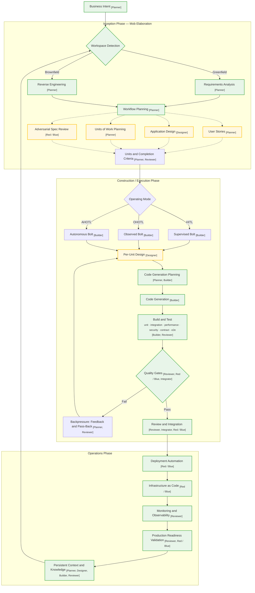

+++
date = '2026-09-02T09:10:00+10:00'
draft = true
title = 'AI-DLC Notes: Trends and the Autonomy Spectrum'
tags = ['AI-DLC','Agentic AI','Fintech','Process']
summary = "Where AI-DLC and the spectrum of AI development autonomy are heading."
+++

### The Autonomy Spectrum: Where Teams Actually Land

### Where the Trend Is Heading

### The AI-DLC Workflow

The workflow combines the three phases, the adaptive workflow stages, the operating modes and the quality-gate loop. Dashed edges are conditional stages; solid edges are mandatory. **Green nodes** are mandatory stages (always run); **yellow nodes** are conditional stages (run only when complexity warrants).

**Hat responsibilities**

- **[Planner]**
  - Clarifies the Intent and identifies what still needs to be understood
  - Breaks the work into Units, Bolts and verifiable completion criteria
  - Selects priorities, dependencies, operating modes and the next execution steps
  - Records assumptions, open questions, risks and possible blockers
  - Revises the plan when new evidence or review feedback changes the shape of the work

- **[Designer]**
  - Turns requirements into domain, system, interface or user-experience designs
  - Defines architecture, component boundaries, data models and interaction flows
  - Evaluates design alternatives and makes trade-offs visible
  - Specifies responsive behaviour, accessibility and other quality attributes when relevant
  - Produces designs that the Builder can implement and the Reviewer can verify

- **[Builder]**
  - Implements the approved plan and completion criteria one increment at a time
  - Writes or updates application code, infrastructure, tests and supporting artifacts
  - Uses test, lint, type, security and other quality checks as backpressure
  - Documents progress, decisions and blockers while working
  - Iterates until the criteria are met or a human decision is required

- **[Reviewer]**
  - Checks every completion criterion against the implementation and its evidence
  - Reviews correctness, maintainability, security, edge cases and operational readiness
  - Runs or verifies the relevant tests, quality gates and traceability links
  - Identifies defects with specific, actionable feedback ordered by severity
  - Approves the work or requests changes with a clear rationale

- **[Red / Blue]**
  - **Red Team:** attacks the design or implementation to find vulnerabilities, bypasses and unsafe assumptions
  - **Blue Team:** fixes confirmed findings with defensive controls and regression tests
  - Covers threats such as injection, authentication bypass, privilege escalation, data exposure and insecure configuration
  - Keeps discovery separate from remediation so the security review remains objective
  - Re-tests the hardened result and records unresolved risk for human review

- **[Integrator]**
  - Verifies that completed Units work together across the merged intent
  - Checks shared APIs, data flows, contracts, dependencies and cross-unit behaviour
  - Runs the full intent-level verification suite after integration
  - Confirms the combined result satisfies criteria that span multiple Units
  - Accepts the integrated work or identifies the Units that must return for rework

#### Stage-by-stage breakdown

- **Business Intent**
  - can be any - business problem, high-level goal, feature or technical outcome 
  - Key difference from a traditional Epic: an Epic describes _what_ to build (a solution the team already understands); an Intent describes _why_ (an outcome the AI must first clarify)
  - **"Epic decomposes; Intent discovers"** — the Intent is the starting point for AI-driven decomposition into Units, not a fully-scoped work item
  - deliberately vague so the AI discovers scope through questions rather than executing a pre-baked plan
  - Example: "Add OAuth login", "Reduce API latency by 50%", "Migrate from monolith to microservices"
  - In traditional agile, an Epic holds full scope, stories, acceptance criteria and dependencies in one document. AI-DLC distributes that across the repository: Intent holds purpose, Unit decomposition holds scope, the Unit DAG holds dependencies, Knowledge Artifacts hold domain context — no single file replaces the Epic
  - Hat: [Planner]

- **Workspace Detection**
  - The workflow branches on whether the project is greenfield or brownfield — this single decision determines how all of Inception proceeds
  - **Greenfield** → the AI creates candidate requirements from scratch (no existing codebase to learn from)
  - **Brownfield** → the AI first reverse-engineers the existing codebase into knowledge artifacts before doing any new work
  - Brownfield detection triggers a knowledge bootstrap phase that synthesises the codebase with confidence scores

- **Requirements Analysis (greenfield)**
  - No existing codebase; the AI converts the intent into candidate requirements, user stories and units for the team to validate
  - **The "greenfield gap"**: before Mob Elaboration there is nothing between the Intent and the Units — the decomposition only exists after the AI asks questions and the team validates
  - In traditional agile you would write the Epic first with full scope, then decompose. In AI-DLC the Intent is deliberately vague — the AI is supposed to discover the scope through questions
  - **AI question bias risk**: the AI's training corpus is its mental set (Einstellung effect). If the AI's questions frame the solution space toward familiar patterns, the answers will be too. For greenfield projects this risk is highest — no existing codebase, no Knowledge Artifacts, nothing domain-specific to ground the AI's questions
  - The defence: context engineering (loading domain-specific knowledge into the window) and human oversight (the team validates or corrects)

- **Reverse Engineering (brownfield)**
  - An existing codebase is synthesised into knowledge artifacts complete with confidence scores before any new work begins
  - **Knowledge bootstrap**: brownfield intents begin with this phase — the AI reads the codebase and produces structured knowledge (architecture, module boundaries, data flow, conventions) with confidence ratings
  - Knowledge artifacts are stored in the project knowledge layer (`<repo>/.ai-dlc/knowledge/`) and persist across intents
  - Greenfield projects seed empty scaffolds instead — the knowledge layer exists but starts empty

- **Workflow Planning**
  - The AI decides which stages apply based on complexity — this is what makes the workflow _adaptive_ rather than linear
  - A one-line bug fix skips planning and goes straight to code generation; a complex feature runs the full chain (User Stories → Application Design → Units of Work Planning → Adversarial Spec Review)
  - Encodes the mandatory-versus-conditional split: the AI assesses the request's shape and selects which stages to execute
  - **Three properties that make this work** (per AWS): adaptive decisioning (conforms to the problem's shape), transparent checkpoints (human approvals at every gate), end-to-end traceability (every artifact and decision is logged)

- **User Stories (conditional)**
  - Requirements structured in "As a..." format — only generated when requirements are not already fully specified
  - Skipped for well-understood tasks (e.g. "update documentation", "add CRUD endpoint") where the intent is self-explanatory
  - Runs for complex features where scope needs to be broken down into testable, reviewable chunks
  - The AI proposes stories; the team validates or corrects — the conversation _is_ the artifact

- **Application Design (conditional)**
  - Architecture, domain model and interface decisions — only when the work touches new or complex architecture
  - **Design techniques are tools, not requirements**: DDD, TDD and BDD are applied when domain complexity warrants them and skipped when verification can validate correctness faster
  - The test suite, not the architecture document, becomes the source of truth
  - The domain design (bounded contexts, ubiquitous language, entities, interfaces) is produced here and stored at `<repo>/.ai-dlc/knowledge/` — every Construction design stage reads this as input

- **Units of Work Planning (conditional)**
  - Decomposes the intent into Units, each with a chosen operating mode (HITL, OHOTL, AHOTL) and completion criteria
  - **A Unit is the unit of autonomy, not just the unit of scope** — it determines how much human oversight the work requires
  - In traditional agile, an Epic is big (spans multiple features, teams, repos and sprints). A Unit is feature-scoped: a focused piece of work within a single Intent
  - The scope shrinks because AI handles the decomposition that traditionally required human planning — backlog grooming, Epic writing, story splitting
  - The AI-managed part of AI-DLC _is_ this decomposition work, which is why Unit replaces Epic at a smaller granularity

- **Adversarial Spec Review (conditional)**
  - An isolated reviewer challenges the specs before anything is built — **catching a wrong assumption during Elaboration costs minutes, while catching it in Construction or Production costs a full rework cycle**
  - Two approaches (the "grill-me" workflow):
    - **Option A**: Brainstorm → Team agrees → Grill-me interrogates the agreed plan → Revised plan → Build (catches flaws after convergence)
    - **Option B (stronger)**: Brainstorm → Grill-me interrogates _during_ brainstorming → Team agrees on a plan that has already survived interrogation → Build (hardens the plan before anyone commits)
  - Probes for five defect categories:
    1. **Faithfulness defects** — claims that misstate behaviour
    2. **Triggering/routing failures** — descriptions that won't fire
    3. **Cross-platform breakage** — guidance that silently breaks other tools
    4. **Hidden incompleteness** — stubs, placeholders, fabricated "green" results
    5. **Design fragility** — loops that thrash, ambiguous ownership, scope creep
  - **Fresh eyes principle**: a different model or clean session reviews the output, not the same model that generated it. Claude Code can spawn subagents; Cursor/Copilot/VS Code can open a new chat or use a different model. CI/CD integration is the most portable approach
  - Turning the agent from a passive assistant into an interrogator — it challenges the intent, attacks assumptions, hunts for missing edge cases and forces the team to defend the business case

- **Units and Completion Criteria**
  - The validated output of Inception: precise, verifiable conditions per Unit that gate autonomy
  - **"Precision enables autonomy"**: "Make auth better" is too vague; "users can reset passwords, reset tokens expire after 15 minutes, all auth endpoints have tests and the security scan has no critical findings" gives the agent a target it can iterate toward
  - The difference between a Definition of Done (shared checklist) and Completion Criteria (precise, verifiable conditions per Unit): DoD says "code is reviewed"; Completion Criteria say exactly what must be true for each Unit
  - Forward-looking idea: evidence-backed completion verification — the gate produces a human-reviewable proof document (per-criterion scores, justification, line-level references) rather than a bare pass/fail, making the gate's verdict inspectable and auditable

- **Operating Mode selection**
  - Each Bolt runs supervised (HITL), observed (OHOTL) or autonomous (AHOTL) depending on the work's shape and risk — **not a maturity ladder, but a deliberate choice per Unit**
  - The governing principle: **default to more supervision when uncertain** — loosening control later is easier than recovering from an autonomous mistake
  - Mode-selection factors:

    | Factor | HITL | OHOTL | AHOTL |
    | --- | --- | --- | --- |
    | Requirements clarity | Low | Medium | High |
    | Risk level | High | Medium | Low |
    | Test coverage | Low | Medium | High |
    | Domain familiarity | Low | Medium | High |
    | Reversibility | Difficult | Moderate | Easy |

  - Default modes per phase: Elaboration HITL, Planning HITL, Building OHOTL, Review HITL
  - Example decisions:
    - Implement a new algorithm → HITL (novel, requires judgment)
    - Add CRUD endpoints → AHOTL (well-understood pattern)
    - Migrate a database schema → HITL (high risk, data integrity)
    - Build a UI component → OHOTL (subjective design quality)
    - Update documentation → AHOTL (clear criteria, low risk)
  - Modes are provisional — shifting work between modes mid-stream as understanding develops is a first-class feature
  - Downgrades (AHOTL → OHOTL → HITL) are signals to investigate root causes, not punishments

- **Per-Unit Design (conditional)**
  - Design stages that run only when a Unit warrants them — conditional on the Unit's complexity and risk profile
  - For simple Units (e.g. CRUD endpoints, documentation updates) this stage is skipped entirely
  - For complex Units (e.g. new algorithms, architecture changes) this produces the per-unit design before code generation begins
  - The community implementation breaks this into four conditional sub-stages: Functional Design (unit-level architecture, interface contracts, data models), NFR Requirements (performance targets, security constraints, scalability needs), NFR Design (caching strategy, auth patterns, capacity planning) and Infrastructure Design (Terraform modules, CloudFormation, container definitions). Each runs only when the Unit's complexity warrants it
  - Reads the domain design from Inception as input — Construction does not invent the domain model, it realises it

- **Code Generation Planning**
  - The agent lays out the implementation plan before writing any code — **think before you build**
  - The agent decides: file structure, module boundaries, data flow, interface contracts, test strategy
  - This is where [Planner], [Builder] hats overlap — planning the implementation is part of the build process
  - The plan is reviewed before execution begins, catching structural issues before code exists

- **Code Generation**
  - AI implements code and supporting artifacts, unit by unit — the [Builder] hat is the primary executor
  - Multiple Units can run in parallel through Mob Execution: collocated teams each own a Unit, exchange integration specifications (API contracts, event schemas) and coordinate cross-unit concerns at human checkpoints
  - AI collapses the designer-to-developer handoff — the artifact _is_ the design — so every discipline builds through the same loop

- **Build and Test**
  - Six test types run against the implementation: **unit, integration, performance, security, contract and end-to-end**
  - The test suite is the source of truth — not the architecture document, not the design spec
  - TDD workflow: write failing tests before implementation; BDD-style extends this to acceptance tests written before implementation
  - **"You cannot improve what you do not measure"** — the test suite is the measurement instrument
  - For visual/design work: visual gates activate automatically when the unit's discipline is frontend, comparing a reference image (Figma export, previous bolt screenshot, wireframe) against the implementation via a vision model, producing a pass/warn/fail verdict with annotated differences

- **Quality Gates**
  - Harness-enforced checks (tests, lint, types) that block progress until all pass — **the agent cannot advance, hand off or declare work complete otherwise**
  - **"The agent cannot rationalise its way around a failing hook"** — qualitatively different from asking AI to "run the tests"
  - Four properties make enforcement robust:
    1. **Auto-detection during elaboration** — the discovery skill inspects repository tooling (`package.json`, `go.mod`, `pyproject.toml`, `Cargo.toml`) and proposes gate commands, which the team confirms
    2. **Additive merge with a ratchet** — confirmed gates are saved to the Intent's frontmatter; builders may add unit-specific gates during construction, but gates are add-only. Removing a gate triggers a request-changes decision. **Quality standards can only move forward**
    3. **Scoped enforcement** — only building hats (builder, implementer, refactorer) are gate-enforced; planner, reviewer and designer hats skip silently (a failing test should not block a mid-review objective)
    4. **Loop prevention** — a `stop_hook_active` flag lets a subagent that has already been blocked once stop on its second attempt, preventing deadlock in nested scenarios
  - Gates are frontmatter-driven — they live in the Unit's configuration, not scattered across CI scripts

- **Backpressure: Feedback and Pass-Back (fail)**
  - Failing gates push work back through design, code generation and testing until it converges — **the inner feedback loop**
  - This is not "go fix it" — the agent receives structured feedback (which gate failed, what was expected, what was observed) and iterates
  - The loop continues until all gates pass or the agent escalates to human review
  - **Backward flow becomes normal rather than exceptional** — a later pass discovering a constraint that invalidates an earlier assumption sends work back without anyone declaring failure
  - High churn (many iterations per Bolt) usually means poorly written completion criteria — the measurement feedback loop

- **Review and Integration (pass)**
  - Passing work is reviewed, integrated across Units and checked for cross-unit coherence
  - **Review is not a rubber stamp** — the [Reviewer] hat verifies completion criteria, checks diff quality and confirms the Unit meets its declared success conditions
  - Cross-unit integration: when multiple Units run in parallel, this stage catches conflicts, duplicate logic, inconsistent interfaces and broken contracts between Units
  - The [Red Team] hat can be activated here for adversarial code review — probing for spec violations, security issues, edge cases and anti-patterns before the work moves to Operations
  - High-confidence mechanical fixes apply automatically; everything else goes back to the team

- **Deployment Automation (Operations)**
  - Production deployment pipelines, rollback procedures and release orchestration — operational work is **file-based**, not runbook-based
  - Three operation types (each lives as a spec in `.ai-dlc/{intent}/operations/`):
    - **Scheduled** — cron-driven tasks (secret rotation, cache warming, log rotation)
    - **Reactive** — trigger-driven responses (rollback on error-rate spikes, alert on threshold breach)
    - **Process** — human-cadence routines (quarterly security reviews, compliance audits)
  - Agent-owned scripts execute autonomously within boundaries; human-owned checklists are tracked by the agent
  - Each intent ships a **Deployment Unit** bundling code artifacts, configuration, infrastructure definitions and validation suites with automated rollback procedures

- **Infrastructure as Code (Operations)**
  - Infrastructure definitions, configuration management and environment provisioning managed through version-controlled specs
  - IaC lives alongside application code — the same git repository, the same review process, the same quality gates
  - Enables reproducible environments: the same spec produces dev, staging and production environments
  - Infrastructure changes go through the same Construction pipeline as application code — plan, implement, test, gate, review

- **Monitoring and Observability (Operations)**
  - Monitoring setup, alerting, logging and observability configuration to track production behaviour and surface issues
  - **The virtuous loop**: monitoring feeds back into the coding agent's context and informs future Inception cycles — production behaviour becomes input for the next Intent
  - Example: an error-rate spike detected by monitoring triggers a reactive Operation (automatic rollback) and simultaneously feeds context into the next Inception cycle so the root cause is addressed in the next Bolt
  - Observability data becomes part of the Persistent Context — future sessions know what happened in production

- **Production Readiness Validation (Operations)**
  - Pre-deployment checks confirming the system meets SLOs, runbooks are in place and rollback is ready before release
  - **The boundary gate between Construction and Operations** — validates the integrated codebase, not individual Units
  - Checks: architecture-to-code-to-tests alignment, all code traces to design, test coverage meets acceptance criteria
  - Runbooks, rollback readiness and SLO conformance are verified — the system is not released until these are confirmed
  - For regulated domains (fintech): auditable checkpoints at requirements sign-off, design approval, code review and release approval, with autonomous work permitted between them

- **Persistent Context and Knowledge**
  - Plans, requirements, design artifacts and operational knowledge stored in the repo feed the next Inception cycle — **the outer feedback loop**
  - **"Artifacts are memory"**: intents, unit progress and decisions persist as committed files so the context window can be reset without losing ground truth. The community implementation treats `/clear` as a feature, not a bug
  - Five memory providers the agent can query:

    | Layer | Location | Speed | Purpose |
    | --- | --- | --- | --- |
    | Rules | Project rule files | Instant | Conventions, patterns, constraints |
    | Session | Working files, scratchpads | Fast | Current task context and progress |
    | Project | Git history, codebase | Indexed | What was tried and what worked |
    | Organisational | Connected systems via MCP | Query | Institutional knowledge: tickets, ADRs, runbooks |
    | Runtime | Monitoring systems | Query | Production behaviour and incidents |

  - **Context economy warning**: model performance degrades once the window passes ~40–60% utilisation (the "dumb zone"). Material buried mid-context receives less attention than whatever sits at the edges. Countermeasures: monitor context budget with alerts, extract static reference material into companion files, inject prior-bolt learnings lazily at point of use, scope context per role (the reviewer hat sees the diff and completion criteria, never the full elaboration history)
  - **The 19-agent trap**: scaffolding one agent per job title (mirroring the org chart) loses context at every handoff. Complex swarms consistently underperform simple loops with rich relevant context. Personas succeed when they bundle review and oversight hats around one build loop, not when they spawn a dedicated agent per role
  - Completion announcements: an intent declares its announcement channels in frontmatter and the completed artifacts generate changelog entries, release notes, social posts or blog drafts — closing the gap between code-complete and users knowing about it

#### AI-DLC Persona-to-Hat Mapping

The AI-DLC personas below can wear one or more hats depending on the work being performed. The mapping combines the implementation's domain agents, reviewer agents and adaptive workflow composer with common Scrum and delivery roles.

| Persona | Hat mapping |
| --- | --- |
| Product Owner / Product Manager / Business Analyst | [Planner], [Reviewer], [Red / Blue] |
| UX / Product Designer | [Designer], [Builder], [Reviewer] |
| Scrum Master / Delivery Manager / Engineering Manager | [Planner], [Integrator], [Reviewer] |
| Solutions Architect / Technical Architect | [Planner], [Designer], [Builder], [Reviewer], [Integrator] |
| AWS Platform Engineer | [Designer], [Builder], [Reviewer] |
| Compliance Specialist | [Planner], [Reviewer], [Red / Blue] |
| DevSecOps Engineer | [Builder], [Reviewer], [Red / Blue] |
| Developer / Scrum Team Developer | [Planner], [Builder], [Reviewer] |
| QA Engineer / Tester | [Builder], [Reviewer], [Red / Blue] |
| Pipeline and Deployment Engineer | [Builder], [Integrator], [Reviewer] |
| SRE / Operations Engineer | [Builder], [Reviewer], [Integrator] |
| Stakeholder | [Planner], [Reviewer] |
| Product Lead Reviewer | [Reviewer] |
| Architecture Reviewer | [Reviewer] |
| Adaptive Workflow Composer | [Planner], [Integrator] |

### Notes

- The phrase "this single decision determines how all of Inception proceeds" refers to the company's internal workflow branching: greenfield skips Reverse Engineering while brownfield runs it first. The remaining Inception stages are common to both paths.
- The composite hat labels in the workflow diagram are intentional and remain unchanged.

### References

- Raja SP, *AI-Driven Development Life Cycle*, AWS DevOps Blog, 31 Jul 2025. https://aws.amazon.com/blogs/devops/ai-driven-development-life-cycle/
- Bushido Collective, *AI-DLC 2026*, Jan 2026. https://ai-dlc.dev/paper
- AWS AI-DLC Method Definition. https://prod.d13rzhkk8cj2z0.amplifyapp.com/aidlc.pdf
- awslabs/aidlc-workflows, *Phases and Stages*. https://awslabs.github.io/aidlc-workflows/guide/04-phases-and-stages/

