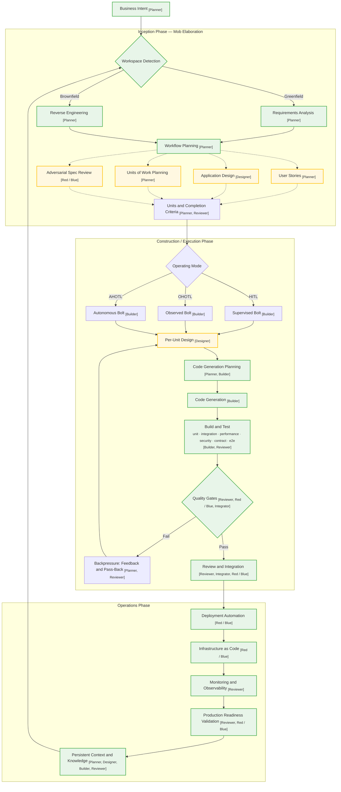

+++
date = '2021-09-01T09:10:00+10:00'
draft = false
title = 'AI-DLC Notes: Trends and the Autonomy Spectrum'
tags = ['AI-DLC','Agentic AI','Fintech','Process']
summary = "Where AI-DLC and the spectrum of AI development autonomy are heading."
+++

A sneakpeak into how AI will be an enabler for the roles within Fintech - helping our people focus on 
- judgement
- decision 
- problem solving

In order to understand this its helpful to understand the trend of the industry. 

### Things that are going to change 
#### Bad
- Today's roles — Product Owner, Scrum Master, Developer, QA and SRE — are all **built around a traditional SDLC** designed with only human in focus
- Waterfall, Agile and Scrum assume iteration are expensive and long running.
- lot of handoffs between roles - leading inter role dependencies
- documents thrown at each other to transfer context
- approval gates and cadence rituals like standups, sprints and story points. 
Retrofitting AI only reinforces the old inefficiencies. Way I see it this will undergo a transformation. 
#### Good
  - [The People say AI will replace them often assume work is going to be of same volume and be at better rate. What they dont realize is called - Jevons Paradox - as Efficiency increases More work gets created, not less.]((https://www.linkedin.com/posts/satyanadella_jevons-paradox-wikipedia-activity-7289521182721093633-5gJ5/))
  - Common trend among Manager who understand AI, They understand that their people are going to play an ever more significant role, the advice they give is just continue to get better at what you do.
  - leave everything else - hospitals brought AI instead of Doctors - they can't hold it accountable for the decision and the outcome. 
  - Unless you resist AI, AI will not replace people. I say resist - because the tools are getting more and more intuitive now a days - AI is attacking the learning curve. 
  - I would ask a junior software engineer to work on Fundamentals not your AI skills, work on building a solid foundation thats how you can increase your ability to be accountable. AI will suggest 9 good options - you should be able to pick the one best option from the 9 or suggest the 10th.

### The AI-DLC Workflow

**Hat responsibilities**

Think of these as the roles the AI or team plays at different moments in the workflow. They are not strict job titles; they are responsibilities that help keep planning, design, delivery, review and security separate.

- **[Planner]** — sets the goal, breaks it into Units and defines the completion criteria.
- **[Designer]** — turns the intent into a workable design for the system, data and interfaces.
- **[Builder]** — implements the plan and iterates until the Unit meets its criteria.
- **[Reviewer]** — verifies quality, evidence and whether the work satisfies the requirements.
- **[Adversial Hat]** — attacks the design and implementation, then hardens and fixes the issues.
- **[Integrator]** — checks that completed Units work together as one coherent result.

#### Stage-by-stage breakdown

##### Business Intent
  - can be any - **high-level business goal, feature or technical outcome**
  - Key difference from a traditional Epic: an Epic describes _what_ to build by the time you are talking about Epic - scope of stories, acceptance criteria and dependencies. **Epic focuses on decomposition**
  - an Intent only describes the _why_ part - you are going get AI to clarify outcomes and build it. You purposfully make the Intent - **ambiguous and vague**. 
  - Example: 
    - I want to add a new payment method into my existing system.
    - I want to migrate a legacy system Flexy into microservice.
    - Reduce API latency by 50% for this endpoint.
    - Costing looks wrong in the current system. Help fix it without breaking the existing calculation.
    - Reason is **AI discovers scope through questions** rather than executing a pre-baked plan. **Intent focuses on discovery**
  - References
    - [Matt Pocock's Grill me skill](https://www.aihero.dev/skills-grill-me)
    - [Matt Pocoks whole Playlist](https://www.youtube.com/watch?v=gaDdrDdczO4&list=PLH-fZ_5p3Lrc&index=1)
    - [Socratic Questioning or Guided Discovery](https://en.wikipedia.org/wiki/Socratic_questioning)

##### Workspace Detection
  - The workflow branches on whether the project is greenfield or brownfield
  - **Templates**: 
    - Empty scaffolds of the knowledge layer 
    - Enforces thought pattern & direction across Fintech.
  - **Greenfield**
    - Opportunity to start Top Down approach from Day 1. 
    - **Understand** else **Counter productive.**
  - **Brownfield** 
    - We have teams with 
      - Full Documentation
      - No Documentation 
      - Outdated/incorrect documentation 💀
    - Skills to convert code into a well defined template driven document using concepts like Abstract Syntax Tree, Queryable Knowledge Graph as going to be demonstrated by Context Engg. Adoption in Collections team.
 - References

##### Workflow Planning
  - this stages is what makes the workflow _adaptive_ rather than _linear_
  - if it's a simple one-line bug fix skips planning and goes straight to code generation; 
  - a complex feature runs the full chain (User Stories → Application Design → Units of Work Planning → Adversarial Spec Review)

##### User Stories (conditional)
  - Skipped for well-understood tasks e.g. "simple task like adding an end point", "write testcases to improve coverage" here the intent is self-explanatory for other cases 
  - where features are complex or the scope needs to be broken down into testable, reviewable chunks, **AI proposes stories;** the team validates or corrects — the conversation _is_ the artifact

##### Application Design (conditional)
  - Triggered Changes involving - Architecture, domain model and interface decisions etc
 
##### Adversarial Spec Review (conditional)
  - this stage pushes the team to defend the design before build work starts. **interrogates the proposed plan**, **hidden assumptions** and **weak spots** 
  - we introduced this - it's basically challenging the specs before anything is built — **cost of fixing a bug quickly increases as it goes further in any lifecycle**.
  - **Fresh eyes principle**: a different model or clean session reviews the output, not the same model that generated it. 
    - Claude Code can spawn subagents; 
    - Cursor/Copilot/VS Code can open a new chat or use a different model. 
    - CI/CD integration is the most portable approach
  - [Einstellung effect](https://en.wikipedia.org/wiki/Einstellung_effect) the AI's training corpus is its mental set 
    - **AI question bias risk**: . If the AI's questions frame the solution space toward familiar patterns, the answers will be too. For greenfield projects this risk is highest — no existing codebase, no Knowledge Artifacts, nothing domain-specific to ground the AI's questions

##### Units of Work Planning (conditional)
  - Decomposes the intent into Units, each with a chosen operating mode (HITL, OHOTL, AHOTL) and completion criteria
  - **A Unit is the unit of autonomy, not just the unit of scope** — it determines how much human oversight the work requires.
  - **Epic v/s Unit**
    - In traditional agile, an Epic is big (spans multiple features, teams, repos and sprints). 
    - A Unit is feature-scoped: a foundational piece of work within a single Intent

##### Units and Completion Criteria
  - By the time we have reached here we have the full context engg. spec ready for use.
  - Again 
    - in Agile/Scrum concept is **Definition of Done** shared checklist e.g. DoD says "code is reviewed"; 
    - AIDLC we call it the **Completion Criteria** - exactly what must be true for each **Unit**
      - evidence-backed completion verification
      - the gate produces a human-reviewable proof document 
        - tracability and auditability (Directed Acyclic Graph)
        - per criterian confidence score
        - justification

##### Operating Mode selection
  - Bolt is an execution of a Unit of work. 
  - based on factor like - work's shape and risk **a deliberate choice** is made here.
  - HITL = Human-in-the-loop
    - The AI does work with direct human approval or guidance. 
    - This is what you do with vibe coding.
  - OHOTL = Observed human-over-the-loop
    - You watch carefully while you see the agent doing its work and intervene if it drifts from it's goal.
  - AHOTL = Autonomous human-over-the-loop
    - Here is the real power of what we do.
    - the AI works independently within defined bounds, with humans checking afterwards or only when exceptions arise. 
    - Used when your the task is well-understood and the context is created well enough to let the agent iterate without constant input.

##### Per-Unit Design (conditional)
  - Design stages runs conditionally on the Unit based on complexity and risk profile
  - For simple Units (e.g. CRUD endpoints, documentation updates) this stage is skipped entirely
  - For complex Units (e.g. implement a specific algorithmic scaling, architecture changes) this produces the per-unit design before code generation begins
  - **Community implementation breaks this into four conditional sub-stages:** 
    - **Functional Design** (unit-level architecture, interface contracts, data models)
    - **NFR Requirements** (performance targets, security constraints, scalability needs)
    - **NFR Design** (caching strategy, auth patterns, capacity planning) 
    - **Infrastructure Design** (Terraform modules, CloudFormation, container definitions). Each runs only 

##### Code Generation Planning
  - **Think before you build**
  - The plan is reviewed before execution begins, catching structural issues before code exists

##### Code Generation
  - AI implements code and supporting artifacts, unit by unit — the [Builder] hat is the primary executor
  - Multiple Units can run in parallel.
  - AI collapses the designer-to-developer handoff — the artifact _is_ the design — so every discipline builds through the same loop

##### Build and Test
  - Six test types run against the implementation: 
    - unit
    - integration
    - performance
    - security
    - contract 
    - end-to-end
  - TDD workflow: write failing tests before implementation; BDD-style extends this to acceptance tests written before implementation
  - **"You cannot improve what you do not measure"** — the test suite is the measurement instrument

##### Quality Gates
 - Deterministic and invarient checks happen first
 - Model Graded Checks or Semantic Grading (LLM as judge)
 - regression gate or golden dataset
 - Statistical Sampling (N runs at temperature > 0)
 - Human Reviewer (based on report card.) 

##### Backpressure: Feedback and Pass-Back (fail)
  - Failing gates push work back through design, code generation and testing until it converges — **the inner feedback loop**
  - The loop continues until all gates pass or the agent escalates to human review
  - High churn (many iterations per Bolt) rate means poorly written Context Engg. was not done right.

##### Review and Integration (pass)
  - Passing work is reviewed, integrated across Units and checked for cross-unit coherence
  - Cross-unit integration: when multiple Units run in parallel, this stage catches conflicts, duplicate logic, inconsistent interfaces and broken contracts between Units
  - The [Red Team] hat can be activated here for adversarial code review — probing for spec violations, security issues, edge cases and anti-patterns before the work moves to Operations
  
##### Deployment Automation (Operations)
  - Production deployment pipelines, rollback procedures and release orchestration 

##### Infrastructure as Code (Operations)
  - Infrastructure definitions, configuration management and environment provisioning managed through version-controlled specs
  - Infrastructure changes go through the same Construction pipeline as application code — plan, implement, test, gate, review

##### Monitoring and Observability (Operations)
  - Monitoring setup, alerting, logging and observability configuration to track production behaviour and surface issues

##### Production Readiness Validation (Operations)
  - Pre-deployment checks confirming the system meets SLOs, runbooks are in place and rollback is ready before release
  - Checks: architecture-to-code-to-tests alignment, all code traces to design, test coverage meets acceptance criteria
  - Runbooks, rollback readiness and SLO conformance are verified — the system is not released until these are confirmed
  - For regulated domains (fintech): auditable checkpoints at requirements sign-off, design approval, code review and release approval, with autonomous work permitted between them

##### Persistent Context and Knowledge
  - Plans, requirements, design artifacts and operational knowledge stored in the repo feed the next Inception cycle — **the outer feedback loop**.

  - **Context economy warning**: 
    - model performance degrades once the window passes ~40–60% utilisation (the "dumb zone"). 
    - Material buried mid-context receives less attention than whatever sits at the edges.
  - **[The 19-agent trap](https://paddo.dev/blog/the-19-agent-trap/)**: 
    - scaffolding one agent per job title (mirroring the org chart) loses context at every handoff. 
    - Personas succeed when they bundle review and oversight hats around one build loop, not when they spawn a dedicated agent per role. Complex swarms consistently underperform simple loops with rich relevant context. 

#### AI-DLC Persona-to-Hat Mapping

The AI-DLC personas below can wear one or more hats depending on the work being performed. The mapping combines the implementation's domain agents, reviewer agents and adaptive workflow composer with common Scrum and delivery roles.

| Persona                                               | Hat mapping                                                |
| ----------------------------------------------------- | ---------------------------------------------------------- |
| Product Owner / Product Manager / Business Analyst    | [Planner], [Reviewer], [Red / Blue]                        |
| UX / Product Designer                                 | [Designer], [Builder], [Reviewer]                          |
| Scrum Master / Delivery Manager / Engineering Manager | [Planner], [Integrator], [Reviewer]                        |
| Solutions Architect / Technical Architect             | [Planner], [Designer], [Builder], [Reviewer], [Integrator] |
| AWS Platform Engineer                                 | [Designer], [Builder], [Reviewer]                          |
| Compliance Specialist                                 | [Planner], [Reviewer], [Red / Blue]                        |
| DevSecOps Engineer                                    | [Builder], [Reviewer], [Red / Blue]                        |
| Developer / Scrum Team Developer                      | [Planner], [Builder], [Reviewer]                           |
| QA Engineer / Tester                                  | [Builder], [Reviewer], [Red / Blue]                        |
| Pipeline and Deployment Engineer                      | [Builder], [Integrator], [Reviewer]                        |
| SRE / Operations Engineer                             | [Builder], [Reviewer], [Integrator]                        |
| Stakeholder                                           | [Planner], [Reviewer]                                      |
| Product Lead Reviewer                                 | [Reviewer]                                                 |
| Architecture Reviewer                                 | [Reviewer]                                                 |
| Adaptive Workflow Composer                            | [Planner], [Integrator]                                    |

#### Persona Evolution: Old Role → New Role

| Old persona | New role |
| ----------- | -------- |
| Product Owner / PM / Business Analyst / Scrum master / SME | **Intent Owner, not Epic owner.** Writes a deliberately vague Intent that describes only the _why_ and owns the outcome. |
| UX / Product Designer / SME | **Designer across Inception and Construction.** Requirements into per-Unit designs  and Construction. The artifact _is_ the design — the designer-to-developer handoff disappears |
| Scrum Master / Delivery Manager | **Workflow Composer.** Replaces sprint ceremonies with adaptive decisioning: picks which conditional stages (User Stories, Application Design, Adversarial Spec Review, Units of Work Planning) apply and selects the per-Unit operating mode (HITL / OHOTL / AHOTL) |
| Solutions / Technical Architect | **Designer + curator.** Owns the domain model and architecture boundaries that Construction realises — Construction does not invent the domain, it implements it.|
| Engineering Leaders / DevSecOps Engineer | **Adversial Skill/ Red & Blue + gate curator.** Probes design and implementation adversarially and keeps attack testing separate from remediation so reviews stay objective |
| Developer | **Builder.** Implements the agreed plan in small steps — code, tests, infrastructure — and iterates against gate feedback instead of human nudges. Writing the failing test first becomes the primary deliverable |
| QA / Tester | **Gate Curator.** Writes completion criteria that gate autonomy and owns the add-only, ratcheted quality gates. Adopts the forward-looking idea: per-criterion scores, justification and line-level references instead of a bare pass/fail |
| Pipeline and Deployment Engineer | **Deployment Automation owner.** Builds scheduled, reactive and process operation types with automated rollback and release orchestration; agent-owned scripts run autonomously within defined boundaries |
| SRE / Operations Engineer | **Observability steward.** Configures monitoring, alerting and logging and closes the virtuous loop: production behaviour feeds the next Inception and lands in Persistent Context and the Runtime memory layer |

### References
- AWS Events, _AWS re:Invent 2025 - Introducing AI driven development lifecycle (AI-DLC) (DVT214)_. https://www.youtube.com/watch?v=1HNUH6j5t4A
- Raja SP, _AI-Driven Development Life Cycle_, AWS DevOps Blog, 31 Jul 2025. https://aws.amazon.com/blogs/devops/ai-driven-development-life-cycle/
- Bushido Collective, _AI-DLC 2026_, Jan 2026. https://ai-dlc.dev/paper
- Bushido Collective, _The Hat System_, AI-DLC Docs. https://ai-dlc.dev/docs/hats
- AWS AI-DLC Method Definition. https://prod.d13rzhkk8cj2z0.amplifyapp.com/aidlc.pdf
- awslabs/aidlc-workflows, _Phases and Stages_. https://awslabs.github.io/aidlc-workflows/guide/04-phases-and-stages/

