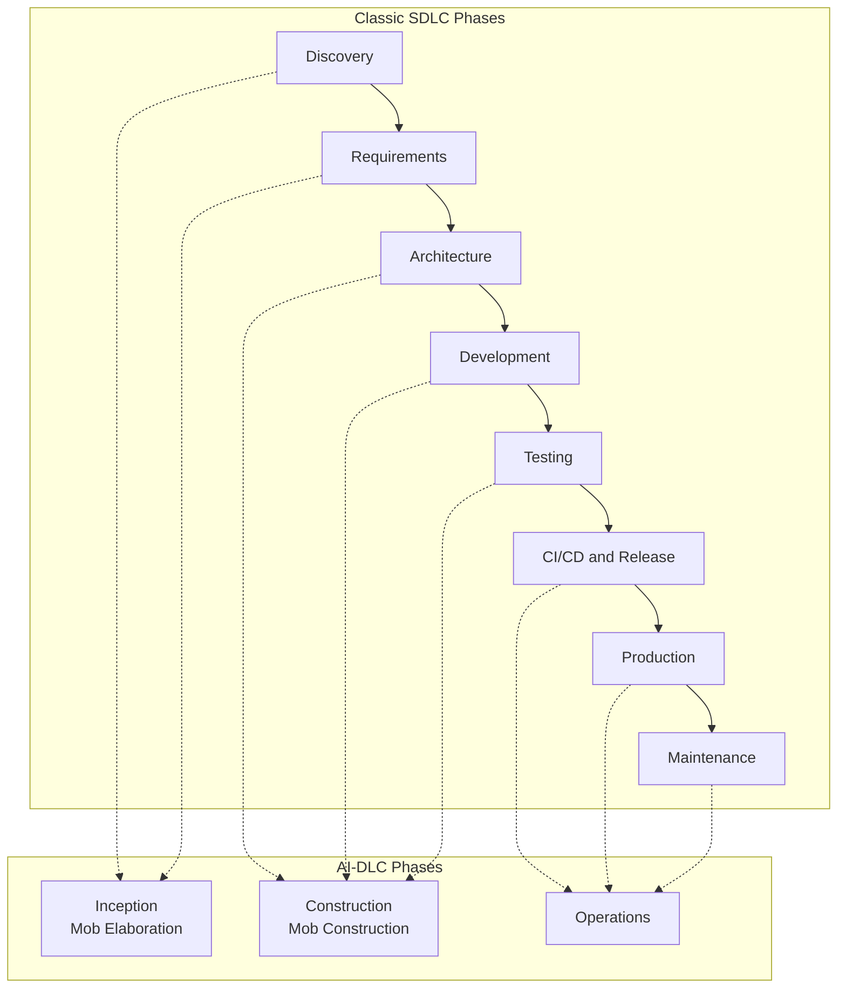
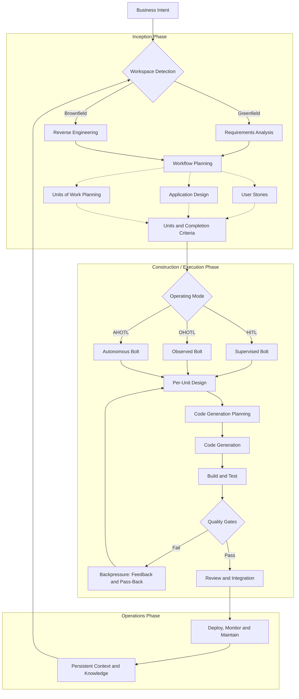

+++
date = '2026-08-25T09:10:00+10:00'
draft = false
title = 'AI-Assisted Software Development and the AI-DLC'
tags = ['AI-DLC','Agentic AI','Fintech','Process']
summary = "The pillars of AI-assisted development and the AI-DLC method."
+++

## Introduction

This post is part three of a series on software engineering in Telly's fintech domain. It covers the pillars of AI-assisted development, then goes deep on the AI-Driven Development Lifecycle: its AWS origins, the community 2026 paper, quality gates and operating modes.

## AI-Assisted Software Development and the AI-DLC

Before deciding the roles of each persona its necesaary to understand the full set of practices that define AI-assisted software development and the lifecycle that governs how that AI work is planned, gated and reviewed.

### The Pillars of AI-Assisted Development

AI-assisted software development is the practice of using LLM-based agents as collaborators across the SDLC, with humans supplying business context, judgment and accountability.

There is no single canonical list of pillars — different authors and organisations group the practice differently.

| Pillar                          | What It Covers                                                                                                                                                                                                                                                                                                | Key References                                                                                                                                                                                                                                                                                                                                                                                                                                                                                                                                                                                                                                     |
| ------------------------------- | ------------------------------------------------------------------------------------------------------------------------------------------------------------------------------------------------------------------------------------------------------------------------------------------------------------- | -------------------------------------------------------------------------------------------------------------------------------------------------------------------------------------------------------------------------------------------------------------------------------------------------------------------------------------------------------------------------------------------------------------------------------------------------------------------------------------------------------------------------------------------------------------------------------------------------------------------------------------------------- |
| Prompt engineering              | How you talk to the model: wording, examples, formatting and instruction hierarchy. Determines how clearly the model is asked, not what it can know                                                                                                                                                           | Chip Huyen, _AI Engineering_, ch 5; [GitHub Blog, agentic primitives](https://github.blog/ai-and-ml/github-copilot/how-to-build-reliable-ai-workflows-with-agentic-primitives-and-context-engineering/)                                                                                                                                                                                                                                                                                                                                                                                                                                            |
| Context engineering             | Curating what the model sees: context window, memory layers, scoping, compression and selective loading. The difference between an agent that guesses and an agent that knows                                                                                                                                 | Birgitta Böckeler, [Context Engineering for Coding Agents](https://martinfowler.com/articles/exploring-gen-ai/context-engineering-coding-agents.html) (martinfowler.com)                                                                                                                                                                                                                                                                                                                                                                                                                                                                           |
| Retrieval and grounding         | Pulling the right external knowledge into the window: chunking, embeddings, re-ranking, freshness. Grounds the model in your data instead of its training corpus                                                                                                                                              | Huyen, _AI Engineering_, ch 6 (context construction);                                                                                                                                                                                                                                                                                                                                                                                                                                                                                                                                                                                              |
| Spec-driven development         | Structured, versioned specifications become the source of truth and agents derive implementation, tests and documentation from them                                                                                                                                                                           | GitHub Spec Kit; arXiv [process taxonomy of AI dev frameworks](https://arxiv.org/html/2606.04967)                                                                                                                                                                                                                                                                                                                                                                                                                                                                                                                                                  |
| Evaluation (evals)              | Testing non-deterministic output: the eval pyramid, golden datasets, invariants, model-graded metrics and CI gates. You cannot improve what you do not measure                                                                                                                                                | [OpenAI Evals](https://github.com/openai/evals), [Promptfoo](https://promptfoo.dev), [Braintrust](https://braintrust.org), [pytest](https://docs.pytest.org/en/stable/), [Hypothesis](https://hypothesis.readthedocs.io/en/latest/), ToolCallCheck; Huyen, ch 3-4                                                                                                                                                                                                                                                                                                                                                                                  |
| Agents, tools and harnesses     | The execution layer: agent SDKs, tool calling, protocols and the harness that mediates context, tools, memory, verification and permissions. Includes agent skills — reusable packages that shape behaviour, such as adversarial "grill me" skills that interrogate intent and assumptions before work starts | Model Context Protocol (MCP), Anthropic docs (https://www.anthropic.com/docs), OpenAI developer docs (https://platform.openai.com/docs), [Multi-agent systems](https://en.wikipedia.org/wiki/Multi-agent_system), OpenCode; Anthropic, [Building Effective Agents](https://www.anthropic.com/engineering/building-effective-agents); [obra/superpowers](https://github.com/obra/superpowers) (composable skills framework); [addyosmani/agent-skills](https://github.com/addyosmani/agent-skills) (production-grade skills with Plan→Build→Verify→Review→Ship stages and evals); arXiv [AI Harness Engineering](https://arxiv.org/html/2605.13357) |
| Guardrails, safety and security | Prompt injection defence, hallucination mitigation, permissions, secrets handling and supply-chain scanning for AI-generated code                                                                                                                                                                             | Huyen, _AI Engineering_ (safety chapter); OWASP Top 10 for LLM Applications                                                                                                                                                                                                                                                                                                                                                                                                                                                                                                                                                                        |
| Observability, tracing and cost | Monitoring model and agent behaviour, logging, tracing, token budgets and cost governance. You cannot improve what you do not measure                                                                                                                                                                         | Huyen, _AI Engineering_ (infrastructure layer); [Context Engineering for Coding Agents](https://martinfowler.com/articles/exploring-gen-ai/context-engineering-coding-agents.html)                                                                                                                                                                                                                                                                                                                                                                                                                                                                 |
| Model selection and adaptation  | Choosing the right model and adapting it: prompt vs RAG vs fine-tuning vs structured output. Start with prompting and retrieval before reaching for training                                                                                                                                                  | Huyen, _AI Engineering_; [Context Engineering for Coding Agents](https://martinfowler.com/articles/exploring-gen-ai/context-engineering-coding-agents.html)                                                                                                                                                                                                                                                                                                                                                                                                                                                                                        |
| Human oversight and governance  | Deciding how much autonomy AI gets: HITL, OHOTL or AHOTL modes, review workflows, approval boundaries, traceability and audit trails                                                                                                                                                                          | AI-DLC (below); arXiv [Agentic Software Engineering (SE 3.0)](https://arxiv.org/html/2509.06216v3)                                                                                                                                                                                                                                                                                                                                                                                                                                                                                                                                                 |

### The AI-Driven Development Lifecycle (AI-DLC)

#### Origins and Provenance

AI-DLC (AI-Driven Development Life Cycle) is a framework that is about restructuring how humans and an AI coding assistant work together to build software: the AI drafts requirements, proposes architecture, writes code and tests and handles deployment configs — but always pauses to ask clarifying questions and get human sign-off before proceeding, at every step.

**Sources**

| Source                                                                                                                                     | Owner                  | Status                                                      | Contribution                                                                                                          |
| ------------------------------------------------------------------------------------------------------------------------------------------ | ---------------------- | ----------------------------------------------------------- | --------------------------------------------------------------------------------------------------------------------- |
| [**AI-Driven Development Life Cycle blog**](https://aws.amazon.com/blogs/devops/ai-driven-development-life-cycle/) also AWS re:Invent 2025 | AWS blogs              | Foundational and official                                   | The three-phase model, Mob Elaboration, Mob Construction and core terminology (Intent, Unit, Bolt)                    |
| `awslabs/aidlc-workflows`, open-sourced November 2025                                                                                      | AWS Labs               | Official reference implementation                           | Adaptive workflow scaffolds (Rules and Steering files), mandatory vs conditional stages, checkpoints and audit trails |
| AI-DLC 2026 paper, [ai-dlc.dev/paper](https://ai-dlc.dev/paper), January 2026                                                              | The Bushido Collective | Independent community synthesis, **not** an AWS publication | HITL/OHOTL/AHOTL operating modes, Bolts, Passes, harness-enforced quality gates and completion criteria               |

#### Core Terminology

Core terminologies that are AI-DLC specific — the concepts map to well-known agile ideas but are deliberately renamed to shed the assumptions carried by traditional terminology. The pattern across all of them: traditional terms assume humans plan and document, AI-DLC terms assume AI executes and humans set direction, define boundaries and review outcomes.

##### Intent

- **Traditional Equivalent:** Epic / Initiative
- **Definition:** A high-level statement of purpose that describes what should be achieved — a business goal, a feature or a technical outcome. Serves as the starting point for AI-driven decomposition into Units.
- **What Changed:** An Epic describes _what_ to build — a solution the team already understands. An Intent describes _why_ — an outcome the AI must first clarify through questions before proposing a solution. Epic decomposes; Intent discovers.
- **Note:** The AWS blog (2025) says "Epics are replaced by Units of Work" but the method definition PDF maps Epics to Unit, not Intent. The hierarchy is actually Intent → Unit → Bolt, not a flat replacement. Intent is a new concept that sits above Unit with no direct agile equivalent. Source: [AWS blog](https://aws.amazon.com/blogs/devops/ai-driven-development-life-cycle/) and [method definition PDF](https://prod.d13rzhkk8cj2z0.amplifyapp.com/aidlc.pdf).

##### Unit

- **Traditional Equivalent:** Feature / Work package
- **Definition:** A cohesive, self-contained work element derived from an Intent, specifically designed to deliver measurable value. Each Unit gets its own Bolt with a chosen operating mode (HITL, OHOTL, AHOTL). Units are loosely coupled, independently deployable and have clear boundaries.
- **What Changed:** A Feature is a chunk of functionality. A Unit is the unit of autonomy, not just the unit of scope — it determines how much human oversight the work requires.
- **Note:** The AWS blog says Epics → Units. The method definition says Units are "analogous to Subdomains in DDD or Epics in Scrum." Both agree Unit replaces Epic, but disagree on whether Intent also replaces Epic or sits above it. The 2026 community paper sides with the method definition: "Units are analogous to Bounded Contexts in DDD or Epics in Scrum." Source: [AWS method definition](https://prod.d13rzhkk8cj2z0.amplifyapp.com/aidlc.pdf) and [Bushido Collective 2026 paper](https://github.com/thebushidocollective/ai-dlc).

##### Bolt

- **Traditional Equivalent:** Sprint
- **Definition:** The smallest iteration unit in AI-DLC, measured in hours or days, run in supervised (HITL), observed (OHOTL) or autonomous (AHOTL) mode. A Unit can be executed through one or more Bolts, which may run in parallel or sequentially.
- **What Changed:** A Sprint is time-boxed (two weeks, fixed cadence). A Bolt is sized to the work and runs in a chosen operating mode. Small fixes get a short autonomous Bolt; complex features get a longer supervised one.

##### Pass

- **Traditional Equivalent:** Discipline iteration
- **Definition:** A typed iteration through the standard loop (elaborate, units, execute, review) through a design, product or development lens. Passes add a disciplinary lens over the standard loop, and later passes can pass work back to earlier ones when new constraints appear.
- **What Changed:** In traditional agile, disciplines work sequentially (design → dev → test). Passes add a lens over the same loop with backward flow — a later pass discovering a constraint that invalidates an earlier assumption sends work back without anyone declaring failure.

##### Mob Elaboration

- **Traditional Equivalent:** Requirements gathering
- **Definition:** The whole team validates AI's questions, assumptions and proposed units in a single session with a shared screen, led by a facilitator. AI converts intent into candidate requirements, user stories and units; the team validates or corrects the result.
- **What Changed:** Requirements gathering produces documents through meetings. Mob Elaboration is the AI asking clarifying questions and the team validating in real time — the conversation _is_ the artifact.

##### Mob Construction

- **Traditional Equivalent:** Development
- **Definition:** AI proposes architecture, domain models, code solutions and tests while the team clarifies decisions in real time. Multiple units run in parallel through Mob Execution, with teams exchanging integration specifications at human checkpoints.
- **What Changed:** Traditional development is individuals writing code against specifications. Mob Construction is the AI proposing architecture, code and tests while the team clarifies decisions as they emerge.

##### Completion Criteria

- **Traditional Equivalent:** Definition of Done
- **Definition:** Verifiable conditions that determine whether a unit is complete — precise enough that an autonomous agent can iterate toward them without hand-holding.
- **What Changed:** DoD is a shared checklist. Completion Criteria are precise, verifiable conditions per Unit — the difference between "code is reviewed" and "users can reset passwords, reset tokens expire after 15 minutes, all auth endpoints have tests and the security scan has no critical findings." Precision enables autonomy.

##### Hat

- **Traditional Equivalent:** Role
- **Definition:** A markdown definition of an agent's behaviour, boundaries and quality gates in the community implementation. Each Hat defines the role's required steps, completion signal and what it can and cannot do. Built-in hats include Planner, Builder, Reviewer, Designer, Test Writer, Implementer, Refactorer, Red Team, Blue Team, Observer, Hypothesizer, Experimenter and Analyst.
- **What Changed:** A Role is a job title and responsibilities. A Hat is executable, not aspirational — the agent follows the Hat's instructions exactly.

##### Named Workflow

- **Traditional Equivalent:** Prescribed process
- **Definition:** An ordered hat sequence that gives a Bolt its internal rhythm: default, adversarial, design, hypothesis, tdd or bdd. Teams can define custom workflows following the same mechanism.
- **What Changed:** A process lives in documentation. A Named Workflow is an ordered hat sequence (planner → builder → reviewer) that the Bolt executes automatically. The process runs, not just exists.

##### Operation

- **Traditional Equivalent:** Runbook task
- **Definition:** File-based operational spec declaring type (scheduled, reactive or process), owner, trigger and runtime. Each intent ships a Deployment Unit bundling code, configuration, infrastructure definitions and validation suites.
- **What Changed:** A runbook is human-written instructions. An Operation is a file-based spec the agent can execute autonomously within boundaries, not just follow.

##### Knowledge Artifact

- **Traditional Equivalent:** Documentation
- **Definition:** Structured institutional memory in the project knowledge layer: design (visual language, component patterns), architecture (module boundaries, data flow), product (business rules, personas), conventions (coding standards) and domain (entities, bounded contexts). Brownfield synthesis populates them automatically with confidence scores.
- **What Changed:** Documentation is scattered across wikis and tickets. Knowledge Artifacts are structured, persistent memory the agent reads every session instead of searching for them.

##### Completion Announcement

- **Traditional Equivalent:** Release communications
- **Definition:** Communication artifacts generated on Intent completion: changelog, release notes, social posts or blog draft. An intent declares its announcement channels in frontmatter and the completed artifacts generate the outputs automatically.
- **What Changed:** Release notes are written manually after deployment. Completion Announcements are produced from the same artifacts that declared the work done — closing the gap between code-complete and users knowing about it.

##### Workflow and Implementation Terms

These terms describe how AI-DLC works in practice rather than what things are called.

###### Rules files

Markdown configuration committed to the repository and auto-loaded into every agent session. In the AI-DLC implementation they carry the process logic: the stage library, heuristics for deciding which stages apply and checkpoint instructions.

###### Steering files

The Kiro equivalent of Rules: persistent markdown context (product overview, repo structure, tech conventions) loaded into every session so the agent steers by project knowledge rather than per-prompt instructions.

###### Mandatory (green) stages

Stages that always run regardless of task size: workspace detection, requirements analysis or reverse engineering, workflow planning, code generation planning, code generation and build/test.

###### Conditional (yellow) stages

Stages that run only when complexity assessment justifies them: user stories, application design, per-unit design. A bug fix skips them; a new feature runs them.

###### Checkpoints

Human approval gates between stages: the agent pauses, presents its plan plus clarifying questions and waits for explicit sign-off before advancing.

###### Audit trails

End-to-end traceability: every artifact, decision, approval and conversation logged as it happens, producing an inspectable record for accountability and compliance.

###### HITL (human-in-the-loop)

Supervised mode: the human approves before each significant step.

###### OHOTL (observed human-on-the-loop)

Observed mode: AI works continuously while a human watches in real time and can interrupt at any moment.

###### AHOTL (autonomous human-on-the-loop)

Autonomous mode: AI iterates within quality gates until done and the human reviews at completion.

**What these rule files concretely look like.** They are resident markdown instructions rather than executable skills — no scripts, no trigger-on-match loading, just standing orders the agent reads every session. The open-source release ships two folders ([awslabs/aidlc-workflows](https://github.com/awslabs/aidlc-workflows)):

```
aidlc-rules/
├── aws-aidlc-rules/
│   └── core-workflow.md        ← the entire adaptive workflow described in
│                                 prose (~25 KB): stages, decision heuristics,
│                                 checkpoint behaviour
└── aws-aidlc-rule-details/
    ├── common/                 ← detailed stage procedures referenced
    ├── inception/                 conditionally by core-workflow.md
    ├── construction/
    ├── operations/
    └── extensions/             ← opt-in rule packs: security, testing, resiliency
```

| Tool               | Installed as                                              |
| ------------------ | --------------------------------------------------------- |
| Kiro               | `.kiro/steering/aws-aidlc-rules/`                         |
| Amazon Q Developer | `.amazonq/rules/aws-aidlc-rules/`                         |
| Cursor             | `.cursor/rules/ai-dlc-workflow.mdc` (`alwaysApply: true`) |
| Claude Code        | `CLAUDE.md`                                               |
| GitHub Copilot     | `.github/copilot-instructions.md`                         |
| OpenAI Codex       | `AGENTS.md`                                               |

Amazon Q Developer, Cursor and Cline all name their version _rules_; Kiro coined _steering files_; Claude Code, GitHub Copilot and OpenAI Codex express the same idea through their own instruction conventions (`CLAUDE.md`, `copilot-instructions.md`, `AGENTS.md`). The capabilities differ only in scoping detail: Kiro steering offers inclusion modes (always, auto or manual plus glob patterns such as `fileMatchPattern`), Cursor rules support `alwaysApply` or description-based smart matching and Q rules stay deliberately plain workspace markdown. Same category everywhere — resident instructions loaded every session.

Your coding agents follows the state machine defined in the markdown. The distinction from skills matters: instructions are always-in-context declarative knowledge ("know this, obey this"), while skills are lazy-loaded procedural packages invoked when a task matches ("when doing X, follow these steps"). AI-DLC deliberately chose the former so the process transfers across tools and models unchanged.

The 2026 paper is equally explicit about its intellectual inputs:

| Contributor                                                                                    | Idea                                                                                                                                                        | Relevance to AI-DLC                                                                                                                                                                 |
| ---------------------------------------------------------------------------------------------- | ----------------------------------------------------------------------------------------------------------------------------------------------------------- | ----------------------------------------------------------------------------------------------------------------------------------------------------------------------------------- |
| Geoffrey Huntley, Ralph Wiggum technique ("deterministically bad in an undeterministic world") | The try-fail-iterate autonomous loop — let the agent attempt work freely, accept that early attempts will be wrong and iterate until the quality gates pass | Underpins the Bolt execution model: the agent runs autonomously within a loop, failing fast and adjusting rather than requiring a perfect plan upfront                              |
| Anthropic, _Building Effective Agents_                                                         | Harness design for long-running agents — structured orchestration with tool calling, memory and verification boundaries                                     | Provides the runtime architecture: rules files, checkpoints and quality gates that keep the agent within bounds during extended Construction and Operations phases                  |
| Steve Wilson (OWASP)                                                                           | Human-on-the-loop governance — the human observes and interrupts rather than approving every step                                                           | Shapes the HITL/OHOTL/AHOTL operating mode taxonomy: the human's role shifts from approving each action to defining outcomes, setting gates and intervening when needed             |
| paddo.dev                                                                                      | SDLC-collapse analysis and the 19-agent trap — sequential phases dissolve when iteration is cheap; one agent per job title loses context at every handoff   | Drives the core claim that phases compress into continuous flow with checkpoints, and argues against multi-agent org-chart mirroring in favour of simpler loops with rich context   |
| HumanLayer, 12 Factor Agents                                                                   | Context engineering guidance — how to scope, load and manage what an agent sees                                                                             | Informs the persistent context model: five memory layers (rules, session, project, organisational, runtime) that keep the agent grounded across Bolts without starting from scratch |

#### Why It Exists: The Middle Path

The AWS post argues that most organisations use AI in two limited ways:

- **AI-assisted development** — AI improves specific tasks such as documentation, code completion and testing.
- **AI-autonomous development** — AI is expected to generate whole applications from user requirements with little human involvement.

AWS reports that both patterns produce suboptimal outcomes in velocity and quality. AI-DLC is the proposed middle path: AI performs the heavy execution work while humans supply business context, judgment, validation and accountability. In the financial-services version of the story, the developer's role shifts from writing code to managing and validating AI-generated outputs. The 2026 community paper frames the same idea with a Google Maps analogy: humans set the destination, AI provides step-by-step directions and humans maintain oversight.

#### Reimagine Rather Than Retrofit: The Collapsing SDLC

The 2026 paper goes further than the AWS framing: its foundational claim is that sequential phases are not being accelerated but dissolved. Phase boundaries existed because iteration was expensive — handoffs between specialised roles, documents to transfer context and approval gates made economic sense when rework took weeks. With AI driving iteration cost toward zero, context loss at handoffs becomes the dominant cost, so the phases collapse into continuous flow punctuated by checkpoints.

| Handoff (traditional SDLC)         | Checkpoint (AI-DLC 2026)             |
| ---------------------------------- | ------------------------------------ |
| Work stops completely              | Work pauses briefly                  |
| Context transfers to another party | Same agent continues with feedback   |
| Documents carry knowledge          | Files and git carry knowledge        |
| Approval required to proceed       | Review identifies needed adjustments |

Rituals calibrated to slow cadences lose their rationale: story-point estimation blurs when AI flattens simple and complex tasks, velocity measures activity rather than value and upfront design becomes a tax when try-fail-adjust cycles take seconds. Backward flow also becomes normal rather than exceptional — a later pass discovering a constraint that invalidates an earlier assumption sends work back without anyone declaring failure. The paper's slogan for this first-principles rethink: we need automobiles, not faster horse chariots.

#### The Three Phases

The AWS version describes three phases. The 2026 community paper keeps Inception and Operations but uses "Execution" for the build phase; the intent is the same — move from clarified intent to verified implementation to operational ownership.

**Inception — WHAT to build and WHY.** AI transforms business intent into requirements, user stories, units, risks, non-functional requirements and completion criteria. The central ritual is Mob Elaboration: AI asks clarifying questions and the team validates or corrects the result. Key activities:

- AI converts intent into candidate requirements and units
- AI asks questions to uncover missing context (functional scope, business rules, edge cases, technical constraints)
- The team validates assumptions and constraints
- Completion criteria are defined for each unit
- Bolt structure and supervision mode are selected
- An isolated **adversarial spec review** subagent challenges the specs across seven categories — contradictions between units, hidden complexity, unvalidated assumptions, dependency ordering errors, scope creep, completeness gaps and boundary violations. High-confidence mechanical fixes apply automatically; everything else goes back to the team
- Brownfield intents begin with a **knowledge bootstrap** phase that synthesises the existing codebase into knowledge artifacts complete with confidence scores; greenfield intents seed empty scaffolds

Mob Elaboration is where adversarial skills earn their keep. A "grill me" skill turns the agent from a passive assistant into an interrogator: it challenges the intent, attacks assumptions, hunts for missing edge cases and forces the team to defend the business case before anything is built. Running it here is cheap — catching a wrong assumption during Elaboration costs minutes, while catching it in Construction or Production costs a full rework cycle. It is the same discipline as a design review or a technical spike, formalised as a reusable skill. The AI-DLC 2026 implementation formalises both halves of it: the adversarial spec review interrogates specs during Inception and the adversarial workflow — the red-team hat tries to break the implementation while the blue-team hat hardens it — repeats the exercise against code during Construction.

**Construction — HOW to build it.** Using the validated context from Inception, AI proposes architecture, domain models, code solutions and tests. In the 2025 AWS framing this is Mob Construction; in the 2026 community paper it is Execution through Bolts. Key activities:

- AI proposes architecture and technical design. Design techniques are tools, not requirements: DDD, TDD and BDD are applied when domain complexity warrants them and skipped when verification can validate correctness faster — the test suite, not the architecture document, becomes the source of truth
- AI implements code and supporting artifacts, unit by unit
- AI generates tests and validation checks
- Multiple units run in parallel through **Mob Execution**: collocated teams each own a unit, exchange integration specifications (API contracts, event schemas) and coordinate cross-unit concerns at human checkpoints while autonomous bolts execute concurrently
- The team reviews trade-offs and higher-risk decisions
- Quality gates provide backpressure when output fails

Roles concentrate here rather than disappear. AI collapses the designer-to-developer handoff — the artifact _is_ the design — so every discipline builds through the same loop: designers steer with aesthetic judgment, engineers with architectural pattern knowledge and PMs with business context. Experience acts as a multiplier; the paper insists high-quality output still requires seasoned operators, whether reviewing directly or guiding mob execution.

**Operations — run and maintain it.** AI applies the accumulated context to deployment, infrastructure as code, monitoring, rollback and ongoing maintenance. Operational work itself becomes file-based: each operation lives as a spec in `.ai-dlc/{intent}/operations/`, typed as **scheduled** (cron-driven tasks such as secret rotation or cache warming), **reactive** (trigger-driven responses such as rollback on error-rate spikes) or **process** (human-cadence routines such as quarterly security reviews), with an ownership model of agent-owned scripts executing autonomously within boundaries or human-owned checklists tracked by the agent. Each intent ships a **Deployment Unit** bundling code artifacts, configuration, infrastructure definitions and validation suites with automated rollback procedures. The important point is continuity: plans, requirements, design artifacts and operational knowledge are stored in the repository so later sessions do not start from scratch — and when an intent completes, configured completion announcements generate changelog entries, release notes, social posts or blog drafts from the same artifacts, closing the gap between code-complete and users knowing about it. In the financial-services narrative, monitoring feeds back into the coding agent's context and informs future Inception cycles, creating a virtuous loop.

**How AI-DLC maps onto the SDLC.** AI-DLC does not delete the pipeline from the SDLC Flow diagram; it compresses it into continuous flow with checkpoints, absorbing each phase's work. Discovery and Requirements fold into Inception; Architecture and Design plus Development plus Testing fold into Construction; CI/CD plus Production plus Maintenance fold into Operations.



So the two diagrams are complementary: the SDLC Flow shows the phases a product goes through, and this one shows which AI-DLC phase absorbs the work of each SDLC phase.

#### The Adaptive Workflow

The official open-source implementation turns the three phases into an adaptive workflow with stages. Some stages are **mandatory** (green) and some are **conditional** (yellow); the workflow chooses which to run based on context and complexity. A simple bug fix skips planning and goes straight to code generation; a complex feature runs requirements analysis, architectural design and detailed testing.

| Phase        | Stages (mandatory or conditional)                                                                                                                                                                                  |
| ------------ | ------------------------------------------------------------------------------------------------------------------------------------------------------------------------------------------------------------------ |
| Inception    | Workspace Detection (greenfield vs brownfield) → Reverse Engineering (brownfield) or Requirements Analysis (greenfield) → Workflow Planning. Conditional: User Stories, Application Design, Units of Work Planning |
| Construction | Per-unit design stages (conditional) → Code Generation Planning → Code Generation → Build and Test (unit, integration, performance, security, contract and end-to-end tests)                                       |
| Operations   | Deployment automation, infrastructure as code, monitoring and observability setup, production readiness validation                                                                                                 |

The AWS open-sourcing blog identifies three properties that make this work:

1. **Adaptive decisioning** — the workflow conforms to the problem's shape, intelligently skipping or deepening stages based on contextual assessment rather than predetermined rules.
2. **Transparent checkpoints** — human approvals are embedded at every decision gate, preserving oversight while maintaining velocity.
3. **End-to-end traceability** — every artifact, decision and conversation is logged, creating an inspectable trail that supports accountability and improvement.

At each gate the workflow asks clarifying questions, creates an execution plan and waits for approval. The implementation uses Rules and Steering files that convert AI from a passive assistant into an adaptive decision engine.

#### The AI-DLC Flow

The diagram below combines the three phases, the adaptive workflow stages, the operating modes and the quality-gate loop into one picture. Dashed edges are conditional stages; the workflow only runs them when the context warrants it. Solid edges are mandatory.



Note the two feedback loops. The inner loop is construction backpressure: failed quality gates push the unit back through design, code generation and testing. The outer loop is lifecycle continuity: operations captures persistent context and knowledge, which feeds the next Inception cycle so no session starts from scratch.

#### Operating Modes: HITL, OHOTL and AHOTL

The 2026 community paper distinguishes three operating modes that form a spectrum of human involvement, not a maturity ladder:

| Mode                                 | Human Involvement        | Approval Model               | Best For                                                                                                             |
| ------------------------------------ | ------------------------ | ---------------------------- | -------------------------------------------------------------------------------------------------------------------- |
| HITL (human-in-the-loop)             | Continuous, blocking     | Before each significant step | Novel domains, architecture decisions, production data, security and compliance risk, foundational work              |
| OHOTL (observed human-on-the-loop)   | Continuous, non-blocking | Any time (interrupt)         | UX, design, copy and subjective quality work, training, medium-risk changes                                          |
| AHOTL (autonomous human-on-the-loop) | Periodic, on-demand      | At completion                | Well-defined tasks with measurable acceptance criteria, batch operations, work validated by tests, types and linting |

The key insight is that the human does not disappear — the human's function changes, from micromanaging execution to defining outcomes, observing progress and building quality gates. A companion mode-selection skill published by the community scores the choice across measurable factors:

| Factor               | HITL      | OHOTL    | AHOTL |
| -------------------- | --------- | -------- | ----- |
| Requirements clarity | Low       | Medium   | High  |
| Risk level           | High      | Medium   | Low   |
| Test coverage        | Low       | Medium   | High  |
| Domain familiarity   | Low       | Medium   | High  |
| Reversibility        | Difficult | Moderate | Easy  |

Default modes per phase: Elaboration HITL, Planning HITL, Building OHOTL, Review HITL. The general rule is to start new or unknown work in HITL and escalate autonomy only as requirements stabilise, test coverage grows and trust is earned. Downgrades (AHOTL → OHOTL → HITL) are signals to investigate root causes, not punishments.

The paper's own decision framework is blunter — pick by the shape of the work:

| Scenario                  | Mode  | Rationale                 |
| ------------------------- | ----- | ------------------------- |
| Implement a new algorithm | HITL  | Novel, requires judgment  |
| Add CRUD endpoints        | AHOTL | Well-understood pattern   |
| Migrate a database schema | HITL  | High risk, data integrity |
| Build a UI component      | OHOTL | Subjective design quality |
| Update documentation      | AHOTL | Clear criteria, low risk  |

Its governing principle: **default to more supervision when uncertain** — loosening control later is easier than recovering from an autonomous mistake. Modes are also provisional rather than fixed: shifting work between modes mid-stream as understanding develops is a first-class feature of the methodology.

#### Backpressure, Quality Gates and Completion Criteria

**Backpressure over prescription.** Instead of prescribing every implementation step, AI-DLC defines quality gates that reject non-conforming work. The 2026 paper describes harness-enforced quality gates: structured, frontmatter-driven checks that the harness runs on every Stop event. The agent cannot stop — cannot advance, cannot hand off, cannot declare work complete — until all gates pass. This is qualitatively different from asking AI to "run the tests": the agent cannot rationalise its way around a failing hook.

Four properties make the enforcement robust:

- **Auto-detection during elaboration** — the discovery skill inspects repository tooling (`package.json`, `go.mod`, `pyproject.toml`, `Cargo.toml`) and proposes the right gate commands, which the team confirms before construction begins.
- **Additive merge with a ratchet** — confirmed gates are saved to the Intent's frontmatter and builders may add unit-specific gates during construction. Unit gates add to intent gates, never replace them, and gates are add-only thereafter: the reviewer verifies gate integrity as part of the review and removing a gate triggers a request-changes decision. Quality standards can only move forward.
- **Scoped enforcement** — only building hats (builder, implementer, refactorer) are gate-enforced; planner, reviewer and designer hats skip enforcement silently because a failing test should not block a mid-review objective.
- **Loop prevention** — a `stop_hook_active` flag lets a subagent that has already been blocked once stop on its second attempt, preventing deadlock in nested agent scenarios.

One further mechanism completes the picture:

- **Completion criteria enable autonomy** — autonomy depends on precise criteria. "Make auth better" is too vague; "users can reset passwords, reset tokens expire after 15 minutes, all auth endpoints have tests and the security scan has no critical findings" gives the agent a target it can iterate toward.

**Visual and design backpressure.** The principle extends beyond code into design fidelity. Visual gates activate automatically when signals suggest they matter: the unit's discipline is frontend or design, the spec references design artifacts or the changeset touches UI files. When active, the system resolves a reference image through a three-level priority — an external design-tool export such as Figma, a screenshot from the previous successful bolt or a wireframe from elaboration — captures the implementation through pluggable infrastructure (Playwright-based capture is the web default) and has a vision model compare the pair, producing a structured pass/warn/fail verdict with annotated differences. A failing verdict feeds back into the bolt loop exactly like a failing test. A missing reference logs a warning instead of blocking; absence of a reference is itself a signal worth surfacing.

#### Persistent Context: Artifacts Are Memory

AI-DLC's answer to the context-window problem is committed artifacts and ephemeral state. Intents, unit progress and decisions persist in version-controlled files, so the context window can be reset without losing the project's ground truth — the community implementation treats `/clear` as a feature, not a bug.

The paper generalises this into **memory providers** — five queryable layers of organisational memory an agent can draw on:

| Layer          | Location                   | Speed   | Purpose                                          |
| -------------- | -------------------------- | ------- | ------------------------------------------------ |
| Rules          | Project rule files         | Instant | Conventions, patterns, constraints               |
| Session        | Working files, scratchpads | Fast    | Current task context and progress                |
| Project        | Git history, codebase      | Indexed | What was tried and what worked                   |
| Organisational | Connected systems via MCP  | Query   | Institutional knowledge: tickets, ADRs, runbooks |
| Runtime        | Monitoring systems         | Query   | Production behaviour and incidents               |

The filesystem stays the simplest provider but connected organisational memory dramatically expands what an agent can know — a debugging agent can pull incident history for similar symptoms and an architect agent can retrieve precedent ADRs.

Abundance still demands economy. Model performance degrades once the window passes roughly 40–60% utilisation — the "dumb zone" — and material buried mid-context receives less attention than whatever sits at the edges. The paper's warning against the **19-agent trap** (scaffolding one agent per job title, mirroring the org chart) makes the same point structurally: every handoff loses context and orchestration overhead consumes attention, so complex swarms consistently underperform simple loops with rich relevant context. The practical countermeasures: monitor the context budget with alerts at set thresholds, extract static reference material into companion files read on demand, inject prior-bolt learnings lazily at the point of use and scope context per role — the reviewer hat sees the diff and completion criteria, never the full elaboration history. This is exactly the context engineering discipline from the [Context Engineering](/blog/ai/context-engineering/) post, applied to the development process itself.

#### The Community Implementation: Four Phases and Hats

The Bushido Collective's open-source plugin for Claude Code implements the methodology as four phases — Elaboration, Execution, Operation and Reflection — using git worktrees, automated tests/lint/types as quality gates, pull requests and deployment workflows. Inside each unit, the AI cycles through specialist agents, each wearing a "hat": a markdown file that defines the role's required steps, boundaries and quality gates. Built-in hats include Planner, Builder, Reviewer, Designer, Test Writer, Implementer, Refactorer, Red Team, Blue Team, Observer, Hypothesizer, Experimenter and Analyst. Passes add a disciplinary lens (design, product or dev) over the standard loop, and later passes can pass work back to earlier ones when new constraints appear.

The hat list is where the "grill me" idea becomes a formal role. The Red Team hat attacks assumptions and design decisions during Elaboration and Review; the Blue Team hat defends them; the Observer hat stays detached and reports what the agents actually did. Teams can express the same idea with simpler tooling — a reusable grill-me skill that interrogates intent, requirements and design before the harness gates run. Either way the principle is identical to backpressure: challenge the work before it is accepted, not after.

Bolts get their internal rhythm from **named workflows** — predefined hat sequences chosen per unit in frontmatter:

| Workflow    | Hat Sequence                                          | Purpose                                                                      |
| ----------- | ----------------------------------------------------- | ---------------------------------------------------------------------------- |
| default     | planner → builder → reviewer                          | Standard execution cycle                                                     |
| adversarial | red-team → blue-team                                  | Security-focused: break the implementation, then harden it                   |
| design      | planner → designer → reviewer                         | Visual and UX execution for design-discipline units                          |
| hypothesis  | observer → hypothesizer → experimenter → analyst      | Scientific debugging and investigation                                       |
| tdd         | test-writer → implementer → refactorer                | Test-driven development with explicit red-green-refactor phases              |
| bdd         | planner → acceptance-test-writer → builder → reviewer | Behaviour-driven development: acceptance tests written before implementation |

Custom workflows follow the same mechanism: ordered hats, each with its own instructions and completion signal, executed inside the bolt loop.

Three further pieces of the community implementation matter for adopting teams:

- **Lifecycle entry points** — _elaborate_ starts a fresh intent, _follow up_ iterates on a completed intent linked through `iterates_on` and _adopt_ reverse-engineers a feature built outside AI-DLC into completed intent artifacts with traceable test evidence. Adopt is the primary on-ramp for bringing brownfield estates under governance without pretending to rebuild history.
- **Project knowledge layer** — `.ai-dlc/knowledge/` persists five artifact types across intents: design (visual language, component patterns), architecture (module boundaries, data flow, technology choices), product (business rules, personas, domain vocabulary), conventions (coding standards, tooling config) and domain (entities, bounded contexts, ubiquitous language). Brownfield synthesis populates them automatically with confidence scores; greenfield projects scaffold them empty and seed them through the design-direction step.
- **Completion announcements** — an intent declares its announcement channels in frontmatter and the completed artifacts generate changelog entries, release notes, social posts or blog drafts.

Two evolution notes: the HITL/OHOTL/AHOTL taxonomy is already being superseded inside the community's broader H·AI·K·U framework by five operating modes and a "stages" model that replaces Passes. Treat these community constructs as fast-moving rather than settled.

#### Adoption and Getting Started

The AWS financial-services blog recommends a three-phase adoption path:

1. **Executive alignment** — confirm the leadership understands how AI-DLC differs from Agile and tie adoption to measurable business outcomes.
2. **Technical enablement** — build deep knowledge of agentic coding tools (such as Amazon Q Developer, Kiro or Claude Code) and best practices.
3. **Hands-on pilots** — run immersive two-to-three-day pilot sprints on real codebases to generate proof points and momentum.

The methodology is deliberately tool and platform agnostic — the state-persistence, backpressure and oversight patterns transfer across Claude Code, Cursor, Kiro, OpenCode or a custom harness. For a tool-agnostic start: pick one low-risk feature, write an Intent with explicit completion criteria, decompose it into one or two Units, choose a mode deliberately, store decisions and outcomes in the repo and add quality gates before increasing autonomy.

#### Measuring AI-DLC Effectiveness

The paper trades activity metrics (lines of code, story points) for four outcome metrics:

| Metric               | What It Measures                                                       |
| -------------------- | ---------------------------------------------------------------------- |
| Cycle Time           | Time from intent to production                                         |
| Bolt Success Rate    | Bolts completing without human rescue                                  |
| Churn Rate           | Iterations per bolt — high churn usually means poorly written criteria |
| Criteria Escape Rate | Defects discovered after deployment                                    |

The measurement philosophy: measure what matters to the business, not what is easy to count.

#### Compliance and Audit Integration

For regulated domains — the fintech setting this post is framed around — the paper prescribes two patterns. **Auditable checkpoints** place human audit points at requirements sign-off, design approval, code review and release approval, with autonomous work permitted between them. **Automated compliance gates** double as compliance verification with audit logging attached to every run. The property auditors care most about falls out of the artifact model for free: every artifact links forwards and backwards and every decision is logged, so the workflow _is_ the audit trail rather than something assembled retrospectively. Framework mappings for SOC 2, HIPAA and PCI DSS ship in the paper's companion compliance-audit runbook.

#### Limitations and Caveats

AI-DLC is useful but not complete by itself. Teams still need to define:

- Security and compliance controls for their domain
- Human approval boundaries for production and data access
- Repository conventions for persistent context
- Quality gates that actually reflect product risk
- Evaluation metrics for productivity, defect rate, user impact and maintainability
- Rules for when autonomous work must stop and escalate

It is also worth remembering that the fuller, more operational version of the methodology (modes, passes, quality gates) comes from an independent community project, not from AWS, so teams evaluating it for enterprise use should weigh that provenance accordingly. See the AWS framing at https://aws.amazon.com/blogs/devops/ai-driven-development-life-cycle/ and the community paper at https://ai-dlc.dev/paper for additional perspectives.

#### AI-DLC Key Sources

| Source                                                                                                                                                                | What It Contributes                                                                                                                        |
| --------------------------------------------------------------------------------------------------------------------------------------------------------------------- | ------------------------------------------------------------------------------------------------------------------------------------------ |
| AI-DLC: AI-Driven SDLC                                                                                                                                                | See AWS: https://aws.amazon.com/blogs/devops/ai-driven-development-life-cycle/ and the community paper at https://ai-dlc.dev/paper         |
| Raja SP (AWS), [AI-Driven Development Life Cycle: Reimagining Software Engineering](https://aws.amazon.com/blogs/devops/ai-driven-development-life-cycle/)            | The original methodology post, 31 July 2025                                                                                                |
| AWS, [Open-Sourcing Adaptive Workflows for AI-DLC](https://aws.amazon.com/blogs/devops/open-sourcing-adaptive-workflows-for-ai-driven-development-life-cycle-ai-dlc/) | Adaptive decisioning, checkpoints and traceability, November 2025                                                                          |
| AWS, [Building with AI-DLC using Amazon Q Developer](https://aws.amazon.com/blogs/devops/building-with-ai-dlc-using-amazon-q-developer/)                              | Stage-by-stage walkthrough with conditional stages and audit trails                                                                        |
| [awslabs/aidlc-workflows](https://github.com/awslabs/aidlc-workflows)                                                                                                 | Official open-source reference implementation (Rules and Steering files)                                                                   |
| The Bushido Collective, [AI-DLC 2026 Paper](https://ai-dlc.dev/paper)                                                                                                 | Independent community paper: modes, passes, quality gates, hats, January 2026                                                              |
| AWS, [AI-Driven Development Lifecycle for Financial Services](https://aws.amazon.com/blogs/industries/ai-driven-development-lifecycle-for-financial-services/)        | Fintech framing and three-phase adoption path, May 2026                                                                                    |
| AI-DLC 2026 companion runbooks (via [ai-dlc.dev/paper](https://ai-dlc.dev/paper))                                                                                     | Playbooks referenced by the paper: mode selection, autonomous bolts, incremental adoption, metrics and compliance-audit framework mappings |

## Where This Leads

The next posts combine the three building blocks — the [SDLC phases](/blog/ai/fintech/software-development-lifecycle/), the [personas](/blog/ai/fintech/telly-fintech-personas/) and the AI practices above — into a single matrix: every persona, every phase, an O/R/C/A involvement code and the context engineering practice each applies, under the operating mode that fits the risk. See [AI and Context Engineering Usage by Persona and Stage](/blog/ai/fintech/persona-stage-matrix/) and [AI Skills and Tools by Phase](/blog/ai/fintech/ai-skills-by-phase/).

## References

**Books:**

- Huyen, C. (2025). _AI Engineering_. O'Reilly.

**Standards and frameworks:**

- OWASP Top 10 for LLM Applications.

**Online references:**

- Anthropic (2024). _Building Effective Agents_. anthropic.com.
- arXiv:2509.06216 (2025). _Agentic Software Engineering: Foundational Pillars and a Research Roadmap_.
- arXiv:2606.04967 (2026). _From Prompt to Process: A Taxonomy of Agentic AI-Driven Development Frameworks_.
- arXiv:2605.13357 (2026). _AI Harness Engineering: A Runtime Substrate for Foundation-Model Software Agents_.
- Böckeler, B. (2026). _Context Engineering for Coding Agents_. martinfowler.com.
- The Bushido Collective (2026). _AI-DLC 2026 Method Definition Paper_. ai-dlc.dev/paper.
- GitHub (2025). _Spec Kit: Writing specifications your team will actually use_. github.blog.
- Meppiel, D. (2025). _How to build reliable AI workflows with agentic primitives and context engineering_. GitHub Blog.
- SP, R. (2025). _AI-Driven Development Life Cycle: Reimagining Software Engineering_. AWS DevOps Blog.
- AWS (2025). _Open-Sourcing Adaptive Workflows for AI-Driven Development Life Cycle (AI-DLC)_. AWS DevOps Blog.
- AWS (2025). _Building with AI-DLC using Amazon Q Developer_. AWS DevOps Blog.
- AWS (2026). _AI-Driven Development Lifecycle for Financial Services_. AWS Industries Blog.
- awslabs (2025). _aidlc-workflows_. GitHub.
