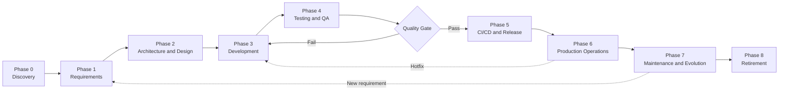

+++
date = '2026-08-25T09:00:00+10:00'
draft = false
title = 'Software Engineering in Fintech: Lifecycle, Personas and AI Practice'
tags = ['SDLC','Software Development','Fintech','Process','Personas','Context Engineering','Matrix']
summary = "The full SDLC, every fintech persona and AI practice mapped across the lifecycle."
+++

## Introduction

This post covers software engineering in Telly's fintech domain across three dimensions: the lifecycle every product moves through, the roles and contributions of each persona in the delivery organisation and a matrix that maps every persona to every lifecycle phase with involvement codes and AI practice.

## The Software Development Lifecycle

### SDLC Flow

Starts from the first idea to production and beyond. We have to take a generic approach as different domains follow a slightly different approach that works for them.

**References:**

- _Software Engineering_ (Sommerville, 10th ed, 2016)
- _Software Engineering: A Practitioner's Approach_ (Pressman and Maxim, 9th ed, 2020)
- ISO/IEC/IEEE 12207:2017 (software life-cycle processes).

### Phase 0: Discovery and Idea

- Validates the problem is real
- That **people will use** the solution
- Building it makes **business sense**
- **Timing** is right
- Validate demand before building - **build-measure-learn** loop and a minimal viable product (**MVP**) to test assumptions with real users early - "The Lean Startup (Ries, 2011)"
- Run a **feasibility study**: technical, financial, timeline, regulatory and compliance.
- Decide **build vs buy vs borrow**.
- Choose the technology only after the problem is understood — **avoid following hype cycles**.
- Define **success criteria and the business case**; secure stakeholder alignment.

**Deliverables:**

- Problem statement
- Business case
- MVP scope
- Success metrics.

**References:**

- _The Lean Startup_ (Ries, 2011);
- _The Mythical Man-Month_ (Brooks, 1975);
- [PMBOK Guide (PMI, 7th ed, 2021).](https://tegnum.edu.pe/wp-content/uploads/2023/09/Project-Management-Institute-A-Guide-to-the-Project-Management-Body-of-Knowledge-PMBOK-R-Guide-PMBOK%C2%AE%EF%B8%8F-Guide-Project-Management-Institute-2021.pdf)

### Phase 1: Requirements Engineering

- Elicit requirements from stakeholders through **interviews**, **workshops**, **observation** and **document analysis** - Software Engineering (Sommerville, 2016)
- **Functional requirements** what the system does; **non-functional requirements** Quality of Service - performance, security, availability, scalability and usability.
  - Analyse and prioritise.
- Agile teams write user stories with acceptance criteria and follow the **INVEST model** (Bill Wake, 2003).
  - **Independent** — the story can be implemented without depending on other stories.
  - **Negotiable** — it is not a contract; details are discussed and refined with the team.
  - **Valuable** — delivers clear value to the user or stakeholder.
  - **Estimable** — the team can reasonably estimate the effort required.
  - **Small** — small enough to complete within a single sprint or bolt.
  - **Testable** — has clear acceptance criteria so it can be verified.
- Regulated environments keep a formal software requirements specification (SRS) with traceability.

**Deliverables**

- product backlog or SRS
- acceptance criteria
- Definition of Ready
- Definition of Done.

**References:**

- _Software Engineering_ (Sommerville, 2016); the Scrum Guide (Schwaber and Sutherland).
- ISO/IEC/IEEE 29148 (requirements engineering);

### Phase 2: Architecture and Design

- Design System and choose architecture that fits the problem:
  - layered
  - microservices
  - event-driven
  - serverless
- Model the domain with Domain-Driven Design:
  - ubiquitous language — a shared vocabulary between developers and domain experts, used consistently in code, conversation and documentation. For example in fintech the team agrees on terms like `CustomerRiskProfile`, `PaymentAuthorization` so the same words appear in domain models, APIs, tickets and conversations — eliminating the gap between "business speak" and "code speak"
  - bounded contexts
  - aggregates
- Design using the C4 model (C4, Brown, 2018) — four levels of increasing detail:
  - **Context** (high-level) — system boundaries, actors and external dependencies
  - **Containers** (high-level) — deployable units (applications, data stores, message brokers) and their interactions
  - **Components** (low-level) — modules, interfaces, data flow and security boundaries within each container
  - **Code** (low-level) — classes, algorithms and design patterns (_Design Patterns_, Gamma et al, 1994)
- Define the data model and API contracts before implementation.
- Record decisions as Architecture Decision Records (ADRs) so future teams know why things are the way they are.
- Design for failure: circuit breakers, retries with backoff, timeouts, queues and graceful degradation (_Release It!_, Nygard, 2007).

**Deliverables:**

- Architecture design document
- ADRs
- data model
- API specifications
- Security architecture.

**References:**

- _Designing Data-Intensive Applications_ (Kleppmann, 2017);
- _Clean Architecture_ (Martin, 2017);
- _Domain-Driven Design_ (Evans, 2003);
- _Design Patterns_ (Gamma et al, 1994);
- _Release It!_ (Nygard, 2007).

### Phase 3: Development (Construction)

- Turn the **design into working, tested code**.
- Set up version control (Git) and agree a branching strategy. Common strategies:
  - **Trunk-based development** — All developers commit to `main`; small, frequent, gated merges. Standard recommendation for continuous delivery; requires strong CI discipline.
  - **Git Flow** — Multiple long-lived branches: `main`, `develop`, `release-*`, `hotfix-*`. Best for complex releases and scheduled versioning; higher merge overhead.
  - **GitHub Flow** — Feature branches + pull requests → `main`. Simple, linear history; ideal for web teams and rapid feedback loops.
  - **Feature Branching** — Each feature gets its own branch; merged when complete. Slower, isolated development; risk of long-lived branches and merge conflicts.
  - **Release Branching** — Stable `main` + separate release branches for critical fixes. Best for critical systems and compliance environments; higher maintenance burden.
- Follow coding standards enforced by linting and static analysis.
- Write tests alongside code: Test Driven Development (Beck, 2003).
- Review every change: Pull requests, Code review, pair or mob programming for complex work.
- Integrate continuously: commit small, integrate frequently, keep the build green (Fowler, 2006).
- Keep the code healthy: refactor in small steps (Fowler, 1999) and avoid premature optimisation.

**Deliverables:**

- source code
- unit tests
- review records
- CI build.

**References:**

- _Code Complete_ (McConnell, 2004);
- _Clean Code_ (Martin, 2008);
- _Test-Driven Development: By Example_ (Beck, 2003);
- _Refactoring_ (Fowler, 1999);
- _The Pragmatic Programmer_ (Hunt and Thomas, 1999).

### Phase 4: Testing and Quality Assurance

- Verify the software works, and keep proving it as it changes.
- Follow the **test pyramid**: many fast **unit tests**, fewer **integration tests** and a small number of **end-to-end tests** (Cohn, 2009).
- Test at the standard levels from the ISTQB syllabus:
  - Component (unit) ≈ **Dev** environment
  - Integration ≈ **SQI** System Quality Integration environment
  - System ≈ **SVT** System Validation Testing environment
  - Acceptance testing ≈ **UAT** & **Pre-Prod** environments
- Automate regression tests and run them in CI on every change.
- Add non-functional testing: performance and load, security (OWASP Top 10 and OWASP ASVS), accessibility and usability.
- Use behaviour-driven development for shared understanding: Gherkin scenarios written before the code (North, 2006).
- Enforce quality gates before merge: code review approval, coverage thresholds, lint rules and passing tests.

**Deliverables:**

- automated test suites
- test reports
- quality metrics.

**References:**

- ISTQB Foundation syllabus
- _Succeeding with Agile_ (Cohn, 2009)
- _Introducing BDD_ (North, 2006)
- OWASP Top 10 and OWASP ASVS.

### Phase 5: Build, Continuous Integration and Release (CI/CD)

- Make the path to production fast, automated and safe.
- Build and test every commit in a CI pipeline; produce immutable, versioned artifacts. Keep build, release and run separate (Twelve-Factor App, Wiggins, 2011).
- Promote the same artifact through environments: Dev → SQI → SVT → Pre-Prod → Prod. Keep environments as close to production as possible (dev/prod parity); each environment tests the same immutable artifact.
- Automate deployment with release pipelines so software is always in a deployable state (_Continuous Delivery_, Humble and Farley, 2010).
- Use safe deployment patterns to minimize risk and enable rollback:
  - **Rolling** — gradually replace instances; steady state with no downtime; slower feedback on issues.
  - **Blue-green** — maintain two identical environments; instant switch between versions; high infrastructure cost.
  - **Canary** — route small % of traffic to new version; detect issues before full rollout; requires monitoring and fast rollback.
  - **A/B testing** — both versions serve live traffic simultaneously; measure user behavior and business impact; requires feature flags and analytics.
  - Feature flags decouple deploy from release in all patterns; allow instant user-facing toggles without redeployment.
- Gate every release on automated checks: tests, static analysis, security scanning, compliance checks and health checks after deployment.

**Deliverables:**

- CI/CD pipeline
- release automation
- deployment runbooks.

**References:**

- _Continuous Delivery_ (Humble and Farley, 2010)
- _Continuous Integration_ (Fowler, 2006);
- _The DevOps Handbook_ (Kim, Humble, Debois and Willis, 2016);
- Twelve-Factor App (Wiggins, 2011).

### Phase 6: Production Operations and Reliability

- Run the system reliably, safely and economically once it is live.
- Define **reliability targets: service level indicators (SLIs), service level objectives (SLOs) and error budgets** (_Site Reliability Engineering_, Beyer et al, 2016).
- Implement **observability**: metrics, structured logs, distributed tracing, dashboards and alerting.
- Set up on-call and **incident management**: detection, response, escalation and communication. ITIL 4 defines incident and problem management as standard practices.
- Run blameless postmortems after every significant incident.
- Plan capacity, backups, restore drills and disaster recovery.
- **Control cost:** track cloud spend, rightsize resources and automate scaling.
- Harden production security: vulnerability scanning, patching and regular access reviews.
- Optionally run chaos experiments to prove failure handling works (_Principles of Chaos Engineering_, 2017).

**Deliverables:**

- SLOs
- runbooks
- incident response plan
- monitoring and alerting
- capacity plan
- disaster recovery plan.

**References:**

- _Site Reliability Engineering_ (Beyer et al, 2016);
- _The Site Reliability Workbook_ (2018);
- _ITIL 4 Foundation_ (AXELOS, 2019);
- _Principles of Chaos Engineering_ (2017).

### Phase 7: Maintenance and Evolution

- Keep the system alive, correct and competitive after launch.
- Classify and manage maintenance work: corrective (fixing defects), adaptive (new platforms, regulations or compliance), perfective (new features and improvements) and preventive (refactoring and technical debt reduction) — IEEE 1219.
- Manage technical debt explicitly: track it, pay it down in small steps and use automated tests as a safety net (_Refactoring_, Fowler, 1999; _Working Effectively with Legacy Code_, Feathers, 2004).
- Release on a regular cadence with regression protection from the automated test suite.
- Feed production telemetry back into requirements, design and testing.
- Improve continuously using the DORA four key metrics (_Accelerate_, Forsgren, Humble and Kim, 2018).:
  - Deployment frequency
  - Lead time for changes
  - Change failure rate
  - Time to restore service
- Plan dependency and platform upgrades; never let versions drift so far that migration becomes a project in itself.

**Deliverables:**

- maintenance backlog
- release cadence
- technical debt register
- improvement roadmap.

**References:**

- IEEE 1219 (software maintenance);
- _Refactoring_ (Fowler, 1999);
- _Working Effectively with Legacy Code_ (Feathers, 2004);
- _Accelerate_ (Forsgren et al, 2018);
- CMMI-DEV for process maturity.

### Phase 8: Retirement (Sunset)

- Take the system out of service cleanly and responsibly.
- Decide when to retire: when the cost of running exceeds the value delivered, or a replacement exists.
- Plan the exit: data migration or archival, decommissioning integrations, winding down third-party contracts and cleaning up DNS and certificates.
- Communicate the plan to users and stakeholders well in advance.
- Keep required records and audit trails, especially in regulated fintech environments.
- Shut down in stages with a rollback path if the replacement underperforms.

**Deliverables:**

- Retirement plan
- data archival or migration
- final closeout report.

**References:**

- ISO/IEC/IEEE 12207 (retirement process);
- PMBOK Guide (project closure).

### Cross-Cutting Practices

- These apply across every phase above.
- **Process framework:** agile (Scrum, Kanban, extreme programming) for most product work; plan-driven (waterfall) where requirements are fixed and heavily regulated; hybrid models in between. Agile Manifesto (2001).
- **Ceremonies and cadence:** sprint planning, daily standup, review and retrospective (the Scrum Guide). Retrospectives drive continuous improvement.
- **Estimation:** story points and planning poker based on Wideband Delphi (Boehm, 1981), relative sizing and T-shirt sizing.
- **Version control and commit discipline:** Small, atomic commits with clear messages; pull request reviews before merge; pair or mob programming for complex work as code review alternative; feature flags to decouple deploy from release in production.
- **Quality and compliance gates:** security reviews, audit trails and traceability from requirement to production change. Fintech adds mandatory gates: ISO/IEC 27001, PCI DSS, SOC 2 and GDPR.
- **Governance:** change management and incident management follow ITIL 4; release boards for high-risk environments.

## Software Development Personas

The personas below are the standard roles found in modern software development organisations, the exact titles and boundaries differ between teams. In reality one person may often wear several hats.

### Product and Delivery

| Persona                            | Primary Phases                       | Core Contribution                                                                                                                                                    |
| ---------------------------------- | ------------------------------------ | -------------------------------------------------------------------------------------------------------------------------------------------------------------------- |
| Product Manager (PM)               | Discovery, Requirements, Maintenance | Owns the product vision, roadmap and prioritisation; defines success metrics and the MVP scope (Phases 0-1, 7).                                                      |
| Product Owner (PO)                 | Requirements, Development            | The agile counterpart of the PM inside a squad: owns the backlog, writes and prioritises user stories and accepts work against the Definition of Done (Phases 1, 3). |
| Business Analyst (BA)              | Discovery, Requirements              | Elicits and analyses requirements, models the domain, documents acceptance criteria and translates between business and engineering language (Phases 0-1).           |
| Delivery Manager / Project Manager | All phases                           | Owns the plan, timeline, budget, risk and stakeholder communication. In agile organisations this becomes a facilitation role rather than a controller role.          |
| Scrum Master / Agile Coach         | All phases                           | Guards the process, removes impediments, runs ceremonies and retrospectives and coaches the team on agile practice.                                                  |
| Engineering Manager                | All phases                           | Line-manages engineers, owns career growth, hiring and team health; pairs with the Tech Lead on technical decisions.                                                 |

### Design and Research

| Persona                  | Primary Phases                  | Core Contribution                                                                                                                       |
| ------------------------ | ------------------------------- | --------------------------------------------------------------------------------------------------------------------------------------- |
| UX Researcher            | Discovery, Testing, Maintenance | Runs user interviews, usability tests and data analysis to validate problems and solutions before and after the build (Phases 0, 4, 7). |
| UX Designer              | Discovery, Development          | Designs flows, information architecture and interaction patterns; produces prototypes for testing (Phases 0-1, 3).                      |
| UI / Visual Designer     | Development                     | Turns interaction designs into the visual system: components, tokens and design systems (Phase 3).                                      |
| Accessibility Specialist | Requirements, Testing           | Ensures products meet accessibility standards such as WCAG; reviews designs and tests for accessibility (Phases 1, 4).                  |

### Architecture

| Persona                   | Primary Phases                       | Core Contribution                                                                                                                            |
| ------------------------- | ------------------------------------ | -------------------------------------------------------------------------------------------------------------------------------------------- |
| Enterprise Architect      | Discovery, Requirements, Maintenance | Aligns solutions with the enterprise strategy and standards; owns cross-system integration and technology standards (Phases 0-2, 7).         |
| Solution Architect        | Design, Production                   | Owns the end-to-end solution design for a product: architecture, data, integrations, security and non-functional requirements (Phases 2, 6). |
| Data / Platform Architect | Design, Maintenance                  | Designs data models, pipelines and the platform foundations shared across squads (Phases 2, 5-7).                                            |

### Engineering

| Persona                                  | Primary Phases                       | Core Contribution                                                                                                                          |
| ---------------------------------------- | ------------------------------------ | ------------------------------------------------------------------------------------------------------------------------------------------ |
| Tech Lead                                | Design, Development, Maintenance     | Sets the technical direction for the squad, reviews designs and code, mentors engineers and owns technical quality (Phases 2-3, 7).        |
| Software Engineer                        | Development, Maintenance             | Writes and reviews code, writes unit and integration tests and participates in continuous integration; owns codebase health (Phases 3, 7). |
| Frontend / Backend / Full-stack Engineer | Development                          | Specialised engineering tracks for user interfaces, services and APIs, or both (Phase 3).                                                  |
| Data Engineer                            | Development, Maintenance             | Builds and maintains data pipelines, warehouses and data quality controls (Phases 3, 7).                                                   |
| ML / AI Engineer                         | Discovery, Development, Production   | Builds and operates ML and LLM features: data, training, evals, prompts, model serving and monitoring (Phases 0, 3, 6).                    |
| Database Administrator                   | Development, Production, Maintenance | Owns database performance, migrations, backups and access controls (Phases 3, 6-7).                                                        |

### Quality and Testing

| Persona                         | Primary Phases        | Core Contribution                                                                                                                          |
| ------------------------------- | --------------------- | ------------------------------------------------------------------------------------------------------------------------------------------ |
| QA Engineer / Test Analyst      | Requirements, Testing | Designs the test strategy, writes test cases and performs exploratory and regression testing; guards release quality (Phases 1, 4).        |
| Test Automation Engineer (SDET) | Development, Testing  | Builds and maintains the automated test pyramid: unit frameworks, integration suites, end-to-end tests and performance tests (Phases 3-4). |

### Platform, DevOps and Operations

| Persona                         | Primary Phases                | Core Contribution                                                                                                                   |
| ------------------------------- | ----------------------------- | ----------------------------------------------------------------------------------------------------------------------------------- |
| DevOps / Platform Engineer      | Build and Release, Production | Builds and runs CI/CD pipelines, infrastructure as code, developer tooling and shared environments (Phases 5-6).                    |
| Site Reliability Engineer (SRE) | Production, Maintenance       | Owns SLIs, SLOs and error budgets; drives reliability, runs incidents and plans capacity (Phases 6-7).                              |
| Release Manager                 | Build and Release             | Owns the release calendar, change approvals and production deployment coordination (Phases 5-6).                                    |
| Cloud / Infrastructure Engineer | Build and Release, Production | Owns cloud accounts, networking, compute and infrastructure security baselines (Phases 5-6).                                        |
| Support Engineer (L1/L2/L3)     | Production, Maintenance       | Triages and resolves customer and system issues, escalates to engineering and feeds root causes back into the backlog (Phases 6-7). |

### Security and Compliance

| Persona                                | Primary Phases                               | Core Contribution                                                                                                                 |
| -------------------------------------- | -------------------------------------------- | --------------------------------------------------------------------------------------------------------------------------------- |
| Application Security Engineer (AppSec) | Development, Build and Release, Production   | Runs threat modelling, code and dependency scanning, SAST/DAST and security reviews (Phases 3-6).                                 |
| Security Architect                     | Architecture, Production                     | Designs the security controls and guardrails across the solution (Phases 2, 6).                                                   |
| Compliance / Risk Analyst (GRC)        | Requirements, Build and Release, Maintenance | Maps controls to regulations such as PCI DSS, SOC 2 and GDPR for fintech and telecom; audits and tracks evidence (Phases 1, 5-7). |
| Data Protection Officer (DPO)          | Requirements, Maintenance                    | Owns data protection compliance, privacy impact assessments and breach handling (Phases 1, 7).                                    |

### Personas Across the Lifecycle

| SDLC Phase                   | Owning Personas                                         | Contributing Personas                        |
| ---------------------------- | ------------------------------------------------------- | -------------------------------------------- |
| 0. Discovery                 | PM, UX Researcher, BA, Enterprise Architect             | Delivery Manager, Data Engineer              |
| 1. Requirements              | PO, BA, UX Designer, Accessibility Specialist           | AppSec, GRC, DPO                             |
| 2. Architecture and design   | Solution Architect, Tech Lead, Security Architect       | Enterprise Architect, Data Architect, AppSec |
| 3. Development               | Software Engineers, Tech Lead, Test Automation Engineer | PO, QA Engineer, Data Engineer               |
| 4. Testing                   | QA Engineer, Test Automation Engineer                   | UX Researcher, Accessibility Specialist      |
| 5. Build and release         | DevOps / Platform Engineer, Release Manager             | AppSec, GRC, Cloud Engineer                  |
| 6. Production                | SRE, Support Engineer, Cloud / Infrastructure Engineer  | Solution Architect, ML / AI Engineer         |
| 7. Maintenance and evolution | Software Engineers, PM / PO, SRE                        | GRC, DPO, Data Engineer                      |
| 8. Retirement                | Delivery Manager, Software Engineers                    | GRC, Compliance Analyst                      |

## AI and Context Engineering Usage by Persona and Stage

This matrix maps every persona to the software development phases and describes how they apply AI and context engineering in each. The underlying concepts — context windows, knowledge bases, skills, agents, prompts and evals — come from the [Context Engineering](/blog/ai/context-engineering/) post.

**Legend:** O = Owns the activity, R = Reviews, C = Contributes, A = Approves. Blank = not directly involved.

### Matrix

| Persona                                 | 0. Discovery | 1. Requirements | 2. Architecture | 3. Development | 4. Testing | 5. Build & Release | 6. Production | 7. Maintenance | 8. Retirement |
| --------------------------------------- | ------------ | --------------- | --------------- | -------------- | ---------- | ------------------ | ------------- | -------------- | ------------- |
| Product Manager (PM)                    | O            | O               |                 | R              | R          | R                  | R             | O              | A             |
| Product Owner (PO)                      |              | O               |                 | O              | C          |                    |               | O              |               |
| Business Analyst (BA)                   | C            | O               | C               |                |            |                    |               | C              |               |
| Delivery Manager (DM)                   | R            | R               | R               | R              | R          | R                  | R             | R              | O             |
| Scrum Master (SM)                       | R            | R               |                 | R              | R          | R                  | R             | R              |               |
| Engineering Manager (EM)                |              |                 |                 | R              |            |                    |               | R              |               |
| UX Researcher (UXR)                     | O            | C               |                 |                | O          |                    |               | R              |               |
| UX Designer (UXD)                       | C            | O               |                 | O              | C          |                    |               |                |               |
| UI / Visual Designer (UID)              |              |                 |                 | O              |            |                    |               |                |               |
| Accessibility Specialist (A11y)         |              | C               |                 |                | O          |                    |               |                |               |
| Enterprise Architect (EA)               | O            |                 | A               |                |            |                    |               | R              |               |
| Solution Architect (SA)                 |              |                 | O               |                |            |                    | R             | R              |               |
| Data / Platform Architect (DA)          |              |                 | O               |                |            | R                  |               | R              |               |
| Tech Lead (TL)                          |              |                 | O               | O              | R          | R                  |               | O              |               |
| Software Engineer (SWE)                 |              |                 |                 | O              | C          | C                  |               | O              |               |
| Data Engineer (DE)                      |              |                 |                 | O              |            |                    |               | R              |               |
| ML / AI Engineer (ML)                   | C            |                 |                 | O              |            |                    | O             | O              |               |
| Database Administrator (DBA)            |              |                 |                 | C              |            |                    | O             | R              |               |
| QA Engineer (QA)                        |              | C               |                 |                | O          |                    |               | C              |               |
| Test Automation Engineer (SDET)         |              |                 |                 | O              | O          |                    |               | R              |               |
| DevOps / Platform Engineer (DevOps)     |              |                 |                 | C              |            | O                  | C             |                |               |
| Site Reliability Engineer (SRE)         |              |                 |                 |                |            |                    | O             | R              |               |
| Release Manager (RM)                    |              |                 |                 |                |            | O                  | R             |                |               |
| Cloud / Infrastructure Engineer (Cloud) |              |                 |                 |                |            | O                  | R             |                |               |
| Support Engineer (L1-L3)                |              |                 |                 |                |            |                    | O             | C              |               |
| AppSec Engineer (AppSec)                |              |                 |                 | C              |            | O                  | R             |                |               |
| Security Architect (SecArch)            |              |                 | A               |                |            |                    | R             |                |               |
| GRC / Risk Analyst (GRC)                |              | O               |                 |                |            | A                  |               | O              |               |
| Data Protection Officer (DPO)           |              | A               |                 |                |            |                    |               | R              |               |

### Detailed Descriptions

#### Product Manager (PM)

- **Phase 0 — Discovery (O):** uses AI to synthesise market research, build customer personas and draft the business case. Context engineering loads market data and customer signals into the agent so outputs stay grounded in evidence rather than model assumptions.
- **Phase 1 — Requirements (O):** uses AI to draft the roadmap and prioritise features by value, with context loaded from the OKR and roadmap knowledge base.
- **Phase 3 — Development (R):** reviews AI-generated sprint progress summaries to track delivery against plan without reading every ticket.
- **Phase 4 — Testing (R):** reviews AI-summarised test and eval results to confirm release readiness from a product view.
- **Phase 5 — Build & Release (R):** reviews AI-drafted release notes and impact summaries before sign-off.
- **Phase 6 — Production (R):** monitors AI-summarised customer-impact dashboards and incident digests.
- **Phase 7 — Maintenance (O):** plans the roadmap from production telemetry and customer feedback with AI; context engineering keeps the analysis tied to the knowledge base.
- **Phase 8 — Retirement (A):** approves the AI-drafted retirement plan built from usage, cost and risk data.

#### Product Owner (PO)

- **Phase 1 — Requirements (O):** writes user stories and acceptance criteria with AI assistance, following spec-driven development practices; context comes from domain rules in the knowledge base.
- **Phase 3 — Development (O):** refines the backlog with AI and evaluates delivered features against the Definition of Done using domain context.
- **Phase 4 — Testing (C):** contributes acceptance criteria that become eval cases in the automated test suite.
- **Phase 7 — Maintenance (O):** prioritises the maintenance backlog from production defect data with AI.

#### Business Analyst (BA)

- **Phase 0 — Discovery (C):** uses AI to summarise interviews and workshop notes into a problem statement and scope.
- **Phase 1 — Requirements (O):** uses AI for requirements elicitation, gap analysis and domain modelling. Context engineering keeps regulatory and business rules in the window so requirements do not drift.
- **Phase 2 — Architecture (C):** feeds AI-drafted business rules and requirements to the design team.
- **Phase 7 — Maintenance (C):** uses AI to trace how requirement changes ripple across the existing backlog.

#### Delivery Manager / Project Manager (DM)

- **All phases (R):** uses AI to draft status reports, analyse risks and generate recovery plans. Context from the delivery knowledge base keeps reports grounded in real data.
- **Phase 8 — Retirement (O):** drafts the retirement plan — data archival, integration decommissioning and communication — with AI support.

#### Scrum Master / Agile Coach (SM)

- **All involved phases (R):** uses AI to analyse retrospective outcomes, track impediments and surface team-health signals from delivery data across the lifecycle.

#### Engineering Manager (EM)

- **Phases 3 and 7 (R):** uses AI-assisted summaries of code metrics and delivery data to inform coaching and performance reviews.

#### UX Researcher (UXR)

- **Phase 0 — Discovery (O):** uses AI to analyse interview transcripts and synthesise research into personas and opportunity maps. Context engineering keeps the research corpus in the window so themes are evidence-based.
- **Phase 1 — Requirements (C):** contributes research insights into requirement definition.
- **Phase 4 — Testing (O):** uses AI to analyse usability test recordings and behavioural data for the release.
- **Phase 7 — Maintenance (R):** reviews AI-analysed post-launch usage and feedback data.

#### UX Designer (UXD)

- **Phase 0 — Discovery (C):** co-creates problem framing and early prototypes with AI support.
- **Phase 1 — Requirements (O):** uses AI to draft user journeys and flows from requirements.
- **Phase 3 — Development (O):** uses AI to generate UI variants and interaction patterns; context comes from the design-system knowledge base.
- **Phase 4 — Testing (C):** supports usability testing with AI-generated test scenarios.

#### UI / Visual Designer (UID)

- **Phase 3 — Development (O):** uses AI for visual design generation and design-token maintenance; context from the brand and design-system knowledge base.

#### Accessibility Specialist (A11y)

- **Phase 1 — Requirements (C):** uses AI checklists to review requirements and stories for accessibility coverage.
- **Phase 4 — Testing (O):** runs AI-assisted accessibility audits and automated evaluation on the built product.

#### Enterprise Architect (EA)

- **Phase 0 — Discovery (O):** uses AI to scan the technology landscape and standards; context from the enterprise architecture knowledge base.
- **Phase 2 — Architecture (A):** approves AI-assisted architecture option analysis, with context from standards and strategy.
- **Phase 7 — Maintenance (R):** reviews AI-analysed drift between the target and current architecture.

#### Solution Architect (SA)

- **Phase 2 — Architecture (O):** uses AI to draft solution designs and architecture decision records and to run trade-off analysis. This is core context engineering: the agent needs the domain knowledge base, existing designs and non-functional requirements in the window.
- **Phase 6 — Production (R):** reviews AI-analysed production telemetry against design assumptions.
- **Phase 7 — Maintenance (R):** reviews AI-drafted design impact assessments for maintenance changes.

#### Data / Platform Architect (DA)

- **Phase 2 — Architecture (O):** uses AI to draft data models and pipeline designs; context from the data catalogue knowledge base.
- **Phase 5 — Build & Release (R):** reviews AI-generated data quality reports in the release pipeline.
- **Phase 7 — Maintenance (R):** reviews AI-analysed schema and platform drift.

#### Tech Lead (TL)

- **Phase 2 — Architecture (O):** uses AI for technical design and interface contracts, grounding them in the knowledge base via context engineering.
- **Phase 3 — Development (O):** uses AI-assisted code review and enforces context engineering standards — skills, prompts and agent configs — for the squad.
- **Phase 4 — Testing (R):** reviews AI-analysed test coverage and eval results.
- **Phase 5 — Build & Release (R):** reviews AI-drafted release readiness and rollback assessments.
- **Phase 7 — Maintenance (O):** uses AI to analyse technical debt and plan refactoring from code and incident data.

#### Software Engineer (SWE)

- **Phase 3 — Development (O):** uses AI for coding, code generation and test writing. Context engineering is the difference between guessing and knowing: the agent needs specs, ADRs and the domain knowledge base in the window.
- **Phase 4 — Testing (C):** writes eval and regression tests alongside features.
- **Phase 5 — Build & Release (C):** contributes to CI fixes and pipeline tweaks.
- **Phase 7 — Maintenance (O):** uses AI-assisted refactoring and defect fixing with production context loaded from observability data.

#### Data Engineer (DE)

- **Phase 3 — Development (O):** uses AI to write pipeline code and data-quality checks; context from the data model knowledge base.
- **Phase 7 — Maintenance (R):** reviews AI-analysed pipeline and data-quality drift.

#### ML / AI Engineer (ML)

- **Phase 0 — Discovery (C):** estimates feasibility of AI features from context engineering patterns and eval tooling.
- **Phase 3 — Development (O):** builds LLM features — prompts, retrieval, agents and evals. This persona is the context engineering specialist: context window design, retrieval pipelines, skills and eval gates.
- **Phase 6 — Production (O):** monitors model and prompt quality, drift and cost in production.
- **Phase 7 — Maintenance (O):** maintains eval regression suites and updates prompts and context as the domain evolves.

#### Database Administrator (DBA)

- **Phase 3 — Development (C):** uses AI-assisted SQL and migration script generation.
- **Phase 6 — Production (O):** uses AI to analyse performance telemetry and tune queries.
- **Phase 7 — Maintenance (R):** reviews AI-analysed storage and performance trends.

#### QA Engineer (QA)

- **Phase 1 — Requirements (C):** uses AI to design test scenarios from requirements and acceptance criteria.
- **Phase 4 — Testing (O):** uses AI-assisted test case generation, exploratory testing and defect analysis; context from requirements and test data.
- **Phase 7 — Maintenance (C):** uses AI to analyse regression failures and update test coverage.

#### Test Automation Engineer (SDET)

- **Phase 3 — Development (O):** uses AI to author and maintain automated tests across the test pyramid.
- **Phase 4 — Testing (O):** runs eval and regression suites in CI and applies eval frameworks (for example OpenAI Evals: https://github.com/openai/evals) to guard non-deterministic features.
- **Phase 7 — Maintenance (R):** reviews AI-analysed flaky test and coverage trends.

#### DevOps / Platform Engineer (DevOps)

- **Phase 3 — Development (C):** builds AI-assisted developer tooling and local environments.
- **Phase 5 — Build & Release (O):** uses AI to author pipelines and infrastructure as code; context from the platform standards knowledge base.
- **Phase 6 — Production (C):** automates deployment telemetry and runs AI-drafted incident runbooks.

#### Site Reliability Engineer (SRE)

- **Phase 6 — Production (O):** uses AI for SLO and error budget analysis, anomaly detection, incident summarisation and blameless postmortems. Context from the runbook and incident knowledge base.
- **Phase 7 — Maintenance (R):** reviews AI-analysed reliability trends and planned improvements.

#### Release Manager (RM)

- **Phase 5 — Build & Release (O):** uses AI for release planning, risk assessment and change summaries; context from the change history knowledge base.
- **Phase 6 — Production (R):** reviews AI-monitored deployment health during rollout windows.

#### Cloud / Infrastructure Engineer (Cloud)

- **Phase 5 — Build & Release (O):** uses AI to generate infrastructure code and optimise cost; context from the cloud baseline knowledge base.
- **Phase 6 — Production (R):** reviews AI-flagged capacity and cost anomalies.

#### Support Engineer (L1-L3)

- **Phase 6 — Production (O):** uses AI-assisted triage and semantic search over the knowledge base to resolve tickets faster; context engineering makes retrieval precise.
- **Phase 7 — Maintenance (C):** feeds AI-summarised incident learnings back into the backlog.

#### AppSec Engineer (AppSec)

- **Phase 3 — Development (C):** uses AI for threat modelling and code-level security scanning during development.
- **Phase 5 — Build & Release (O):** runs AI-assisted security gates in CI — SAST/DAST summarisation and dependency scanning.
- **Phase 6 — Production (R):** reviews AI-analysed security events and vulnerability trends.

#### Security Architect (SecArch)

- **Phase 2 — Architecture (A):** approves security design produced with AI-assisted threat modelling; context from the security standards knowledge base.
- **Phase 6 — Production (R):** reviews AI-analysed security posture against the approved architecture.

#### GRC / Risk Analyst (GRC)

- **Phase 1 — Requirements (O):** uses AI to map controls to regulation (PCI DSS, SOC 2, GDPR) and analyse requirements for compliance gaps.
- **Phase 5 — Build & Release (A):** approves release compliance using AI-assisted audit evidence collection.
- **Phase 7 — Maintenance (O):** runs continuous compliance monitoring with AI-assisted control assessments.

#### Data Protection Officer (DPO)

- **Phase 1 — Requirements (A):** approves AI-assisted privacy impact assessments and data inventory analysis.
- **Phase 7 — Maintenance (R):** reviews AI-analysed data handling changes and breach learnings.

### Personas and Operating Modes

The matrix codes (O, R, C, A) describe involvement, but the AI-DLC adds a second dimension: how much autonomy each persona grants the AI. Mapping the codes to the HITL/OHOTL/AHOTL operating modes from the [AI-DLC post](/blog/ai/fintech/ai-dlc/) gives a rough pattern:

| Mode                              | Personas (by dominant involvement)                                                                               | Why                                                                                                                                                                                         |
| --------------------------------- | ---------------------------------------------------------------------------------------------------------------- | ------------------------------------------------------------------------------------------------------------------------------------------------------------------------------------------- |
| HITL — approve before it advances | Enterprise Architect, Security Architect, GRC, DPO, AppSec, Release Manager                                      | These personas own the A cells and the release gates. The agent must pause, present evidence and wait for a decision at every checkpoint                                                    |
| OHOTL — observe and redirect      | PM, PO, BA, Solution Architect, Data Architect, Tech Lead, UX Researcher, UX Designer, QA, SRE, Support Engineer | These personas review judgement-heavy output: requirements, designs, UX, test strategy and incidents. They want real-time visibility and the power to intervene without blocking everything |
| AHOTL — autonomous within gates   | SWE, SDET, Data Engineer, Database Administrator, ML/AI Engineer, DevOps, Cloud Engineer                         | These personas produce and maintain mechanical, verifiable work. Precise completion criteria and quality gates let the agent iterate without hand-holding, and the human reviews the result |

Two things matter here. First, the mode is a property of the work and its risk, not of the persona: a Software Engineer writing authentication is HITL, while the same engineer refactoring a well-tested utility is AHOTL. Second, autonomy is earned — teams move work from HITL to AHOTL only as requirements stabilise, quality gates prove themselves and trust is earned, which is exactly the escalation rule from the [AI-DLC post](/blog/ai/fintech/ai-dlc/).

## SDLC References

**Books:**

- Beck, K. (1999). _Extreme Programming Explained_. Addison-Wesley.
- Beck, K. (2003). _Test-Driven Development: By Example_. Addison-Wesley.
- Beyer, B., Jones, C., Petoff, J. and Murphy, N. R. (eds) (2016). _Site Reliability Engineering_. O'Reilly.
- Boehm, B. (1981). _Software Engineering Economics_. Prentice Hall.
- Brooks, F. (1975). _The Mythical Man-Month_. Addison-Wesley.
- Cohn, M. (2009). _Succeeding with Agile_. Addison-Wesley.
- Evans, E. (2003). _Domain-Driven Design_. Addison-Wesley.
- Feathers, M. (2004). _Working Effectively with Legacy Code_. Prentice Hall.
- Forsgren, N., Humble, J. and Kim, G. (2018). _Accelerate_. IT Revolution Press.
- Fowler, M. (1999). _Refactoring_. Addison-Wesley.
- Gamma, E., Helm, R., Johnson, R. and Vlissides, J. (1994). _Design Patterns_. Addison-Wesley.
- Humble, J. and Farley, D. (2010). _Continuous Delivery_. Addison-Wesley.
- Hunt, A. and Thomas, D. (1999). _The Pragmatic Programmer_. Addison-Wesley.
- Kim, G., Humble, J., Debois, P. and Willis, J. (2016). _The DevOps Handbook_. IT Revolution Press.
- Kleppmann, M. (2017). _Designing Data-Intensive Applications_. O'Reilly.
- Martin, R. C. (2008). _Clean Code_. Prentice Hall.
- Martin, R. C. (2017). _Clean Architecture_. Prentice Hall.
- McConnell, S. (2004). _Code Complete_ (2nd ed). Microsoft Press.
- Nygard, M. T. (2007). _Release It!_. Pragmatic Bookshelf.
- PMI (2021). _PMBOK Guide_ (7th ed). Project Management Institute.
- Pressman, R. and Maxim, B. (2020). _Software Engineering: A Practitioner's Approach_ (9th ed). McGraw-Hill.
- Ries, E. (2011). _The Lean Startup_. Crown Business.
- Skelton, M. and Pais, M. (2019). _Team Topologies: Organizing Business and Technology Teams for Fast Flow_. IT Revolution Press.
- Sommerville, I. (2016). _Software Engineering_ (10th ed). Pearson.
- Schwaber, K. and Sutherland, J. _The Scrum Guide_.

**Standards and frameworks:**

- ISO/IEC/IEEE 12207:2017. _Software life cycle processes_.
- ISO/IEC/IEEE 29148. _Requirements engineering_.
- IEEE 1219. _Software maintenance_.
- ISO/IEC 27001. _Information security management_.
- CMMI-DEV. _Capability Maturity Model Integration for Development_.
- ITIL 4 Foundation (AXELOS, 2019).
- ISTQB Certified Tester Foundation Level syllabus.
- OWASP Top 10 and OWASP Application Security Verification Standard (ASVS).
- PCI DSS, SOC 2 (AICPA) and GDPR (EU 2016/679).

**Online references:**

- Agile Manifesto (2001). agilemanifesto.org.
- Fowler, M. (2006). _Continuous Integration_. martinfowler.com.
- North, D. (2006). _Introducing BDD_.
- Wake, B. (2003). _INVEST in Good Stories, and SMART Tasks_.
- Wiggins, A. (2011). _Twelve-Factor App_. 12factor.net.
- _Principles of Chaos Engineering_ (2017). principlesofchaos.org.
