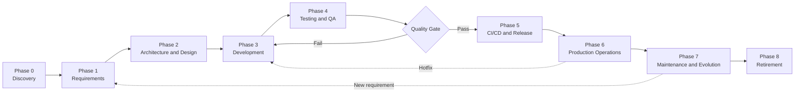

+++
date = '2026-08-25T09:00:00+10:00'
draft = false
title = 'The Software Development Lifecycle'
tags = ['SDLC','Software Development','Fintech','Process']
summary = "The full SDLC from discovery to retirement, with practices and references."
+++

## Introduction

This post is part one of a series on software engineering in Telly's fintech domain. It walks the generic lifecycle every product moves through — from first idea to retirement — before later posts map personas and AI practice onto it.

## The Software Development Lifecycle

### SDLC Flow
Starts from the first idea to production and beyond. We have to take a generic approach as different domains follow a slightly different approach that works for them.

**References:** 
- *Software Engineering* (Sommerville, 10th ed, 2016)
- *Software Engineering: A Practitioner's Approach* (Pressman and Maxim, 9th ed, 2020) 
- ISO/IEC/IEEE 12207:2017 (software life cyccomprehensivele processes). 

### Phase 0: Discovery and Idea
- Validates the problem is real
- That **people will use** the solution 
- Building it makes **business sense**
- **Timing** is right
- Validate demand before building - **build-measure-learn** loop and a minimal viable product (**MVP**) to test assumptions with real users early - "The Lean Startup (Ries, 2011)"
- Run a **feasibility study**: technical, financial, timeline, regulatory and compliance.
- Decide **build vs buy vs borrow**. 
- Choose the technology only after the problem is understood — **avoid following hype cycles**.
- Define **success criteria and the business case**; secure stakeholder alignment.

**Deliverables:** 
- Problem statement
- Business case
- MVP scope
- Success metrics.

**References:** 
- *The Lean Startup* (Ries, 2011); 
- *The Mythical Man-Month* (Brooks, 1975); 
- [PMBOK Guide (PMI, 7th ed, 2021).](https://tegnum.edu.pe/wp-content/uploads/2023/09/Project-Management-Institute-A-Guide-to-the-Project-Management-Body-of-Knowledge-PMBOK-R-Guide-PMBOK%C2%AE%EF%B8%8F-Guide-Project-Management-Institute-2021.pdf)

### Phase 1: Requirements Engineering
- Elicit requirements from stakeholders through **interviews**, **workshops**, **observation** and **document analysis** - Software Engineering (Sommerville, 2016)
- **Functional requirements** what the system does; **non-functional requirements** Quality of Service - performance, security, availability, scalability and usability.
    - Analyse and prioritise. 
- Agile teams write user stories with acceptance criteria and follow the **INVEST model** (Bill Wake, 2003). 
    - **Independent** — the story can be implemented without depending on other stories.
    - **Negotiable** — it is not a contract; details are discussed and refined with the team.
    - **Valuable** — delivers clear value to the user or stakeholder.
    - **Estimable** — the team can reasonably estimate the effort required.
    - **Small** — small enough to complete within a single sprint or bolt.
    - **Testable** — has clear acceptance criteria so it can be verified.
 - Regulated environments keep a formal software requirements specification (SRS) with traceability.

**Deliverables**
- product backlog or SRS
- acceptance criteria
- Definition of Ready
- Definition of Done.

**References:** 
- *Software Engineering* (Sommerville, 2016); the Scrum Guide (Schwaber and Sutherland).
- ISO/IEC/IEEE 29148 (requirements engineering); 

### Phase 2: Architecture and Design
- Design System and choose architecture that fits the problem:
    - layered
    - microservices
    - event-driven
    - serverless 
- Model the domain with Domain-Driven Design: 
  - ubiquitous language — a shared vocabulary between developers and domain experts, used consistently in code, conversation and documentation. For example in fintech the team agrees on terms like `CustomerRiskProfile`, `PaymentAuthorization` so the same words appear in domain models, APIs, tickets and conversations — eliminating the gap between "business speak" and "code speak"
  - bounded contexts
  - aggregates 
- Design using the C4 model (C4, Brown, 2018) — four levels of increasing detail: 
  - **Context** (high-level) — system boundaries, actors and external dependencies
  - **Containers** (high-level) — deployable units (applications, data stores, message brokers) and their interactions
  - **Components** (low-level) — modules, interfaces, data flow and security boundaries within each container
  - **Code** (low-level) — classes, algorithms and design patterns (*Design Patterns*, Gamma et al, 1994)
- Define the data model and API contracts before implementation.
- Record decisions as Architecture Decision Records (ADRs) so future teams know why things are the way they are.
- Design for failure: circuit breakers, retries with backoff, timeouts, queues and graceful degradation (*Release It!*, Nygard, 2007).

**Deliverables:** 
- Architecture design document
- ADRs
- Ddata model
- API specifications
- Security architecture.

**References:** 
- *Designing Data-Intensive Applications* (Kleppmann, 2017); 
- *Clean Architecture* (Martin, 2017); 
- *Domain-Driven Design* (Evans, 2003); 
- *Design Patterns* (Gamma et al, 1994); 
- *Release It!* (Nygard, 2007).

### Phase 3: Development (Construction)
- Turn the **design into working, tested code**.
- Set up version control (Git) and agree a branching strategy. Common strategies:
  - **Trunk-based development** — All developers commit to `main`; small, frequent, gated merges. Standard recommendation for continuous delivery; requires strong CI discipline.
  - **Git Flow** — Multiple long-lived branches: `main`, `develop`, `release-*`, `hotfix-*`. Best for complex releases and scheduled versioning; higher merge overhead.
  - **GitHub Flow** — Feature branches + pull requests → `main`. Simple, linear history; ideal for web teams and rapid feedback loops.
  - **Feature Branching** — Each feature gets its own branch; merged when complete. Slower, isolated development; risk of long-lived branches and merge conflicts.
  - **Release Branching** — Stable `main` + separate release branches for critical fixes. Best for critical systems and compliance environments; higher maintenance burden.
- Follow coding standards enforced by linting and static analysis. 
- Write tests alongside code: Test Driven Development (Beck, 2003).
- Review every change: Pull requests, Code review, pair or mob programming for complex work.
- Integrate continuously: commit small, integrate frequently, keep the build green (Fowler, 2006).
- Keep the code healthy: refactor in small steps (Fowler, 1999) and avoid premature optimisation.

**Deliverables:** 
- source code
- unit tests
- review records
- CI build.

**References:** 
- *Code Complete* (McConnell, 2004); 
- *Clean Code* (Martin, 2008); 
- *Test-Driven Development: By Example* (Beck, 2003); 
- *Refactoring* (Fowler, 1999); 
- *The Pragmatic Programmer* (Hunt and Thomas, 1999).

### Phase 4: Testing and Quality Assurance
- Verify the software works, and keep proving it as it changes.
- Follow the **test pyramid**: many fast **unit tests**, fewer **integration tests** and a small number of **end-to-end tests** (Cohn, 2009).
- Test at the standard levels from the ISTQB syllabus: 
  - Component (unit) ≈ **Dev** environment
  - Integration ≈ **SQI** System Quality Integration environment
  - System ≈ **SVT** System Validation Testing environment
  - Acceptance testing ≈ **UAT** & **Pre-Prod** environments
- Automate regression tests and run them in CI on every change.
- Add non-functional testing: performance and load, security (OWASP Top 10 and OWASP ASVS), accessibility and usability.
- Use behaviour-driven development for shared understanding: Gherkin scenarios written before the code (North, 2006).
- Enforce quality gates before merge: code review approval, coverage thresholds, lint rules and passing tests.

**Deliverables:** 
- automated test suites
- test reports
- quality metrics.

**References:** 
- ISTQB Foundation syllabus
- *Succeeding with Agile* (Cohn, 2009)
- *Introducing BDD* (North, 2006)
- OWASP Top 10 and OWASP ASVS.

### Phase 5: Build, Continuous Integration and Release (CI/CD)
- Make the path to production fast, automated and safe.
- Build and test every commit in a CI pipeline; produce immutable, versioned artifacts. Keep build, release and run separate (Twelve-Factor App, Wiggins, 2011).
- Promote the same artifact through environments: Dev → SQI → SVT → Pre-Prod → Prod. Keep environments as close to production as possible (dev/prod parity); each environment tests the same immutable artifact.
- Automate deployment with release pipelines so software is always in a deployable state (*Continuous Delivery*, Humble and Farley, 2010).
- Use safe deployment patterns to minimize risk and enable rollback:
  - **Rolling** — gradually replace instances; steady state with no downtime; slower feedback on issues.
  - **Blue-green** — maintain two identical environments; instant switch between versions; high infrastructure cost.
  - **Canary** — route small % of traffic to new version; detect issues before full rollout; requires monitoring and fast rollback.
  - **Shadow/Dark** high
  - **A/B testing** — both versions serve live traffic simultaneously; measure user behavior and business impact; requires feature flags and analytics.
  - Feature flags decouple deploy from release in all patterns; allow instant user-facing toggles without redeployment.
- Gate every release on automated checks: tests, static analysis, security scanning, compliance checks and health checks after deployment.

**Deliverables:** 
- CI/CD pipeline
- release automation
- deployment runbooks.

**References:** 
- *Continuous Delivery* (Humble and Farley, 2010)
- *Continuous Integration* (Fowler, 2006); 
- *The DevOps Handbook* (Kim, Humble, Debois and Willis, 2016); 
- Twelve-Factor App (Wiggins, 2011).

### Phase 6: Production Operations and Reliability
- Run the system reliably, safely and economically once it is live.
- Define **reliability targets: service level indicators (SLIs), service level objectives (SLOs) and error budgets** (*Site Reliability Engineering*, Beyer et al, 2016).
- Implement **observability**: metrics, structured logs, distributed tracing, dashboards and alerting.
- Set up on-call and **incident management**: detection, response, escalation and communication. ITIL 4 defines incident and problem management as standard practices.
- Run blameless postmortems after every significant incident.
- Plan capacity, backups, restore drills and disaster recovery.
- **Control cost:** track cloud spend, rightsize resources and automate scaling.
- Harden production security: vulnerability scanning, patching and regular access reviews.
- Optionally run chaos experiments to prove failure handling works (*Principles of Chaos Engineering*, 2017).

**Deliverables:** 
- SLOs
- runbooks
- incident response plan
- monitoring and alerting
- capacity plan
- disaster recovery plan.

**References:** 
- *Site Reliability Engineering* (Beyer et al, 2016); 
- *The Site Reliability Workbook* (2018); 
- *ITIL 4 Foundation* (AXELOS, 2019); 
- *Principles of Chaos Engineering* (2017).

### Phase 7: Maintenance and Evolution
- Keep the system alive, correct and competitive after launch.
- Classify and manage maintenance work: corrective (fixing defects), adaptive (new platforms, regulations or compliance), perfective (new features and improvements) and preventive (refactoring and technical debt reduction) — IEEE 1219.
- Manage technical debt explicitly: track it, pay it down in small steps and use automated tests as a safety net (*Refactoring*, Fowler, 1999; *Working Effectively with Legacy Code*, Feathers, 2004).
- Release on a regular cadence with regression protection from the automated test suite.
- Feed production telemetry back into requirements, design and testing.
- Improve continuously using the DORA four key metrics (*Accelerate*, Forsgren, Humble and Kim, 2018).: 
  - Deployment frequency
  - Lead time for changes 
  - Change failure rate 
  - Time to restore service 
- Plan dependency and platform upgrades; never let versions drift so far that migration becomes a project in itself.

**Deliverables:** 
- maintenance backlog
- release cadence
- technical debt register
- improvement roadmap.

**References:** 
- IEEE 1219 (software maintenance); 
- *Refactoring* (Fowler, 1999); 
- *Working Effectively with Legacy Code* (Feathers, 2004); 
- *Accelerate* (Forsgren et al, 2018); 
- CMMI-DEV for process maturity.

### Phase 8: Retirement (Sunset)
- Take the system out of service cleanly and responsibly.
- Decide when to retire: when the cost of running exceeds the value delivered, or a replacement exists.
- Plan the exit: data migration or archival, decommissioning integrations, winding down third-party contracts and cleaning up DNS and certificates.
- Communicate the plan to users and stakeholders well in advance.
- Keep required records and audit trails, especially in regulated fintech environments.
- Shut down in stages with a rollback path if the replacement underperforms.

**Deliverables:** 
- Retirement plan
- data archival or migration
- final closeout report.

**References:** 
- ISO/IEC/IEEE 12207 (retirement process); 
- PMBOK Guide (project closure).

### Cross-Cutting Practices
- These apply across every phase above.
- **Process framework:** agile (Scrum, Kanban, extreme programming) for most product work; plan-driven (waterfall) where requirements are fixed and heavily regulated; hybrid models in between. Agile Manifesto (2001).
- **Ceremonies and cadence:** sprint planning, daily standup, review and retrospective (the Scrum Guide). Retrospectives drive continuous improvement.
- **Estimation:** story points and planning poker based on Wideband Delphi (Boehm, 1981), relative sizing and T-shirt sizing.
- **Version control and commit discipline:** Small, atomic commits with clear messages; pull request reviews before merge; pair or mob programming for complex work as code review alternative; feature flags to decouple deploy from release in production.
- **Quality and compliance gates:** security reviews, audit trails and traceability from requirement to production change. Fintech adds mandatory gates: ISO/IEC 27001, PCI DSS, SOC 2 and GDPR.
- **Governance:** change management and incident management follow ITIL 4; release boards for high-risk environments.

## References

**Books:**

- Beck, K. (1999). *Extreme Programming Explained*. Addison-Wesley.
- Beck, K. (2003). *Test-Driven Development: By Example*. Addison-Wesley.
- Beyer, B., Jones, C., Petoff, J. and Murphy, N. R. (eds) (2016). *Site Reliability Engineering*. O'Reilly.
- Boehm, B. (1981). *Software Engineering Economics*. Prentice Hall.
- Brooks, F. (1975). *The Mythical Man-Month*. Addison-Wesley.
- Cohn, M. (2009). *Succeeding with Agile*. Addison-Wesley.
- Evans, E. (2003). *Domain-Driven Design*. Addison-Wesley.
- Feathers, M. (2004). *Working Effectively with Legacy Code*. Prentice Hall.
- Forsgren, N., Humble, J. and Kim, G. (2018). *Accelerate*. IT Revolution Press.
- Fowler, M. (1999). *Refactoring*. Addison-Wesley.
- Gamma, E., Helm, R., Johnson, R. and Vlissides, J. (1994). *Design Patterns*. Addison-Wesley.
- Humble, J. and Farley, D. (2010). *Continuous Delivery*. Addison-Wesley.
- Hunt, A. and Thomas, D. (1999). *The Pragmatic Programmer*. Addison-Wesley.
- Kim, G., Humble, J., Debois, P. and Willis, J. (2016). *The DevOps Handbook*. IT Revolution Press.
- Kleppmann, M. (2017). *Designing Data-Intensive Applications*. O'Reilly.
- Martin, R. C. (2008). *Clean Code*. Prentice Hall.
- Martin, R. C. (2017). *Clean Architecture*. Prentice Hall.
- McConnell, S. (2004). *Code Complete* (2nd ed). Microsoft Press.
- Nygard, M. T. (2007). *Release It!*. Pragmatic Bookshelf.
- PMI (2021). *PMBOK Guide* (7th ed). Project Management Institute.
- Pressman, R. and Maxim, B. (2020). *Software Engineering: A Practitioner's Approach* (9th ed). McGraw-Hill.
- Ries, E. (2011). *The Lean Startup*. Crown Business.
- Skelton, M. and Pais, M. (2019). *Team Topologies: Organizing Business and Technology Teams for Fast Flow*. IT Revolution Press.
- Sommerville, I. (2016). *Software Engineering* (10th ed). Pearson.
- Schwaber, K. and Sutherland, J. *The Scrum Guide*.

**Standards and frameworks:**

- ISO/IEC/IEEE 12207:2017. *Software life cycle processes*.
- ISO/IEC/IEEE 29148. *Requirements engineering*.
- IEEE 1219. *Software maintenance*.
- ISO/IEC 27001. *Information security management*.
- CMMI-DEV. *Capability Maturity Model Integration for Development*.
- ITIL 4 Foundation (AXELOS, 2019).
- ISTQB Certified Tester Foundation Level syllabus.
- OWASP Top 10 and OWASP Application Security Verification Standard (ASVS).
- PCI DSS, SOC 2 (AICPA) and GDPR (EU 2016/679).

**Online references:**

- Agile Manifesto (2001). agilemanifesto.org.
- Fowler, M. (2006). *Continuous Integration*. martinfowler.com.
- North, D. (2006). *Introducing BDD*.
- Wake, B. (2003). *INVEST in Good Stories, and SMART Tasks*.
- Wiggins, A. (2011). *Twelve-Factor App*. 12factor.net.
- *Principles of Chaos Engineering* (2017). principlesofchaos.org.
