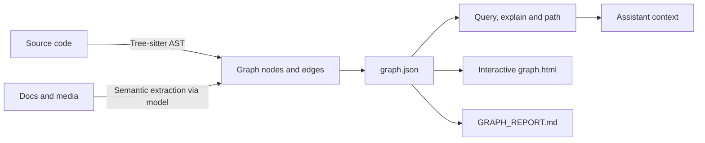

+++
date = '2026-10-05T12:30:00+10:00'
draft = false
title = 'Graphify: A Technical Guide to Codebase Knowledge Graphs'
tags = ['Graphify', 'Knowledge Graphs', 'AI Agents', 'Code Intelligence', 'Context Engineering']
summary = 'Build and query a local knowledge graph for an AI coding assistant.'
+++

Graphify is an open-source command-line tool and coding-assistant skill that turns a repository into a queryable knowledge graph. The graph connects source code, documentation, configuration and supported media, so an assistant can ask about relationships instead of repeatedly searching files from scratch. This guide covers Graphify-Labs' `graphifyy` package and its `graphify` command, documented in the [official repository](https://github.com/Graphify-Labs/graphify). Several projects use the name Graphify; this article refers only to Graphify-Labs' project. The repository ships `LICENSE` and `LICENSE-MIT` files, and GitHub reports the repository licence as Apache-2.0.

Graphify is useful when a repository has relationships that isolated search results do not recover: a request handler calls a service, the service reads a schema, an ADR explains a constraint and a test verifies the behaviour. Graphify represents entities as nodes and relationships as edges, then provides commands to inspect nodes, ask scoped questions and trace paths.

The key architectural distinction is that Graphify is graph-based retrieval, not a vector database. Code extraction uses tree-sitter syntax trees and resolves relationships such as `calls`, `imports`, `inherits` and `mixes_in`. The repository describes this code path as local and deterministic, with no LLM calls. Documentation and media take a semantic extraction path through an assistant model or a configured backend. Every connection carries an evidence tag, `EXTRACTED` or `INFERRED`, so a reader can separate source-backed structure from resolved relationships. The [README](https://github.com/Graphify-Labs/graphify#readme) lists the current supported inputs, backends and options.

## Why model a codebase as a graph?

Text search answers questions about words and file locations. A graph answers questions about connections. A search for `DatabasePool` may find its declaration and several references; a graph query can return adjacent concepts or show the shortest path between `UserService` and `DatabasePool`.

Architectural knowledge crosses file boundaries. A function definition alone does not show who invokes it, which module imports it or what rationale shaped it. Graph relationships provide a compact structure an assistant can use to choose what to inspect next.

The basic model is:

| Graph element  | Meaning                                                     | Example                            |
| -------------- | ----------------------------------------------------------- | ---------------------------------- |
| Node           | A code symbol, document concept or other extracted entity   | `UserService`                      |
| Edge           | A typed relationship between two nodes                      | `UserService --calls--> load_user` |
| Evidence label | Whether an edge was read explicitly or resolved by Graphify | `EXTRACTED` or `INFERRED`          |
| Community      | A cluster of densely connected nodes                        | Authentication subsystem           |

Graphify's documentation also highlights highly connected “god nodes” and communities detected with Leiden clustering. These are navigation aids. A highly connected node may be an architectural hub, a common utility or a symbol referenced widely; the score alone does not prove design importance.



## How Graphify builds the graph

Graphify's repository documents two extraction paths rather than one uniform parser.

### Code extraction

For supported programming languages, Graphify parses code locally using tree-sitter grammars. The README's capability table lists `calls`, `imports`, `inherits` and `mixes_in` as the cross-file relationships it resolves, and its file table lists 37 tree-sitter grammars. Syntax-based extraction does not require an LLM API key, so Graphify builds a code-only graph without sending source code to a model provider.

Extracted code includes more than symbols. Package manifests (`pyproject.toml`, `go.mod`, `pom.xml`, `apm.yml`) contribute one canonical node per package with `depends_on` edges. Assistant configuration files (`.mcp.json`, `mcp.json`, `mcp_servers.json`, `claude_desktop_config.json`) contribute server nodes, package references and environment-variable requirements. Inline comments such as `# NOTE:`, `# WHY:` and `# HACK:`, docstrings and ADR or RFC citations become first-class nodes linked to the code they explain.

Static extraction has boundaries. A parser can represent syntax and the relationships it resolves from source, but it does not execute the application or prove runtime behaviour. Dynamic dispatch, reflection, generated code and runtime configuration may require interpretation beyond a static edge. Treat the graph as a navigable model of extracted source, then inspect code and run the relevant validation before relying on behaviour claims.

### Documentation and media extraction

The README's file table covers documentation (`.md`, `.mdx`, `.qmd`, `.html`, `.txt`, `.rst`, `.yaml`, `.yml`), PDFs (`.pdf`), images (`.png`, `.jpg`, `.webp`, `.gif`) and video and audio (`.mp4`, `.mov`, `.mp3`, `.wav`) plus any video URL. Markdown links and `[[wikilinks]]` become `references` edges between documents. Non-code content uses the assistant's model or a configured backend for semantic extraction, and several formats require an optional package, listed in the optional extras table below.

This path has different privacy and cost characteristics from code parsing. A local tree-sitter parse does not imply that every input is processed locally. Video and audio are transcribed locally with faster-whisper, so that content does not leave the machine; documents, PDFs and images do. If a run includes documents or media, check which model or backend is configured and what content that backend receives. `graphify extract` auto-detects a provider from the API keys present, in the priority order Gemini, Kimi, Claude, OpenAI, DeepSeek, Azure, Bedrock, Ollama. The README states that the Kimi backend (`MOONSHOT_API_KEY`) routes to Moonshot AI servers in China. For code with data-residency requirements, the README recommends `--backend ollama` or an explicit `--backend` flag.

### Evidence labels and uncertainty

The README states that each connection is tagged `EXTRACTED`, meaning explicit in the source, or `INFERRED`, meaning derived by resolution. The report's confidence tags list three values: `EXTRACTED`, `INFERRED` and `AMBIGUOUS`.

These labels make uncertainty visible, but they do not replace source review. An extracted edge can still be incomplete or stale, and an inferred edge should be checked before it informs a consequential change. An import statement is direct evidence of a module dependency. A semantic link between a design document and a function can be useful, but the reader should verify that the document still describes the current implementation.

### What lands in `GRAPH_REPORT.md`

The README lists five contents:

1. God nodes, described as the most-connected concepts in the project.
2. Surprising connections, meaning links between things that live in different files or modules, ranked by how unexpected they are.
3. The “why”: inline comments, docstrings and design rationale extracted as separate nodes linked to the code they explain.
4. Suggested questions, four to five questions the graph is uniquely positioned to answer.
5. Confidence tags on inferred relationships.

The README's capability table describes communities as Leiden-split with LLM-free labels, while its command reference states that running the bare CLI (`cluster-only`) auto-names communities with the configured backend, and `--no-label` keeps `Community N` placeholders. Inside an agent such as Claude Code or Gemini CLI, the agent names the communities itself. Plan for the possibility that community naming costs a backend call when you run clustering from the terminal.

## Prerequisites

The README lists Python 3.10 or newer, plus `uv` (recommended) or `pipx` (alternative):

```bash
# check what you already have
python --version
uv --version

# install uv on macOS or Linux
curl -LsSf https://astral.sh/uv/install.sh | sh

# platform alternatives
brew install python@3.12 uv
winget install astral-sh.uv
sudo apt install python3.12 python3-pip pipx
```

## Install Graphify

The official PyPI package is named `graphifyy` with two trailing `y` characters, and the installed command is named `graphify`. The repository states that other `graphify*` packages on PyPI are not affiliated. Its recommended installation uses `uv`:

```bash
uv tool install graphifyy
graphify install
```

`pipx install graphifyy` is the documented alternative. The README advises against plain `pip install graphifyy` on macOS and Windows, because the skill resolves Python at runtime from `graphify-out/.graphify_python`; if that path points at a different environment than the one `pip` installed into, the skill fails with `ModuleNotFoundError: No module named 'graphify'`. `uv tool install` and `pipx install` isolate the package and avoid that failure.

`graphify install` registers the assistant skill for the detected or selected platform. The bare command targets Claude Code. To register the skill for a named platform, pass `--platform`:

| Platform                      | Skill registration                                               |
| ----------------------------- | ---------------------------------------------------------------- |
| Claude Code                   | `graphify install`                                               |
| Codex                         | `graphify install --platform codex`                              |
| OpenCode                      | `graphify install --platform opencode`                           |
| Cursor                        | `graphify cursor install`                                        |
| Gemini CLI                    | `graphify install --platform gemini`                             |
| GitHub Copilot CLI            | `graphify install --platform copilot`                            |
| Aider                         | `graphify install --platform aider`                              |
| VS Code Copilot Chat          | `graphify vscode install`                                        |
| Agent Skills, cross-framework | `graphify install --platform agents` (alias `--platform skills`) |

To install project-scoped instructions for Codex, the README documents:

```bash
graphify install --project --platform codex
```

Project-scoped installation writes assistant configuration files in the current repository, for example `.claude/skills/graphify/SKILL.md` or `.agents/skills/graphify/SKILL.md` plus a `references/` sidecar, and prints a `git add` hint. Review those files before committing them, especially when team instructions are maintained centrally. Per-platform commands accept the same flag, for example `graphify codex install --project`. For other assistants, use the platform-specific command listed by the [official installation guide](https://github.com/Graphify-Labs/graphify#install).

Three platform details are documented in the README and are easy to miss:

- Codex invokes the skill as `$graphify`, not `/graphify`.
- Codex needs `multi_agent = true` under `[features]` in `~/.codex/config.toml` for parallel extraction.
- On Windows PowerShell, run `graphify .` without the leading slash, because PowerShell reads `/` as a path separator.

For Claude Code, `graphify install --project --strict` changes the default soft nudge into enforcement: it blocks the first raw source read of a session and redirects it to the graph, then reverts to the nudge, so it fires at most once per session. `GRAPHIFY_HOOK_STRICT=1` or `GRAPHIFY_HOOK_STRICT=0` toggles it at runtime.

If the `graphify` command is not found after installing with `uv`, the tool's bin directory may not be on `PATH`. The README recommends `uv tool update-shell` and opening a new terminal, and `pipx ensurepath` for pipx installs. Use `uvx --from graphifyy graphify ...` when running without a persistent tool installation; `uvx graphify ...` asks uv for a package named `graphify`, which is not the official package name.

## Optional extras

The README documents these extras. Install only what the input types in your repository require:

| Extra       | What it adds                                           | Install                                  |
| ----------- | ------------------------------------------------------ | ---------------------------------------- |
| `pdf`       | PDF extraction                                         | `uv tool install "graphifyy[pdf]"`       |
| `office`    | `.docx` and `.xlsx` support                            | `uv tool install "graphifyy[office]"`    |
| `video`     | Video and audio transcription (faster-whisper, yt-dlp) | `uv tool install "graphifyy[video]"`     |
| `mcp`       | MCP server                                             | `uv tool install "graphifyy[mcp]"`       |
| `sql`       | SQL schema extraction                                  | `uv tool install "graphifyy[sql]"`       |
| `postgres`  | Live PostgreSQL introspection via `--postgres` DSN     | `uv tool install "graphifyy[postgres]"`  |
| `svg`       | SVG graph export                                       | `uv tool install "graphifyy[svg]"`       |
| `leiden`    | Leiden community detection                             | `uv tool install "graphifyy[leiden]"`    |
| `ollama`    | Ollama local inference                                 | `uv tool install "graphifyy[ollama]"`    |
| `openai`    | OpenAI and OpenAI-compatible APIs                      | `uv tool install "graphifyy[openai]"`    |
| `gemini`    | Google Gemini API                                      | `uv tool install "graphifyy[gemini]"`    |
| `anthropic` | Anthropic Claude API (`--backend claude`)              | `uv tool install "graphifyy[anthropic]"` |
| `bedrock`   | AWS Bedrock, uses IAM and no API key                   | `uv tool install "graphifyy[bedrock]"`   |
| `terraform` | Terraform and HCL `.tf`, `.tfvars`, `.hcl`             | `uv tool install "graphifyy[terraform]"` |
| `all`       | Every extra above                                      | `uv tool install "graphifyy[all]"`       |

The README's extras table also lists an `azure` row for Azure OpenAI Service whose install string is `uv tool install "graphifyy[openai]"`; confirm the string against `uv tool install "graphifyy[all]"` or your installed version's help output before relying on the Azure path.

## Make the assistant use the graph by default

Registering the skill makes the command available. A second, separate step writes persistent instructions so the assistant prefers the graph over raw file reads:

| Platform           | Command                     | Mechanism                                                    |
| ------------------ | --------------------------- | ------------------------------------------------------------ |
| Claude Code        | `graphify claude install`   | `CLAUDE.md` plus a `PreToolUse` hook (`graphify hook-guard`) |
| Codex              | `graphify codex install`    | `AGENTS.md`                                                  |
| OpenCode           | `graphify opencode install` | `AGENTS.md` plus a `tool.execute.before` plugin              |
| Gemini CLI         | `graphify gemini install`   | `GEMINI.md` plus a `BeforeTool` hook                         |
| Cursor             | `graphify cursor install`   | `.cursor/rules/graphify.mdc` with `alwaysApply: true`        |
| GitHub Copilot CLI | `graphify copilot install`  | Skill file                                                   |
| Aider              | `graphify aider install`    | `AGENTS.md`                                                  |

The README splits these into two categories. Hook platforms fire a hook before search-style tool calls and nudge the assistant toward a scoped query. Instruction-file platforms carry the same guidance in a persistent file such as `AGENTS.md` or `.cursor/rules/`.

On Codex, `AGENTS.md` is the always-on mechanism. `graphify codex install` also registers a `PreToolUse` hook in `.codex/hooks.json`, and the README states that this entry is deliberately a no-op, because Codex Desktop rejects `hookSpecificOutput.additionalContext` on `PreToolUse`.

`graphify uninstall` removes Graphify from every platform at once; add `--purge` to also delete `graphify-out/`. Per-platform removal also works, for example `graphify claude uninstall`.

## Build a graph for a repository

From the repository root, invoke the Graphify skill in the coding assistant, using the syntax that assistant supports. The README's general example is:

```text
/graphify .
```

The repository also documents `$graphify` as the Codex invocation, and `graphify .` as the PowerShell form. A successful build creates `graphify-out/` with three main artifacts:

```text
graphify-out/
├── graph.html       # interactive visualisation
├── GRAPH_REPORT.md  # highlights and suggested questions
└── graph.json       # queryable graph data
```

`graph.html` provides a visual way to search and inspect connected nodes. `GRAPH_REPORT.md` summarizes prominent concepts and connections. `graph.json` is the structured graph used by Graphify's query commands and can also be consumed by other tooling.

For a repeatable terminal workflow, Graphify documents commands in this family:

```bash
# Extract the current repository using the installed Graphify package
graphify extract .

# Ask a natural-language question against the saved graph
graphify query "what connects auth to the database?"

# Explain one graph node
graphify explain "RateLimiter"

# Find a path between two named nodes
graphify path "UserService" "DatabasePool"
```

The assistant skill can orchestrate extraction and model-assisted semantic processing. Exact extraction flags and backend requirements vary by input type, so consult the [command reference](https://github.com/Graphify-Labs/graphify#full-command-reference) before adapting commands for automation. Graphify also offers `--no-viz` to omit HTML output, `--update` for changed-file extraction and `--cluster-only` to rerun clustering; verify options against the installed version's help output.

## Query patterns that are useful in practice

### Ask a scoped question

```bash
graphify query "what connects auth to the database?"
```

The query returns a relevant subgraph rather than requiring the assistant to load every repository file. Review the returned nodes and edges to identify what to open next.

### Explain a concept

```bash
graphify explain "RateLimiter"
```

An explanation can include the node's source, community, degree and adjacent connections. This is real output from the FastAPI codebase, reproduced from the README:

```text
Node: APIRouter
  Source:    routing.py L2210
  Community: 2
  Degree:    47

Connections (47):
  --> RequestValidationError [uses] [INFERRED]
  --> Dependant [uses] [INFERRED]
  --> .get() [method] [EXTRACTED]
  <-- __init__.py [imports] [EXTRACTED]
```

Degree is the number of graph connections associated with a node; it can help prioritize investigation, but it does not measure code quality or business criticality by itself.

### Trace a path

```bash
graphify path "UserService" "DatabasePool"
```

A shortest path shows one connection chain between two nodes. This is the README's example output:

```text
Shortest path (3 hops):
  FastAPI --uses--> DefaultPlaceholder <--references-- get_request_handler() --references--> ModelField
```

The path does not claim that the chain is the only execution path or that the application follows that route at runtime. Use the path as a map, then confirm the relevant call sites and control flow in source.

### Use the graph through MCP

The project documents an optional MCP server for structured access. Install the MCP extra, then serve a previously generated graph:

```bash
uv tool install "graphifyy[mcp]"
python -m graphify.serve graphify-out/graph.json
```

The documented tools are `query_graph`, `get_node`, `get_neighbors`, `shortest_path`, `list_prs`, `get_pr_impact` and `triage_prs`. `graphify query` also accepts `--graph <path>` to query a graph other than the default one, and `/graphify query "..." --dfs --budget 1500` to traverse depth-first within a token budget.

`--transport http` serves the same tools over the MCP Streamable HTTP transport, so a team can point IDE MCP configurations at one shared process instead of running Graphify per developer:

```bash
python -m graphify.serve graphify-out/graph.json --transport http --port 8080
python -m graphify.serve graphify-out/graph.json --transport http --host 0.0.0.0 --api-key "$SECRET"
```

| Flag                       | Default            | Purpose                                                   |
| -------------------------- | ------------------ | --------------------------------------------------------- |
| `--transport {stdio,http}` | `stdio`            | Transport to serve on                                     |
| `--host`                   | `127.0.0.1`        | HTTP bind host                                            |
| `--port`                   | `8080`             | HTTP bind port                                            |
| `--api-key`                | `GRAPHIFY_API_KEY` | Require `Authorization: Bearer <key>` or `X-API-Key`      |
| `--path`                   | `/mcp`             | HTTP mount path                                           |
| `--json-response`          | off                | Return plain JSON instead of SSE streams                  |
| `--stateless`              | off                | No per-session state, for load-balanced or CI deployments |
| `--session-timeout`        | `3600`             | Reap idle stateful sessions after N seconds, `0` disables |

The default bind is loopback-only. The README instructs teams to set `--host 0.0.0.0` and `--api-key` together when exposing the server beyond localhost, and shows a container form:

```bash
docker build -t graphify .
docker run -p 8080:8080 -v "$(pwd)/graphify-out:/data" graphify \
  /data/graph.json --transport http --host 0.0.0.0 --api-key "$SECRET"
```

Exposing a shared server changes the trust boundary: the graph then describes the repository to anyone who can reach the port. Protect access and review the project's authentication and network configuration before placing the server on a team network. Refer to the [MCP section of the repository](https://github.com/Graphify-Labs/graphify#using-the-graph-directly) for current transport instructions. Clients that prefer a registry can install the same server through Smithery with `npx -y @smithery/cli install graphify/graphify --client claude`.

## Headless extraction and CI

Running the skill inside an assistant uses that session's model, so no extra key is required. Running the CLI needs credentials of its own:

```bash
graphify extract ./docs
graphify extract ./docs --backend ollama
graphify extract ./raw --code-only
```

`--code-only` is an `extract` flag rather than a skill flag. It indexes code and skips the documents, PDFs and images that would otherwise require a model, which makes a code-only run fully offline.

| Backend                | Credential                                                                                                                            |
| ---------------------- | ------------------------------------------------------------------------------------------------------------------------------------- |
| `--backend gemini`     | `GEMINI_API_KEY` or `GOOGLE_API_KEY`                                                                                                  |
| `--backend kimi`       | `MOONSHOT_API_KEY`; traffic goes to Moonshot AI servers in China                                                                      |
| `--backend claude`     | `ANTHROPIC_API_KEY`, default model `claude-sonnet-4-6`                                                                                |
| `--backend openai`     | `OPENAI_API_KEY`, default model `gpt-4.1-mini` at `https://api.openai.com/v1`; set `OPENAI_BASE_URL` for llama.cpp, vLLM or LM Studio |
| `--backend deepseek`   | `DEEPSEEK_API_KEY`                                                                                                                    |
| `--backend azure`      | `AZURE_OPENAI_API_KEY` and `AZURE_OPENAI_ENDPOINT`                                                                                    |
| `--backend bedrock`    | `AWS_*` variables or `~/.aws/credentials` through the standard provider chain, no API key                                             |
| `--backend ollama`     | none; `OLLAMA_BASE_URL` defaults to `http://localhost:11434` and `OLLAMA_MODEL` is auto-detected                                      |
| `--backend claude-cli` | the `claude` binary on `PATH`; uses the Claude subscription instead of an API key                                                     |

Cost and reliability are controlled by documented limits. `GRAPHIFY_MAX_RETRIES` defaults to 6 attempts on a `429` response and honours `Retry-After`. `GRAPHIFY_MAX_RETRY_DEPTH` defaults to 3, so one truncated chunk can cost up to eight sub-calls; set it to `0` to make one chunk cost exactly one call. `GRAPHIFY_MAX_OUTPUT_TOKENS` raises the output cap for dense corpora, `--token-budget` shrinks each chunk, and `GRAPHIFY_API_TIMEOUT` defaults to 600 seconds. `GRAPHIFY_MAX_WORKERS` sets AST parallelism. `graph.json` has a default 512 MiB size cap, raised with `GRAPHIFY_MAX_GRAPH_BYTES`.

`graphify extract` refuses to overwrite a larger existing graph when an extraction pass completes only partially, and reports `extraction was incomplete ... refusing to overwrite`. Fix the underlying failure and re-run, or pass `--allow-partial` to overwrite anyway.

The README's privacy section and its environment-variable table describe the local query log differently. The privacy section states that every `graphify query`, `graphify path`, `graphify explain` and MCP `query_graph` call is written to `~/.cache/graphify-queries.log` in JSON Lines format; the environment-variable table describes the log as off by default unless `GRAPHIFY_QUERY_LOG_ENABLE=1` is set. Treat the behaviour of your installed version as unverified until you check it, and set `GRAPHIFY_QUERY_LOG_DISABLE=1` to opt out. The README states separately that Graphify sends no telemetry and no analytics.

## Command map

The README separates skill invocations, typed inside an assistant, from CLI commands typed in a terminal:

| Goal                                    | Skill                                                  | CLI                                                                                                    |
| --------------------------------------- | ------------------------------------------------------ | ------------------------------------------------------------------------------------------------------ |
| Build a graph                           | `/graphify .` (`$graphify .` on Codex)                 | `graphify extract .`                                                                                   |
| Build code only, no API key             | not available                                          | `graphify extract ./raw --code-only`                                                                   |
| Re-extract changed files                | `/graphify ./docs --update`                            | `graphify update ./src`                                                                                |
| Check for changes                       | not available                                          | `graphify check-update ./src`                                                                          |
| Rebuild regardless of node count        | not available                                          | `graphify extract . --force`                                                                           |
| Recluster without re-extracting         | `/graphify . --cluster-only`                           | `graphify cluster-only ./my-project`                                                                   |
| Recluster with a named backend          | not available                                          | `graphify label ./my-project --backend=openai`                                                         |
| Watch for file changes                  | `/graphify ./raw --watch`                              | `graphify watch ./src`                                                                                 |
| Query, trace, explain                   | `/graphify query "..."`                                | `graphify query "..."`, `graphify path "A" "B"`, `graphify explain "Node"`                             |
| Add external content                    | `/graphify add https://arxiv.org/abs/1706.03762`       | not available                                                                                          |
| Markdown wiki or Obsidian vault         | `/graphify ./raw --wiki`, `/graphify ./raw --obsidian` | not available                                                                                          |
| Graph exports                           | `--svg`, `--graphml` skill flags                       | `graphify export callflow-html`                                                                        |
| Push to a graph database                | `/graphify ./raw --neo4j-push bolt://localhost:7687`   | `graphify extract . --cargo` for a Rust workspace, `graphify extract --postgres <DSN>` for live schema |
| Combine two graphs                      | not available                                          | `graphify merge-graphs a.json b.json --out merged.json`                                                |
| Query several repositories as one graph | not available                                          | `graphify global add graphify-out/graph.json --as myrepo`                                              |
| Git hooks                               | not available                                          | `graphify hook install`, `graphify hook status`, `graphify hook uninstall`                             |
| Pull-request review                     | not available                                          | `graphify prs`, `graphify prs 42`, `graphify prs --triage`                                             |
| Record and aggregate query outcomes     | not available                                          | `graphify save-result --question "Q" --answer "A" --outcome useful`, `graphify reflect`                |
| Remove the installation                 | not available                                          | `graphify uninstall`, `graphify uninstall --purge`                                                     |
| Print the installed version             | not available                                          | `graphify --version`                                                                                   |

## Keeping the graph useful

A graph reflects the files and extraction state used to build it. The README documents a per-clone setup that keeps a local graph current:

| You do                                          | Graphify does                                                                                                 |
| ----------------------------------------------- | ------------------------------------------------------------------------------------------------------------- |
| `graphify hook install`, once after cloning     | Installs post-commit and post-checkout hooks plus a merge driver so `graph.json` never shows conflict markers |
| `git commit`                                    | Rebuilds in the background, AST only, no API cost                                                             |
| `git checkout` or `git switch` between branches | Rebuilds in the background; a file-only `git checkout -- <path>` does not                                     |
| `git pull` or `git merge`                       | Nothing automatic; run `graphify update .` yourself                                                           |
| `git push`                                      | Nothing                                                                                                       |

The background rebuilds return immediately, so on a large repository the graph can lag a commit by a few seconds. Run `graphify update .` when a query seems to miss something you just added, and consider a pull alias:

```bash
git config --global alias.gpull '!git pull && graphify update .'
```

Two documented cases change the shape of the graph:

- After a refactor deletes files, old nodes linger and the new graph is smaller. Pass `--force` or set `GRAPHIFY_FORCE=1` to overwrite anyway. A warning that the node count shrank is a prompt to check whether the refactor was as complete as intended.
- Duplicate nodes for one entity, which the README calls ghost duplicates, are merged at build time. For a graph built before v0.8.33, run `graphify extract . --force` to rebuild it.

Add `.graphifyignore` patterns for generated output, vendored dependencies or sensitive directories. The README's rules are precise:

- `.gitignore` is respected automatically, and Graphify reads the `.gitignore` in each directory.
- When a `.graphifyignore` exists, the two are merged and `.graphifyignore` patterns are evaluated last, so they win on conflicts, including `!` negations.
- Adding a `.graphifyignore` only ever excludes more. It never re-includes a file that `.gitignore` already excluded.
- An ignore file only affects its own subtree, matching git behaviour.
- `--no-gitignore` disables `.gitignore` and `.git/info/exclude` for `graphify extract`, and `.graphifyignore` still applies. Pass it when git-ignored generated code belongs in the graph.

The README states that `graphify-out/` is gitignored by default. A team that wants to share a graph force-adds only the queryable products:

```bash
git add -f graphify-out/graph.json
git add -f graphify-out/GRAPH_REPORT.md
```

`manifest.json` is safe to commit, because the README states its keys are stored as relative paths and re-anchored on load. The remaining files stay machine-local and should not be force-added: `.graphify_root` and `.graphify_python`, which hold absolute paths for this machine, `.graphify_analysis.json`, the AST cache under `graphify-out/cache/` and the `needs_update` flag. A teammate who pulls the shared `graph.json` can query it immediately, and `graphify update` re-anchors the committed manifest and rebuilds what changed on their machine.

Two practical limits: browsers struggle with a `graph.html` larger than roughly 5000 nodes, in which case the README recommends `graphify cluster-only ./my-project --no-viz` and querying the JSON directly. And on Claude Code, every write into `graphify-out/` invalidates the prompt cache unless those paths are ignored; add `graph.json` and `graphify-out/` to `.claudeignore`.

## Graphify and vector search

Vector search represents text as embeddings and retrieves passages by semantic similarity. Graphify's core graph queries traverse explicit and resolved relationships between nodes. Those approaches answer different questions.

| Need                                                 | Graph traversal                         | Vector retrieval                                          |
| ---------------------------------------------------- | --------------------------------------- | --------------------------------------------------------- |
| Show how two named symbols connect                   | Strong fit                              | May retrieve related passages without a relationship path |
| Find text similar to a question                      | Not its primary mechanism               | Strong fit                                                |
| Explain imports, calls or inheritance                | Natural graph edges                     | Requires passages that mention the relationship           |
| Retrieve relevant prose from a large document corpus | Depends on extracted concepts and links | Natural fit                                               |

Graphify's repository explicitly describes the tool as not using embeddings or a vector store. That is a design choice, not evidence that one retrieval approach is universally better. A system can combine a knowledge graph with full-text or vector retrieval when it needs both relationship traversal and fuzzy document search.

## Strengths and limitations

Graphify's strengths come from structured relationships and inspectable artifacts. It can make cross-file links easier to explore, provide explanations around a node and expose paths that help an assistant gather context. Code parsing runs locally without model calls, and evidence tags make inferred edges visible.

The graph is not a substitute for the repository. Static analysis cannot establish runtime behaviour, and semantic extraction can omit or misinterpret prose. An incomplete graph can hide a relationship; a stale graph can send an assistant to outdated context. Treat graph results as an index and reasoning aid, not as authoritative proof.

Graphify publishes its own benchmark numbers. These are project-reported results for specific datasets and evaluation harnesses:

| Benchmark                | Metric            | Graphify | Comparison in the README      |
| ------------------------ | ----------------- | -------- | ----------------------------- |
| LOCOMO (n=300)           | recall@10         | 0.497    | mem0 0.048, supermemory 0.149 |
| LOCOMO (n=300)           | QA accuracy       | 45.3%    | supermemory 49.7%, mem0 27.3% |
| LongMemEval-S (n=50)     | QA accuracy       | 76%      | tied with dense RAG           |
| ERPNext cross-tool (n=6) | key-fact coverage | 82.0%    | grep and read baseline 70.8%  |
| Graph build              | LLM credits       | 0        | per-token for most systems    |

The README states that all systems ran on the same harness with the same model and budgets, scored by a judge that was blind-validated against a second judge with 90.6% agreement and Cohen's kappa 0.81. The tables show both wins and losses: on LOCOMO QA accuracy, the field result is higher. Treat these numbers as a description of the project's own setup rather than a guarantee for a different repository, model or question mix. Run a small evaluation on representative tasks before making Graphify part of a production engineering workflow. Full tables and reproduction commands are in the repository's [BENCHMARKS.md](https://github.com/Graphify-Labs/graphify/blob/v8/BENCHMARKS.md).

## A practical adoption plan

Start with one bounded repository and questions that engineers already ask, such as “what calls this handler?”, “where is this schema referenced?” and “what connects this API to its persistence layer?” Compare the answers with manual source inspection. Track whether Graphify finds useful paths, how often inferred edges need correction and how much maintenance each update requires.

If those queries help, add the assistant instructions at project scope and define the relevant ignore patterns. Decide who refreshes shared graph artifacts and whether they are committed or rebuilt on demand. For sensitive repositories, use code-only extraction or a deliberately configured local backend where appropriate, then verify the full processing path from Graphify's documentation and your assistant provider's settings.

## Summary

Graphify gives an AI coding assistant a graph-shaped map of a codebase. It extracts code relationships locally with tree-sitter, can use a model-backed semantic pass for documentation and media, and offers graph reports, visualisation and query commands. The approach is most useful when a task depends on connections across files. Its output remains a derived view: validate important conclusions against current source and runtime evidence.

The canonical source for current installation commands, supported formats and implementation details is the [Graphify-Labs repository](https://github.com/Graphify-Labs/graphify), whose default branch is `v8`. This article reflects its documented interface checked on 6 October 2026; Graphify's release and command surface can change over time.

### Sources

- Repository and README: [github.com/Graphify-Labs/graphify](https://github.com/Graphify-Labs/graphify)
- PyPI package: [pypi.org/project/graphifyy](https://pypi.org/project/graphifyy/)
- Installation and platform list: [README Install section](https://github.com/Graphify-Labs/graphify#install)
- Prerequisites: [README Prerequisites section](https://github.com/Graphify-Labs/graphify#prerequisites)
- Command reference: [README full command reference](https://github.com/Graphify-Labs/graphify#full-command-reference)
- MCP server and HTTP transport: [README Using the graph directly](https://github.com/Graphify-Labs/graphify#using-the-graph-directly)
- Environment variables and privacy: [README Environment variables](https://github.com/Graphify-Labs/graphify#environment-variables)
- Benchmarks: [BENCHMARKS.md](https://github.com/Graphify-Labs/graphify/blob/v8/BENCHMARKS.md)
- Extraction pipeline and confidence scoring: [docs/how-it-works.md](https://github.com/Graphify-Labs/graphify/blob/v8/docs/how-it-works.md)
- Module layout and adding a language: [ARCHITECTURE.md](https://github.com/Graphify-Labs/graphify/blob/v8/ARCHITECTURE.md)
- Full documentation site: [docs.graphify.com](https://docs.graphify.com)
