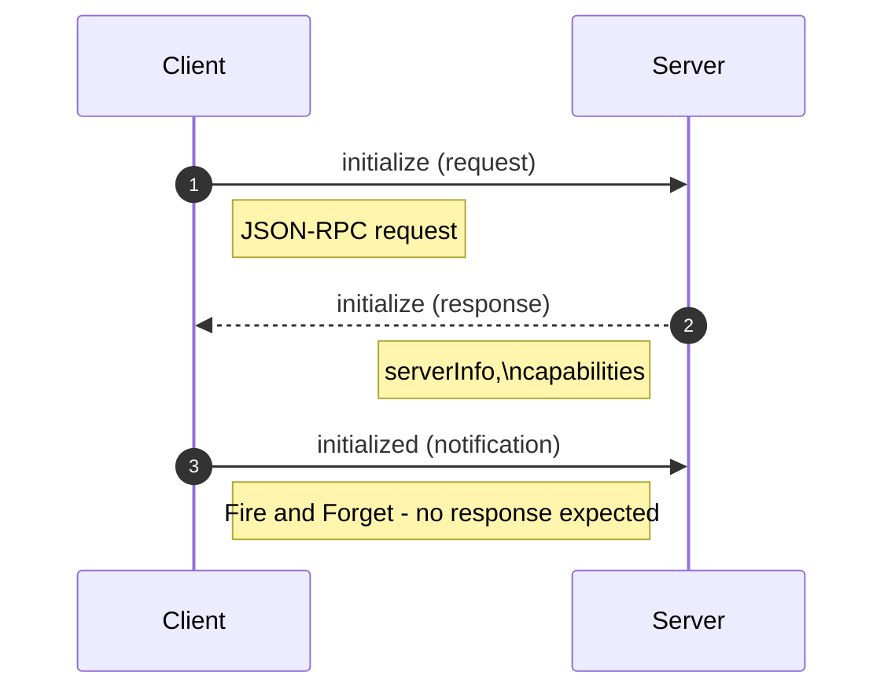
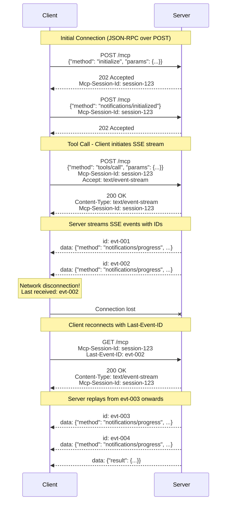

+++
date = '2026-01-01T12:44:47+10:00'
draft = false
title = 'Model Context Protocol'
tags = ['MCP', 'Agents', 'Design Patterns', 'AI']
summary = "Model Context Protocol - Notes, Best Practices, Design Patterns."
+++

## Introduction
Model Context Protocol is an open standard protocol that aims to provide a universal approach for applications to provide context to language models.
One advantage of this allows different clients to consume servers built by different vendors that too without needing to worry about compatibility issues.

MCP is built around Javascript Object Notation Remote Procedure Call (JSON-RPC 2.0) and so it's transport agnostic. It just defines the schema driven messages for client server communication. 
It is usually implemented as: 
- Streamable HTTP
- STDIO
- Server Sent Events (SSE) + HTTP.
- WebSockets (experimental - as persistent real time connectivity may be an overkill) etc.
All the above are common in that:
- they can operate on streams and support bidirectional communication.
- can handle reconnection handling.
- they can accomodate JSON-RPC messages in their payloads.
- Session Management
- supported in mcp.json file (websockets - experimental).
- Supergateway which is an open source command line which acts as bridge or adatptor convertor for MCP servers.

There might be some Transports not ideal for MCP:
- gRPC as it may require extra work to directly support JSON-RPC
- Messaging Queues (without reply queues) as they dont support RPC pattern
- UDP (without custom bidirectional protocol)
- ICMP - No Session Management
- FTP - Block Transfer Protocol
- Email - Async, unidirectional and slow.
- Server Sent Events (without HTTP) - Unidirectional and may not support all features of JSON-RPC.
- Webhooks
- Polling based HTTP etc.

[MCP Implementation and list of Servers](https://github.com/modelcontextprotocol/servers)
## Communication Message Spec 
### Class Diagram Grouped

### Class Diagram Original

At its core of the library is a BaseSession class which allows to 
- SendRequest
- ReceiveRequest
- SendNotification
- ReceiveNotification
- SendResult

## Initialization process

## Streamable HTTP
This protocol has replaced the Server Sent Events (SSE) + HTTP transport as the recommended transport for MCP.

Its generally better than  SSE + HTTP due to:
- Single Endpoint  Simplicity: client and servers communicate via single endpoint (e.g., /mcp) for all interactions, eliminating the need for separate endpoints for requests and notifications.
- Resumability: Support for resumable sessions using headers like Last-Event-ID, Mcp-Session-ID allowing clients to recover from disconnections without losing context.
- Compatibility: support for Modern HTTP Infrastucture - loadbalancers, proxies, API Gateways, CDNs etc where SSEs may face challenges.
- Bidirectional Communication: SSE is unidirectional, Streamable HTTP can be upgraded to support bidirectional communication, allowing servers to send messages to clients without the need for clients to poll for updates. This makes it apt for agent-to-agent or client-server interaction.
- Future Proofing: It is modular and extendable and designed for stateless or session based models

### Accept Header: 
  - Accept: application/json: Tells Server that client can handle batch JSON Response. The entire response is buffered and sent as a complete JSON object once it's fully ready. The client waits for the whole thing before processing.
  - Accept: text/event-stream: Tells Server that client can handle Streamed events (via SSE). Uses Server-Sent Events (SSE) to stream data incrementally. As soon as each chunk/event is available, it's sent to the client immediately, allowing for real-time progressive updates

### Resumability:
- If client loses connection with server while data is transfered, reconnects with server to resume the exchange from where it left off. 
- This is achieved using headers like Last-Event-ID, Mcp-Session-ID etc.
- In the context of MCP its only supported for Streamable HTTP (though possible with both SSE & Streamable HTTP) 

## References
1. 
    * [Source Code](https://github.com/PacktPublishing/Learn-Model-Context-Protocol-with-Python/tree/main)
2. [Official Documentation](https://github.com/modelcontextprotocol/modelcontextprotocol)