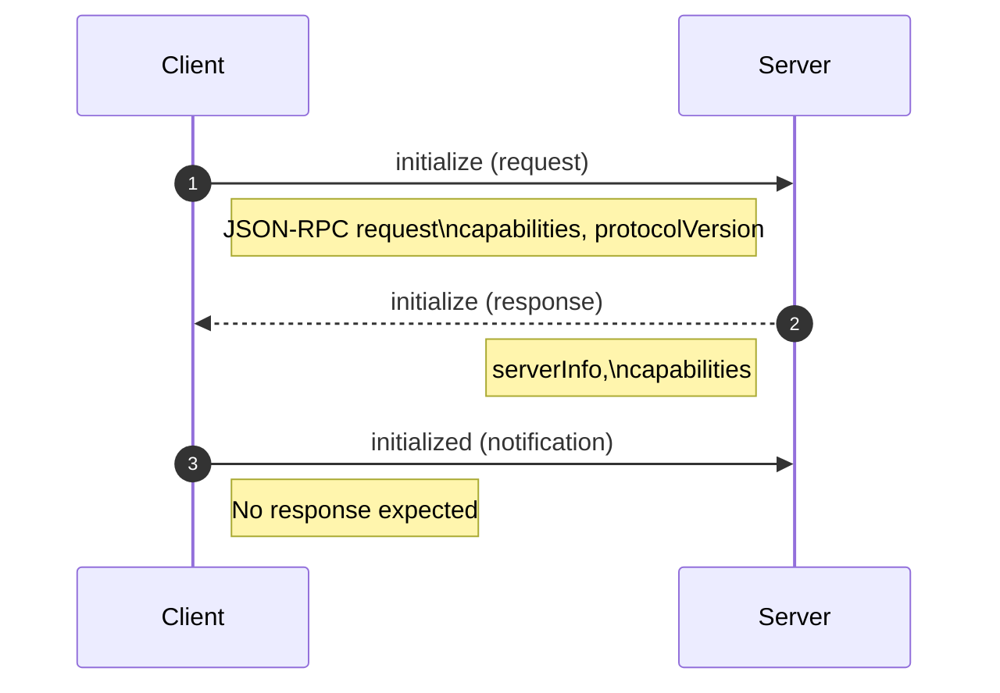

+++
date = '2026-01-01T12:44:47+10:00'
draft = false
title = 'Model Context Protocol'
tags = ['MCP', 'Agents', 'Design Patterns', 'AI']
summary = "Model Context Protocol - Notes, Best Practices, Design Patterns."
+++

## Introduction
Model Context Protocol is an open standard protocol that aims to provide a universal approach for applications to provide context to language models.  

MCP is built around Javascript Object Notation Remote Procedure Call (JSON-RPC 2.0) and so it's transport agnostic. It just defines the schema driven messages for client server communication. 
It is usually implemented as: 
- Streamable HTTP
- WebSockets
- STDIO
- Server Sent Events (SSE) etc.

Having said that there is nothing stopping you from using protocols such as gRPC etc. provided they treated just as the transport layer and the messages are in JSON-RPC 2.0 format.
## Communication Message Spec 
### Class Diagram Grouped

### Class Diagram Original

## Initialization process

## References
1. 
    * [Source Code](https://github.com/PacktPublishing/Learn-Model-Context-Protocol-with-Python/tree/main)
2. [Official Documentation](https://github.com/modelcontextprotocol/modelcontextprotocol)