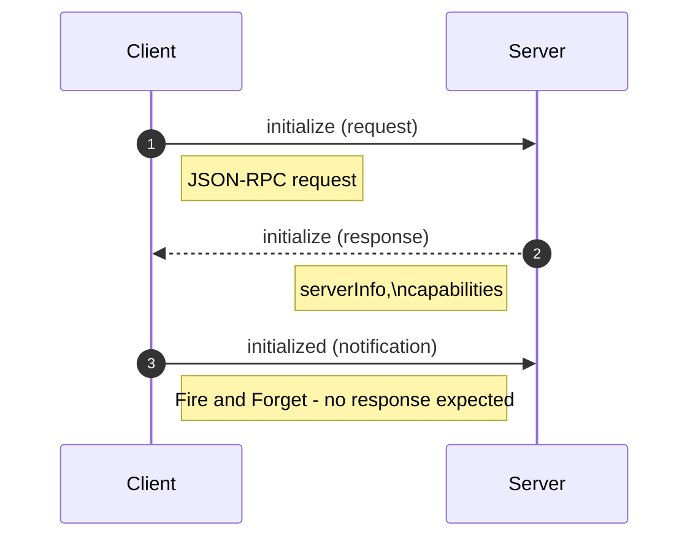

+++
date = '2026-01-01T12:44:47+10:00'
draft = false
title = 'Model Context Protocol'
tags = ['MCP', 'Agents', 'Design Patterns', 'AI']
summary = "Model Context Protocol - Notes, Best Practices, Design Patterns."
+++

## Introduction
Model Context Protocol is an open standard protocol that aims to provide a universal approach for applications to provide context to language models.
One advantage of this allows different clients to consume servers built by different vendors that too without needing to worry about compatibility issues.

MCP is built around Javascript Object Notation Remote Procedure Call (JSON-RPC 2.0) and so it's transport agnostic. It just defines the schema driven messages for client server communication. 
It is usually implemented as: 
- Streamable HTTP
- STDIO
- Server Sent Events (SSE) + HTTP.
- WebSockets (experimental - as persistent real time connectivity may be an overkill) etc.
All the above are common in that:
- they can operate on streams and support bidirectional communication.
- can handle reconnection handling.
- they can accomodate JSON-RPC messages in their payloads.
- Session Management
- supported in mcp.json file (websockets - experimental).
- Supergateway which is an open source command line which acts as bridge or adatptor convertor for MCP servers.

There might be some Transports not ideal for MCP:
- gRPC as it may require extra work to directly support JSON-RPC
- Messaging Queues (without reply queues) as they dont support RPC pattern
- UDP (without custom bidirectional protocol)
- ICMP - No Session Management
- FTP - Block Transfer Protocol
- Email - Async, unidirectional and slow.
- Server Sent Events (without HTTP) - Unidirectional and may not support all features of JSON-RPC.
- Webhooks
- Polling based HTTP etc.

[MCP Implementation and list of Servers](https://github.com/modelcontextprotocol/servers)
## Communication Message Spec 
### Class Diagram Grouped

### Class Diagram Original

At its core of the library is a BaseSession class which allows to 
- SendRequest
- ReceiveRequest
- SendNotification
- ReceiveNotification
- SendResult

## Initialization process

## Streamable HTTP
This protocol has replaced the Server Sent Events (SSE) + HTTP transport as the recommended transport for MCP.

Its generally better than  SSE + HTTP due to:
- Single Endpoint  Simplicity: client and servers communicate via single endpoint (e.g., /mcp) for all interactions, eliminating the need for separate endpoints for requests and notifications.
- Resumability: Support for resumable sessions using headers like Last-Event-ID, Mcp-Session-ID allowing clients to recover from disconnections without losing context.
- Compatibility: support for Modern HTTP Infrastucture - loadbalancers, proxies, API Gateways, CDNs etc where SSEs may face challenges.
- Bidirectional Communication: SSE is unidirectional, Streamable HTTP can be upgraded to support bidirectional communication, allowing servers to send messages to clients without the need for clients to poll for updates. This makes it apt for agent-to-agent or client-server interaction.
- Future Proofing: It is modular and extendable and designed for stateless or session based models

### Accept Header: 
  - Accept: application/json: Tells Server that client can handle batch JSON Response. The entire response is buffered and sent as a complete JSON object once it's fully ready. The client waits for the whole thing before processing.
  - Accept: text/event-stream: Tells Server that client can handle Streamed events (via SSE). Uses Server-Sent Events (SSE) to stream data incrementally. As soon as each chunk/event is available, it's sent to the client immediately, allowing for real-time progressive updates

### Resumability:
- If client loses connection with server while data is transfered, reconnects with server to resume the exchange from where it left off. 
- This is achieved using headers like Last-Event-ID, Mcp-Session-ID etc.
- In the context of MCP its only supported for Streamable HTTP (though possible with both SSE & Streamable HTTP) 

### Challenges of MCP:
- Give it too much tools, verbose responses, and it get overwhelmed and lead to slower response times. Give it too little and it can't do the job.
- Protocol is complex and have layers of serialization, validation and error handling.
- MCP and libraries are fast evolving and changing.
  - e.g. SSE transport was introduced somewhere in Nov 2024 and deprecated in favor of Streamable HTTP in March 2025.
  - [Upgrade Guide](https://gofastmcp.com/development/upgrade-guide)

## FastMCP
The FastMCP class is the central piece of every FastMCP application. It acts as the container for your tools, resources and prompts, managing communication with MCP clients and orchestrating the entire server lifecycle.

When you create a server in Fast MCP provide features and lets you configure several options like:
- **Instructions**: Help Clients understand the purpose of the server and available functions.
- **Lifespan**: Server level setup and teardown logic. We can pass our company level instructions here, or do some setup like loading data into memory, connecting to databases etc.
- **Tools**: Tools to add to server, alternately can be done programmatically by using the @tool decorator on functions.
- **Include/Exclude Tags**: Expose/Hide components that match one or more tags. 
  - Enable based on Program Increment number PI-40. 
- **Custom Rotes**: e.g. check health, metrics, documentation etc.
- **Dependency Injection**: Secrets and other dependencies can be injected into tools and resources.
- **Media Helper Classes**: Support for returning Images, audio etc. Images need to converted to Image Content block with correct MIME type and base64 encoded data. FastMCP do it for you.
- [**Integration with Web Frameworks**](https://gofastmcp.com/deployment/http#integration-with-web-frameworks): 
  - FastMCP can be mounted as a sub-route in existing web frameworks - WSGI(like Flask), ASGI like (FastAPI and Starlette).
    - Use WSGI if you are building a standard website and your framework (like Flask) doesn't natively support async, or if you prefer a simpler, proven stack.
    - Use ASGI if your app requires real-time updates, handles heavy I/O operations, or if you're using modern frameworks like FastAPI to maximize performance.
  - These frameworks are far more matured than FastMCP and provide features like multiple workers, custom middleware, better logging, monitoring etc.

## Fast MCP has [3 layers of abstraction](https://gofastmcp.com/getting-started/welcome)
### **[Components](https://gofastmcp.com/servers/tools)** 
Wrap a Python function, and FastMCP handles the schema, validation, and docs. Components are what you expose and includes Tools, Resources, Resource Templates and Prompts:
  - **[Tools](https://gofastmcp.com/servers/tools)**: 
    - LLMs can only do things it's trained on, tools extend its capabilities by allowing it to interact with external systems, perform computations, or access up-to-date information.
    - functions that clients can involve to perform actions or access external systems.
    - In FastMCP, tools are  Python functions exposed to LLMs through MCP Protocol. 
    - LLMs send request with parameters based on tool's schema, FastMCP validates and executes the function, and returns the result back to the LLM.
    - Supports Async tools, which is crucial for I/O bound operations like database queries, API calls etc they are more efficient than threadpool dispatch.
    - ToolResult object gives you explicit control over tool response
      - content
      - structured content
      - metadata
    - Tools common to company can be written as libraries and added to server using the mcp.add_tool(...).
    - Programmatically adding tools/ disabling, enabling etc will trigger notifications e.g. mpc.add_tool, mcp.disable((keys={"tool_name": "my_tool"}), mcp.enable(keys={"tool_name":) "my_tool"})
    - Dependency injection of Context: Tools can access MCP features like logging, reading resources, or reporting progress through the Context object. To use it, add a parameter to your tool function with the type hint Context. 
  - **Resources & Templates**: 
    - Highly Deterministic, read only no side effects and used for data retrieval.
    - Resources could be static or dynamic.
    - Resources: expose data that clients read. They are passive data-sources that client pulls rather than invoke. 
    - Templates: parameterized resources.  
    - ResourceResult object gives you explicit control over resource response, multiple content items, per-item MIME type and metadata at both item and result levels.\
    - like tools: 
      - you could enable, disable resources and templates programmatically and it will trigger notifications. 
      - inject Context into resource functions to access MCP features like logging, reading other resources or reporting progress.
      - define as async functions for I/O bound operations.
      - programmatically add using add_resource etc.
      - notifications will be triggered when resources are added, enabled, disabled etc
    - resources can be made to behave like query parameters if necessary with possible hidden defaults.
  - **Prompts**: Reusable message templates that guide LLM interactions. This enables you to not write prompts each time, e.g. when you migrate code from legacy to modern frameworks.
    - re-usuable, parameterized prompt templates for clients.
    - PromptResult object gives you control over prompt response
      - messages
      - description
    - Parameters can be optional or required.
    - enable/disable programmatically with notifications.
    - async support

### **[Providers](https://gofastmcp.com/servers/providers/overview)** 
are where components come from: decorated functions, files on disk, OpenAPI specs, remote servers—your logic can live anywhere.

### **[Transforms](https://gofastmcp.com/servers/transforms/transforms)** 
shape what clients see: namespacing, filtering, authorization, versioning. The same server can present differently to different users.

## MCP Context
The Context object provides a clean interface to access MCP features within your functions, including:
* **Logging**: Send debug, info, warning, and error messages back to the client
* **Progress Reporting**: Update the client on the progress of long-running operations
* **Resource Access**: List and read data from resources registered with the server
* **Prompt Access**: List and retrieve prompts registered with the server
* **LLM Sampling**: Request the client’s LLM to generate text based on provided messages
* **User Elicitatio**n: Request structured input from users during tool execution
* **Session State**: Store data that persists across requests within an MCP session
* **Session Visibility**: Control which components are visible to the current session
* **Request Information**: Access metadata about the current request
* **Server Access**: When needed, access the underlying FastMCP server instance

## HTTP Deployment
[Read Here](https://gofastmcp.com/deployment/http#integration-with-web-frameworks)
Sometimes you have to deploy your MCP server behind an existing HTTP server or API Gateway or leverage on the maturity of Established Frameworks.
FastMCP makes this easy by allowing you to mount your FastMCP application as a sub-route of an existing HTTP server.

There are 2 approaches to deploy server as an HTTP Server:
1. Using ASGI Middleware: 
   - Using ASGI with Uvicorn gives you more control. 
   - You create an app instead of running the server directly. 
   - This is useful when you need features like multiple workers, custom middleware, or want to integrate with existing web apps.

2. Direct HTTP Server
   - This is the simplest way to get started. 
   - Good for standalone deployments where MCP server be the only server running on port.

## References
2. 
    * [Source Code](https://github.com/PacktPublishing/Learn-Model-Context-Protocol-with-Python/tree/main)
2. [Official Documentation](https://github.com/modelcontextprotocol/modelcontextprotocol)