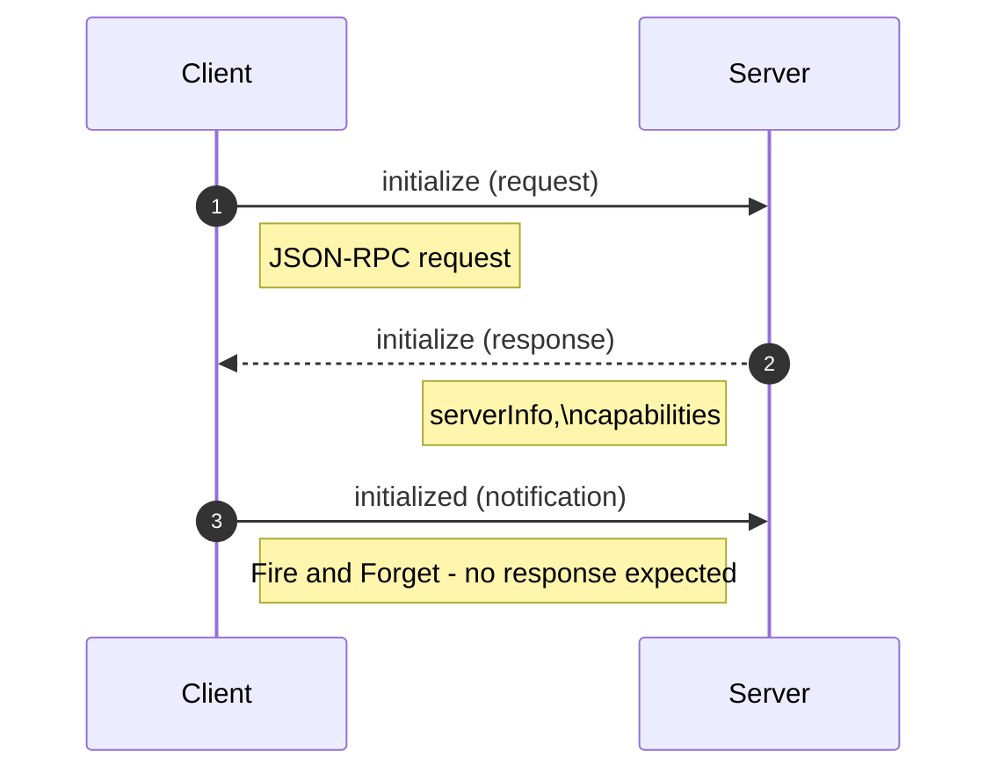

+++
date = '2026-01-01T12:44:47+10:00'
draft = false
title = 'Model Context Protocol'
tags = ['MCP', 'Agents', 'Design Patterns', 'AI']
summary = "Model Context Protocol - Notes, Best Practices, Design Patterns."
+++

## Introduction
Model Context Protocol is an open standard protocol that aims to provide a universal approach for applications to provide context to language models.
One advantage of this allows different clients to consume servers built by different vendors that too without needing to worry about compatibility issues.

MCP is built around Javascript Object Notation Remote Procedure Call (JSON-RPC 2.0) and so it's transport agnostic. It just defines the schema driven messages for client server communication. 
It is usually implemented as: 
- Streamable HTTP
- STDIO
- Server Sent Events (SSE) + HTTP.
- WebSockets (though not mentioned in the documentation, as persistent real time connectivity may be an overkill) etc.

There might be some Transports that may feel unnatural to implement MCP such as:
- gRPC as it may require extra work to directly support JSON-RPC
- Messaging Queues (without reply queues) as they dont support RPC pattern
- UDP (without custom bidirectional protocol)
- Email - Async, unidirectional and slow.
- Server Sent Events (without HTTP) - Unidirectional and may not support all features of JSON-RPC.
- Webhooks
- Polling based HTTP etc.

## Communication Message Spec 
### Class Diagram Grouped

### Class Diagram Original

## Initialization process

## References
1. 
    * [Source Code](https://github.com/PacktPublishing/Learn-Model-Context-Protocol-with-Python/tree/main)
2. [Official Documentation](https://github.com/modelcontextprotocol/modelcontextprotocol)