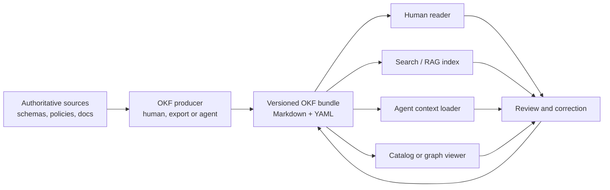
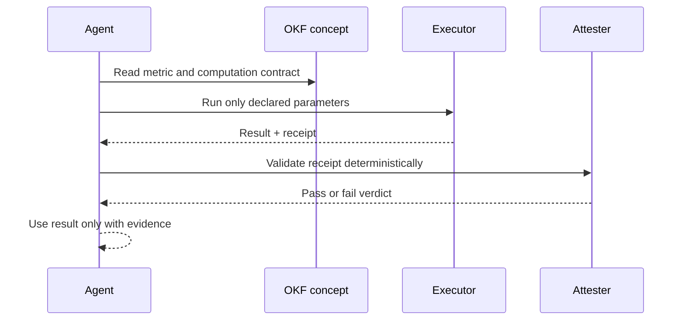

+++
date = '2026-09-03T12:00:05+10:00'
draft = false
title = 'Open Knowledge Format (OKF)'
tags = ['OKF', 'Open Knowledge Format', 'Context Engineering', 'Knowledge Base', 'AI Agents', 'Design Patterns']
summary = 'Practical guide to portable, trustworthy knowledge bundles for AI agents.'
+++

Open Knowledge Format (OKF) is a small open specification for the knowledge layer around data and systems: a directory of Markdown documents, each with YAML frontmatter. It formalises the emerging LLM-wiki pattern into something humans can read, agents can traverse and tools can exchange. Google Cloud introduced it in June 2026 and the current specification is v0.2. [Google's announcement](https://cloud.google.com/blog/products/data-analytics/how-the-open-knowledge-format-can-improve-data-sharing) and the [canonical specification](https://github.com/GoogleCloudPlatform/open-knowledge-format/blob/main/SPEC.md) are the sources of truth.

The important word is **format**. OKF is neither a vector database, an MCP server, an agent framework nor a replacement for OpenAPI, Avro or a data catalog. It is a portable representation for the meaning, relationships, provenance and operational knowledge that sit around those systems.

---

## Why This Matters for Context Engineering

The hard part of agentic systems is rarely generating text. It is giving the agent enough correct, current, scoped context to avoid guessing. That is the core problem described in [Context Engineering](../context-engineering.md): semantic memory must be structured, versioned, discoverable and connected to the process that keeps it accurate.

In most organisations, an answer to a seemingly simple question is fragmented:

- The schema is in a data catalog
- The business definition is in a wiki
- The operational exception is in a runbook
- The query is in a notebook
- The decision rationale is in an ADR
- The most important caveat is in a senior engineer's head

Retrieval can find fragments, but it cannot make them authoritative, compatible or fresh. A model can then produce a plausible answer by joining incomplete fragments with its own assumptions. In a regulated or operational setting, plausible is not good enough.

OKF makes the curated unit explicit: a **concept** is one Markdown document, with machine-readable signals up front and human-readable explanation below. Concepts link to one another to form a navigable knowledge graph. The bundle can live beside the code and use the same Git workflow as the system it describes.



This is deliberately boring technology. The exchange contract is ordinary files, Markdown links and YAML rather than a proprietary runtime.

---

## The Landscape: Where OKF Fits

OKF becomes clearer when it is placed beside the adjacent tools. It complements them; it does not absorb their responsibilities.

| Concern        | Primary question                       | Best-fit mechanism                   | What OKF contributes                                                      |
| -------------- | -------------------------------------- | ------------------------------------ | ------------------------------------------------------------------------- |
| Instructions   | How should the agent behave?           | `AGENTS.md`, skills, system prompts  | Links instructions to the domain knowledge they rely on                   |
| Tool access    | What can the agent do now?             | [MCP](../mcp.md), APIs, permissions  | Describes tools, data meaning and safe operating procedures               |
| Retrieval      | Which material is relevant?            | Search, RAG, graph traversal         | Small concepts, typed metadata and predictable links improve retrieval    |
| Data contract  | What is the exact API or record shape? | OpenAPI, Protobuf, Avro, JSON Schema | Explains intent, ownership, caveats and relationships around the contract |
| Data discovery | What datasets and assets exist?        | Data catalog                         | Supplies a portable, Git-friendly curated view or export                  |
| Execution      | How does work run reliably?            | Workflow engine, code, CI/CD         | Stores the playbook and points to the executable truth                    |
| Governance     | Can we trust this fact today?          | Review, policy, audit systems        | Carries provenance, verification and freshness signals beside the fact    |

### OKF and MCP

[MCP](../mcp.md) standardises an agent's connection to tools, resources and prompts at runtime. OKF standardises the knowledge content an agent or any other consumer can read. MCP answers, “how do I access this capability?” OKF answers, “what does this thing mean, where did this claim come from and how current is it?”

An MCP server might expose a SQL query tool. An OKF bundle can explain which tables are approved, define metrics, document safe join paths, link to a runbook and identify the owner. Exposing a database without that layer gives an agent power without enough understanding.

### OKF and RAG

RAG is a retrieval technique, not a knowledge-management model. It chunks material, finds likely relevant chunks and places them in the context window. It remains useful with OKF, but a high-quality bundle gives retrieval better source material:

- One bounded concept per document reduces accidental mixing of unrelated concerns
- `type`, `title`, `description` and `tags` support deterministic filtering before semantic search
- Standard links expose relationships that embeddings may miss
- `index.md` enables progressive disclosure instead of loading the complete corpus
- Source and verification metadata lets a consumer prefer reviewed, current material

Do not claim that OKF replaces a vector index. Large bundles still need retrieval, caching and context-budget discipline. OKF improves the shape and accountability of the corpus those systems operate on.

### OKF and Knowledge Graphs

Every Markdown link is an edge and every concept file is a node, so an OKF bundle is graph-shaped as well as directory-shaped. It is not a graph database and it deliberately does not mandate an ontology, query language or centrally registered type taxonomy.

That trade-off is useful early. Teams can publish useful knowledge without first agreeing on an enterprise ontology. If graph queries later justify a graph store, the consumer can derive nodes, metadata and edges from the bundle without making the store the only source of truth.

### OKF and Documentation-as-Code

Documentation-as-code is a practice. OKF is a minimal interoperability contract that makes a particular documentation shape predictable for agents and tools. A mature implementation should still use normal engineering controls: owners, pull requests, CI validation, release management, review and deprecation.

---

## The Mental Model: Bundle, Concept and Graph

An OKF **bundle** is a self-contained directory tree that can be distributed as a Git repository, archive or subdirectory. A **concept** is a single UTF-8 Markdown file within it. Its identity is its path relative to the bundle root without `.md`.

```text
payments-knowledge/
├── index.md                         # Optional bundle map
├── log.md                           # Optional change history
├── policies/
│   ├── index.md
│   └── refund-eligibility.md        # Concept ID: policies/refund-eligibility
├── metrics/
│   ├── index.md
│   └── payment-success-rate.md
├── tables/
│   ├── payments.md
│   └── refunds.md
├── playbooks/
│   └── payment-provider-outage.md
└── references/
    └── payment-api.md
```

The folder hierarchy gives an initial map. Links then express the relationships which folders cannot: a metric can link to its tables, policy, computation and dashboard; a runbook can link to the alert, service and decision policy it uses.

The specification reserves two lowercase filenames at every level:

- `index.md` is a directory listing, used for progressive disclosure
- `log.md` is a chronological update history

They are not concept documents. Every other Markdown file is a concept and needs valid YAML frontmatter with a non-empty `type` field. That one required field is the entire conformance floor.

---

## Anatomy of a Concept

The smallest valid concept is this:

```markdown
---
type: Policy
---

# Refund eligibility
```

That minimalism is intentional. Producers can start immediately, while consumers can at least route or filter on `type`. In practice, the recommended fields make the bundle more useful:

```yaml
---
type: Metric
title: Payment success rate
description: Settled payment attempts divided by all eligible payment attempts.
resource: https://metrics.example.internal/payment-success-rate
tags: [payments, reliability]
status: stable
generated: { by: process:metadata-export, at: 2026-09-03T02:00:00Z }
verified: { by: human:payments-owner, at: 2026-09-03T03:30:00Z }
stale_after: 2026-10-03T00:00:00Z
sources:
  - id: metric-policy
    resource: /policies/payment-success-rate.md
    title: Payment success rate policy
  - id: warehouse-model
    resource: https://git.example.internal/data/models/payments.sql
    title: Payments warehouse model
    author: team:data-platform
    last_modified: 2026-09-01T08:15:00Z
---
```

The body is ordinary Markdown. Use headings, tables, lists and fenced code blocks rather than an unstructured essay. Structure helps both a human reader and a retrieval system.

```markdown
# Definition

Count only payment attempts whose terminal state is `settled` or `failed`.
Exclude provider health-check traffic and synthetic test merchants.

# Computation

See the [approved computation](/computations/payment-success-rate.md).

# Caveats

Provider settlement can arrive after the event date. Use the 48-hour
finalisation window in the [reporting playbook](/playbooks/daily-reporting.md).
```

The core fields have clear jobs:

| Field          | Purpose                              | Consumer behaviour                                        |
| -------------- | ------------------------------------ | --------------------------------------------------------- |
| `type`         | Required, free-form concept kind     | Route, filter and present the concept                     |
| `title`        | Display name                         | Show it to people and in indexes                          |
| `description`  | One-sentence summary                 | Preview, search snippet and routing hint                  |
| `resource`     | Canonical URI of the described asset | Resolve the real table, API, dashboard or document        |
| `tags`         | Cross-cutting labels                 | Filter across the folder hierarchy                        |
| Unknown fields | Producer-specific extensions         | Preserve them when round-tripping rather than reject them |

The spec intentionally does **not** provide a central registry of valid types. `Metric`, `Playbook`, `API Endpoint`, `BigQuery Table` and `Reference` are examples, not an imposed ontology. Pick descriptive types, document local conventions and make consumers degrade gracefully when they meet one they do not recognise.

---

## The v0.2 Signal Layer: Provenance, Trust and Freshness

Plain Markdown helps readability. It does not answer the questions a production agent should ask before relying on a fact:

1. Where did this come from?
2. Who wrote it and who checked it?
3. Is it still current?
4. Is this the sanctioned way to calculate a high-stakes value?

OKF v0.2 adds optional, portable fields for those questions. Optional is important: missing signals must not make a concept unreadable. They should lower confidence or trigger a different workflow, not silently turn into false certainty.

### Provenance: `sources`

`sources` records the materials from which a concept derives. Each entry has a required `resource` and may carry a stable `id`, title, author, usage count and last-modified timestamp. A body claim can use a Markdown footnote keyed to that `id`.

```markdown
The `payment_attempts` table has one row per provider submission.[^schema]

[^schema]: Payment platform schema
```

```yaml
sources:
  - id: schema
    resource: /tables/payment-attempts.md
    title: Payment platform schema
```

The stable ID matters because agent edits can reorder lists. Positional references such as “source number two” can silently point to the wrong evidence after a rewrite.

Source metadata provides signals, not a magic score. `usage_count` can show whether a resource is alive or widely used, but a dashboard view and a scheduled query execution are not equivalent measures of authority. The consumer decides how to weigh evidence.

### Trust: `generated` and `verified`

Generation and verification are different events:

- `generated` says who or what last made a meaningful content change and when
- `verified` records one or more independent checks against the resource or sources

The actor convention keeps this machine-readable:

```yaml
generated: { by: enrichment-agent/v1.4, at: 2026-09-03T02:00:00Z }
verified:
  - { by: process:warehouse-contract-check, at: 2026-09-03T02:10:00Z }
  - { by: human:payments-owner, at: 2026-09-03T03:30:00Z }
```

- `tool-or-agent/version` identifies an agent or tool
- `human:identifier` identifies a human reviewer
- `process:identifier` identifies an automated process

Consumers can derive a simple advisory tier: no `verified` means unverified, non-human verification means machine-confirmed and a `human:` verification means human-reviewed. This is not access control. A human-reviewed note can still be wrong or stale, while an unverified record may still be useful for discovery.

### Lifecycle: `status` and `stale_after`

Use `status: draft`, `stable` or `deprecated` to communicate lifecycle. The default is `stable` when absent. Use `stale_after` as an absolute timestamp when the fact needs revalidation after a known date.

```yaml
status: deprecated
stale_after: 2026-12-31T00:00:00Z
```

Deprecate rather than delete when links or history still matter. The replacement should be linked prominently in the body. This prevents a knowledge graph from becoming a graveyard of broken pointers.

---

## Links, Indexes and Progressive Disclosure

Agents have limited attention budgets. Loading an entire knowledge base into every prompt is expensive and makes relevant facts harder to notice. OKF's answer is not a special retrieval runtime but a navigable file system.

### Standard links form the graph

Use normal Markdown links. Bundle-relative links beginning with `/` are recommended because moving a source document does not change their meaning:

```markdown
See the [payments table](/tables/payments.md) and the
[refund policy](/policies/refund-eligibility.md).
```

Relative links are also valid. A broken link is not malformed under the specification: it can represent knowledge that is planned but not yet written. A validator may warn, but consumers should tolerate it.

### `index.md` is the table of contents for people and agents

An index file has no frontmatter, except the bundle root may declare `okf_version`. It groups links under headings and gives each entry a short description.

```markdown
---
okf_version: "0.2"
---

# Payments knowledge

## Metrics

- [Payment success rate](metrics/payment-success-rate.md) - Settled eligible attempts divided by all eligible attempts.

## Operational knowledge

- [Provider outage](playbooks/payment-provider-outage.md) - Triage and communication steps for a provider outage.
```

An agent can read the root index, choose one subdirectory or concept, then keep drilling down only when needed. This is the same progressive-disclosure principle behind scoped skills and well-organised project instructions.

### `log.md` records change history

`log.md` is a newest-first list grouped by ISO dates. Git remains the detailed audit trail, but a concise log gives an agent or a human a local explanation of important changes.

```markdown
# Payments Knowledge Update Log

## 2026-09-03

- **Update**: Revalidated [Payment success rate](/metrics/payment-success-rate.md) against the warehouse model.
- **Deprecation**: Superseded the legacy provider-status runbook.
```

---

## Attested Computations: More Than a Metric Definition

The most consequential addition in v0.2 is the **Attested Computation** concept. A metric definition explains what a value means. An attested computation also names the sanctioned procedure for producing it and a deterministic way to check the result.

This addresses a common agent failure mode: the agent reads a natural-language definition, writes reasonable SQL and calculates the wrong thing. Natural language alone is an insufficient contract for revenue, regulatory reports, eligibility decisions or any measure where one subtle exclusion changes the outcome.

````markdown
---
type: Attested Computation
title: Payment success rate for a reporting day
description: Approved daily computation for settled eligible payment attempts.
status: stable
runtime: bigquery
parameters:
  - { name: reporting_date, type: date, required: true }
executor:
  resource: /references/skills/run-approved-query.md
  receipt: [job_id, executed_sql, result]
attester:
  resource: /references/attesters/payment_success_rate.py
generated: { by: human:data-platform, at: 2026-09-03T01:00:00Z }
verified: { by: human:finance-owner, at: 2026-09-03T01:30:00Z }
sources:
  - id: policy
    resource: /policies/payment-success-rate.md
    title: Payment success rate policy
---

# Computation

```sql
SELECT SAFE_DIVIDE(
  COUNTIF(terminal_status = 'settled'),
  COUNTIF(terminal_status IN ('settled', 'failed'))
) AS payment_success_rate
FROM analytics.payment_attempts
WHERE event_date = @reporting_date
  AND is_synthetic = FALSE;
```
````

The `runtime` defines how parameters should be interpreted. The `executor` describes how to run the computation and what evidence it must return. The `attester` names deterministic code which checks that receipt. OKF itself executes neither: it records the contract so different consumers can enforce the same rule.

This is a strong pattern for high-impact numbers:



The attester should be deterministic, not another LLM. Otherwise the system is checking a stochastic interpretation with another stochastic interpretation.

---

## A Practical Implementation Strategy

Do not begin by converting every document your organisation owns. A huge, unreviewed agent-generated corpus merely scales ambiguity. Start with one recurring decision or operational workflow where agents currently waste time assembling context.

### 1. Choose a bounded, high-value domain

Good candidates have a clear owner, recurring questions and multiple connected sources:

- A data product with tables, metrics and approved queries
- A service with APIs, runbooks, SLOs and incident patterns
- A business process with eligibility rules, exceptions and controls
- A software subsystem with ADRs, interfaces and deployment procedures

Avoid starting with “all company knowledge”. The first bundle is a product. It needs users, an owner, a definition of done and a maintenance loop.

### 2. Identify canonical sources before authoring

For each proposed concept, name the source that wins when facts conflict. A wiki page, database schema, ADR, policy document, code repository or owner can all be authoritative for different things. If there is no canonical source, capture that uncertainty explicitly rather than presenting an agent-generated summary as fact.

### 3. Define a small local vocabulary

OKF does not impose types, which gives teams flexibility but also responsibility. Begin with a short, documented vocabulary such as:

```text
Dataset, Table, API, Event, Metric, Policy, Playbook, Service,
Decision Record, Reference, Attested Computation
```

Do not build a grand ontology before publishing useful knowledge. Add types only when a consumer needs to route, validate or present them differently.

### 4. Write the navigation path first

Create the root `index.md`, then only the folder indexes that a reader needs. If an engineer or agent cannot find a concept from the index without a semantic search, the bundle is not yet serving its navigation purpose.

### 5. Curate concepts around decisions, not documents

One concept should answer one durable question well. A 2,000-line “payments knowledge” page produces poor diffs, poor retrieval and weak ownership. Prefer a small linked set:

- `metrics/payment-success-rate.md`
- `policies/payment-success-rate.md`
- `computations/payment-success-rate.md`
- `tables/payment-attempts.md`
- `playbooks/daily-reporting.md`

The agent can follow links only when it needs more detail. The human reviewer can approve a focused change.

### 6. Add trust signals according to risk

Not every concept needs every v0.2 field on day one. A useful policy is:

| Risk level                          | Minimum discipline                                                                |
| ----------------------------------- | --------------------------------------------------------------------------------- |
| Discovery notes                     | `type`, title, description and sources where known                                |
| Operational playbooks               | Owner, sources, status and review cadence                                         |
| Business rules                      | Human verification, clear lifecycle and links to canonical policy                 |
| Financial or regulatory computation | Attested computation, human verification, sources and explicit freshness deadline |

The important part is that an agent sees what it does not know. Absence of verification should change its behaviour: ask for review, retrieve the canonical source or avoid an irreversible action.

### 7. Automate repeatable enrichment, not judgement

Export pipelines and agents are excellent at producing first drafts from schemas, API descriptions and code. They can add links, detect stale sources and prepare pull requests. They should not be the unreviewed authority for ambiguous domain meaning.

Use automation to make curation cheaper, then retain human review where the cost of a wrong assertion is high.

### 8. Treat the bundle as a releaseable product

Use Git history, code review and CI checks. Validate at least:

- Every non-reserved Markdown file has parseable YAML frontmatter and a non-empty `type`
- Links resolve where your policy requires them to resolve
- Required fields exist for high-risk local types
- `stale_after` dates are monitored
- Deprecated concepts point to their replacements
- Generated content is reviewed before it claims human authority

The specification defines interoperability, not your organisation's quality gate. Your process supplies the latter.

---

## Example: An Agent-Safe Payments Question

Consider the request: “What was yesterday's payment success rate and can I send it to Finance?”

Without a structured knowledge layer, an agent may choose a similarly named dashboard, write approximate SQL and send a number without knowing the settlement window or the definition of an eligible payment.

With an OKF bundle, a disciplined consumer can follow this path:

1. Read `index.md` to locate the metric.
2. Read the metric concept and check `status`, `verified` and `stale_after`.
3. Follow the link to the policy for exclusions and reporting timing.
4. Follow the link to the attested computation.
5. Execute only the declared computation with the declared date parameter.
6. Pass the execution receipt to the deterministic attester.
7. Return the result with its verification state and a link to the relevant concepts.

That is not just better retrieval. It is a visible chain from question to definition, computation, evidence and decision. It creates the auditability needed to make agents useful in serious domains.

---

## Failure Modes and Design Traps

### Treating Markdown as automatically trustworthy

Markdown is easy to read and easy to write. It is not automatically correct. The operational value comes from clear sources, review, ownership and freshness. An agent-generated bundle without provenance can be more dangerous than a missing bundle because it looks organised.

### Importing a document dump

Bulk conversion can create thousands of weak concepts with duplicated or contradictory facts. Start with an intentional domain, make the navigation and source hierarchy work, then expand. Retrieval quality follows curation quality.

### Overloading frontmatter

Frontmatter should carry queryable and routable signals. Put detailed explanation, schemas, examples and caveats in the body. Turning YAML into a complete database schema makes concepts hostile to human authors and creates a brittle pseudo-platform.

### Replacing source systems prematurely

OKF references canonical systems. It does not replace the transaction database, API contract, policy repository or incident-management system. Keep the source of record clear and use the bundle as the portable, curated context layer.

### Confusing verification with truth

`verified` tells a consumer that someone or something checked the concept at a point in time. It does not prove perpetual truth. Freshness rules, source changes and incident feedback still matter.

### Forgetting ownership

Every critical concept should have a human or team accountable for correction. The `human:` verifier convention records a reviewer, but organisations still need a practical owner, a review cadence and an escalation path.

### Giving agents write access without controls

Agents can efficiently maintain links and drafts. They can also spread a mistaken assumption across fifteen files in one pass. Require pull requests, validate source references, separate generated from verified signals and make downstream consumers conservative when trust signals are weak.

---

## Adoption Checklist

- [ ] Pick one bounded domain and name its owner
- [ ] Identify canonical sources and conflict-resolution rules
- [ ] Create a root `index.md` with `okf_version: "0.2"`
- [ ] Establish a small local concept-type vocabulary
- [ ] Create one focused concept per durable fact, asset, metric or procedure
- [ ] Link related concepts using normal Markdown links
- [ ] Add `sources`, `generated`, `verified`, `status` and `stale_after` where risk warrants them
- [ ] Model high-impact values as Attested Computations
- [ ] Add Git review and automated structural validation
- [ ] Monitor stale concepts and retain deprecation history
- [ ] Measure whether agents produce more accurate answers, not merely more documents

---

## Conclusion

OKF is useful because it standardises very little. The format gives teams a portable common denominator for knowledge that agents need: files, frontmatter, links, provenance, trust and lifecycle signals. The domain model, the retrieval layer, the agent framework and the governance process remain replaceable.

For context engineering, that is the point. A knowledge base should not be a giant prompt, a vendor-owned black box or a pile of chunks. It should be a living, reviewable map of the system: structured enough for an agent to navigate safely and simple enough for the people closest to the domain to maintain.

## References

1. [Open Knowledge Format v0.2 specification](https://github.com/GoogleCloudPlatform/open-knowledge-format/blob/main/SPEC.md) — canonical definition, conformance rules, provenance, lifecycle, indexes and attested computations.
2. [Google Cloud: Introducing the Open Knowledge Format](https://cloud.google.com/blog/products/data-analytics/how-the-open-knowledge-format-can-improve-data-sharing) — rationale, reference implementations and sample bundles.
3. [Open Knowledge Format repository](https://github.com/GoogleCloudPlatform/open-knowledge-format) — canonical repository, reference agent and examples.
4. [Context Engineering](../context-engineering.md) — how knowledge bases fit within an agent context architecture.
5. [Model Context Protocol](../mcp.md) — the adjacent runtime protocol for agent tools, resources and prompts.
