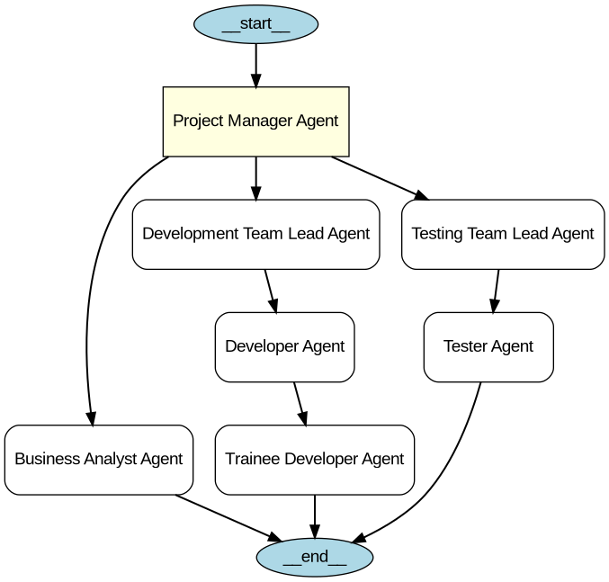

+++
date = '2024-01-01T12:44:47+10:00'
draft = false
title = 'OpenAI Agents SDK'
tags = ['OpenAI', 'Agents', 'Design Patterns', 'AI']
summary = "Here we explore agentic systems and design patterns using the OpenAI Agents SDK."
+++

## Introduction
Here we explore the Design patterns and how they are implemented using the OpenAI Agents SDK.
Before diving into the design patterns, let's first understand the fundamental concepts of AI agents and the role of LiteLLM in building these systems.

## AI Agent
AI Agent is an intelligent system that has the ability to perceive its environment, reason about it, and take actions to achieve specific goals. They are able to 
1. Observe and interpret their surroundings using sensors or data inputs
2. Reason and make decisions based on their observations and predefined objectives
3. Act upon their environment through actuators or output mechanisms to achieve desired outcomes.

### Anatomy of AI Agent:
- Models: The core components that enable the agent to understand and interact with its environment. This includes natural language processing models, computer vision models, and other specialized models for specific tasks.
- Tools: The functionalities and capabilities that the agent can utilize to perform tasks. This includes APIs
- Memory: The ability of the agent to retain and recall information from past interactions, allowing it to learn and adapt over time.

## Use of LiteLLM
- OpenAI Agent SDK might not work with a lot of LLM providers out of the box. LiteLLM can be used as a middleware to connect to various LLM providers with a consistent API.
- LiteLLM also gives additional benefits like cost tracking, usage monitoring, automatic fail-over between providers, and self-hosted options for privacy and control.
- LiteLLM is a lightweight library designed to facilitate the development and deployment of AI agents. It provides a simple and efficient interface for integrating various models, tools, and memory mechanisms into agentic systems. LiteLLM supports modular design, allowing developers to easily swap out components and experiment with different configurations. This flexibility makes it an ideal choice for building custom AI agents tailored to specific applications and domains.
- refer to [LiteLLM blog post](./litellm.md) for more details.

## Core Primitives of OpenAI Agent SDK
### Agent
Agent is an autonomous entity that perceives its environment, makes decisions and takes actions to achieve specific goals. Agents can be designed to operate in various domains, such as virtual environments, robotics, or software applications. They can utilize different models, tools, and memory mechanisms to enhance their capabilities and adapt to changing circumstances.
### Tools
Tools are functionalities or capabilities that agents can utilize to perform tasks and achieve their objectives. These tools can include APIs, libraries, or specialized algorithms that provide specific functionalities, such as data retrieval, processing, or analysis. By leveraging tools, agents can enhance their problem-solving abilities and effectively interact with their environment.
### Runner
Runner is a component that manages the execution of agents and their interactions with tools and models. It
#### Hosted Tools
Hosted Tools are pre-defined tools that are made available to agents for use in their tasks. These tools can be hosted on external servers or platforms, allowing agents to access a wide range of functionalities without needing to implement them from scratch. Hosted Tools can include APIs for data retrieval, processing services, or specialized algorithms that agents can leverage to enhance their capabilities.
#### Agents as Tools
Agents as Tools is a design pattern where agents themselves can be treated as tools that other agents can
#### Handoff
Handoff is a mechanism that allows agents to transfer control or responsibility for a task to another agent or system. This can be useful in scenarios where multiple agents are collaborating on a complex task, or when an agent needs to delegate certain responsibilities to specialized tools or services. Handoff ensures smooth transitions and coordination between different components of the agentic system.
#### Guardrails
Guardrails are safety mechanisms or constraints that are implemented to ensure that agents operate within defined boundaries and adhere to ethical guidelines. Guardrails can include rules, policies, or monitoring systems that prevent agents from engaging in harmful or undesirable behaviors. By incorporating guardrails, developers can ensure that agents act responsibly and align with human values and societal norms.
#### Tracing
Tracing is the process of monitoring and recording the actions and decisions made by agents during their interactions with the environment. This can include logging inputs, outputs, and intermediate steps taken by the agent as it processes information and makes decisions. Tracing provides valuable insights into the behavior of agents, allowing developers to analyze performance, identify issues, and improve the overall design of the agentic system.

[Source](https://github.com/welldesignedsystem/crispy-meme/blob/main/src/basics.py)

## Tools
### Agent Tool & MCPs
Types of Agent Tools:
- [Custom Tools](https://github.com/welldesignedsystem/crispy-meme/blob/main/src/basics.py#L66)
- [Agent as Tools](https://github.com/welldesignedsystem/crispy-meme/blob/main/src/basics.py#L446)
- OpenAI Hosted Tools
  - WebSearchTool - performs real time searches on web
  - FileSearchTool - Search and Retrieval from vector stores
  - ImageGenerationTool - Generates Images
  - CodeInterpreterTool - runs code in Sandboxed python execution environment. 
  - ComputerTool- Opens a browser instance and performs a task
  - LocalShellTool - Executes Shell command on local machine

### Agent Tool Behaviors:
- Agents decide autonomously when to use tools based on the task at hand.
- Where tools fit in:
  - Runner sends list of messages to LLM
  - LLM responds with tool call or final answer
  - If tool call, Runner executes tool and sends tool output back to LLM
  - Repeat until final answer is produced
- Tool Choice:
  - auto: the agent decides which tool to use
  - required: forces the agent to use a tool
  - none: prevents the agent from using any tools
- [Tool Use Behaviors](https://github.com/welldesignedsystem/crispy-meme/blob/main/src/basics.py#L241): 
  - run_llm_again: after each tool call, the agent re-invokes the LLM with the updated context
  - stop_on_first_tool: the agent stops after the first tool call and returns the tool output as the final answer
  - StopAtTools(stop_at_tool_names=["issue_refund"]): the agent stops after calling any of the specified tools

## Memory & Knowledge Patterns
- [Short Term Memory](https://github.com/welldesignedsystem/crispy-meme/blob/main/src/basics.py#L465-L486)
- [Long Term Memory](https://github.com/welldesignedsystem/crispy-meme/blob/main/src/basics.py#L489-L505)
- Training Knowledge
- Retrieved Knowledge
  - Good for unstructured Data handling
  - Semantic Search (search based on meaning not keywords)
  - Document Ingestion
    - Chunking
    - Generate Embeddings
    - Store in Vector DB
    - Retrieval

## Chat Conversation
- conversation management with Session
- large converstion threads (based on subject for example)
- Sliding message window 
  - involves use of a FIFO queue or deque instead of list of messages 
- message summarization

## Agentic AI Design Patterns
These are some of the design patterns commonly used in building AI agents:
## Common Agentic Patterns
- CoT (Chain of Thought) Prompting: This pattern involves breaking down complex tasks into smaller, manageable steps. The agent is guided through a series of prompts that encourage it to think through the problem step by step, leading to more accurate and coherent responses.
- ReACT (Reasoning and Acting) Pattern: This pattern combines reasoning and action in a loop. The agent first reasons about the task at hand, then takes an action based on its reasoning, and finally evaluates the outcome of that action. This iterative process allows the agent to refine its approach and improve performance over time.
- Plan-and-Execute Pattern: In this pattern, the agent first creates a plan of action based on its understanding of the task and the environment. It then executes the plan step by step, monitoring progress and making adjustments as needed. This structured approach helps ensure that the agent stays focused on its goals and effectively navigates complex tasks.
- Hierarchical/Multi-Agent Systems: This pattern involves organizing multiple agents into a hierarchy or network, where each agent has specific roles and responsibilities. Higher-level agents can oversee and coordinate the actions of lower-level agents, allowing for more complex and collaborative problem-solving.
### MultiAgent Orchestration Pattern
- [Deterministic Orchestration](https://github.com/welldesignedsystem/crispy-meme/blob/main/src/basics.py#L510-L545)
- [Dynamic Orchestration](https://github.com/welldesignedsystem/crispy-meme/blob/main/src/basics.py#L550-L593)
### Handoff Patterns
- Agent as Tool Pattern 
- [Handoff Patterns](https://github.com/welldesignedsystem/crispy-meme/blob/main/src/basics.py#L259-L304)
- [Multi Agent Switching](https://github.com/welldesignedsystem/crispy-meme/blob/main/src/basics.py#L597-L642)
- Customizing Handoffs:
  - by means of parameters such as agents, tool_name/description_override, on handoff, input_type/filter
- [Handoff Prompting](https://github.com/welldesignedsystem/crispy-meme/blob/main/src/basics.py#L599-L606)
### MultiAgent Patterns
- Centralized System
  - [Hierarchical System](https://github.com/welldesignedsystem/crispy-meme/blob/main/src/basics.py#L647-L696) 
  - 
- Decentralized System
  - [Swarm Systems](https://github.com/welldesignedsystem/crispy-meme/blob/main/src/basics.py#L647-L696)
    - based on a concept called emergent behavior or stigmergy

## Context Management Patterns
- [Local Context](https://github.com/welldesignedsystem/crispy-meme/blob/main/src/basics.py#L722-L759)
- MCP Server as a Tool

## Others
- [Unit Testing](https://github.com/welldesignedsystem/crispy-meme/blob/main/src/basics.py#L780-L808)