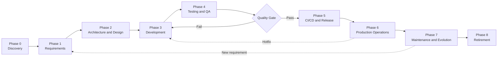
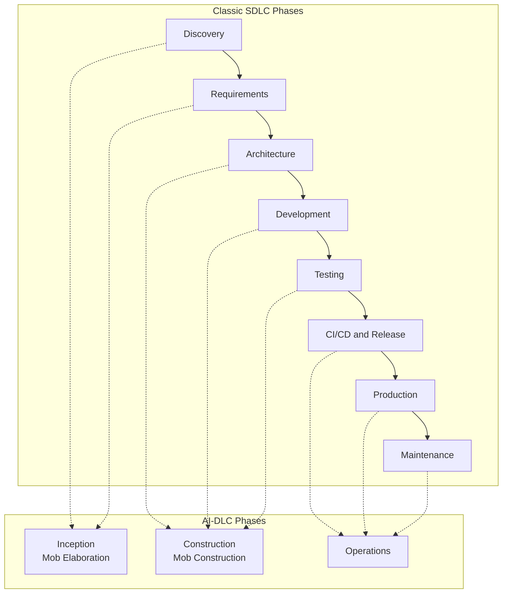
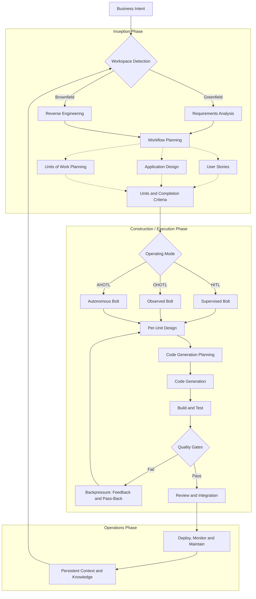

+++
date = '2026-08-14T12:01:00+10:00'
draft = false
title = 'Fintech Personas at Telly'
tags = ['Fintech','Telly','Personas','Roles']
summary = "Every Fintech persona at Telly, mapped across the SDLC, AI-DLC and context engineering."
+++

## Introduction

This post outlines the roles and contributions of each persona in Telly's Fintech domain with context around Engineering and AI.

## The Software Development Lifecycle

### SDLC Flow
Starts from the first idea to production and beyond. We have to take a generic approach as different domains follow a slightly different approach that works for them.

**References:** 
- *Software Engineering* (Sommerville, 10th ed, 2016)
- *Software Engineering: A Practitioner's Approach* (Pressman and Maxim, 9th ed, 2020) 
- ISO/IEC/IEEE 12207:2017 (software life cyccomprehensivele processes). 

### Phase 0: Discovery and Idea
- validates the problem is real
- that people will use the solution 
- building it makes business sense
- Timing is right
- Validate demand before building - build-measure-learn loop and a minimal viable product (MVP) to test assumptions with real users early ** The Lean Startup (Ries, 2011) **
- Run a feasibility study: technical, financial, timeline and, in fintech, regulatory and compliance.
- Decide build vs buy vs borrow. 
- Choose the technology only after the problem is understood — avoid following hype cycles.
- Define success criteria and the business case; secure stakeholder alignment.

**Deliverables:** 
- Problem statement
- Business case
- MVP scope
- Success metrics.

**References:** 
- *The Lean Startup* (Ries, 2011); 
- *The Mythical Man-Month* (Brooks, 1975); 
- [PMBOK Guide (PMI, 7th ed, 2021).](https://tegnum.edu.pe/wp-content/uploads/2023/09/Project-Management-Institute-A-Guide-to-the-Project-Management-Body-of-Knowledge-PMBOK-R-Guide-PMBOK%C2%AE%EF%B8%8F-Guide-Project-Management-Institute-2021.pdf)

### Phase 1: Requirements Engineering
- Capture what the system must do and how well it must do it.
- Elicit requirements from stakeholders through interviews, workshops, observation and document analysis **Software Engineering (Sommerville, 2016)**
- Analyse and prioritise. 
- Functional requirements define what the system does; non-functional requirements (quality attributes) define performance, security, availability, scalability and usability.
 Specify the requirements. 
 Elicit requirements from stakeholders through interviews, workshops, observation and document analysis.
 Analyse and prioritise. 
 Functional requirements define what the system does; non-functional requirements (quality attributes) define performance, security, availability, scalability and usability.
 Specify the requirements. 
 - Agile teams write user stories with acceptance criteria and follow the INVEST model (Wake, 2003). 
    - **Independent** — the story can be implemented without depending on other stories.
    - **Negotiable** — it is not a contract; details are discussed and refined with the team.
    - **Valuable** — delivers clear value to the user or stakeholder.
    - **Estimable** — the team can reasonably estimate the effort required.
    - **Small** — small enough to complete within a single sprint or bolt.
    - **Testable** — has clear acceptance criteria so it can be verified.
 - Regulated environments keep a formal software requirements specification (SRS) with traceability.

**Deliverables**
- product backlog or SRS
- acceptance criteria
- Definition of Ready
- Definition of Done.

**References:** 
- *Software Engineering* (Sommerville, 2016); the Scrum Guide (Schwaber and Sutherland).
- ISO/IEC/IEEE 29148 (requirements engineering); 

### Phase 2: Architecture and Design
- Decide how the system is structured before writing code.
- Choose the architecture that fits the problem: layered, microservices, event-driven, serverless and so on. 
- Model the domain with Domain-Driven Design: ubiquitous language, bounded contexts, aggregates 
- Design at two levels: 
  - high-level architecture (components, integrations, data flow, security boundaries) 
  - low-level design (modules, interfaces, algorithms and patterns from *Design Patterns*, Gamma et al, 1994).
- Define the data model and API contracts before implementation.
- Record decisions as Architecture Decision Records (ADRs) so future teams know why things are the way they are.
- Design for failure: circuit breakers, retries with backoff, timeouts, queues and graceful degradation (*Release It!*, Nygard, 2007).

**Deliverables:** 
- architecture design document
- ADRs
- data model
- API specifications
- security architecture.

**References:** 
- *Designing Data-Intensive Applications* (Kleppmann, 2017); 
- *Clean Architecture* (Martin, 2017); 
- *Domain-Driven Design* (Evans, 2003); 
- *Design Patterns* (Gamma et al, 1994); 
- *Release It!* (Nygard, 2007).

### Phase 3: Development (Construction)
- Turn the design into working, tested code.
- Set up version control (Git) and agree a branching strategy. Trunk-based development is the standard recommendation for teams doing continuous delivery.
- Follow coding standards enforced by linting and static analysis. 
- Write tests alongside code, test-first where it fits: test-driven development (Beck, 2003).
- Review every change: pull requests, code review, pair or mob programming for complex work.
- Integrate continuously: commit small, integrate frequently, keep the build green (Fowler, 2006).
- Keep the code healthy: refactor in small steps (Fowler, 1999) and avoid premature optimisation.

**Deliverables:** 
- source code
- unit tests
- review records
- CI build.

**References:** 
- *Code Complete* (McConnell, 2004); 
- *Clean Code* (Martin, 2008); 
- *Test-Driven Development: By Example* (Beck, 2003); 
- *Refactoring* (Fowler, 1999); 
- *The Pragmatic Programmer* (Hunt and Thomas, 1999).

### Phase 4: Testing and Quality Assurance
- Verify the software works, and keep proving it as it changes.
- Follow the test pyramid: many fast unit tests, fewer integration tests and a small number of end-to-end tests (Cohn, 2009).
- Test at the standard levels from the ISTQB syllabus: component (unit), integration, system and acceptance testing.
- Automate regression tests and run them in CI on every change.
- Add non-functional testing: performance and load, security (OWASP Top 10 and OWASP ASVS), accessibility and usability.
- Use behaviour-driven development for shared understanding: Gherkin scenarios written before the code (North, 2006).
- Enforce quality gates before merge: code review approval, coverage thresholds, lint rules and passing tests.

**Deliverables:** 
- automated test suites
- test reports
- quality metrics.

**References:** 
- ISTQB Foundation syllabus
- *Succeeding with Agile* (Cohn, 2009)
- *Introducing BDD* (North, 2006)
- OWASP Top 10 and OWASP ASVS.

### Phase 5: Build, Continuous Integration and Release (CI/CD)
- Make the path to production fast, automated and safe.
- Build and test every commit in a CI pipeline; produce immutable, versioned artifacts. Keep build, release and run separate (Twelve-Factor App, Wiggins, 2011).
- Promote the same artifact through environments: development, test or staging, then production. Keep environments as close to production as possible (dev/prod parity).
- Automate deployment with release pipelines so software is always in a deployable state (*Continuous Delivery*, Humble and Farley, 2010).
- Use safe deployment patterns: rolling, blue-green or canary, with feature flags to decouple deploy from release.
- Gate every release on automated checks: tests, static analysis, security scanning, compliance checks and health checks after deployment.

**Deliverables:** 
- CI/CD pipeline
- release automation
- deployment runbooks.

**References:** 
- *Continuous Delivery* (Humble and Farley, 2010)
- *Continuous Integration* (Fowler, 2006); 
- *The DevOps Handbook* (Kim, Humble, Debois and Willis, 2016); 
- Twelve-Factor App (Wiggins, 2011).

### Phase 6: Production Operations and Reliability
- Run the system reliably, safely and economically once it is live.
- Define reliability targets: service level indicators (SLIs), service level objectives (SLOs) and error budgets (*Site Reliability Engineering*, Beyer et al, 2016).
- Implement observability: metrics, structured logs, distributed tracing, dashboards and alerting.
- Set up on-call and incident management: detection, response, escalation and communication. ITIL 4 defines incident and problem management as standard practices.
- Run blameless postmortems after every significant incident.
- Plan capacity, backups, restore drills and disaster recovery.
- Control cost: track cloud spend, rightsize resources and automate scaling.
- Harden production security: vulnerability scanning, patching and regular access reviews.
- Optionally run chaos experiments to prove failure handling works (*Principles of Chaos Engineering*, 2017).

**Deliverables:** 
- SLOs
- runbooks
- incident response plan
- monitoring and alerting
- capacity plan
- disaster recovery plan.

**References:** 
- *Site Reliability Engineering* (Beyer et al, 2016); 
- *The Site Reliability Workbook* (2018); 
- *ITIL 4 Foundation* (AXELOS, 2019); 
- *Principles of Chaos Engineering* (2017).

### Phase 7: Maintenance and Evolution
- Keep the system alive, correct and competitive after launch.
- Classify and manage maintenance work: corrective (fixing defects), adaptive (new platforms, regulations or compliance), perfective (new features and improvements) and preventive (refactoring and technical debt reduction) — IEEE 1219.
- Manage technical debt explicitly: track it, pay it down in small steps and use automated tests as a safety net (*Refactoring*, Fowler, 1999; *Working Effectively with Legacy Code*, Feathers, 2004).
- Release on a regular cadence with regression protection from the automated test suite.
- Feed production telemetry back into requirements, design and testing.
- Improve continuously using the DORA four key metrics: deployment frequency, lead time for changes, change failure rate and time to restore service (*Accelerate*, Forsgren, Humble and Kim, 2018).
- Plan dependency and platform upgrades; never let versions drift so far that migration becomes a project in itself.

**Deliverables:** 
- maintenance backlog
- release cadence
- technical debt register
- improvement roadmap.

**References:** 
- IEEE 1219 (software maintenance); 
- *Refactoring* (Fowler, 1999); 
- *Working Effectively with Legacy Code* (Feathers, 2004); 
- *Accelerate* (Forsgren et al, 2018); 
- CMMI-DEV for process maturity.

### Phase 8: Retirement (Sunset)
- Take the system out of service cleanly and responsibly.
- Decide when to retire: when the cost of running exceeds the value delivered, or a replacement exists.
- Plan the exit: data migration or archival, decommissioning integrations, winding down third-party contracts and cleaning up DNS and certificates.
- Communicate the plan to users and stakeholders well in advance.
- Keep required records and audit trails, especially in regulated fintech environments.
- Shut down in stages with a rollback path if the replacement underperforms.

**Deliverables:** 
- Retirement plan
- data archival or migration
- final closeout report.

**References:** 
- ISO/IEC/IEEE 12207 (retirement process); 
- PMBOK Guide (project closure).

### Cross-Cutting Practices
- These apply across every phase above.
- **Process framework:** agile (Scrum, Kanban, extreme programming) for most product work; plan-driven (waterfall) where requirements are fixed and heavily regulated; hybrid models in between. Agile Manifesto (2001).
- **Ceremonies and cadence:** sprint planning, daily standup, review and retrospective (the Scrum Guide). Retrospectives drive continuous improvement.
- **Estimation:** story points and planning poker based on Wideband Delphi (Boehm, 1981), relative sizing and T-shirt sizing.
- **Quality and compliance gates:** security reviews, audit trails and traceability from requirement to production change. Fintech adds mandatory gates: ISO/IEC 27001, PCI DSS, SOC 2 and GDPR.
- **Governance:** change management and incident management follow ITIL 4; release boards for high-risk environments.

## Software Development Personas at Telly

The personas below are the standard roles found in modern software development organisations, the exact titles and boundaries differ between teams. In reality one person may often wear several hats.

### Product and Delivery

| Persona | Primary Phases | Core Contribution |
|---|---|---|
| Product Manager (PM) | Discovery, Requirements, Maintenance | Owns the product vision, roadmap and prioritisation; defines success metrics and the MVP scope (Phases 0-1, 7). |
| Product Owner (PO) | Requirements, Development | The agile counterpart of the PM inside a squad: owns the backlog, writes and prioritises user stories and accepts work against the Definition of Done (Phases 1, 3). |
| Business Analyst (BA) | Discovery, Requirements | Elicits and analyses requirements, models the domain, documents acceptance criteria and translates between business and engineering language (Phases 0-1). |
| Delivery Manager / Project Manager | All phases | Owns the plan, timeline, budget, risk and stakeholder communication. In agile organisations this becomes a facilitation role rather than a controller role. |
| Scrum Master / Agile Coach | All phases | Guards the process, removes impediments, runs ceremonies and retrospectives and coaches the team on agile practice. |
| Engineering Manager | All phases | Line-manages engineers, owns career growth, hiring and team health; pairs with the Tech Lead on technical decisions. |

### Design and Research

| Persona | Primary Phases | Core Contribution |
|---|---|---|
| UX Researcher | Discovery, Testing, Maintenance | Runs user interviews, usability tests and data analysis to validate problems and solutions before and after the build (Phases 0, 4, 7). |
| UX Designer | Discovery, Development | Designs flows, information architecture and interaction patterns; produces prototypes for testing (Phases 0-1, 3). |
| UI / Visual Designer | Development | Turns interaction designs into the visual system: components, tokens and design systems (Phase 3). |
| Accessibility Specialist | Requirements, Testing | Ensures products meet accessibility standards such as WCAG; reviews designs and tests for accessibility (Phases 1, 4). |

### Architecture

| Persona | Primary Phases | Core Contribution |
|---|---|---|
| Enterprise Architect | Discovery, Requirements, Maintenance | Aligns solutions with the enterprise strategy and standards; owns cross-system integration and technology standards (Phases 0-2, 7). |
| Solution Architect | Design, Production | Owns the end-to-end solution design for a product: architecture, data, integrations, security and non-functional requirements (Phases 2, 6). |
| Data / Platform Architect | Design, Maintenance | Designs data models, pipelines and the platform foundations shared across squads (Phases 2, 5-7). |

### Engineering

| Persona | Primary Phases | Core Contribution |
|---|---|---|
| Tech Lead | Design, Development, Maintenance | Sets the technical direction for the squad, reviews designs and code, mentors engineers and owns technical quality (Phases 2-3, 7). |
| Software Engineer | Development, Maintenance | Writes and reviews code, writes unit and integration tests and participates in continuous integration; owns codebase health (Phases 3, 7). |
| Frontend / Backend / Full-stack Engineer | Development | Specialised engineering tracks for user interfaces, services and APIs, or both (Phase 3). |
| Data Engineer | Development, Maintenance | Builds and maintains data pipelines, warehouses and data quality controls (Phases 3, 7). |
| ML / AI Engineer | Discovery, Development, Production | Builds and operates ML and LLM features: data, training, evals, prompts, model serving and monitoring (Phases 0, 3, 6). |
| Database Administrator | Development, Production, Maintenance | Owns database performance, migrations, backups and access controls (Phases 3, 6-7). |

### Quality and Testing

| Persona | Primary Phases | Core Contribution |
|---|---|---|
| QA Engineer / Test Analyst | Requirements, Testing | Designs the test strategy, writes test cases and performs exploratory and regression testing; guards release quality (Phases 1, 4). |
| Test Automation Engineer (SDET) | Development, Testing | Builds and maintains the automated test pyramid: unit frameworks, integration suites, end-to-end tests and performance tests (Phases 3-4). |

### Platform, DevOps and Operations

| Persona | Primary Phases | Core Contribution |
|---|---|---|
| DevOps / Platform Engineer | Build and Release, Production | Builds and runs CI/CD pipelines, infrastructure as code, developer tooling and shared environments (Phases 5-6). |
| Site Reliability Engineer (SRE) | Production, Maintenance | Owns SLIs, SLOs and error budgets; drives reliability, runs incidents and plans capacity (Phases 6-7). |
| Release Manager | Build and Release | Owns the release calendar, change approvals and production deployment coordination (Phases 5-6). |
| Cloud / Infrastructure Engineer | Build and Release, Production | Owns cloud accounts, networking, compute and infrastructure security baselines (Phases 5-6). |
| Support Engineer (L1/L2/L3) | Production, Maintenance | Triages and resolves customer and system issues, escalates to engineering and feeds root causes back into the backlog (Phases 6-7). |

### Security and Compliance

| Persona | Primary Phases | Core Contribution |
|---|---|---|
| Application Security Engineer (AppSec) | Development, Build and Release, Production | Runs threat modelling, code and dependency scanning, SAST/DAST and security reviews (Phases 3-6). |
| Security Architect | Architecture, Production | Designs the security controls and guardrails across the solution (Phases 2, 6). |
| Compliance / Risk Analyst (GRC) | Requirements, Build and Release, Maintenance | Maps controls to regulations such as PCI DSS, SOC 2 and GDPR for fintech and telecom; audits and tracks evidence (Phases 1, 5-7). |
| Data Protection Officer (DPO) | Requirements, Maintenance | Owns data protection compliance, privacy impact assessments and breach handling (Phases 1, 7). |

### Personas Across the Lifecycle

| SDLC Phase | Owning Personas | Contributing Personas |
|---|---|---|
| 0. Discovery | PM, UX Researcher, BA, Enterprise Architect | Delivery Manager, Data Engineer |
| 1. Requirements | PO, BA, UX Designer, Accessibility Specialist | AppSec, GRC, DPO |
| 2. Architecture and design | Solution Architect, Tech Lead, Security Architect | Enterprise Architect, Data Architect, AppSec |
| 3. Development | Software Engineers, Tech Lead, Test Automation Engineer | PO, QA Engineer, Data Engineer |
| 4. Testing | QA Engineer, Test Automation Engineer | UX Researcher, Accessibility Specialist |
| 5. Build and release | DevOps / Platform Engineer, Release Manager | AppSec, GRC, Cloud Engineer |
| 6. Production | SRE, Support Engineer, Cloud / Infrastructure Engineer | Solution Architect, ML / AI Engineer |
| 7. Maintenance and evolution | Software Engineers, PM / PO, SRE | GRC, DPO, Data Engineer |
| 8. Retirement | Delivery Manager, Software Engineers | GRC, Compliance Analyst |

## AI-Assisted Software Development and the AI-DLC

The persona matrix in the next section describes how each persona applies AI at each stage of the software development lifecycle. Before reading it, it helps to understand the full set of practices that define AI-assisted software development and the lifecycle that governs how that AI work is planned, gated and reviewed.

### The Pillars of AI-Assisted Development

AI-assisted software development is the practice of using LLM-based agents as collaborators across the SDLC, with humans supplying business context, judgment and accountability.

There is no single canonical list of pillars — different authors and organisations group the practice differently. 

| Pillar | What It Covers | Key References |
|---|---|---|
| Prompt engineering | How you talk to the model: wording, examples, formatting and instruction hierarchy. Determines how clearly the model is asked, not what it can know | Chip Huyen, *AI Engineering*, ch 5; [GitHub Blog, agentic primitives](https://github.blog/ai-and-ml/github-copilot/how-to-build-reliable-ai-workflows-with-agentic-primitives-and-context-engineering/) |
| Context engineering | Curating what the model sees: context window, memory layers, scoping, compression and selective loading. The difference between an agent that guesses and an agent that knows | Birgitta Böckeler, [Context Engineering for Coding Agents](https://martinfowler.com/articles/exploring-gen-ai/context-engineering-coding-agents.html) (martinfowler.com) |
| Retrieval and grounding | Pulling the right external knowledge into the window: chunking, embeddings, re-ranking, freshness. Grounds the model in your data instead of its training corpus | Huyen, *AI Engineering*, ch 6 (context construction); |
| Spec-driven development | Structured, versioned specifications become the source of truth and agents derive implementation, tests and documentation from them | GitHub Spec Kit; arXiv [process taxonomy of AI dev frameworks](https://arxiv.org/html/2606.04967) |
| Evaluation (evals) | Testing non-deterministic output: the eval pyramid, golden datasets, invariants, model-graded metrics and CI gates. You cannot improve what you do not measure | [DeepEval](..TODO provide official website link..), [Promptfoo](..TODO provide official website link..), [Braintrust](/blog/ai/braintrust/), [pytest](/blog/ai/pytest/), [hypothesis](/blog/ai/hypothesis/), [ToolCallCheck](/blog/ai/toolcallcheck/); Huyen, ch 3-4 |
| Agents, tools and harnesses | The execution layer: agent SDKs, tool calling, protocols and the harness that mediates context, tools, memory, verification and permissions. Includes agent skills — reusable packages that shape behaviour, such as adversarial "grill me" skills that interrogate intent and assumptions before work starts | [Model Context Protocol](/blog/ai/mcp/), [Claude Agent SDK](/blog/ai/claude_agent_sdk/), [OpenAI Agent SDK](/blog/ai/open_ai_agent_sdk/), [A2A](/blog/ai/a2a/), [OpenCode](/blog/ai/opencode/); Anthropic, [Building Effective Agents](https://www.anthropic.com/engineering/building-effective-agents); arXiv [AI Harness Engineering](https://arxiv.org/html/2605.13357) |
| Guardrails, safety and security | Prompt injection defence, hallucination mitigation, permissions, secrets handling and supply-chain scanning for AI-generated code | Huyen, *AI Engineering* (safety chapter); OWASP Top 10 for LLM Applications |
| Observability, tracing and cost | Monitoring model and agent behaviour, logging, tracing, token budgets and cost governance. You cannot improve what you do not measure | Huyen, *AI Engineering* (infrastructure layer); [Context Engineering](/blog/ai/context-engineering/) |
| Model selection and adaptation | Choosing the right model and adapting it: prompt vs RAG vs fine-tuning vs structured output. Start with prompting and retrieval before reaching for training | Huyen, *AI Engineering*; [Context Engineering](/blog/ai/context-engineering/) |
| Human oversight and governance | Deciding how much autonomy AI gets: HITL, OHOTL or AHOTL modes, review workflows, approval boundaries, traceability and audit trails | AI-DLC (below); arXiv [Agentic Software Engineering (SE 3.0)](https://arxiv.org/html/2509.06216v3) |

### The AI-Driven Development Lifecycle (AI-DLC)

#### Origins and Provenance

AI-DLC (AI-Driven Development Life Cycle) is a software development methodology introduced by Raja SP, Principal Solutions Architect and Head of Developer Transformation Programs at Amazon Web Services, in the AWS DevOps blog post *[AI-Driven Development Life Cycle: Reimagining Software Engineering](https://aws.amazon.com/blogs/devops/ai-driven-development-life-cycle/)* on 31 July 2025.

It is important to separate three sources with different levels of authority:

| Source | Owner | Status | Contribution |
|---|---|---|---|
| AWS DevOps blog post, July 2025 | Raja SP (AWS) | Foundational and official | The three-phase model, Mob Elaboration, Mob Construction and core terminology (Intent, Unit, Bolt) |
| `awslabs/aidlc-workflows`, open-sourced November 2025 | AWS Labs | Official reference implementation | Adaptive workflow scaffolds (Rules and Steering files), mandatory vs conditional stages, checkpoints and audit trails |
| AI-DLC 2026 paper, [ai-dlc.dev/paper](https://ai-dlc.dev/paper), January 2026 | The Bushido Collective | Independent community synthesis, **not** an AWS publication | HITL/OHOTL/AHOTL operating modes, Bolts, Passes, harness-enforced quality gates and completion criteria |

The methodology was also presented at AWS re:Invent 2025 (session DVT214). There is one naming caveat: "ADLC" is used elsewhere for "Agent Development Lifecycle", and AWS separately uses "AI Development Life Cycle" for an unrelated ML-model-building framework — this section is about Raja SP's software-delivery AI-DLC.

#### Why It Exists: The Middle Path

The AWS post argues that most organisations use AI in two limited ways:

- **AI-assisted development** — AI improves specific tasks such as documentation, code completion and testing.
- **AI-autonomous development** — AI is expected to generate whole applications from user requirements with little human involvement.

AWS reports that both patterns produce suboptimal outcomes in velocity and quality. AI-DLC is the proposed middle path: AI performs the heavy execution work while humans supply business context, judgment, validation and accountability. In the financial-services version of the story, the developer's role shifts from writing code to managing and validating AI-generated outputs. The 2026 community paper frames the same idea with a Google Maps analogy: humans set the destination, AI provides step-by-step directions and humans maintain oversight.

#### Core Terminology

| Term | Traditional Equivalent | Definition |
|---|---|---|
| Intent | Epic / Initiative | A high-level statement of purpose that describes what should be achieved |
| Unit | Feature / Work package | A cohesive, self-contained work element derived from an Intent |
| Bolt | Sprint | The smallest iteration unit in AI-DLC 2026, measured in hours or days, run in supervised (HITL), observed (OHOTL) or autonomous (AHOTL) mode |
| Pass | Discipline iteration | A typed iteration through the standard loop (elaborate, units, execute, review) through a design, product or development lens |
| Mob Elaboration | Requirements gathering | The whole team validates AI's questions, assumptions and proposed units |
| Mob Construction | Development | AI proposes architecture, code and tests while the team clarifies decisions in real time |
| Completion Criteria | Definition of Done | Verifiable conditions that determine whether a unit is complete |
| Hat | Role | A markdown definition of an agent's behaviour, boundaries and quality gates in the community implementation |

#### The Three Phases

The AWS version describes three phases. The 2026 community paper keeps Inception and Operations but uses "Execution" for the build phase; the intent is the same — move from clarified intent to verified implementation to operational ownership.

**Inception — WHAT to build and WHY.** AI transforms business intent into requirements, user stories, units, risks, non-functional requirements and completion criteria. The central ritual is Mob Elaboration: AI asks clarifying questions and the team validates or corrects the result. Key activities:

- AI converts intent into candidate requirements and units
- AI asks questions to uncover missing context (functional scope, business rules, edge cases, technical constraints)
- The team validates assumptions and constraints
- Completion criteria are defined for each unit
- Bolt structure and supervision mode are selected

Mob Elaboration is where adversarial skills earn their keep. A "grill me" skill turns the agent from a passive assistant into an interrogator: it challenges the intent, attacks assumptions, hunts for missing edge cases and forces the team to defend the business case before anything is built. Running it here is cheap — catching a wrong assumption during Elaboration costs minutes, while catching it in Construction or Production costs a full rework cycle. It is the same discipline as a design review or a technical spike, formalised as a reusable skill. In the AI-DLC 2026 implementation this is exactly the Red Team hat.

**Construction — HOW to build it.** Using the validated context from Inception, AI proposes architecture, domain models, code solutions and tests. In the 2025 AWS framing this is Mob Construction; in the 2026 community paper it is Execution through Bolts. Key activities:

- AI proposes architecture and technical design, typically using domain-driven design principles
- AI implements code and supporting artifacts, unit by unit
- AI generates tests and validation checks
- The team reviews trade-offs and higher-risk decisions
- Quality gates provide backpressure when output fails

**Operations — run and maintain it.** AI applies the accumulated context to deployment, infrastructure as code, monitoring, rollback and ongoing maintenance. The important point is continuity: plans, requirements, design artifacts and operational knowledge are stored in the repository so later sessions do not start from scratch. In the financial-services narrative, monitoring feeds back into the coding agent's context and informs future Inception cycles, creating a virtuous loop.

**How AI-DLC maps onto the SDLC.** AI-DLC does not replace the pipeline from the SDLC Flow diagram; it reorganizes how each phase is executed. Discovery and Requirements fold into Inception; Architecture and Design plus Development plus Testing fold into Construction; CI/CD plus Production plus Maintenance fold into Operations.

So the two diagrams are complementary: the SDLC Flow shows the phases a product goes through, and this one shows which AI-DLC phase absorbs the work of each SDLC phase.

#### The Adaptive Workflow

The official open-source implementation turns the three phases into an adaptive workflow with stages. Some stages are **mandatory** (green) and some are **conditional** (yellow); the workflow chooses which to run based on context and complexity. A simple bug fix skips planning and goes straight to code generation; a complex feature runs requirements analysis, architectural design and detailed testing.

| Phase | Stages (mandatory or conditional) |
|---|---|
| Inception | Workspace Detection (greenfield vs brownfield) → Reverse Engineering (brownfield) or Requirements Analysis (greenfield) → Workflow Planning. Conditional: User Stories, Application Design, Units of Work Planning |
| Construction | Per-unit design stages (conditional) → Code Generation Planning → Code Generation → Build and Test (unit, integration, performance, security, contract and end-to-end tests) |
| Operations | Deployment automation, infrastructure as code, monitoring and observability setup, production readiness validation |

The AWS open-sourcing blog identifies three properties that make this work:

1. **Adaptive decisioning** — the workflow conforms to the problem's shape, intelligently skipping or deepening stages based on contextual assessment rather than predetermined rules.
2. **Transparent checkpoints** — human approvals are embedded at every decision gate, preserving oversight while maintaining velocity.
3. **End-to-end traceability** — every artifact, decision and conversation is logged, creating an inspectable trail that supports accountability and improvement.

At each gate the workflow asks clarifying questions, creates an execution plan and waits for approval. The implementation uses Rules and Steering files that convert AI from a passive assistant into an adaptive decision engine.

#### The AI-DLC Flow

The diagram below combines the three phases, the adaptive workflow stages, the operating modes and the quality-gate loop into one picture. Dashed edges are conditional stages; the workflow only runs them when the context warrants it. Solid edges are mandatory.

Note the two feedback loops. The inner loop is construction backpressure: failed quality gates push the unit back through design, code generation and testing. The outer loop is lifecycle continuity: operations captures persistent context and knowledge, which feeds the next Inception cycle so no session starts from scratch.

#### Operating Modes: HITL, OHOTL and AHOTL

The 2026 community paper distinguishes three operating modes that form a spectrum of human involvement, not a maturity ladder:

| Mode | Human Involvement | Approval Model | Best For |
|---|---|---|---|
| HITL (human-in-the-loop) | Continuous, blocking | Before each significant step | Novel domains, architecture decisions, production data, security and compliance risk, foundational work |
| OHOTL (observed human-on-the-loop) | Continuous, non-blocking | Any time (interrupt) | UX, design, copy and subjective quality work, training, medium-risk changes |
| AHOTL (autonomous human-on-the-loop) | Periodic, on-demand | At completion | Well-defined tasks with measurable acceptance criteria, batch operations, work validated by tests, types and linting |

The key insight is that the human does not disappear — the human's function changes, from micromanaging execution to defining outcomes, observing progress and building quality gates. The mode-selection skill published by the community recommends choosing based on measurable factors:

| Factor | HITL | OHOTL | AHOTL |
|---|---|---|---|
| Requirements clarity | Low | Medium | High |
| Risk level | High | Medium | Low |
| Test coverage | Low | Medium | High |
| Domain familiarity | Low | Medium | High |
| Reversibility | Difficult | Moderate | Easy |

Default modes per phase: Elaboration HITL, Planning HITL, Building OHOTL, Review HITL. The general rule is to start new or unknown work in HITL and escalate autonomy only as requirements stabilise, test coverage grows and trust is earned. Downgrades (AHOTL → OHOTL → HITL) are signals to investigate root causes, not punishments.

#### Backpressure, Quality Gates and Completion Criteria

**Backpressure over prescription.** Instead of prescribing every implementation step, AI-DLC defines quality gates that reject non-conforming work. The 2026 paper describes harness-enforced quality gates: structured, frontmatter-driven checks that the harness runs on every Stop event. The agent cannot stop — cannot advance, cannot hand off, cannot declare work complete — until all gates pass. This is qualitatively different from asking AI to "run the tests": the agent cannot rationalise its way around a failing hook.

Three properties of the enforcement mechanism:

- **Detection** — the elaboration skill scans the repository for existing tooling and proposes the right gate commands, which the team confirms.
- **Definition** — confirmed gates are saved to the Intent's frontmatter; builders may add unit-specific gates during construction.
- **Enforcement** — the harness runs the gates synchronously on every Stop, blocking progress on failure. Intent-level and unit-level gates merge additively (unit gates add to intent gates, never replace them).

Two further mechanisms from the 2026 paper:

- **The ratchet rule** — quality gates are add-only. The reviewer verifies gate integrity as part of the review; removing a gate triggers a request-changes decision. Quality standards can only move forward.
- **Completion criteria enable autonomy** — autonomy depends on precise criteria. "Make auth better" is too vague; "users can reset passwords, reset tokens expire after 15 minutes, all auth endpoints have tests and the security scan has no critical findings" gives the agent a target it can iterate toward.

#### Persistent Context: Artifacts Are Memory

AI-DLC's answer to the context-window problem is committed artifacts and ephemeral state. Intents, unit progress and decisions persist in version-controlled files, so the context window can be reset without losing the project's ground truth — the community implementation treats `/clear` as a feature, not a bug. The 2026 paper warns that large context windows still degrade when filled with irrelevant material, so the practical rule is to keep high-quality project knowledge on disk and load only what the current task needs. This is exactly the context engineering discipline from the [Context Engineering](/blog/ai/context-engineering/) post, applied to the development process itself.

#### The Community Implementation: Four Phases and Hats

The Bushido Collective's open-source plugin for Claude Code implements the methodology as four phases — Elaboration, Execution, Operation and Reflection — using git worktrees, automated tests/lint/types as quality gates, pull requests and deployment workflows. Inside each unit, the AI cycles through specialist agents, each wearing a "hat": a markdown file that defines the role's required steps, boundaries and quality gates. Built-in hats include Planner, Builder, Reviewer, Designer, Test Writer, Implementer, Refactorer, Red Team, Blue Team, Observer, Hypothesizer, Experimenter and Analyst. Passes add a disciplinary lens (design, product or dev) over the standard loop, and later passes can pass work back to earlier ones when new constraints appear.

The hat list is where the "grill me" idea becomes a formal role. The Red Team hat attacks assumptions and design decisions during Elaboration and Review; the Blue Team hat defends them; the Observer hat stays detached and reports what the agents actually did. Teams can express the same idea with simpler tooling — a reusable grill-me skill that interrogates intent, requirements and design before the harness gates run. Either way the principle is identical to backpressure: challenge the work before it is accepted, not after.

Two evolution notes: the HITL/OHOTL/AHOTL taxonomy is already being superseded inside the community's broader H·AI·K·U framework by five operating modes and a "stages" model that replaces Passes. Treat these community constructs as fast-moving rather than settled.

#### Adoption and Getting Started

The AWS financial-services blog recommends a three-phase adoption path:

1. **Executive alignment** — confirm the leadership understands how AI-DLC differs from Agile and tie adoption to measurable business outcomes.
2. **Technical enablement** — build deep knowledge of agentic coding tools (such as Amazon Q Developer, Kiro or Claude Code) and best practices.
3. **Hands-on pilots** — run immersive two-to-three-day pilot sprints on real codebases to generate proof points and momentum.

For a tool-agnostic start: pick one low-risk feature, write an Intent with explicit completion criteria, decompose it into one or two Units, choose a mode deliberately, store decisions and outcomes in the repo and add quality gates before increasing autonomy.

#### Limitations and Caveats

AI-DLC is useful but not complete by itself. Teams still need to define:

- Security and compliance controls for their domain
- Human approval boundaries for production and data access
- Repository conventions for persistent context
- Quality gates that actually reflect product risk
- Evaluation metrics for productivity, defect rate, user impact and maintainability
- Rules for when autonomous work must stop and escalate

It is also worth remembering that the fuller, more operational version of the methodology (modes, passes, quality gates) comes from an independent community project, not from AWS, so teams evaluating it for enterprise use should weigh that provenance accordingly. The [AI-DLC: AI-Driven SDLC](/blog/ai/ai-dlc/) post on this site covers all of the above in depth.

#### AI-DLC Key Sources

| Source | What It Contributes |
|---|---|
| [AI-DLC: AI-Driven SDLC](/blog/ai/ai-dlc/) | This site's full treatment of the methodology, terminology and community extensions |
| Raja SP (AWS), [AI-Driven Development Life Cycle: Reimagining Software Engineering](https://aws.amazon.com/blogs/devops/ai-driven-development-life-cycle/) | The original methodology post, 31 July 2025 |
| AWS, [Open-Sourcing Adaptive Workflows for AI-DLC](https://aws.amazon.com/blogs/devops/open-sourcing-adaptive-workflows-for-ai-driven-development-life-cycle-ai-dlc/) | Adaptive decisioning, checkpoints and traceability, November 2025 |
| AWS, [Building with AI-DLC using Amazon Q Developer](https://aws.amazon.com/blogs/devops/building-with-ai-dlc-using-amazon-q-developer/) | Stage-by-stage walkthrough with conditional stages and audit trails |
| [awslabs/aidlc-workflows](https://github.com/awslabs/aidlc-workflows) | Official open-source reference implementation (Rules and Steering files) |
| The Bushido Collective, [AI-DLC 2026 Paper](https://ai-dlc.dev/paper) | Independent community paper: modes, passes, quality gates, hats, January 2026 |
| AWS, [AI-Driven Development Lifecycle for Financial Services](https://aws.amazon.com/blogs/industries/ai-driven-development-lifecycle-for-financial-services/) | Fintech framing and three-phase adoption path, May 2026 |

### How This Maps to the Matrix

The matrix that follows is the intersection of the three building blocks: the SDLC phases from the lifecycle section, the personas from the persona list and the AI practices above. Each cell states the persona's involvement (O, R, C or A) and links to a description of how they use context engineering, spec-driven development, prompt engineering and evals at that stage, under the AI-DLC mode and quality gates that fit the risk.

## AI and Context Engineering Usage by Persona and Stage

This matrix maps every persona to the software development phases from the lifecycle section and describes how they apply AI and context engineering in each. The underlying concepts — context windows, knowledge bases, skills, agents, prompts and evals — come from the [Context Engineering](/blog/ai/context-engineering/) post.

**Legend:** O = Owns the activity, R = Reviews, C = Contributes, A = Approves. Blank = not directly involved. Each code links to the description below.

### Matrix

| Persona | 0. Discovery | 1. Requirements | 2. Architecture | 3. Development | 4. Testing | 5. Build & Release | 6. Production | 7. Maintenance | 8. Retirement |
|---|---|---|---|---|---|---|---|---|---|
| Product Manager (PM) | [O](#pm-ph0) | [O](#pm-ph1) |  | [R](#pm-ph3) | [R](#pm-ph4) | [R](#pm-ph5) | [R](#pm-ph6) | [O](#pm-ph7) | [A](#pm-ph8) |
| Product Owner (PO) |  | [O](#po-ph1) |  | [O](#po-ph3) | [C](#po-ph4) |  |  | [O](#po-ph7) |  |
| Business Analyst (BA) | [C](#ba-ph0) | [O](#ba-ph1) | [C](#ba-ph2) |  |  |  |  | [C](#ba-ph7) |  |
| Delivery Manager (DM) | [R](#dm-r) | [R](#dm-r) | [R](#dm-r) | [R](#dm-r) | [R](#dm-r) | [R](#dm-r) | [R](#dm-r) | [R](#dm-r) | [O](#dm-ph8) |
| Scrum Master (SM) | [R](#sm-all) | [R](#sm-all) |  | [R](#sm-all) | [R](#sm-all) | [R](#sm-all) | [R](#sm-all) | [R](#sm-all) |  |
| Engineering Manager (EM) |  |  |  | [R](#em-all) |  |  |  | [R](#em-all) |  |
| UX Researcher (UXR) | [O](#uxr-ph0) | [C](#uxr-ph1) |  |  | [O](#uxr-ph4) |  |  | [R](#uxr-ph7) |  |
| UX Designer (UXD) | [C](#uxd-ph0) | [O](#uxd-ph1) |  | [O](#uxd-ph3) | [C](#uxd-ph4) |  |  |  |  |
| UI / Visual Designer (UID) |  |  |  | [O](#uid-ph3) |  |  |  |  |  |
| Accessibility Specialist (A11y) |  | [C](#a11y-ph1) |  |  | [O](#a11y-ph4) |  |  |  |  |
| Enterprise Architect (EA) | [O](#ea-ph0) |  | [A](#ea-ph2) |  |  |  |  | [R](#ea-ph7) |  |
| Solution Architect (SA) |  |  | [O](#sa-ph2) |  |  |  | [R](#sa-ph6) | [R](#sa-ph7) |  |
| Data / Platform Architect (DA) |  |  | [O](#da-ph2) |  |  | [R](#da-ph5) |  | [R](#da-ph7) |  |
| Tech Lead (TL) |  |  | [O](#tl-ph2) | [O](#tl-ph3) | [R](#tl-ph4) | [R](#tl-ph5) |  | [O](#tl-ph7) |  |
| Software Engineer (SWE) |  |  |  | [O](#swe-ph3) | [C](#swe-ph4) | [C](#swe-ph5) |  | [O](#swe-ph7) |  |
| Data Engineer (DE) |  |  |  | [O](#de-ph3) |  |  |  | [R](#de-ph7) |  |
| ML / AI Engineer (ML) | [C](#ml-ph0) |  |  | [O](#ml-ph3) |  |  | [O](#ml-ph6) | [O](#ml-ph7) |  |
| Database Administrator (DBA) |  |  |  | [C](#dba-ph3) |  |  | [O](#dba-ph6) | [R](#dba-ph7) |  |
| QA Engineer (QA) |  | [C](#qa-ph1) |  |  | [O](#qa-ph4) |  |  | [C](#qa-ph7) |  |
| Test Automation Engineer (SDET) |  |  |  | [O](#sdet-ph3) | [O](#sdet-ph4) |  |  | [R](#sdet-ph7) |  |
| DevOps / Platform Engineer (DevOps) |  |  |  | [C](#devops-ph3) |  | [O](#devops-ph5) | [C](#devops-ph6) |  |  |
| Site Reliability Engineer (SRE) |  |  |  |  |  |  | [O](#sre-ph6) | [R](#sre-ph7) |  |
| Release Manager (RM) |  |  |  |  |  | [O](#rm-ph5) | [R](#rm-ph6) |  |  |
| Cloud / Infrastructure Engineer (Cloud) |  |  |  |  |  | [O](#cloud-ph5) | [R](#cloud-ph6) |  |  |
| Support Engineer (L1-L3) |  |  |  |  |  |  | [O](#sup-ph6) | [C](#sup-ph7) |  |
| AppSec Engineer (AppSec) |  |  |  | [C](#appsec-ph3) |  | [O](#appsec-ph5) | [R](#appsec-ph6) |  |  |
| Security Architect (SecArch) |  |  | [A](#secarch-ph2) |  |  |  | [R](#secarch-ph6) |  |  |
| GRC / Risk Analyst (GRC) |  | [O](#grc-ph1) |  |  |  | [A](#grc-ph5) |  | [O](#grc-ph7) |  |
| Data Protection Officer (DPO) |  | [A](#dpo-ph1) |  |  |  |  |  | [R](#dpo-ph7) |  |

### Detailed Descriptions

#### Product Manager (PM)

- **Phase 0 — Discovery (O):** uses AI to synthesise market research, build customer personas and draft the business case. Context engineering loads market data and customer signals into the agent so outputs stay grounded in evidence rather than model assumptions.
- **Phase 1 — Requirements (O):** uses AI to draft the roadmap and prioritise features by value, with context loaded from the OKR and roadmap knowledge base.
- **Phase 3 — Development (R):** reviews AI-generated sprint progress summaries to track delivery against plan without reading every ticket.
- **Phase 4 — Testing (R):** reviews AI-summarised test and eval results to confirm release readiness from a product view.
- **Phase 5 — Build & Release (R):** reviews AI-drafted release notes and impact summaries before sign-off.
- **Phase 6 — Production (R):** monitors AI-summarised customer-impact dashboards and incident digests.
- **Phase 7 — Maintenance (O):** plans the roadmap from production telemetry and customer feedback with AI; context engineering keeps the analysis tied to the knowledge base.
- **Phase 8 — Retirement (A):** approves the AI-drafted retirement plan built from usage, cost and risk data.

#### Product Owner (PO)

- **Phase 1 — Requirements (O):** writes user stories and acceptance criteria with AI assistance, following [spec-driven development](/blog/ai/spec-driven-development/); context comes from domain rules in the knowledge base.
- **Phase 3 — Development (O):** refines the backlog with AI and evaluates delivered features against the Definition of Done using domain context.
- **Phase 4 — Testing (C):** contributes acceptance criteria that become eval cases in the automated test suite.
- **Phase 7 — Maintenance (O):** prioritises the maintenance backlog from production defect data with AI.

#### Business Analyst (BA)

- **Phase 0 — Discovery (C):** uses AI to summarise interviews and workshop notes into a problem statement and scope.
- **Phase 1 — Requirements (O):** uses AI for requirements elicitation, gap analysis and domain modelling. Context engineering keeps regulatory and business rules in the window so requirements do not drift.
- **Phase 2 — Architecture (C):** feeds AI-drafted business rules and requirements to the design team.
- **Phase 7 — Maintenance (C):** uses AI to trace how requirement changes ripple across the existing backlog.

#### Delivery Manager / Project Manager (DM)

- **All phases (R):** uses AI to draft status reports, analyse risks and generate recovery plans. Context from the delivery knowledge base keeps reports grounded in real data.
- **Phase 8 — Retirement (O):** drafts the retirement plan — data archival, integration decommissioning and communication — with AI support.

#### Scrum Master / Agile Coach (SM)

- **All involved phases (R):** uses AI to analyse retrospective outcomes, track impediments and surface team-health signals from delivery data across the lifecycle.

#### Engineering Manager (EM)

- **Phases 3 and 7 (R):** uses AI-assisted summaries of code metrics and delivery data to inform coaching and performance reviews.

#### UX Researcher (UXR)

- **Phase 0 — Discovery (O):** uses AI to analyse interview transcripts and synthesise research into personas and opportunity maps. Context engineering keeps the research corpus in the window so themes are evidence-based.
- **Phase 1 — Requirements (C):** contributes research insights into requirement definition.
- **Phase 4 — Testing (O):** uses AI to analyse usability test recordings and behavioural data for the release.
- **Phase 7 — Maintenance (R):** reviews AI-analysed post-launch usage and feedback data.

#### UX Designer (UXD)

- **Phase 0 — Discovery (C):** co-creates problem framing and early prototypes with AI support.
- **Phase 1 — Requirements (O):** uses AI to draft user journeys and flows from requirements.
- **Phase 3 — Development (O):** uses AI to generate UI variants and interaction patterns; context comes from the design-system knowledge base.
- **Phase 4 — Testing (C):** supports usability testing with AI-generated test scenarios.

#### UI / Visual Designer (UID)

- **Phase 3 — Development (O):** uses AI for visual design generation and design-token maintenance; context from the brand and design-system knowledge base.

#### Accessibility Specialist (A11y)

- **Phase 1 — Requirements (C):** uses AI checklists to review requirements and stories for accessibility coverage.
- **Phase 4 — Testing (O):** runs AI-assisted accessibility audits and automated evaluation on the built product.

#### Enterprise Architect (EA)

- **Phase 0 — Discovery (O):** uses AI to scan the technology landscape and standards; context from the enterprise architecture knowledge base.
- **Phase 2 — Architecture (A):** approves AI-assisted architecture option analysis, with context from standards and strategy.
- **Phase 7 — Maintenance (R):** reviews AI-analysed drift between the target and current architecture.

#### Solution Architect (SA)

- **Phase 2 — Architecture (O):** uses AI to draft solution designs and architecture decision records and to run trade-off analysis. This is core context engineering: the agent needs the domain knowledge base, existing designs and non-functional requirements in the window.
- **Phase 6 — Production (R):** reviews AI-analysed production telemetry against design assumptions.
- **Phase 7 — Maintenance (R):** reviews AI-drafted design impact assessments for maintenance changes.

#### Data / Platform Architect (DA)

- **Phase 2 — Architecture (O):** uses AI to draft data models and pipeline designs; context from the data catalogue knowledge base.
- **Phase 5 — Build & Release (R):** reviews AI-generated data quality reports in the release pipeline.
- **Phase 7 — Maintenance (R):** reviews AI-analysed schema and platform drift.

#### Tech Lead (TL)

- **Phase 2 — Architecture (O):** uses AI for technical design and interface contracts, grounding them in the knowledge base via context engineering.
- **Phase 3 — Development (O):** uses AI-assisted code review and enforces context engineering standards — skills, prompts and agent configs — for the squad.
- **Phase 4 — Testing (R):** reviews AI-analysed test coverage and eval results.
- **Phase 5 — Build & Release (R):** reviews AI-drafted release readiness and rollback assessments.
- **Phase 7 — Maintenance (O):** uses AI to analyse technical debt and plan refactoring from code and incident data.

#### Software Engineer (SWE)

- **Phase 3 — Development (O):** uses AI for coding, code generation and test writing. Context engineering is the difference between guessing and knowing: the agent needs specs, ADRs and the domain knowledge base in the window.
- **Phase 4 — Testing (C):** writes eval and regression tests alongside features.
- **Phase 5 — Build & Release (C):** contributes to CI fixes and pipeline tweaks.
- **Phase 7 — Maintenance (O):** uses AI-assisted refactoring and defect fixing with production context loaded from observability data.

#### Data Engineer (DE)

- **Phase 3 — Development (O):** uses AI to write pipeline code and data-quality checks; context from the data model knowledge base.
- **Phase 7 — Maintenance (R):** reviews AI-analysed pipeline and data-quality drift.

#### ML / AI Engineer (ML)

- **Phase 0 — Discovery (C):** estimates feasibility of AI features from context engineering patterns and eval tooling.
- **Phase 3 — Development (O):** builds LLM features — prompts, retrieval, agents and evals. This persona is the context engineering specialist: context window design, retrieval pipelines, skills and eval gates.
- **Phase 6 — Production (O):** monitors model and prompt quality, drift and cost in production.
- **Phase 7 — Maintenance (O):** maintains eval regression suites and updates prompts and context as the domain evolves.

#### Database Administrator (DBA)

- **Phase 3 — Development (C):** uses AI-assisted SQL and migration script generation.
- **Phase 6 — Production (O):** uses AI to analyse performance telemetry and tune queries.
- **Phase 7 — Maintenance (R):** reviews AI-analysed storage and performance trends.

#### QA Engineer (QA)

- **Phase 1 — Requirements (C):** uses AI to design test scenarios from requirements and acceptance criteria.
- **Phase 4 — Testing (O):** uses AI-assisted test case generation, exploratory testing and defect analysis; context from requirements and test data.
- **Phase 7 — Maintenance (C):** uses AI to analyse regression failures and update test coverage.

#### Test Automation Engineer (SDET)

- **Phase 3 — Development (O):** uses AI to author and maintain automated tests across the test pyramid.
- **Phase 4 — Testing (O):** runs eval and regression suites in CI and applies the [Testing LLM Outputs: Evals for Models, Agents, and Skills](/blog/ai/evals/) framework to guard non-deterministic features.
- **Phase 7 — Maintenance (R):** reviews AI-analysed flaky test and coverage trends.

#### DevOps / Platform Engineer (DevOps)

- **Phase 3 — Development (C):** builds AI-assisted developer tooling and local environments.
- **Phase 5 — Build & Release (O):** uses AI to author pipelines and infrastructure as code; context from the platform standards knowledge base.
- **Phase 6 — Production (C):** automates deployment telemetry and runs AI-drafted incident runbooks.

#### Site Reliability Engineer (SRE)

- **Phase 6 — Production (O):** uses AI for SLO and error budget analysis, anomaly detection, incident summarisation and blameless postmortems. Context from the runbook and incident knowledge base.
- **Phase 7 — Maintenance (R):** reviews AI-analysed reliability trends and planned improvements.

#### Release Manager (RM)

- **Phase 5 — Build & Release (O):** uses AI for release planning, risk assessment and change summaries; context from the change history knowledge base.
- **Phase 6 — Production (R):** reviews AI-monitored deployment health during rollout windows.

#### Cloud / Infrastructure Engineer (Cloud)

- **Phase 5 — Build & Release (O):** uses AI to generate infrastructure code and optimise cost; context from the cloud baseline knowledge base.
- **Phase 6 — Production (R):** reviews AI-flagged capacity and cost anomalies.

#### Support Engineer (L1-L3)

- **Phase 6 — Production (O):** uses AI-assisted triage and semantic search over the knowledge base to resolve tickets faster; context engineering makes retrieval precise.
- **Phase 7 — Maintenance (C):** feeds AI-summarised incident learnings back into the backlog.

#### AppSec Engineer (AppSec)

- **Phase 3 — Development (C):** uses AI for threat modelling and code-level security scanning during development.
- **Phase 5 — Build & Release (O):** runs AI-assisted security gates in CI — SAST/DAST summarisation and dependency scanning.
- **Phase 6 — Production (R):** reviews AI-analysed security events and vulnerability trends.

#### Security Architect (SecArch)

- **Phase 2 — Architecture (A):** approves security design produced with AI-assisted threat modelling; context from the security standards knowledge base.
- **Phase 6 — Production (R):** reviews AI-analysed security posture against the approved architecture.

#### GRC / Risk Analyst (GRC)

- **Phase 1 — Requirements (O):** uses AI to map controls to regulation (PCI DSS, SOC 2, GDPR) and analyse requirements for compliance gaps.
- **Phase 5 — Build & Release (A):** approves release compliance using AI-assisted audit evidence collection.
- **Phase 7 — Maintenance (O):** runs continuous compliance monitoring with AI-assisted control assessments.

#### Data Protection Officer (DPO)

- **Phase 1 — Requirements (A):** approves AI-assisted privacy impact assessments and data inventory analysis.
- **Phase 7 — Maintenance (R):** reviews AI-analysed data handling changes and breach learnings.

## Personas and Operating Modes

The matrix codes (O, R, C, A) describe involvement, but AI-DLC adds a second dimension: how much autonomy each persona grants the AI. Mapping the codes to the operating modes from the AI-DLC section gives a rough pattern:

| Mode | Personas (by dominant involvement) | Why |
|---|---|---|
| HITL — approve before it advances | Enterprise Architect, Security Architect, GRC, DPO, AppSec, Release Manager | These personas own the A cells and the release gates. The agent must pause, present evidence and wait for a decision at every checkpoint |
| OHOTL — observe and redirect | PM, PO, BA, Solution Architect, Data Architect, Tech Lead, UX Researcher, UX Designer, QA, SRE, Support Engineer | These personas review judgement-heavy output: requirements, designs, UX, test strategy and incidents. They want real-time visibility and the power to intervene without blocking everything |
| AHOTL — autonomous within gates | SWE, SDET, Data Engineer, Database Administrator, ML/AI Engineer, DevOps, Cloud Engineer | These personas produce and maintain mechanical, verifiable work. Precise completion criteria and quality gates let the agent iterate without hand-holding, and the human reviews the result |

Two things matter here. First, the mode is a property of the work and its risk, not of the persona: a Software Engineer writing authentication is HITL, while the same engineer refactoring a well-tested utility is AHOTL. Second, autonomy is earned — teams move work from HITL to AHOTL only as requirements stabilise, quality gates prove themselves and trust is earned, which is exactly the escalation rule from the AI-DLC section.

## References

**Books:**

- Beck, K. (1999). *Extreme Programming Explained*. Addison-Wesley.
- Beck, K. (2003). *Test-Driven Development: By Example*. Addison-Wesley.
- Beyer, B., Jones, C., Petoff, J. and Murphy, N. R. (eds) (2016). *Site Reliability Engineering*. O'Reilly.
- Boehm, B. (1981). *Software Engineering Economics*. Prentice Hall.
- Brooks, F. (1975). *The Mythical Man-Month*. Addison-Wesley.
- Cohn, M. (2009). *Succeeding with Agile*. Addison-Wesley.
- Evans, E. (2003). *Domain-Driven Design*. Addison-Wesley.
- Feathers, M. (2004). *Working Effectively with Legacy Code*. Prentice Hall.
- Forsgren, N., Humble, J. and Kim, G. (2018). *Accelerate*. IT Revolution Press.
- Fowler, M. (1999). *Refactoring*. Addison-Wesley.
- Gamma, E., Helm, R., Johnson, R. and Vlissides, J. (1994). *Design Patterns*. Addison-Wesley.
- Humble, J. and Farley, D. (2010). *Continuous Delivery*. Addison-Wesley.
- Hunt, A. and Thomas, D. (1999). *The Pragmatic Programmer*. Addison-Wesley.
- Huyen, C. (2025). *AI Engineering*. O'Reilly.
- Kim, G., Humble, J., Debois, P. and Willis, J. (2016). *The DevOps Handbook*. IT Revolution Press.
- Kleppmann, M. (2017). *Designing Data-Intensive Applications*. O'Reilly.
- Martin, R. C. (2008). *Clean Code*. Prentice Hall.
- Martin, R. C. (2017). *Clean Architecture*. Prentice Hall.
- McConnell, S. (2004). *Code Complete* (2nd ed). Microsoft Press.
- Nygard, M. T. (2007). *Release It!*. Pragmatic Bookshelf.
- PMI (2021). *PMBOK Guide* (7th ed). Project Management Institute.
- Pressman, R. and Maxim, B. (2020). *Software Engineering: A Practitioner's Approach* (9th ed). McGraw-Hill.
- Ries, E. (2011). *The Lean Startup*. Crown Business.
- Skelton, M. and Pais, M. (2019). *Team Topologies: Organizing Business and Technology Teams for Fast Flow*. IT Revolution Press.
- Sommerville, I. (2016). *Software Engineering* (10th ed). Pearson.
- Schwaber, K. and Sutherland, J. *The Scrum Guide*.

**Standards and frameworks:**

- ISO/IEC/IEEE 12207:2017. *Software life cycle processes*.
- ISO/IEC/IEEE 29148. *Requirements engineering*.
- IEEE 1219. *Software maintenance*.
- ISO/IEC 27001. *Information security management*.
- CMMI-DEV. *Capability Maturity Model Integration for Development*.
- ITIL 4 Foundation (AXELOS, 2019).
- ISTQB Certified Tester Foundation Level syllabus.
- OWASP Top 10 and OWASP Application Security Verification Standard (ASVS).
- OWASP Top 10 for LLM Applications.
- PCI DSS, SOC 2 (AICPA) and GDPR (EU 2016/679).

**Online references:**

- Agile Manifesto (2001). agilemanifesto.org.
- Anthropic (2024). *Building Effective Agents*. anthropic.com.
- arXiv:2509.06216 (2025). *Agentic Software Engineering: Foundational Pillars and a Research Roadmap*.
- arXiv:2606.04967 (2026). *From Prompt to Process: A Taxonomy of Agentic AI-Driven Development Frameworks*.
- arXiv:2605.13357 (2026). *AI Harness Engineering: A Runtime Substrate for Foundation-Model Software Agents*.
- Böckeler, B. (2026). *Context Engineering for Coding Agents*. martinfowler.com.
- The Bushido Collective (2026). *AI-DLC 2026 Method Definition Paper*. ai-dlc.dev/paper.
- Fowler, M. (2006). *Continuous Integration*. martinfowler.com.
- GitHub (2025). *Spec Kit: Writing specifications your team will actually use*. github.blog.
- Meppiel, D. (2025). *How to build reliable AI workflows with agentic primitives and context engineering*. GitHub Blog.
- North, D. (2006). *Introducing BDD*.
- SP, R. (2025). *AI-Driven Development Life Cycle: Reimagining Software Engineering*. AWS DevOps Blog.
- AWS (2025). *Open-Sourcing Adaptive Workflows for AI-Driven Development Life Cycle (AI-DLC)*. AWS DevOps Blog.
- AWS (2025). *Building with AI-DLC using Amazon Q Developer*. AWS DevOps Blog.
- AWS (2026). *AI-Driven Development Lifecycle for Financial Services*. AWS Industries Blog.
- awslabs (2025). *aidlc-workflows*. GitHub.
- Wake, B. (2003). *INVEST in Good Stories, and SMART Tasks*.
- Wiggins, A. (2011). *Twelve-Factor App*. 12factor.net.
- *Principles of Chaos Engineering* (2017). principlesofchaos.org.

