## Ideas

lets plan - i want to build the following - a portal that will

1. show me the top 10 competitors for my business
2. our market share - based on various factor you can find e.g. revenue info in the net, traffic etc.. (you can suggest the full list)
3. traffic, usage from organic and paid for the business based on website. (differentiate paid channels)
4. usage/popularity among customers based on country for the business
5. top 20 keywords and prompts to target for this business after comparing with top competitors in the business
6. Find out how can i improve my rankings / visibility for those 20 keywords
7. Find out my profiles in linkedin, fb, insta, x, and major platforms and suggest the improvements
8. Based on the finding automate task to improve my ranking
9. Back links - identify related sites / blogs and put comment / add links to my product
10. compare and use results from all SEO,AEO and GEO - google.com, bing, chatgpt, copilot etc.
11. analyse my current website and generate a report.

lets build a plan, roadmap, tell me the modules for this project. in markdown. I am planning to do it in AI using agents skills etc... and make it a portal

## 1. The Problem

> _The Unified SEO · AEO · GEO Intelligence Platform_

For three decades, the game was simple: rank on Google, get to page one, earn clicks. That era isn't over — but it's no longer the whole story.

When someone searches "what's the best way to treat a mild burn at home?" they often don't click a single link. They read the answer directly from Google's AI Overview, Bing Copilot, Perplexity, or ChatGPT. The question is answered _before_ the user reaches your website.

**The question is no longer just "Can I rank #1?" — it's "Can I be the source that AI cites, quotes, or summarises?"**

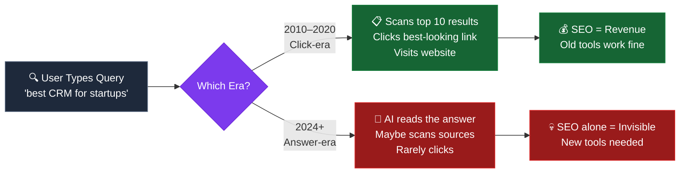
```mermaid
flowchart LR
    A["🔍 User Types Query\n'best CRM for startups'"] --> B{"Which Era?"}
    B --> |"2010–2020\nClick-era"| C["📋 Scans top 10 results\nClicks best-looking link\nVisits website"]
    B --> |"2024+\nAnswer-era"| D["🤖 AI reads the answer\nMaybe scans sources\nRarely clicks"]

    C --> E["💰 SEO = Revenue\nOld tools work fine"]
    D --> F["💀 SEO alone = Invisible\nNew tools needed"]

    style A fill:#1e293b,stroke:#64748b,color:#fff
    style B fill:#7c3aed,stroke:#6d28d9,color:#fff
    style C fill:#166534,stroke:#15803d,color:#fff
    style D fill:#991b1b,stroke:#dc2626,color:#fff
    style E fill:#166534,stroke:#15803d,color:#fff
    style F fill:#991b1b,stroke:#dc2626,color:#fff
```

Over 60% of Google searches now end without a click (Sparktoro/Semrush data). If your content isn't _the answer_, you receive no traffic even from searches you technically rank for. Existing tools — Semrush, Ahrefs, Moz — were built for the pre-LLM era and measure the wrong thing: link rankings. https://aeo-app.ai measures what actually matters in 2026: **who gets quoted when AI answers a question**.

---

## 2. Core Concepts: SEO, AEO, and GEO

### The Three Layers

Think of these as layers of the same stack, not competing strategies:

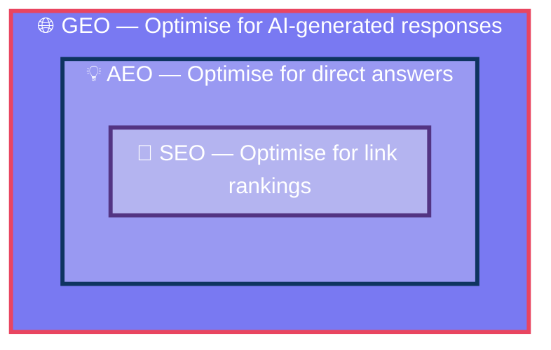
```mermaid
graph TB
    subgraph GEO["🌐 GEO — Optimise for AI-generated responses"]
        subgraph AEO["💡 AEO — Optimise for direct answers"]
            subgraph SEO["🔗 SEO — Optimise for link rankings"]
            end
        end
    end

    style GEO fill:#7979F2,stroke:#e94560,stroke-width:3px,color:#fff
    style AEO fill:#9999F2,stroke:#0f3460,stroke-width:3px,color:#fff
    style SEO fill:#B4B4F0,stroke:#533483,stroke-width:3px,color:#fff
```

**SEO** remains the foundation. If Google can't crawl and index your page, no AI system will find it either. Technical SEO, backlinks, on-page signals, and Google's E-E-A-T framework (Experience, Expertise, Authoritativeness, Trustworthiness) all feed the inputs that AEO and GEO build on.

**AEO** (Answer Engine Optimisation) layers on top by ensuring content is structured for extraction — clear questions, concise answers, proper schema markup, and voice-search readiness. AEO targets systems designed to directly respond to user queries rather than return a list of links, including: Google AI Overviews, Bing/Microsoft Copilot, Perplexity AI, Apple Intelligence, voice assistants (Alexa, Google Assistant, Siri), Featured Snippets, People Also Ask (PAA) boxes, and Knowledge Panels.

**GEO** (Generative Engine Optimisation) goes furthest by optimising for the generative layer — building authoritative content with the depth, citations, statistics, and credibility signals that LLMs are trained to privilege. GEO targets: Perplexity AI, ChatGPT Search, Google Gemini, Microsoft Copilot, Claude, Meta AI, You.com, and Grok. The term was formally introduced in a 2023 research paper from Princeton, Georgia Tech, The Allen Institute for AI, and IIT Delhi.

**You don't choose one. You do all three.** Tactics at each level reinforce the others.

### AEO vs GEO: The Subtle Difference

While people often use these terms interchangeably, there's a meaningful distinction:

| Dimension      | AEO                                         | GEO                                            |
| -------------- | ------------------------------------------- | ---------------------------------------------- |
| Focus          | Being the _direct answer_ to a query        | Being _cited or synthesised_ by an AI response |
| Engine type    | Structured retrieval (snippets, PAA, voice) | Generative LLM outputs                         |
| Content format | Clear Q&A, definitions, lists               | Authoritative depth, citations, statistics     |
| Origin         | Pre-LLM era (voice search, snippets)        | Post-2022 (GPT-4, AI Search era)               |
| Measurement    | Featured snippet wins, zero-click share     | AI citation frequency, mention volume          |

---

## 3. How AI Search Works

### Featured Snippets (Traditional AEO)

Google's snippet system: (1) parses query intent type, (2) retrieves top-ranked pages, (3) extracts the most relevant passage, (4) displays it directly in the SERP. Key insight: Google often pulls snippets from pages ranked 2nd–5th if their formatting more clearly answers the query. **Structure beats pure authority.**

### Google AI Overviews & Generative Engines

Both use a **Retrieval-Augmented Generation (RAG)** pipeline:

1. **Query understanding** — interpret intent, entities, and required response type
2. **Web retrieval** — retrieve live results (Perplexity crawls in real time; ChatGPT Search uses Bing)
3. **Passage ranking & chunking** — documents broken into 200–500 token chunks, ranked for relevance
4. **Generative synthesis** — LLM reads chunks and generates a cited response
5. **Citation attribution** — source visibility depends on retrieval score and LLM preference during synthesis

A page ranked #15 organically can still appear in an AI Overview if it contains the most precisely structured answer to a component of the query.

### What Makes an LLM Prefer Your Content

Research from the original GEO paper found the following tactics increased citation frequency:

| Tactic                                               | Citation visibility increase |
| ---------------------------------------------------- | ---------------------------- |
| Citing authoritative sources within your own content | +40%                         |
| Adding expert quotations                             | +34%                         |
| Including specific statistics                        | +27%                         |
| Using technical, domain-specific vocabulary          | +13%                         |
| Fluent, readable prose                               | +17%                         |
| Persuasive language and strong claims                | +11%                         |

### Voice Search & Smart Assistants

Voice assistants (Google Assistant, Siri, Alexa) typically pull from featured snippets (primary source), Knowledge Graph entries, structured data/schema markup, and trusted local data. Voice answers are almost always **a single, short spoken response** — meaning clarity and conciseness matter enormously.

---

## 4. Why This Matters Now

- Perplexity grew from 10M to 100M+ monthly queries in under 18 months
- ChatGPT Search launched to 100M+ users in 2024 and expanded rapidly through 2025
- Google AI Overviews now appear for over 15% of all queries and rising
- Microsoft Copilot handles hundreds of millions of queries monthly
- Smart speakers are in over 35% of homes in the US and Australia — each voice query has exactly one answer
- Even without a click, AI citations build brand awareness: users see your domain, associate your brand with authority, and drive direct/branded traffic

---

## 5. The Anatomy of an AI-Optimised Piece of Content

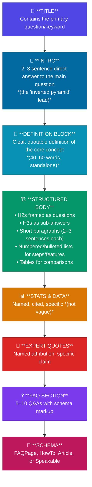
```mermaid
flowchart TD
    A["📌 **TITLE**\nContains the primary question/keyword"]
    B["📝 **INTRO**\n2–3 sentence direct answer to the main question\n*(the 'inverted pyramid' lead)*"]
    C["📖 **DEFINITION BLOCK**\nClear, quotable definition of the core concept\n*(40–60 words, standalone)*"]
    D["🏗️ **STRUCTURED BODY**\n• H2s framed as questions\n• H3s as sub-answers\n• Short paragraphs (2–3 sentences each)\n• Numbered/bulleted lists for steps/features\n• Tables for comparisons"]
    E["📊 **STATS & DATA**\nNamed, cited, specific *(not vague)*"]
    F["💬 **EXPERT QUOTES**\nNamed attribution, specific claim"]
    G["❓ **FAQ SECTION**\n5–10 Q&As with schema markup"]
    H["🔧 **SCHEMA**\nFAQPage, HowTo, Article, or Speakable"]

    A --> B --> C --> D --> E --> F --> G --> H

    style A fill:#4f46e5,stroke:#3730a3,color:#fff
    style B fill:#0369a1,stroke:#075985,color:#fff
    style C fill:#0891b2,stroke:#0e7490,color:#fff
    style D fill:#059669,stroke:#047857,color:#fff
    style E fill:#d97706,stroke:#b45309,color:#fff
    style F fill:#dc2626,stroke:#b91c1c,color:#fff
    style G fill:#7c3aed,stroke:#6d28d9,color:#fff
    style H fill:#be185d,stroke:#9d174d,color:#fff
```

---

## 6. AEO: Complete How-To Guide

### Step 1: Question-Based Keyword Research

Target questions and intent, not just keywords. Sources: AnswerThePublic, AlsoAsked, Google PAA boxes, Semrush/Ahrefs question filters, Reddit/Quora, and your own Search Console data.

| Intent Type         | Example Query                         | Optimal Format                    |
| ------------------- | ------------------------------------- | --------------------------------- |
| Definition          | "What is compound interest?"          | 40–60 word definition paragraph   |
| How-To              | "How do I set up 2FA?"                | Numbered steps                    |
| Comparison          | "AEO vs SEO — what's the difference?" | Table                             |
| Best/Recommendation | "Best project management tools"       | Ranked list with descriptions     |
| When/Why            | "Why is my Wi-Fi slow?"               | Short direct answer + explanation |
| Local               | "Dentists open Sunday in Brisbane"    | Local schema + NAP data           |

### Step 2: Answer-First Structure

Every major section should answer a specific question:

**H2 heading = the question**

```
## How Does AEO Differ from Traditional SEO?
```

**First 1–2 sentences = the direct answer**

```
AEO differs from SEO in its primary goal: where SEO aims to rank a page in
search results, AEO aims to have content selected as the direct answer —
bypassing the ranking list entirely.
```

**Remaining paragraphs = depth and context**

### Step 3: Featured Snippet Paragraphs

Target 40–60 words. Open by directly rephrasing the question. Give a complete, self-contained answer. Avoid first-person ("I", "we") and pronouns requiring context (say "AEO" not "it"). End with a full stop.

**Example:**

> **Question:** What is a featured snippet?
>
> **Optimised paragraph:** A featured snippet is a selected search result that Google displays at the top of the SERP in a special box, above all organic results. It is pulled directly from a web page and is designed to answer a user's question without requiring them to click through to the source. Featured snippets typically appear for question-based queries and can take the form of paragraphs, lists, or tables.

### Step 4: List-Optimised Content

Use `<ul>` or `<ol>` HTML tags. Keep list items concise (one line each is ideal). Introduce the list with a colon after a clear statement. Include 4–10 items (Google typically shows 4–8 in snippets). Don't rely purely on visual formatting — the context sentence matters.

### Step 5: Voice Search Optimisation

**Use conversational language.** Write how people speak. Instead of "optimal strategies for sleep improvement," write "how to sleep better."

**Target long-tail conversational queries.** "What's the cheapest way to fly from Sydney to London?" not "cheap Sydney London flights."

**Answer in 29 words or fewer** for voice. Google Assistant reads snippets aloud, and shorter answers perform better in voice SERP audits.

**Include Speakable schema** to explicitly flag which portions of your content are suitable for text-to-speech reading.

**Mark up your local data.** Voice searches are heavily local. Make sure your Google Business Profile is complete, your schema includes location data, and your NAP (Name, Address, Phone) is consistent across all citations.

### Step 6: FAQ Strategy

FAQ sections capture PAA boxes, feed AI Overviews, and allow FAQPage schema markup. Build 6–12 questions per page using real PAA and AnswerThePublic data. Each answer should be standalone and concise. Mark up every FAQ with FAQPage schema.

### Step 7: Knowledge Panels

To get or improve a knowledge panel:

- Create a Wikipedia article or Wikidata entry (for organisations or notable people)
- Claim your Google Business Profile
- Build consistent entity signals — ensure your name, description, and key facts are consistent across your website, social profiles, Crunchbase, LinkedIn, and press mentions
- Use `Organization`, `Person`, or `LocalBusiness` schema
- Link your social profiles in `sameAs` schema properties

---

## 7. GEO: Complete How-To Guide

### Step 1: Topical Authority Clusters

Generative engines heavily weight established authorities. Build a **pillar page** (3,000+ words) supported by cluster pages covering every sub-topic. Example structure:

```
Core Topic: "Cybersecurity for Small Business"
│
├── Pillar Page: Complete Guide to Cybersecurity for SMEs (3,000+ words)
│
├── Cluster Pages:
│   ├── What is a Firewall? (Definition + how-to)
│   ├── How to Set Up Two-Factor Authentication (Step-by-step)
│   ├── Best Password Managers for Small Teams (Comparison)
│   ├── How to Respond to a Data Breach (Emergency guide)
│   ├── Cybersecurity Compliance Checklist (Australia) (List)
│   ├── Common Phishing Attacks and How to Spot Them (Examples)
│   └── How Much Does a Cyberattack Cost an SME? (Data + stats)
│
└── All cluster pages link to pillar; pillar links to all cluster pages
```

When an LLM is asked about small business cybersecurity, your domain appearing repeatedly across retrieved content dramatically increases citation probability.

### Step 2: Statistics and Cited Data

Named, specific, current statistics with context. Example:

**Bad:** _Cyber attacks are very common among small businesses._

**Good:** _According to the Australian Cyber Security Centre's 2024 Annual Cyber Threat Report, cybercrime cost Australian organisations an estimated $33 billion in 2023–24, with small businesses accounting for 43% of all reported incidents._

What makes a good GEO statistic: named source, specific number, current year reference, contextualised meaning.

### Step 3: Expert Quotes

Include full name, title, and organisation. Make quotes specific and concrete, not platitudes. Provide context (conference, report, interview). A specific quote from a relevant mid-tier expert beats a vague quote from a famous one.

**Example format:**

> _"The biggest mistake SMEs make is treating cybersecurity as an IT issue rather than a business continuity issue,"_ says David Thodey, former CEO of Telstra, speaking at the 2024 AICD Cybersecurity Forum.

### Step 4: Comprehensiveness

Generative engines want to pull from one authoritative source where possible. Content that covers only one angle forces the LLM to pull from multiple sources — reducing your share of the citation.

**Comprehensiveness checklist for any topic page:**

- [ ] Definition of the core concept
- [ ] Historical context or origin
- [ ] How it works (mechanistically)
- [ ] Key components or variations
- [ ] Real-world examples or case studies
- [ ] Common misconceptions or myths
- [ ] Step-by-step implementation (if applicable)
- [ ] Pros and cons or limitations
- [ ] Expert perspectives
- [ ] Data and statistics
- [ ] FAQ section
- [ ] Related topics and next steps

### Step 5: Chunk-Friendly Structure

When a generative engine retrieves your page, it breaks it into segments of typically 200–500 tokens and ranks each chunk independently. **Every section must be independently useful and self-contained.**

- Start each H2/H3 section with a 1–2 sentence summary of what that section covers
- Don't rely on earlier context — each section should stand alone
- Avoid orphaned references ("as we discussed above...")
- Use descriptive headings that tell the reader (and the model) exactly what follows
- Keep paragraphs short — 3–5 sentences maximum

### Step 6: Authority Links

- Get cited in Wikipedia — heavily represented in LLM training data and retrieval indexes
- Earn .edu and .gov links
- Get featured in industry publications, trade press, and respected blogs
- Seek podcast/interview mentions — transcripts are crawled and indexed
- Publish original research — being the primary data source forces others to cite you

### Step 7: Brand Entity Optimisation

Generative AI systems think in terms of entities. Your brand, key employees, and products should all be clearly defined entities in the web's knowledge graph.

1. Create and maintain a Wikidata entry for your organisation
2. Claim and complete Google Knowledge Panel
3. Ensure consistent brand description across website, LinkedIn, Crunchbase, AngelList, and press mentions
4. Define key people — founders, executives — as named entities with consistent bios across platforms
5. Use `Organization` and `Person` schema with `sameAs` properties linking all profiles
6. Write an authoritative About page that defines your entity clearly

**UGC and Wikipedia Notability**

User-Generated Content plays a role in establishing Wikipedia notability indirectly. While UGC itself (social media posts, forum discussions, user reviews) isn't typically considered a reliable Wikipedia source, it can support notability by showcasing public interest and recognition.

How UGC contributes: high social engagement indicates widespread public interest; positive reviews on platforms like Google Reviews demonstrate market recognition; active forum participation (Reddit, Stack Overflow) highlights expertise; user testimonials build credibility and real-world application evidence.

Strategies to leverage UGC:

1. Feature user reviews and testimonials prominently on your website
2. Make content easily shareable to increase organic mentions and backlinks
3. Monitor brand mentions, sentiment, and coverage in UGC sources
4. Use UGC as a foundation to attract coverage from reliable sources — which is what Wikipedia actually requires
5. Avoid self-promotion pitfalls — focus on genuine, independent mentions rather than paid or orchestrated UGC

Among UGC sources, **Reddit** stands out for its massive user base and community-driven discussions. Authentic engagement in relevant subreddits can generate organic mentions that demonstrate community interest. However, Reddit threads are not reliable sources themselves; they serve as indicators of broader impact that can lead to coverage in more authoritative outlets.

### Step 8: Original Research

The single most powerful GEO tactic is creating content that cannot be found anywhere else. Original surveys, proprietary studies, and unique datasets force other content creators to cite you as the primary source.

**Ideas for original research:**

- Annual industry survey (even 100 respondents creates quotable data)
- Original analysis of publicly available datasets
- Case studies with specific, measurable outcomes
- Expert roundups with synthesised insights
- Benchmarking reports

---

## 8. Technical Optimisation

### Page Speed

- Core Web Vitals: LCP < 2.5s, INP < 200ms, CLS < 0.1
- TTFB: < 600ms
- Mobile PageSpeed score: 80+

### Crawlability

Ensure `robots.txt` does not block AI crawlers. Submit and maintain an up-to-date `sitemap.xml`. Use `hreflang` for multilingual sites. Resolve all broken internal links and redirect chains. Avoid heavy JavaScript rendering for key content — server-side rendering is preferred.

| Crawler               | User Agent                   |
| --------------------- | ---------------------------- |
| OpenAI (ChatGPT)      | `GPTBot`                     |
| Perplexity            | `PerplexityBot`              |
| Anthropic (Claude)    | `ClaudeBot` / `anthropic-ai` |
| Google (AI Overviews) | `Googlebot-Extended`         |
| Common Crawl          | `CCBot`                      |
| Meta                  | `FacebookBot`                |

### Content Freshness

Update the published/modified date when content is substantively refreshed. Add a "Last Updated: [Month Year]" notice prominently. Use `dateModified` in Article schema. Refresh statistics and data at least annually.

---

## 9. Schema Markup & Structured Data

Schema markup is the bridge between your content and machine-readable structure. It explicitly tells search engines and AI systems what your content is _about_, not just what it _says_.

### FAQPage Schema

```json
{
  "@context": "https://schema.org",
  "@type": "FAQPage",
  "mainEntity": [
    {
      "@type": "Question",
      "name": "What is Answer Engine Optimisation (AEO)?",
      "acceptedAnswer": {
        "@type": "Answer",
        "text": "Answer Engine Optimisation (AEO) is the practice of structuring content so that answer engines — platforms that provide direct answers to queries rather than a list of links — select it as the source of their responses. It involves formatting content for extraction by systems like Google AI Overviews, voice assistants, and featured snippets."
      }
    },
    {
      "@type": "Question",
      "name": "How is AEO different from SEO?",
      "acceptedAnswer": {
        "@type": "Answer",
        "text": "While SEO focuses on ranking a page in search results to earn clicks, AEO focuses on having content selected as a direct answer, bypassing the ranking list. SEO drives traffic; AEO drives visibility at the point of answer."
      }
    }
  ]
}
```

### HowTo Schema

```json
{
  "@context": "https://schema.org",
  "@type": "HowTo",
  "name": "How to Optimise Content for AI Search",
  "step": [
    {
      "@type": "HowToStep",
      "name": "Identify question-based keywords",
      "text": "Use tools like AnswerThePublic and Semrush to find the specific questions your audience asks about your topic.",
      "position": 1
    },
    {
      "@type": "HowToStep",
      "name": "Structure content with question-based headings",
      "text": "Format each major section as a question (H2) followed immediately by a direct 2–3 sentence answer.",
      "position": 2
    }
  ]
}
```

### Article Schema (with dateModified)

```json
{
  "@context": "https://schema.org",
  "@type": "Article",
  "headline": "The Complete Guide to AEO and GEO",
  "description": "Everything you need to know about Answer Engine Optimisation and Generative Engine Optimisation.",
  "author": {
    "@type": "Person",
    "name": "Your Name",
    "url": "https://yoursite.com/about"
  },
  "publisher": {
    "@type": "Organization",
    "name": "Your Brand",
    "logo": {
      "@type": "ImageObject",
      "url": "https://yoursite.com/logo.png"
    }
  },
  "datePublished": "2024-01-15",
  "dateModified": "2026-03-01"
}
```

### Speakable Schema

```json
{
  "@context": "https://schema.org",
  "@type": "Article",
  "speakable": {
    "@type": "SpeakableSpecification",
    "cssSelector": [".article-intro", ".answer-block", "h2"]
  }
}
```

### Organization Schema (with sameAs)

```json
{
  "@context": "https://schema.org",
  "@type": "Organization",
  "name": "Your Company Name",
  "url": "https://yoursite.com",
  "logo": "https://yoursite.com/logo.png",
  "description": "A concise, authoritative description of what your organisation does.",
  "sameAs": [
    "https://www.linkedin.com/company/yourcompany",
    "https://twitter.com/yourcompany",
    "https://en.wikipedia.org/wiki/Your_Company",
    "https://www.wikidata.org/wiki/Q123456"
  ]
}
```

---

## 10. E-E-A-T

Google's E-E-A-T framework (Experience, Expertise, Authoritativeness, Trustworthiness) is a proxy for the signals both traditional search and generative AI use to weight content.

### Experience

Has the author _done_ the thing they're writing about?

**Tactics:** Include case studies from your own work. Add personal anecdotes where relevant. Reference direct testing ("In our testing of 50 product pages..."). Show screenshots, results, or outcomes as evidence.

### Expertise

Does the author have demonstrable knowledge?

**Tactics:** Add author bios to every content piece — name, credentials, links to professional profiles. Use technical vocabulary correctly and confidently. Cite primary sources and peer-reviewed research. Link to your other expert content on the same topic.

### Authoritativeness

Is this source recognised as an authority by others?

**Tactics:** Earn backlinks from respected industry sources. Get mentioned or quoted in trade press. Build a recognisable brand on social/professional platforms. Contribute expert quotes to others' content (they'll link back).

### Trustworthiness

Is the content honest, accurate, and safe?

**Tactics:** Show your sources — link out to primary data. Include dates and version notes. Disclose affiliations and conflicts of interest. Have a clear, comprehensive About page. Display trust signals: privacy policy, terms, contact details. Use HTTPS.

---

## 11. Prompt Engineering for Your Content

When an LLM retrieves your page and reads it, it is essentially processing your text as input context. The clearer, more structured, and more answerable your text is, the better the model can extract value from it.

**Write "Context-Complete" Sections:** Every chunk of your content should contain sufficient context to generate a useful answer. Ask yourself: _If I gave this paragraph — and only this paragraph — to ChatGPT, could it answer a question from this text alone?_

**Use Explicit Definitional Language:** LLMs latch onto definitional sentences — statements of the form "X is Y." Use them liberally:

> _AEO is the practice of..._
> _The key difference between X and Y is..._
> _A [term] refers to..._

**Reinforce Your Entity in Context:** Mention your brand name, core expertise, and key claims naturally throughout content — contextually embedded, not stuffed. When an LLM encounters your brand repeatedly in the context of authoritative, accurate claims, it reinforces entity associations.

---

## 12. Tracking & Measuring Performance

### AEO Metrics

| Metric                      | What it Measures                                         | Tool                          |
| --------------------------- | -------------------------------------------------------- | ----------------------------- |
| Featured Snippet wins       | How often you appear in snippet position                 | Semrush, Ahrefs               |
| PAA appearances             | Presence in People Also Ask boxes                        | AlsoAsked, SERPWatcher        |
| Zero-click impression share | Impressions without clicks (indicating snippet presence) | Google Search Console         |
| Voice search rankings       | Rank for conversational queries                          | SEMrush Voice                 |
| AI Overview appearances     | Whether you're cited in Google AI Overviews              | Manual checks, emerging tools |
| Rich result types           | HowTo, FAQ, etc. in SERP                                 | Google Rich Results Test      |

### GEO Metrics

| Metric                     | What it Measures                                    | Tool                       |
| -------------------------- | --------------------------------------------------- | -------------------------- |
| AI citation frequency      | How often you're cited by Perplexity, ChatGPT, etc. | Manual spot-checks, AirOps |
| Brand mention volume in AI | How often your brand appears in AI answers          | Mention tracking tools     |
| Share of AI voice          | Your citations vs. competitors'                     | Competitive monitoring     |
| Topical coverage           | Questions on your topic you're cited for            | Manual testing             |
| LLM brand familiarity      | Does the model "know" your brand?                   | Prompt testing             |

### Practical GEO Monitoring Process

1. Define a set of 20–50 target queries — the most important questions in your niche
2. Test each query weekly in Perplexity, ChatGPT Search, and Google AI Overviews
3. Record whether you're cited, mentioned, or absent for each
4. Track trends over time — is your citation rate improving?
5. Analyse which content types get cited most often (guides vs. data pieces vs. definitions)
6. Test competitor queries to understand what's working for peers

---

## 13. Tools Reference

### Research & Discovery

| Tool                | Use Case                                  |
| ------------------- | ----------------------------------------- |
| **AnswerThePublic** | Question-based keyword research           |
| **AlsoAsked**       | PAA question mapping                      |
| **Semrush**         | Keyword research, SERP feature tracking   |
| **Ahrefs**          | Link analysis, content gap analysis       |
| **SparkToro**       | Audience research                         |
| **BuzzSumo**        | Content performance and citation research |

### Schema & Technical

| Tool                         | Use Case                                |
| ---------------------------- | --------------------------------------- |
| **Google Rich Results Test** | Test schema implementation              |
| **Schema.org**               | Schema markup reference                 |
| **Merkle Schema Generator**  | Visual schema markup builder            |
| **Google Markup Helper**     | Visual schema markup tagging tool       |
| **Screaming Frog**           | Technical SEO crawl and audit           |
| **Google Search Console**    | Search performance and index monitoring |

### AI & Generative Search Monitoring

| Tool                       | Use Case                                            |
| -------------------------- | --------------------------------------------------- |
| **Perplexity AI**          | Test GEO visibility manually                        |
| **ChatGPT / Bing Copilot** | Test brand and content presence in AI answers       |
| **AirOps**                 | AI content pipeline and brand monitoring            |
| **Profound**               | GEO-specific citation and brand visibility tracking |
| **Otterly.AI**             | Monitor brand mentions across AI platforms          |
| **Goodie**                 | AI search optimisation and monitoring               |
| **GenRank**                | Track AI citation visibility and GEO performance    |

### Content Optimisation

| Tool           | Use Case                               |
| -------------- | -------------------------------------- |
| **Surfer SEO** | Content structure and NLP optimisation |
| **Clearscope** | Topical comprehensiveness scoring      |
| **MarketMuse** | Content depth and gap analysis         |
| **Frase**      | Question-based content briefs          |

---

## 14. Common Mistakes to Avoid

- **Treating AEO/GEO as separate from SEO** — they require a solid SEO foundation
- **Targeting keywords instead of questions** — "cybersecurity tips" vs "How can a small business improve cybersecurity without a large IT budget?"
- **Writing flowing paragraphs instead of chunks** — beautiful prose is terrible for AI retrieval
- **Ignoring entity signals** — an AI that doesn't know who you are won't cite you as an authority
- **Vague, passive language** — "It is generally believed that..." signals low-confidence content; AI systems prefer specific, attributed claims
- **No update strategy** — AI systems prefer fresh content; build a refresh calendar for your most important pages
- **Blocking AI crawlers** — review your `robots.txt` intentionally; many WordPress plugins aggressively block all bots
- **Expecting overnight results** — GEO operates on longer cycles; retrieval-based systems (Perplexity) respond faster; base model training changes slower

---

## 15. The Future of AEO & GEO

### Agentic AI

AI agents (like Operator from OpenAI, or Copilot agents from Microsoft) browse the web, fill forms, make bookings, and complete multi-step workflows autonomously. For AEO/GEO practitioners: action schema will become critical, API-accessible data will be favoured over HTML pages, and trust signals become existential.

### Personalised AI Search

As AI systems become more personalised, brand loyalty signals, citation history, and user-specific relevance will increasingly influence which sources AI cites for a given individual.

### Multimodal AI Search

Future GEO will require optimised alt text and image descriptions for visual AI, transcripts and structured metadata for video content, and podcast episode notes and transcripts for audio content.

### Regulatory and Transparency Changes

Emerging AI transparency regulations (particularly in the EU under the AI Act) may require AI search systems to disclose sources more prominently — potentially increasing the brand visibility value of AI citations.

---

## 16. Quick-Reference Checklists

### ✅ AEO Checklist

- [ ] Target at least one question-based keyword per page
- [ ] Write a 40–60 word "featured snippet paragraph" at the top of the page
- [ ] Frame all H2s as questions
- [ ] Use numbered/bulleted lists for step-based or list-based answers
- [ ] Include a FAQ section (6–12 questions)
- [ ] Add FAQPage schema markup
- [ ] Optimise page title and meta description for question intent
- [ ] Ensure content is readable by screen readers / voice assistants
- [ ] Add Speakable schema for key answer sections
- [ ] Test in Google's Rich Results Test

### ✅ GEO Checklist

- [ ] Build a topical authority cluster around your core subject
- [ ] Include at least 3 named, sourced statistics per article
- [ ] Include at least 1 expert quote with full attribution
- [ ] Write each section to be self-contained (chunk-friendly)
- [ ] Cover all subtopics to ensure comprehensiveness
- [ ] Link out to primary sources and authoritative references
- [ ] Add Article schema with author bio and dateModified
- [ ] Build/claim Wikidata entity entry for your organisation
- [ ] Check robots.txt permits AI crawlers
- [ ] Set up regular manual testing of target queries in Perplexity, ChatGPT Search, and Google AI Overviews

### ✅ Technical Checklist

- [ ] Core Web Vitals passing (LCP, INP, CLS)
- [ ] HTTPS enabled
- [ ] XML sitemap up to date
- [ ] No unintentional AI crawler blocks in robots.txt
- [ ] Structured data implemented and tested (FAQPage, HowTo, Article)
- [ ] Schema sameAs properties linking all brand profiles
- [ ] Author pages with credentials linked from all articles
- [ ] Mobile performance score 80+
- [ ] Content updated within the last 12 months (where relevant)

---

---

# https://aeo-app.ai — Platform Specification

---

## 17. Platform Overview

https://aeo-app.ai is a B2B SaaS platform giving digital marketing agencies, in-house SEO teams, and enterprise content teams a unified command centre for SEO, AEO, and GEO.

### Strategic Pillars

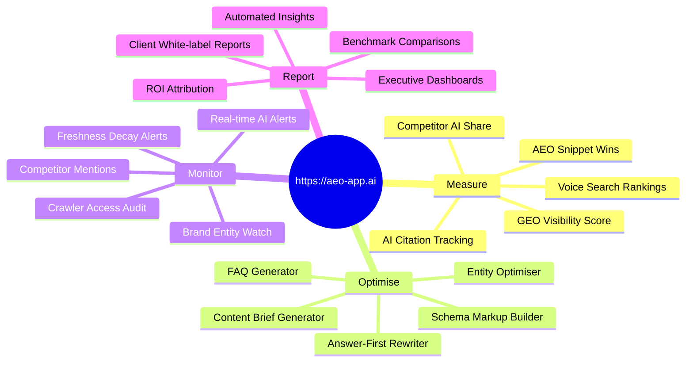
```mermaid
mindmap
  root((https://aeo-app.ai))
    Measure
      AI Citation Tracking
      GEO Visibility Score
      AEO Snippet Wins
      Voice Search Rankings
      Competitor AI Share
    Optimise
      Content Brief Generator
      Schema Markup Builder
      Answer-First Rewriter
      Entity Optimiser
      FAQ Generator
    Monitor
      Real-time AI Alerts
      Competitor Mentions
      Brand Entity Watch
      Freshness Decay Alerts
      Crawler Access Audit
    Report
      Client White-label Reports
      Executive Dashboards
      ROI Attribution
      Benchmark Comparisons
      Automated Insights
```

---

## 18. Market Opportunity

| Segment                           | TAM               | SAM        | SOM (Y3) |
| --------------------------------- | ----------------- | ---------- | -------- |
| Global SEO Software Market        | $1.6B             | $400M      | $18M     |
| AI Search Optimisation (emerging) | $800M (projected) | $200M      | $25M     |
| Digital Agency Tools              | $4.2B             | $600M      | $30M     |
| **Total Addressable**             | **~$6.6B**        | **~$1.2B** | **$73M** |

**Key tailwinds:** AI Overview appearances growing ~40% YoY. 67% of marketers report zero-click rates increasing. No single platform currently offers unified SEO + AEO + GEO measurement.

---

## 19. Competitive Positioning

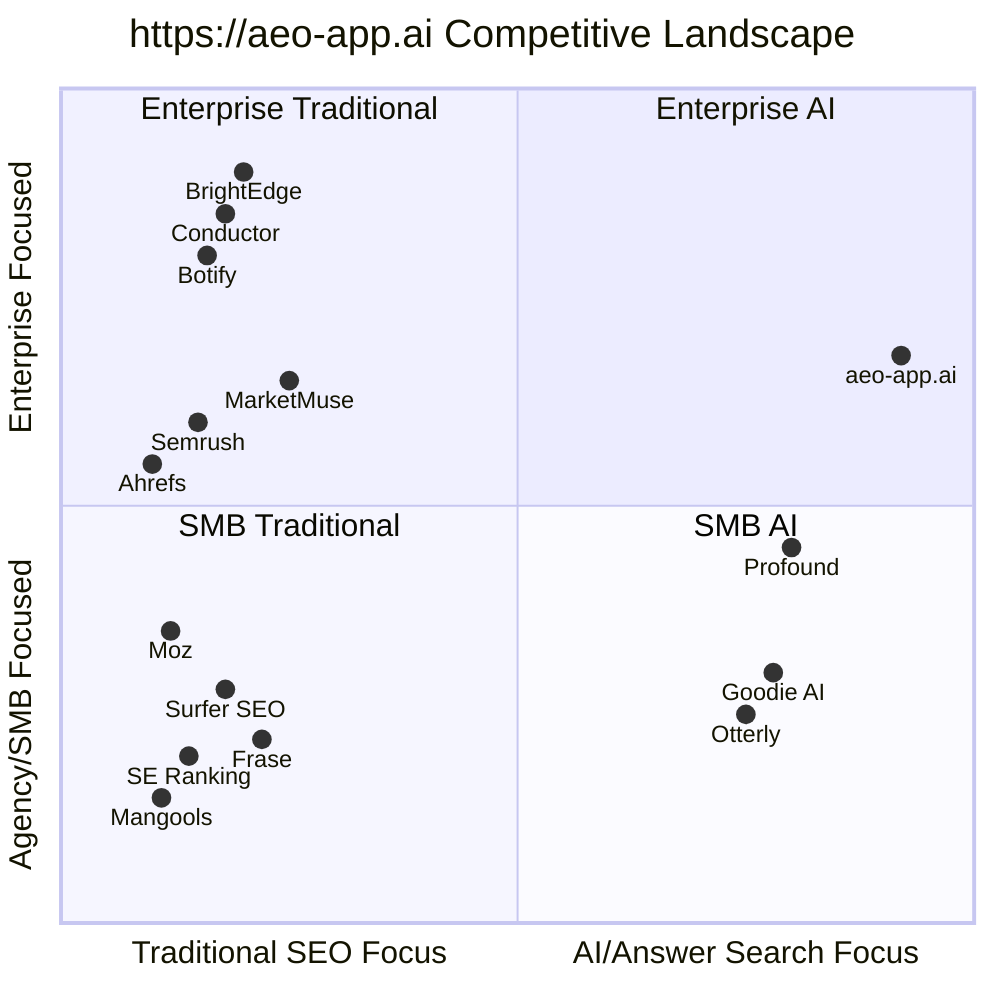
```mermaid
quadrantChart
    title https://aeo-app.ai Competitive Landscape
    x-axis "Traditional SEO Focus" --> "AI/Answer Search Focus"
    y-axis "Agency/SMB Focused" --> "Enterprise Focused"
    quadrant-1 Enterprise AI
    quadrant-2 Enterprise Traditional
    quadrant-3 SMB Traditional
    quadrant-4 SMB AI
    Semrush: [0.15, 0.60]
    Ahrefs: [0.10, 0.55]
    Moz: [0.12, 0.35]
    BrightEdge: [0.20, 0.90]
    Profound: [0.80, 0.45]
    Otterly: [0.75, 0.25]
    Goodie AI: [0.78, 0.30]
    Surfer SEO: [0.18, 0.28]
    Frase: [0.22, 0.22]
    MarketMuse: [0.25, 0.65]
    Conductor: [0.18, 0.85]
    Botify: [0.16, 0.80]
    SE Ranking: [0.14, 0.20]
    Mangools: [0.11, 0.15]
    aeo-app.ai: [0.92, 0.68]
```

| Tool           | Strengths                                             | Limitations for AEO/GEO                                         |
| -------------- | ----------------------------------------------------- | --------------------------------------------------------------- |
| **Semrush**    | Comprehensive keyword research, SERP feature tracking | Limited GEO citation monitoring, no real-time AI search testing |
| **Ahrefs**     | Excellent link analysis, content gap detection        | Emerging AI insights, but not primary focus                     |
| **Moz**        | Strong traditional SEO metrics, local SEO             | Minimal AEO/GEO tools, focused on legacy SEO                    |
| **BrightEdge** | Enterprise-grade SEO platform, some AI capabilities   | Expensive, limited generative search tracking                   |
| **Profound**   | Dedicated GEO citation tracking                       | New entrant, smaller feature set                                |
| **Otterly.AI** | Brand mention monitoring in AI responses              | Narrow focus on mentions, not full GEO optimisation             |

---

## 20. Stakeholders

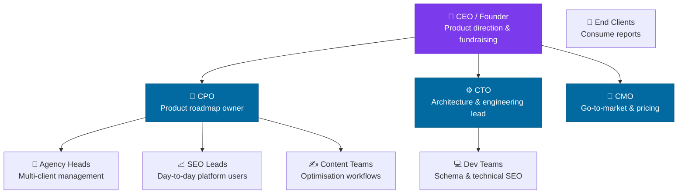
```mermaid
flowchart TD
    CEO["👔 CEO / Founder\nProduct direction & fundraising"]
    CPO["🧠 CPO\nProduct roadmap owner"]
    CTO["⚙️ CTO\nArchitecture & engineering lead"]
    CMO["📣 CMO\nGo-to-market & pricing"]

    AgencyHead["🏢 Agency Heads\nMulti-client management"]
    SEOLead["📈 SEO Leads\nDay-to-day platform users"]
    ContentTeam["✍️ Content Teams\nOptimisation workflows"]
    DevTeam["💻 Dev Teams\nSchema & technical SEO"]
    Clients["👥 End Clients\nConsume reports"]

    CEO --> CPO
    CEO --> CTO
    CEO --> CMO
    CPO --> AgencyHead
    CPO --> SEOLead
    CPO --> ContentTeam
    CTO --> DevTeam

    style CEO fill:#7c3aed,stroke:#6d28d9,color:#fff
    style CPO fill:#0369a1,color:#fff,stroke:#075985
    style CTO fill:#0369a1,color:#fff,stroke:#075985
    style CMO fill:#0369a1,color:#fff,stroke:#075985
```

---

## 21. User Personas Examples:

### Persona 1: The Agency Director

- **Role:** Head of Digital at a 40-person agency managing 60+ client accounts
- **Pain:** Manually checking AI answers for each client is impossible at scale. Clients ask "are we in ChatGPT?" and there's no good answer.
- **Needs:** White-labelled client reporting, bulk monitoring, ROI dashboards, alerts
- **Willing to pay:** $500–$2,000/month

### Persona 2: The In-House SEO Lead

- **Role:** Senior SEO Manager at a mid-size e-commerce brand
- **Pain:** Knows AI search is important but has no tooling. Justifying investment to the CMO requires data she can't produce.
- **Needs:** GEO score benchmarking, content gap analysis, automated briefs
- **Willing to pay:** $200–$600/month

### Persona 3: The Enterprise Content Strategist

- **Role:** VP Content at a Fortune 500 financial services firm
- **Pain:** Compliance requires knowing exactly where brand messaging appears. AI citations are ungoverned. Competitor AI mentions are eating their share.
- **Needs:** Enterprise governance, brand entity monitoring, competitor tracking, API access
- **Willing to pay:** $2,000–$10,000/month

---

## 22. Core Product Features

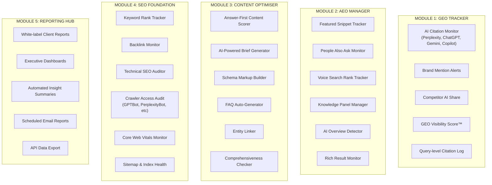
```mermaid
flowchart TD
    subgraph F1["MODULE 1: GEO TRACKER"]
        G1["AI Citation Monitor\n(Perplexity, ChatGPT, Gemini, Copilot)"]
        G2["Brand Mention Alerts"]
        G3["Competitor AI Share"]
        G4["GEO Visibility Score™"]
        G5["Query-level Citation Log"]
    end

    subgraph F2["MODULE 2: AEO MANAGER"]
        A1["Featured Snippet Tracker"]
        A2["People Also Ask Monitor"]
        A3["Voice Search Rank Tracker"]
        A4["Knowledge Panel Manager"]
        A5["AI Overview Detector"]
        A6["Rich Result Monitor"]
    end

    subgraph F3["MODULE 3: CONTENT OPTIMISER"]
        C1["Answer-First Content Scorer"]
        C2["AI-Powered Brief Generator"]
        C3["Schema Markup Builder"]
        C4["FAQ Auto-Generator"]
        C5["Entity Linker"]
        C6["Comprehensiveness Checker"]
    end

    subgraph F4["MODULE 4: SEO FOUNDATION"]
        S1["Keyword Rank Tracker"]
        S2["Backlink Monitor"]
        S3["Technical SEO Auditor"]
        S4["Crawler Access Audit\n(GPTBot, PerplexityBot, etc)"]
        S5["Core Web Vitals Monitor"]
        S6["Sitemap & Index Health"]
    end

    subgraph F5["MODULE 5: REPORTING HUB"]
        R1["White-label Client Reports"]
        R2["Executive Dashboards"]
        R3["Automated Insight Summaries"]
        R4["Scheduled Email Reports"]
        R5["API Data Export"]
    end
```

---

## 23. GEO Visibility Score™

The **GEO Visibility Score™** is https://aeo-app.ai's proprietary metric — a 0–100 composite score representing how visible a brand is across AI-generated search responses.

### Score Calculation

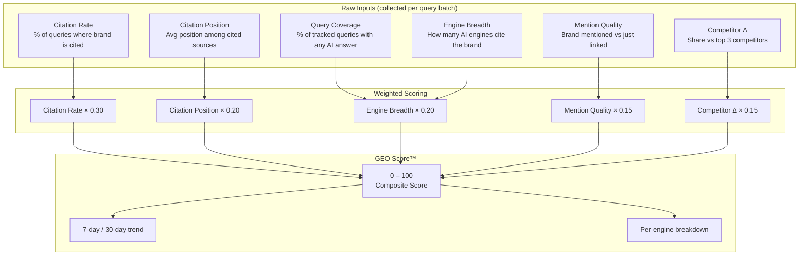
```mermaid
flowchart TD
    subgraph INPUTS["Raw Inputs (collected per query batch)"]
        I1["Citation Rate\n% of queries where brand is cited"]
        I2["Citation Position\nAvg position among cited sources"]
        I3["Query Coverage\n% of tracked queries with any AI answer"]
        I4["Engine Breadth\nHow many AI engines cite the brand"]
        I5["Mention Quality\nBrand mentioned vs just linked"]
        I6["Competitor Δ\nShare vs top 3 competitors"]
    end

    subgraph WEIGHTS["Weighted Scoring"]
        W1["Citation Rate × 0.30"]
        W2["Citation Position × 0.20"]
        W3["Engine Breadth × 0.20"]
        W4["Mention Quality × 0.15"]
        W5["Competitor Δ × 0.15"]
    end

    subgraph OUTPUT["GEO Score™"]
        SCORE["0 – 100\nComposite Score"]
        TREND["7-day / 30-day trend"]
        BREAKDOWN["Per-engine breakdown"]
    end

    I1 --> W1
    I2 --> W2
    I3 --> W3
    I4 --> W3
    I5 --> W4
    I6 --> W5

    W1 & W2 & W3 & W4 & W5 --> SCORE
    SCORE --> TREND
    SCORE --> BREAKDOWN
```

### Score Bands

| Score  | Label              | Description                                              |
| ------ | ------------------ | -------------------------------------------------------- |
| 85–100 | 🟢 **Dominant**    | Cited in most tracked queries across multiple AI engines |
| 65–84  | 🔵 **Established** | Consistently cited; strong single-engine presence        |
| 40–64  | 🟡 **Emerging**    | Cited sporadically; significant gaps in coverage         |
| 15–39  | 🟠 **Weak**        | Rarely cited; competitor brands dominate                 |
| 0–14   | 🔴 **Invisible**   | Not found in AI responses; urgent remediation needed     |

---

## 24. AEO Command Centre — SERP Feature Detection Logic

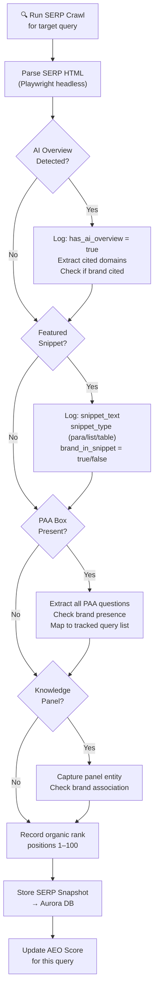
```mermaid
flowchart TD
    START["🔍 Run SERP Crawl\nfor target query"] --> PARSE["Parse SERP HTML\n(Playwright headless)"]

    PARSE --> Q1{"AI Overview\nDetected?"}
    Q1 -->|Yes| AIO["Log: has_ai_overview = true\nExtract cited domains\nCheck if brand cited"]
    Q1 -->|No| Q2

    AIO --> Q2{"Featured\nSnippet?"}
    Q2 -->|Yes| SNIP["Log: snippet_text\nsnippet_type (para/list/table)\nbrand_in_snippet = true/false"]
    Q2 -->|No| Q3

    SNIP --> Q3{"PAA Box\nPresent?"}
    Q3 -->|Yes| PAA["Extract all PAA questions\nCheck brand presence\nMap to tracked query list"]
    Q3 -->|No| Q4

    PAA --> Q4{"Knowledge\nPanel?"}
    Q4 -->|Yes| KP["Capture panel entity\nCheck brand association"]
    Q4 -->|No| ORGANIC

    KP --> ORGANIC["Record organic rank\npositions 1–100"]
    ORGANIC --> STORE["Store SERP Snapshot\n→ Aurora DB"]
    STORE --> SCORE["Update AEO Score\nfor this query"]
```

---

## 25. Content Optimiser — Scoring Rubric

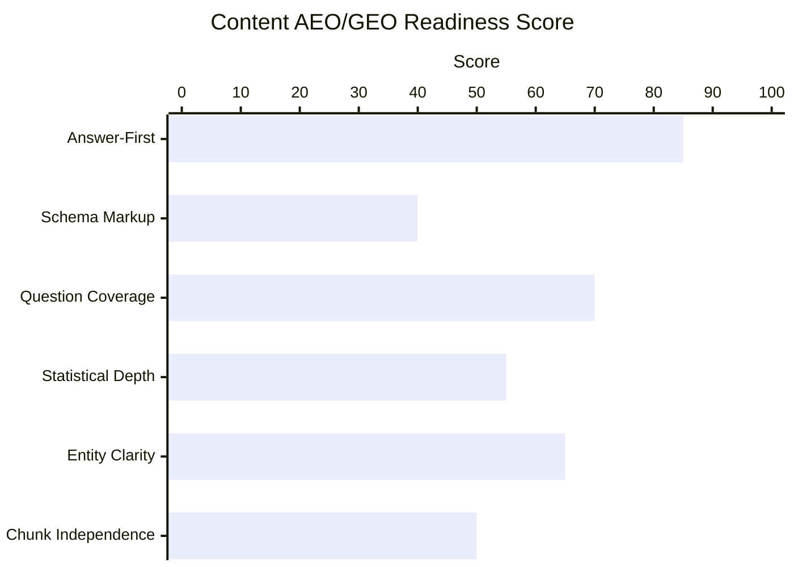
```mermaid
xychart-beta horizontal
    title "Content AEO/GEO Readiness Score"
    x-axis ["Answer-First", "Schema Markup", "Question Coverage", "Statistical Depth", "Entity Clarity", "Chunk Independence"]
    y-axis "Score" 0 --> 100
    bar [85, 40, 70, 55, 65, 50]
```

| Dimension              | Weight | What it measures                                                  |
| ---------------------- | ------ | ----------------------------------------------------------------- |
| Answer-First Structure | 20%    | Does each section open with a direct answer? Inverted pyramid use |
| Schema Markup          | 20%    | FAQPage, HowTo, Article, Speakable presence and validity          |
| Question Coverage      | 18%    | % of PAA questions for this topic addressed                       |
| Statistical Depth      | 15%    | Named, cited, specific statistics per 1,000 words                 |
| Entity Clarity         | 15%    | Definitional sentences, named attributions, entity mentions       |
| Chunk Independence     | 12%    | Each section readable without surrounding context                 |

---

## 26. Schema Builder

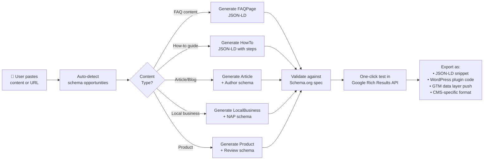
```mermaid
flowchart LR
    U["👤 User pastes\ncontent or URL"] --> DETECT["Auto-detect\nschema opportunities"]

    DETECT --> TYPE{"Content\nType?"}

    TYPE -->|FAQ content| FAQ_SCHEMA["Generate FAQPage\nJSON-LD"]
    TYPE -->|How-to guide| HOWTO_SCHEMA["Generate HowTo\nJSON-LD with steps"]
    TYPE -->|Article/Blog| ART_SCHEMA["Generate Article\n+ Author schema"]
    TYPE -->|Local business| LOCAL_SCHEMA["Generate LocalBusiness\n+ NAP schema"]
    TYPE -->|Product| PROD_SCHEMA["Generate Product\n+ Review schema"]

    FAQ_SCHEMA & HOWTO_SCHEMA & ART_SCHEMA & LOCAL_SCHEMA & PROD_SCHEMA --> VALIDATE["Validate against\nSchema.org spec"]
    VALIDATE --> TEST["One-click test in\nGoogle Rich Results API"]
    TEST --> EXPORT["Export as:\n• JSON-LD snippet\n• WordPress plugin code\n• GTM data layer push\n• CMS-specific format"]
```

---

## 27. AI Crawler Audit Tool

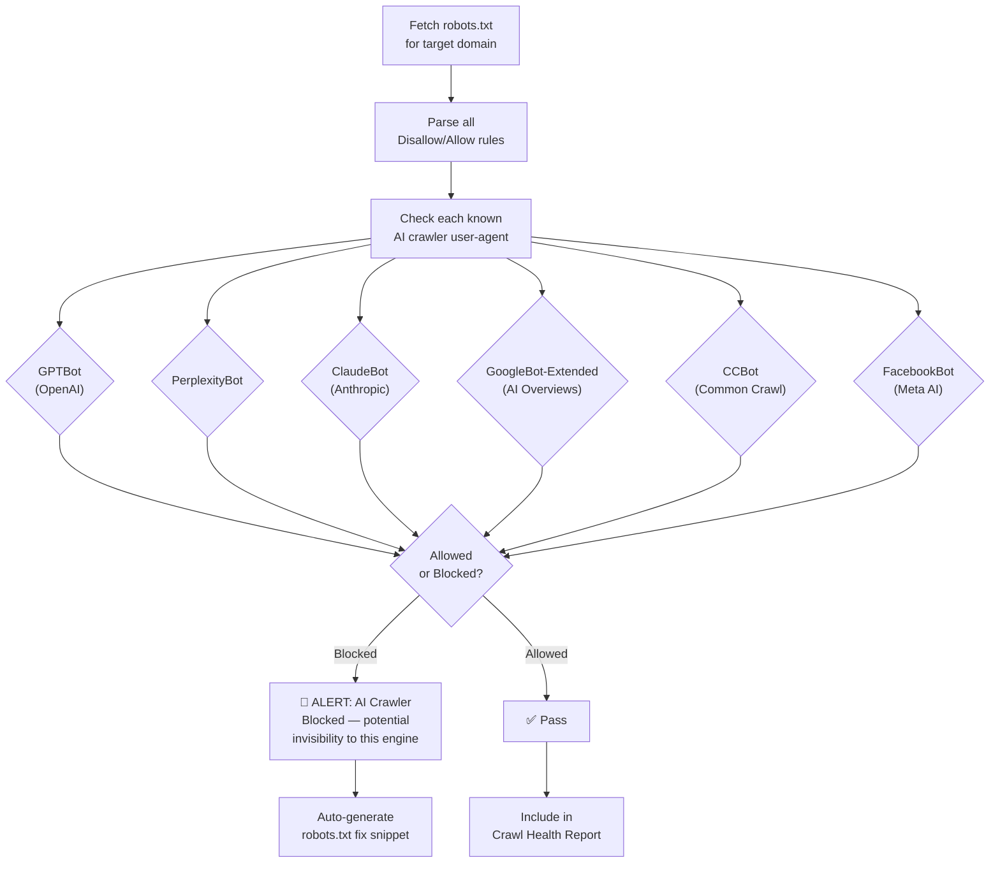
```mermaid
flowchart TD
    CRAWL["Fetch robots.txt\nfor target domain"] --> PARSE_R["Parse all\nDisallow/Allow rules"]

    PARSE_R --> CHECK["Check each known\nAI crawler user-agent"]

    CHECK --> UA1{"GPTBot\n(OpenAI)"}
    CHECK --> UA2{"PerplexityBot"}
    CHECK --> UA3{"ClaudeBot\n(Anthropic)"}
    CHECK --> UA4{"GoogleBot-Extended\n(AI Overviews)"}
    CHECK --> UA5{"CCBot\n(Common Crawl)"}
    CHECK --> UA6{"FacebookBot\n(Meta AI)"}

    UA1 & UA2 & UA3 & UA4 & UA5 & UA6 --> STATUS{"Allowed\nor Blocked?"}

    STATUS -->|Blocked| ALERT["🚨 ALERT: AI Crawler\nBlocked — potential\ninvisibility to this engine"]
    STATUS -->|Allowed| OK["✅ Pass"]

    ALERT --> REC["Auto-generate\nrobots.txt fix snippet"]
    OK --> REPORT["Include in\nCrawl Health Report"]
```

---

## 28. Metrics, Dashboards & KPIs

### Executive Dashboard

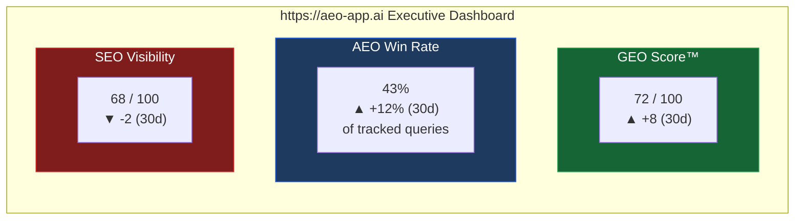
```mermaid
flowchart LR
    subgraph DASH["https://aeo-app.ai Executive Dashboard"]
        subgraph GEO_CARD["GEO Score™"]
            GS["72 / 100\n▲ +8 (30d)"]
        end
        subgraph AEO_CARD["AEO Win Rate"]
            AW["43%\n▲ +12% (30d)\nof tracked queries"]
        end
        subgraph SEO_CARD["SEO Visibility"]
            SV["68 / 100\n▼ -2 (30d)"]
        end
    end

    style GEO_CARD fill:#166534,stroke:#16a34a,color:#fff
    style AEO_CARD fill:#1e3a5f,stroke:#2563eb,color:#fff
    style SEO_CARD fill:#7f1d1d,stroke:#dc2626,color:#fff
```

### GEO Metrics

| Metric                       | Definition                                                           | Frequency |
| ---------------------------- | -------------------------------------------------------------------- | --------- |
| **GEO Visibility Score™**   | Composite 0–100 AI citation score                                    | Daily     |
| **Citation Rate**            | % of tracked queries where brand is cited by any AI engine           | Per crawl |
| **Per-Engine Citation Rate** | Citation rate broken down by Perplexity / ChatGPT / Gemini / Copilot | Per crawl |
| **Citation Position**        | Average ranked position of brand among all cited sources             | Per crawl |
| **AI Share of Voice**        | Brand citations / (Brand + top 3 competitors) citations              | Weekly    |
| **New Citation Gain**        | Queries newly citing brand this period                               | Weekly    |
| **Citation Loss**            | Queries that used to cite brand but no longer do                     | Weekly    |
| **Engine Coverage**          | Number of distinct AI engines that have cited brand at least once    | Monthly   |

### AEO Metrics

| Metric                           | Definition                                                   | Frequency |
| -------------------------------- | ------------------------------------------------------------ | --------- |
| **Featured Snippet Win Rate**    | % of tracked queries where brand owns the snippet            | Daily     |
| **PAA Presence Rate**            | % of tracked queries where brand appears in PAA box          | Daily     |
| **AI Overview Citation Rate**    | % of tracked queries where brand cited in Google AI Overview | Daily     |
| **Voice Rank (Position 1 Rate)** | % of voice-intent queries where brand answer is returned     | Weekly    |
| **Zero-Click Impact Score**      | Estimated impressions captured via answer positions          | Weekly    |
| **Rich Result Coverage**         | % of site content with valid rich result schema              | Weekly    |

### SEO Metrics

| Metric                       | Definition                                                      | Frequency |
| ---------------------------- | --------------------------------------------------------------- | --------- |
| **Visibility Score**         | Weighted rank score across all tracked keywords                 | Daily     |
| **Average Position**         | Mean organic position for tracked queries                       | Daily     |
| **Top 3 Rate**               | % of queries ranking positions 1–3                              | Daily     |
| **Crawl Health Score**       | Composite of Core Web Vitals + index coverage + redirect chains | Weekly    |
| **AI Crawler Access Score**  | % of AI crawlers explicitly allowed in robots.txt               | Weekly    |
| **Backlink Authority Score** | DR-equivalent composite from indexed link profile               | Weekly    |

### Trend Visualisations

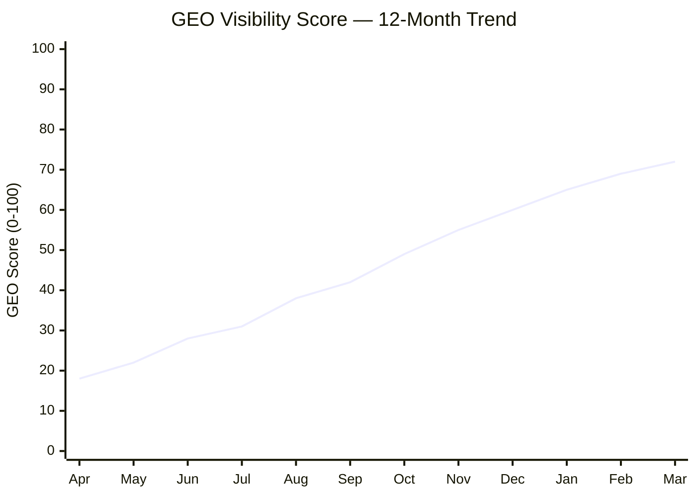
```mermaid
xychart-beta
    title "GEO Visibility Score — 12-Month Trend"
    x-axis ["Apr", "May", "Jun", "Jul", "Aug", "Sep", "Oct", "Nov", "Dec", "Jan", "Feb", "Mar"]
    y-axis "GEO Score (0-100)" 0 --> 100
    line [18, 22, 28, 31, 38, 42, 49, 55, 60, 65, 69, 72]
```

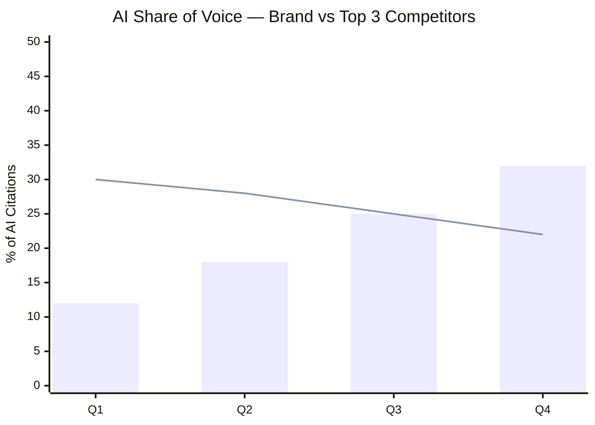
```mermaid
xychart-beta
    title "AI Share of Voice — Brand vs Top 3 Competitors"
    x-axis ["Q1", "Q2", "Q3", "Q4"]
    y-axis "% of AI Citations" 0 --> 50
    bar [12, 18, 25, 32]
    line [30, 28, 25, 22]
```

### Alerting & Notification Framework

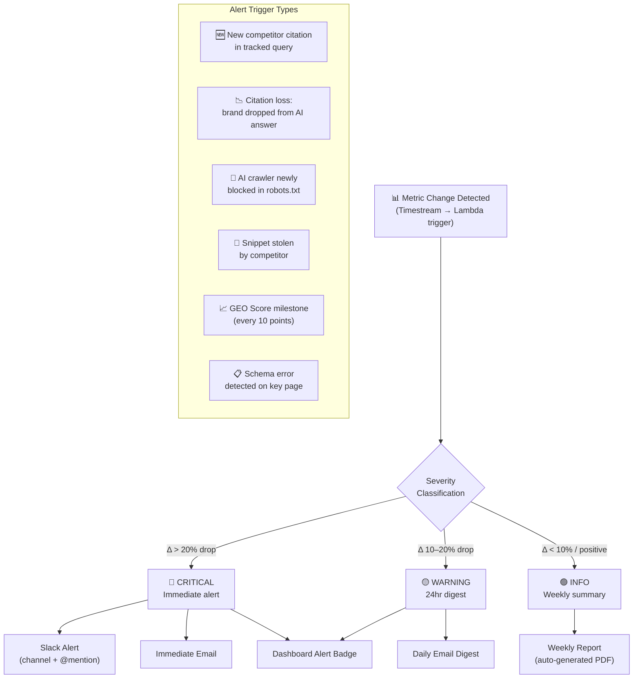
```mermaid
flowchart TD
    EVENT["📊 Metric Change Detected\n(Timestream → Lambda trigger)"] --> CLASSIFY{"Severity\nClassification"}

    CLASSIFY -->|Δ > 20% drop| CRITICAL["🔴 CRITICAL\nImmediate alert"]
    CLASSIFY -->|Δ 10–20% drop| WARN["🟡 WARNING\n24hr digest"]
    CLASSIFY -->|Δ < 10% / positive| INFO["🟢 INFO\nWeekly summary"]

    CRITICAL --> SLACK["Slack Alert\n(channel + @mention)"]
    CRITICAL --> EMAIL_NOW["Immediate Email"]
    CRITICAL --> DASH_BADGE["Dashboard Alert Badge"]

    WARN --> EMAIL_DIGEST["Daily Email Digest"]
    WARN --> DASH_BADGE

    INFO --> WEEKLY_REPORT["Weekly Report\n(auto-generated PDF)"]

    subgraph ALERT_TYPES["Alert Trigger Types"]
        AT1["🆕 New competitor citation\nin tracked query"]
        AT2["📉 Citation loss:\nbrand dropped from AI answer"]
        AT3["🚫 AI crawler newly\nblocked in robots.txt"]
        AT4["🎯 Snippet stolen\nby competitor"]
        AT5["📈 GEO Score milestone\n(every 10 points)"]
        AT6["📋 Schema error\ndetected on key page"]
    end
```

---

## 29. System Architecture (AWS Microservices)

### High-Level Architecture

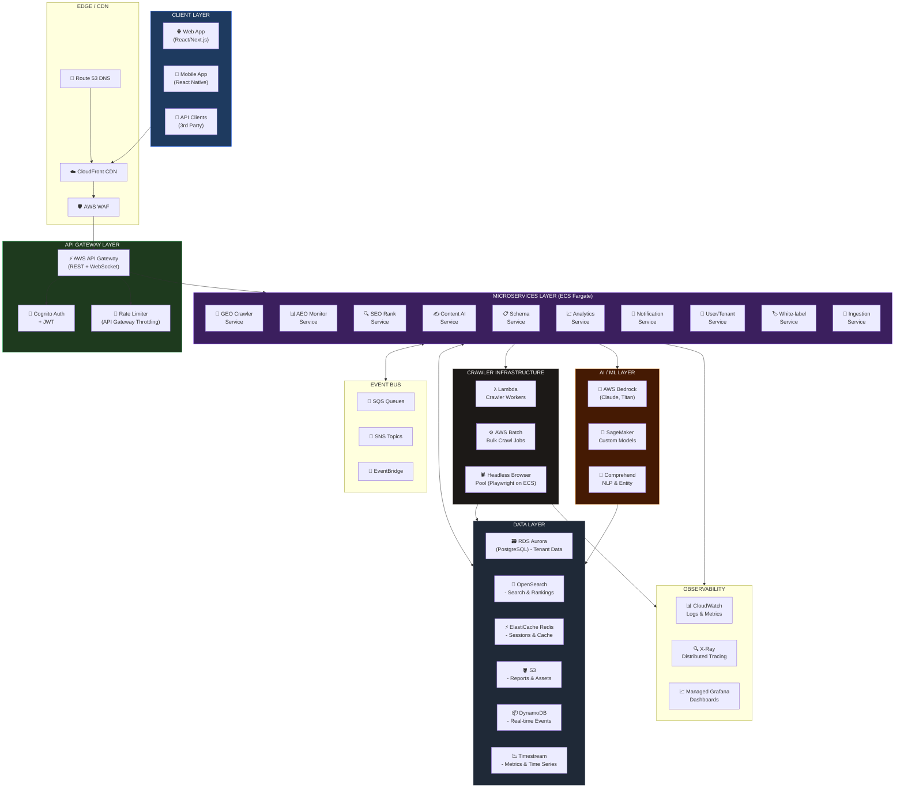
```mermaid
flowchart TB
    subgraph CLIENTS["CLIENT LAYER"]
        WEB["🌐 Web App\n(React/Next.js)"]
        MOB["📱 Mobile App\n(React Native)"]
        API_CLIENT["🔌 API Clients\n(3rd Party)"]
    end

    subgraph CDN["EDGE / CDN"]
        CF["☁️ CloudFront CDN"]
        WAF["🛡️ AWS WAF"]
        R53["🔗 Route 53 DNS"]
    end

    subgraph GATEWAY["API GATEWAY LAYER"]
        APIGW["⚡ AWS API Gateway\n(REST + WebSocket)"]
        AUTH["🔐 Cognito Auth\n+ JWT"]
        RATELIMIT["🚦 Rate Limiter\n(API Gateway Throttling)"]
    end

    subgraph SERVICES["MICROSERVICES LAYER (ECS Fargate)"]
        direction TB
        SVC1["🤖 GEO Crawler\nService"]
        SVC2["📊 AEO Monitor\nService"]
        SVC3["🔍 SEO Rank\nService"]
        SVC4["✍️ Content AI\nService"]
        SVC5["📋 Schema\nService"]
        SVC6["📈 Analytics\nService"]
        SVC7["📧 Notification\nService"]
        SVC8["👥 User/Tenant\nService"]
        SVC9["🏷️ White-label\nService"]
        SVC10["🔄 Ingestion\nService"]
    end

    subgraph MESSAGING["EVENT BUS"]
        SQS["📨 SQS Queues"]
        SNS["📢 SNS Topics"]
        EB["🚌 EventBridge"]
    end

    subgraph DATA["DATA LAYER"]
        RDS["🗃️ RDS Aurora\n(PostgreSQL) - Tenant Data"]
        ELASTIC["🔎 OpenSearch\n- Search & Rankings"]
        REDIS["⚡ ElastiCache Redis\n- Sessions & Cache"]
        S3["🪣 S3\n- Reports & Assets"]
        DYNAMO["📦 DynamoDB\n- Real-time Events"]
        TIMESTREAM["📉 Timestream\n- Metrics & Time Series"]
    end

    subgraph CRAWLERS["CRAWLER INFRASTRUCTURE"]
        LAMBDA_CRAWL["λ Lambda\nCrawler Workers"]
        BATCH["⚙️ AWS Batch\nBulk Crawl Jobs"]
        SCRAPER["🕷️ Headless Browser\nPool (Playwright on ECS)"]
    end

    subgraph AI["AI / ML LAYER"]
        BEDROCK["🧠 AWS Bedrock\n(Claude, Titan)"]
        SAGEMAKER["🔬 SageMaker\nCustom Models"]
        COMPREHEND["📝 Comprehend\nNLP & Entity"]
    end

    subgraph OBS["OBSERVABILITY"]
        CW["📊 CloudWatch\nLogs & Metrics"]
        XRAY["🔍 X-Ray\nDistributed Tracing"]
        GRAFANA["📈 Managed Grafana\nDashboards"]
    end

    CLIENTS --> CF
    CF --> WAF --> APIGW
    R53 --> CF
    APIGW --> AUTH
    APIGW --> RATELIMIT
    APIGW --> SERVICES

    SERVICES <--> MESSAGING
    SERVICES <--> DATA
    SERVICES --> CRAWLERS
    SERVICES --> AI

    CRAWLERS --> DATA
    AI --> DATA

    SERVICES --> OBS
    CRAWLERS --> OBS

    style CLIENTS fill:#1e3a5f,stroke:#2563eb,color:#fff
    style GATEWAY fill:#1e3a1e,stroke:#16a34a,color:#fff
    style SERVICES fill:#3b1f5e,stroke:#7c3aed,color:#fff
    style DATA fill:#1f2937,stroke:#6b7280,color:#fff
    style AI fill:#451a03,stroke:#d97706,color:#fff
    style CRAWLERS fill:#1c1917,stroke:#78716c,color:#fff
```

### Microservice Detail

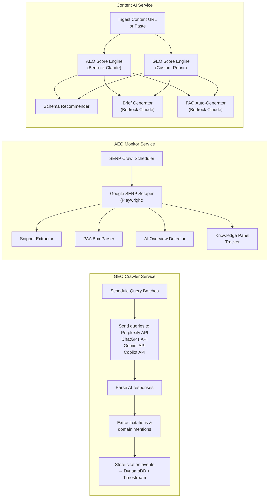
```mermaid
flowchart LR
    subgraph GEO_SVC["GEO Crawler Service"]
        direction TB
        GS1["Schedule Query Batches"]
        GS2["Send queries to:\nPerplexity API\nChatGPT API\nGemini API\nCopilot API"]
        GS3["Parse AI responses"]
        GS4["Extract citations &\ndomain mentions"]
        GS5["Store citation events\n→ DynamoDB + Timestream"]
        GS1 --> GS2 --> GS3 --> GS4 --> GS5
    end

    subgraph AEO_SVC["AEO Monitor Service"]
        direction TB
        AS1["SERP Crawl Scheduler"]
        AS2["Google SERP Scraper\n(Playwright)"]
        AS3["Snippet Extractor"]
        AS4["PAA Box Parser"]
        AS5["AI Overview Detector"]
        AS6["Knowledge Panel\nTracker"]
        AS1 --> AS2 --> AS3 & AS4 & AS5 & AS6
    end

    subgraph CONTENT_SVC["Content AI Service"]
        direction TB
        CS1["Ingest Content URL\nor Paste"]
        CS2["AEO Score Engine\n(Bedrock Claude)"]
        CS3["GEO Score Engine\n(Custom Rubric)"]
        CS4["Schema Recommender"]
        CS5["Brief Generator\n(Bedrock Claude)"]
        CS6["FAQ Auto-Generator\n(Bedrock Claude)"]
        CS1 --> CS2 & CS3
        CS2 & CS3 --> CS4 & CS5 & CS6
    end
```

### Deployment Architecture

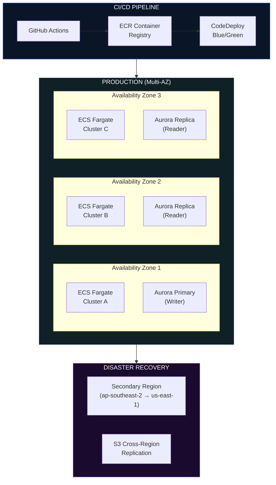
```mermaid
flowchart TB
    subgraph PROD["PRODUCTION (Multi-AZ)"]
        subgraph AZ1["Availability Zone 1"]
            ECS1["ECS Fargate\nCluster A"]
            RDS1["Aurora Primary\n(Writer)"]
        end
        subgraph AZ2["Availability Zone 2"]
            ECS2["ECS Fargate\nCluster B"]
            RDS2["Aurora Replica\n(Reader)"]
        end
        subgraph AZ3["Availability Zone 3"]
            ECS3["ECS Fargate\nCluster C"]
            RDS3["Aurora Replica\n(Reader)"]
        end
    end

    subgraph DR["DISASTER RECOVERY"]
        DR_REGION["Secondary Region\n(ap-southeast-2 → us-east-1)"]
        S3_REPL["S3 Cross-Region\nReplication"]
    end

    subgraph CICD["CI/CD PIPELINE"]
        GH["GitHub Actions"]
        ECR["ECR Container\nRegistry"]
        CODEDEPLOY["CodeDeploy\nBlue/Green"]
        GH --> ECR --> CODEDEPLOY
    end

    PROD --> DR
    CICD --> PROD

    style PROD fill:#0f2027,stroke:#203a43,color:#fff
    style DR fill:#1a0a2e,stroke:#6d28d9,color:#fff
    style CICD fill:#0a1628,stroke:#1d4ed8,color:#fff
```

### Multi-Tenancy Architecture

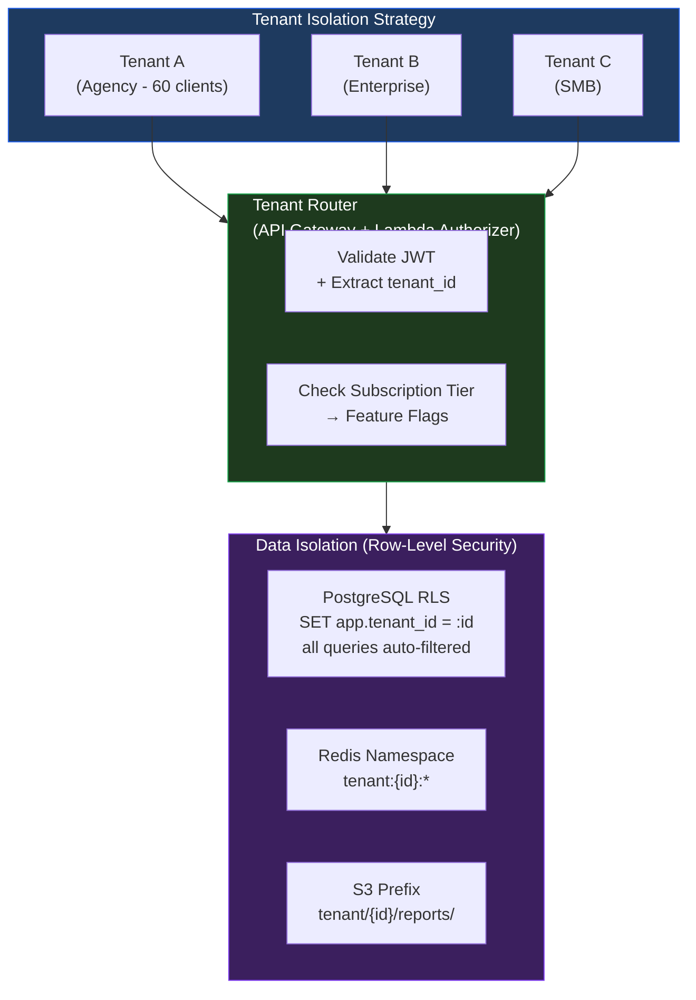
```mermaid
flowchart TD
    subgraph TENANT["Tenant Isolation Strategy"]
        T1["Tenant A\n(Agency - 60 clients)"]
        T2["Tenant B\n(Enterprise)"]
        T3["Tenant C\n(SMB)"]
    end

    subgraph ROUTER["Tenant Router\n(API Gateway + Lambda Authorizer)"]
        JWT_CHECK["Validate JWT\n+ Extract tenant_id"]
        TIER_CHECK["Check Subscription Tier\n→ Feature Flags"]
    end

    subgraph ISOLATION["Data Isolation (Row-Level Security)"]
        SCHEMA["PostgreSQL RLS\nSET app.tenant_id = :id\nall queries auto-filtered"]
        REDIS_NS["Redis Namespace\ntenant:{id}:*"]
        S3_PREFIX["S3 Prefix\ntenant/{id}/reports/"]
    end

    T1 & T2 & T3 --> ROUTER
    ROUTER --> ISOLATION

    style TENANT fill:#1e3a5f,stroke:#2563eb,color:#fff
    style ROUTER fill:#1e3a1e,stroke:#16a34a,color:#fff
    style ISOLATION fill:#3b1f5e,stroke:#7c3aed,color:#fff
```

---

## 30. Data Architecture & Flows

### GEO Tracking Data Flow

```mermaid
sequenceDiagram
    participant SCHED as ⏰ Scheduler<br>(EventBridge)
    participant QUEUE as 📨 SQS Queue<br>(geo-crawl-jobs)
    participant WORKER as 🤖 GEO Worker<br>(Lambda / ECS)
    participant AI_API as 🧠 AI Engine<br>(Perplexity/ChatGPT)
    participant PARSER as 🔍 Citation Parser
    participant DYNAMO as 📦 DynamoDB<br>(Events)
    participant TSDB as 📉 Timestream<br>(Metrics)
    participant NOTIF as 📧 Notification<br>Service
    participant DASH as 📊 Dashboard

    SCHED->>QUEUE: Enqueue target queries<br>(every 6 hours per account)
    QUEUE->>WORKER: Dequeue batch (max 10 queries)
    WORKER->>AI_API: Send query + capture response
    AI_API-->>WORKER: AI-generated answer with citations
    WORKER->>PARSER: Extract citations, domains, brand mentions
    PARSER->>DYNAMO: Store citation event record
    PARSER->>TSDB: Write time-series metric<br>(cited: 1/0, position: N)
    TSDB->>NOTIF: Trigger if new citation OR loss detected
    NOTIF->>DASH: Push real-time WebSocket update
    NOTIF-->>SCHED: Email/Slack alert to user
```

### Content Optimisation Flow

```mermaid
sequenceDiagram
    participant USER as 👤 User
    participant API as ⚡ API Gateway
    participant CONTENT as ✍️ Content Service
    participant BEDROCK as 🧠 AWS Bedrock<br>(Claude)
    participant SCHEMA as 📋 Schema Service
    participant SCORE as 📊 Scoring Engine
    participant DB as 🗃️ Aurora DB

    USER->>API: Submit URL or paste content
    API->>CONTENT: Forward content request
    CONTENT->>CONTENT: Scrape + clean content
    CONTENT->>SCORE: Run AEO + GEO scoring rubric
    SCORE-->>CONTENT: Raw scores per dimension
    CONTENT->>BEDROCK: "Analyse this content for AI optimisation\ngaps with specific recommendations"
    BEDROCK-->>CONTENT: Structured improvement suggestions
    CONTENT->>SCHEMA: Check existing schema markup
    SCHEMA-->>CONTENT: Schema gaps + auto-generated JSON-LD
    CONTENT->>DB: Save analysis result
    CONTENT-->>USER: Full report: scores, gaps, recommendations, schema
```

### Core Data Schema (ERD)

```mermaid
erDiagram
    TENANT {
        uuid id PK
        string name
        string plan_tier
        string subdomain
        jsonb brand_config
        timestamp created_at
    }

    PROJECT {
        uuid id PK
        uuid tenant_id FK
        string name
        string domain
        string[] target_locales
        jsonb settings
    }

    QUERY {
        uuid id PK
        uuid project_id FK
        string query_text
        string intent_type
        string[] target_engines
        string priority
        bool is_active
    }

    CITATION_EVENT {
        uuid id PK
        uuid query_id FK
        string engine
        bool brand_cited
        int citation_position
        string[] all_cited_domains
        text ai_response_snippet
        timestamp captured_at
    }

    SERP_SNAPSHOT {
        uuid id PK
        uuid query_id FK
        bool has_featured_snippet
        bool has_ai_overview
        bool has_paa
        bool brand_in_snippet
        int organic_rank
        text snippet_text
        timestamp captured_at
    }

    CONTENT_AUDIT {
        uuid id PK
        uuid project_id FK
        string url
        float aeo_score
        float geo_score
        float seo_score
        jsonb recommendations
        jsonb schema_gaps
        timestamp audited_at
    }

    TENANT ||--o{ PROJECT : "owns"
    PROJECT ||--o{ QUERY : "tracks"
    QUERY ||--o{ CITATION_EVENT : "generates"
    QUERY ||--o{ SERP_SNAPSHOT : "generates"
    PROJECT ||--o{ CONTENT_AUDIT : "contains"
```

---

## 31. Security & Compliance

```mermaid
flowchart TD
    subgraph PERIMETER["Perimeter Security"]
        WAF["AWS WAF\n- OWASP Top 10 rules\n- Rate limiting\n- Bot management"]
        SHIELD["AWS Shield Advanced\nDDoS Protection"]
        CF_SEC["CloudFront\nGeo-blocking if required"]
    end

    subgraph APP_SEC["Application Security"]
        COGNITO["Cognito\nMFA enforced for all users"]
        JWT["JWT Tokens\n15min access / 7d refresh"]
        RBAC["Role-Based Access Control\nOwner / Admin / Analyst / Viewer"]
        SECRETS["Secrets Manager\nAll API keys + DB credentials"]
    end

    subgraph DATA_SEC["Data Security"]
        ENCRYPT_TRANSIT["TLS 1.3\nAll in-transit data"]
        ENCRYPT_REST["AES-256\nAll at-rest (RDS, S3, DynamoDB)"]
        RLS["PostgreSQL RLS\nRow-level tenant isolation"]
        AUDIT_LOG["CloudTrail\nAll API + data access logged"]
    end

    subgraph COMPLIANCE["Compliance"]
        GDPR["GDPR\nData residency controls\nRight to erasure API"]
        SOC2["SOC2 Type II\n(Target: Year 2)"]
        PRIVACY["Privacy by Design\nNo PII in crawler payloads"]
    end

    PERIMETER --> APP_SEC --> DATA_SEC --> COMPLIANCE
```

---

## 32. Infrastructure & Scalability

### Auto-Scaling Strategy

```mermaid
flowchart TB
    subgraph LOAD["Load Patterns"]
        L1["Steady State\n~100 req/sec"]
        L2["Peak: Report Generation\n~500 req/sec"]
        L3["Crawl Burst\n~10,000 queries/hour"]
    end

    subgraph SCALE["Scaling Mechanisms"]
        ECS_SCALE["ECS Fargate Auto-scaling\nTarget tracking: CPU 60%\nMin: 2, Max: 50 tasks"]
        LAMBDA_SCALE["Lambda Concurrency\nReserved: 500\nCrawl workers: on-demand burst"]
        RDS_SCALE["Aurora Serverless v2\nACU: 0.5–128\nAuto-pause in dev"]
        CACHE_SCALE["ElastiCache\nCluster mode\n3 shards × 2 replicas"]
    end

    L1 --> ECS_SCALE
    L2 --> ECS_SCALE & RDS_SCALE
    L3 --> LAMBDA_SCALE & CACHE_SCALE

    style LOAD fill:#1e3a5f,stroke:#2563eb,color:#fff
    style SCALE fill:#1e3a1e,stroke:#16a34a,color:#fff
```

### Infrastructure Cost Model (Monthly — 1,000 Tenants)

| Component                | Service              | Est. Monthly Cost |
| ------------------------ | -------------------- | ----------------- |
| Compute (services)       | ECS Fargate          | $1,200            |
| Compute (crawlers)       | Lambda + ECS Batch   | $800              |
| Database                 | Aurora Serverless v2 | $600              |
| Cache                    | ElastiCache Redis    | $300              |
| Search                   | OpenSearch           | $400              |
| Time-series DB           | Timestream           | $200              |
| Storage                  | S3 + DynamoDB        | $150              |
| CDN                      | CloudFront           | $100              |
| AI/ML                    | Bedrock API calls    | $1,500            |
| Monitoring               | CloudWatch + Grafana | $200              |
| **Total Infrastructure** |                      | **~$5,450/mo**    |
| **Cost per tenant**      |                      | **~$5.45/mo**     |

At $299/month average plan, infrastructure is ~1.8% of revenue. Gross margin target: **>80%.**

---

## 33. Integrations

```mermaid
flowchart LR
    subgraph https://aeo-app.ai["https://aeo-app.ai Core"]
        INT_HUB["Integration Hub\n(ECS Fargate)"]
        WEBHOOK["Webhook Engine"]
        OAUTH["OAuth 2.0\nManager"]
    end

    subgraph DATA_IN["Data-In Integrations"]
        GSC["Google Search Console\nAPI — rank + impression data"]
        GA4["Google Analytics 4\nTraffic + conversion data"]
        GADS["Google Ads\nPaid keyword context"]
        SEMrush["Semrush API\nBacklink + keyword fallback"]
    end

    subgraph NOTIFY["Notification Integrations"]
        SLACK_INT["Slack\nAlert channels"]
        TEAMS["Microsoft Teams\nAlert channels"]
        EMAIL_INT["SendGrid\nTransactional email"]
        PAGERDUTY["PagerDuty\nCritical alerts"]
    end

    subgraph CMS["CMS Integrations"]
        WP["WordPress Plugin\nSchema injection + score widget"]
        WEBFLOW["Webflow\nSchema embed via script"]
        CONTENTFUL["Contentful\nContent audit webhook"]
        SHOPIFY["Shopify\nProduct schema audit"]
    end

    subgraph EXPORT["Export / BI"]
        SHEETS["Google Sheets\nAuto-export reports"]
        DATASTUDIO["Looker Studio\nLive connector"]
        BIGQUERY["BigQuery\nData warehouse export"]
        ZAPIER["Zapier / Make\nWorkflow automation"]
    end

    INT_HUB --> DATA_IN
    INT_HUB --> NOTIFY
    INT_HUB --> CMS
    INT_HUB --> EXPORT
    OAUTH --> DATA_IN
    WEBHOOK --> NOTIFY & EXPORT
```

---

## 34. Pricing & Packaging

```mermaid
flowchart LR
    subgraph STARTER["🌱 Starter — $99/mo"]
        S1["1 domain"]
        S2["50 tracked queries"]
        S3["3 AI engines monitored"]
        S4["Weekly crawl frequency"]
        S5["Basic AEO + GEO dashboard"]
        S6["Email alerts"]
    end

    subgraph GROWTH["🚀 Growth — $299/mo"]
        G1["5 domains"]
        G2["250 tracked queries"]
        G3["All AI engines"]
        G4["Daily crawl frequency"]
        G5["Full AEO + GEO + SEO suite"]
        G6["Content Optimiser (20 audits/mo)"]
        G7["Schema Builder"]
        G8["Slack + Email alerts"]
    end

    subgraph AGENCY["🏢 Agency — $799/mo"]
        A1["25 domains (client accounts)"]
        A2["1,000 tracked queries"]
        A3["All engines + voice"]
        A4["6-hour crawl frequency"]
        A5["White-label client reports"]
        A6["Unlimited content audits"]
        A7["Competitor tracking (3 per domain)"]
        A8["API access"]
        A9["Priority support"]
    end

    subgraph ENTERPRISE["🏛️ Enterprise — Custom"]
        E1["Unlimited domains"]
        E2["Unlimited queries"]
        E3["1-hour crawl frequency"]
        E4["Custom brand entity setup"]
        E5["Dedicated CSM"]
        E6["SLA 99.9%"]
        E7["SSO / SAML"]
        E8["Custom integrations"]
        E9["Data residency options"]
    end

    style STARTER fill:#1f2937,stroke:#4b5563,color:#fff
    style GROWTH fill:#1e3a5f,stroke:#2563eb,color:#fff
    style AGENCY fill:#3b1f5e,stroke:#7c3aed,color:#fff
    style ENTERPRISE fill:#451a03,stroke:#d97706,color:#fff
```

---

## 35. Product Roadmap

```mermaid
gantt
    title https://aeo-app.ai Product Roadmap
    dateFormat  YYYY-MM
    section Phase 1 — MVP (Q2 2026)
    GEO Tracker (core)           :active, geo1, 2026-04, 2026-06
    AEO Monitor (snippets + PAA) :active, aeo1, 2026-04, 2026-06
    SEO Rank Tracker             :seo1, 2026-04, 2026-06
    Basic Dashboard              :dash1, 2026-05, 2026-06
    Multi-tenant Auth            :auth1, 2026-04, 2026-05

    section Phase 2 — Growth (Q3 2026)
    Content Optimiser            :cont1, 2026-07, 2026-08
    Schema Builder               :sch1, 2026-07, 2026-08
    AI Crawler Audit Tool        :craw1, 2026-07, 2026-08
    White-label Reports          :rep1, 2026-08, 2026-09
    Slack + Email Alerts         :alert1, 2026-07, 2026-07

    section Phase 3 — Scale (Q4 2026)
    Voice Search Tracking        :voice1, 2026-10, 2026-11
    Competitor AI Share          :comp1, 2026-10, 2026-11
    GSC + GA4 Integration        :gsc1, 2026-10, 2026-11
    Agency Multi-client Hub      :ag1, 2026-11, 2026-12
    WordPress Plugin             :wp1, 2026-11, 2026-12

    section Phase 4 — Enterprise (Q1 2027)
    Enterprise SSO/SAML          :sso1, 2027-01, 2027-02
    BigQuery Export              :bq1, 2027-01, 2027-02
    Custom GEO Rubric Builder    :rubric1, 2027-02, 2027-03
    Agentic Search Monitoring    :agent1, 2027-02, 2027-03
    Multimodal Tracking (Video)  :multi1, 2027-03, 2027-03
```

---

## 36. Risks & Mitigations

| Risk                                        | Likelihood | Impact | Mitigation                                                                                               |
| ------------------------------------------- | ---------- | ------ | -------------------------------------------------------------------------------------------------------- |
| LLM changes citation behaviour              | Medium     | High   | Multi-engine redundancy; monitor model update announcements                                              |
| AI API rate limits / cost increase          | High       | Medium | Build caching layer; negotiate enterprise contracts; own crawl layer where possible                      |
| Google blocks SERP scraping                 | Medium     | High   | Use official Search Console API where possible; maintain headless browser fallback; legal counsel review |
| Competitor (Semrush, Ahrefs) copies feature | High       | Medium | IP moat via proprietary GEO Score™ methodology; brand + customer lock-in                                |
| Privacy regulation (GDPR AI)                | Low-Medium | Medium | Privacy by design from day one; DPA + data residency options                                             |
| AWS Outage                                  | Low        | High   | Multi-AZ + cross-region DR; 99.9% SLA with 30-min RPO target                                             |

---

## 37. Acceptance Criteria

### Phase 1 MVP Go/No-Go Criteria

```mermaid
flowchart TD
    subgraph MUST["🔴 Must-Have (P0 — MVP blockers)"]
        M1["✅ GEO Tracker queries Perplexity + ChatGPT\nwith < 2hr data freshness"]
        M2["✅ AEO Monitor detects featured snippets\nand PAA with ≥ 90% accuracy vs manual check"]
        M3["✅ Multi-tenant isolation verified:\nno cross-tenant data leakage in pen test"]
        M4["✅ GEO Visibility Score™ computes\ncorrectly for 100 test queries"]
        M5["✅ Dashboard loads in < 2 seconds\nfor accounts with 250 queries"]
        M6["✅ Alert system delivers notifications\nwithin 5 minutes of trigger event"]
    end

    subgraph SHOULD["🟡 Should-Have (P1 — Target at launch)"]
        S1["Content Optimiser scoring\nwithin ±5 points of expert manual review"]
        S2["Schema Builder generates\nvalid JSON-LD passing Rich Results Test"]
        S3["White-label reports\nrender in < 10 seconds"]
        S4["GSC integration imports\ndata within 1 hour of auth"]
    end

    subgraph NICE["🟢 Nice-to-Have (P2 — Post-launch)"]
        N1["Voice search rank tracking"]
        N2["WordPress plugin 1-click install"]
        N3["Competitor AI share tracking"]
    end

    MUST --> LAUNCH["🚀 MVP Launch Decision"]
    SHOULD --> LAUNCH
```

### System Performance SLAs

| Metric                    | Target      | Critical Threshold |
| ------------------------- | ----------- | ------------------ |
| API Response Time (p50)   | < 200ms     | < 500ms            |
| API Response Time (p99)   | < 1,000ms   | < 2,000ms          |
| Dashboard Load Time       | < 2s        | < 4s               |
| GEO Crawl Freshness       | ≤ 6 hours   | ≤ 12 hours         |
| AEO SERP Freshness        | ≤ 24 hours  | ≤ 48 hours         |
| Platform Uptime           | 99.9%       | 99.5%              |
| Data Accuracy (vs manual) | ≥ 90%       | ≥ 80%              |
| Alert Delivery Time       | < 5 minutes | < 15 minutes       |

---

# Application

## Step 1: Set Up Your Project

When you first log in, you create a **project** for your website.

- Enter your domain (e.g. `mybusiness.com.au`)
- Type in the questions your customers ask — e.g. _"best CRM for small business"_, _"how to treat a burn at home"_. These are called **tracked queries**.
- Choose which AI engines to watch — Perplexity, ChatGPT, Google Gemini, Microsoft Copilot
- Set how often you want the platform to check — weekly, daily, or every 6 hours

---

## Step 2: Collect Business Intelligence

Once you collect the name and website of the business, the platform automatically gathers information relevant to SEO, GEO, and AEO optimization.

**Competitor Analysis** — identifies your main competitors in the space by analyzing who ranks for your tracked queries and who gets cited in AI answers.

**Top Search Terms Discovery** — finds the most searched questions and keywords in your domain using data from Google Trends, AnswerThePublic, and AI search patterns.

**Current Rankings Assessment** — checks your current SEO rankings, AEO wins (featured snippets, PAA), and GEO citations across all major AI engines for the identified terms.

This intelligence forms the baseline for your optimization strategy and helps prioritize which queries to focus on first.

---

## Step 3: Run Your First Audits

Before optimising anything, the platform checks what's broken or blocked right now.

**AI Crawler Audit** — checks your `robots.txt` file to see if you're accidentally blocking AI bots like ChatGPT's crawler or Google's AI crawler from reading your site. If they can't crawl you, they can't cite you.

**Technical SEO Audit** — checks your site speed, broken links, sitemap, and mobile performance. These are the foundations everything else sits on.

**Content Audit** — paste in a URL from your website. The platform reads the page and gives it an AEO score and a GEO score, telling you exactly what's missing.

---

## Step 4: Check Your Visibility

This is your ongoing monitoring — the platform runs automatically in the background.

**GEO Tracker** — for each of your tracked queries, it goes and asks ChatGPT, Perplexity, Gemini, and Copilot the question. It checks: _did they cite your website in the answer?_ It logs whether you were cited, what position you were in, and which engines cited you.

**AEO Manager** — checks Google Search for each query. Did you win the featured snippet (the box at the top)? Did you appear in the "People Also Ask" boxes? Did Google's AI Overview cite you?

**SEO Rank Tracker** — standard keyword ranking. Where do you appear in Google's organic results for each query?

**Voice Search Tracker** — for voice-style queries (e.g. _"what's the best way to..."_), checks whether your answer is the one a smart speaker would read out.

---

## Step 5: Read Your Scores

The platform turns all that monitoring into three simple numbers on your dashboard.

| Score                              | What it means                                                                |
| ---------------------------------- | ---------------------------------------------------------------------------- |
| **GEO Visibility Score™ (0–100)** | How often you're cited across all AI engines. 0 = invisible, 100 = dominant. |
| **AEO Win Rate**                   | % of tracked queries where you own the featured snippet or PAA box.          |
| **SEO Visibility Score**           | How well you rank organically across all tracked queries.                    |
| **Competitor AI Share**            | Of all AI citations for your queries, what % go to you vs competitors.       |

---

## Step 6: Fix and Optimise Your Content

Now you know the gaps — here's how you fix them.

**Content Optimiser** — paste in a page URL. It scores the page across 6 dimensions:

- Does it have a direct answer up front?
- Does it have schema markup?
- Does it cover all the sub-questions?
- Does it have stats and citations?

It tells you exactly what to fix and by how much.

**AI Brief Generator** — if you need to write a new page, this generates a full content brief structured specifically for AI citation — with suggested headings, questions to answer, stats to find, and FAQ questions to include.

**FAQ Auto-Generator** — pulls real "People Also Ask" questions from Google for your topic and turns them into a ready-to-publish FAQ section with suggested answers.

**Schema Builder** — auto-generates the invisible code (called schema markup) that tells Google and AI systems exactly what your content is. It produces the code and lets you test it instantly with Google's own testing tool. You then paste it into your website or CMS.

---

## Step 7: Act on Alerts

You don't need to log in every day. The platform watches for you and tells you when something important happens.

| Alert Level           | Triggers                                                                                  | Channel       |
| --------------------- | ----------------------------------------------------------------------------------------- | ------------- |
| 🔴 **Immediate**      | Competitor stole your snippet, you dropped from an AI answer, AI bot blocked on your site | Slack + Email |
| 🟡 **Daily Digest**   | Moderate changes worth knowing about                                                      | Email         |
| 🟢 **Weekly Summary** | General trends, wins, and progress                                                        | Email         |

---

## Step 8: Report to Clients or Management

Once you have data, you can share it.

**White-label Reports** — if you're an agency, generate branded PDF reports for each client showing their GEO Score, AEO wins, and SEO visibility. Your logo, not aeo-app.ai's.

**Executive Dashboard** — a single-screen view of all three scores with trend lines. Built for showing a CMO or CEO at a glance.

**Export options:**

- Google Sheets
- Looker Studio
- BigQuery
- API (for custom integrations)

---

## The Ongoing Loop

```mermaid
flowchart TD
    START(["👤 Log In"])

    subgraph S1["Step 1 — Set Up Project"]
        A1["Add your domain"]
        A2["Enter tracked queries"]
        A3["Choose AI engines to monitor\nPerplexity · ChatGPT · Gemini · Copilot"]
        A4["Set crawl frequency\nWeekly / Daily / 6-hourly / 1-hourly"]
        A1 --> A2 --> A3 --> A4
    end

    subgraph S2["Step 2 — Collect Business Intelligence"]
        B1["Competitor Analysis\nIdentify main competitors"]
        B2["Top Search Terms Discovery\nFind most searched questions"]
        B3["Current Rankings Assessment\nCheck SEO, AEO, GEO baselines"]
        B1 --> B2 --> B3
    end

    subgraph S3["Step 3 — Run Initial Audits"]
        B1["AI Crawler Audit\nCan AI bots read your site?"]
        B2["Technical SEO Audit\nSpeed · Sitemap · Broken links"]
        B3["Content Audit\nPaste URL — get AEO + GEO score"]
        B1 --> B2 --> B3
    end

    subgraph S3["Step 3 — Run Initial Audits"]
        C1["AI Crawler Audit\nCan AI bots read your site?"]
        C2["Technical SEO Audit\nSpeed · Sitemap · Broken links"]
        C3["Content Audit\nPaste URL — get AEO + GEO score"]
        C1 --> C2 --> C3
    end

    subgraph S4["Step 4 — Monitor Visibility"]
        C1["GEO Tracker\nAre AI engines citing you?"]
        C2["AEO Manager\nDo you own snippets and PAA boxes?"]
        C3["SEO Rank Tracker\nWhere do you rank organically?"]
        C4["Voice Search Tracker\nAre you the spoken answer?"]
        C1 --> C2 --> C3 --> C4
    end

    subgraph S4["Step 4 — Monitor Visibility"]
        D1["GEO Tracker\nAre AI engines citing you?"]
        D2["AEO Manager\nDo you own snippets and PAA boxes?"]
        D3["SEO Rank Tracker\nWhere do you rank organically?"]
        D4["Voice Search Tracker\nAre you the spoken answer?"]
        D1 --> D2 --> D3 --> D4
    end

    subgraph S5["Step 5 — Review Your Scores"]
        D1["GEO Visibility Score 0–100\nHow often AI engines cite you"]
        D2["AEO Win Rate %\nSnippet and PAA box wins"]
        D3["SEO Visibility Score\nOrganic ranking health"]
        D4["Competitor AI Share\nYour citations vs competitors"]
        D1 --> D2 --> D3 --> D4
    end

    subgraph S5["Step 5 — Review Your Scores"]
        E1["GEO Visibility Score 0–100\nHow often AI engines cite you"]
        E2["AEO Win Rate %\nSnippet and PAA box wins"]
        E3["SEO Visibility Score\nOrganic ranking health"]
        E4["Competitor AI Share\nYour citations vs competitors"]
        E1 --> E2 --> E3 --> E4
    end

    subgraph S6["Step 6 — Optimise Content"]
        E1["Content Optimiser\nScore a page and see gaps"]
        E2["AI Brief Generator\nGenerate answer-first content brief"]
        E3["FAQ Auto-Generator\nBuild Q&As from PAA data"]
        E4["Schema Builder\nGenerate and test JSON-LD markup"]
        E1 --> E2
        E1 --> E3
        E1 --> E4
    end

    subgraph S6["Step 6 — Optimise Content"]
        F1["Content Optimiser\nScore a page and see gaps"]
        F2["AI Brief Generator\nGenerate answer-first content brief"]
        F3["FAQ Auto-Generator\nBuild Q&As from PAA data"]
        F4["Schema Builder\nGenerate and test JSON-LD markup"]
        F1 --> F2
        F1 --> F3
        F1 --> F4
    end

    subgraph S7["Step 7 — Act on Alerts"]
        F1{"What kind\nof alert?"}
        F2["🔴 Immediate Alert\nSlack + Email\nCitation lost · Snippet stolen\nCrawler blocked"]
        F3["🟡 Daily Digest\nEmail\nModerate changes"]
        F4["🟢 Weekly Summary\nEmail\nPositive trends and wins"]
        F1 -->|Critical| F2
        F1 -->|Moderate| F3
        F1 -->|Positive| F4
    end

    subgraph S7["Step 7 — Act on Alerts"]
        G1{"What kind\nof alert?"}
        G2["🔴 Immediate Alert\nSlack + Email\nCitation lost · Snippet stolen\nCrawler blocked"]
        G3["🟡 Daily Digest\nEmail\nModerate changes"]
        G4["🟢 Weekly Summary\nEmail\nPositive trends and wins"]
        G1 -->|Critical| G2
        G1 -->|Moderate| G3
        G1 -->|Positive| G4
    end

    subgraph S8["Step 8 — Report"]
        G1["White-label Client Reports\nBranded PDFs for each client"]
        G2["Executive Dashboard\nGEO + AEO + SEO scores at a glance"]
        G3["Export Data\nSheets · Looker Studio · BigQuery · API"]
        G1 --> G2 --> G3
    end

    LOOP(["🔁 Repeat — Monitor and Optimise"])

    START --> S1
    S1 --> S2
    S2 --> S3
    S3 --> S4
    S4 --> S5
    S5 --> S6
    S6 --> S7
    S7 --> LOOP
    LOOP --> S3
```

The platform runs the monitoring automatically. Your job is to act on what it surfaces.
