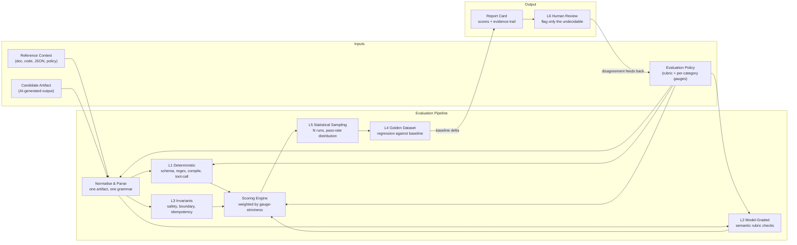

+++
date = '2026-09-16T12:01:00+10:00'
draft = true
title = 'AI Artifact Report Cards: Grading What AI Builds'
tags = ['AI', 'Evals', 'Evaluation', 'Reporting', 'Rubric', 'LLM', 'Product']
summary = 'A high-level vision for a portal that grades AI-generated artifacts against reference context using configurable evaluation policies, and emits a report card with per-category scores and a thin human-review loop.'
+++

## The Problem

AI generates artifacts continuously: code, configuration, documentation, schemas, reports, skills. Every artifact shows up ungraded. Nothing tells you whether the build is correct until a human opens it and reads it. And the moment you need a human to read everything, the AI stops being a multiplier.

The failure modes have a pattern:

- The artifact is plausibly correct but subtly wrong (wrong status code, typo'd field name, config that passes schema but breaks at runtime)
- The artifact is structurally fine but misses a requirement that only exists in a design document nobody pointed the AI at
- The artifact is correct but built the wrong way (security posture you can't accept, but the code "works")

Detecting each of those requires a different kind of check, at a different strictness, on a different source of truth.

## The Idea in One Line

A portal that takes an AI-generated artifact, a reference context that defines what correct means, and an evaluation policy that says how carefully to check — then emits a **report card**: per-category rubric scores, an evidence trail for every check, and a review queue that only surfaces the cases a machine cannot decide.

## Principles

Five principles shape the design. They are the context for the problem and the solution: human review of everything does not scale, so the load must be distributed exactly where the cost is justified.

1. **Cheap checks first, judge only what needs judgment** — every run is graded through the six-layer evaluation pyramid, which distributes the load exactly where the cost is justified (the full source is in the [reference appendix](#reference-appendix)):
   - **L1 — deterministic & structural**: schema, regex, compile and tool-call checks expressed as plain code. The wide base of the pyramid, catching the 60-80% of failures expressible as code, with no LLM call and no human glance
   - **L2 — model-graded**: an LLM judge scoring only what needs semantics — rubric, faithfulness, relevance — calibrated against human labels
   - **L3 — invariants**: hard guardrails that must hold no matter what path the output took, such as "never a destructive tool call" and "no writes outside the working directory"
   - **L4 — golden dataset**: curated real cases scored against a saved baseline; a drop below baseline flags a regression before anything merges
   - **L5 — statistical sampling**: N runs per case at temperature above 0, reporting pass-rate and variance instead of a single number
   - **L6 — human review**: the narrow tip, humans adjudicating only flagged and low-confidence cases, with disagreements feeding back into the rubric
2. **Strictness is a dial, tuned per category** — there is no single global bar; each category in a policy carries its own gauge, and the gauge decides both which checks run and the bar to pass. Security at strict runs the full PII and banned-pattern sweep and fails on any violation; formatting at lenient runs little more than a parse check and fails only on gross problems. So the same artifact can earn a different verdict under a security-strict policy than under a prototype-quick one — deliberately, because one artifact class can absorb more risk than another
3. **Reference context is first-class, and optional per check** — comparative grading against a spec when a check declares a dependency on one, standalone scoring when it doesn't
4. **Every score carries its evidence** — the report card is a per-category breakdown and a blended score, each score linked to the check that produced it, so a human never re-reads the artifact to adjudicate, only the failing check
5. **The human is the arbiter of the edges** — review is scoped to flagged and low-confidence cases, and disagreements feed straight back into the rubric

The human stops being a reviewer of everything and becomes an **arbiter of the edges**: the cases the machine knows it cannot decide.

## The Workflow

The workflow is the five principles above, realised as a pipeline. Here is the whole system at a glance:

The pipeline consumes three inputs, and their shape is the first thing the workflow must handle. Two are object types the portal must understand. The third is the ruleset that drives the score.

## Evaluation Pyramid

The report card's scores are built on the six-layer evaluation pyramid from the [reference appendix](#reference-appendix), and every layer maps to a box in the diagram above. Each layer gets a layer-by-layer deep dive in a dedicated post.

## Workflow Components

### 1. Reference Context

The source of truth the artifact is judged against. There are many shapes:

| Type | Examples | What it enables |
| ---- | -------- | --------------- |
| Documents | Design docs, requirements, ADRs, markdown specs | Roundtrip-fidelity and requirement-coverage checks, via the pattern in the [evals roundtrip post](../ai/evals/) |
| Code | Existing codebase, reference implementations | Signature matching, API-conformance, style-and-pattern norms |
| JSON / Schemas | JSON Schema, OpenAPI, Swagger, typed configs | Structural validation, field presence, type and enum conformance |
| Config / Infra | YAML, Terraform, docker, CI configs | Deterministic parse-and-verify against known-good defaults |
| Policies | Security policies, PII rules, compliance lists | Invariant checks: watcher lists, banned patterns, mandatory fields |

Reference context is optional per check. Some criteria grade standalone (formatting, security posture) and need no reference at all. Some criteria are comparative (does the artifact match the spec) and are meaningless without one.

Examples of **mandatory** reference context (comparative checks that need a source of truth):

- "The generated endpoint must return 201 on create" — needs the OpenAPI spec to know what the expected status code is
- "Every function in the design doc must exist in the generated code" — needs the design doc to know what functions were promised
- "The output JSON must contain the fields the schema declares" — needs the JSON Schema to know what fields to expect
- "The documentation must not describe behaviour the code doesn't implement" — needs the code to compare claims against
- "The artifact must conform to the organisation's security policy" — needs the policy document listing the banned patterns

Examples of **optional** reference context (standalone checks that need nothing but the artifact itself):

- "The output parses as valid JSON" — no reference, the artifact is self-evident
- "The code compiles and passes lint" — no reference, a compiler and linter are the source of truth
- "No hardcoded secrets or PII in the output" — no reference, the banned patterns are intrinsic
- "The artifact stays under a token and latency ceiling" — no reference, the thresholds come from the policy gauge
- "The formatting meets the house style" — no reference, the style rules live in the policy itself

The pipeline therefore treats reference context as a list that may be empty: a policy whose checks are all standalone can grade an artifact with no spec attached, and the same policy engine switches to comparative mode the moment a check declares a dependency on one.

### 2. Candidate Artifact

What the AI produced. The grader must normalise every shape into a common representation before it can run a check:

| Type | What gets checked |
| ---- | ----------------- |
| Code | Compiles, lints, type checks, matches API contract, no banned imports |
| Documentation | Required sections present, claims match source, no stale examples |
| JSON / config | Valid against schema, no forbidden keys, values in enum sets |
| Skills / hook files | Trigger contract, procedure adherence, boundary respect (the [skill checklist](../ai/evals/#part-4-testing-claude-code-skills-specific)) |
| Agent trajectories | Tool-call correctness, step efficiency, recovery behaviour (the [trajectory pattern](../ai/evals/#part-3-evaluating-agents-specifically)) |
| Reports / prose | Length bounds, banned phrases, rubric-graded quality where semantics matter |

### 3. Evaluation Policy

The ruleset. This is where "strict for security, lenient for formatting" lives. A policy is a set of **categories**, each with:

- A **gauge** — the strictness dial for that category (lenient / moderate / strict / hard-gate)
- A **weight** — how much the category contributes to the blended score
- A **criteria list** — the specific checks, each tagged with which pyramid layer runs it
- A **threshold** — the score at which the category fails or flags for human review

The gauge does two things. It changes which checks run (security at strict runs the full banned-pattern and PII sweep; formatting at lenient runs nothing more than a parse check). And it changes the bar (strict fails at any violation, lenient only fails on gross problems).

### 4. Normalise & Parse

Every input — reference context, candidate artifact and evaluation policy — passes through this box first. Its job is one artifact, one grammar: convert the common shapes (markdown, code, JSON, config) into a single normalised representation so any check can run on any artifact without caring which format it started in.

- **Markdown** becomes a node tree — headings become nodes, lists and tables become structured collections, inline code and values become addressable tokens
- **Code** becomes a parsed tree of functions, signatures, imports and calls
- **JSON / YAML / config** become typed objects with schema awareness
- **The policy** normalises into the same grammar, so a criterion can name nodes on either side of the comparison

This is the enabler of document-to-document Layer 1 grading: the dependency chain is **normalise → extract → assert**. Normalisation makes the reference and the candidate addressable in the same grammar, extraction pulls the comparable facts out of both trees (status codes, dates, headings, field names), and the deterministic checks assert on those facts. Without normalisation every format would need a bespoke parser and every check would be written once per shape.

Normalisation also decides which mode the pipeline runs in. If a criterion declares a dependency on the reference context, normalisation pairs the two trees for comparative grading. If not, the candidate tree is graded standalone.

What this box does *not* do is create meaning. Two documents that say the same thing in different words normalise to different trees with no shared tokens. Normalisation changes the grade of parsing, not the meaning gap — which is exactly why Layer 2 exists for the semantic residue this box cannot bridge.

## Built Slowly

This is a vision post, not an implementation. The roadmap, in order, each piece getting its own post as it is built:

1. **Input model** — lock the reference context types, candidate artifact types and policy schema
2. **Normalisation layer** — parse the common types into one grammar so any check can run on any artifact
3. **Scoring engine** — gauge-driven, per-category, the pyramid layers wired to thresholds, with L5 sampling and the L4 baseline-regression gate built in
4. **Report-card renderer** — per-category scores, blended score, evidence summary
5. **Drill-down trace pages** — every score on the report card links to a detailed HTML page carrying the full reference traces: the check that fired, the exact string or token that triggered it, the judge reasoning, the source snippet it was compared against. Anyone with a doubt clicks through to the reasoning instead of re-reading the artifact
6. **Doc-to-doc Layer 1 coverage** — dedicate a future post to how deterministic checks handle document-to-document comparison: structure (headings, sections, frontmatter, order), extractable facts (status codes, dates, field names, URLs pulled by regex and compared exactly), and format/lint (valid markdown, no dead links). The rule to land on: structured docs carry most of the load in Layer 1, free-form prose shifts weight to Layer 2. Purely prose-to-prose comparison is the one case where Layer 1 drops to near zero — which is precisely why high-strictness policies should require the reference side to be structured
7. **Human-review queue** — flagged and low-confidence cases routed to a human, disagreements feeding back into the rubric

The entire design rests on one assumption: **an artifact is only as trustworthy as the checks that ran against it, and checks only scale if they are deterministic first and human-last.**

## Reference Appendix

- **Testing LLM Outputs: Evals for Models, Agents, and Skills** — the six-layer evaluation pyramid this design is built on, with the per-layer tool landscape, trajectory and skill testing, and a working CI harness: [../ai/evals/](../ai/evals/)