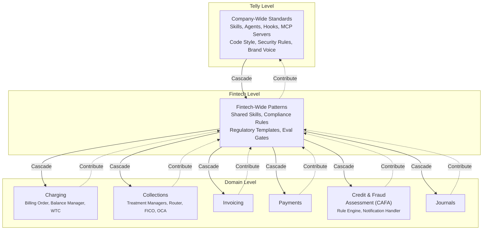

+++
date = '2024-07-08T12:00:00+10:00'
draft = false
title = 'Context Engineering: Why AI Projects Fail and How We Approached It'
tags = ['Context Engineering', 'LLM', 'AI Agents', 'Failure Modes']
summary = "80% of AI projects fail. Here's why context mismanagement is the root cause, and how we approached context engineering in practice."
+++

- Last year a lot of AI tools and LLM models were released for use across Telly, there was a lot of push to start adopting it.
- In Fintech we saw it differently. We asked questions — not about the models, but about the systems around them:
  - **Quality control** — how do you control quality when every output is non-deterministic and every team uses different tools?
  - **Reviewer scaling** — you can produce PRs at scale with AI. But who reviews them? How do review workflows keep up with generation velocity?
  - **Baselines for non-deterministic output** — when everyone has their own way of doing things, how do you baseline, gate, and measure success of content that differs every time?
  - **Productivity as a number** — how do you represent productivity numerically? How much has a skill helped or dragged a developer? Without a number, it's a story, not a metric.
  - **Compounding stochasticity** — each agent layer adds variance. A 95%-reliable single step becomes 60% reliable across ten steps. How do you constrain the system, not just the prompt?
  - **Skill discoverability** — Telly's prompt library has 200+ skills. Which 5 are relevant to your project? Without discoverability, the library is noise.
  - **Ambiguity** — models make reasonable assumptions based on training data, not your codebase. Inaccurate content is almost always an ambiguity problem. How do you make context explicit?
  - **Standardisation at scale** — even if you solve quality, how do you get teams to speak the same language? Make skills reusable? Make success reproducible? That's not a prompt problem — it's a system design problem.
  - **Engineer competence gap** — you are going to enable hundreds of engineers to generate code they barely understand, at scale. How do you prevent the gap between generation speed and comprehension from becoming a liability?
  - **Cost governance** — who pays when every engineer burns premium tokens on every turn? How do you measure ROI per skill, per agent, per team?
  - **Security / supply chain** — AI-generated code introduces vulnerable dependencies, secret leakage, and supply chain risk. Where is the security gate in the pipeline?
  - **Rollback / incident response** — a bad context change or skill update breaks production. What's the rollback plan? How do you run incident response for AI-generated failures?
  - **Testing the non-deterministic** — evals measure aggregate quality, but how do you write deterministic tests for stochastic outputs? Property-based testing? Snapshot diffing with thresholds?
  - **Onboarding the practice** — context engineering is a new discipline. How do you onboard engineers without bottlenecking on the platform team?

If you start without this - It is almost like handing over the keys to someone who has only the most basic idea of how to operate a car — that too in a town where the traffic rules have not been established yet. At the same time we don't want to be bottle neck.

I divided the problem statement into 3 streams.
1. **Tools** ~~The car itself~~
   - **Prompt libraries** — versioned, reviewed, maintained. But a documentation exercise without context engineering (see Part 1).
   - **Skills** — bundled instructions loaded on demand. Lazy-loading is a context-level decision, not a prompt-level one.
   - **Agents / subagents** — clean context windows with scoped tool availability. Requires context boundaries and handoff compression.
   - **MCP servers / tool definitions** — compete for token budget with instructions and history. Scoping per task is structural, not rhetorical.
   - **Hooks / plugins** (PreToolUse, PostToolUse) — machine-enforce invariants at the tool-call layer, regardless of what the prompt says. No prompt engineering equivalent.
   - **Eval frameworks / regression gates** — automated pipelines that gate merges on eval scores. Without them, scaling is blind.
   - **Observability / tracing** — token budgets, failure rates, context quality metrics. You can't improve what you don't measure.
   - **Guardrails / content filters** — inline enforcement at the output layer. Catches hallucinated tool calls and policy violations before they reach production.
    - **Latest models** — each model generation shifts the context window size, attention mechanics, and instruction-following behaviour. Tools must adapt.
    - **Forge (internal tool)** — our platform for building and deploying agentic workflows.
    - **Context discovery / retrieval** — how agents find the right context from the KB at runtime: ranking, caching, freshness checks. The retrieval layer is what wires Tools to Knowledge Base; without it, the KB is just a document store.
    - **GitHub Spaces / Knowledge Bases** — integrated stores for project-level context (docs, ADRs, architecture decisions). Useful when they stay fresh, but risk stale retrieval if not synced with the canonical KB.
2. **Knowledge Base** — ~~Think of like map + driver handbook + mechanic manual ~~
   - A lot of teams use prompts to generate code. The problem? Prompts are not reused, and prompts often lack full context of the system they target.
   - Without full context, the model fills gaps with assumptions based on its training data — reasonable in isolation, wrong in practice.
   - We make the knowledge base the source of truth: a structured, versioned store of solution designs, API specs, data models, business rules, and NFRs.
   - All stakeholders contribute — BAs (requirements), SMEs (domain rules), SAs (architecture constraints), Developers (implementation patterns). No single group owns the full picture alone.
   - A pipeline 2-way syncs with Confluence. Confluence is the human-facing canonical source; the KB is the agent-facing compiled view. Teams update Confluence and the KB stays current without extra toil.
3. **Process** (accuracy, AI-DLC) — ~~Traffic Rules, Road sign, licensing system~~
   - **AI-DLC gating** — stage gates: explore → validate → productionise → monitor. Evidence required at each stage to pass.
   - **Eval standards** — metrics (accuracy, recall, hallucination rate, token efficiency), thresholds, regression suite. No evals = no merge.
   - **Review workflows** — who reviews AI-generated output and at what depth. PRs, context diffs, prompt diffs. Addresses the reviewer scaling problem raised up top.
   - **Quality baselines** — how you measure productivity, non-deterministic output quality, skill effectiveness as numeric values. Compounding stochasticity tracking.
   - **Version & release strategy** — prompt versioning, KB snapshots, model pinning vs. canary. Roll out changes without breaking production.
   - **Feedback loops** — how production failures (false positives, hallucinations) flow back into evals, KB corrections, and prompt improvements. Without this, errors repeat.
   - **Audit & compliance** — for regulated environments. Traceability from requirement → context → generated output.

Additional: 
    - With people able to write and contribute skills in minutes - How are you going to decide which of the skills are relevant to your usecase? extrapolate this to tools, agents, plugins, hooks, prompt files etc..

What will happen if you haven't thought through this?
A study by Gartner, MIT, RAND, BCG, and McKinsey answered the first question better than we could: **70-85% of enterprise AI initiatives fail** to deliver their expected value. MIT found **95% of generative AI pilots produce no measurable P&L impact**. S&P Global documented that **42% of companies abandoned AI initiatives in 2025** ([Beri, 2026](https://www.beri.net/article/ai-project-failure-complete-guide-2026); [MIT, 2025](https://fortune.com/2025/08/18/mit-report-95-percent-generative-ai-pilots-at-companies-failing-cfo/); [S&P Global](https://beam.ai/agentic-insights/why-42-percent-of-ai-projects-show-zero-roi-and-how-to-be-in-the-58-percent)).

### What do you need to achieve?
- 
- **Context completeness** — when a prompt lacks full context, the model fills the gaps with assumptions drawn from its training data, not from your codebase, domain, or requirements. Those assumptions are reasonable in isolation but wrong in practice. Context engineering treats completeness as a first-class property: every piece of information the model needs to produce a correct answer must be explicitly in the window, not implied.
- **Systems design** — producing code at scale demands the same rigor as any software system: strong fundamentals, unambiguous specifications, well-chosen design patterns, and a clear architecture. At Fintech the design discussions are now being held to an extreme standard. I'm presenting a design on DeboLM next week and please extend the invite to any CTLs to bring their best people. Designs and Solution are source of truth and require strict levels of rigor, the context feeding an AI agent that generates code at scale demands the same. Context must be complete, disambiguated and structured with the same discipline as the code it generates. 
- **Testable outcomes** — you can measure token consumption, eval scores, regression gates. You can A/B test context configurations and gate merges when scores drop ([see eval layer](../ai-outputs-eval/)).
- **Compounding stochasticity** — every agent layer introduces non-determinism: sampling variance, context boundaries, tool selection entropy. Stack three layers and the output distribution widens dramatically. A single 95%-reliable tool call becomes 60% reliable across ten steps. Prompt craft handles one stochastic call; engineering constrains the system across many.
- **Scope boundaries** — prompt engineering should be restricted to cases where the session already has enough context to accommodate the prompt. If the prompt needs to retrieve, compose, or disambiguate context before it can be answered, that is context engineering's responsibility. The boundary is simple: can the model answer this correctly with nothing but the prompt, or does it need additional context loaded first?
- **Context sizing** — every token depletes the model's attention budget. Context engineering decides how much context to load, when, and in what order — not by guesswork, but by measuring token consumption and eval scores per configuration. Too little context and the model lacks information; too much and relevant signals drown in noise.
- **Context isolation** — when multiple agents, skills, or tools share a session, their context must be kept separate. A fraud detection agent should not inherit context from a collections agent. Context engineering provides isolation boundaries — subagents with clean windows, scoped tool availability, and structured handoffs that prevent cross-contamination ([Anthropic, Sep 2025](https://www.anthropic.com/engineering/effective-context-engineering-for-ai-agents)).
- **Progressive disclosure** — not all context belongs in the window at once. The right pattern is to load coarse context first (role, goals, constraints), then reveal finer-grained context on demand as the agent navigates toward a specific task. Skills, MCP tools, and retrieval-augmented prompts are the mechanism; deciding the order and granularity is the engineering ([Karpathy, 2025](https://x.com/karpathy/status/1937902205765607626)).

## Part 1: What Is Context Engineering

- Context engineering is the practice of deliberately designing, structuring and optimizing the context provided to an LLM to produce more accurate, reliable outputs.
- Prompt engineering — writing and organizing instructions for a single LLM call — works for one-shot tasks where the only variable is phrasing. But it collapses under the weight of real agentic systems for several reasons ([Anthropic, Sep 2025](https://www.anthropic.com/engineering/effective-context-engineering-for-ai-agents)):
  - **Reusable prompt libraries** — collecting and versioning prompts is a documentation exercise, not an engineering practice. Without context engineering, each prompt is a static blob with no awareness of session state, tool availability, or what other prompts have already loaded into the window.
  - **Skills** — a skill is a bundled set of instructions that loads on demand. Prompt engineering has no concept of lazy-loading; it assumes all instructions are present at call time. Registering skill names and descriptions at startup and deferring full content until needed is a context-level decision, not a prompt-level one ([Claude Code docs](https://code.claude.com/docs/en/skills)).
  - **Agents / subagents** — delegating to a subagent with a clean context window and returning only a summary requires managing context boundaries. Prompt engineering has no mechanism for isolation, compaction, or handoff compression ([Anthropic](https://www.anthropic.com/engineering/effective-context-engineering-for-ai-agents)).
  - **MCP servers and tools** — tool definitions compete for token budget with instructions and history. The question "which tools are available" is structural, not rhetorical. Too many tools force the model to waste turns deciding; too few leave it incapable. Prompt engineering can't scope tool availability per task ([Anthropic](https://www.anthropic.com/engineering/effective-context-engineering-for-ai-agents); [MCP docs](https://code.claude.com/docs/en/mcp)).
  - **Hooks to enforce behavior** — hooks (PreToolUse, PostToolUse) fire on lifecycle events and enforce invariants regardless of what the prompt says. They operate at the tool-call layer, not the instruction layer. Prompt engineering has no equivalent — it relies on the model choosing to follow instructions, while hooks machine-enforce constraints ([Claude Code docs](https://code.claude.com/docs/en/plugins-reference)).
- Context engineering addresses all of these by managing the entire state: system prompts, tools, MCP servers, data sources, conversation history, skills, agents, hooks, and how they interact — deciding what enters the window, what stays out, what gets retrieved on demand, and what gets compacted when space runs out ([IBM, 2025](https://www.ibm.com/think/topics/context-engineering)).
- The guiding principle, as Andrej Karpathy distilled it: *"context engineering is the delicate art and science of filling the context window with just the right information for the next step"* ([Karpathy, 2025](https://x.com/karpathy/status/1937902205765607626)). Every token depletes the model's attention budget — the goal is the smallest possible set of high-signal tokens that maximize the likelihood of a desired outcome.

## Part 2: Why LLM-Based AI Projects Fail

### The Scale of the Problem

Five independent research organizations — Gartner, MIT, RAND Corporation, BCG, and McKinsey — published AI project failure studies in 2025-2026. All five arrived at essentially the same conclusion: **70-85% of enterprise AI initiatives fail to deliver their expected value** ([Beri, 2026](https://www.beri.net/article/ai-project-failure-complete-guide-2026)). MIT's study focused specifically on generative AI and found that **95% of generative AI pilots produced no measurable P&L impact** ([MIT Project NANDA, 2025](https://fortune.com/2025/08/18/mit-report-95-percent-generative-ai-pilots-at-companies-failing-cfo/)). S&P Global documented that **42% of companies abandoned at least one AI initiative in 2025**, up from just 17% the year prior ([S&P Global, 2025](https://beam.ai/agentic-insights/why-42-percent-of-ai-projects-show-zero-roi-and-how-to-be-in-the-58-percent)). The average cost of a single failed enterprise AI project: **$7.2 million** ([S&P Global](https://www.pertamapartners.com/insights/ai-project-failure-statistics-2026)).

These are not measurement errors. When five separate analyses using different methodologies converge on an 80% failure rate, the problem is systemic.

### The Magic Demo Problem

"Just run a POC and see if it fails" — Amazon's bias for action, right? The problem is that a POC proves the technology works. It does not prove the system works at scale.

A realistic example from Fintech at a telecom company. Your prompt library has a `detect-fraud` entry: *"Flag any transaction over $10,000 for manual review."*

**POC:** An engineer tests it on a clean dataset of 100 historical transactions. The agent generates a SQL rule: `WHERE amount > 10000`. Demo passes. Bias for action wins — ship it.

**Production:** Processing millions of transactions daily. The rule immediately breaks:

- Legitimate high-value transactions (B2B settlements, payroll disbursements, interbank transfers) flood the manual review queue — 40,000 false positives in the first hour
- There is no merchant whitelist, no velocity check, no regional threshold variation
- A bad actor splits $50,000 into five $9,900 transfers — the $10k threshold is bypassed instantly
- The fraud team is overwhelmed and starts ignoring alerts within a week
- No two markets have the same fraud patterns, but the prompt assumes a single global rule

The team's response is rational: add more rules. Add a whitelist prompt, add a velocity check prompt, add regional threshold prompts, add merchant category prompts. Suddenly the prompt library explodes — 50 rules where there was one. Each rule carries its own context: which services it applies to, which data sources it needs, which other rules it conflicts with.

Now the agent is drowning:

- **Context bloat** — every invocation loads the full fraud rule library plus whitelists, velocity profiles, regional configs, merchant hierarchies, and historical baselines. The context window fills before the model can reason.
- **Context rot** — buried in that wall of tokens, the agent misses critical contradictions. Rule 12 says "threshold is $10,000 for market X" but rule 37 says "market X uses dynamic thresholds based on merchant tier." Both are in context. The model cannot resolve the clash.
- **Cost explosion** — every turn now processes 15,000+ tokens of context to answer a simple question. The AI bill balloons. Latency creeps up. The fraud team is waiting 30 seconds for a decision that a simple SQL query could deliver in 5 milliseconds.
- **Non-determinism** — the same transaction gets flagged on Monday, approved on Tuesday, because the stochastic model settles on different context tokens each time.

The irony is complete: you have built a system that is more expensive, slower, less reliable, and harder to maintain than the static rules it replaced. You would have been better off not using AI at all.

The prompt was not wrong — it was **context-blind**. It encoded an assumption that held in the demo sandbox (clean data, no volume, no adversary) but collapsed under real conditions. And the naive fix — adding more prompts — only made everything worse.

This pattern repeats across every prompt library initiative. A static prompt cannot encode the context it needs — whitelists, velocity rules, regional configs, merchant categories, historical baselines — because those vary per invocation, per market, per time window. That is not a prompt problem. It is a context engineering problem.

### The Root Cause: Context Mismanagement

The common thread across nearly all AI project failures is not model capability — it is **poor context management**. As [Forbes (Dec 2025)](https://www.forbes.com/councils/forbestechcouncil/2025/12/30/the-context-crisis-why-ai-projects-are-failing-and-how-to-fix-it/) reported: *"The problem isn't the AI models themselves... Without that tailored context, hallucinations hit up to 27%, factual errors creep into 46% of outputs."* AI hallucinations alone cost businesses **$67.4 billion in 2024** ([McKinsey](https://www.mckinsey.com/~/media/mckinsey/business%20functions/quantumblack/our%20insights/the%20state%20of%20ai/2025/the-state-of-ai-how-organizations-are-rewiring-to-capture-value_final.pdf)), and **47% of enterprise AI users admitted to making a major business decision based on hallucinated content** ([Forbes, 2025](https://www.forbes.com/sites/corneliawalther/2025/06/06/ai-safety-beyond-ai-hype-to-hybrid-intelligence/)).

### Context-Specific Failure Modes

When context is poorly engineered, specific failure patterns emerge. These are documented across Anthropic's engineering blog, Weaviate's context engineering guide, and the Sourcegraph practical guide:

1. **Context Poisoning** — Incorrect or hallucinated information enters the context. Because agents reuse and build upon that context, errors compound across turns ([Weaviate, Dec 2025](https://weaviate.io/blog/context-engineering)).

2. **Context Distraction** — The agent becomes burdened by too much past information — history, tool outputs, summaries — and over-relies on repeating past behavior rather than reasoning fresh ([Weaviate, Dec 2025](https://weaviate.io/blog/context-engineering)).

3. **Context Confusion** — Irrelevant tools or documents crowd the context, distracting the model and causing it to use the wrong tool or follow the wrong instructions ([Weaviate, Dec 2025](https://weaviate.io/blog/context-engineering); [Anthropic, Sep 2025](https://www.anthropic.com/engineering/effective-context-engineering-for-ai-agents)).

4. **Context Clash** — Contradictory information within the context misleads the agent, leaving it stuck between conflicting assumptions ([Weaviate, Dec 2025](https://weaviate.io/blog/context-engineering)).

5. **Context Rot** — As context grows, model recall accuracy degrades — especially for information in the middle of the window. The transformer architecture creates n² pairwise relationships between tokens; at 100,000 tokens that is 10 billion relationships to track ([Anthropic, Sep 2025](https://www.anthropic.com/engineering/effective-context-engineering-for-ai-agents); [Inkeep, Oct 2025](https://inkeep.com/blog/fighting-context-rot)).

6. **Ambiguity** — Vague system prompts or underspecified user intent force the model to guess. Anthropic describes this as a calibration problem: prompts that are *too vague* assume shared context that does not exist, while prompts that are *too brittle* hardcode if-else logic that breaks on edge cases ([Anthropic, Sep 2025](https://www.anthropic.com/engineering/effective-context-engineering-for-ai-agents)).

### Additional LLM-Specific Failure Modes

- **Tool bloat**: too many available tools overwhelm the model, causing slower responses and more hallucinated tool calls. *"If a human cannot definitively choose the right tool, the agent cannot either"* ([Anthropic, Sep 2025](https://www.anthropic.com/engineering/effective-context-engineering-for-ai-agents)).

- **Error cascades**: small mistakes snowball in multi-step agent trajectories. A 95%-reliable single tool call becomes 60% reliable across ten steps (0.95¹⁰ ≈ 0.60) ([Latitude, May 2026](https://latitude.so/blog/llm-failure-modes-fixes)).

- **Stale retrieval**: vector indexes and cached context go stale. Outdated information retrieved from cache poisons the agent's reasoning. Live queries (reads, grep, MCP) outperform cached embeddings when freshness matters ([Sourcegraph, 2026](https://sourcegraph.com/blog/context-engineering)).

- **System-level failures**: a taxonomy of 15 failure modes in LLM systems identifies multi-step reasoning drift, version drift, and cost-driven performance collapse as hidden failure modes that emerge in production but are invisible in evaluation benchmarks ([arXiv, 2025](https://arxiv.org/pdf/2511.19933)).

### Why This Matters

Cognition (makers of Devin) called context engineering *"effectively the #1 job of engineers building AI agents"* ([LangChain blog, Apr 2026](https://www.langchain.com/blog/context-engineering-for-agents)). Gartner predicts that **40% of new enterprise applications will contain embedded AI agents by 2026** ([Gartner, 2025](https://www.gartner.com/en/newsroom/press-releases/2025-08-26-gartner-predicts-40-percent-of-enterprise-apps-will-feature-task-specific-ai-agents-by-2026-up-from-less-than-5-percent-in-2025)). The companies that master context engineering will have an insurmountable advantage — not because they are using better models, but because they are feeding their models better context.

## Part 3: How We Approached It
As I see it there are 3 parts of it that can scale independently.
1. Tools, Skills, 
2. Knowledge base and Code
3. Process    

When we looked at Telly's reality — a Fintech company running multiple product lines across regulated markets — we found a common pattern. Teams were doing the first thing well: building prompt libraries. Every squad had CLAUDE.md files, skill definitions, reusable prompt templates, agent configs, and hooks. They were versioned, reviewed, and maintained.

But the second thing was missing entirely: **knowledge of context engineering itself**. Nobody had codified *how* to think about context — what belongs in the window, what gets retrieved on demand, how to isolate agent boundaries, how to measure context quality. Teams were building prompts in isolation, reinventing solutions to the same problems, and making the same mistakes documented in Part 2.

We built two hierarchies to close the gap.

### Hierarchy 1: The Tiered Context Architecture

Prompt libraries already existed across Telly, but they were flat and duplicated. We introduced a three-tier hierarchy:

**Telly Level** — company-wide standards that every agent inherits: security rules, brand voice, code style, MCP server definitions, and core skills (code review, commit message generation, documentation formatting). These are maintained by a central platform team and change infrequently.

**Fintech Level** — patterns shared across all Fintech domains: compliance rules, regulatory templates, shared eval gates, and cross-domain skills. These are contributed by domains. When a Charging team discovers a pattern that applies to Collections too, they contribute it up to Fintech level.

**Domain Level** — the sharp end, organized by product domain: Charging (Billing Order, Balance Manager, WTC), Collections (Treatment Managers, Router, FICO Collections, OCA), Invoicing, Payments, Credit & Fraud Assessment (CAFA — Rule Engine, Notification Handler), and Journals. Each domain owns skills, prompts, and agent configs specific to its area. This is where context is most specific and changes most frequently.

The solid arrows represent **Cascade** — context inherits top-down. Every domain automatically receives Telly security standards and Fintech compliance templates without lifting a finger.

The dotted arrows represent **Contribute** — patterns flow bottom-up. When a Charging team discovers a reusable pattern, they propose it up to Fintech level, not by copying prompts, but by contributing a skill or rule to the tier above.

This Cascade & Contribute model eliminated the duplication problem. A domain team inherits everything they need from above, and when they solve something novel, the pattern flows back up for others to use. Domain teams no longer need to think about fintech or company-wide concerns — the architecture handles composition automatically.

### Hierarchy 2: The Context Engineering Knowledge Base

The second hierarchy addressed the missing piece: codifying *how* to think about context engineering itself. Teams were building prompts without shared knowledge — no standard for what belongs in the window, how to isolate agent boundaries, or how to measure context quality.

We built a knowledge base structured as template repositories across three levels:

```mermaid
graph TB
    subgraph TEMPLATES["Template Repos (Skeleton Only)"]
        T1["Fintech Template"]
        T2["Domain Template"]
        T3["App Template"]
    end
    
    subgraph FORKS["Forked Repos (Populated with Content)"]
        F1["Fintech KB"]
        
        D1["Charging KB"]
        D2["Collections KB"]
        D3["Invoicing KB"]
        D4["Payments KB"]
        D5["CAFA KB"]
        D6["Journals KB"]
        
        A1["Billing Order KB"]
        A2["Balance Manager KB"]
        A3["WTC KB"]
        A4["Treatment Managers KB"]
        A5["Router KB"]
        A6["FICO Collections KB"]
        A7["OCA KB"]
        A8["Rule Engine KB"]
        A9["Notification Handler KB"]
    end
    
    T1 --> T2
    T2 --> T3
    
    T1 -->|"fork"| F1
    T2 -->|"fork"| D1
    T2 -->|"fork"| D2
    T2 -->|"fork"| D3
    T2 -->|"fork"| D4
    T2 -->|"fork"| D5
    T2 -->|"fork"| D6
    T3 -->|"fork"| A1
    T3 -->|"fork"| A2
    T3 -->|"fork"| A3
    T3 -->|"fork"| A4
    T3 -->|"fork"| A5
    T3 -->|"fork"| A6
    T3 -->|"fork"| A7
    T3 -->|"fork"| A8
    T3 -->|"fork"| A9
    
    F1 --> D1
    F1 --> D2
    F1 --> D3
    F1 --> D4
    F1 --> D5
    F1 --> D6
    
    D1 --> A1
    D1 --> A2
    D1 --> A3
    D2 --> A4
    D2 --> A5
    D2 --> A6
    D2 --> A7
    D5 --> A8
    D5 --> A9
    
    D1 -.->|"contribute"| T2
    D2 -.->|"contribute"| T2
    D3 -.->|"contribute"| T2
    D4 -.->|"contribute"| T2
    D5 -.->|"contribute"| T2
    D6 -.->|"contribute"| T2
    
    A1 -.->|"contribute"| T3
    A2 -.->|"contribute"| T3
    A3 -.->|"contribute"| T3
    A4 -.->|"contribute"| T3
    A5 -.->|"contribute"| T3
    A6 -.->|"contribute"| T3
    A7 -.->|"contribute"| T3
    A8 -.->|"contribute"| T3
    A9 -.->|"contribute"| T3
```

**Template repos** contain only the skeleton — a directory structure with folders (solution-designs, specs-api, events, data-model, nfrs, component-designs, architecture-designs, feature-templates) and markdown guides explaining what belongs at that level. No actual content, just the architecture.

**Forked repos** are where the real knowledge lives. A team forks the template at their level and populates it with their actual content. A Charging team forks the Domain template and fills in charging-specific solution designs, API specs, and data models. A Billing Order team forks the App template and fills in billing-specific component designs and event schemas.

The tree structure is identical between templates and forks — the hierarchy (Fintech → Domain → App) is preserved in both. The fork arrows show which template each team forked from; the solid arrows between forks show how the knowledge base mirrors the tiered architecture.

The key difference from the Tiered Context Architecture: the knowledge base is **not inherited**. Teams contribute patterns back up to the template they forked from, so the template evolves as teams discover better approaches. A Charging team that finds a novel way to structure solution designs proposes an update to the Domain template, which then benefits all other teams that fork it in the future.
