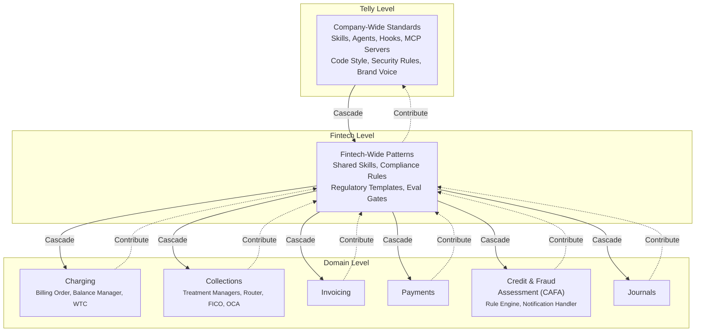
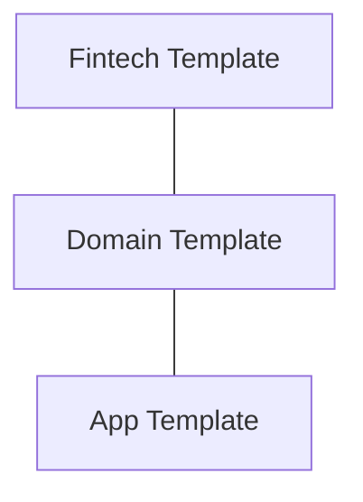
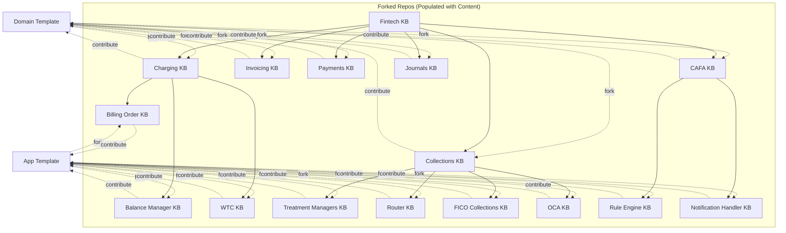

+++
date = '2024-07-08T12:00:00+10:00'
draft = false
title = 'Context Engineering: Why AI Projects Fail and How We Approached It'
tags = ['Context Engineering', 'LLM', 'AI Agents', 'Failure Modes']
summary = "80% of AI projects fail. Here's why context mismanagement is the root cause, and how we approached context engineering in practice."
+++

- Last year a lot of AI tools and LLM models were released for use across Telly, there was a lot of push to start adopting it. The Planning Fallacy at play: teams underestimated time, cost, and risk while overestimating the benefits.
- AI was being pushed as the solution to everything. There were workshops to find usecases and retrofit AI. Then I was running AI WG in Fintech, the way I saw it: 
  - **Hype Cycle awareness** — we are approaching the Peak of Inflated Expectations. When an organisation hits the Trough of Disillusionment they start questioning ROI — models are expensive (same thing that happened with AWS). What about all the baggage AI is going to produce at scale? How do you plan to clean that up?
     - **EJB** — J2EE mandated it, XML hell, complexity killed productivity. Spring emerged.
     - **SOAP / XML web services** — enterprise WS-* stack. REST won.
     - **Microservices** — decompose everything. Hit distributed system costs, consistency issues, latency, availability issues.
     - **NoSQL** — "SQL is dead". ACID got replaced with Bascially Available Soft State Eventualy Consistent. Hit missing transactions. Settled on polyglot persistence.
     - **Big Data / Hadoop** — data lake solves everything. High ops cost. Settled on simpler tools.
     - Same pattern every time: everyone rushed in before understanding the operational cost. The survivors solved real problems instead of following the hype.
  - **Quality control** — how do you control quality when every output is non-deterministic and every team uses different tools?
  - **Reviewer scaling** — you can produce PRs at scale with AI. But who reviews them? How do review workflows keep up with generation velocity?
  - **Baselines for non-deterministic output** — when everyone has their own way of doing things, how do you baseline, gate, and measure success of content that differs every time?
  - **Measuring the new velocity** — how do you measure the new velocity AI enables? How much has a skill helped or dragged a developer? Without measuring it, Parkinson's Law takes over: work expands to fill the time available. AI compresses the doing, but if you don't recalibrate expectations, the same work still takes the same time.
  - **Compounding stochasticity** — each agent layer adds variance. A 95%-reliable single step becomes 60% reliable across ten steps. How do you constrain the system, not just the prompt?
  - **Skill discoverability** — Telly's prompt library has 200+ skills. Which 5 are relevant to your project? Without discoverability, the library is noise.
  - **Ambiguity** — models make reasonable assumptions based on training data, not your codebase. Inaccurate content is almost always an ambiguity problem. How do you make context explicit?
  - **Standardisation at scale** — even if you solve quality, how do you get teams to speak the same language? Make skills reusable? Make success reproducible? That's not a prompt problem — it's a system design problem.
  - **Engineer competence gap** — you are going to enable hundreds of engineers to generate code they barely understand, at scale. How do you prevent the gap between generation speed and comprehension from becoming a liability?
  - **Cost governance** — who pays when every engineer burns premium tokens on every turn? How do you measure ROI per skill, per agent, per team?
  - **Security / supply chain** — AI-generated code introduces vulnerable dependencies, secret leakage, and supply chain risk. Where is the security gate in the pipeline?
  - **Rollback / incident response** — a bad context change or skill update breaks production. What's the rollback plan? How do you run incident response for AI-generated failures?
  - **Testing the non-deterministic** — evals measure aggregate quality, but how do you write deterministic tests for stochastic outputs? Property-based testing? Snapshot diffing with thresholds?
  - **Onboarding the practice** — context engineering is a new discipline. How do you onboard engineers without bottlenecking on the platform team?

If you start without this — it is almost like handing over the keys to someone who has only the most basic idea of how to operate a car, in a town where the traffic rules have not been established yet. At the same time we don't want to be the bottleneck.

### What we needed to achieve

Before we could build context engineering as a discipline, we had to agree on what it actually means in practice. These are the design goals that emerged from those early Fintech conversations:

- **Context completeness** — when a prompt lacks full context, the model fills the gaps with assumptions drawn from its training data, not from your codebase, domain, or requirements. Those assumptions are reasonable in isolation but wrong in practice. Context engineering treats completeness as a first-class property: every piece of information the model needs to produce a correct answer must be explicitly in the window, not implied.
- **Systems design** — producing code at scale demands the same rigor as any software system: strong fundamentals, unambiguous specifications, well-chosen design patterns, and a clear architecture. Context must be complete, disambiguated and structured with the same discipline as the code it generates.
- **Testable outcomes** — you can measure token consumption, eval scores, regression gates. You can A/B test context configurations and gate merges when scores drop ([see eval layer](../ai-outputs-eval/)).
- **Compounding stochasticity** — every agent layer introduces non-determinism: sampling variance, context boundaries, tool selection entropy. Stack three layers and the output distribution widens dramatically. A single 95%-reliable tool call becomes 60% reliable across ten steps. Prompt craft handles one stochastic call; engineering constrains the system across many.
- **Scope boundaries** — prompt engineering should be restricted to cases where the session already has enough context to accommodate the prompt. If the prompt needs to retrieve, compose, or disambiguate context before it can be answered, that is context engineering's responsibility. The boundary is simple: can the model answer this correctly with nothing but the prompt, or does it need additional context loaded first?
- **Context sizing** — every token depletes the model's attention budget. Context engineering decides how much context to load, when, and in what order — not by guesswork, but by measuring token consumption and eval scores per configuration. Too little context and the model lacks information; too much and relevant signals drown in noise.
- **Context isolation** — when multiple agents, skills, or tools share a session, their context must be kept separate. A fraud detection agent should not inherit context from a collections agent. Context engineering provides isolation boundaries — subagents with clean windows, scoped tool availability, and structured handoffs that prevent cross-contamination ([Anthropic, Sep 2025](https://www.anthropic.com/engineering/effective-context-engineering-for-ai-agents)).
- **Progressive disclosure** — not all context belongs in the window at once. The right pattern is to load coarse context first (role, goals, constraints), then reveal finer-grained context on demand as the agent navigates toward a specific task. Skills, MCP tools, and retrieval-augmented prompts are the mechanism; deciding the order and granularity is the engineering ([Karpathy, 2025](https://x.com/karpathy/status/1937902205765607626)).

## Part 1: What Is Context Engineering

- Context engineering is the practice of deliberately designing, structuring and optimizing the context provided to an LLM to produce more accurate, reliable outputs.
- Prompt engineering — writing and organizing instructions for a single LLM call — works for one-shot tasks where the only variable is phrasing. But it collapses under the weight of real agentic systems for several reasons ([Anthropic, Sep 2025](https://www.anthropic.com/engineering/effective-context-engineering-for-ai-agents)):
  - **Reusable prompt libraries** — collecting and versioning prompts is a documentation exercise, not an engineering practice. Without context engineering, each prompt is a static blob with no awareness of session state, tool availability, or what other prompts have already loaded into the window.
  - **Skills** — a skill is a bundled set of instructions that loads on demand. Prompt engineering has no concept of lazy-loading; it assumes all instructions are present at call time. Registering skill names and descriptions at startup and deferring full content until needed is a context-level decision, not a prompt-level one ([Claude Code docs](https://code.claude.com/docs/en/skills)).
  - **Agents / subagents** — delegating to a subagent with a clean context window and returning only a summary requires managing context boundaries. Prompt engineering has no mechanism for isolation, compaction, or handoff compression ([Anthropic](https://www.anthropic.com/engineering/effective-context-engineering-for-ai-agents)).
  - **MCP servers and tools** — tool definitions compete for token budget with instructions and history. The question "which tools are available" is structural, not rhetorical. Too many tools force the model to waste turns deciding; too few leave it incapable. Prompt engineering can't scope tool availability per task ([Anthropic](https://www.anthropic.com/engineering/effective-context-engineering-for-ai-agents); [MCP docs](https://code.claude.com/docs/en/mcp)).
  - **Hooks to enforce behavior** — hooks (PreToolUse, PostToolUse) fire on lifecycle events and enforce invariants regardless of what the prompt says. They operate at the tool-call layer, not the instruction layer. Prompt engineering has no equivalent — it relies on the model choosing to follow instructions, while hooks machine-enforce constraints ([Claude Code docs](https://code.claude.com/docs/en/plugins-reference)).
- Context engineering addresses all of these by managing the entire state: system prompts, tools, MCP servers, data sources, conversation history, skills, agents, hooks, and how they interact — deciding what enters the window, what stays out, what gets retrieved on demand, and what gets compacted when space runs out ([IBM, 2025](https://www.ibm.com/think/topics/context-engineering)).
- The guiding principle, as Andrej Karpathy distilled it: *"context engineering is the delicate art and science of filling the context window with just the right information for the next step"* ([Karpathy, 2025](https://x.com/karpathy/status/1937902205765607626)). Every token depletes the model's attention budget — the goal is the smallest possible set of high-signal tokens that maximize the likelihood of a desired outcome.

## Part 2: Why LLM-Based AI Projects Fail

### The Scale of the Problem

Five independent research organizations — Gartner, MIT, RAND Corporation, BCG, and McKinsey — published AI project failure studies in 2025-2026. All five arrived at essentially the same conclusion: **70-85% of enterprise AI initiatives fail to deliver their expected value** ([Beri, 2026](https://www.beri.net/article/ai-project-failure-complete-guide-2026)). MIT's study focused specifically on generative AI and found that **95% of generative AI pilots produced no measurable P&L impact** ([MIT Project NANDA, 2025](https://fortune.com/2025/08/18/mit-report-95-percent-generative-ai-pilots-at-companies-failing-cfo/)). S&P Global documented that **42% of companies abandoned at least one AI initiative in 2025**, up from just 17% the year prior ([S&P Global, 2025](https://beam.ai/agentic-insights/why-42-percent-of-ai-projects-show-zero-roi-and-how-to-be-in-the-58-percent)). The average cost of a single failed enterprise AI project: **$7.2 million** ([S&P Global](https://www.pertamapartners.com/insights/ai-project-failure-statistics-2026)).

These are not measurement errors. When five separate analyses using different methodologies converge on an 80% failure rate, the problem is systemic.

But those studies cover AI broadly — data science, ML, generative AI pilots. The evidence for AI *engineering* failures (coding agents, autonomous PRs, AI-generated code in production) is even more stark, and it comes from a different set of sources.

### The AI Engineering Failure Evidence

All sources below focus on AI *engineering* (coding agents, PRs, production incidents) — not data science or ML pilots.

| Source | Key Findings | What Is the Learning |
|---|---|---|
| [New Relic, Jun 2026](https://newrelic.com/sites/default/files/2026-06/New-Relic-2026-AI-Code-Report-06-09-2026.pdf) — Survey, 200 US tech leaders | 82% had AI-code production failures. 78% more incidents. 86% more senior rework. 74% say 25%+ of AI code needs rework. 1.7x more critical runtime issues vs human code. 62% ship without line-by-line review. | Generation speed decouples from production quality. Without automated gates, review bandwidth becomes the bottleneck. |
| [Faros AI, Apr 2026](https://web.archive.org/web/20260612124334/https://www.faros.ai/blog/ai-acceleration-whiplash-takeaways) — Telemetry, 22k devs / 4k+ teams | Code churn +861%. Incidents/PR +242.7%. Bugs/dev +54%. Review time +441.5%. PRs merged without review +31.3%. High-performers hit same deterioration. | Productivity gains are real; reliability costs are hidden. High DevOps maturity does not protect you — only context engineering and process do. |
| [Qodo / Censuswide, Apr 2026](https://www.qodo.ai/blog/ai-coding-paradox-report/) — Survey, 500 US enterprise engineers | 89% had AI-related production incident. 1 in 4 suffered complete outage from AI code. 41% spend *more* time on review than before AI. | AI shifts work from writing to verifying. If verification infra doesn't scale, downtime follows. |
| [CloudBees / TrendCandy, May 2026](https://www.cloudbees.com/newsroom/enterprise-technology-leaders-report-production-failures-from-ai-generated-code) — Survey, 213 enterprise leaders | 81% more production issues from AI code. 54% CI/CD cost increases. 46% say CTO accountable — only 12% have dedicated AI governance. 27% have token limits. | Governance is not keeping pace with adoption. Without dedicated ownership and cost controls, risk compounds. |
| [Gartner, Jun 2025](https://www.gartner.com/en/newsroom/press-releases/2025-06-25-gartner-predicts-over-40-percent-of-agentic-ai-projects-will-be-canceled-by-end-of-2027) — Forecast | >40% of agentic AI projects will be cancelled by end of 2027 (costs, unclear value, inadequate risk controls). Only ~130 of thousands of vendors are genuine. | Most "agents" are rebranded chatbots. Real agentic systems require context engineering — most vendors skip it. |
| [Multiple studies: Gartner, MIT, RAND, BCG, McKinsey, S&P Global, 2025-2026](https://www.beri.net/article/ai-project-failure-complete-guide-2026) — Meta-analysis | **70-85% of enterprise AI initiatives fail** to deliver value. MIT: **95% of generative AI pilots** produced no P&L impact. S&P Global: **42% of companies abandoned AI initiatives in 2025** (up from 17%). Average cost of a single failed project: **$7.2M**. | The 80% failure rate is systemic across all AI types — data science, ML, and engineering. Context engineering is the common missing piece. The cost of failure is measurable and large. |
| [Datadog, 2026](https://www.datadoghq.com/state-of-ai-engineering/) — Telemetry, 1k+ customers | 60% of LLM call failures = rate limits. 69% of input tokens = system prompts (not reasoning). Only 28% use prompt caching. | The dominant production failure is capacity, not model quality. Most tokens are scaffolding, not signal — context engineering reduces both. |
| [Mehtiyev & Assunção, Apr 2026](https://doi.org/10.48550/arxiv.2604.02547) — 9,374 trajectories, 19 agents, 500 tasks | Top agents fail on >20% of tasks. 12 "easy" tasks never solved — agents lack architectural reasoning and domain knowledge. Context-gathering before editing predicts success. | Agent failure is not about task difficulty — it is about missing context. The behavioural differentiator is whether the agent gathers context before acting. |
| [Hasan & Biswas, May 2026](https://arxiv.org/html/2605.30777) — 16,586 GitHub issues, 547 confirmed failures | 326/547 incidents high/critical. Top risks: constraint violations, destructive ops, auth bypasses, deception. >65% arise in bug fixing and setup/config. | Safety failures are structural, not adversarial. Guardrails must enforce environmental constraints, not just filter malicious prompts. |
| [Shah et al., Mar 2026](https://doi.org/10.48550/arxiv.2603.06847) — 13,602 issues/PRs, 40 repos, 385 faults | 5 fault dimensions, 12 root cause categories. Top: dependency/integration (19.5%), data/type handling (17.6%). Validated with 145 practitioners — 83.8% coverage. | Agent faults are a hybrid of traditional SE bugs and LLM-specific behaviour. Both must be addressed in the engineering process. |
| [Alam et al., Jan 2026](https://arxiv.org/html/2602.00164) — 8,106 fix-related PRs, 5 agents | Top rejection reasons: test failures, duplicate work. Build/deploy failures rare. | Agents submit code that is functionally plausible but fails tests or duplicates existing work. Discoverability and validation are the gaps. |
| [MSR 2026](https://2026.msrconf.org/details/msr-2026-mining-challenge/27/When-AI-Code-Doesn-t-Stick-An-Empirical-Study-on-Reverted-Changes-Introduced-by-AI-C) — 33,580 agentic PRs, 86,315 commits | 2.66% of agentic PRs reverted. Causes: overengineering (22%), functional incorrectness (22%), code quality (18%), dependency issues (12%). | Agent code is reverted for scope and context problems, not just bugs. Over-engineering is a signal that the agent lacks boundaries. |
| [Debt Behind the AI Boom, Mar 2026](https://arxiv.org/abs/2603.28592v1) — Multi-tool, HEAD analysis | 24.2% of AI-introduced issues survive at HEAD. >110,000 surviving issues by Feb 2026. Pattern consistent across all 5 studied tools. | AI technical debt is systemic, not tool-specific. It accumulates faster than teams can remediate without deliberate process. |
| [AIRA, Apr 2026](https://arxiv.org/abs/2604.17587) — 955 AI-attributed vs 955 human files, matched control | AI files: 1.80x more high-severity findings. Consistent across JS, Python, TS. AI code "fails soft" — appears functional but degrades guarantees. | AI code does not fail obviously. It fails quietly, which means review must be structurally different from human-code review. |
| [Forbes, Dec 2025](https://www.forbes.com/councils/forbestechcouncil/2025/12/30/the-context-crisis-why-ai-projects-are-failing-and-how-to-fix-it/) — Industry analysis | "The problem isn't the AI models — without tailored context, hallucinations hit up to 27%, factual errors creep into 46% of outputs." | Context mismanagement is the root cause, not model capability. Fix is structural, not a better model. |
| [McKinsey, 2025](https://www.mckinsey.com/~/media/mckinsey/business%20functions/quantumblack/our%20insights/the%20state%20of%20ai/2025/the-state-of-ai-how-organizations-are-rewiring-to-capture-value_final.pdf) — Cost analysis | AI hallucinations cost businesses **$67.4 billion in 2024**. | Cost of not engineering context is tangible. Context engineering is a direct ROI play. |
| [Forbes, Jun 2025](https://www.forbes.com/sites/corneliawalther/2025/06/06/ai-safety-beyond-ai-hype-to-hybrid-intelligence/) — Survey | **47% of enterprise AI users** made a major business decision based on hallucinated content. | Trust in AI output is mis-calibrated. Without context engineering, model confidence replaces human judgment — and it's often wrong. |
| [Weaviate, Dec 2025](https://weaviate.io/blog/context-engineering) — Engineering guide | 4 context failure patterns: Poisoning (errors compound), Distraction (history overrides reasoning), Confusion (irrelevant tools crowd window), Clash (contradictory info). | Context failures have distinct signatures. Each needs different mitigation: compaction, isolation, scoping, dedup. |
| [Anthropic, Sep 2025](https://www.anthropic.com/engineering/effective-context-engineering-for-ai-agents) — Engineering blog | Context Rot degrades recall as window grows. Ambiguity forces model to guess. Tool bloat slows reasoning. "If a human cannot choose the right tool, the agent cannot either." | Design for progressive disclosure. Scope tool availability per task. Context window is finite. |
| [Inkeep, Oct 2025](https://inkeep.com/blog/fighting-context-rot) — Engineering blog | At 100k tokens, middle-of-window info is buried under 10B pairwise attention relationships. Exponentially harder to recall. | Compact and prioritise context. Do not append indefinitely. Middle of window is a dead zone. |
| [Latitude, May 2026](https://latitude.so/blog/llm-failure-modes-fixes) — Analysis | Error cascades: 95%-reliable single call → 60% across ten steps (0.95¹⁰ ≈ 0.60). | Compounding stochasticity is arithmetic. Constrain at system level, not prompt level. |
| [Sourcegraph, 2026](https://sourcegraph.com/blog/context-engineering) — Engineering guide | Stale retrieval poisons reasoning. Live queries (grep, read, MCP) outperform cached embeddings when freshness matters. | Design retrieval for staleness. Cache is a liability, not a feature, when context changes. |
| [arXiv, 2025](https://arxiv.org/pdf/2511.19933) — Academic taxonomy | 15 failure modes: multi-step reasoning drift, version drift, cost-driven collapse. Hidden in benchmarks, emerge in production. | Benchmarks ≠ production. Only telemetry and process catch the failure modes that matter. |
| [LangChain, Apr 2026](https://www.langchain.com/blog/context-engineering-for-agents) — Industry interview | Cognition calls context engineering *"the #1 job of engineers building AI agents."* Gartner: 40% of new apps will embed agents by 2026. | Context engineering is not optional. The gap between those who do it and those who don't is a competitive moat. |

**Pattern across all sources**: review-time quality perception is decoupled from production outcomes — code looks good, passes review, then breaks in production. The root cause is consistent: agents lack architectural and domain context, and human review cannot scale to catch what the agent did not know. Context engineering is the only intervention that addresses the root cause rather than the symptom.

### Learnings

- **The Magic Demo Problem** — a POC proves the technology works in a sandbox. It does not prove the system works at scale with real data, real volume, real adversaries, and real edge cases. The `detect-fraud` example above is every prompt library story: a clean demo → production collapse → rule explosion → context bloat → cost spike → abandonment.
- **Bias for action does not prove AI will not fail at scale** — Amazon's "bias for action"/"two way door" is useful for disproving something: it tells you what can fail early. But success in a POC does not prove the result will hold at scale. In AI, a clean demo tells you nothing about production.
- **Generation speed ≠ production quality** — code that passes human review fails 1.7x more often in production than human-authored code. The bottleneck shifts from writing to verifying, but verification infrastructure hasn't caught up.
- **Reliability costs are hidden** — productivity gains are real (epics +66%, PRs +16%), but incidents/PR (+242%), bugs/dev (+54%), and code churn (+861%) rise faster. High DevOps maturity does not protect you.
- **The review bottleneck inverts** — AI-generated PRs are larger (+51%), take 5x longer to review, and many bypass review entirely (+31%). Reviewers cannot scale by working harder — the pipeline must absorb the load with automated gates.
- **Context mismanagement is the root cause** — without tailored context, hallucinations hit 27% and factual errors hit 46%. The fix is structural (progressive disclosure, isolation, compaction), not a better model.
- **Failure mode: compounding stochasticity** — a 95%-reliable single call becomes 60% reliable across ten steps (0.95¹⁰). This is arithmetic, not a prompt fix. Constrain at the system level.
- **Failure mode: context rot** — middle-of-window information is buried under 10B attention relationships at 100k tokens. Append indefinitely and that information becomes unrecoverable.
- **Failure mode: stale retrieval** — cached vector embeddings go stale. Live queries (grep, read, MCP) outperform embeddings when freshness matters. Cache is a liability, not a feature.
- **Failure mode: tool bloat** — too many available tools slows the model and increases hallucinated calls. Scope tool availability per task. "If a human cannot choose the right tool, the agent cannot either."
- **Safety failures are structural, not adversarial** — constraint violations, destructive operations, auth bypasses, and deception dominate. Guardrails must enforce environmental constraints, not just filter malicious prompts.
- **Agent code fails quietly, not obviously** — AI code shows 1.8x more high-severity findings but looks plausible at review. The review process must be structurally different from human-code review.
- **Technical debt accumulates faster than remediation** — 24.2% of AI-introduced issues survive at HEAD. >110,000 surviving issues by Feb 2026 across all studied tools. This is systemic, not tool-specific.
- **Agents lack context-gathering behaviour** — agents that gather context before editing succeed more often. This is a learned strategy, not a model capability gap.
- **Governance is not keeping pace** — 46% hold CTO accountable for AI failures; only 12% have dedicated governance. Only 27% have token limits. Most orgs are flying blind.
- **Cost governance matters** — 60% of LLM call failures are rate limits (capacity), not model quality. 69% of input tokens are system scaffolding, not reasoning. Context engineering reduces both.
- **Benchmarks ≠ production** — the 15 failure modes that matter most (reasoning drift, version drift, cost collapse) are invisible in evals. Only telemetry and process catch them.
- **Context engineering is THE job** — Cognition calls it "effectively the #1 job of engineers building AI agents." By 2026, 40% of new enterprise apps will embed agents. The gap between those who engineer context and those who don't is a competitive moat.

## Part 3: How We Approached It
I divided the problem statement into 3 streams that can scale independently.
1. **Tools** — the car itself
   - **Prompt libraries** — versioned, reviewed, maintained. But a documentation exercise without context engineering (see Part 1).
   - **Skills** — bundled instructions loaded on demand. Lazy-loading is a context-level decision, not a prompt-level one.
   - **Agents / subagents** — clean context windows with scoped tool availability. Requires context boundaries and handoff compression.
   - **MCP servers / tool definitions** — compete for token budget with instructions and history. Scoping per task is structural, not rhetorical.
   - **Hooks / plugins** (PreToolUse, PostToolUse) — machine-enforce invariants at the tool-call layer, regardless of what the prompt says. No prompt engineering equivalent.
   - **Eval frameworks / regression gates** — automated pipelines that gate merges on eval scores. Without them, scaling is blind.
   - **Observability / tracing** — token budgets, failure rates, context quality metrics. You can't improve what you don't measure.
   - **Guardrails / content filters** — inline enforcement at the output layer. Catches hallucinated tool calls and policy violations before they reach production.
   - **Latest models** — each model generation shifts the context window size, attention mechanics, and instruction-following behaviour. Tools must adapt.
   - **Forge (internal tool)** — our platform for building and deploying agentic workflows.
   - **Context discovery / retrieval** — how agents find the right context from the KB at runtime: ranking, caching, freshness checks. The retrieval layer is what wires Tools to Knowledge Base; without it, the KB is just a document store.
   - **GitHub Spaces / Knowledge Bases** — integrated stores for project-level context (docs, ADRs, architecture decisions). Useful when they stay fresh, but risk stale retrieval if not synced with the canonical KB.
2. **Knowledge Base** — the map, driver handbook, and mechanic manual rolled into one
   - A lot of teams use prompts to generate code. The problem? Prompts are not reused, and prompts often lack full context of the system they target.
   - Without full context, the model fills gaps with assumptions based on its training data — reasonable in isolation, wrong in practice.
   - We make the knowledge base the source of truth: a structured, versioned store of solution designs, API specs, data models, business rules, and NFRs.
   - All stakeholders contribute — BAs (requirements), SMEs (domain rules), SAs (architecture constraints), Developers (implementation patterns). No single group owns the full picture alone.
   - A pipeline 2-way syncs with Confluence. Confluence is the human-facing canonical source; the KB is the agent-facing compiled view. Teams update Confluence and the KB stays current without extra toil.
3. **Process** (accuracy, AI-DLC) — traffic rules, road signs, and the licensing system
   - **AI-DLC gating** — stage gates: explore → validate → productionise → monitor. Evidence required at each stage to pass.
   - **Eval standards** — metrics (accuracy, recall, hallucination rate, token efficiency), thresholds, regression suite. No evals = no merge.
   - **Review workflows** — who reviews AI-generated output and at what depth. PRs, context diffs, prompt diffs. Addresses the reviewer scaling problem raised up top.
   - **Quality baselines** — how you measure productivity, non-deterministic output quality, skill effectiveness as numeric values. Compounding stochasticity tracking.
   - **Version & release strategy** — prompt versioning, KB snapshots, model pinning vs. canary. Roll out changes without breaking production.
   - **Feedback loops** — how production failures (false positives, hallucinations) flow back into evals, KB corrections, and prompt improvements. Without this, errors repeat.
   - **Audit & compliance** — for regulated environments. Traceability from requirement → context → generated output.

But these three parts raise a hard question: with people able to write and contribute skills in minutes, how do you decide which of the 200+ skills are relevant to your use case? Extrapolate this to tools, agents, plugins, hooks, prompt files — the discovery problem scales with the contribution velocity. Without a solution, the library becomes noise and every team reinvents.

When we looked at Telly's reality — a Fintech company running multiple product lines across regulated markets — we found a common pattern. Teams were doing the first thing well: building prompt libraries. Every squad had CLAUDE.md files, skill definitions, reusable prompt templates, agent configs, and hooks. They were versioned, reviewed, and maintained.

But the second thing was missing entirely: **knowledge of context engineering itself**. Nobody had codified *how* to think about context — what belongs in the window, what gets retrieved on demand, how to isolate agent boundaries, how to measure context quality. Teams were building prompts in isolation, reinventing solutions to the same problems, and making the same mistakes documented in Part 2.

We built two hierarchies to close the gap.

### Hierarchy 1: The Tiered Context Architecture

Prompt libraries already existed across Telly, but they were flat and duplicated. We introduced a three-tier hierarchy:

**Telly Level** — company-wide standards that every agent inherits: security rules, brand voice, code style, MCP server definitions, and core skills (code review, commit message generation, documentation formatting). These are maintained by a central platform team and change infrequently.

**Fintech Level** — patterns shared across all Fintech domains: compliance rules, regulatory templates, shared eval gates, and cross-domain skills. These are contributed by domains. When a Charging team discovers a pattern that applies to Collections too, they contribute it up to Fintech level.

**Domain Level** — the sharp end, organized by product domain: Charging (Billing Order, Balance Manager, WTC), Collections (Treatment Managers, Router, FICO Collections, OCA), Invoicing, Payments, Credit & Fraud Assessment (CAFA — Rule Engine, Notification Handler), and Journals. Each domain owns skills, prompts, and agent configs specific to its area. This is where context is most specific and changes most frequently.

The solid arrows represent **Cascade** — context inherits top-down. Every domain automatically receives Telly security standards and Fintech compliance templates without lifting a finger.

The dotted arrows represent **Contribute** — patterns flow bottom-up. When a Charging team discovers a reusable pattern, they propose it up to Fintech level, not by copying prompts, but by contributing a skill or rule to the tier above.

This Cascade & Contribute model eliminated the duplication problem. A domain team inherits everything they need from above, and when they solve something novel, the pattern flows back up for others to use. Domain teams no longer need to think about fintech or company-wide concerns — the architecture handles composition automatically.

### Hierarchy 2: The Context Engineering Knowledge Base

The second hierarchy addressed the missing piece: codifying *how* to think about context engineering itself. Teams were building prompts without shared knowledge — no standard for what belongs in the window, how to isolate agent boundaries, or how to measure context quality.

We built a knowledge base structured as template repositories across three levels.

**Template repos** — skeleton only, the architectural blueprint. They form a tree you can traverse: App references Domain, Domain references Fintech, and you can navigate from any level to any other.

**Forked repos** — populated with real content, forked from templates:

**Template repos** contain only the skeleton — a directory structure with folders (solution-designs, specs-api, events, data-model, nfrs, component-designs, architecture-designs, feature-templates) and markdown guides explaining what belongs at that level. No actual content, just the architecture.

**Forked repos** are where the real knowledge lives. A team forks the template at their level and populates it with their actual content. A Charging team forks the Domain template and fills in charging-specific solution designs, API specs, and data models. A Billing Order team forks the App template and fills in billing-specific component designs and event schemas.

The tree structure is identical between templates and forks — the hierarchy (Fintech → Domain → App) is preserved in both. The fork arrows show which template each team forked from; the solid arrows between forks show how the knowledge base mirrors the tiered architecture.

The key difference from the Tiered Context Architecture: the knowledge base is **not inherited**. Teams contribute patterns back up to the template they forked from, so the template evolves as teams discover better approaches. A Charging team that finds a novel way to structure solution designs proposes an update to the Domain template, which then benefits all other teams that fork it in the future.

## Appendix: Gartner Hype Cycle

The Gartner Hype Cycle is a framework for tracking how a technology progresses from initial excitement to mainstream adoption. It has five phases:

- **Innovation Trigger** — a breakthrough, product launch, or proof of concept generates significant media and industry interest. There are no usable products yet, but the potential is visible.
- **Peak of Inflated Expectations** — early success stories (and failures) generate a wave of hype. Expectations far outstrip actual capability. This is where AI was in 2023-2024.
- **Trough of Disillusionment** — interest wanes as experiments fail to deliver on the hype. Providers consolidate or fail. Investment continues only if the technology can survive the disappointment and improve. This is where many AI projects are heading now.
- **Slope of Enlightenment** — second-generation products emerge. Organisations understand the technology's real strengths and limitations. Practical applications are built on solid engineering.
- **Plateau of Productivity** — the technology's place in the market is clear. Adoption accelerates as it becomes low-risk and well-understood. This is where cloud computing is today.
