# ABS SMART SHM Tier Description:

A vessel-specific load and operation-based structural health estimation. The following are the requirements for, data collection and analysis to be employed:

- Vessel-specific **environmental and sea loads**. Can be:
  - Obtained through direct onboard measurements,
  - Derived from hindcast weather data by using vessel routing or position history.
- Vessel-specific **operational data** such as:
  - History of Cargo and other payload and loading pattern,
  - Vessel speed, heading, draft and trim.
- **Empirical Analysis** for structural strength assessment and damage prediction, using the data collected above.
- **Accumulated Fatigue Damage and Damage Rate Estimation** using the Collected Data and Analysis.


1. No sensor (strain gauge, accelerometer ...) is required.
2. The notation makes sense for ships designed for limited weather conditions or limited navigation area (i.e. non-sea-going) e.g.
   - a. High speed ships: HSC, Crew boats, FSIV, launch, OPV, etc.
   - b. Coastal navigation, Inland navigation, operation in port or in estuaries.
3. We understand that the notation relies on a monitoring system to ensure that the ship is operated within its design assumptions typically a ship-tracking digital solution (based on AIS) associated with hindcast weather data (the digital weather routing solutions available on the market would provide the expected functionalities)
4. Practically, no impact on shipyard and limited impact on ship-owner: just subscribing to a digital ship tracking solution; there are many on the market and the cost is reasonable
5. The notation applies to ships for which no FEM and no fatigue assessment is required.
   → In this sense, we do not understand the last step *"Empirical analysis – Accumulated fatigue damage & damage rate estimation"*.
 
---

# ABS SMART (SHM) TIER 1 Software — Competitor Analysis

## Application Context

The term **ABS SMART (SHM) TIER 1 software** refers to specific **structural health monitoring (SHM) software** that has received an **Approval in Principle (AIP) from the American Bureau of Shipping (ABS)** under its Guide for Smart Functions for Marine Vessels and Offshore Units.

**ABS**: The American Bureau of Shipping, a leading international classification society for marine and offshore assets.

**SMart SHM**: An optional class notation indicating the vessel is fitted with "SMART FUNCTIONS" for Structural Health Monitoring. These functions provide crew and personnel with key information to aid decision-making regarding the structural integrity of the vessel.

**Tier 1 (Manufacturer's Certification - MC)**: The first level of approval in the ABS framework. A Tier 1 system is generally a software-based approach that leverages existing operational data from the vessel to provide "virtual measurements" and structural health indicators, without requiring a complete suite of new, dedicated physical sensors. This offers a scalable and cost-effective entry point for shipowners to integrate structural health awareness into their operations.

---

# Competitor References

---

## ARGUS-VM : Analysis

**Argus-VM** is a hull monitoring concept that uses data from existing onboard systems (like position, wave and wind sensors) to calculate hull responses and provide reliable structural health indicators. This sensorless approach distinguishes it from more complex, sensor-driven systems that fall under higher tiers (e.g., tier 3).

### Key Features and Functions

- **"Sensorless" Monitoring:** Unlike traditional SHM systems that require extensive physical strain gauge installations, ARGUS-VM leverages data already available on the vessel.
- **Structural Health Indicators:** The primary function is to provide reliable indicators and insights into the structural condition of the hull based on real-time operational data.
- **Decision Support:** Provides crew and shore-based personnel with key information to aid decision-making regarding vessel safety, maintenance scheduling, and operational limits.
- **Scalability and Cost-Effectiveness:** Offers a scalable and less intrusive solution compared to fully sensor-equipped systems, making structural monitoring accessible to a wider range of vessel owners.
- **Compliance & Certification:** Meets the functional and system requirements set by the ABS *Guide for Smart Functions for Marine Vessels and Offshore Units* for the Tier 1 classification.

### Data Points & Sources

The system integrates and processes data from existing onboard systems, including:

- **Navigation systems:** Data related to vessel position, speed and heading
- **Environmental sensors**: Information about existing wave, wind, and motion sensors
- **Loading conditions:** Potential integration with cargo or ballast information systems

### Data Analysis Methodology

ARGUS-VM utilises a software-based approach to derive "virtual measurements" of hull responses. Its core methodology involves:

1. **Data Integration:** Gathering various streams of existing operational data in real time.
2. **Algorithmic Modelling:** Applying proprietary algorithms and physics-based models to correlate operational conditions with predicted hull stresses and responses. This essentially simulates or calculates the structural behaviour without direct physical strain measurements at every point.
3. **Analytics:** Processing the data to identify deviations, trends and potential issues, generating actionable insights and structural health indicators.

### Sample Output

Specific visual outputs or reports are proprietary, but the system provides actionable insights rather than raw sensor data streams. Outputs typically include:

- **Real-time dashboards:** Visual displays showing current stress levels, flagged against predefined limits.
- **Alerts & Notifications:** Automated warnings when operational conditions approach or exceed safe structural parameters.
- **Historical reports:** Generated reports for long-term analysis of structural performance, compliance metrics and maintenance planning.
- **Structural Health Scores:** Specific easy-to-understand indicators of the vessel's structural condition over time.

---

## NAPA - SHM : Analysis

### Data Points & Sources

- **Existing Onboard Data:** Integrated with existing data collection systems, logbooks (manual or automated), automation signals and NAPA's own onboard reporting tools.
- **Navigational Data:** Utilises AIS (Automated Identification System) data and GPS position data.
- **Environmental Data:** Incorporates third-party weather and environmental monitoring data.
- **Navigational charts & Sea Depth:** For navigational risk monitoring.

### Key Capabilities

- **Digital Twin Development:** NAPA builds a 'ship-specific digital twin' by combining extensive hydrodynamic calculations and design expertise with real operational data.
- **Big Data Analytics:** The platform analyses massive datasets (a starting database of millions of voyages) using advanced algorithms to establish typical operational patterns and performance baselines.
- **Virtual Sensing:** Instead of relying solely on physical sensors for structural data, the algorithms simulate/calculate hull stresses and responses based on the correlation between environmental conditions, loading, and vessel movements.
- **Trend Analysis and Verification:** Data is continuously verified and analysed to identify trends, benchmark performance, and detect anomalies or deviations from the expected baseline.

### Output

- **Real-time Operational Overview:** A map-based view showing the fleet status, operational trends, and potential weather risks with contextual overlays (e.g., speed, draft, current route).
- **Safety Alerts:** Automated notifications for noteworthy events or when operational limits are approached (e.g., grounding risk alerts).
- **Performance Reports:** Standardised and detailed reports covering technical performance, fuel efficiency, accumulated fatigue indicators (inferred), and the impact of maintenance actions (e.g., hull cleaning).
- **Voyage Optimisation Advice:** Actionable insights for onboard and shore-based teams to optimise current and future voyages based on structural and efficiency parameters.

### Data Points

#### AIS (Automatic Identification System) Data
- **Data Points:** Position (Latitude/Longitude), Speed Over Ground (SOG), Course Over Ground (COG), Heading, UTC Timestamp, Vessel Identification details (MMSI, IMO number).

#### Weather and Environmental Conditions (Third-Party Providers)
- **Data Points:** Real-time and forecasted wave condition (height, period, direction), wind speed and direction, sea depth, bathymetry, and sea current data.

#### Onboard Systems/Logbooks (Manual or Automated)
- **Data Points:** Draft (forward/aft), cargo weight and distribution (loading conditions), fuel consumption, engine load/power, machinery status, and manual noon report entries.

### Data Analysis Methodology

The core of NAPA's analysis is the integration of diverse operational data with a ship-specific digital twin model.

1. **Digital Twin Modelling:** Highly accurate, physics-based 3D models of the vessel's hull are created using NAPA's design software expertise.
2. **Hydrodynamic Calculations:** NAPA experts use advanced hydrodynamic calculations to simulate the ship's behaviour and performance under various sea states and loading conditions.
3. **Virtual Measurement/Simulation:** The system uses the real-time operational and environmental data points (speed, wave height, draft) as inputs to the digital twin. This allows the software to virtually "measure" or calculate the resulting hull stresses and structural loads that the ship is experiencing at any given moment, without physical sensors.
4. **Big Data/Historical Comparison:** Real-time data is continuously compared against a vast database of millions of historical voyages and performance baselines to identify anomalies or performance deviations.
5. **Fatigue & Life Estimation (Inferred):** By analysing the duration and severity of calculated stresses in specific sea conditions, the system can estimate long-term fatigue life consumption and advise on potential maintenance needs.

### Sample Output

Outputs are accessed via a web-based platform and are designed to be intuitive and actionable for both ship and shore teams.

- **Real-time Dashboard:** A visual interface displaying current operational parameters overlaid on a map, showing colour-coded risk zones (e.g., high stress, grounding risk areas).
- **Automated Alerts & Notifications:** Proactive warnings sent to desktop or mobile devices when calculated stress levels or navigational risks exceed predefined safety thresholds.
- **Performance and Safety Reports:** Standardised, easy-to-understand reports detailing vessel structural performance over time.

# How Do We Know a Ship Is Healthy? An Introduction to Virtual Monitoring

## Introduction: The Doctor's Diagnosis from Afar

Imagine a doctor who could diagnose a patient's health perfectly without ever physically touching them. Instead, they rely on the patient's activity log, the weather outside, and what they had for breakfast to understand every strain and stress on their body.

This is exactly what a Virtual Structural Health Monitoring (V-SHM) system does for a massive ship at sea. It acts as a vigilant, always-on health advisor, constantly checking the vessel's condition from thousands of miles away.

This document will explain how this incredible "sensorless" technology works in a simple, step-by-step way, making it easy for anyone new to marine engineering to understand. We'll explore how, by combining readily available data with a sophisticated computer model, we can ensure a ship's safety and structural integrity throughout its journey.

Let's meet this "virtual doctor" for ships and see how it makes its diagnosis.

---

## 1. What Is Virtual Structural Health Monitoring (V-SHM)?

In simple terms, Virtual Structural Health Monitoring (V-SHM) is a **"sensorless," cloud-based platform** that monitors a ship's structural health without requiring physical hardware like strain gauges or accelerometers. It's a software-driven approach that uses data and digital modelling to achieve what once required extensive, costly hardware. This is a fundamental shift from traditional monitoring, which relies on installing a costly and complex network of physical strain gauges that are expensive to maintain and can only measure stress at their specific installation points.

The primary goal of the system is to predict structural fatigue and ensure the vessel operates safely within its official, pre-approved design limits. By continuously analysing the forces acting on the ship, V-SHM helps the crew prevent problems before they can develop. This technology is not just theoretical; it's approved by major maritime authorities like the American Bureau of Shipping (ABS) under the **SMART (SHM) Tier 1 notation**, confirming its credibility and reliability in real-world conditions.

Now that we know what the system is, let's look at how it gathers its information. Just like a good doctor, a proper diagnosis starts by asking the right questions and collecting the right clues.

---

## 2. The "Virtual Doctor's" Toolkit: Gathering Clues Without Sensors

Instead of attaching physical sensors to the hull, the V-SHM system gathers three critical types of data that, when combined, paint a complete picture of the forces acting on the ship.

| Data Type | What It Is | Why It's Important (The "So What?") |
|---|---|---|
| **The Ship's Diary** | **Navigational Data (AIS/GPS):** This includes the vessel's precise position, speed, and heading at any given moment. | This tells the system exactly where the ship is, which way it's pointing, and how fast it's moving through the water. |
| **The Weather Report** | **Environmental Data:** This is third-party data on wave height, period, direction, and wind speed for the ship's specific location. | This reveals the external forces from the sea and weather that are constantly pushing, pulling, and bending the ship's hull. |
| **The Ship's Load** | **Operational Data:** This includes the ship's draft (how deep it sits in the water) and its current loading conditions (how much cargo it's carrying). | Like knowing what a patient ate for breakfast, this tells the system how the ship's own weight is distributed, which critically affects how its structure responds to stress from the waves. |

Once all this information is collected, it needs to be processed and understood by the "brain" of the operation: the vessel's digital twin.

---

## 3. The Brain of the System: The Vessel's Digital Twin

The core of the V-SHM system is the vessel's **digital twin**. It is a highly accurate, physics-based 3D computer model of that specific vessel, built using the ship's original design plans and extensive hydrodynamic calculations. Think of it as a perfect virtual copy of the ship that lives in the cloud, with the same size, shape, and structural properties as its real-world counterpart.

The function of this digital twin is straightforward but powerful: all the real-time data gathered in the previous section — the ship's position, the waves hitting it, and its loading condition — is continuously fed into this virtual model. This means the digital twin experiences the exact same environmental and operational conditions as the real ship sailing the ocean. By simulating these forces on the virtual model, the system can calculate what is happening to the physical structure.

Now, let's see how the system turns this raw data and virtual simulation into a clear diagnosis.

---

## 4. The Diagnosis: How Data Becomes a Decision

The process of turning data into a decision is logical and sequential. The V-SHM system follows a clear, three-step process to produce its analysis:

1. **Data Input** — The combined navigational, environmental, and operational data is fed into the vessel's unique digital twin. This provides the model with a complete, real-time picture of the ship's current situation.

2. **Virtual Simulation** — The digital twin runs complex hydrodynamic simulations to calculate the virtual stress and key structural loads, such as bending moments and shear forces at critical parts of the ship's structure like the main deck. It essentially predicts how the real hull is bending and flexing under the current sea conditions without needing any physical measurements.

3. **Compare and Analyse** — The system then compares these calculated stress levels against the pre-defined, class-approved safe operational limits for that specific vessel. This is the moment of diagnosis. Here, the system determines if the stress is normal or if it is approaching a level that could pose a risk to the ship's structural integrity.

Now that the system has made a diagnosis, it must communicate its findings to the crew in a way that is simple, clear, and actionable.

---

## 5. The "Doctor's Orders": From Alerts to Action

The V-SHM system is designed to provide clear, actionable information — not just raw data — to the crew on the vessel and the support teams on shore.

- **The Fleet Dashboard** — The primary interface is a visual dashboard showing the entire fleet on a map. Each vessel is represented by a colour-coded icon, providing an at-a-glance understanding of its current status:
  - **Green:** Normal. The hull stress levels are well within safe limits.
  - **Yellow:** Watch. Stress levels are elevated and should be monitored.
  - **Red:** Alert. Stress levels have approached or exceeded a critical threshold, requiring immediate attention. The dashboard also includes an accompanying alert log that provides historical context and details on any warnings or critical events.

- **Actionable Alerts** — If a vessel's calculated stress level enters a "Yellow" or "Red" state, the system automatically generates an alert for the crew and shore personnel. This ensures that a potential issue never goes unnoticed.

- **Corrective Advice** — Crucially, the system doesn't just raise an alarm; it provides **suggested corrective actions** to mitigate the risk. Based on its analysis, the V-SHM platform might advise the crew to **"reduce speed or alter course"** to lessen the impact of the waves and bring the structural stress back down to a safe level. This transforms the system from a simple monitor into a proactive safety partner.

This journey — from gathering data clues to providing clear, life-saving advice — is what makes virtual monitoring so powerful.

---

## 6. Conclusion: A Smarter, Safer Way to Sail

Virtual Structural Health Monitoring represents a major leap forward in marine safety. By combining real-world data from existing onboard systems with a sophisticated digital twin, it is possible to continuously monitor a ship's structural health without installing a single physical sensor.

Bringing our analogy full circle, the V-SHM system acts as a vigilant, predictive health advisor for every vessel in the fleet. It doesn't just report on the ship's current condition; it helps the crew anticipate and prevent structural problems before they happen. This shift from reactive fixes to predictive, condition-based maintenance not only enhances safety but also optimises the vessel's entire lifecycle, reducing downtime and operational costs. As technology continues to evolve, digital tools and data analysis like this are transforming modern marine engineering, making sailing smarter, more efficient, and, most importantly, safer for everyone.

# Project Scope: Virtual Structural Health Monitor (V-SHM) Software

This project scope outlines the development of a software solution for **Virtual Structural Health Monitoring (V-SHM)**, designed to compete with ARGUS-VM and NAPA Fleet Intelligence SHM TIER 1 solutions. The system will adhere strictly to the requirements of the ABS Guide for Smart Functions for Marine Vessels and Offshore Units to achieve ABS SMART (SHM) Tier 1 approval.

---

## 1. Project Goal

To deliver a reliable, cloud-based software solution that monitors the structural health of marine vessels using existing operational data (a "sensorless" approach), provides actionable insights to crew and shore personnel, and achieves ABS Product Design Assessment (PDA) certification for the SMART (SHM) Tier 1 notation.

---

## 2. Functional Requirements

The software must perform the following core functions:

- **Data Ingestion & Validation:** Automatically collect, validate, and timestamp operational, navigational, and environmental data streams.
- **Vessel-Specific Digital Twin:** Host and run a unique physics-based model (digital twin) for each enrolled vessel, simulating structural behaviour based on real-time inputs.
- **Real-time Stress Calculation:** Continuously calculate virtual hull stresses, bending moments, and fatigue accumulation rates.
- **Alerting Mechanism:** Generate automated alerts when calculated stress levels approach or exceed predefined class-approved limits and operational thresholds.
- **Reporting & Analytics:** Provide customisable dashboards and historical data logging for long-term trend analysis, maintenance planning, and class survey verification.

---

## 3. Performance Requirements

- **Availability:** The cloud platform shall maintain 99.9% uptime.
- **Latency:** Data processing and alert generation must occur with minimal latency (e.g., within 60 seconds of data ingestion) to support timely decision-making.
- **Scalability:** The architecture must be scalable to monitor hundreds of vessels simultaneously.
- **Data Integrity:** Strong measures must be implemented to ensure data is tamper-proof and authentic.

---

## 4. Data Sources and Data Points (Inputs)

The system will ingest data from existing sources on the vessel:

- **AIS/GPS:** Position (Lat/Long), Speed Over Ground (SOG), Course Over Ground (COG), Heading, Time Stamp.
- **Environmental Data Feeds:** Third-party API integration for localised real-time and forecasted data:
  - Wave height, period, and direction
  - Wind speed and direction
  - Sea current data and bathymetry
- **Vessel Systems Integration:** Interfaces with the vessel's data collection systems to obtain:
  - Draft (Fwd/Aft/Mid)
  - Cargo/Ballast loading conditions
  - Engine power/load data

---

## 5. Analysis Methodology

The methodology will be a hybrid approach combining data analytics with physics-based modelling:

- **Physics-based Digital Twin:** Leveraging naval architecture principles, a high-fidelity hydrodynamic model of each ship will be used to simulate structural responses to environmental and operational loads.
- **Data-driven Calibration:** Machine learning algorithms will be trained and tested with extensive data sets to refine and verify the digital twin's accuracy against actual operational data.
- **Risk-Informed Analytics:** Applying the models to identify critical performance parameters and potential failure points, providing risk assessments in real-time.

---

## 6. System Output and User Interface

The output will be delivered via a secure web portal and a light onboard client (for local alerts).

- **Sample Dashboard View:** A geographical map displaying fleet location with colour-coded vessel icons (Green: Normal, Yellow: Watch, Red: Alert). Clicking a vessel reveals a detailed panel with current hull stress indicators and operational limits.
- **Alerting Interface:** A dedicated alerts log, categorised by severity, with timestamps and suggested actions/context.
- **Fatigue Life Module:** A graphical representation of estimated accumulated fatigue life consumption over time for key structural areas.

---

## 7. ABS Certification Plan

The project plan includes a dedicated phase for certification:

- **Documentation Submission:** Preparation and submission of all design, functional, and performance requirement documents to ABS for review.
- **Prototype Validation:** Conducting a detailed Inspection Test Plan (ITP) for ABS review during a validation stage.
- **Software Provider Certification:** Notifying ABS for assessment for conformity to the ABS Software Provider Conformity Program (ISQM USC or ISQM PDA) Tier 1 requirements, asserting an ISO 9001 quality management program in place.
- **Cybersecurity Compliance:** Ensuring the software and data infrastructure (SMART (INF) notation readiness) meet IACS Unified Requirements E26 and E27 for cyber resilience.

---

## Data Sources and Data Points (Inputs)

The V-SHM system is entirely reliant on existing data infrastructure. We categorise inputs into three primary streams:

| Data Source Stream | Specific Source Systems | Data Points Acquired | Frequency |
|---|---|---|---|
| **1. Navigational & Positional** | AIS Transceiver, GPS Unit | Latitude, Longitude, Heading, SOG (Speed Over Ground), COG (Course Over Ground), UTC Timestamp | Continuous/Every seconds |
| **2. Environmental & Weather** | Third-Party Weather APIs (e.g., Meteomatics, StormGeo) | Significant Wave Height (H sub s), Wave Period (T sub p), Wave Direction, Wind Speed/Direction, Sea Current Velocity | Hourly Forecast / Real-time updates |
| **3. Operational & Loading** | Onboard Data Acquisition System (DAS), Manual Input/Logbooks | Fwd Draft, Aft Draft, Mid Draft, Cargo Weight/Distribution, Fuel Consumption, Trim/Heel Angle, Engine RPM/Load | Varies (Hourly/Per Voyage/Real-time) |

---

## Data Flow Explanation: A Real-World Scenario

**Scenario:** A large container vessel is crossing the North Atlantic, heading into an area of forecasted heavy weather.

### The Data Flow Process

1. **Data Generation (Onboard):**
   - The vessel's GPS unit generates a position data point every second.
   - The AIS transceiver broadcasts this position and speed.
   - The DAS records the current Fwd and Aft drafts (loading condition) every minute.

2. **Data Transmission (Ship-to-Shore):**
   - The onboard systems bundle this data. It is transmitted via satellite communication (e.g., Inmarsat Fleet Xpress) to the cloud environment hosting the V-SHM software.
   - Simultaneously, the cloud platform queries a third-party weather API for the exact location of the vessel (based on AIS data) to retrieve local wave height (H sub s) and period (T sub p) forecasts.

3. **Data Ingestion & Processing (Cloud/V-SHM Software):**
   - The V-SHM software validates all incoming data points, synchronising timestamps.
   - **Crucial Step:** The validated data points (speed, draft, wave height, wave direction, heading) are fed into the vessel's specific **Digital Twin model**.

4. **Analysis and "Virtual Measurement":**
   - The digital twin runs hydrodynamic simulations. It calculates the resulting virtual stress on critical hull sections (e.g., the main deck near the amidships area) based on the combined effect of the current speed through those specific waves at that specific draft.

5. **Output and Alerting:**
   - The calculated stress levels are compared against predefined ABS-approved operational limits.
   - **Sample Output:** The V-SHM dashboard updates in real-time, showing "Calculated Midship Bending Moment: 85% of Limit." An automated **Yellow Alert (Watch Condition)** is triggered because the limit has exceeded 80%. An email/dashboard notification is sent to the Master and the shore operations team.

6. **Action:**
   - The Master receives the alert and the system's suggestion: "Reduce speed to 14 knots to decrease bending moment below 70% limit." The crew adjust operations accordingly.

---

## Risks And Mitigations

### Risk 1: Data Completeness and Intermittency (Satellite Communication Loss)

- **Risk:** Satellite communication drops out due to bad weather or coverage gaps (e.g., polar routes), leading to missing input data points needed for the digital twin calculation.
- **Impact:** Inability to perform real-time SHM analysis, creating a safety gap during potentially high-risk periods.
- **Mitigation:**
  - **Data Buffering:** Implement robust onboard data acquisition units that buffer data locally during comms loss and upload automatically once connectivity resumes.
  - **Forecast-Based Projections:** If real-time data is missing, the system defaults to using recent confirmed data and forecasted environmental conditions to generate projected risk assessments until connectivity is restored, with a clear flag that the output is a projection.

---

### Risk 2: Data Quality and Integrity (Bad or Corrupt Data)

- **Risk:** A faulty GPS unit sends erroneous position data, or a manual entry for "Aft Draft" is incorrect, leading the digital twin to calculate wildly inaccurate (potentially dangerously low) stress levels.
- **Impact:** The V-SHM system provides a false sense of security or generates frequent false alarms, leading to operational inefficiency and distrust in the system.
- **Mitigation:**
  - **Data Validation Routines:** Implement strict validation checks upon ingestion (e.g., speed cannot exceed vessel maximum speed; drafts must be within design parameters).
  - **Redundancy Checks:** Cross-reference data points where possible (e.g., if GPS location is invalid, use previous AIS tracks for location interpolation).
  - **Anomaly Detection:** Use basic machine learning to flag data points that fall outside statistically normal operating ranges for that specific vessel.

---

### Risk 3: Model Accuracy (Digital Twin Calibration Error)

- **Risk:** The digital twin model, while physics-based, doesn't perfectly represent the actual vessel's unique structural behaviour or has drifted from reality over time due to wear and tear.
- **Impact:** The core analysis methodology is flawed, and the output is unreliable for critical safety decisions.
- **Mitigation:**
  - **ABS Certification & Validation:** The entire methodology and the digital twin creation process must be rigorously reviewed and approved by ABS (PDA approval).
  - **Periodic Recalibration:** Mandate periodic (e.g., annual or every 5 years) review and recalibration of the digital twin model based on physical surveys, maintenance records, and long-term performance data analysis.
  - **Operational Feedback Loop:** Implement a process for crew feedback on system alerts and actual observed conditions to continuously refine the model's accuracy.

# 1. Executive Summary

## 1.1 Product Overview

**V-SHM TIER 1** is a cloud-based, AI-powered structural health monitoring platform designed for vessels operating in restricted conditions. The system achieves ABS SMART (SHM) TIER 1 notation through a **sensorless approach**, leveraging existing operational data, AIS tracking, and environmental data to predict structural fatigue and ensure operational compliance.

## 1.2 Key Differentiators

| Feature | V-SHM TIER 1 Approach |
|---|---|
| **Zero Hardware** | No strain gauges, accelerometers, or physical sensors required |
| **AI-Driven** | Machine learning models for pattern recognition and anomaly detection |
| **Cost Efficiency** | Significant reduction in cost when compared to sensor-based systems |
| **Rapid Deployment** | 48-hour onboarding per vessel vs. months for hardware installation |
| **Predictive Intelligence** | Fatigue damage forecasting with 14-day advance warnings |

## 1.3 Target Vessels

- High-speed craft (HSC, crew boats, FSIV)
- Offshore patrol vessels (OPV)
- Coastal and inland navigation vessels
- Port and estuary operations
- Vessels designed for limited weather windows

---

# 2. Product Vision & Objectives

## 2.1 Vision Statement

"Enable vessel operators to maximize structural life and operational safety through intelligent, non-intrusive monitoring that learns from operational patterns and environmental exposure."

## 2.2 Business Objectives

1. **Regulatory Compliance**: Achieve ABS SMART (SHM) TIER 1 certification
2. **Market Penetration**: Capture 15% of high-speed craft market (Year 1)
3. **Cost Leadership**: Deliver monitoring at 1/5 the cost of sensor-based solutions
4. **Operational Excellence**: Reduce unplanned maintenance by 30%
5. **Safety Enhancement**: Zero structural failures for monitored vessels

## 2.3 Technical Objectives

1. **Real-time Processing**: Position-to-alert latency < 60 seconds
2. **Prediction Accuracy**: Fatigue damage estimation ±8% vs. actual measurements
3. **System Reliability**: 99.9% uptime SLA
4. **Scalability**: Support 500+ vessels per platform instance
5. **Data Integrity**: 100% audit trail for regulatory compliance

```mermaid
graph TB
    subgraph PLATFORM["V-SHM TIER 1 PLATFORM (Cloud-Hosted)"]
        
        subgraph DL["DATA LAYER"]
            D1[AIS Ingestion]
            D2[Weather APIs]
            D3[Vessel Systems]
            D4[Master Data]
        end

        subgraph AL["ANALYTICS LAYER"]
            A1[AI/ML Engine]
            A2[Load Models]
            A3[Fatigue Calc]
            A4[Compliance]
        end

        subgraph PL["PRESENTATION LAYER"]
            P1[Web Dashboard]
            P2[Mobile App]
            P3[Alert Service]
            P4[Reporting API]
        end

        subgraph DVT["DATA VALIDATION & TRANSFORMATION"]
            V1[Schema Validation]
            V2[Outlier Detection]
            V3[Gap Filling - AI]
            V4[Temporal Synchronization]
        end

        subgraph UA["USER ACCESS"]
            U1[Ship Crew]
            U2[Shore Staff]
            U3[Fleet Mgmt]
            U4[Inspectors]
        end

        DL -->|feeds| AL
        AL -->|feeds| PL
        DVT -->|validates| DL
        DVT -->|validates| AL
        PL -->|serves| UA
    end
```



## 3.2 Component Architecture

### 3.2.1 Data Layer Components

| Component | Technology | Purpose |
|---|---|---|
| **AIS Aggregator** | Kafka Streams | Real-time position data ingestion from AIS providers |
| **Weather Orchestrator** | Apache Airflow | Scheduled hindcast/forecast data retrieval |
| **Vessel Data Adapter** | REST API Gateway | Standardised interface for ship systems integration |
| **Master Data Repository** | PostgreSQL | Vessel specifications, design envelopes, S-N curves |

### 3.2.2 Analytics Layer Components

| Component | Technology | Purpose |
|---|---|---|
| **AI Inference Engine** | TensorFlow Serving | Real-time ML model execution for load prediction |
| **Load Calculator** | Python (NumPy/SciPy) | Empirical formula-based structural load computation |
| **Fatigue Accumulator** | InfluxDB + Python | Time-series damage calculation (Palmgren-Miner) |
| **Compliance Monitor** | Rules Engine (Drools) | Design envelope boundary checking |

### 3.2.3 Presentation Layer Components

| Component | Technology | Purpose |
|---|---|---|
| **Dashboard Backend** | Node.js (Express) | RESTful API for frontend clients |
| **Web Frontend** | React.js | Responsive web dashboard |
| **Mobile App** | React Native | iOS/Android native apps for alerts |
| **Notification Service** | Firebase Cloud Messaging | Push notifications, email, SMS alerts |

---

## 4. Data Sources & Specifications

### 4.1 Data Source Matrix

| Source Category | Provider Examples | Update Frequency | Critical Data Points | Data Volume |
|---|---|---|---|---|
| **AIS Tracking** | MarineTraffic, VesselFinder, exactEarth | 10–30 seconds | Position, SOG, COG, Heading, Timestamp | ~3 KB/update |
| **Environmental** | NOAA GFS, ECMWF, Copernicus Marine | 1–6 hours | Hs, Tp, Wave Direction, Wind Speed/Dir | ~15 KB/hour |
| **Operational** | Ship's DAS, Noon Reports, Loading Computer | Variable (1 hr – 1 day) | Draft F/A/M, Cargo Weight, Trim, Engine Load | ~5 KB/entry |
| **Master Data** | Classification Society, Ship Builder | Static (updates on survey) | GA Plans, Scantlings, S-N Curves, Limits | ~50 MB/vessel |


## 4.2 Detailed Data Specifications

### 4.2.1 AIS Data Structure
```json
{
  "message_type": "position_report",
  "mmsi": 123456789,
  "imo": 9123456,
  "timestamp": "2025-12-03T14:23:45Z",
  "position": {
    "latitude": 1.2567,
    "longitude": 103.8190,
    "accuracy": "high"
  },
  "navigation": {
    "sog": 18.5,
    "cog": 245.0,
    "heading": 247.0,
    "rot": 0.0,
    "nav_status": "under_way_using_engine"
  },
  "quality_flags": {
    "position_valid": true,
    "speed_valid": true
  }
}
```

**Validation Rules:**
- Latitude: -90 to +90
- Longitude: -180 to +180
- SOG: 0 to vessel_max_speed + 5 knots (outlier tolerance)
- COG/Heading: 0-359 degrees
- Temporal gap tolerance: 5 minutes (flag if exceeded)

---

### 4.2.2 Environmental Data Structure
```json
{
  "source": "NOAA_GFS",
  "forecast_time": "2025-12-03T15:00:00Z",
  "reference_time": "2025-12-03T12:00:00Z",
  "location": {
    "latitude": 1.25,
    "longitude": 103.82,
    "grid_resolution": "0.25_degree"
  },
  "wave_data": {
    "significant_height": 1.8,
    "peak_period": 6.5,
    "mean_direction": 120.0,
    "directional_spread": 25.0
  },
  "wind_data": {
    "speed_10m": 12.5,
    "direction_10m": 135.0,
    "gust_speed": 15.2
  },
  "current_data": {
    "surface_speed": 0.8,
    "surface_direction": 95.0
  }
}
```

**Validation Rules:**
- Hs: 0-20m (flag if >15m for coastal vessels)
- Tp: 2-25 seconds
- Wind speed: 0-50 m/s (flag if >25 m/s)
- Spatial Interpolation: Bi-linear for vessel positions between grid points

---

### 4.2.3 Operational Data Structure
```json
{
  "vessel_imo": 9123456,
  "report_type": "noon_report",
  "report_time": "2025-12-03T12:00:00Z",
  "loading_condition": {
    "draft_forward": 3.45,
    "draft_aft": 3.72,
    "draft_midship": 3.58,
    "trim": 0.27,
    "heel": 0.5,
    "cargo_weight": 450.5,
    "cargo_distribution": [
      {"hold": "1", "weight": 120.0, "lcg": 45.2},
      {"hold": "2", "weight": 180.5, "lcg": 55.8},
      {"hold": "3", "weight": 150.0, "lcg": 68.5}
    ],
    "fuel_onboard": 85.2,
    "ballast_weight": 120.0
  },
  "machinery": {
    "main_engine_load": 75.5,
    "rpm": 1850,
    "fuel_consumption_24h": 12.5
  }
}
```

**Validation Rules:**
- Draft: Within vessel min/max operating drafts
- Trim: Within stability book limits
- Cargo weight: ≤ deadweight capacity
- LCG: Verify against stability limits

---

### 4.2.4 Master Data Structure
```json
{
  "vessel_id": "9123456",
  "vessel_name": "MV EXAMPLE",
  "vessel_type": "high_speed_crew_boat",
  "class_notation": "ABS_SMART_SHM_TIER1_pending",
  "principal_dimensions": {
    "loa": 42.5,
    "lbp": 38.0,
    "breadth": 8.5,
    "depth": 3.8,
    "design_draft": 2.8,
    "lightship": 180.0,
    "deadweight": 75.0
  },
  "design_envelope": {
    "max_significant_wave_height": 2.5,
    "max_wind_speed": 20.0,
    "max_speed_in_waves": [
      {"hs_range": [0, 1.0], "max_speed": 25.0},
      {"hs_range": [1.0, 1.5], "max_speed": 20.0},
      {"hs_range": [1.5, 2.5], "max_speed": 15.0}
    ],
    "restricted_heading_sectors": [
      {"wave_dir_range": [150, 210], "speed_limit": 12.0}
    ]
  },
  "structural_data": {
    "hull_material": "marine_grade_aluminum_5083",
    "critical_sections": [
      {
        "section_id": "midship_bottom",
        "location_frame": 19,
        "stress_concentration_factor": 1.15,
        "allowable_stress": 85.0,
        "sn_curve": "DNV_D_curve"
      }
    ]
  }
}
```