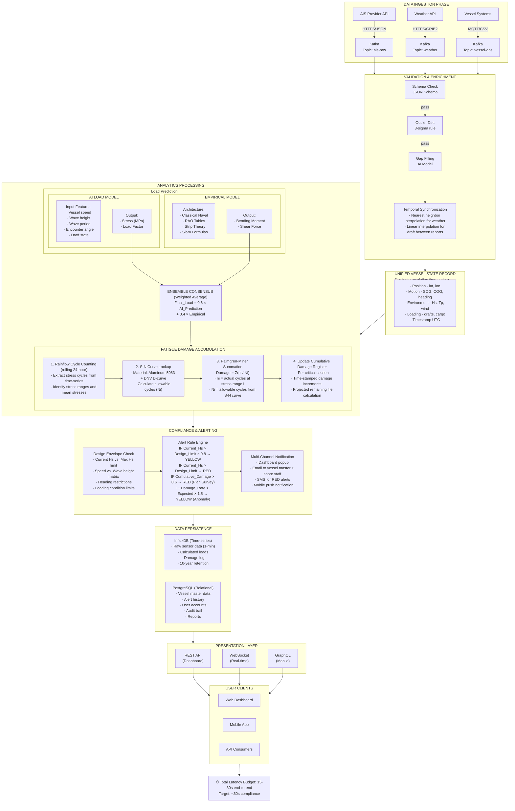

# ABS SMART SHM Tier Description:

A vessel-specific load and operation-based structural health estimation. The following are the requirements for, data collection and analysis to be employed:

- Vessel-specific **environmental and sea loads**. Can be:
  - Obtained through direct onboard measurements,
  - Derived from hindcast weather data by using vessel routing or position history.
- Vessel-specific **operational data** such as:
  - History of Cargo and other payload and loading pattern,
  - Vessel speed, heading, draft and trim.
- **Empirical Analysis** for structural strength assessment and damage prediction, using the data collected above.
- **Accumulated Fatigue Damage and Damage Rate Estimation** using the Collected Data and Analysis.


1. No sensor (strain gauge, accelerometer ...) is required.
2. The notation makes sense for ships designed for limited weather conditions or limited navigation area (i.e. non-sea-going) e.g.
   - a. High speed ships: HSC, Crew boats, FSIV, launch, OPV, etc.
   - b. Coastal navigation, Inland navigation, operation in port or in estuaries.
3. We understand that the notation relies on a monitoring system to ensure that the ship is operated within its design assumptions typically a ship-tracking digital solution (based on AIS) associated with hindcast weather data (the digital weather routing solutions available on the market would provide the expected functionalities)
4. Practically, no impact on shipyard and limited impact on ship-owner: just subscribing to a digital ship tracking solution; there are many on the market and the cost is reasonable
5. The notation applies to ships for which no FEM and no fatigue assessment is required.
   → In this sense, we do not understand the last step *"Empirical analysis – Accumulated fatigue damage & damage rate estimation"*.
 
---

# ABS SMART (SHM) TIER 1 Software — Competitor Analysis

## Application Context

The term **ABS SMART (SHM) TIER 1 software** refers to specific **structural health monitoring (SHM) software** that has received an **Approval in Principle (AIP) from the American Bureau of Shipping (ABS)** under its Guide for Smart Functions for Marine Vessels and Offshore Units.

**ABS**: The American Bureau of Shipping, a leading international classification society for marine and offshore assets.

**SMart SHM**: An optional class notation indicating the vessel is fitted with "SMART FUNCTIONS" for Structural Health Monitoring. These functions provide crew and personnel with key information to aid decision-making regarding the structural integrity of the vessel.

**Tier 1 (Manufacturer's Certification - MC)**: The first level of approval in the ABS framework. A Tier 1 system is generally a software-based approach that leverages existing operational data from the vessel to provide "virtual measurements" and structural health indicators, without requiring a complete suite of new, dedicated physical sensors. This offers a scalable and cost-effective entry point for shipowners to integrate structural health awareness into their operations.

---

# Competitor References

---

## ARGUS-VM : Analysis

**Argus-VM** is a hull monitoring concept that uses data from existing onboard systems (like position, wave and wind sensors) to calculate hull responses and provide reliable structural health indicators. This sensorless approach distinguishes it from more complex, sensor-driven systems that fall under higher tiers (e.g., tier 3).

### Key Features and Functions

- **"Sensorless" Monitoring:** Unlike traditional SHM systems that require extensive physical strain gauge installations, ARGUS-VM leverages data already available on the vessel.
- **Structural Health Indicators:** The primary function is to provide reliable indicators and insights into the structural condition of the hull based on real-time operational data.
- **Decision Support:** Provides crew and shore-based personnel with key information to aid decision-making regarding vessel safety, maintenance scheduling, and operational limits.
- **Scalability and Cost-Effectiveness:** Offers a scalable and less intrusive solution compared to fully sensor-equipped systems, making structural monitoring accessible to a wider range of vessel owners.
- **Compliance & Certification:** Meets the functional and system requirements set by the ABS *Guide for Smart Functions for Marine Vessels and Offshore Units* for the Tier 1 classification.

### Data Points & Sources

The system integrates and processes data from existing onboard systems, including:

- **Navigation systems:** Data related to vessel position, speed and heading
- **Environmental sensors**: Information about existing wave, wind, and motion sensors
- **Loading conditions:** Potential integration with cargo or ballast information systems

### Data Analysis Methodology

ARGUS-VM utilises a software-based approach to derive "virtual measurements" of hull responses. Its core methodology involves:

1. **Data Integration:** Gathering various streams of existing operational data in real time.
2. **Algorithmic Modelling:** Applying proprietary algorithms and physics-based models to correlate operational conditions with predicted hull stresses and responses. This essentially simulates or calculates the structural behaviour without direct physical strain measurements at every point.
3. **Analytics:** Processing the data to identify deviations, trends and potential issues, generating actionable insights and structural health indicators.

### Sample Output

Specific visual outputs or reports are proprietary, but the system provides actionable insights rather than raw sensor data streams. Outputs typically include:

- **Real-time dashboards:** Visual displays showing current stress levels, flagged against predefined limits.
- **Alerts & Notifications:** Automated warnings when operational conditions approach or exceed safe structural parameters.
- **Historical reports:** Generated reports for long-term analysis of structural performance, compliance metrics and maintenance planning.
- **Structural Health Scores:** Specific easy-to-understand indicators of the vessel's structural condition over time.

---

## NAPA - SHM : Analysis

### Data Points & Sources

- **Existing Onboard Data:** Integrated with existing data collection systems, logbooks (manual or automated), automation signals and NAPA's own onboard reporting tools.
- **Navigational Data:** Utilises AIS (Automated Identification System) data and GPS position data.
- **Environmental Data:** Incorporates third-party weather and environmental monitoring data.
- **Navigational charts & Sea Depth:** For navigational risk monitoring.

### Key Capabilities

- **Digital Twin Development:** NAPA builds a 'ship-specific digital twin' by combining extensive hydrodynamic calculations and design expertise with real operational data.
- **Big Data Analytics:** The platform analyses massive datasets (a starting database of millions of voyages) using advanced algorithms to establish typical operational patterns and performance baselines.
- **Virtual Sensing:** Instead of relying solely on physical sensors for structural data, the algorithms simulate/calculate hull stresses and responses based on the correlation between environmental conditions, loading, and vessel movements.
- **Trend Analysis and Verification:** Data is continuously verified and analysed to identify trends, benchmark performance, and detect anomalies or deviations from the expected baseline.

### Output

- **Real-time Operational Overview:** A map-based view showing the fleet status, operational trends, and potential weather risks with contextual overlays (e.g., speed, draft, current route).
- **Safety Alerts:** Automated notifications for noteworthy events or when operational limits are approached (e.g., grounding risk alerts).
- **Performance Reports:** Standardised and detailed reports covering technical performance, fuel efficiency, accumulated fatigue indicators (inferred), and the impact of maintenance actions (e.g., hull cleaning).
- **Voyage Optimisation Advice:** Actionable insights for onboard and shore-based teams to optimise current and future voyages based on structural and efficiency parameters.

### Data Points

#### AIS (Automatic Identification System) Data
- **Data Points:** Position (Latitude/Longitude), Speed Over Ground (SOG), Course Over Ground (COG), Heading, UTC Timestamp, Vessel Identification details (MMSI, IMO number).

#### Weather and Environmental Conditions (Third-Party Providers)
- **Data Points:** Real-time and forecasted wave condition (height, period, direction), wind speed and direction, sea depth, bathymetry, and sea current data.

#### Onboard Systems/Logbooks (Manual or Automated)
- **Data Points:** Draft (forward/aft), cargo weight and distribution (loading conditions), fuel consumption, engine load/power, machinery status, and manual noon report entries.

### Data Analysis Methodology

The core of NAPA's analysis is the integration of diverse operational data with a ship-specific digital twin model.

1. **Digital Twin Modelling:** Highly accurate, physics-based 3D models of the vessel's hull are created using NAPA's design software expertise.
2. **Hydrodynamic Calculations:** NAPA experts use advanced hydrodynamic calculations to simulate the ship's behaviour and performance under various sea states and loading conditions.
3. **Virtual Measurement/Simulation:** The system uses the real-time operational and environmental data points (speed, wave height, draft) as inputs to the digital twin. This allows the software to virtually "measure" or calculate the resulting hull stresses and structural loads that the ship is experiencing at any given moment, without physical sensors.
4. **Big Data/Historical Comparison:** Real-time data is continuously compared against a vast database of millions of historical voyages and performance baselines to identify anomalies or performance deviations.
5. **Fatigue & Life Estimation (Inferred):** By analysing the duration and severity of calculated stresses in specific sea conditions, the system can estimate long-term fatigue life consumption and advise on potential maintenance needs.

### Sample Output

Outputs are accessed via a web-based platform and are designed to be intuitive and actionable for both ship and shore teams.

- **Real-time Dashboard:** A visual interface displaying current operational parameters overlaid on a map, showing colour-coded risk zones (e.g., high stress, grounding risk areas).
- **Automated Alerts & Notifications:** Proactive warnings sent to desktop or mobile devices when calculated stress levels or navigational risks exceed predefined safety thresholds.
- **Performance and Safety Reports:** Standardised, easy-to-understand reports detailing vessel structural performance over time.

# How Do We Know a Ship Is Healthy? An Introduction to Virtual Monitoring

## Introduction: The Doctor's Diagnosis from Afar

Imagine a doctor who could diagnose a patient's health perfectly without ever physically touching them. Instead, they rely on the patient's activity log, the weather outside, and what they had for breakfast to understand every strain and stress on their body.

This is exactly what a Virtual Structural Health Monitoring (V-SHM) system does for a massive ship at sea. It acts as a vigilant, always-on health advisor, constantly checking the vessel's condition from thousands of miles away.

This document will explain how this incredible "sensorless" technology works in a simple, step-by-step way, making it easy for anyone new to marine engineering to understand. We'll explore how, by combining readily available data with a sophisticated computer model, we can ensure a ship's safety and structural integrity throughout its journey.

Let's meet this "virtual doctor" for ships and see how it makes its diagnosis.

---

## 1. What Is Virtual Structural Health Monitoring (V-SHM)?

In simple terms, Virtual Structural Health Monitoring (V-SHM) is a **"sensorless," cloud-based platform** that monitors a ship's structural health without requiring physical hardware like strain gauges or accelerometers. It's a software-driven approach that uses data and digital modelling to achieve what once required extensive, costly hardware. This is a fundamental shift from traditional monitoring, which relies on installing a costly and complex network of physical strain gauges that are expensive to maintain and can only measure stress at their specific installation points.

The primary goal of the system is to predict structural fatigue and ensure the vessel operates safely within its official, pre-approved design limits. By continuously analysing the forces acting on the ship, V-SHM helps the crew prevent problems before they can develop. This technology is not just theoretical; it's approved by major maritime authorities like the American Bureau of Shipping (ABS) under the **SMART (SHM) Tier 1 notation**, confirming its credibility and reliability in real-world conditions.

Now that we know what the system is, let's look at how it gathers its information. Just like a good doctor, a proper diagnosis starts by asking the right questions and collecting the right clues.

---

## 2. The "Virtual Doctor's" Toolkit: Gathering Clues Without Sensors

Instead of attaching physical sensors to the hull, the V-SHM system gathers three critical types of data that, when combined, paint a complete picture of the forces acting on the ship.

| Data Type | What It Is | Why It's Important (The "So What?") |
|---|---|---|
| **The Ship's Diary** | **Navigational Data (AIS/GPS):** This includes the vessel's precise position, speed, and heading at any given moment. | This tells the system exactly where the ship is, which way it's pointing, and how fast it's moving through the water. |
| **The Weather Report** | **Environmental Data:** This is third-party data on wave height, period, direction, and wind speed for the ship's specific location. | This reveals the external forces from the sea and weather that are constantly pushing, pulling, and bending the ship's hull. |
| **The Ship's Load** | **Operational Data:** This includes the ship's draft (how deep it sits in the water) and its current loading conditions (how much cargo it's carrying). | Like knowing what a patient ate for breakfast, this tells the system how the ship's own weight is distributed, which critically affects how its structure responds to stress from the waves. |

Once all this information is collected, it needs to be processed and understood by the "brain" of the operation: the vessel's digital twin.

---

## 3. The Brain of the System: The Vessel's Digital Twin

The core of the V-SHM system is the vessel's **digital twin**. It is a highly accurate, physics-based 3D computer model of that specific vessel, built using the ship's original design plans and extensive hydrodynamic calculations. Think of it as a perfect virtual copy of the ship that lives in the cloud, with the same size, shape, and structural properties as its real-world counterpart.

The function of this digital twin is straightforward but powerful: all the real-time data gathered in the previous section — the ship's position, the waves hitting it, and its loading condition — is continuously fed into this virtual model. This means the digital twin experiences the exact same environmental and operational conditions as the real ship sailing the ocean. By simulating these forces on the virtual model, the system can calculate what is happening to the physical structure.

Now, let's see how the system turns this raw data and virtual simulation into a clear diagnosis.

---

## 4. The Diagnosis: How Data Becomes a Decision

The process of turning data into a decision is logical and sequential. The V-SHM system follows a clear, three-step process to produce its analysis:

1. **Data Input** — The combined navigational, environmental, and operational data is fed into the vessel's unique digital twin. This provides the model with a complete, real-time picture of the ship's current situation.

2. **Virtual Simulation** — The digital twin runs complex hydrodynamic simulations to calculate the virtual stress and key structural loads, such as bending moments and shear forces at critical parts of the ship's structure like the main deck. It essentially predicts how the real hull is bending and flexing under the current sea conditions without needing any physical measurements.

3. **Compare and Analyse** — The system then compares these calculated stress levels against the pre-defined, class-approved safe operational limits for that specific vessel. This is the moment of diagnosis. Here, the system determines if the stress is normal or if it is approaching a level that could pose a risk to the ship's structural integrity.

Now that the system has made a diagnosis, it must communicate its findings to the crew in a way that is simple, clear, and actionable.

---

## 5. The "Doctor's Orders": From Alerts to Action

The V-SHM system is designed to provide clear, actionable information — not just raw data — to the crew on the vessel and the support teams on shore.

- **The Fleet Dashboard** — The primary interface is a visual dashboard showing the entire fleet on a map. Each vessel is represented by a colour-coded icon, providing an at-a-glance understanding of its current status:
  - **Green:** Normal. The hull stress levels are well within safe limits.
  - **Yellow:** Watch. Stress levels are elevated and should be monitored.
  - **Red:** Alert. Stress levels have approached or exceeded a critical threshold, requiring immediate attention. The dashboard also includes an accompanying alert log that provides historical context and details on any warnings or critical events.

- **Actionable Alerts** — If a vessel's calculated stress level enters a "Yellow" or "Red" state, the system automatically generates an alert for the crew and shore personnel. This ensures that a potential issue never goes unnoticed.

- **Corrective Advice** — Crucially, the system doesn't just raise an alarm; it provides **suggested corrective actions** to mitigate the risk. Based on its analysis, the V-SHM platform might advise the crew to **"reduce speed or alter course"** to lessen the impact of the waves and bring the structural stress back down to a safe level. This transforms the system from a simple monitor into a proactive safety partner.

This journey — from gathering data clues to providing clear, life-saving advice — is what makes virtual monitoring so powerful.

---

## 6. Conclusion: A Smarter, Safer Way to Sail

Virtual Structural Health Monitoring represents a major leap forward in marine safety. By combining real-world data from existing onboard systems with a sophisticated digital twin, it is possible to continuously monitor a ship's structural health without installing a single physical sensor.

Bringing our analogy full circle, the V-SHM system acts as a vigilant, predictive health advisor for every vessel in the fleet. It doesn't just report on the ship's current condition; it helps the crew anticipate and prevent structural problems before they happen. This shift from reactive fixes to predictive, condition-based maintenance not only enhances safety but also optimises the vessel's entire lifecycle, reducing downtime and operational costs. As technology continues to evolve, digital tools and data analysis like this are transforming modern marine engineering, making sailing smarter, more efficient, and, most importantly, safer for everyone.

# Project Scope: Virtual Structural Health Monitor (V-SHM) Software

This project scope outlines the development of a software solution for **Virtual Structural Health Monitoring (V-SHM)**, designed to compete with ARGUS-VM and NAPA Fleet Intelligence SHM TIER 1 solutions. The system will adhere strictly to the requirements of the ABS Guide for Smart Functions for Marine Vessels and Offshore Units to achieve ABS SMART (SHM) Tier 1 approval.

---

## 1. Project Goal

To deliver a reliable, cloud-based software solution that monitors the structural health of marine vessels using existing operational data (a "sensorless" approach), provides actionable insights to crew and shore personnel, and achieves ABS Product Design Assessment (PDA) certification for the SMART (SHM) Tier 1 notation.

---

## 2. Functional Requirements

The software must perform the following core functions:

- **Data Ingestion & Validation:** Automatically collect, validate, and timestamp operational, navigational, and environmental data streams.
- **Vessel-Specific Digital Twin:** Host and run a unique physics-based model (digital twin) for each enrolled vessel, simulating structural behaviour based on real-time inputs.
- **Real-time Stress Calculation:** Continuously calculate virtual hull stresses, bending moments, and fatigue accumulation rates.
- **Alerting Mechanism:** Generate automated alerts when calculated stress levels approach or exceed predefined class-approved limits and operational thresholds.
- **Reporting & Analytics:** Provide customisable dashboards and historical data logging for long-term trend analysis, maintenance planning, and class survey verification.

---

## 3. Performance Requirements

- **Availability:** The cloud platform shall maintain 99.9% uptime.
- **Latency:** Data processing and alert generation must occur with minimal latency (e.g., within 60 seconds of data ingestion) to support timely decision-making.
- **Scalability:** The architecture must be scalable to monitor hundreds of vessels simultaneously.
- **Data Integrity:** Strong measures must be implemented to ensure data is tamper-proof and authentic.

---

## 4. Data Sources and Data Points (Inputs)

The system will ingest data from existing sources on the vessel:

- **AIS/GPS:** Position (Lat/Long), Speed Over Ground (SOG), Course Over Ground (COG), Heading, Time Stamp.
- **Environmental Data Feeds:** Third-party API integration for localised real-time and forecasted data:
  - Wave height, period, and direction
  - Wind speed and direction
  - Sea current data and bathymetry
- **Vessel Systems Integration:** Interfaces with the vessel's data collection systems to obtain:
  - Draft (Fwd/Aft/Mid)
  - Cargo/Ballast loading conditions
  - Engine power/load data

---

## 5. Analysis Methodology

The methodology will be a hybrid approach combining data analytics with physics-based modelling:

- **Physics-based Digital Twin:** Leveraging naval architecture principles, a high-fidelity hydrodynamic model of each ship will be used to simulate structural responses to environmental and operational loads.
- **Data-driven Calibration:** Machine learning algorithms will be trained and tested with extensive data sets to refine and verify the digital twin's accuracy against actual operational data.
- **Risk-Informed Analytics:** Applying the models to identify critical performance parameters and potential failure points, providing risk assessments in real-time.

---

## 6. System Output and User Interface

The output will be delivered via a secure web portal and a light onboard client (for local alerts).

- **Sample Dashboard View:** A geographical map displaying fleet location with colour-coded vessel icons (Green: Normal, Yellow: Watch, Red: Alert). Clicking a vessel reveals a detailed panel with current hull stress indicators and operational limits.
- **Alerting Interface:** A dedicated alerts log, categorised by severity, with timestamps and suggested actions/context.
- **Fatigue Life Module:** A graphical representation of estimated accumulated fatigue life consumption over time for key structural areas.

---

## 7. ABS Certification Plan

The project plan includes a dedicated phase for certification:

- **Documentation Submission:** Preparation and submission of all design, functional, and performance requirement documents to ABS for review.
- **Prototype Validation:** Conducting a detailed Inspection Test Plan (ITP) for ABS review during a validation stage.
- **Software Provider Certification:** Notifying ABS for assessment for conformity to the ABS Software Provider Conformity Program (ISQM USC or ISQM PDA) Tier 1 requirements, asserting an ISO 9001 quality management program in place.
- **Cybersecurity Compliance:** Ensuring the software and data infrastructure (SMART (INF) notation readiness) meet IACS Unified Requirements E26 and E27 for cyber resilience.

---

## Data Sources and Data Points (Inputs)

The V-SHM system is entirely reliant on existing data infrastructure. We categorise inputs into three primary streams:

| Data Source Stream | Specific Source Systems | Data Points Acquired | Frequency |
|---|---|---|---|
| **1. Navigational & Positional** | AIS Transceiver, GPS Unit | Latitude, Longitude, Heading, SOG (Speed Over Ground), COG (Course Over Ground), UTC Timestamp | Continuous/Every seconds |
| **2. Environmental & Weather** | Third-Party Weather APIs (e.g., Meteomatics, StormGeo) | Significant Wave Height (H sub s), Wave Period (T sub p), Wave Direction, Wind Speed/Direction, Sea Current Velocity | Hourly Forecast / Real-time updates |
| **3. Operational & Loading** | Onboard Data Acquisition System (DAS), Manual Input/Logbooks | Fwd Draft, Aft Draft, Mid Draft, Cargo Weight/Distribution, Fuel Consumption, Trim/Heel Angle, Engine RPM/Load | Varies (Hourly/Per Voyage/Real-time) |

---

## Data Flow Explanation: A Real-World Scenario

**Scenario:** A large container vessel is crossing the North Atlantic, heading into an area of forecasted heavy weather.

### The Data Flow Process

1. **Data Generation (Onboard):**
   - The vessel's GPS unit generates a position data point every second.
   - The AIS transceiver broadcasts this position and speed.
   - The DAS records the current Fwd and Aft drafts (loading condition) every minute.

2. **Data Transmission (Ship-to-Shore):**
   - The onboard systems bundle this data. It is transmitted via satellite communication (e.g., Inmarsat Fleet Xpress) to the cloud environment hosting the V-SHM software.
   - Simultaneously, the cloud platform queries a third-party weather API for the exact location of the vessel (based on AIS data) to retrieve local wave height (H sub s) and period (T sub p) forecasts.

3. **Data Ingestion & Processing (Cloud/V-SHM Software):**
   - The V-SHM software validates all incoming data points, synchronising timestamps.
   - **Crucial Step:** The validated data points (speed, draft, wave height, wave direction, heading) are fed into the vessel's specific **Digital Twin model**.

4. **Analysis and "Virtual Measurement":**
   - The digital twin runs hydrodynamic simulations. It calculates the resulting virtual stress on critical hull sections (e.g., the main deck near the amidships area) based on the combined effect of the current speed through those specific waves at that specific draft.

5. **Output and Alerting:**
   - The calculated stress levels are compared against predefined ABS-approved operational limits.
   - **Sample Output:** The V-SHM dashboard updates in real-time, showing "Calculated Midship Bending Moment: 85% of Limit." An automated **Yellow Alert (Watch Condition)** is triggered because the limit has exceeded 80%. An email/dashboard notification is sent to the Master and the shore operations team.

6. **Action:**
   - The Master receives the alert and the system's suggestion: "Reduce speed to 14 knots to decrease bending moment below 70% limit." The crew adjust operations accordingly.

---

## Risks And Mitigations

### Risk 1: Data Completeness and Intermittency (Satellite Communication Loss)

- **Risk:** Satellite communication drops out due to bad weather or coverage gaps (e.g., polar routes), leading to missing input data points needed for the digital twin calculation.
- **Impact:** Inability to perform real-time SHM analysis, creating a safety gap during potentially high-risk periods.
- **Mitigation:**
  - **Data Buffering:** Implement robust onboard data acquisition units that buffer data locally during comms loss and upload automatically once connectivity resumes.
  - **Forecast-Based Projections:** If real-time data is missing, the system defaults to using recent confirmed data and forecasted environmental conditions to generate projected risk assessments until connectivity is restored, with a clear flag that the output is a projection.

---

### Risk 2: Data Quality and Integrity (Bad or Corrupt Data)

- **Risk:** A faulty GPS unit sends erroneous position data, or a manual entry for "Aft Draft" is incorrect, leading the digital twin to calculate wildly inaccurate (potentially dangerously low) stress levels.
- **Impact:** The V-SHM system provides a false sense of security or generates frequent false alarms, leading to operational inefficiency and distrust in the system.
- **Mitigation:**
  - **Data Validation Routines:** Implement strict validation checks upon ingestion (e.g., speed cannot exceed vessel maximum speed; drafts must be within design parameters).
  - **Redundancy Checks:** Cross-reference data points where possible (e.g., if GPS location is invalid, use previous AIS tracks for location interpolation).
  - **Anomaly Detection:** Use basic machine learning to flag data points that fall outside statistically normal operating ranges for that specific vessel.

---

### Risk 3: Model Accuracy (Digital Twin Calibration Error)

- **Risk:** The digital twin model, while physics-based, doesn't perfectly represent the actual vessel's unique structural behaviour or has drifted from reality over time due to wear and tear.
- **Impact:** The core analysis methodology is flawed, and the output is unreliable for critical safety decisions.
- **Mitigation:**
  - **ABS Certification & Validation:** The entire methodology and the digital twin creation process must be rigorously reviewed and approved by ABS (PDA approval).
  - **Periodic Recalibration:** Mandate periodic (e.g., annual or every 5 years) review and recalibration of the digital twin model based on physical surveys, maintenance records, and long-term performance data analysis.
  - **Operational Feedback Loop:** Implement a process for crew feedback on system alerts and actual observed conditions to continuously refine the model's accuracy.

# 1. Executive Summary

## 1.1 Product Overview

**V-SHM TIER 1** is a cloud-based, AI-powered structural health monitoring platform designed for vessels operating in restricted conditions. The system achieves ABS SMART (SHM) TIER 1 notation through a **sensorless approach**, leveraging existing operational data, AIS tracking, and environmental data to predict structural fatigue and ensure operational compliance.

## 1.2 Key Differentiators

| Feature | V-SHM TIER 1 Approach |
|---|---|
| **Zero Hardware** | No strain gauges, accelerometers, or physical sensors required |
| **AI-Driven** | Machine learning models for pattern recognition and anomaly detection |
| **Cost Efficiency** | Significant reduction in cost when compared to sensor-based systems |
| **Rapid Deployment** | 48-hour onboarding per vessel vs. months for hardware installation |
| **Predictive Intelligence** | Fatigue damage forecasting with 14-day advance warnings |

## 1.3 Target Vessels

- High-speed craft (HSC, crew boats, FSIV)
- Offshore patrol vessels (OPV)
- Coastal and inland navigation vessels
- Port and estuary operations
- Vessels designed for limited weather windows

---

# 2. Product Vision & Objectives

## 2.1 Vision Statement

"Enable vessel operators to maximize structural life and operational safety through intelligent, non-intrusive monitoring that learns from operational patterns and environmental exposure."

## 2.2 Business Objectives

1. **Regulatory Compliance**: Achieve ABS SMART (SHM) TIER 1 certification
2. **Market Penetration**: Capture 15% of high-speed craft market (Year 1)
3. **Cost Leadership**: Deliver monitoring at 1/5 the cost of sensor-based solutions
4. **Operational Excellence**: Reduce unplanned maintenance by 30%
5. **Safety Enhancement**: Zero structural failures for monitored vessels

## 2.3 Technical Objectives

1. **Real-time Processing**: Position-to-alert latency < 60 seconds
2. **Prediction Accuracy**: Fatigue damage estimation ±8% vs. actual measurements
3. **System Reliability**: 99.9% uptime SLA
4. **Scalability**: Support 500+ vessels per platform instance
5. **Data Integrity**: 100% audit trail for regulatory compliance

```mermaid
graph TB
    subgraph PLATFORM["V-SHM TIER 1 PLATFORM (Cloud-Hosted)"]
        
        subgraph DL["DATA LAYER"]
            D1[AIS Ingestion]
            D2[Weather APIs]
            D3[Vessel Systems]
            D4[Master Data]
        end

        subgraph AL["ANALYTICS LAYER"]
            A1[AI/ML Engine]
            A2[Load Models]
            A3[Fatigue Calc]
            A4[Compliance]
        end

        subgraph PL["PRESENTATION LAYER"]
            P1[Web Dashboard]
            P2[Mobile App]
            P3[Alert Service]
            P4[Reporting API]
        end

        subgraph DVT["DATA VALIDATION & TRANSFORMATION"]
            V1[Schema Validation]
            V2[Outlier Detection]
            V3[Gap Filling - AI]
            V4[Temporal Synchronization]
        end

        subgraph UA["USER ACCESS"]
            U1[Ship Crew]
            U2[Shore Staff]
            U3[Fleet Mgmt]
            U4[Inspectors]
        end

        DL -->|feeds| AL
        AL -->|feeds| PL
        DVT -->|validates| DL
        DVT -->|validates| AL
        PL -->|serves| UA
    end
```



## 3.2 Component Architecture

### 3.2.1 Data Layer Components

| Component | Technology | Purpose |
|---|---|---|
| **AIS Aggregator** | Kafka Streams | Real-time position data ingestion from AIS providers |
| **Weather Orchestrator** | Apache Airflow | Scheduled hindcast/forecast data retrieval |
| **Vessel Data Adapter** | REST API Gateway | Standardised interface for ship systems integration |
| **Master Data Repository** | PostgreSQL | Vessel specifications, design envelopes, S-N curves |

### 3.2.2 Analytics Layer Components

| Component | Technology | Purpose |
|---|---|---|
| **AI Inference Engine** | TensorFlow Serving | Real-time ML model execution for load prediction |
| **Load Calculator** | Python (NumPy/SciPy) | Empirical formula-based structural load computation |
| **Fatigue Accumulator** | InfluxDB + Python | Time-series damage calculation (Palmgren-Miner) |
| **Compliance Monitor** | Rules Engine (Drools) | Design envelope boundary checking |

### 3.2.3 Presentation Layer Components

| Component | Technology | Purpose |
|---|---|---|
| **Dashboard Backend** | Node.js (Express) | RESTful API for frontend clients |
| **Web Frontend** | React.js | Responsive web dashboard |
| **Mobile App** | React Native | iOS/Android native apps for alerts |
| **Notification Service** | Firebase Cloud Messaging | Push notifications, email, SMS alerts |

---

## 4. Data Sources & Specifications

### 4.1 Data Source Matrix

| Source Category | Provider Examples | Update Frequency | Critical Data Points | Data Volume |
|---|---|---|---|---|
| **AIS Tracking** | MarineTraffic, VesselFinder, exactEarth | 10–30 seconds | Position, SOG, COG, Heading, Timestamp | ~3 KB/update |
| **Environmental** | NOAA GFS, ECMWF, Copernicus Marine | 1–6 hours | Hs, Tp, Wave Direction, Wind Speed/Dir | ~15 KB/hour |
| **Operational** | Ship's DAS, Noon Reports, Loading Computer | Variable (1 hr – 1 day) | Draft F/A/M, Cargo Weight, Trim, Engine Load | ~5 KB/entry |
| **Master Data** | Classification Society, Ship Builder | Static (updates on survey) | GA Plans, Scantlings, S-N Curves, Limits | ~50 MB/vessel |


## 4.2 Detailed Data Specifications

### 4.2.1 AIS Data Structure
```json
{
  "message_type": "position_report",
  "mmsi": 123456789,
  "imo": 9123456,
  "timestamp": "2025-12-03T14:23:45Z",
  "position": {
    "latitude": 1.2567,
    "longitude": 103.8190,
    "accuracy": "high"
  },
  "navigation": {
    "sog": 18.5,
    "cog": 245.0,
    "heading": 247.0,
    "rot": 0.0,
    "nav_status": "under_way_using_engine"
  },
  "quality_flags": {
    "position_valid": true,
    "speed_valid": true
  }
}
```

**Validation Rules:**
- Latitude: -90 to +90
- Longitude: -180 to +180
- SOG: 0 to vessel_max_speed + 5 knots (outlier tolerance)
- COG/Heading: 0-359 degrees
- Temporal gap tolerance: 5 minutes (flag if exceeded)

---

### 4.2.2 Environmental Data Structure
```json
{
  "source": "NOAA_GFS",
  "forecast_time": "2025-12-03T15:00:00Z",
  "reference_time": "2025-12-03T12:00:00Z",
  "location": {
    "latitude": 1.25,
    "longitude": 103.82,
    "grid_resolution": "0.25_degree"
  },
  "wave_data": {
    "significant_height": 1.8,
    "peak_period": 6.5,
    "mean_direction": 120.0,
    "directional_spread": 25.0
  },
  "wind_data": {
    "speed_10m": 12.5,
    "direction_10m": 135.0,
    "gust_speed": 15.2
  },
  "current_data": {
    "surface_speed": 0.8,
    "surface_direction": 95.0
  }
}
```

**Validation Rules:**
- Hs: 0-20m (flag if >15m for coastal vessels)
- Tp: 2-25 seconds
- Wind speed: 0-50 m/s (flag if >25 m/s)
- Spatial Interpolation: Bi-linear for vessel positions between grid points

---

### 4.2.3 Operational Data Structure
```json
{
  "vessel_imo": 9123456,
  "report_type": "noon_report",
  "report_time": "2025-12-03T12:00:00Z",
  "loading_condition": {
    "draft_forward": 3.45,
    "draft_aft": 3.72,
    "draft_midship": 3.58,
    "trim": 0.27,
    "heel": 0.5,
    "cargo_weight": 450.5,
    "cargo_distribution": [
      {"hold": "1", "weight": 120.0, "lcg": 45.2},
      {"hold": "2", "weight": 180.5, "lcg": 55.8},
      {"hold": "3", "weight": 150.0, "lcg": 68.5}
    ],
    "fuel_onboard": 85.2,
    "ballast_weight": 120.0
  },
  "machinery": {
    "main_engine_load": 75.5,
    "rpm": 1850,
    "fuel_consumption_24h": 12.5
  }
}
```

**Validation Rules:**
- Draft: Within vessel min/max operating drafts
- Trim: Within stability book limits
- Cargo weight: ≤ deadweight capacity
- LCG: Verify against stability limits

---

### 4.2.4 Master Data Structure
```json
{
  "vessel_id": "9123456",
  "vessel_name": "MV EXAMPLE",
  "vessel_type": "high_speed_crew_boat",
  "class_notation": "ABS_SMART_SHM_TIER1_pending",
  "principal_dimensions": {
    "loa": 42.5,
    "lbp": 38.0,
    "breadth": 8.5,
    "depth": 3.8,
    "design_draft": 2.8,
    "lightship": 180.0,
    "deadweight": 75.0
  },
  "design_envelope": {
    "max_significant_wave_height": 2.5,
    "max_wind_speed": 20.0,
    "max_speed_in_waves": [
      {"hs_range": [0, 1.0], "max_speed": 25.0},
      {"hs_range": [1.0, 1.5], "max_speed": 20.0},
      {"hs_range": [1.5, 2.5], "max_speed": 15.0}
    ],
    "restricted_heading_sectors": [
      {"wave_dir_range": [150, 210], "speed_limit": 12.0}
    ]
  },
  "structural_data": {
    "hull_material": "marine_grade_aluminum_5083",
    "critical_sections": [
      {
        "section_id": "midship_bottom",
        "location_frame": 19,
        "stress_concentration_factor": 1.15,
        "allowable_stress": 85.0,
        "sn_curve": "DNV_D_curve"
      }
    ]
  }
}
```

## 5 Data Flow Architecture
### 5.1 End-to-End Data Flow Diagram



## 5.2 Data Processing Latency Budget

| Stage | Target Latency | Technology | Notes |
|---|---|---|---|
| AIS Provider + Kafka | 5-10 seconds | REST API polling | Depends on provider SLA |
| Kafka + Validation | <1 second | Stream processing | In-memory operations |
| Validation + Enrichment | 2-3 seconds | AI gap-filling | CPU-accelerated inference |
| Analytics (Load Calc) | 1-2 seconds | Python/NumPy | Vectorized operations |
| Fatigue Update | 5-10 seconds | Time-series DB write | Batch micro-writes |
| Alert Generation | <1 second | Rules engine | Event-driven triggers |
| **Total (Position + Alert)** | **15-30 seconds** | **End-to-end** | **Target: <60s compliance** |

---

## 6. AI/ML Models & Analytics

### 6.1 AI Model Portfolio

#### 6.1.1 Primary Model: Load Prediction Neural Network

**Model Architecture:**
```
Input Layer (12 features)
    +
Dense(128, ReLU) + Dropout(0.2)
    +
Dense(64, ReLU) + Dropout(0.2)
    +
Dense(32, ReLU)
    +
Output Layer (4 outputs, Linear)
    · Midship bending moment
    · Bow stress
    · Stern stress
    · Torsional load
```

**Training Data Requirements:**
- Historical dataset: 100,000+ vessel-hours across 50+ vessels
- Features: SOG, COG, Hs, Tp, wave direction, draft, trim, displacement, encounter angle, hull form coefficients
- Labels: Calculated loads from empirical formulas (initial training), refined with in-service validation data

**Model Performance Metrics:**
- MAE (Mean Absolute Error): <5% of design limit
- R² Score: >0.92
- Inference time: <50ms per prediction

**Update Frequency:**
- Retraining: Quarterly with new operational data
- Online learning: Disabled (maintain model stability for regulatory approval)

#### 6.1.2 Secondary Model: Anomaly Detection

**Model Type:** Isolation Forest (Unsupervised)

**Purpose:** Detect unusual operational patterns that may indicate:
- Sensor malfunction
- Unreported damage
- Operational envelope violations
- Data quality issues

**Features:**
- Stress-to-environment ratios
- Speed-in-waves compliance
- Loading pattern deviations
- Temporal change rates

**Alert Threshold:** Anomaly score >0.7 triggers investigation workflow

#### 6.1.3 Gap-Filling Model: Data Imputation

**Model Type:** Bidirectional LSTM

**Purpose:** Fill missing data gaps when AIS/weather data is temporarily unavailable

**Capabilities:**
- Interpolate position for gaps <30 minutes
- Estimate draft based on recent loading patterns
- Predict wave conditions from nearby grid points

**Confidence Scoring:** Each imputed value tagged with confidence (0-1)

---

### 6.2 Empirical Analysis Models

#### 6.2.1 Wave-Induced Load Calculation

**For High-Speed Craft (Primary Target):**
```python
def calculate_slam_load(vessel, speed, Hs, Tp, encounter_angle):
    """
    Empirical slamming load model for high-speed craft
    Based on DNV-RP-C205 and ABS HSC Guide
    """
    # Relative wave encounter
    lambda_w = 1.56 * (Tp ** 2)  # Wavelength (m)
    encounter_freq = calculate_encounter_frequency(speed, lambda_w, encounter_angle)

    # Slamming probability
    V_rel = speed * cos(encounter_angle) + 0.5 * sqrt(g * lambda_w)
    P_slam = slam_probability(V_rel, Hs, vessel.bow_geometry)

    # Peak pressure
    P_max = 0.5 * rho_water * (V_rel ** 2) * vessel.deadrise_angle_factor

    # Structural response
    bending_moment = P_max * vessel.pressure_distribution_factor * vessel.section_modulus

    return {
        'bending_moment': bending_moment,  # kN·m
        'slam_probability': P_slam,
        'encounter_frequency': encounter_freq,
        'confidence': 0.85  # Model confidence
    }
```

**For Conventional Hull Forms:**
```python
def calculate_wave_bending(vessel, Hs, Tp, encounter_angle):
    """
    Strip theory-based wave bending moment
    Based on IACS UR S11 and Lloyd's SSC
    """
    # Fetch Response Amplitude Operator (RAO) from vessel master data
    RAO_data = vessel.rao_table[Tp]  # Pre-computed from hydrodynamic model

    # Wave bending moment amplitude
    M_wave_amp = RAO_data['vertical_BM'] * Hs * vessel.L ** 2 * vessel.B * vessel.Cb

    # Apply heading correction
    heading_factor = cos(encounter_angle) ** 2  # Simplified

    # Most probable extreme in 3-hour period
    M_extreme = M_wave_amp * heading_factor * 1.9  # 1.9 = Rayleigh factor

    return {
        'sagging_moment': M_extreme,
        'hogging_moment': -M_extreme * 0.85,
        'confidence': 0.90
    }
```

---

### 6.2.2 Fatigue Damage Calculation

**Rainflow Counting Implementation:**
```python
def rainflow_count(stress_history):
    """
    Rainflow cycle counting algorithm (ASTM E1049)
    Extracts stress cycles from irregular time-series
    """
    cycles = []
    residue = []

    # Step 1: Identify peaks and troughs
    peaks_troughs = identify_turning_points(stress_history)

    # Step 2: Extract closed cycles
    for point in peaks_troughs:
        residue.append(point)

        while len(residue) >= 3:
            X, Y, Z = residue[-3:]

            # Check for closed cycle (Y-X and Z-Y)
            range_YX = abs(Y - X)
            range_ZY = abs(Z - Y)

            if range_YX <= range_ZY:
                # Closed cycle found
                stress_range = range_YX
                mean_stress = (X + Y) / 2
                cycles.append({
                    'range': stress_range,
                    'mean': mean_stress,
                    'count': 0.5  # Half cycle
                })
                residue.pop(-2)  # Remove Y
            else:
                break

    # Step 3: Process residue
    # (pair remaining peaks/troughs)

    return cycles
```

**Palmgren-Miner Damage Summation:**
```python
def calculate_fatigue_damage(stress_cycles, vessel_section):
    """
    Calculate cumulative fatigue damage using Palmgren-Miner rule
    """
    total_damage = 0.0

    # Get S-N curve parameters for material
    sn_curve = vessel_section.material.sn_curve  # e.g., "DNV_D_curve"
    m = sn_curve.slope   # Typically 3.0 for welded steel, 5.0 for aluminum
    A = sn_curve.intercept  # Material constant

    for cycle in stress_cycles:
        stress_range = cycle['range']
        cycle_count = cycle['count']

        # Apply stress concentration factor
        stress_range_actual = stress_range * vessel_section.SCF

        # Calculate allowable cycles at this stress range
        # N = A / (S^m)
        N_allowable = A / (stress_range_actual ** m)

        # Add partial damage
        partial_damage = cycle_count / N_allowable
        total_damage += partial_damage

    return {
        'damage_increment': total_damage,
        'cycles_processed': len(stress_cycles),
        'timestamp': now()
    }
```

---

### 6.3 Compliance Monitoring Logic

**Design Envelope Check:**
```python
def check_design_envelope_compliance(vessel_state, design_envelope):
    """
    Real-time compliance checking against design limits
    Returns alert level and recommended actions
    """
    alerts = []

    # Check 1: Wave height limit
    if vessel_state.Hs > design_envelope.max_Hs * 0.8:
        alerts.append({
            'level': 'YELLOW' if vessel_state.Hs <= design_envelope.max_Hs else 'RED',
            'parameter': 'wave_height',
            'current_value': vessel_state.Hs,
            'limit': design_envelope.max_Hs,
            'message': f'Wave height {vessel_state.Hs:.1f}m approaching/exceeding limit {design_envelope.max_Hs:.1f}m',
            'recommendation': 'Reduce speed or alter course to avoid heavy weather'
        })

    # Check 2: Speed in waves
    max_allowed_speed = design_envelope.get_max_speed_for_waves(vessel_state.Hs)
    if vessel_state.SOG > max_allowed_speed:
        alerts.append({
            'level': 'ORANGE',
            'parameter': 'speed_in_waves',
            'current_value': vessel_state.SOG,
            'limit': max_allowed_speed,
            'message': f'Speed {vessel_state.SOG:.1f} kts exceeds limit {max_allowed_speed:.1f} kts for Hs={vessel_state.Hs:.1f}m',
            'recommendation': f'Reduce speed to {max_allowed_speed:.1f} knots'
        })

    # Check 3: Heading restrictions (following/quartering seas)
    relative_wave_dir = (vessel_state.heading - vessel_state.wave_direction) % 360
    for restricted_sector in design_envelope.heading_restrictions:
        if restricted_sector['start'] <= relative_wave_dir <= restricted_sector['end']:
            if vessel_state.SOG > restricted_sector['max_speed']:
                alerts.append({
                    'level': 'ORANGE',
                    'parameter': 'restricted_heading',
                    'message': f'Heading {vessel_state.heading}° in restricted sector (following seas)',
                    'recommendation': 'Alter course by 30° or reduce speed'
                })

    # Check 4: Loading condition
    if vessel_state.draft_fwd < design_envelope.min_draft:
        alerts.append({
            'level': 'YELLOW',
            'parameter': 'light_draft',
            'message': 'Forward draft below minimum - increased slamming risk',
            'recommendation': 'Consider ballasting forward tanks'
        })

    return alerts
```

---

## 7. Core Workflows
## 7. Core Workflows

### 7.1 Vessel Onboarding Workflow
```
VESSEL ONBOARDING PROCESS
(Target: 48 hours)
```

**STEP 1: INITIAL DATA COLLECTION (Day 0, Hours 0-4)**
- Input: Vessel IMO number
- Action: Automated scraping of public registries
  - IHS Sea-web database query
  - Classification society records pull
  - AIS historical data retrieval (past 90 days)
- Output: Basic vessel profile created
- Human Verification: Fleet manager reviews auto-populated data

**STEP 2: TECHNICAL SPECIFICATION UPLOAD (Day 0, Hours 4-8)**
- Input: PDF/DWG files from ship owner
  - General arrangement plan
  - Midship section drawing
  - Stability booklet
  - Loading manual
- Action: AI document parser extracts:
  - Principal dimensions (LOA, B, D, T)
  - Structural scantlings (plate thickness, stiffener spacing)
  - Material specifications
  - Design operational envelope
- Output: Structured master data record
- Human Verification: Marine engineer validates extraction accuracy

**STEP 3: DIGITAL TWIN GENERATION (Day 0-1, Hours 8-24)**
- Input: Validated master data
- Action: Automated hydrodynamic model creation
  - Hull form discretization (100 stations)
  - RAO calculation (15 wave periods × 12 headings)
  - Pressure distribution mapping
  - Structural stress point identification
- Processing: Cloud compute cluster (4-core job)
- Output: Vessel-specific digital twin model
- Quality Check: Compare calculated vs. design displacement (±2% tolerance)

**STEP 4: DATA SOURCE INTEGRATION (Day 1, Hours 24-32)**
- AIS Connection:
  - Register vessel MMSI with AIS provider API
  - Set up real-time webhook for position updates
  - Test: Verify position reception (5-minute window)
- Weather Integration:
  - Configure geo-fencing for vessel operating area
  - Set hindcast/forecast refresh intervals
  - Test: Fetch weather for vessel's last known position
- Operational Data:
  - IF vessel has DAS: Configure API connector
  - ELSE: Set up email-to-database for noon reports
  - Test: Simulate data submission and parsing
- Output: Data pipeline operational

**STEP 5: BASELINE CALIBRATION (Day 1-2, Hours 32-48)**
- Input: 90 days of historical AIS + weather data
- Action: Retrospective analysis
  - Calculate historical load exposure
  - Establish operational pattern baseline
  - Identify typical vs. extreme conditions
  - Tune AI model weights for vessel-specific behaviour
- Output: Calibrated monitoring system
- Deliverable: Baseline report showing:
  - Historical compliance rate (should be >90% for well-designed vessel)
  - Typical stress range histogram
  - Estimated pre-monitoring fatigue accumulation

**STEP 6: GO-LIVE & HANDOVER (Day 2, Hour 48)**
- Dashboard activation: User accounts created
- Training: 1-hour webinar for ship crew + shore staff
- Alert configuration: Set notification preferences
- Documentation: Deliver operation manual
- Status: Vessel monitoring ACTIVE
  - Real-time dashboard live
  - Alert system armed
  - Fatigue accumulation tracking started

**POST-ONBOARDING**
- Week 1: Daily check-ins with fleet manager
- Month 1: Review initial findings report
- Month 3: System performance review & fine-tuning

**Onboarding Success Criteria:**
- ✓ AIS position updates received every <5 minutes
- ✓ Weather data matched to position within 0.5° lat/lon
- ✓ Digital twin calculates loads within ±10% of empirical formulas
- ✓ Dashboard loads in <3 seconds
- ✓ Test alert delivered within 60 seconds

---

### 7.2 Real-Time Monitoring Workflow
```
CONTINUOUS MONITORING LOOP (1-minute cycle)
```

**00:00 - DATA ACQUISITION PHASE**

- AIS Update:
  - Receive: Position (lat/lon), SOG, COG, Heading, Timestamp
  - Validate: Position within ±100nm of last position (speed check)
  - Store: Raw AIS message in InfluxDB
- Weather Query:
  - API Call: GET /hindcast?lat={}&lon={}&time={}
  - Receive: Hs, Tp, wave_dir, wind_speed, wind_dir
  - Spatial Interpolation: If position between grid points
  - Store: Weather data record linked to vessel position
- Operational Data (if available):
  - Check: New noon report or DAS update since last cycle?
  - IF YES: Parse and extract draft, cargo, trim
  - IF NO: Use last known values
  - Store: Loading condition snapshot

**00:15 - DATA VALIDATION & SYNCHRONIZATION**

- Temporal Alignment:
  - Ensure all data points share same timestamp (±30 seconds)
  - IF gap detected: Trigger gap-filling AI model
  - Tag: Mark imputed values with confidence score
- Outlier Detection:
  - Check: SOG < vessel_max_speed + 5 knots
  - Check: Hs < 20m (physical sanity)
  - Check: Draft within min/max operating range
  - IF fail: Flag for human review, use previous valid value
  - Log: Data quality metrics
- Create: Unified Vessel State Record (UVSR)
  - UVSR contains: position, motion, environment, loading (17 fields)

**00:30 - LOAD CALCULATION PHASE**

- Parallel Processing:
  - Thread 1: AI Model Inference
    - Input: UVSR + Feature vector (12 features)
    - GPU Execution: Neural network forward pass (<50ms)
    - Output: Predicted stresses [midship, bow, stern, torsion]
  - Thread 2: Empirical Model
    - Input: UVSR
    - IF high_speed_craft:
      - Calculate: Slamming load (empirical formula)
    - ELSE:
      - Calculate: Wave bending (RAO-based)
    - Output: Calculated stresses
- Ensemble Fusion:
  - Weighted Average: Final = 0.6×AI + 0.4×Empirical
  - Confidence Score: Based on agreement between models
    - IF difference <10%: High confidence (0.9)
    - IF difference >30%: Low confidence (0.5) → Trigger review
  - Output: Final stress estimates with confidence
- Store: Load calculation results in time-series DB

**00:45 - COMPLIANCE & ALERT EVALUATION**

- Design Envelope Check:
  - Compare: Current Hs vs. vessel.max_Hs
  - Compare: Current speed vs. speed_limit(Hs)
  - Compare: Heading vs. restricted sectors
  - Compare: Calculated stress vs. allowable stress
  - Generate: Compliance status (GREEN/YELLOW/ORANGE/RED)
- Alert Logic:
  - IF YELLOW: Log event, dashboard notification
  - IF ORANGE: Email to shore + dashboard
  - IF RED: Email + SMS + mobile push + dashboard (CRITICAL)
  - Cooldown: Don't re-alert same condition for 30 minutes
- Store: Alert records with acknowledgment tracking

**00:50 - FATIGUE UPDATE (Every 60 minutes)**

- Trigger: If clock_time.minute == 0 (hourly batch)
- Input: Last 24 hours of stress time-series (1,440 data points)
- Process:
  - Rainflow Counting: Extract stress cycles
  - S-N Curve Lookup: Get allowable cycles for each range
  - Damage Calculation: Σ(ni/Ni) for all cycles
  - Update: Cumulative damage register
    - Vessel.total_damage += hourly_damage
    - Vessel.damage_rate_30day = rolling_average(30 days)
    - Vessel.projected_life = (1.0 - total_damage) / damage_rate
- Alert Logic:
  - IF total_damage > 0.5: YELLOW alert (50% life consumed)
  - IF total_damage > 0.7: ORANGE alert (Schedule survey)
  - IF total_damage > 0.9: RED alert (Urgent action)
  - IF damage_rate > baseline × 1.5: YELLOW (Anomaly detected)
- Store: Fatigue damage log (permanent audit trail)

**00:55 - DASHBOARD UPDATE**

- WebSocket Broadcast:
  - Push: New vessel position to connected clients
  - Push: Updated stress gauges
  - Push: Alert notifications
  - Latency: <500ms from server to browser
- Cache Refresh:
  - Update: Redis cache with latest vessel state
  - TTL: 5 minutes (stale data protection)

**01:00 - LOOP RESTART**
- Repeat cycle for all vessels in fleet (parallel processing)

---

### 7.3 Alert Response Workflow
```
ALERT RESPONSE & ESCALATION
```

**ALERT GENERATION (system)**
- Condition Detected: e.g., Wave height exceeding 80% of limit
- Alert Record Created:
```json
{
  "alert_id": "ALT-2025-0003",
  "vessel_imo": 9123456,
  "timestamp": "2025-12-03T14:45:00Z",
  "level": "YELLOW",
  "category": "environmental_limit",
  "message": "Wave height 2.1m approaching limit 2.5m",
  "current_value": 2.1,
  "threshold": 2.0,
  "limit": 2.5,
  "recommendation": "Monitor conditions, reduce speed if Hs exceeds 2.3m",
  "vessel_position": {"lat": 1.25, "lon": 103.82},
  "status": "ACTIVE",
  "acknowledged": false
}
```

- Notification Dispatch

**LEVEL 1: YELLOW ALERT (Information/Caution)**
- Notification Channels:
  - Dashboard: Popup banner (dismissible after 30 sec)
  - Email: Send to shore operations team
  - Log: Record in alert history
- Expected Response:
  - Shore Team: Review within 2 hours
  - Action: Monitor situation, no immediate action required
  - Acknowledgment: Optional (auto-dismiss after 24 hours)
- Escalation: None (unless condition worsens)

**LEVEL 2: ORANGE ALERT (Warning)**
- Notification Channels:
  - Dashboard: Persistent modal (requires acknowledgment)
  - Email: Send to shore ops + Fleet manager
  - Mobile Push: iOS/Android app notification
  - SMS: (if opted in by user)
- Expected Response:
  - Ship Master: Acknowledge within 1 hour
  - Shore Team: Review within 30 minutes
  - Action: Implement recommended measures
    - e.g., "Reduce speed to 15 knots" or "Alter course 20° to starboard"
  - Documentation: Master logs action taken in system
- Escalation:
  - IF not acknowledged in 2 hours → Escalate to RED
  - IF condition persists >4 hours → Daily report to management
- Auto-Resolution:
  - IF condition clears (parameter back within 70% of limit)
    - Alert status: "RESOLVED_AUTO"
    - Notification: "Condition normalized" email

**LEVEL 3: RED ALERT (Critical)**
- Notification Channels:
  - Dashboard: Full-screen alert (cannot be dismissed)
  - Email: Fleet manager + Marine superintendent + Emergency contact
  - SMS: All emergency contact numbers
  - Mobile Push: High-priority with alarm sound
  - API Webhook: Integrate with 3rd party fleet management systems
- Expected Response:
  - Ship Master: IMMEDIATE acknowledgment required (<15 minutes)
    - IF no ack: Automated phone call to ship's satellite phone
  - Shore Team: Immediate action (<5 minutes)
  - Action: URGENT corrective measures
    - e.g., "STOP VESSEL - Design limit exceeded"
    - e.g., "Structural damage risk - Seek sheltered waters"
  - Documentation: Mandatory incident report within 24 hours
- Escalation:
  - IF no acknowledgment in 30 minutes:
    - Phone call to designated emergency contact
    - Notify classification society duty officer
    - Potential SAR alert (if vessel unreachable)
- Resolution:
  - Requires: Manual closure by authorized personnel
  - Requires: Root cause analysis documented
  - Requires: Preventive action plan approved

**USER ACKNOWLEDGMENT FLOW**
- Step 1: User receives notification
- Step 2: User clicks alert in dashboard
- Step 3: System displays:
  - Alert details (all parameters)
  - Vessel current state
  - Historical trend (past 6 hours)
  - Recommended actions
  - Acknowledgment form:
    - "Action Taken" (text field)
    - "Estimated Resolution Time"
    - "Responsible Person" (dropdown)
- Step 4: User submits acknowledgment
- Step 5: System updates:
  - Alert status: "ACKNOWLEDGED"
  - Acknowledged_by: user_name
  - Acknowledged_at: timestamp
  - Action_taken: user_input
- Step 6: Alert remains visible until condition resolves

**RECURRING ALERT MANAGEMENT**
- Scenario: Same vessel triggers same alert multiple times
- Logic:
  - IF alert re-occurs within 30 minutes: Don't re-send notifications
    - Update: "Alert count: 3 occurrences in past hour"
  - IF alert persists >2 hours: Send reminder notification
  - IF alert happens >5 times in 24 hours:
    - Generate: Anomaly investigation ticket
    - Notify: Marine superintendent for root cause analysis
- User Action:
  - Option to "Snooze" yellow alerts for 24 hours (requires justification)

**POST-ALERT ANALYSIS**
- Automatic Report Generation (24 hours after resolution):
  - Alert timeline (trigger + acknowledgment + resolution)
  - Vessel track during incident
  - Environmental conditions timeline
  - Actions taken by crew
  - Lessons learned (optional user input)
- Store: In audit trail (7-year retention for class surveys)
- Analytics:
  - Alert frequency trends (per vessel, per fleet)
  - Response time metrics (KPI: acknowledge <30 min for ORANGE)
  - False positive rate (target: <5%)


## 7.4 Monthly Reporting Workflow

**SCHEDULED PROCESS:** 1st day of each month, 00:00 UTC

### STEP 1: DATA AGGREGATION (00:00–01:00)

```
├── Query InfluxDB: All vessel data for previous month
├── Calculate:
│   ├── Total operating hours
│   ├── Distance sailed (nautical miles)
│   ├── Hours in each sea state (Beaufort scale distribution)
│   ├── Cargo loading cycles (count)
│   ├── High-stress events (stress >80% of limit)
│   ├── Design envelope compliance rate (%)
│   ├── Fatigue damage accumulation (%)
│   └── Alert statistics (count by level)
└── Output: Monthly metrics dataset
```

### STEP 2: REPORT GENERATION (01:00–02:00)

```
├── Template: Pre-designed PDF template (ABS-compliant format)
├── Populate Sections:
│   ├── Executive Summary (1 page)
│   │   ├── Vessel name, IMO, reporting period
│   │   ├── Overall health score (0–100)
│   │   ├── Compliance status: PASS/CONDITIONAL/FAIL
│   │   └── Critical findings summary
│   │
│   ├── Operational Profile (2 pages)
│   │   ├── Route map (track overlay)
│   │   ├── Speed distribution histogram
│   │   ├── Loading pattern chart
│   │   └── Environmental exposure heatmap
│   │
│   ├── Structural Health Analysis (2 pages)
│   │   ├── Cumulative fatigue damage gauge (%)
│   │   ├── Damage rate trend (past 12 months)
│   │   ├── Stress exposure histogram
│   │   └── Critical section status table
│   │
│   ├── Compliance Summary (1 page)
│   │   ├── Design envelope adherence (%)
│   │   ├── Non-compliance incidents (list)
│   │   ├── Alert history table
│   │   └── Corrective actions taken
│   │
│   └── Recommendations (1 page)
│       ├── Maintenance suggestions
│       ├── Operational optimisations
│       └── Next survey/inspection due date
│
├── Generate: PDF File + CSV data export
└── Storage: S3 bucket (7-year retention)
```

### STEP 3: DISTRIBUTION (02:00–02:15)

```
├── Email Delivery:
│   ├── TO: Vessel owner/operator
│   ├── CC: Fleet manager, Marine superintendent
│   ├── Subject: "Monthly SHM Report - [Vessel Name] - [Month Year]"
│   ├── Attachment: PDF report + CSV data
│   └── Body: Summary highlights + dashboard link
│
├── Dashboard Publication:
│   └── Upload report to vessel's document library in web portal
│
└── API Notification:
    └── POST /webhook to integrated fleet management system
```

### STEP 4: AUDIT TRAIL (02:15)

```
├── Log: Report generation event
├── Record: SHA-256 hash of PDF (tamper detection)
└── Archive: Immutable copy in compliance database
```

---

## 9. Technical Requirements

### 9.1 Technology Stack

| Layer | Component | Technology | Justification |
|---|---|---|---|
| **Frontend** | Web Dashboard | React.js 18 + TypeScript | Industry standard, component reusability |
| | Mobile Apps | React Native | Code sharing with web, single dev team |
| | Map Library | Mapbox GL JS | Marine features, offline tiles support |
| | Charts | Chart.js + D3.js | Lightweight + custom visualisations |
| **Backend** | API Gateway | Node.js (Express) | Non-blocking I/O for real-time data |
| | Analytics Engine | Python 3.11 (FastAPI) | NumPy/SciPy for numerical computing |
| | ML Inference | TensorFlow Serving | CPU acceleration, model versioning |
| | Rules Engine | Drools (Java) | Complex business rules, ABS compliance logic |
| **Data** | Time-Series DB | InfluxDB 2.x | Optimised for sensor-like data streams |
| | Relational DB | PostgreSQL 15 + PostGIS | Geospatial queries, ACID compliance |
| | Cache | Redis 7 | Sub-millisecond read latency |
| | Message Queue | Apache Kafka | Stream processing, data pipeline |
| **AI/ML** | Training | Python (TensorFlow/Keras) | Model development, hyperparameter tuning |
| | Feature Store | Feast | Consistent features for training/serving |
| | Experiment Tracking | MLflow | Model versioning, performance comparison |
| **Infrastructure** | Cloud Provider | AWS (primary) or Azure | Global availability, maritime-grade SLA |
| | Container Orchestration | Kubernetes (EKS/AKS) | Auto-scaling, rolling updates |
| | CI/CD | GitLab CI/CD | Automated testing, deployment |
| | Monitoring | Prometheus + Grafana | System health metrics, SLA tracking |
| | Logging | ELK Stack (Elasticsearch/Logstash/Kibana) | Centralised log analysis |
| **Security** | API Authentication | JWT + OAuth 2.0 | Stateless, industry standard |
| | Encryption | TLS 1.3, AES-256 | Data in transit & at rest |
| | Secrets Management | HashiCorp Vault | API keys, database credentials |

---

### 9.2 Infrastructure Architecture

**AWS CLOUD INFRASTRUCTURE (Multi-Region Deployment)**

#### REGION 1: ap-southeast-1 (Singapore) — PRIMARY

```
├── AVAILABILITY ZONE A
│   ├── EKS Cluster (Kubernetes)
│   │   ├── Node Group: API Services (3 nodes, t3.medium)
│   │   ├── Node Group: Analytics (2 nodes, c5.xlarge + GPU)
│   │   └── Node Group: Stream Processors (2 nodes, r5.large)
│   │
│   ├── RDS PostgreSQL (db.r5.xlarge, Multi-AZ)
│   ├── ElastiCache Redis (cache.r5.large)
│   └── Application Load Balancer
│
├── AVAILABILITY ZONE B (Standby replicas)
│   └── RDS Read Replica, Redis Replica
│
└── SHARED SERVICES
    ├── S3 Buckets
    │   ├── vessel-master-data (Standard)
    │   ├── reports (Standard-IA)
    │   └── audit-logs (Glacier for 7-year retention)
    │
    ├── MSK (Managed Kafka) - 3 brokers across AZs
    ├── Timestream (InfluxDB alternative) - Serverless time-series
    └── SageMaker Endpoint (ML model serving)
```

#### REGION 2: eu-west-1 (Ireland) — DISASTER RECOVERY

```
└── Warm Standby: Database snapshot replication, S3 cross-region replication
```

#### EDGE SERVICES

```
├── CloudFront (CDN) - Dashboard static assets
├── Route 53 (DNS) - Geo-routing, health checks
└── API Gateway - Rate limiting, authentication
```

#### MONITORING & OBSERVABILITY

```
├── CloudWatch Logs & Metrics
├── X-Ray (Distributed tracing)
└── Prometheus + Grafana (Kubernetes metrics)
```

---

### 9.3 Scalability & Performance

#### Performance Targets

| Metric | Target | Measurement Method |
|---|---|---|
| API Response Time (p95) | <500ms | CloudWatch custom metrics |
| Dashboard Load Time | <3 seconds | Lighthouse CI |
| Position-to-Alert Latency | <60 seconds | End-to-end trace |
| Concurrent Users | 500+ | Load testing (JMeter) |
| Data Ingestion Rate | 10,000 messages/sec | Kafka lag monitoring |
| Database Query Time (p95) | <100ms | RDS Performance Insights |

#### Scalability Design

- **Horizontal Scaling:** All services containerised, auto-scale based on CPU/memory
- **Kafka Partitioning:** 1 partition per 50 vessels (load distribution)
- **Database Sharding:** Partition by vessel IMO (if fleet >1000 vessels)
- **Caching Strategy:**
  - Hot data (current position): Redis, TTL 2 minutes
  - Warm data (past 7 days): Database query cache, TTL 1 hour
  - Cold data (>7 days): S3 archival, query via Athena
- **CDN:** Static assets cached at edge locations globally

---

### 9.4 Security Requirements

#### Authentication & Authorisation

- Multi-factor authentication (MFA) for all users
- Role-Based Access Control (RBAC):
  - Ship Crew: View own vessel only
  - Fleet Manager: View all vessels, acknowledge alerts
  - Marine Superintendent: Full access, configure limits
  - Auditor: Read-only access to reports and logs

#### Data Protection

- All data encrypted at rest (AES-256)
- All API communication over TLS 1.3
- Vessel position data anonymised for analytics (GDPR compliance)
- Audit trail: Every data access logged (7-year retention)

#### Compliance

- ISO 27001 (Information Security Management)
- SOC 2 Type II (for enterprise customers)
- GDPR (data privacy for EU operators)
- IACS UR E26/E27 (Cyber resilience for marine systems)

---

### 9.5 Data Retention Policy

| Data Category | Retention Period | Storage Tier | Justification |
|---|---|---|---|
| Real-time position data | 90 days | Hot (InfluxDB) | Operational analysis |
| Historical position | 7 years | Warm (S3 Standard-IA) | Regulatory requirement (ABS) |
| Calculated loads | 7 years | Warm (S3) | Survey evidence |
| Fatigue damage log | Vessel lifetime | Warm (S3) | Permanent structural record |
| Alert records | 7 years | Warm (RDS + S3) | Audit trail |
| Monthly reports | 7 years | Cold (S3 Glacier) | Class compliance |
| System logs | 1 year | Warm (CloudWatch) | Debugging, security |

---

## 10. Compliance & Certification

### 10.1 ABS SMART (SHM) TIER 1 Compliance Checklist

| Requirement | Implementation | Verification Method | Status |
|---|---|---|---|
| **Data Collection** | | | |
| Vessel-specific environmental loads | ✓ AIS + hindcast weather integration | Data pipeline audit | Design |
| Operational data (cargo, speed, draft) | ✓ DAS integration + manual entry | Data completeness report | Design |
| **Analysis** | | | |
| Empirical structural load calculation | ✓ Slamming + wave bending models | Validation against class rules | In Progress |
| Fatigue damage accumulation | ✓ Rainflow + Palmgren-Miner | Comparison with FEM analysis | In Progress |
| Damage rate trending | ✓ Time-series analytics | Historical data review | Design |
| **System Requirements** | | | |
| No physical sensors required | ✓ 100% data-driven approach | System architecture review | Complete |
| Design envelope compliance | ✓ Real-time monitoring + alerts | Test scenarios | In Progress |
| Audit trail maintenance | ✓ Immutable logs (7-year retention) | Database schema review | Design |
| **Documentation** | | | |
| Software specification document | ✓ This document | ABS review submission | Complete |
| Validation test plan | ⚠ In development | ITP preparation | Planned |
| User operation manual | ⚠ In development | Draft review | Planned |
| **Certification Path** | | | |
| Product Design Assessment (PDA) | Target: Q2 2026 | ABS formal submission | Planned |
| Software Provider Certification | ISO 9001 implementation | External audit | Planned |

---

### 10.2 Certification Roadmap

#### Phase 1: Pre-Submission (Months 1–3)
- Complete system development
- Internal validation testing
- Documentation preparation:
  - Functional specification
  - Design basis document
  - Test procedures
  - Failure modes analysis

#### Phase 2: ABS Engagement (Months 4–6)
- Initial consultation with ABS surveyor
- Submission of preliminary documentation
- Technical review meetings
- Address ABS comments and queries

#### Phase 3: Validation Testing (Months 7–9)
- Deploy system on 3 pilot vessels
- Collect 90 days of operational data
- Parallel comparison with empirical calculations
- Generate validation report showing:
  - Load calculation accuracy (±10% target)
  - Fatigue prediction consistency
  - Alert system reliability

#### Phase 4: Formal Approval (Months 10–12)
- Submit complete documentation package
- ABS witness testing (if required)
- Address final findings
- Receive Product Design Assessment certificate

#### Phase 5: Market Launch (Month 13+)
- Commercial availability
- Marketing to vessel operators
- Class notation assignment to enrolled vessels

---

## Appendices

### Appendix A: Glossary

| Term | Definition |
|---|---|
| **ABS** | American Bureau of Shipping — Classification society |
| **AIS** | Automatic Identification System — Maritime vessel tracking |
| **Digital Twin** | Virtual model that simulates physical vessel behaviour |
| **Hindcast** | Historical weather data reconstructed from models |
| **Hs** | Significant wave height — Average height of highest 1/3 of waves |
| **Palmgren-Miner Rule** | Linear damage accumulation theory for fatigue |
| **Rainflow Counting** | Algorithm to extract stress cycles from time-series |
| **S-N Curve** | Stress vs. Number of cycles fatigue characterisation |
| **Tp** | Peak wave period — Time between successive wave crests |
| **UVSR** | Unified Vessel State Record — Synchronised data snapshot |


# V-SHM BRD — Implementation Readiness & Gap Analysis

## AI/ML Training Data — Sources & Gap Analysis

### AIS Data (Best Free Source)
- 
- **NOAA AIS Data** — Free historical AIS for US waters, downloadable by year/region. Massive dataset.
  ```
  https://marinecadastre.gov/data
  ```
- **Danish Maritime Authority** — Free AIS data for Danish waters, well-structured.
  ```
  https://dma.dk/safety-at-sea/navigational-information/ais-data
  ```
- **HELCOM** — Baltic Sea AIS data, free.
  ```
  https://helcom.fi/baltic-sea-action-plan/monitoring-and-assessment/monitoring-guidelines/ais-data
  ```
- **Global Fishing Watch** — Free AIS focused on fishing vessels but useful for patterns.
  ```
  https://globalfishingwatch.org/data-download/datasets/public-aistracks-v20201001
  ```
- **Spire / exactEarth** — Commercial, but offer research partnerships.
  ```
  https://spire.com/maritime
  ```

---

### Environmental / Weather Data (Excellent Free Coverage)

- **NOAA WAVEWATCH III** — Free global hindcast wave data going back decades. Exactly what you need for Hs, Tp, wave direction.
  ```
  https://polar.ncep.noaa.gov/waves/hindcasts
  ```
- **ERA5 (ECMWF)** — Free via Copernicus Climate Data Store. Arguably the best hindcast dataset globally, 40+ years of data.
  ```
  https://cds.climate.copernicus.eu/datasets/reanalysis-era5-single-levels
  ```
- **CMEMS (Copernicus Marine)** — Free ocean current, wave, wind data with API access.
  ```
  https://marine.copernicus.eu
  ```
- **NOAA GFS** — Free global forecast model data.
  ```
  https://nomads.ncep.noaa.gov
  ```

---

### Structural / Fatigue Reference Data

- **ITTC Technical Reports** — Free technical reports on hull loads and structural behaviour.
  ```
  https://www.ittc.info/downloads
  ```
- **DNV Rules & S-N Curves** — Fatigue reference data, free with account registration.
  ```
  https://rules.dnv.com
  ```
- **DNV-RP-C205 (Environmental Conditions)** — The key reference for empirical load formulas. Free PDF download.
  ```
  https://www.dnv.com/oilgas/download/dnv-rp-c205-environmental-conditions-and-environmental-loads.html
  ```
- **Lloyd's Register Research** — Many technical papers freely available.
  ```
  https://www.lr.org/en/latest-news/research-reports
  ```

---

## Is the BRD Training Data Info Big Gaps

Here's what the BRD says vs. what you actually need:

| What BRD Says | What's Missing |
|---|---|
| "100,000+ vessel-hours across 50+ vessels" | Doesn't say what type of vessels or how to source them |
| "Features: SOG, COG, Hs, Tp, draft..." | Doesn't define the label generation strategy |
| "Labels: Calculated loads from empirical formulas" | The empirical formulas are themselves incomplete pseudocode |
| "Refined with in-service validation data" | No strategy for getting this before launch |

---

### The Core Problem — The Label Problem

This is the most critical gap. To train the neural network you need:

- **Input:** Speed, wave height, wave period, draft, heading... ✅ (free sources above cover this)
- **Output/Labels:** Actual stress measurements in MPa at critical hull sections ❌

The labels (actual structural loads) require either:

1. Physical strain gauges on real vessels — expensive
2. Running a hydrodynamic simulation (FEM/BEM) using software like ANSYS AQWA to *generate* synthetic labels — requires specialist + software license
3. Using empirical formulas to generate synthetic labels — but those formulas are incomplete in the BRD

---

## Practical Strategy — Bootstrapping Without Full Data

### Phase 1 — Empirical-Only (No AI, MVP)
- Implement empirical models properly using DNV-RP-C205 [this, I think](https://fenix.tecnico.ulisboa.pt/downloadFile/1689468335664874/DNVGL-RP-C205_2017-Environment.pdf)
- Use AIS + ERA5 as inputs
- Skip the neural network entirely for MVP
- This is fully achievable with free data + a naval architect

### Phase 2 — Synthetic Label Generation
- Partner with a naval architecture firm to run hydrodynamic simulations on a few vessel types
- Use simulation outputs as training labels
- Train the neural network on synthetic data

### Phase 3 — Real-World Refinement
- As paying customers onboard, collect real operational feedback
- Retrain model with real-world corrections
- Model improves over time with more customers (network effect)

---

## Free Data You Can Start With Today

| Dataset | Link | What You Get |
|---|---|---|
| NOAA AIS | `https://marinecadastre.gov/data` | Historical vessel positions, speed, heading |
| ERA5 Hindcast | `https://cds.climate.copernicus.eu` | 40 years of wave, wind, current data |
| CMEMS Marine | `https://marine.copernicus.eu` | Real-time + hindcast ocean data with API |
| NOAA WAVEWATCH III | `https://polar.ncep.noaa.gov/waves/hindcasts` | Global wave model hindcast |
| DNV S-N Curves | `https://rules.dnv.com` | Fatigue reference data (free account) |
| DNV-RP-C205 | `https://www.dnv.com/oilgas/download/dnv-rp-c205-environmental-conditions-and-environmental-loads.html` | Empirical load formula reference |

---

## Summary

The combination of **NOAA AIS + ERA5** gives you all the input features you need for free.
The missing piece remains the **structural load labels** — no free public dataset covers this.
That still requires the specialist hydrodynamics work to generate synthetic labels via simulation.

> **Recommended starting point:** Phase 1 empirical-only MVP using DNV-RP-C205 formulas
> with NOAA AIS + ERA5 inputs. This sidesteps the AI training data problem entirely
> and is sufficient for ABS SMART (SHM) Tier 1 certification at MVP stage.

# Final Analysis of the BRD — What You Can Build Now vs. What You Can't

## What information is fairly Well-Defined

- Data schemas (AIS, weather, operational JSON structures)
- Alert levels and escalation logic
- Technology stack choices
- Fatigue calculation methodology (Rainflow + Palmgren-Miner)
- Onboarding workflow steps
- Infrastructure architecture (AWS)
- Compliance checklist

## Critical - Grey Areas 

### 1. The Digital Twin — The Biggest Gap

This is the **core Enginer of the entire product** and the document totally ignores or purposefully removed (section 8?) this:

- It says "hull form discretization (100 stations)" and "RAO calculation" but gives zero detail on *how* to actually build one
- RAO tables (Response Amplitude Operators) require specialist hydrodynamic software like **ANSYS AQWA, WAMIT, or NAPA** — these cost ~$50,000–$210,000/year in licensing alone, then training etc.
- The document assumes you can "automatically generate" a digital twin from uploaded PDFs — this is **extremely non-trivial** and is essentially unsolved as a fully automated process
- A **naval architect** needs to be involved here. This cannot be pure software engineering

### 2. The AI/ML Model — No Training Data

- Training Data Requirements:
  - Historical dataset: min. 100,000+ vessel-hours across 50+ vessels
- Where does this data come from? The document doesn't say
- You have no vessels, no customers yet — so we have **zero training data**
- The model can't be built without this, yet the whole product depends on it
- The fallback (empirical model) is described in pseudocode but not fully specified mathematically

### 3. The Empirical Formulas — Incomplete

The Python code shown is **illustrative pseudocode**, not implementable code:

```python
P_slam = slam_probability(V_rel, Hs, vessel.bow_geometry)
```

- `slam_probability()` is not defined anywhere
- `vessel.deadrise_angle_factor` — how is this calculated?
- `vessel.pressure_distribution_factor` — undefined
- These require referencing DNV-RP-C205 and ABS HSC Guide directly — they are not in this document

### 4. AIS Data Sourcing

- Which AIS provider? MarineTraffic, VesselFinder, exactEarth all have **very different APIs, pricing, and data access policies**
- Commercial AIS APIs require contracts and have geographic coverage gaps
- No API integration spec beyond a JSON example

### 5. Vessel Onboarding — "AI Document Parser"

```
Action: AI document parser extracts principal dimensions from PDF/DWG files
```

- This is described as a step but is essentially **a product in itself**
- Parsing ship drawings (DWG files) automatically is an unsolved hard problem
- No spec on what happens when the parser fails or extracts wrong values

### 6. Weather API Integration

- Lists NOAA GFS, ECMWF, Copernicus as examples but no integration spec
- Spatial interpolation mentioned ("bi-linear") but not implemented
- Hindcast vs. forecast logic — when do you use which? Not defined

### 7. The Ensemble Model Weighting

```
Final_Load = 0.6 × AI_Prediction + 0.4 × Empirical
```

- Why 0.6/0.4? Completely arbitrary, not justified
- What happens before you have a trained AI model (Day 1)?
- No fallback strategy documented

### 8. Security & Multi-Tenancy

- RBAC is listed but **not designed** — no database schema, no permission matrix detail
- Multi-tenant data isolation (one customer can't see another's vessels) — not addressed
- GDPR data handling procedures — mentioned but not specified

### 9. Satellite Communication Integration

- Mentioned as the data transmission mechanism but **zero implementation detail**
- Inmarsat Fleet Xpress, Iridium, Starlink all work differently
- Onboard buffering hardware — what exactly? Vendor? Spec?

---

## Things That Are Undefined But Less Critical (for MVP)

- Mobile app spec (React Native mentioned, no screens designed)
- GraphQL schema
- Specific S-N curve data for aluminum 5083 (you'd source from DNV/ABS directly)
- Webhook format for third-party fleet systems
- Exact PDF report template layout

---

## Honest Summary

| Area | Completeness | Notes |
|---|---|---|
| System architecture | 75% | Good skeleton, gaps in detail |
| Data ingestion | 60% | Schemas defined, integration specs missing |
| Digital twin / hydrodynamics | 15% | Dangerously underspecified |
| AI/ML models | 40% | Architecture described, no training data strategy |
| Empirical calculations | 50% | Pseudocode only, references external standards |
| UI/UX | 20% | Described in words, no wireframes |
| ABS certification process | 70% | Roadmap exists, actual submission content unclear |

---

## What You Can Start Building Now (✅)

These are platform components you can implement immediately without specialist input:

- Data ingestion pipelines (Kafka, AIS webhook, weather API polling)
- Data validation and schema enforcement
- PostgreSQL + InfluxDB setup and schemas
- Authentication, RBAC scaffolding, multi-tenancy isolation
- Web dashboard shell (React.js, map, alert log)
- Alert engine and notification service (email, SMS, push)
- Monthly report generation pipeline
- AWS infrastructure (EKS, RDS, S3, MSK)
- CI/CD pipelines

## What You can't 🛑 (Not Do or Needs a Specialist)

These **cannot be built from this document alone**:

| Blocker | What You Need |
|---|---|
| Digital twin generation | Licensed naval architect + hydrodynamic software (AQWA/WAMIT) |
| RAO table computation | Hydrodynamics consultant or existing vessel RAO datasets |
| Empirical slam/bending formulas | Direct access to DNV-RP-C205, ABS HSC Guide, IACS UR S11 |
| AI model training | 100,000+ hours of historical vessel + structural data |
| ABS certification submission | ABS-approved marine engineer to author design basis documents |

---

## Recommendation

> EigenAI can implement the **platform scaffolding** from this doc — the data pipelines, dashboards, alert system, and infrastructure. But you **cannot build the core product** (the structural analysis engine) without a licensed naval architect, hydrodynamic software, a training data strategy, and direct access to the referenced standards.

The Approach is a **two-track delivery**:

1. **Track 1 (We, EigenAI):** Build all platform and infrastructure components in parallel
2. **Track 2 (Their Team/Specialist):** Engage a naval architecture firm to deliver the hydrodynamic models and empirical formula implementations as a defined sub-deliverable

This avoids blocking the entire project on specialist availability while making meaningful progress.
