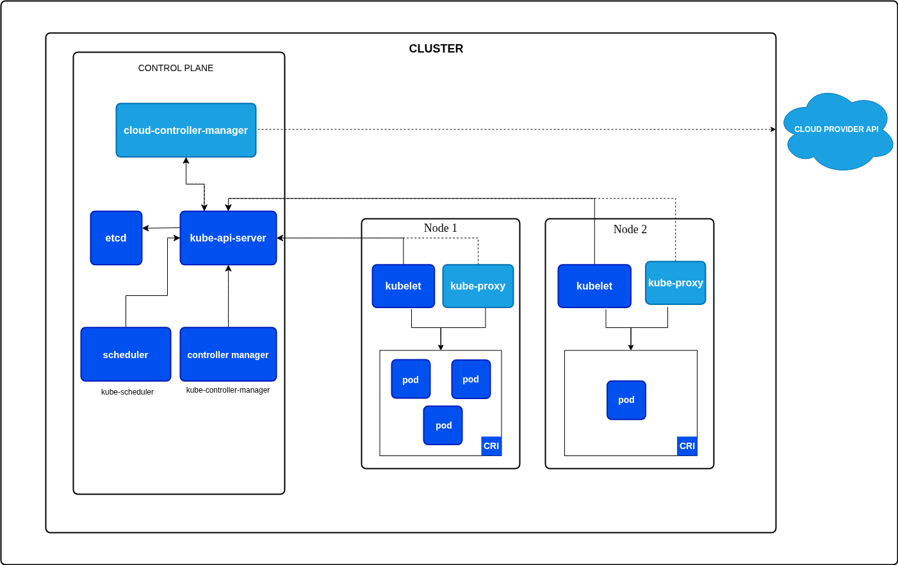

+++
date = '2022-12-06T12:44:47+10:00'
draft = false
title = 'Kubernetes'
tags = ['Kubernetes']
summary = "Overview of Kubernetes architecture, core concepts (pods, nodes, volumes) and practical examples for deployment and storage patterns."
+++

Kubernetes (K8s) is an open-source container orchestration platform that automates the deployment, scaling and management of containerized applications. It was originally developed by Google and is now maintained by the Cloud Native Computing Foundation (CNCF). Kubernetes provides a robust framework for running distributed systems resiliently, with features such as service discovery, load balancing, storage orchestration, automated rollouts and rollbacks, self-healing and secret and configuration management.

## Architecture



A Kubernetes cluster is composed of two main types of nodes:

### 1. Control Plane Nodes

Control plane nodes are responsible for managing the overall state of the cluster. They make global decisions about the cluster (such as scheduling), maintain cluster state and handle cluster events. Key components running on control plane nodes include:

- **kube-apiserver:** Serves the Kubernetes API and is the entry point for all administrative tasks.
- **etcd:** A distributed key-value store that holds all cluster data.
- **kube-scheduler:** Assigns workloads (pods) to worker nodes based on resource availability and policies.
- **kube-controller-manager:** Runs controllers that handle routine tasks (e.g., node management, replication).
- **cloud-controller-manager:** Integrates with cloud provider APIs (if applicable).

### 2. Worker Nodes

Worker nodes (sometimes called minions) are where the actual application workloads run. Each worker node contains the necessary services to run containers and communicate with the control plane. Key components include:

- **kubelet:** An agent that ensures containers are running in a Pod as expected. It is the component actually responsible for starting containers on the node, as instructed by the control plane after the scheduler assigns a Pod to this node.
- **kube-proxy:** Handles network routing and load balancing for services.
- **Container runtime:** Software responsible for running containers (e.g., containerd, Docker).

### Node Summary

- **Control Plane Nodes:** Manage the cluster, maintain desired state and orchestrate workloads.
- **Worker Nodes:** Run application containers and report status to the control plane.

Both node types are essential for a functioning Kubernetes cluster. In production, control plane and worker nodes are often separated for security and scalability.

## Core Concepts

### Pods

A Pod is the smallest deployable unit in Kubernetes. It represents a single instance of a running process and can contain one or more containers that share network and storage resources.

**Key Characteristics:**

- Pods share the same network namespace (same IP address and port space)
- Containers within a Pod can communicate via localhost
- Pods are ephemeral and can be replaced at any time
- Each Pod gets a unique IP address

**Example: Simple Pod**

```yaml
apiVersion: v1
kind: Pod
metadata:
  name: simple-pod
  labels:
    app: myapp
    environment: production
spec:
  containers:
    - name: nginx
      image: nginx:1.21
      ports:
        - containerPort: 80
      resources:
        requests:
          memory: "64Mi"
          cpu: "250m"
        limits:
          memory: "128Mi"
          cpu: "500m"
```

### ReplicaSets

ReplicaSets ensure that a specified number of Pod replicas are running at any given time. They provide high availability and scalability.

```yaml
apiVersion: apps/v1
kind: ReplicaSet
metadata:
  name: frontend-replicaset
spec:
  replicas: 3
  selector:
    matchLabels:
      app: frontend
  template:
    metadata:
      labels:
        app: frontend
    spec:
      containers:
        - name: nginx
          image: nginx:1.21
          ports:
            - containerPort: 80
```

### Deployments

Deployments provide declarative updates for Pods and ReplicaSets. They are the recommended way to manage stateless applications in Kubernetes.

**Features:**

- Rolling updates and rollbacks
- Scaling up and down
- Pause and resume deployments
- Version history

```yaml
apiVersion: apps/v1
kind: Deployment
metadata:
  name: web-deployment
  labels:
    app: web
spec:
  replicas: 3
  strategy:
    type: RollingUpdate
    rollingUpdate:
      maxSurge: 1
      maxUnavailable: 1
  selector:
    matchLabels:
      app: web
  template:
    metadata:
      labels:
        app: web
        version: v1
    spec:
      containers:
        - name: nginx
          image: nginx:1.21
          ports:
            - containerPort: 80
          livenessProbe:
            httpGet:
              path: /healthz
              port: 80
            initialDelaySeconds: 30
            periodSeconds: 10
          readinessProbe:
            httpGet:
              path: /ready
              port: 80
            initialDelaySeconds: 5
            periodSeconds: 5
          resources:
            requests:
              memory: "128Mi"
              cpu: "250m"
            limits:
              memory: "256Mi"
              cpu: "500m"
```

### StatefulSets

StatefulSets manage stateful applications with stable network identities and persistent storage. Use them for databases, message queues, or any application requiring stable identifiers.

**Features:**

- Stable, unique network identifiers
- Stable, persistent storage
- Ordered, graceful deployment and scaling
- Ordered, automated rolling updates

```yaml
apiVersion: apps/v1
kind: StatefulSet
metadata:
  name: mongodb
spec:
  serviceName: mongodb-service
  replicas: 3
  selector:
    matchLabels:
      app: mongodb
  template:
    metadata:
      labels:
        app: mongodb
    spec:
      containers:
        - name: mongodb
          image: mongo:5.0
          ports:
            - containerPort: 27017
          volumeMounts:
            - name: data
              mountPath: /data/db
  volumeClaimTemplates:
    - metadata:
        name: data
      spec:
        accessModes: ["ReadWriteOnce"]
        resources:
          requests:
            storage: 10Gi
```

### DaemonSets

DaemonSets ensure that a copy of a Pod runs on all (or selected) nodes. Useful for node-level operations like log collection, monitoring, or network management.

```yaml
apiVersion: apps/v1
kind: DaemonSet
metadata:
  name: fluentd
  labels:
    app: fluentd
spec:
  selector:
    matchLabels:
      app: fluentd
  template:
    metadata:
      labels:
        app: fluentd
    spec:
      containers:
        - name: fluentd
          image: fluent/fluentd:latest
          volumeMounts:
            - name: varlog
              mountPath: /var/log
            - name: varlibdockercontainers
              mountPath: /var/lib/docker/containers
              readOnly: true
      volumes:
        - name: varlog
          hostPath:
            path: /var/log
        - name: varlibdockercontainers
          hostPath:
            path: /var/lib/docker/containers
```

### Services

Services provide stable network endpoints for accessing Pods. They enable load balancing and service discovery.

**Service Types:**

- **ClusterIP** (default): Internal cluster IP, accessible only within cluster
- **NodePort**: Exposes service on each node's IP at a static port
- **LoadBalancer**: Creates external load balancer (cloud provider)
- **ExternalName**: Maps service to external DNS name

```yaml
apiVersion: v1
kind: Service
metadata:
  name: web-service
spec:
  type: LoadBalancer
  selector:
    app: web
  ports:
    - protocol: TCP
      port: 80
      targetPort: 80
  sessionAffinity: ClientIP
---
apiVersion: v1
kind: Service
metadata:
  name: database-service
spec:
  type: ClusterIP
  selector:
    app: mongodb
  ports:
    - protocol: TCP
      port: 27017
      targetPort: 27017
  clusterIP: None # Headless service for StatefulSet
```

### Ingress

Ingress manages external access to services, typically HTTP/HTTPS. It provides load balancing, SSL termination, and name-based virtual hosting.

```yaml
apiVersion: networking.k8s.io/v1
kind: Ingress
metadata:
  name: web-ingress
  annotations:
    nginx.ingress.kubernetes.io/rewrite-target: /
    cert-manager.io/cluster-issuer: letsencrypt-prod
spec:
  ingressClassName: nginx
  tls:
    - hosts:
        - example.com
      secretName: example-tls
  rules:
    - host: example.com
      http:
        paths:
          - path: /
            pathType: Prefix
            backend:
              service:
                name: web-service
                port:
                  number: 80
          - path: /api
            pathType: Prefix
            backend:
              service:
                name: api-service
                port:
                  number: 8080
```

### ConfigMaps and Secrets

ConfigMaps store non-sensitive configuration data, while Secrets store sensitive information.

```yaml
apiVersion: v1
kind: ConfigMap
metadata:
  name: app-config
data:
  database_host: "mongodb-service"
  log_level: "info"
  config.yaml: |
    server:
      port: 8080
      timeout: 30
---
apiVersion: v1
kind: Secret
metadata:
  name: app-secrets
type: Opaque
data:
  database_password: cGFzc3dvcmQxMjM= # base64 encoded
  api_key: YXBpa2V5MTIzNDU2Nzg=
```

**Using ConfigMaps and Secrets:**

```yaml
apiVersion: v1
kind: Pod
metadata:
  name: app-pod
spec:
  containers:
    - name: app
      image: myapp:latest
      env:
        - name: DATABASE_HOST
          valueFrom:
            configMapKeyRef:
              name: app-config
              key: database_host
        - name: DATABASE_PASSWORD
          valueFrom:
            secretKeyRef:
              name: app-secrets
              key: database_password
      volumeMounts:
        - name: config-volume
          mountPath: /etc/config
        - name: secret-volume
          mountPath: /etc/secrets
          readOnly: true
  volumes:
    - name: config-volume
      configMap:
        name: app-config
    - name: secret-volume
      secret:
        secretName: app-secrets
```

## Init Containers in Kubernetes

Init containers are specialized containers that run before app containers in a Pod. They are commonly used to perform setup tasks, such as initializing data, waiting for a service to be available, or setting up configuration files. Init containers must complete successfully before the main application containers start. If an init container fails, Kubernetes restarts the Pod until the init container succeeds.

### Example: Pod Descriptor with Init Container and Nginx

Below is an example of a Pod manifest that uses an init container to perform a simple setup before starting the main Nginx container:

```yaml
apiVersion: v1
kind: Pod
metadata:
  name: nginx-with-init
spec:
  initContainers:
    - name: init-myservice
      image: busybox
      command: ["sh", "-c", "echo Initializing... && sleep 5"]
  containers:
    - name: nginx
      image: nginx:latest
      ports:
        - containerPort: 80
```

### Advanced Init Container Example

```yaml
apiVersion: v1
kind: Pod
metadata:
  name: advanced-init
spec:
  initContainers:
    - name: wait-for-db
      image: busybox:1.35
      command:
        [
          "sh",
          "-c",
          "until nslookup mongodb-service; do echo waiting for db; sleep 2; done",
        ]
    - name: db-migration
      image: myapp-migrations:latest
      env:
        - name: DATABASE_URL
          valueFrom:
            secretKeyRef:
              name: db-secrets
              key: url
      command: ["npm", "run", "migrate"]
    - name: seed-data
      image: myapp-seeder:latest
      command: ["python", "seed.py"]
  containers:
    - name: app
      image: myapp:latest
      ports:
        - containerPort: 8080
```

### Applying the Pod Manifest and Getting Pod Status

To create the Pod using the above manifest, save it to a file (e.g., `nginx-init-pod.yaml`) and run:

```sh
kubectl apply -f nginx-init-pod.yaml
```

To check the status of the Pod:

```sh
kubectl get pod nginx-with-init
```

This will show the current status of the Pod, including whether the init container has completed and the main container is running.

## Volumes in Kubernetes

Kubernetes Volumes provide a way for containers in a Pod to access shared storage. Volumes solve the problem of data persistence and sharing between containers, as the filesystem inside a container is ephemeral and lost when the container restarts.

### VolumeMounts

A `volumeMount` is a specification within a container definition that tells Kubernetes where to mount a volume inside the container's filesystem. Each container in a Pod can mount one or more volumes at different paths.

### Volume Types

Kubernetes supports several types of volumes, each designed for different use cases. Some of the most common volume types include:

### emptyDir

Temporary storage created for a Pod, deleted when the Pod is removed. Useful for scratch space or sharing files between containers in a Pod.

```yaml
volumes:
  - name: cache
    emptyDir:
      sizeLimit: 1Gi
      medium: Memory # Use RAM for faster access
```

### hostPath

Mounts a file or directory from the host node's filesystem into the Pod. Useful for accessing host resources, logs, or tools. Type of file or directory on the host. Options include:

- `DirectoryOrCreate`: Creates a directory if it does not exist.
- `Directory`: Must already exist and be a directory.
- `FileOrCreate`: Creates a file if it does not exist.
- `File`: Must already exist and be a file.
- `Socket`, `CharDevice`, `BlockDevice`: For mounting special device files.

```yaml
volumes:
  - name: host-logs
    hostPath:
      path: /var/log/myapp
      type: DirectoryOrCreate
```

### configMap

A `configMap` volume provides configuration data to Pods as files or environment variables. This is useful for separating configuration from application code and for dynamically updating configuration without rebuilding images.

```yaml
volumes:
  - name: config
    configMap:
      name: app-config
      items:
        - key: config.yaml
          path: config.yaml
          mode: 0644
```

### secret

A `secret` volume is used to pass sensitive information, such as passwords, OAuth tokens, or ssh keys, to Pods. Secrets are stored in base64-encoded form and mounted as files or exposed as environment variables.

```yaml
volumes:
  - name: secrets
    secret:
      secretName: app-secrets
      defaultMode: 0400
      items:
        - key: tls.crt
          path: tls/cert.pem
        - key: tls.key
          path: tls/key.pem
```

### persistentVolumeClaim (PVC)

A `persistentVolumeClaim` (PVC) volume connects a Pod to a PersistentVolume (PV) for durable, cluster-managed storage. PVCs allow Pods to request and use storage resources abstracted from the underlying storage implementation (local disk, NFS, cloud storage, etc.).

```yaml
apiVersion: v1
kind: PersistentVolumeClaim
metadata:
  name: app-storage
spec:
  accessModes:
    - ReadWriteOnce
  resources:
    requests:
      storage: 10Gi
  storageClassName: fast-ssd
---
apiVersion: v1
kind: Pod
metadata:
  name: app-with-pvc
spec:
  containers:
    - name: app
      image: myapp:latest
      volumeMounts:
        - name: persistent-storage
          mountPath: /data
  volumes:
    - name: persistent-storage
      persistentVolumeClaim:
        claimName: app-storage
```

### nfs

Network File System volume for sharing data across multiple Pods.

```yaml
volumes:
  - name: shared-data
    nfs:
      server: nfs-server.example.com
      path: /exports/data
      readOnly: false
```

### projected

Combines multiple volume sources into a single directory.

```yaml
volumes:
  - name: all-in-one
    projected:
      sources:
        - configMap:
            name: app-config
        - secret:
            name: app-secrets
        - serviceAccountToken:
            path: token
            expirationSeconds: 3600
```

### Example: Pod with emptyDir and hostPath Volumes

```yaml
apiVersion: v1
kind: Pod
metadata:
  name: volume-demo
spec:
  containers:
    - name: app
      image: busybox
      command: ["sh", "-c", "echo Hello > /data/message && sleep 3600"]
      volumeMounts:
        - name: cache-volume
          mountPath: /data
        - name: host-logs
          mountPath: /host-logs
  volumes:
    - name: cache-volume
      emptyDir: {}
    - name: host-logs
      hostPath:
        path: /var/log
        type: Directory
```

In this example:

- `cache-volume` uses `emptyDir` for temporary storage shared within the Pod.
- `host-logs` mounts the host's `/var/log` directory into the Pod.

## Kubernetes Design Patterns

### 1. Sidecar Pattern

A helper container runs alongside the main application container to enhance or extend its functionality.

**Use Cases:** Logging, monitoring, proxying, data synchronization

```yaml
apiVersion: v1
kind: Pod
metadata:
  name: sidecar-pattern
spec:
  containers:
    - name: main-app
      image: nginx:1.21
      ports:
        - containerPort: 80
      volumeMounts:
        - name: logs
          mountPath: /var/log/nginx
    - name: log-aggregator
      image: fluent/fluentd:latest
      volumeMounts:
        - name: logs
          mountPath: /var/log/nginx
          readOnly: true
      env:
        - name: FLUENT_ELASTICSEARCH_HOST
          value: "elasticsearch.logging"
  volumes:
    - name: logs
      emptyDir: {}
```

### 2. Ambassador Pattern

A proxy container that simplifies access to external services, handling connection logic, retries, and circuit breaking.

**Use Cases:** Database connection pooling, API gateway, service mesh

```yaml
apiVersion: v1
kind: Pod
metadata:
  name: ambassador-pattern
spec:
  containers:
    - name: app
      image: myapp:latest
      env:
        - name: DATABASE_HOST
          value: "localhost" # Connects to ambassador
        - name: DATABASE_PORT
          value: "5432"
    - name: postgres-ambassador
      image: envoyproxy/envoy:v1.24
      ports:
        - containerPort: 5432
      volumeMounts:
        - name: envoy-config
          mountPath: /etc/envoy
  volumes:
    - name: envoy-config
      configMap:
        name: envoy-proxy-config
```

### 3. Adapter Pattern

Transforms the output or interface of a container to match a standard format.

**Use Cases:** Metrics standardization, log format conversion, protocol translation

```yaml
apiVersion: v1
kind: Pod
metadata:
  name: adapter-pattern
spec:
  containers:
    - name: legacy-app
      image: legacy-app:1.0
      ports:
        - containerPort: 8080
      volumeMounts:
        - name: metrics
          mountPath: /var/metrics
    - name: prometheus-adapter
      image: prom/prometheus-adapter:latest
      ports:
        - containerPort: 9090
      volumeMounts:
        - name: metrics
          mountPath: /var/metrics
          readOnly: true
  volumes:
    - name: metrics
      emptyDir: {}
```

### 4. Init Container Pattern

Performs initialization tasks before the main container starts.

**Use Cases:** Database migrations, dependency checks, configuration setup

```yaml
apiVersion: apps/v1
kind: Deployment
metadata:
  name: init-pattern
spec:
  replicas: 3
  selector:
    matchLabels:
      app: myapp
  template:
    metadata:
      labels:
        app: myapp
    spec:
      initContainers:
        - name: wait-for-services
          image: busybox:1.35
          command:
            - sh
            - -c
            - |
              until nc -z database-service 5432 && nc -z redis-service 6379; do
                echo "Waiting for services..."
                sleep 2
              done
        - name: run-migrations
          image: myapp-migrations:latest
          env:
            - name: DATABASE_URL
              valueFrom:
                secretKeyRef:
                  name: db-credentials
                  key: url
      containers:
        - name: app
          image: myapp:latest
          ports:
            - containerPort: 8080
```

### 5. Multi-Container Pod Pattern

Multiple containers work together in a single Pod, sharing resources and lifecycle.

```yaml
apiVersion: v1
kind: Pod
metadata:
  name: multi-container
spec:
  containers:
    - name: web-server
      image: nginx:1.21
      ports:
        - containerPort: 80
      volumeMounts:
        - name: shared-data
          mountPath: /usr/share/nginx/html
    - name: content-puller
      image: appropriate/curl:latest
      command:
        - sh
        - -c
        - |
          while true; do
            curl -o /data/index.html https://api.example.com/content
            sleep 300
          done
      volumeMounts:
        - name: shared-data
          mountPath: /data
  volumes:
    - name: shared-data
      emptyDir: {}
```

### 6. Self-Aware Pattern

Pods that understand their Kubernetes context through the Downward API.

```yaml
apiVersion: v1
kind: Pod
metadata:
  name: self-aware
  labels:
    app: myapp
    version: v1
spec:
  containers:
    - name: app
      image: myapp:latest
      env:
        - name: POD_NAME
          valueFrom:
            fieldRef:
              fieldPath: metadata.name
        - name: POD_NAMESPACE
          valueFrom:
            fieldRef:
              fieldPath: metadata.namespace
        - name: POD_IP
          valueFrom:
            fieldRef:
              fieldPath: status.podIP
        - name: NODE_NAME
          valueFrom:
            fieldRef:
              fieldPath: spec.nodeName
        - name: SERVICE_ACCOUNT
          valueFrom:
            fieldRef:
              fieldPath: spec.serviceAccountName
      volumeMounts:
        - name: podinfo
          mountPath: /etc/podinfo
  volumes:
    - name: podinfo
      downwardAPI:
        items:
          - path: "labels"
            fieldRef:
              fieldPath: metadata.labels
          - path: "annotations"
            fieldRef:
              fieldPath: metadata.annotations
```

### 7. Controller Pattern

Custom controllers watch for changes and reconcile desired state.

**Use Cases:** Operators, custom resource management

```yaml
apiVersion: v1
kind: ServiceAccount
metadata:
  name: custom-controller
  namespace: default
---
apiVersion: rbac.authorization.k8s.io/v1
kind: ClusterRole
metadata:
  name: custom-controller-role
rules:
  - apiGroups: [""]
    resources: ["pods", "services"]
    verbs: ["get", "list", "watch", "create", "update", "delete"]
  - apiGroups: ["apps"]
    resources: ["deployments"]
    verbs: ["get", "list", "watch", "create", "update", "delete"]
---
apiVersion: rbac.authorization.k8s.io/v1
kind: ClusterRoleBinding
metadata:
  name: custom-controller-binding
roleRef:
  apiGroup: rbac.authorization.k8s.io
  kind: ClusterRole
  name: custom-controller-role
subjects:
  - kind: ServiceAccount
    name: custom-controller
    namespace: default
---
apiVersion: apps/v1
kind: Deployment
metadata:
  name: custom-controller
spec:
  replicas: 1
  selector:
    matchLabels:
      app: custom-controller
  template:
    metadata:
      labels:
        app: custom-controller
    spec:
      serviceAccountName: custom-controller
      containers:
        - name: controller
          image: custom-controller:latest
```

## Storage Patterns

### 1. Local Storage Pattern

For applications requiring high-performance local storage.

```yaml
apiVersion: v1
kind: PersistentVolume
metadata:
  name: local-pv
spec:
  capacity:
    storage: 100Gi
  volumeMode: Filesystem
  accessModes:
    - ReadWriteOnce
  persistentVolumeReclaimPolicy: Retain
  storageClassName: local-storage
  local:
    path: /mnt/disks/ssd1
  nodeAffinity:
    required:
      nodeSelectorTerms:
        - matchExpressions:
            - key: kubernetes.io/hostname
              operator: In
              values:
                - worker-node-1
```

### 2. Shared Storage Pattern

For applications requiring shared access across multiple Pods.

```yaml
apiVersion: v1
kind: PersistentVolume
metadata:
  name: nfs-pv
spec:
  capacity:
    storage: 500Gi
  volumeMode: Filesystem
  accessModes:
    - ReadWriteMany
  persistentVolumeReclaimPolicy: Retain
  storageClassName: nfs
  nfs:
    server: nfs-server.example.com
    path: /exports/shared
  mountOptions:
    - hard
    - nfsvers=4.1
---
apiVersion: v1
kind: PersistentVolumeClaim
metadata:
  name: shared-storage
spec:
  accessModes:
    - ReadWriteMany
  storageClassName: nfs
  resources:
    requests:
      storage: 100Gi
```

### 3. Dynamic Provisioning Pattern

Automatically provision storage when needed.

```yaml
apiVersion: storage.k8s.io/v1
kind: StorageClass
metadata:
  name: fast-ssd
provisioner: kubernetes.io/aws-ebs
parameters:
  type: gp3
  iops: "3000"
  throughput: "125"
  encrypted: "true"
allowVolumeExpansion: true
volumeBindingMode: WaitForFirstConsumer
---
apiVersion: v1
kind: PersistentVolumeClaim
metadata:
  name: dynamic-storage
spec:
  accessModes:
    - ReadWriteOnce
  storageClassName: fast-ssd
  resources:
    requests:
      storage: 50Gi
```

### 4. Backup and Snapshot Pattern

```yaml
apiVersion: snapshot.storage.k8s.io/v1
kind: VolumeSnapshot
metadata:
  name: db-snapshot
spec:
  volumeSnapshotClassName: csi-snapclass
  source:
    persistentVolumeClaimName: database-pvc
---
apiVersion: v1
kind: PersistentVolumeClaim
metadata:
  name: restored-db
spec:
  dataSource:
    name: db-snapshot
    kind: VolumeSnapshot
    apiGroup: snapshot.storage.k8s.io
  accessModes:
    - ReadWriteOnce
  resources:
    requests:
      storage: 100Gi
```

## Best Practices

### Resource Management

```yaml
apiVersion: v1
kind: Pod
metadata:
  name: resource-best-practices
spec:
  containers:
    - name: app
      image: myapp:latest
      resources:
        requests:
          memory: "256Mi"
          cpu: "500m"
        limits:
          memory: "512Mi"
          cpu: "1000m"
      # Resource quotas at namespace level
---
apiVersion: v1
kind: ResourceQuota
metadata:
  name: compute-quota
  namespace: production
spec:
  hard:
    requests.cpu: "100"
    requests.memory: "200Gi"
    limits.cpu: "200"
    limits.memory: "400Gi"
    persistentvolumeclaims: "50"
---
apiVersion: v1
kind: LimitRange
metadata:
  name: resource-limits
  namespace: production
spec:
  limits:
    - max:
        memory: "2Gi"
        cpu: "2"
      min:
        memory: "128Mi"
        cpu: "100m"
      default:
        memory: "512Mi"
        cpu: "500m"
      defaultRequest:
        memory: "256Mi"
        cpu: "250m"
      type: Container
```

### Health Checks

```yaml
apiVersion: v1
kind: Pod
metadata:
  name: health-checks
spec:
  containers:
    - name: app
      image: myapp:latest
      ports:
        - containerPort: 8080
      # Liveness probe - restart if fails
      livenessProbe:
        httpGet:
          path: /healthz
          port: 8080
          httpHeaders:
            - name: X-Health-Check
              value: liveness
        initialDelaySeconds: 30
        periodSeconds: 10
        timeoutSeconds: 5
        successThreshold: 1
        failureThreshold: 3
      # Readiness probe - remove from service if fails
      readinessProbe:
        httpGet:
          path: /ready
          port: 8080
        initialDelaySeconds: 10
        periodSeconds: 5
        timeoutSeconds: 3
        successThreshold: 1
        failureThreshold: 3
      # Startup probe - protects slow-starting containers
      startupProbe:
        httpGet:
          path: /startup
          port: 8080
        initialDelaySeconds: 0
        periodSeconds: 10
        timeoutSeconds: 3
        successThreshold: 1
        failureThreshold: 30
```

### Security Best Practices

```yaml
apiVersion: v1
kind: Pod
metadata:
  name: secure-pod
spec:
  securityContext:
    runAsNonRoot: true
    runAsUser: 1000
    fsGroup: 2000
    seccompProfile:
      type: RuntimeDefault
  containers:
    - name: app
      image: myapp:latest
      securityContext:
        allowPrivilegeEscalation: false
        readOnlyRootFilesystem: true
        runAsNonRoot: true
        runAsUser: 1000
        capabilities:
          drop:
            - ALL
          add:
            - NET_BIND_SERVICE
      volumeMounts:
        - name: tmp
          mountPath: /tmp
        - name: cache
          mountPath: /app/cache
  volumes:
    - name: tmp
      emptyDir: {}
    - name: cache
      emptyDir: {}
---
apiVersion: v1
kind: ServiceAccount
metadata:
  name: app-service-account
automountServiceAccountToken: false
---
```
