+++
date = '2026-03-21T12:44:47+10:00'
draft = false
title = 'SearchIQ (AEO & GEO)'
tags = ['SEO', 'GEO', 'AEO']
summary = "Business idea - Search IQ, a tool to help businesses optimise for AEO and GEO in the age of AI search."
+++

---

# AEO & GEO: The Complete Guide to Optimising for AI-Powered Search in 2026

> *SEO is no longer enough. The search landscape has fundamentally changed — and if you're not showing up inside AI answers, you're invisible to a growing majority of your audience.*

---

## 1. The Shift: From Search Engines to Answer Engines

For nearly three decades, the game was simple: rank on Google. Get to page one. Earn clicks. Drive traffic.

That era isn't over — but it's no longer the whole story.

Today, when someone searches "what's the best way to treat a mild burn at home?" they often don't click a single link. They read the answer directly from Google's AI Overview, Bing Copilot, Perplexity, or ChatGPT. The question is answered *before* the user ever reaches your website.

This is the fundamental disruption. The question is no longer just *"Can I rank #1?"* — it's *"Can I be the source that AI cites, quotes, or summarises?"*

That's where **AEO** and **GEO** come in.

---

## 2. What is AEO? Answer Engine Optimisation Explained

**Answer Engine Optimisation (AEO)** is the practice of structuring and formatting your content so that answer engines — platforms designed to directly respond to user queries rather than return a list of links — select it as the source of their answers.

Answer engines include:

- **Google's AI Overviews** (formerly SGE — Search Generative Experience)
- **Bing Copilot / Microsoft Copilot**
- **Perplexity AI**
- **Apple Intelligence** (Siri-powered search summaries)
- **Voice assistants** (Alexa, Google Assistant, Siri)
- **Featured Snippets** (the original answer engine)
- **People Also Ask** (PAA) boxes
- **Knowledge Panels**

AEO is both an evolution of and a departure from traditional SEO. Where SEO is about being *found*, AEO is about being *quoted*. The goal shifts from driving traffic to establishing **content authority at the point of answer**.

### The Core AEO Philosophy

At its heart, AEO asks: *"Does my content answer a specific question better than anyone else — and is that answer presented in a way that's easy for a machine to extract and serve to a user?"*

If the answer to both is yes, you win the AEO game.

---

## 3. What is GEO? Generative Engine Optimisation Explained

**Generative Engine Optimisation (GEO)** is a newer, broader concept that specifically focuses on optimising content to be cited, referenced, or synthesised by **Large Language Model (LLM)-powered search tools** — systems that don't just retrieve answers, but *generate* them.

The term was formally introduced in a 2023 research paper from Princeton, Georgia Tech, The Allen Institute for AI, and IIT Delhi titled *"GEO: Generative Engine Optimization."* It described a paradigm where content creators must not just think about search engine rankings, but about how LLMs select, weight, and quote sources when constructing generated responses.

GEO-focused platforms include:

- **Perplexity AI**
- **ChatGPT with Browse / ChatGPT Search**
- **Google Gemini**
- **Microsoft Copilot**
- **Claude (Anthropic)**
- **Meta AI**
- **You.com**
- **Grok (xAI)**

### AEO vs GEO: The Subtle Difference

While people often use these terms interchangeably, there's a meaningful distinction:

| Dimension | AEO | GEO |
|---|---|---|
| Focus | Being the *direct answer* to a query | Being *cited or synthesised* by an AI response |
| Engine type | Structured retrieval (snippets, PAA, voice) | Generative LLM outputs |
| Content format | Clear Q&A, definitions, lists | Authoritative depth, citations, statistics |
| Origin | Pre-LLM era (voice search, snippets) | Post-2022 (GPT-4, AI Search era) |
| Measurement | Featured snippet wins, zero-click share | AI citation frequency, mention volume |

In practice, the tactics overlap significantly, and most practitioners treat them as complementary disciplines.

---

## 4. AEO vs GEO vs SEO: How They Relate

Think of these three as layers of the same stack, not competing strategies:

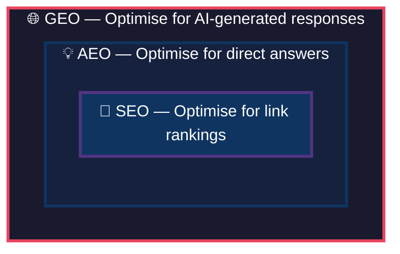

**SEO** remains the foundation. If Google can't crawl and index your page, no AI system will find it either. Technical SEO, backlinks, and on-page signals matter — they feed the inputs that AEO and GEO build on.

**AEO** layers on top by ensuring your content is structured for extraction — clear questions, concise answers, proper schema markup, and voice-search readiness.

**GEO** goes furthest by optimising for the generative layer — building authoritative content with the kind of depth, citations, statistics, and credibility signals that LLMs are trained to privilege.

**You don't choose one. You do all three.** The good news: tactics at each level reinforce the others.

---

## 5. How Answer Engines Work

To optimise for answer engines, you need to understand what's happening under the hood.

### Traditional Featured Snippets (Google)

Google's featured snippet system uses a combination of:

1. **Query parsing** — identifying the *intent type* (definition, how-to, list, comparison, etc.)
2. **Document retrieval** — finding the highest-ranked pages for that query
3. **Passage extraction** — pulling the most relevant passage from those top-ranked documents
4. **Snippet rendering** — displaying that passage directly in the SERP

Key insight: Google doesn't just take the top-ranked page. It often pulls snippets from pages ranked 2nd–5th if their formatting more clearly answers the query. **Structure beats pure authority.**

### Google AI Overviews

AI Overviews (formerly SGE) work differently. They use a **Retrieval-Augmented Generation (RAG)** approach:

1. The user query is processed and decomposed into sub-queries
2. Google retrieves multiple relevant web pages (not just top-ranked ones)
3. A language model reads those pages and synthesises a generated answer
4. The answer is displayed with source citations inline

This means your page can be ranked #15 organically but still appear in an AI Overview if it contains the most precise, clearly structured answer to one component of the query.

### Voice Search & Smart Assistants

Voice assistants (Google Assistant, Siri, Alexa) typically pull from:

- Featured snippets (primary source)
- Knowledge Graph entries
- Structured data / schema markup
- Trusted local data (for local queries)

Voice answers are almost always **a single, short spoken response** — meaning the clarity and conciseness of your answer text matters enormously.

---

## 6. How Generative Engines Work

Generative AI search systems like Perplexity and ChatGPT Search work through a **RAG pipeline**:

### Step 1: Query Understanding
The system interprets the user's prompt to understand intent, entities, and the type of response required (factual, comparative, procedural, etc.).

### Step 2: Web Retrieval
A search component retrieves live web results. Perplexity, for example, crawls the web in real time. ChatGPT Search uses Bing's index. The retrieval phase considers traditional signals like PageRank and relevance.

### Step 3: Passage Ranking & Chunking
Retrieved documents are broken into chunks. A ranking model scores each chunk for relevance to the query. The most relevant chunks are passed into the LLM's context window.

### Step 4: Generative Synthesis
The LLM reads the retrieved chunks and generates a coherent, cited response. It may:
- Directly quote a source
- Paraphrase content
- Synthesise information across multiple sources
- Add context from its training data

### Step 5: Citation Attribution
Sources are cited inline. The visibility of your citation depends on:
- Whether your content was retrieved in step 2
- Whether your chunks scored highly in step 3
- Whether the LLM "preferred" your phrasing during synthesis

### What Makes an LLM Prefer Your Content?

Research from the original GEO paper found that the following tactics increased citation frequency in generative engines:

- **Citing authoritative sources** within your own content (+40% citation visibility)
- **Adding quotations** from experts or primary sources (+34%)
- **Including statistics** (numerical data) (+27%)
- **Using fluent, readable prose** (+17%)
- **Adding persuasive language** and strong claims (+11%)
- **Using technical, domain-specific vocabulary** (+13%)

---

## 7. Why AEO and GEO Matter Right Now

### The Zero-Click Crisis

Sparktoro and Semrush data consistently show that over **60% of Google searches now end without a click**. Users find their answer on the SERP itself — in AI Overviews, featured snippets, or knowledge panels. If your content isn't *the answer*, you receive no traffic even from searches you technically rank for.

### AI Search Adoption is Accelerating

- Perplexity grew from 10 million to over 100 million monthly queries in less than 18 months
- ChatGPT Search launched to 100M+ users in 2024 and expanded rapidly in 2025
- Google's AI Overviews now appear for over 15% of all queries and rising
- Microsoft reported Copilot handles hundreds of millions of queries monthly

### The Brand Visibility Shift

Even if a user doesn't click, being *cited* by an AI builds brand awareness. Users see your domain name. They associate your brand with authority on that topic. This drives direct traffic, branded searches, and trust — even without a traditional click.

### Voice Search Is Still Growing

Smart speakers are in over 35% of homes in the US and Australia. Each voice query has one answer. That answer is almost always pulled from structured, AEO-optimised content.

---

## 8. The Anatomy of an AI-Optimised Piece of Content

Here's what a piece of content designed to win at both AEO and GEO looks like:

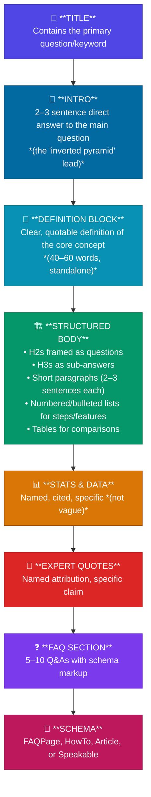

---

## 9. AEO: A Complete How-To Guide

### Step 1: Conduct Question-Based Keyword Research

Traditional keyword research focuses on search volume and competition. AEO keyword research focuses on **questions and intent**.

**How to find question-based keywords:**

- **AnswerThePublic** — visualises all questions people ask around a topic
- **AlsoAsked** — maps out "People Also Asked" question trees
- **Google's PAA boxes** — manually search your keywords and screenshot every PAA
- **Semrush / Ahrefs Question filters** — filter keyword databases by question words (who, what, when, where, why, how)
- **Reddit, Quora, forums** — raw, unfiltered questions from real people
- **Your own search console data** — queries that already drive impressions but few clicks

**Intent categories to target:**

| Intent Type | Example Query | Optimal Format |
|---|---|---|
| Definition | "What is compound interest?" | 40–60 word definition paragraph |
| How-To | "How do I set up 2FA?" | Numbered steps |
| Comparison | "AEO vs SEO — what's the difference?" | Table or side-by-side |
| Best/Recommendation | "Best project management tools" | Ranked list with descriptions |
| When/Why | "Why is my Wi-Fi slow?" | Short direct answer + explanation |
| Local | "Dentists open Sunday in Brisbane" | Local schema + NAP data |

---

### Step 2: Structure Content Around Questions

Every major section of your content should answer a specific question. Use this structure:

**H2 heading = the question**
```
## How Does AEO Differ from Traditional SEO?
```

**First 1–2 sentences = the direct answer**
```
AEO differs from SEO in its primary goal: where SEO aims to rank a page in 
search results, AEO aims to have content selected as the direct answer — 
bypassing the ranking list entirely.
```

**Remaining paragraphs = the depth and context**

This "answer-first" approach mimics how AI systems prefer content — they pull the clearest direct answer from the top of a section, then add surrounding context.

---

### Step 3: Write the Perfect Featured Snippet Paragraph

Google's featured snippet paragraphs are typically **40–60 words**. To optimise:

1. Directly rephrase the target question in the opening sentence
2. Give a complete, self-contained answer in the next 2–3 sentences
3. Avoid first-person language ("I", "we")
4. Don't use pronouns that require context (say "AEO" not "it")
5. End with a natural full stop — not a cliffhanger

**Example:**

> **Question:** What is a featured snippet?
>
> **Optimised paragraph:** A featured snippet is a selected search result that Google displays at the top of the SERP in a special box, above all organic results. It is pulled directly from a web page and is designed to answer a user's question without requiring them to click through to the source. Featured snippets typically appear for question-based queries and can take the form of paragraphs, lists, or tables.

---

### Step 4: Create Listicle-Friendly Content

When queries have list-intent answers ("best X", "steps to Y", "types of Z"), Google often pulls ordered or unordered lists directly into snippets.

**Best practices for list snippets:**

- Use `<ul>` or `<ol>` HTML tags (or equivalent markdown)
- Keep list items concise (one line each is ideal)
- Introduce the list with a colon after a clear statement
- Include 4–10 items (Google typically shows 4–8 in snippets)
- Don't rely purely on visual formatting — the context sentence matters

---

### Step 5: Optimise for Voice Search

Voice queries are longer, more conversational, and typically phrased as full sentences. Optimising for voice means:

**Use conversational language.** Write how people speak. Instead of "optimal strategies for sleep improvement," write "how to sleep better."

**Target long-tail conversational queries.** "What's the cheapest way to fly from Sydney to London?" not "cheap Sydney London flights."

**Answer in 29 words or fewer** for voice. Google Assistant reads snippets aloud, and shorter answers perform better in voice SERP audits.

**Include speakable schema** (see the Schema section below) to explicitly flag which portions of your content are suitable for text-to-speech reading.

**Mark up your local data.** Voice searches are heavily local. Make sure your Google Business Profile is complete, your schema includes location data, and your NAP (Name, Address, Phone) is consistent across all citations.

---

### Step 6: Build a Robust FAQ Strategy

FAQ sections are one of the highest-yielding AEO tactics. They:

- Capture PAA (People Also Ask) boxes
- Feed directly into AI Overviews
- Allow FAQ Schema markup
- Improve on-page comprehensiveness signals

**How to build a winning FAQ section:**

1. **Research real questions** using PAA boxes, AnswerThePublic, and user research
2. **Prioritise secondary questions** — the main article answers the primary question; FAQs capture related queries
3. **Write concise, standalone answers** — each FAQ answer should make sense without reading the whole article
4. **Target 6–12 questions** per page (too many dilutes value; too few misses coverage)
5. **Mark up every FAQ** with `FAQPage` schema (detailed below)

---

### Step 7: Optimise for Knowledge Panels

Knowledge panels appear for entities — brands, people, places, concepts. To get or improve a knowledge panel:

- **Create a Wikipedia article** or Wikidata entry (for organisations or notable people)
- **Claim your Google Business Profile**
- **Build consistent entity signals** — ensure your name, description, and key facts are consistent across your website, social profiles, Crunchbase, LinkedIn, and press mentions
- **Use `Organization`, `Person`, or `LocalBusiness` schema**
- **Link your social profiles** in `sameAs` schema properties

---

## 10. GEO: A Complete How-To Guide

### Step 1: Build Topical Authority Clusters

Generative engines synthesise answers from multiple sources. But they heavily weight **established authorities** — sources that consistently produce high-quality content on a specific topic.

The strategy: **own a topic cluster**, not just individual pages.

**How to build a topical authority cluster:**

```
Core Topic: "Cybersecurity for Small Business"
│
├── Pillar Page: Complete Guide to Cybersecurity for SMEs (3,000+ words)
│
├── Cluster Pages:
│   ├── What is a Firewall? (Definition + how-to)
│   ├── How to Set Up Two-Factor Authentication (Step-by-step)
│   ├── Best Password Managers for Small Teams (Comparison)
│   ├── How to Respond to a Data Breach (Emergency guide)
│   ├── Cybersecurity Compliance Checklist (Australia) (List)
│   ├── Common Phishing Attacks and How to Spot Them (Examples)
│   └── How Much Does a Cyberattack Cost an SME? (Data + stats)
│
└── All cluster pages link to pillar; pillar links to all cluster pages
```

When an LLM is asked about small business cybersecurity, your domain appears repeatedly across the retrieved content — dramatically increasing the probability of citation.

---

### Step 2: Lead with Statistics and Cited Data

The GEO research paper found that **adding statistics was one of the most effective tactics** for increasing AI citation rates. Here's why: LLMs are trained to prefer sources that make specific, verifiable, data-backed claims. Vague content is less trustworthy to both humans and machines.

**What makes a good GEO statistic:**

- **Named source:** "According to the Australian Bureau of Statistics..." not "Studies show..."
- **Specific number:** "47% of small businesses" not "nearly half"
- **Current year reference:** Flag recency where possible
- **Contextualised:** Explain what the number means

**Bad:** *Cyber attacks are very common among small businesses.*

**Good:** *According to the Australian Cyber Security Centre's 2024 Annual Cyber Threat Report, cybercrime cost Australian organisations an estimated $33 billion in 2023–24, with small businesses accounting for 43% of all reported incidents.*

---

### Step 3: Include Expert Quotes and Attributions

Expert quotes increase content credibility and are frequently extracted by LLMs as quotable evidence. They signal that your content is based on real-world expertise, not just aggregated text.

**How to incorporate quotes effectively:**

- **Name the expert** — full name, title, organisation
- **Make the quote specific** — not a platitude, but a concrete insight
- **Provide context** — when and where was it said? (conference, report, interview)
- **Choose relevance over prestige** — a specific quote from a mid-tier expert beats a vague quote from a famous one

**Example format:**

> *"The biggest mistake SMEs make is treating cybersecurity as an IT issue rather than a business continuity issue,"* says David Thodey, former CEO of Telstra, speaking at the 2024 AICD Cybersecurity Forum.

---

### Step 4: Write for Comprehensiveness, Not Just Keyword Coverage

Generative engines want to pull from **one authoritative source** where possible. If a user asks a complex question, the ideal answer synthesises multiple facets. Content that covers only one angle forces the LLM to pull from multiple sources — reducing your share of the citation.

**Comprehensiveness checklist for any topic page:**

- [ ] Definition of the core concept
- [ ] Historical context or origin
- [ ] How it works (mechanistically)
- [ ] Key components or variations
- [ ] Real-world examples or case studies
- [ ] Common misconceptions or myths
- [ ] Step-by-step implementation (if applicable)
- [ ] Pros and cons or limitations
- [ ] Expert perspectives
- [ ] Data and statistics
- [ ] FAQ section
- [ ] Related topics and next steps

---

### Step 5: Optimise Your Content for RAG Chunking

When a generative engine retrieves your page, it doesn't read it as a whole. It **chunks** it — breaks it into segments of typically 200–500 tokens — and ranks each chunk independently.

This means **every section of your content needs to be independently useful and self-contained.**

**GEO chunking best practices:**

- Start each H2/H3 section with a 1–2 sentence summary of what that section covers
- Don't rely on earlier context — each section should stand alone
- Avoid orphaned references ("as we discussed above...")
- Use descriptive headings that tell the reader (and the model) exactly what follows
- Keep paragraphs short — 3–5 sentences maximum

---

### Step 6: Build Citations and Backlinks from High-Authority Sources

LLMs are trained on the web — and their training data heavily reflects web authority signals. Pages that are widely cited, linked to from authoritative sources, and mentioned in high-quality contexts are more likely to appear in retrieval results.

**GEO link-building priorities:**

- **Get cited in Wikipedia** — Wikipedia is heavily represented in LLM training data and retrieval indexes
- **Earn .edu and .gov links** — these domains carry exceptional authority
- **Get featured in industry publications** — trade press, respected blogs, and media outlets
- **Seek podcast/interview mentions** — transcripts from notable podcasts are crawled and indexed
- **Publish original research** — being the primary source of data forces others to cite you

---

### Step 7: Optimise Your Brand as an Entity

Generative AI systems think in terms of **entities** — distinct, nameable concepts with attributes. Your brand, your key employees, and your products should all be clearly defined entities in the web's knowledge graph.

**Entity optimisation steps:**

1. **Create and maintain a Wikidata entry** for your organisation
2. **Claim and complete Google Knowledge Panel**
3. **Ensure consistent brand description** across your website, LinkedIn, Crunchbase, AngelList, and press mentions
4. **Define key people** — founders, executives — as named entities with consistent bios across platforms
5. **Use `Organization` and `Person` schema** with `sameAs` properties linking all your profiles
6. **Write an authoritative "About" page** that defines your entity clearly

---

### Step 8: Publish Original Research and Proprietary Data

The single most powerful GEO tactic is creating content that **cannot be found anywhere else**. Original surveys, proprietary studies, and unique datasets force other content creators to cite you as the primary source — which in turn makes you a priority retrieval target.

**Ideas for original research:**

- Annual industry survey (even 100 respondents creates quotable data)
- Original analysis of publicly available datasets
- Case studies with specific, measurable outcomes
- Expert roundups with synthesised insights
- Benchmarking reports

---

## 11. Technical Optimisation for AEO & GEO

### Page Speed

Slow pages are crawled less often and deprioritised by retrieval systems. Target:
- **Core Web Vitals:** LCP < 2.5s, INP < 200ms, CLS < 0.1
- **Time to First Byte (TTFB):** < 600ms
- **Mobile performance score:** 80+ in PageSpeed Insights

### Crawlability

If a bot can't read it, an AI can't cite it.

- Ensure `robots.txt` doesn't block AI crawlers (Googlebot, GPTBot, PerplexityBot, ClaudeBot, etc.)
- Submit and maintain an up-to-date `sitemap.xml`
- Use `hreflang` for multilingual sites
- Resolve all broken internal links and redirect chains
- Avoid heavy JavaScript rendering for key content — server-side rendering is preferred

### AI Crawler Access

Some AI systems use dedicated crawlers. Be aware of these user agents and ensure they're not blocked:

| Crawler | User Agent |
|---|---|
| OpenAI (ChatGPT) | `GPTBot` |
| Perplexity | `PerplexityBot` |
| Anthropic (Claude) | `ClaudeBot` / `anthropic-ai` |
| Google | `Googlebot-Extended` |
| Common Crawl | `CCBot` |
| Meta | `FacebookBot` |

To **allow all AI crawlers**, ensure your `robots.txt` doesn't disallow them. To selectively block them while maintaining SEO, you can specify individual disallow rules per user agent.

### Content Freshness

AI systems favour recent content. For evergreen topics:

- Update the **published/modified date** when content is substantively refreshed
- Add a "Last Updated: [Month Year]" notice prominently
- Use `dateModified` in your Article schema
- Refresh statistics and data at least annually

---

## 12. Schema Markup & Structured Data

Schema markup is the bridge between your content and machine-readable structure. It explicitly tells search engines and AI systems what your content is *about*, not just what it *says*.

### FAQPage Schema

The most directly impactful schema for AEO. Marks up Q&A content to appear in PAA boxes and feed AI Overviews.

```json
{
  "@context": "https://schema.org",
  "@type": "FAQPage",
  "mainEntity": [
    {
      "@type": "Question",
      "name": "What is Answer Engine Optimisation (AEO)?",
      "acceptedAnswer": {
        "@type": "Answer",
        "text": "Answer Engine Optimisation (AEO) is the practice of structuring content so that answer engines — platforms that provide direct answersto queries rather than a list of links — select it as the source of their responses. It involves formatting content for extraction by systems like Google AI Overviews, voice assistants, and featured snippets."
      }
    },
    {
      "@type": "Question",
      "name": "How is AEO different from SEO?",
      "acceptedAnswer": {
        "@type": "Answer",
        "text": "While SEO focuses on ranking a page in search results to earn clicks, AEO focuses on having content selected as a direct answer, bypassing the ranking list. SEO drives traffic; AEO drives visibility at the point of answer."
      }
    }
  ]
}
```

### HowTo Schema

Marks up step-by-step instructional content. Appears as rich results with numbered steps.

```json
{
  "@context": "https://schema.org",
  "@type": "HowTo",
  "name": "How to Optimise Content for AI Search",
  "step": [
    {
      "@type": "HowToStep",
      "name": "Identify question-based keywords",
      "text": "Use tools like AnswerThePublic and Semrush to find the specific questions your audience asks about your topic.",
      "position": 1
    },
    {
      "@type": "HowToStep",
      "name": "Structure content with question-based headings",
      "text": "Format each major section as a question (H2) followed immediately by a direct 2–3 sentence answer.",
      "position": 2
    }
  ]
}
```

### Article Schema with dateModified

```json
{
  "@context": "https://schema.org",
  "@type": "Article",
  "headline": "The Complete Guide to AEO and GEO",
  "description": "Everything you need to know about Answer Engine Optimisation and Generative Engine Optimisation.",
  "author": {
    "@type": "Person",
    "name": "Your Name",
    "url": "https://yoursite.com/about"
  },
  "publisher": {
    "@type": "Organization",
    "name": "Your Brand",
    "logo": {
      "@type": "ImageObject",
      "url": "https://yoursite.com/logo.png"
    }
  },
  "datePublished": "2024-01-15",
  "dateModified": "2026-03-01"
}
```

### Speakable Schema

Explicitly marks sections of your content as optimised for audio/voice delivery.

```json
{
  "@context": "https://schema.org",
  "@type": "Article",
  "speakable": {
    "@type": "SpeakableSpecification",
    "cssSelector": [".article-intro", ".answer-block", "h2"]
  }
}
```

### Organization Schema with sameAs

Critical for entity establishment and GEO authority signals.

```json
{
  "@context": "https://schema.org",
  "@type": "Organization",
  "name": "Your Company Name",
  "url": "https://yoursite.com",
  "logo": "https://yoursite.com/logo.png",
  "description": "A concise, authoritative description of what your organisation does.",
  "sameAs": [
    "https://www.linkedin.com/company/yourcompany",
    "https://twitter.com/yourcompany",
    "https://en.wikipedia.org/wiki/Your_Company",
    "https://www.wikidata.org/wiki/Q123456"
  ]
}
```

---

## 13. E-E-A-T and Why It Powers Both AEO and GEO

Google's **E-E-A-T** framework (Experience, Expertise, Authoritativeness, Trustworthiness) was designed to assess content quality for Search Quality Raters. But it has become increasingly relevant as a proxy for the kind of signals that both traditional search algorithms and generative AI systems use to weight content.

### Experience
Has the author *done* the thing they're writing about? AI systems — particularly after Google's E-E-A-T guidelines — increasingly favour first-person experiential evidence.

**Tactics:**
- Include case studies from your own work
- Add personal anecdotes where relevant
- Reference direct testing you've done ("In our testing of 50 product pages...")
- Show screenshots, results, or outcomes as evidence

### Expertise
Does the author have demonstrable knowledge?

**Tactics:**
- Add author bios to every content piece — name, credentials, links to professional profiles
- Use technical vocabulary correctly and confidently
- Cite primary sources and peer-reviewed research
- Link to your other expert content on the same topic

### Authoritativeness
Is this source recognised as an authority by others?

**Tactics:**
- Earn backlinks from respected industry sources
- Get mentioned or quoted in trade press
- Build a recognisable brand on social/professional platforms
- Contribute expert quotes to others' content (they'll link back)

### Trustworthiness
Is the content honest, accurate, and safe?

**Tactics:**
- Show your sources — link out to primary data
- Include dates and version notes
- Disclose affiliations and conflicts of interest
- Have a clear, comprehensive About page
- Display trust signals: privacy policy, terms, contact details
- Use HTTPS

---

## 14. Prompt Engineering for Your Own Content

Here's a slightly meta — but increasingly relevant — tactic: **thinking about your content as if it were a prompt.** When an LLM retrieves your page and reads it, it is essentially processing your text as input context. The clearer, more structured, and more answerable your text is, the better the model can extract value from it.

### Write "Context-Complete" Sections

Every chunk of your content should contain sufficient context to generate a useful answer. Ask yourself: *If I gave this paragraph — and only this paragraph — to ChatGPT and asked it a question, could it answer from this text alone?*

### Use Explicit Definitional Language

LLMs latch onto definitional sentences — statements of the form "X is Y." Use them liberally:

> *AEO is the practice of...*
> *The key difference between X and Y is...*
> *A [term] refers to...*

### Reinforce Your Entity in Context

Mention your brand name, your core expertise, and your key claims naturally throughout content — not stuffed, but contextually embedded. When an LLM encounters your brand repeatedly in the context of authoritative, accurate claims, it reinforces entity associations.

---

## 15. Tracking & Measuring AEO/GEO Performance

Measuring the impact of AEO and GEO requires a different set of metrics than traditional SEO.

### AEO Metrics

| Metric | What it Measures | Tool |
|---|---|---|
| Featured Snippet wins | How often you appear in snippet position | Semrush, Ahrefs |
| PAA appearances | Presence in People Also Ask boxes | AlsoAsked, SERPWatcher |
| Zero-click impression share | Impressions without clicks (indicating snippet presence) | Google Search Console |
| Voice search rankings | Rank for conversational queries | SEMrush Voice |
| AI Overview appearances | Whether you're cited in Google AI Overviews | Manual checks, emerging tools |
| Rich result types | HowTo, FAQ, etc. in SERP | Google Rich Results Test |

### GEO Metrics

| Metric | What it Measures | Tool |
|---|---|---|
| AI citation frequency | How often you're cited by Perplexity, ChatGPT, etc. | Manual spot-checks, AirOps |
| Brand mention volume in AI | How often your brand appears in AI answers | Mention tracking tools |
| Share of AI voice | Your citations vs. competitors' | Competitive monitoring |
| Topical coverage | Questions on your topic you're cited for | Manual testing |
| LLM brand familiarity | Does the model "know" your brand? | Prompt testing |

### Practical GEO Monitoring Process

1. **Define a set of 20–50 target queries** — the most important questions in your niche
2. **Test each query weekly** in Perplexity, ChatGPT Search, and Google AI Overviews
3. **Record whether you're cited, mentioned, or absent** for each
4. **Track trends** over time — is your citation rate improving?
5. **Analyse which content types** get cited most often (guides vs. data pieces vs. definitions)
6. **Test competitor queries** to understand what's working for peers

---

## 16. Tools for AEO & GEO Optimisation

### Research & Discovery

| Tool | Use Case |
|---|---|
| **AnswerThePublic** | Question-based keyword research |
| **AlsoAsked** | PAA question mapping |
| **Semrush** | Keyword research, SERP feature tracking |
| **Ahrefs** | Link analysis, content gap analysis |
| **SparkToro** | Audience research — where they consume content |
| **BuzzSumo** | Content performance and citation research |

### Schema & Technical

| Tool | Use Case |
|---|---|
| **Google Rich Results Test** | Test schema implementation |
| **Schema.org** | Schema markup reference |
| **Merkle Schema Generator** | Visual schema markup builder |
| **Screaming Frog** | Technical SEO crawl and audit |
| **Google Search Console** | Search performance and index monitoring |

### AI & Generative Search Monitoring

| Tool | Use Case |
|---|---|
| **Perplexity AI** | Test GEO visibility manually |
| **ChatGPT / Bing Copilot** | Test brand and content presence in AI answers |
| **AirOps** | AI content pipeline and brand monitoring |
| **Profound** | GEO-specific citation and brand visibility tracking |
| **Otterly.AI** | Monitor brand mentions across AI platforms |
| **Goodie** | AI search optimisation and monitoring |

### Content Optimisation

| Tool | Use Case |
|---|---|
| **Surfer SEO** | Content structure and NLP optimisation |
| **Clearscope** | Topical comprehensiveness scoring |
| **MarketMuse** | Content depth and gap analysis |
| **Frase** | Question-based content briefs |

---

## 17. Common Mistakes to Avoid

### Treating AEO/GEO as a Separate Strategy from SEO

AEO and GEO are built on an SEO foundation. If your technical SEO is broken — poor crawlability, slow load times, thin content — no amount of AEO/GEO optimisation will overcome it.

### Optimising for Keywords Rather Than Questions

The atomic unit of AEO/GEO is the *question*, not the keyword. "cybersecurity tips" is a keyword. "How can a small business improve its cybersecurity without a large IT budget?" is a question. Target the latter.

### Writing for Paragraphs Instead of Chunks

Long, flowing paragraphs with interconnected ideas are beautiful literature. They are terrible for AI retrieval. Break everything into standalone, self-contained chunks.

### Ignoring Entity Signals

If an AI system doesn't know who you are as an entity, it won't cite you as an authority even if your content is excellent. Entity establishment (Wikidata, Google Knowledge Panel, schema) must be a priority.

### Using Passive, Vague Language

*"It is generally believed that..."* and *"Many experts suggest..."* signal low-confidence content. AI systems prioritise specific, attributed, confident claims. Own your statements.

### Publishing Without a Update Strategy

AI systems prefer fresh content. A comprehensive guide published in 2022 and never touched since will be progressively deprioritised. Build a refresh calendar for your most important pages.

### Blocking AI Crawlers

Many site owners and WordPress plugins aggressively block all bots. If you've blocked `GPTBot`, `PerplexityBot`, or `ClaudeBot`, you're invisible to those AI systems. Review your `robots.txt` intentionally.

### Expecting Overnight Results

GEO in particular operates on longer cycles than SEO. LLM training data is refreshed periodically, not daily. Some visibility improvements from GEO tactics may take months to manifest in LLM responses. Retrieval-based systems (Perplexity) respond faster; base model training changes slower.

---

## 18. The Future of AEO & GEO 

### Agentic AI Will Change the Game Again

The next frontier isn't just AI answering questions — it's AI completing tasks on your behalf. **AI agents** (like Operator from OpenAI, or Copilot agents from Microsoft) browse the web, fill forms, make bookings, and complete multi-step workflows autonomously.

For AEO/GEO practitioners, this means:
- **Action schema** will become critical — marking up what your site *does* as well as what it *says*
- **API-accessible data** will be favoured — AI agents prefer structured endpoints over HTML pages
- **Trust signals** become existential — agents choose services they can trust with user data

### Personalised AI Search

As AI systems become more personalised, the same query from different users will surface different sources. Brand loyalty signals, citation history, and user-specific relevance will increasingly influence which sources AI cites for a given individual.

### Multimodal AI Search

AI search is expanding beyond text. Image search, video understanding, and audio retrieval are all advancing rapidly. Future GEO will require:
- Optimised alt text and image descriptions for visual AI
- Transcripts and structured metadata for video content
- Podcast episode notes and transcripts for audio content

### Regulatory and Transparency Changes

Emerging AI transparency regulations (particularly in the EU under the AI Act) may require AI search systems to disclose sources more prominently — potentially increasing the brand visibility value of AI citations. Watch this space.

---

## 19. Quick-Reference Checklists

### ✅ AEO Checklist

- [ ] Target at least one question-based keyword per page
- [ ] Write a 40–60 word "featured snippet paragraph" at the top of the page
- [ ] Frame all H2s as questions
- [ ] Use numbered/bulleted lists for step-based or list-based answers
- [ ] Include a FAQ section (6–12 questions)
- [ ] Add FAQPage schema markup
- [ ] Optimise page title and meta description for question intent
- [ ] Ensure content is readable by screen readers / voice assistants
- [ ] Add Speakable schema for key answer sections
- [ ] Test in Google's Rich Results Test

### ✅ GEO Checklist

- [ ] Build a topical authority cluster around your core subject
- [ ] Include at least 3 named, sourced statistics per article
- [ ] Include at least 1 expert quote with full attribution
- [ ] Write each section to be self-contained (chunk-friendly)
- [ ] Cover all subtopics to ensure comprehensiveness
- [ ] Link out to primary sources and authoritative references
- [ ] Add Article schema with author bio and dateModified
- [ ] Build/claim Wikidata entity entry for your organisation
- [ ] Check robots.txt permits AI crawlers
- [ ] Set up regular manual testing of target queries in Perplexity, ChatGPT Search, and Google AI Overviews

### ✅ Technical Checklist

- [ ] Core Web Vitals passing (LCP, INP, CLS)
- [ ] HTTPS enabled
- [ ] XML sitemap up to date
- [ ] No unintentional AI crawler blocks in robots.txt
- [ ] Structured data implemented and tested (FAQPage, HowTo, Article)
- [ ] Schema sameAs properties linking all brand profiles
- [ ] Author pages with credentials linked from all articles
- [ ] Mobile performance score 80+
- [ ] Content updated within the last 12 months (where relevant)

---

## Conclusion

AEO and GEO are not optional add-ons to your content strategy. They are the new baseline for digital visibility.

The shift from "search for a list of links" to "ask a question and receive an answer" is not a trend — it's the new architecture of how people find information. And the brands that show up inside those AI-generated answers will capture the awareness, authority, and eventually the revenue that once flowed through the click.

The good news: the fundamentals haven't changed. Write the best, most thorough, most trustworthy answer to your audience's questions. Structure it clearly. Back it with evidence. Establish your authority as a recognised entity.

Do that — with the technical and structural tactics outlined in this guide — and you won't just survive the AI search era. You'll thrive in it.

---

# Business Requirements Document
# SearchIQ — The Unified SEO · AEO · GEO Intelligence Platform

**Document Version:** 1.0  
**Status:** Draft for Review  
**Date:** March 2026  
**Classification:** Confidential

---

## Table of Contents

1. [Executive Summary](#1-executive-summary)
2. [Product Vision & Strategy](#2-product-vision--strategy)
3. [Market Opportunity](#3-market-opportunity)
4. [Stakeholders](#4-stakeholders)
5. [User Personas](#5-user-personas)
6. [Core Product Features](#6-core-product-features)
7. [System Architecture — AWS Microservices](#7-system-architecture--aws-microservices)
8. [Data Architecture & Flow](#8-data-architecture--data-flow)
9. [Module Specifications](#9-module-specifications)
10. [Metrics, Dashboards & KPIs](#10-metrics-dashboards--kpis)
11. [Security & Compliance](#11-security--compliance)
12. [Infrastructure & Scalability](#12-infrastructure--scalability)
13. [Integrations](#13-integrations)
14. [Pricing & Packaging](#14-pricing--packaging)
15. [Roadmap](#15-roadmap)
16. [Risks & Mitigations](#16-risks--mitigations)
17. [Acceptance Criteria](#17-acceptance-criteria)

---

## 1. Executive Summary

### Product Name: **SearchIQ**
### Tagline: *"One platform to win every answer."*

SearchIQ is a B2B SaaS platform that gives digital marketing agencies, in-house SEO teams, and enterprise content teams a unified command centre for the three pillars of modern search visibility:

- **SEO** — Traditional search engine ranking optimisation
- **AEO** — Answer Engine Optimisation (featured snippets, voice, PAA, Knowledge Panels)
- **GEO** — Generative Engine Optimisation (LLM citation tracking, AI search visibility)

The platform addresses a critical market gap: existing tools (Semrush, Ahrefs, Moz) were built for the pre-LLM era and measure the wrong thing — link rankings. SearchIQ measures what actually matters in 2026: **who gets quoted when AI answers a question**.

### Problem Statement

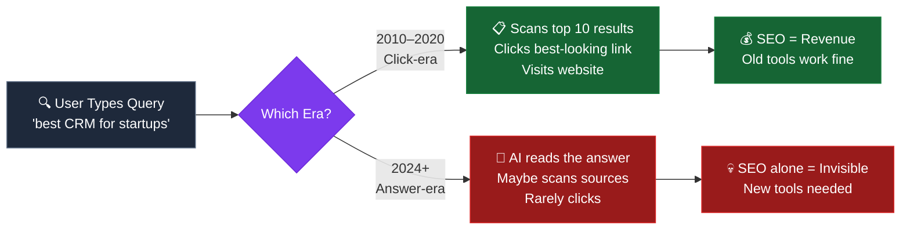

---

## 2. Product Vision & Strategy

### Vision
> *To be the first platform that makes AI search visibility as measurable, manageable, and improvable as traditional organic search — so that every content team can compete in the answer-engine era.*

### Strategic Pillars

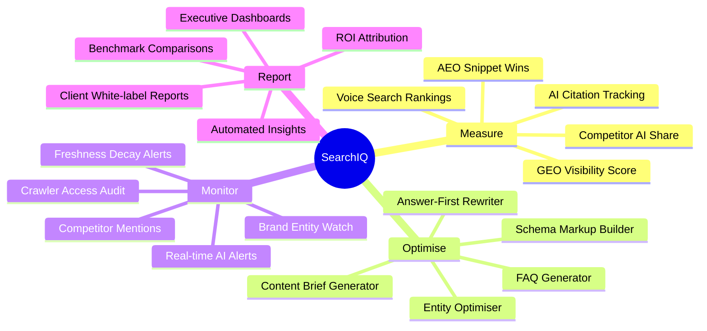

### Competitive Positioning

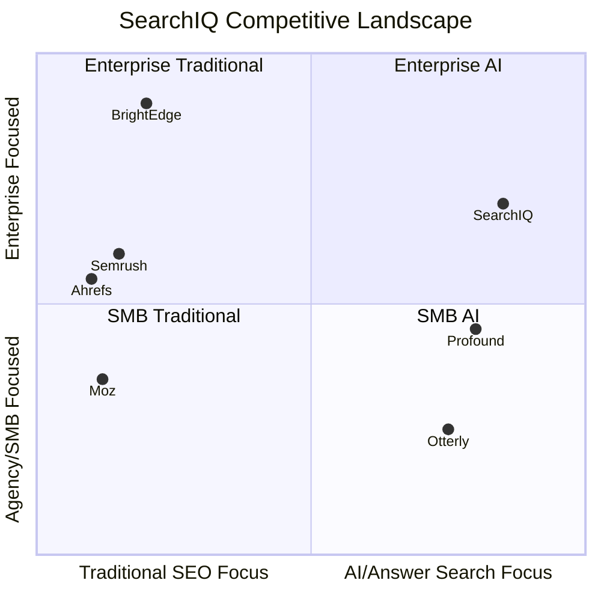

---

## 3. Market Opportunity

| Segment | TAM | SAM | SOM (Y3) |
|---|---|---|---|
| Global SEO Software Market | $1.6B | $400M | $18M |
| AI Search Optimisation (emerging) | $800M (projected) | $200M | $25M |
| Digital Agency Tools | $4.2B | $600M | $30M |
| **Total Addressable** | **~$6.6B** | **~$1.2B** | **$73M** |

### Market Tailwinds

- AI Overview appearances growing at ~40% YoY
- Perplexity growing from 10M → 100M+ monthly queries in 18 months
- 67% of marketers report zero-click rates increasing
- No single platform currently offers unified SEO + AEO + GEO measurement

---

## 4. Stakeholders

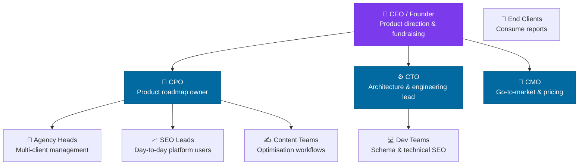

---

## 5. User Personas

### Persona 1: The Agency Director — "Alex"
- **Role:** Head of Digital at a 40-person agency managing 60+ client accounts
- **Pain:** Manually checking AI answers for each client is impossible at scale. Clients ask "are we in ChatGPT?" and there's no good answer.
- **Needs:** White-labelled client reporting, bulk monitoring, ROI dashboards, alerts
- **Willing to pay:** $500–$2,000/month

### Persona 2: The In-House SEO Lead — "Priya"
- **Role:** Senior SEO Manager at a mid-size e-commerce brand
- **Pain:** Knows AI search is important but has no tooling. Justifying investment to the CMO requires data she can't produce.
- **Needs:** GEO score benchmarking, content gap analysis, automated briefs
- **Willing to pay:** $200–$600/month

### Persona 3: The Enterprise Content Strategist — "Marcus"
- **Role:** VP Content at a Fortune 500 financial services firm
- **Pain:** Compliance requires knowing exactly where brand messaging appears. AI citations are ungoverned. Competitor AI mentions are eating their share.
- **Needs:** Enterprise governance, brand entity monitoring, competitor tracking, API access
- **Willing to pay:** $2,000–$10,000/month

---

## 6. Core Product Features

### Feature Map

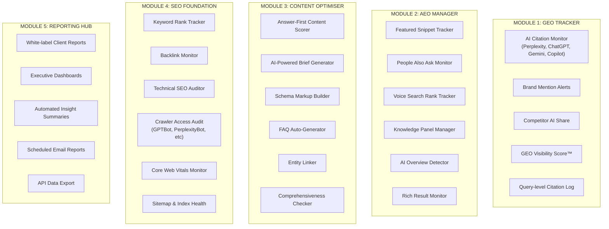

---

## 7. System Architecture — AWS Microservices

### High-Level Architecture

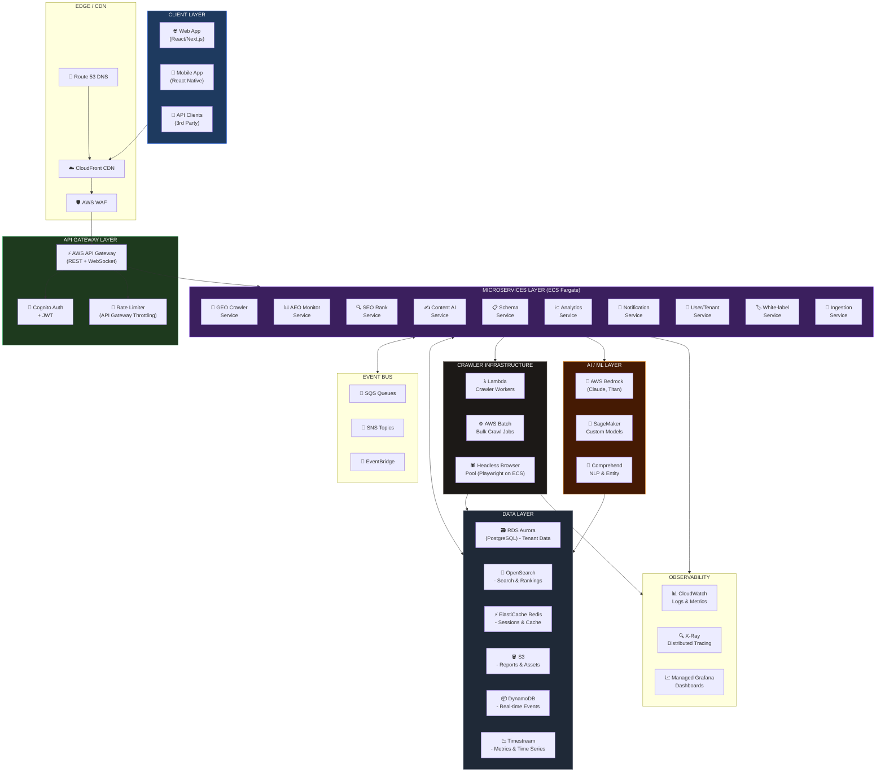

---

### Microservice Detail — Service Responsibilities

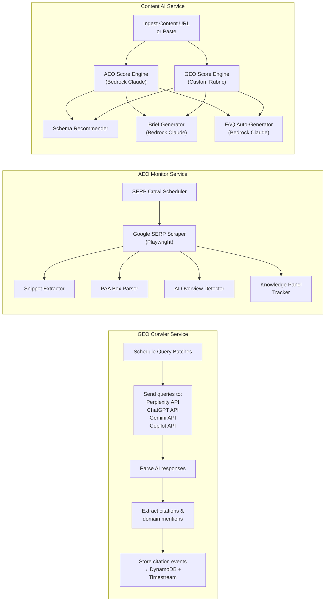

---

### Deployment Architecture

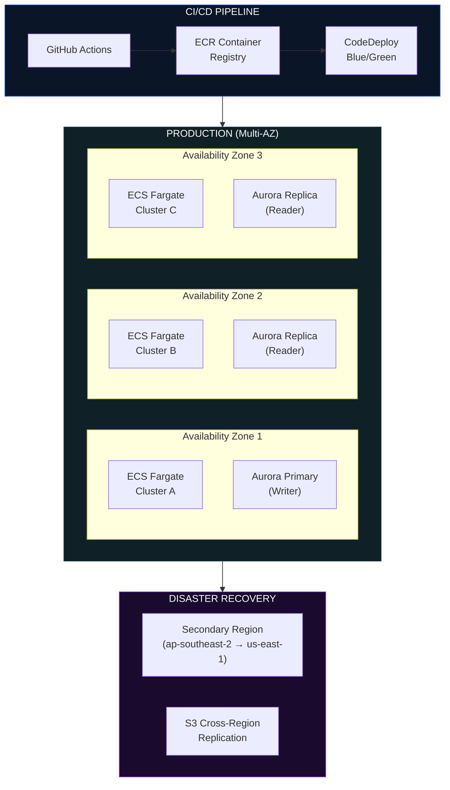

---

### Multi-Tenancy Architecture

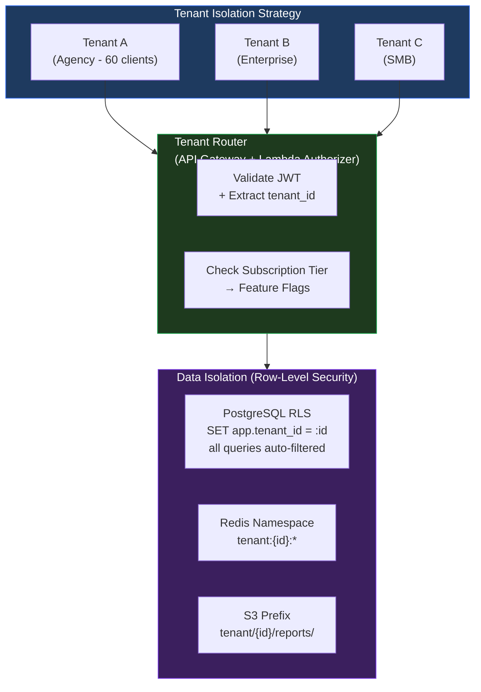

---

## 8. Data Architecture & Data Flow

### Core Data Flow — GEO Tracking

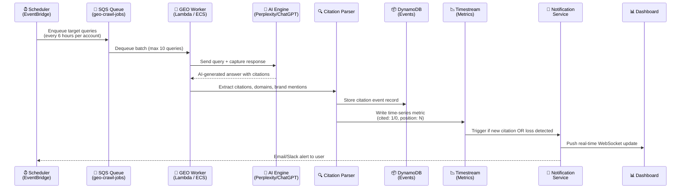

---

### Content Optimisation Flow

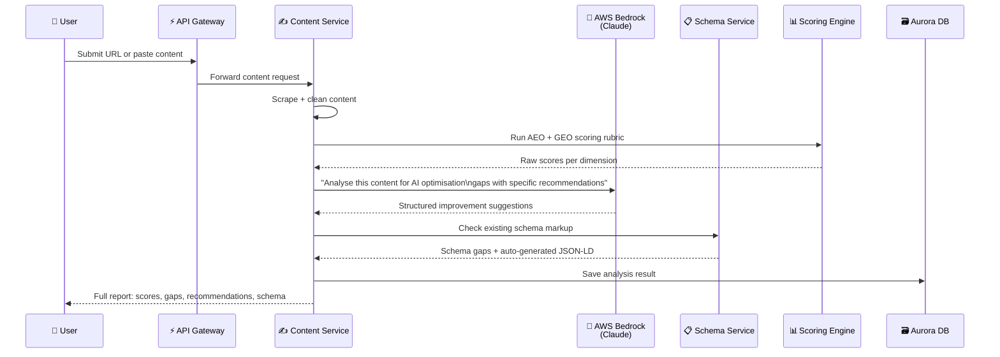

---

### Data Schema (Core Entities)

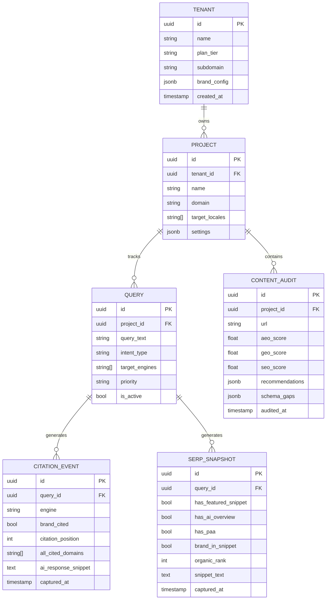

---

## 9. Module Specifications

### Module 1: GEO Visibility Score™

The **GEO Visibility Score** is SearchIQ's proprietary metric — a 0–100 composite score representing how visible a brand is across AI-generated search responses.

#### Score Calculation

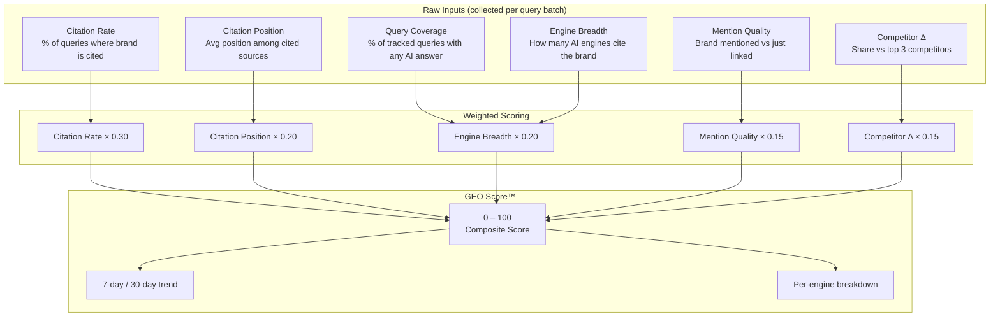

#### GEO Score Bands

| Score | Label | Description |
|---|---|---|
| 85–100 | 🟢 **Dominant** | Cited in most tracked queries across multiple AI engines |
| 65–84 | 🔵 **Established** | Consistently cited; strong single-engine presence |
| 40–64 | 🟡 **Emerging** | Cited sporadically; significant gaps in coverage |
| 15–39 | 🟠 **Weak** | Rarely cited; competitor brands dominate |
| 0–14 | 🔴 **Invisible** | Not found in AI responses; urgent remediation needed |

---

### Module 2: AEO Command Centre

#### SERP Feature Detection Logic

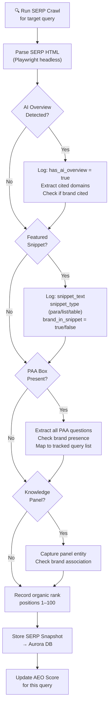

---

### Module 3: Content Optimiser — Scoring Rubric

The Content Optimiser evaluates any piece of content across 6 dimensions:

```mermaid
radar
  title Content AEO/GEO Readiness Score (Example Output)
  "Answer-First Structure" : 85
  "Schema Markup" : 40
  "Question Coverage" : 70
  "Statistical Depth" : 55
  "Entity Clarity" : 65
  "Chunk Independence" : 50
```

#### Dimension Definitions

| Dimension | Weight | What it measures |
|---|---|---|
| Answer-First Structure | 20% | Does each section open with a direct answer? Inverted pyramid use |
| Schema Markup | 20% | FAQPage, HowTo, Article, Speakable presence and validity |
| Question Coverage | 18% | % of PAA questions for this topic addressed |
| Statistical Depth | 15% | Named, cited, specific statistics per 1,000 words |
| Entity Clarity | 15% | Definitional sentences, named attributions, entity mentions |
| Chunk Independence | 12% | Each section readable without surrounding context |

---

### Module 4: Schema Builder

An interactive, zero-code schema markup generator:

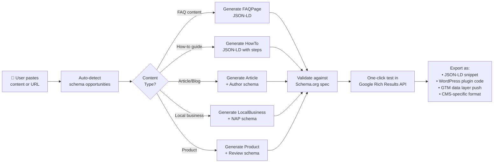

---

### Module 5: AI Crawler Audit

A dedicated tool to ensure all AI crawlers have access to client sites:

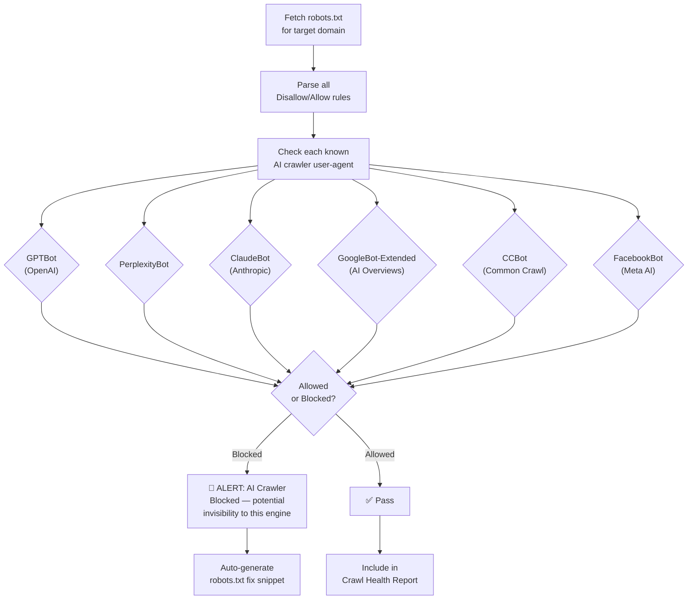

---

## 10. Metrics, Dashboards & KPIs

### Primary Dashboard — Executive View

The executive dashboard surfaces three headline scores plus trend indicators:

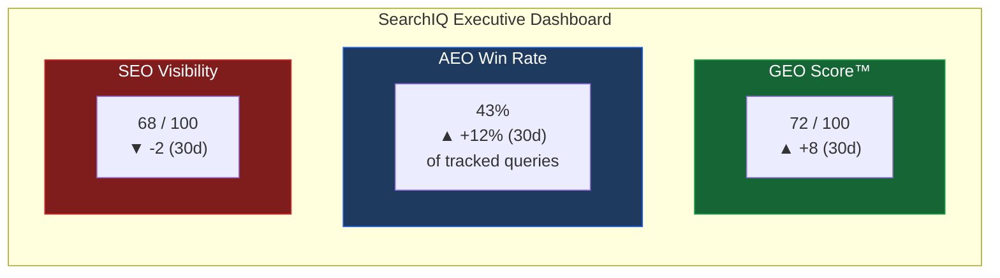

### Key Metrics Tracked

#### GEO Metrics

| Metric | Definition | Frequency |
|---|---|---|
| **GEO Visibility Score™** | Composite 0–100 AI citation score | Daily |
| **Citation Rate** | % of tracked queries where brand is cited by any AI engine | Per crawl |
| **Per-Engine Citation Rate** | Citation rate broken down by Perplexity / ChatGPT / Gemini / Copilot | Per crawl |
| **Citation Position** | Average ranked position of brand among all cited sources | Per crawl |
| **AI Share of Voice** | Brand citations / (Brand + top 3 competitors) citations | Weekly |
| **New Citation Gain** | Queries newly citing brand this period (wasn't cited before) | Weekly |
| **Citation Loss** | Queries that used to cite brand but no longer do | Weekly |
| **Engine Coverage** | Number of distinct AI engines that have cited brand at least once | Monthly |

#### AEO Metrics

| Metric | Definition | Frequency |
|---|---|---|
| **Featured Snippet Win Rate** | % of tracked queries where brand owns the snippet | Daily |
| **PAA Presence Rate** | % of tracked queries where brand appears in PAA box | Daily |
| **AI Overview Citation Rate** | % of tracked queries where brand cited in Google AI Overview | Daily |
| **Voice Rank (Position 1 Rate)** | % of voice-intent queries where brand answer is returned | Weekly |
| **Zero-Click Impact Score** | Estimated impressions captured via answer positions | Weekly |
| **Rich Result Coverage** | % of site content with valid rich result schema | Weekly |

#### SEO Metrics

| Metric | Definition | Frequency |
|---|---|---|
| **Visibility Score** | Weighted rank score across all tracked keywords | Daily |
| **Average Position** | Mean organic position for tracked queries | Daily |
| **Top 3 Rate** | % of queries ranking positions 1–3 | Daily |
| **Crawl Health Score** | Composite of Core Web Vitals + index coverage + redirect chains | Weekly |
| **AI Crawler Access Score** | % of AI crawlers explicitly allowed in robots.txt | Weekly |
| **Backlink Authority Score** | DR-equivalent composite from indexed link profile | Weekly |

---

### Metric Trend Visualisations

#### GEO Score Over Time (Concept)

```mermaid
xychart-beta
    title "GEO Visibility Score — 12-Month Trend"
    x-axis ["Apr", "May", "Jun", "Jul", "Aug", "Sep", "Oct", "Nov", "Dec", "Jan", "Feb", "Mar"]
    y-axis "GEO Score (0-100)" 0 --> 100
    line [18, 22, 28, 31, 38, 42, 49, 55, 60, 65, 69, 72]
```

#### AI Share of Voice — Competitor View (Concept)

```mermaid
xychart-beta
    title "AI Share of Voice — Brand vs Top 3 Competitors"
    x-axis ["Q1", "Q2", "Q3", "Q4"]
    y-axis "% of AI Citations" 0 --> 50
    bar [12, 18, 25, 32]
    line [30, 28, 25, 22]
```

---

### Alerting & Notification Framework

```mermaid
flowchart TD
    EVENT["📊 Metric Change Detected\n(Timestream → Lambda trigger)"] --> CLASSIFY{"Severity\nClassification"}

    CLASSIFY -->|Δ > 20% drop| CRITICAL["🔴 CRITICAL\nImmediate alert"]
    CLASSIFY -->|Δ 10–20% drop| WARN["🟡 WARNING\n24hr digest"]
    CLASSIFY -->|Δ < 10% / positive| INFO["🟢 INFO\nWeekly summary"]

    CRITICAL --> SLACK["Slack Alert\n(channel + @mention)"]
    CRITICAL --> EMAIL_NOW["Immediate Email"]
    CRITICAL --> DASH_BADGE["Dashboard Alert Badge"]

    WARN --> EMAIL_DIGEST["Daily Email Digest"]
    WARN --> DASH_BADGE

    INFO --> WEEKLY_REPORT["Weekly Report\n(auto-generated PDF)"]

    subgraph ALERT_TYPES["Alert Trigger Types"]
        AT1["🆕 New competitor citation\nin tracked query"]
        AT2["📉 Citation loss:\nbrand dropped from AI answer"]
        AT3["🚫 AI crawler newly\nblocked in robots.txt"]
        AT4["🎯 Snippet stolen\nby competitor"]
        AT5["📈 GEO Score milestone\n(every 10 points)"]
        AT6["📋 Schema error\ndetected on key page"]
    end
```

---

## 11. Security & Compliance

### Security Architecture

```mermaid
flowchart TD
    subgraph PERIMETER["Perimeter Security"]
        WAF["AWS WAF\n- OWASP Top 10 rules\n- Rate limiting\n- Bot management"]
        SHIELD["AWS Shield Advanced\nDDoS Protection"]
        CF_SEC["CloudFront\nGeo-blocking if required"]
    end

    subgraph APP_SEC["Application Security"]
        COGNITO["Cognito\nMFA enforced for all users"]
        JWT["JWT Tokens\n15min access / 7d refresh"]
        RBAC["Role-Based Access Control\nOwner / Admin / Analyst / Viewer"]
        SECRETS["Secrets Manager\nAll API keys + DB credentials"]
    end

    subgraph DATA_SEC["Data Security"]
        ENCRYPT_TRANSIT["TLS 1.3\nAll in-transit data"]
        ENCRYPT_REST["AES-256\nAll at-rest (RDS, S3, DynamoDB)"]
        RLS["PostgreSQL RLS\nRow-level tenant isolation"]
        AUDIT_LOG["CloudTrail\nAll API + data access logged"]
    end

    subgraph COMPLIANCE["Compliance"]
        GDPR["GDPR\nData residency controls\nRight to erasure API"]
        SOC2["SOC2 Type II\n(Target: Year 2)"]
        PRIVACY["Privacy by Design\nNo PII in crawler payloads"]
    end

    PERIMETER --> APP_SEC --> DATA_SEC --> COMPLIANCE
```

---

## 12. Infrastructure & Scalability

### Auto-Scaling Strategy

```mermaid
flowchart TB
    subgraph LOAD["Load Patterns"]
        L1["Steady State\n~100 req/sec"]
        L2["Peak: Report Generation\n~500 req/sec"]
        L3["Crawl Burst\n~10,000 queries/hour"]
    end

    subgraph SCALE["Scaling Mechanisms"]
        ECS_SCALE["ECS Fargate Auto-scaling\nTarget tracking: CPU 60%\nMin: 2, Max: 50 tasks"]
        LAMBDA_SCALE["Lambda Concurrency\nReserved: 500\nCrawl workers: on-demand burst"]
        RDS_SCALE["Aurora Serverless v2\nACU: 0.5–128\nAuto-pause in dev"]
        CACHE_SCALE["ElastiCache\nCluster mode\n3 shards × 2 replicas"]
    end

    L1 --> ECS_SCALE
    L2 --> ECS_SCALE & RDS_SCALE
    L3 --> LAMBDA_SCALE & CACHE_SCALE

    style LOAD fill:#1e3a5f,stroke:#2563eb,color:#fff
    style SCALE fill:#1e3a1e,stroke:#16a34a,color:#fff
```

### Infrastructure Cost Model (Monthly — 1,000 Tenants)

| Component | Service | Est. Monthly Cost |
|---|---|---|
| Compute (services) | ECS Fargate | $1,200 |
| Compute (crawlers) | Lambda + ECS Batch | $800 |
| Database | Aurora Serverless v2 | $600 |
| Cache | ElastiCache Redis | $300 |
| Search | OpenSearch | $400 |
| Time-series DB | Timestream | $200 |
| Storage | S3 + DynamoDB | $150 |
| CDN | CloudFront | $100 |
| AI/ML | Bedrock API calls | $1,500 |
| Monitoring | CloudWatch + Grafana | $200 |
| **Total Infrastructure** | | **~$5,450/mo** |
| **Cost per tenant** | | **~$5.45/mo** |

At $299/month average plan, infrastructure is ~1.8% of revenue. Gross margin target: **>80%**.

---

## 13. Integrations

### Integration Architecture

```mermaid
flowchart LR
    subgraph SEARCHIQ["SearchIQ Core"]
        INT_HUB["Integration Hub\n(ECS Fargate)"]
        WEBHOOK["Webhook Engine"]
        OAUTH["OAuth 2.0\nManager"]
    end

    subgraph DATA_IN["Data-In Integrations"]
        GSC["Google Search Console\nAPI — rank + impression data"]
        GA4["Google Analytics 4\nTraffic + conversion data"]
        GADS["Google Ads\nPaid keyword context"]
        SEMrush["Semrush API\nBacklink + keyword fallback"]
    end

    subgraph NOTIFY["Notification Integrations"]
        SLACK_INT["Slack\nAlert channels"]
        TEAMS["Microsoft Teams\nAlert channels"]
        EMAIL_INT["SendGrid\nTransactional email"]
        PAGERDUTY["PagerDuty\nCritical alerts"]
    end

    subgraph CMS["CMS Integrations"]
        WP["WordPress Plugin\nSchema injection + score widget"]
        WEBFLOW["Webflow\nSchema embed via script"]
        CONTENTFUL["Contentful\nContent audit webhook"]
        SHOPIFY["Shopify\nProduct schema audit"]
    end

    subgraph EXPORT["Export / BI"]
        SHEETS["Google Sheets\nAuto-export reports"]
        DATASTUDIO["Looker Studio\nLive connector"]
        BIGQUERY["BigQuery\nData warehouse export"]
        ZAPIER["Zapier / Make\nWorkflow automation"]
    end

    INT_HUB --> DATA_IN
    INT_HUB --> NOTIFY
    INT_HUB --> CMS
    INT_HUB --> EXPORT
    OAUTH --> DATA_IN
    WEBHOOK --> NOTIFY & EXPORT
```

---

## 14. Pricing & Packaging

### Tier Structure

```mermaid
flowchart LR
    subgraph STARTER["🌱 Starter — $99/mo"]
        S1["1 domain"]
        S2["50 tracked queries"]
        S3["3 AI engines monitored"]
        S4["Weekly crawl frequency"]
        S5["Basic AEO + GEO dashboard"]
        S6["Email alerts"]
    end

    subgraph GROWTH["🚀 Growth — $299/mo"]
        G1["5 domains"]
        G2["250 tracked queries"]
        G3["All AI engines"]
        G4["Daily crawl frequency"]
        G5["Full AEO + GEO + SEO suite"]
        G6["Content Optimiser (20 audits/mo)"]
        G7["Schema Builder"]
        G8["Slack + Email alerts"]
    end

    subgraph AGENCY["🏢 Agency — $799/mo"]
        A1["25 domains (client accounts)"]
        A2["1,000 tracked queries"]
        A3["All engines + voice"]
        A4["6-hour crawl frequency"]
        A5["White-label client reports"]
        A6["Unlimited content audits"]
        A7["Competitor tracking (3 per domain)"]
        A8["API access"]
        A9["Priority support"]
    end

    subgraph ENTERPRISE["🏛️ Enterprise — Custom"]
        E1["Unlimited domains"]
        E2["Unlimited queries"]
        E3["1-hour crawl frequency"]
        E4["Custom brand entity setup"]
        E5["Dedicated CSM"]
        E6["SLA 99.9%"]
        E7["SSO / SAML"]
        E8["Custom integrations"]
        E9["Data residency options"]
    end

    style STARTER fill:#1f2937,stroke:#4b5563,color:#fff
    style GROWTH fill:#1e3a5f,stroke:#2563eb,color:#fff
    style AGENCY fill:#3b1f5e,stroke:#7c3aed,color:#fff
    style ENTERPRISE fill:#451a03,stroke:#d97706,color:#fff
```

---

## 15. Roadmap

```mermaid
gantt
    title SearchIQ Product Roadmap
    dateFormat  YYYY-MM
    section Phase 1 — MVP (Q2 2026)
    GEO Tracker (core)           :active, geo1, 2026-04, 2026-06
    AEO Monitor (snippets + PAA) :active, aeo1, 2026-04, 2026-06
    SEO Rank Tracker             :seo1, 2026-04, 2026-06
    Basic Dashboard              :dash1, 2026-05, 2026-06
    Multi-tenant Auth            :auth1, 2026-04, 2026-05

    section Phase 2 — Growth (Q3 2026)
    Content Optimiser            :cont1, 2026-07, 2026-08
    Schema Builder               :sch1, 2026-07, 2026-08
    AI Crawler Audit Tool        :craw1, 2026-07, 2026-08
    White-label Reports          :rep1, 2026-08, 2026-09
    Slack + Email Alerts         :alert1, 2026-07, 2026-07

    section Phase 3 — Scale (Q4 2026)
    Voice Search Tracking        :voice1, 2026-10, 2026-11
    Competitor AI Share          :comp1, 2026-10, 2026-11
    GSC + GA4 Integration        :gsc1, 2026-10, 2026-11
    Agency Multi-client Hub      :ag1, 2026-11, 2026-12
    WordPress Plugin             :wp1, 2026-11, 2026-12

    section Phase 4 — Enterprise (Q1 2027)
    Enterprise SSO/SAML          :sso1, 2027-01, 2027-02
    BigQuery Export              :bq1, 2027-01, 2027-02
    Custom GEO Rubric Builder    :rubric1, 2027-02, 2027-03
    Agentic Search Monitoring    :agent1, 2027-02, 2027-03
    Multimodal Tracking (Video)  :multi1, 2027-03, 2027-03
```

---

## 16. Risks & Mitigations

```mermaid
quadrantChart
    title Risk Matrix — Likelihood vs Impact
    x-axis "Low Likelihood" --> "High Likelihood"
    y-axis "Low Impact" --> "High Impact"
    quadrant-1 Monitor Closely
    quadrant-2 Immediate Action
    quadrant-3 Accept
    quadrant-4 Manage Actively
    AI API Rate Limits: [0.75, 0.70]
    Competitor Clones Feature: [0.65, 0.45]
    LLM Changes Citation Behaviour: [0.55, 0.85]
    Google Blocks SERP Scraping: [0.40, 0.80]
    Data Privacy Regulation: [0.35, 0.65]
    Team Scaling Difficulty: [0.50, 0.40]
    AWS Outage: [0.15, 0.75]
    Low Conversion Rate: [0.45, 0.55]
```

| Risk | Likelihood | Impact | Mitigation |
|---|---|---|---|
| LLM changes citation behaviour | Medium | High | Multi-engine redundancy; monitor model update announcements |
| AI API rate limits / cost increase | High | Medium | Build caching layer; negotiate enterprise contracts; own crawl layer where possible |
| Google blocks SERP scraping | Medium | High | Use official Search Console API where possible; maintain headless browser fallback; legal counsel review |
| Competitor (Semrush, Ahrefs) copies feature | High | Medium | IP moat via proprietary GEO Score™ methodology; brand + customer lock-in |
| Privacy regulation (GDPR AI) | Low-Medium | Medium | Privacy by design from day one; DPA + data residency options |
| AWS Outage | Low | High | Multi-AZ + cross-region DR; 99.9% SLA with 30-min RPO target |

---

## 17. Acceptance Criteria

### Phase 1 MVP Go/No-Go Criteria

```mermaid
flowchart TD
    subgraph MUST["🔴 Must-Have (P0 — MVP blockers)"]
        M1["✅ GEO Tracker queries Perplexity + ChatGPT\nwith < 2hr data freshness"]
        M2["✅ AEO Monitor detects featured snippets\nand PAA with ≥ 90% accuracy vs manual check"]
        M3["✅ Multi-tenant isolation verified:\nno cross-tenant data leakage in pen test"]
        M4["✅ GEO Visibility Score™ computes\ncorrectly for 100 test queries"]
        M5["✅ Dashboard loads in < 2 seconds\nfor accounts with 250 queries"]
        M6["✅ Alert system delivers notifications\nwithin 5 minutes of trigger event"]
    end

    subgraph SHOULD["🟡 Should-Have (P1 — Target at launch)"]
        S1["Content Optimiser scoring\nwithin ±5 points of expert manual review"]
        S2["Schema Builder generates\nvalid JSON-LD passing Rich Results Test"]
        S3["White-label reports\nrender in < 10 seconds"]
        S4["GSC integration imports\ndata within 1 hour of auth"]
    end

    subgraph NICE["🟢 Nice-to-Have (P2 — Post-launch)"]
        N1["Voice search rank tracking"]
        N2["WordPress plugin 1-click install"]
        N3["Competitor AI share tracking"]
    end

    MUST --> LAUNCH["🚀 MVP Launch Decision"]
    SHOULD --> LAUNCH
```

### System Performance SLAs

| Metric | Target | Critical Threshold |
|---|---|---|
| API Response Time (p50) | < 200ms | < 500ms |
| API Response Time (p99) | < 1,000ms | < 2,000ms |
| Dashboard Load Time | < 2s | < 4s |
| GEO Crawl Freshness | ≤ 6 hours | ≤ 12 hours |
| AEO SERP Freshness | ≤ 24 hours | ≤ 48 hours |
| Platform Uptime | 99.9% | 99.5% |
| Data Accuracy (vs manual) | ≥ 90% | ≥ 80% |
| Alert Delivery Time | < 5 minutes | < 15 minutes |

---

## Appendix A — AWS Services Reference

| AWS Service | SearchIQ Use Case |
|---|---|
| **ECS Fargate** | All microservices (stateless, containerised) |
| **Lambda** | Crawler workers, event triggers, lightweight transformations |
| **API Gateway** | REST + WebSocket APIs, rate limiting, auth integration |
| **Cognito** | User auth, MFA, JWT issuance |
| **Aurora Serverless v2** | Primary relational DB (tenant + project data) |
| **DynamoDB** | Real-time citation events, high-throughput writes |
| **Timestream** | Time-series metrics for all tracked KPIs |
| **ElastiCache (Redis)** | Session store, query result caching, pub/sub |
| **OpenSearch** | Full-text search, keyword/content indexing |
| **S3** | Report storage, asset storage, data lake |
| **EventBridge** | Scheduled crawl triggers, event routing |
| **SQS** | Crawl job queues, async processing |
| **SNS** | Alert fan-out to email/Slack/webhooks |
| **AWS Batch** | Bulk historical crawl jobs |
| **Bedrock** | Claude / Titan for content analysis and AI generation |
| **SageMaker** | Custom scoring models (GEO rubric training) |
| **Comprehend** | NLP entity extraction from crawled content |
| **Secrets Manager** | API keys, DB credentials |
| **CloudFront** | CDN for web app and static assets |
| **WAF** | OWASP protection, bot rules |
| **Shield Advanced** | DDoS protection |
| **Route 53** | DNS + health-check-based failover |
| **CloudWatch** | Logs, metrics, alarms |
| **X-Ray** | Distributed tracing across microservices |
| **Managed Grafana** | Operational dashboards |
| **CloudTrail** | Audit logging for compliance |
| **CodePipeline + CodeDeploy** | CI/CD with blue/green deployments |
| **ECR** | Container registry |
| **VPC + PrivateLink** | Network isolation + secure service communication |

---