+++
date = '2023-01-01T12:44:47+10:00'
draft = false
title = '23 Core Design Patterns'
tags = ['Core Design Patterns', 'Interview']
+++

Core design patterns are proven, reusable solutions to frequently occurring problems in software design. Catalogued by the "Gang of Four" (Gamma, Helm, Johnson, Vlissides) in their seminal 1994 book *Design Patterns: Elements of Reusable Object-Oriented Software*, these 23 patterns are language-agnostic blueprints.

## Creational Patterns

Creational patterns abstract the object instantiation process, decoupling a system from how its objects are created, composed, and represented. They give a system greater flexibility in deciding which objects need to be created for a given use case.

### Singleton

Ensures a class has only one instance throughout the lifetime of an application and provides a single, globally accessible point of access to it. The class itself is responsible for controlling its instantiation, preventing any external code from calling the constructor directly. This is useful for managing shared resources such as configuration objects, connection pools, or logging services, where multiple instances would cause inconsistent behaviour or wasted resources.

**Example (Java):**
```java
public class Singleton {
    // volatile ensures changes are visible across threads immediately
    private static volatile Singleton uniqueInstance;

    private Singleton() {}

    // Double-checked locking: avoids synchronisation overhead on every call
    public static Singleton getInstance() {
        if (uniqueInstance == null) {
            synchronized (Singleton.class) {
                if (uniqueInstance == null) {
                    uniqueInstance = new Singleton();
                }
            }
        }
        return uniqueInstance;
    }
}
```

**Class Diagram**
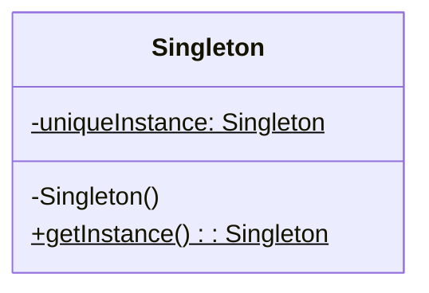
```mermaid
classDiagram
    class Singleton {
        -uniqueInstance: Singleton$
        -Singleton()
        +getInstance(): Singleton$
    }
```

**When to use:**

- When exactly one shared resource must co-ordinate access across the system (e.g., configuration manager, logger, cache, thread pool).
- When lazy initialisation of an expensive resource is required and concurrent access must be safe.

**When not to use:**

- When you need multiple instances (e.g., in unit testing, Singletons introduce hidden global state that makes tests brittle and hard to isolate).
- In highly concurrent systems without careful synchronisation, as naive implementations can yield multiple instances.
- When the class needs to be subclassed, since the private constructor prevents inheritance.

---

### Factory Method

Defines an interface or abstract class for creating a single object, but delegates the responsibility of deciding which concrete class to instantiate to its subclasses. Rather than calling a constructor directly, client code calls a factory method, allowing the subclass to determine the type of object created. This promotes loose coupling because the client depends on the abstract type, not on any specific implementation.

**Example (Java):**
```java
public abstract class Animal {
    public abstract String speak();
}

public class Dog extends Animal {
    public String speak() { return "Woof!"; }
}

public class Cat extends Animal {
    public String speak() { return "Meow!"; }
}

public abstract class AnimalFactory {
    // The factory method — subclasses decide what to create
    public abstract Animal createAnimal();

    // The "creator" can still use the product via the factory method
    public String getSound() {
        Animal animal = createAnimal();
        return animal.speak();
    }
}

public class DogFactory extends AnimalFactory {
    public Animal createAnimal() { return new Dog(); }
}

public class CatFactory extends AnimalFactory {
    public Animal createAnimal() { return new Cat(); }
}
```

**Class Diagram**
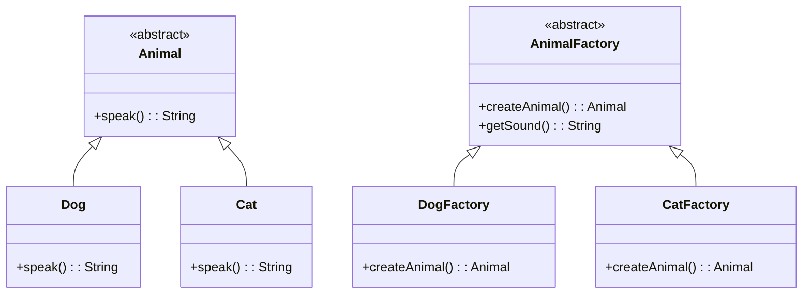
```mermaid
classDiagram
    class Animal {
        <<abstract>>
        +speak(): String
    }
    class Dog {
        +speak(): String
    }
    class Cat {
        +speak(): String
    }
    class AnimalFactory {
        <<abstract>>
        +createAnimal(): Animal
        +getSound(): String
    }
    class DogFactory {
        +createAnimal(): Animal
    }
    class CatFactory {
        +createAnimal(): Animal
    }
    AnimalFactory <|-- DogFactory
    AnimalFactory <|-- CatFactory
    Animal <|-- Dog
    Animal <|-- Cat
```

**When to use:**

- When a class cannot anticipate the class of objects it must create at compile time.
- When subclasses should have control over which objects are created, allowing the system to be extended with new product types without modifying existing client code (Open/Closed Principle).

**When not to use:**

- When the type of object to create is fixed and will never change — the added abstraction introduces unnecessary complexity.
- When object creation is trivial and direct instantiation is clearer.

---

### Abstract Factory

Provides an interface for creating **families** of related or dependent objects without specifying their concrete classes. Where the Factory Method creates one product, the Abstract Factory creates a suite of products that are designed to work together. Swapping the factory implementation changes the entire product family in one place, guaranteeing consistency across the family.

**Example (Java):**
```java
public interface Button {
    void paint();
}

public interface Checkbox {
    void paint();
}

public class WinButton implements Button {
    public void paint() { System.out.println("Windows Button"); }
}

public class MacButton implements Button {
    public void paint() { System.out.println("Mac Button"); }
}

public class WinCheckbox implements Checkbox {
    public void paint() { System.out.println("Windows Checkbox"); }
}

public class MacCheckbox implements Checkbox {
    public void paint() { System.out.println("Mac Checkbox"); }
}

// The Abstract Factory — declares creation methods for each product type
public interface GUIFactory {
    Button createButton();
    Checkbox createCheckbox();
}

// Concrete factories produce an entire family of platform-consistent products
public class WinFactory implements GUIFactory {
    public Button createButton() { return new WinButton(); }
    public Checkbox createCheckbox() { return new WinCheckbox(); }
}

public class MacFactory implements GUIFactory {
    public Button createButton() { return new MacButton(); }
    public Checkbox createCheckbox() { return new MacCheckbox(); }
}
```

**Class Diagram**
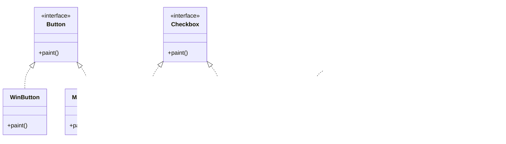
```mermaid
classDiagram
    class Button {
        <<interface>>
        +paint()
    }
    class Checkbox {
        <<interface>>
        +paint()
    }
    class WinButton {
        +paint()
    }
    class MacButton {
        +paint()
    }
    class WinCheckbox {
        +paint()
    }
    class MacCheckbox {
        +paint()
    }
    class GUIFactory {
        <<interface>>
        +createButton(): Button
        +createCheckbox(): Checkbox
    }
    class WinFactory {
        +createButton(): Button
        +createCheckbox(): Checkbox
    }
    class MacFactory {
        +createButton(): Button
        +createCheckbox(): Checkbox
    }
    Button <|.. WinButton
    Button <|.. MacButton
    Checkbox <|.. WinCheckbox
    Checkbox <|.. MacCheckbox
    GUIFactory <|.. WinFactory
    GUIFactory <|.. MacFactory
```

**When to use:**

- When the system must be independent of how its products are created and when it needs to work with multiple families of products (e.g., cross-platform UI toolkits, database driver families).
- When you need to enforce that products from one family are always used together, preventing accidental mixing (e.g., a Mac button with a Windows checkbox).

**When not to use:**

- When products do not belong to related families and there is no need to enforce consistent groupings.
- When only one product type needs to be created — a simpler Factory Method is more appropriate.

---

### Builder

Separates the construction of a complex object from its final representation, allowing the same construction process to produce different representations. Instead of a large constructor with many optional parameters (the "telescoping constructor" anti-pattern), the Builder pattern uses a dedicated Builder object that assembles the target object step by step via clearly named methods. This results in more readable, flexible, and maintainable object construction code.

**Example (Java):**
```java
public class Burger {
    private final boolean cheese;
    private final boolean lettuce;
    private final boolean bacon;

    // Private constructor — only the inner Builder can create a Burger
    private Burger(Builder builder) {
        this.cheese = builder.cheese;
        this.lettuce = builder.lettuce;
        this.bacon = builder.bacon;
    }

    public static class Builder {
        private boolean cheese;
        private boolean lettuce;
        private boolean bacon;

        public Builder addCheese() {
            cheese = true;
            return this;
        }
        public Builder addLettuce() {
            lettuce = true;
            return this;
        }
        public Builder addBacon() {
            bacon = true;
            return this;
        }
        public Burger build() {
            return new Burger(this);
        }
    }
}

// Usage: new Burger.Builder().addCheese().addLettuce().build();
```

**Class Diagram**
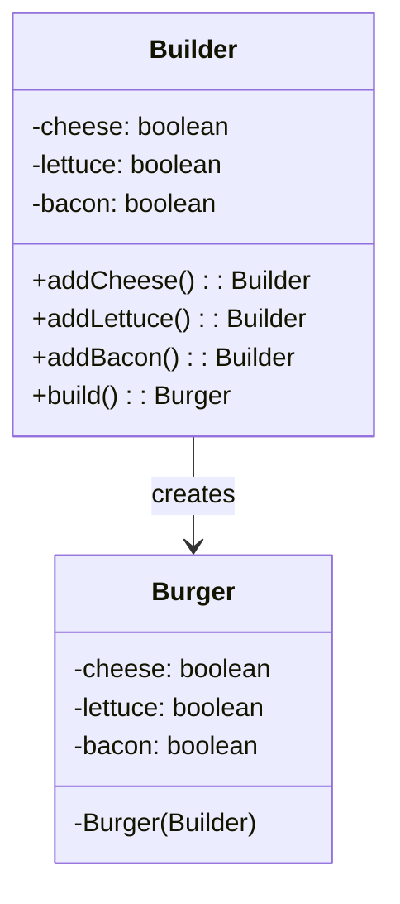
```mermaid
classDiagram
    class Burger {
        -cheese: boolean
        -lettuce: boolean
        -bacon: boolean
        -Burger(Builder)
    }
    class Builder {
        -cheese: boolean
        -lettuce: boolean
        -bacon: boolean
        +addCheese(): Builder
        +addLettuce(): Builder
        +addBacon(): Builder
        +build(): Burger
    }
    Builder --> Burger : creates
```

**When to use:**

- When constructing complex objects that have many optional parameters or configuration steps, and you want to avoid ambiguous, order-sensitive constructors.
- When the same construction process should be able to produce different representations of the product (e.g., building a report in PDF vs HTML format).

**When not to use:**

- For simple objects with only a few required fields — direct construction or a static factory method is simpler and less verbose.

---

### Prototype

Creates new objects by copying (cloning) an existing object, known as the prototype. Rather than instantiating a new object from scratch via a constructor, the client asks the prototype to clone itself. This is particularly useful when object creation is expensive (e.g., involves database lookups or complex computation) and the new object is only a slight variation of an existing one. Care must be taken to distinguish between **shallow copies** (references are shared) and **deep copies** (all referenced objects are also duplicated).

**Example (Java):**
```java
public abstract class Shape implements Cloneable {
    private String colour;

    public Shape(String colour) { this.colour = colour; }

    public String getColour() { return colour; }

    // Shallow clone is provided by Object.clone(); override for deep copy
    @Override
    public Shape clone() {
        try {
            return (Shape) super.clone();
        } catch (CloneNotSupportedException e) {
            throw new AssertionError("Cloning not supported", e);
        }
    }

    public abstract void draw();
}

public class Circle extends Shape {
    private int radius;

    public Circle(String colour, int radius) {
        super(colour);
        this.radius = radius;
    }

    @Override
    public void draw() {
        System.out.println("Circle: colour=" + getColour() + ", radius=" + radius);
    }
}
```

**Class Diagram**
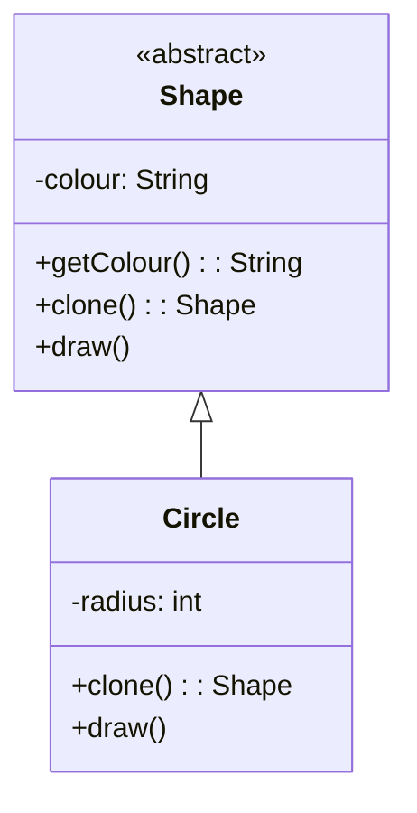
```mermaid
classDiagram
    class Shape {
        <<abstract>>
        -colour: String
        +getColour(): String
        +clone(): Shape
        +draw()
    }
    class Circle {
        -radius: int
        +clone(): Shape
        +draw()
    }
    Shape <|-- Circle
```

**When to use:**

- When object creation is costly or complex and you need many objects that differ only slightly from an existing instance.
- When classes to instantiate are specified at runtime (e.g., loaded dynamically) and you want to avoid building a parallel class hierarchy of factories.

**When not to use:**

- When objects are simple and cheap to construct — cloning adds complexity without benefit.
- When deep copying is required but the object graph contains circular references, which can make safe cloning difficult to implement correctly.

---

## Structural Patterns

Structural patterns deal with object and class composition, describing how classes and objects can be assembled into larger, more flexible structures. They use inheritance and composition to form new functionality without changing the source classes.

### Adapter

Converts the interface of a class into another interface that clients expect, allowing classes with incompatible interfaces to collaborate. It acts as a wrapper around an existing class, translating calls from the client into calls the adaptee understands. There are two variants: the **Object Adapter** (uses composition — holds an instance of the adaptee) and the **Class Adapter** (uses multiple inheritance — only possible in languages that support it).

**Example (Java):**
```java
// Target interface that the client expects
public interface USASocket {
    int voltage();
}

// Adaptee — existing class with an incompatible interface
public class EuropeanSocket {
    public int europeanVoltage() { return 230; }
}

// Object Adapter — wraps the adaptee and translates the interface
public class SocketAdapter implements USASocket {
    private EuropeanSocket europeanSocket;

    public SocketAdapter(EuropeanSocket socket) {
        this.europeanSocket = socket;
    }

    @Override
    public int voltage() {
        // Translate: convert 230V to 110V for a USA device
        return europeanSocket.europeanVoltage() / 2;
    }
}
```

**Class Diagram**
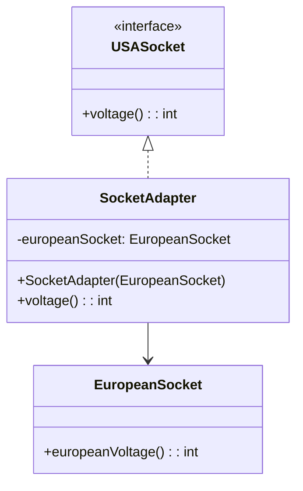
```mermaid
classDiagram
    class USASocket {
        <<interface>>
        +voltage(): int
    }
    class EuropeanSocket {
        +europeanVoltage(): int
    }
    class SocketAdapter {
        -europeanSocket: EuropeanSocket
        +SocketAdapter(EuropeanSocket)
        +voltage(): int
    }
    USASocket <|.. SocketAdapter
    SocketAdapter --> EuropeanSocket
```

**When to use:**

- When integrating with legacy, third-party, or external libraries whose interfaces you cannot modify.
- When you want to create a reusable class that can co-operate with classes that have incompatible interfaces.

**When not to use:**

- When you have the ability to refactor both sides of the integration — a direct, clean interface is always preferable to an adapter.
- When the mismatch between interfaces is so large that the adapter itself becomes complex and hard to maintain.

---

### Bridge

Decouples an abstraction from its implementation so that both can vary independently. Rather than using inheritance to bind an abstraction tightly to its implementation, the Bridge pattern uses composition — the abstraction holds a reference to an implementor object. This avoids the combinatorial explosion of subclasses that would result from trying to cover every combination of abstraction and implementation through inheritance alone.

**Example (Java):**
```java
// Implementor — defines the interface for implementation classes
public interface DrawingAPI {
    void drawCircle(int x, int y, int radius);
}

// Concrete Implementors
public class DrawingAPI1 implements DrawingAPI {
    public void drawCircle(int x, int y, int radius) {
        System.out.println("API1: Circle at (" + x + "," + y + ") radius=" + radius);
    }
}

public class DrawingAPI2 implements DrawingAPI {
    public void drawCircle(int x, int y, int radius) {
        System.out.println("API2: Circle at (" + x + "," + y + ") radius=" + radius);
    }
}

// Abstraction — uses the implementor via composition, not inheritance
public abstract class Shape {
    protected DrawingAPI drawingAPI;
    public Shape(DrawingAPI drawingAPI) { this.drawingAPI = drawingAPI; }
    public abstract void draw();
    public abstract void resize(double factor);
}

// Refined Abstraction
public class Circle extends Shape {
    private int x, y, radius;
    public Circle(int x, int y, int radius, DrawingAPI drawingAPI) {
        super(drawingAPI);
        this.x = x; this.y = y; this.radius = radius;
    }
    public void draw() { drawingAPI.drawCircle(x, y, radius); }
    public void resize(double factor) { radius = (int)(radius * factor); }
}
```

**Class Diagram**
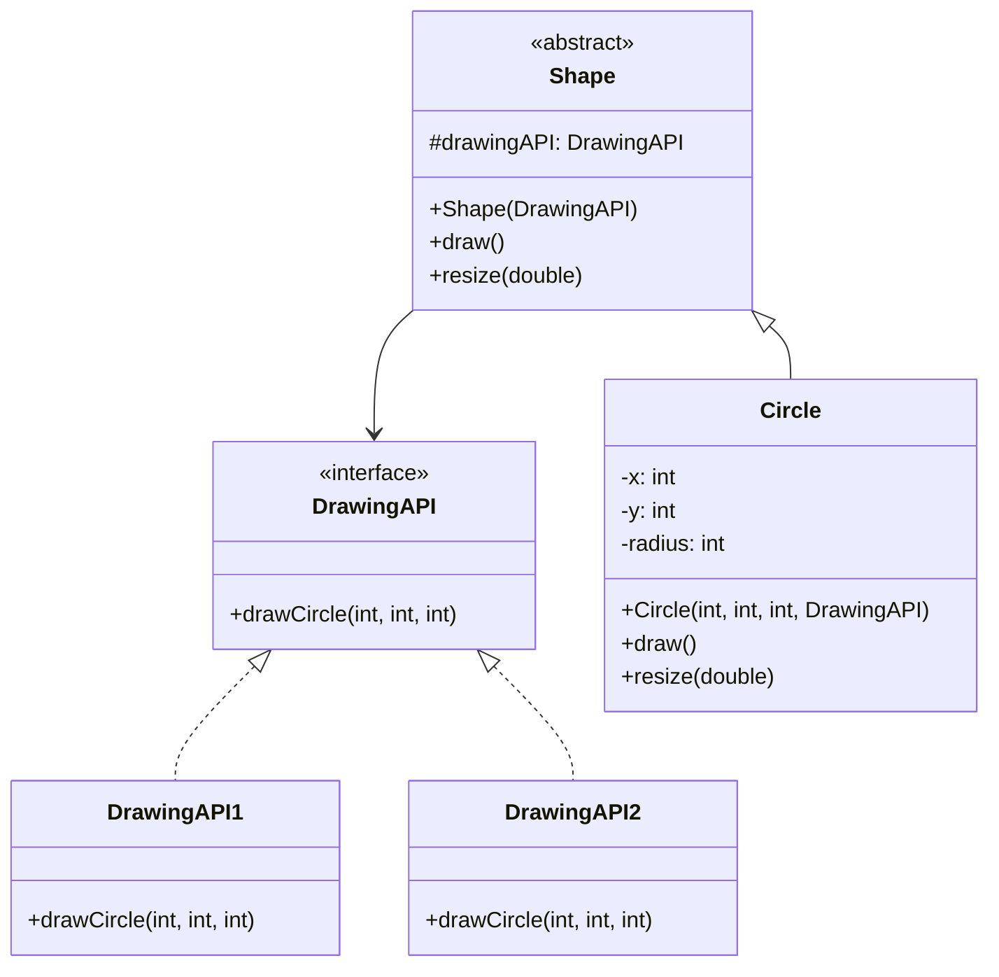
```mermaid
classDiagram
    class DrawingAPI {
        <<interface>>
        +drawCircle(int, int, int)
    }
    class DrawingAPI1 {
        +drawCircle(int, int, int)
    }
    class DrawingAPI2 {
        +drawCircle(int, int, int)
    }
    class Shape {
        <<abstract>>
        #drawingAPI: DrawingAPI
        +Shape(DrawingAPI)
        +draw()
        +resize(double)
    }
    class Circle {
        -x: int
        -y: int
        -radius: int
        +Circle(int, int, int, DrawingAPI)
        +draw()
        +resize(double)
    }
    DrawingAPI <|.. DrawingAPI1
    DrawingAPI <|.. DrawingAPI2
    Shape <|-- Circle
    Shape --> DrawingAPI
```

**When to use:**

- When you want to avoid a permanent binding between abstraction and implementation, and both should be extensible via subclassing.
- When changes in the implementation of an abstraction should have no impact on clients (i.e., client code should not need to be recompiled).

**When not to use:**

- When only one implementation exists and no future variation is foreseen — the added indirection is unnecessary overhead.

---

### Composite

Composes objects into tree structures to represent part-whole hierarchies. Composite lets clients treat individual objects (leaves) and compositions of objects (composites) uniformly through a common interface. This is the structural foundation for any tree-like structure — file systems, UI component hierarchies, organisational charts, and so on.

**Example (Java):**
```java
// Component — the common interface for both leaves and composites
public interface FileSystemComponent {
    void display(String indent);
    int getSize();
}

// Leaf — has no children
public class File implements FileSystemComponent {
    private String name;
    private int size;
    public File(String name, int size) { this.name = name; this.size = size; }
    public void display(String indent) { System.out.println(indent + name + " (" + size + "KB)"); }
    public int getSize() { return size; }
}

// Composite — can contain leaves or other composites
import java.util.ArrayList;
import java.util.List;

public class Directory implements FileSystemComponent {
    private String name;
    private List<FileSystemComponent> children = new ArrayList<>();
    public Directory(String name) { this.name = name; }
    public void add(FileSystemComponent component) { children.add(component); }
    public void remove(FileSystemComponent component) { children.remove(component); }
    public void display(String indent) {
        System.out.println(indent + "[" + name + "]");
        for (FileSystemComponent child : children) {
            child.display(indent + "  ");
        }
    }
    public int getSize() {
        return children.stream().mapToInt(FileSystemComponent::getSize).sum();
    }
}
```

**Class Diagram**
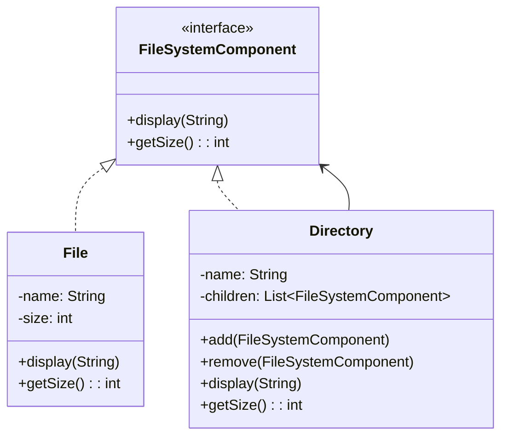
```mermaid
classDiagram
    class FileSystemComponent {
        <<interface>>
        +display(String)
        +getSize(): int
    }
    class File {
        -name: String
        -size: int
        +display(String)
        +getSize(): int
    }
    class Directory {
        -name: String
        -children: List~FileSystemComponent~
        +add(FileSystemComponent)
        +remove(FileSystemComponent)
        +display(String)
        +getSize(): int
    }
    FileSystemComponent <|.. File
    FileSystemComponent <|.. Directory
    Directory --> FileSystemComponent
```

**When to use:**

- When you need to represent part-whole hierarchies and want clients to treat individual objects and compositions uniformly without knowing which they are dealing with.
- When the structure can be represented as a recursive tree.

**When not to use:**

- When a flat structure is sufficient and no hierarchy is needed — the pattern adds unnecessary complexity.
- When the common interface forced on all components becomes too general and leaves have methods that don't make sense for them.

---

### Decorator

Dynamically adds new responsibilities or behaviours to an individual object at runtime, without modifying the original class or affecting other objects of the same type. Decorators implement the same interface as the component they wrap, making them transparent to the client. They can be stacked in any order to compose complex behaviour from simple, single-purpose wrappers, offering a flexible alternative to subclassing for extending functionality.

**Example (Java):**
```java
// Component interface
public interface Coffee {
    String getDescription();
    int cost();
}

// Concrete Component
public class SimpleCoffee implements Coffee {
    public String getDescription() { return "Simple Coffee"; }
    public int cost() { return 5; }
}

// Base Decorator — implements Coffee and wraps a Coffee instance
public abstract class CoffeeDecorator implements Coffee {
    protected Coffee coffee;
    public CoffeeDecorator(Coffee coffee) { this.coffee = coffee; }
    public String getDescription() { return coffee.getDescription(); }
    public int cost() { return coffee.cost(); }
}

// Concrete Decorators
public class MilkDecorator extends CoffeeDecorator {
    public MilkDecorator(Coffee coffee) { super(coffee); }
    public String getDescription() { return coffee.getDescription() + ", Milk"; }
    public int cost() { return coffee.cost() + 2; }
}

public class SugarDecorator extends CoffeeDecorator {
    public SugarDecorator(Coffee coffee) { super(coffee); }
    public String getDescription() { return coffee.getDescription() + ", Sugar"; }
    public int cost() { return coffee.cost() + 1; }
}

// Usage: new SugarDecorator(new MilkDecorator(new SimpleCoffee())) → $8
```

**Class Diagram**
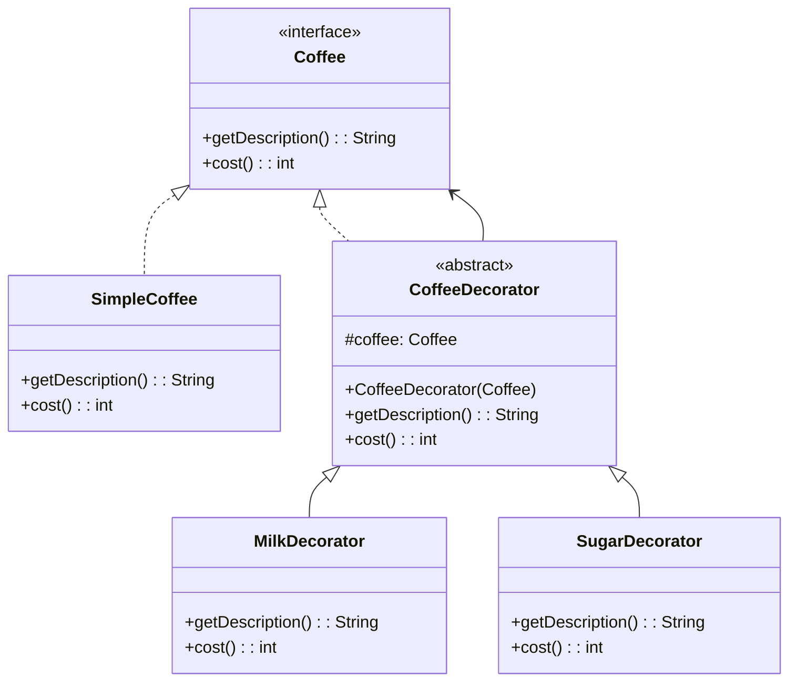
```mermaid
classDiagram
    class Coffee {
        <<interface>>
        +getDescription(): String
        +cost(): int
    }
    class SimpleCoffee {
        +getDescription(): String
        +cost(): int
    }
    class CoffeeDecorator {
        <<abstract>>
        #coffee: Coffee
        +CoffeeDecorator(Coffee)
        +getDescription(): String
        +cost(): int
    }
    class MilkDecorator {
        +getDescription(): String
        +cost(): int
    }
    class SugarDecorator {
        +getDescription(): String
        +cost(): int
    }
    Coffee <|.. SimpleCoffee
    Coffee <|.. CoffeeDecorator
    CoffeeDecorator <|-- MilkDecorator
    CoffeeDecorator <|-- SugarDecorator
    CoffeeDecorator --> Coffee
```

**When to use:**

- When you need to add responsibilities to individual objects dynamically and transparently, without affecting other objects of the same class.
- When extension by subclassing is impractical — for example, when the number of combinations of features would require an explosion of subclasses.

**When not to use:**

- When subclassing is simpler and the behaviour variations are small and fixed.
- When the order of decorator wrapping matters in non-obvious ways, making the composed object difficult to reason about.

---

### Facade

Provides a simplified, unified interface to a complex subsystem or set of subsystems. The Facade does not prevent clients from accessing the subsystem directly if they need to, but it reduces the learning curve and dependency footprint for common use cases. It promotes layered architecture by defining clear entry points into each subsystem layer.

**Example (Java):**
```java
// Subsystem classes — complex internal components
public class CPU {
    public void freeze() { System.out.println("CPU: Freezing..."); }
    public void jump(int position) { System.out.println("CPU: Jumping to " + position); }
    public void execute() { System.out.println("CPU: Executing..."); }
}

public class Memory {
    public void load(int position, String data) {
        System.out.println("Memory: Loading '" + data + "' at position " + position);
    }
}

public class HardDrive {
    public String read(int lba, int size) { return "OS boot data"; }
}

// Facade — provides a single simple entry point for a complex start-up sequence
public class ComputerFacade {
    private final CPU cpu;
    private final Memory memory;
    private final HardDrive hardDrive;

    public ComputerFacade() {
        this.cpu = new CPU();
        this.memory = new Memory();
        this.hardDrive = new HardDrive();
    }

    public void start() {
        cpu.freeze();
        memory.load(0, hardDrive.read(0, 1024));
        cpu.jump(0);
        cpu.execute();
    }
}
```

**Class Diagram**
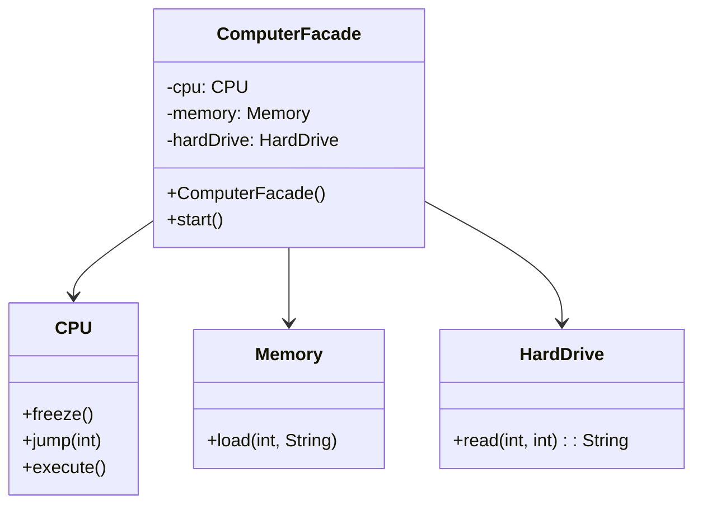
```mermaid
classDiagram
    class ComputerFacade {
        -cpu: CPU
        -memory: Memory
        -hardDrive: HardDrive
        +ComputerFacade()
        +start()
    }
    class CPU {
        +freeze()
        +jump(int)
        +execute()
    }
    class Memory {
        +load(int, String)
    }
    class HardDrive {
        +read(int, int): String
    }
    ComputerFacade --> CPU
    ComputerFacade --> Memory
    ComputerFacade --> HardDrive
```

**When to use:**

- When you want to provide a simple interface to a complex subsystem without eliminating access to the subsystem itself.
- When there are many dependencies between clients and implementation classes, and you want to decouple them for easier maintenance and testing.

**When not to use:**

- When the subsystem is already simple and the facade would be a trivial, redundant wrapper.
- When clients routinely need fine-grained access to the subsystem — the facade may limit necessary flexibility.

---

### Flyweight

Reduces memory consumption by sharing as much data as possible between a large number of fine-grained objects. The pattern separates an object's state into **intrinsic state** (shared, context-independent data stored in the flyweight) and **extrinsic state** (context-specific data passed in by the client at the time of use). A factory manages a pool of flyweight instances, returning an existing one when the same intrinsic state is requested.

**Example (Java):**
```java
import java.util.HashMap;
import java.util.Map;

// Flyweight — holds intrinsic (shared) state only
public class TreeType {
    private final String name;       // intrinsic
    private final String texture;    // intrinsic

    public TreeType(String name, String texture) {
        this.name = name;
        this.texture = texture;
    }

    // Extrinsic state (x, y position) is passed in by the caller
    public void draw(int x, int y) {
        System.out.println("Drawing " + name + " at (" + x + "," + y + ") with texture " + texture);
    }
}

// Flyweight Factory — ensures flyweights are shared
public class TreeTypeFactory {
    private static final Map<String, TreeType> cache = new HashMap<>();

    public static TreeType getTreeType(String name, String texture) {
        String key = name + "_" + texture;
        if (!cache.containsKey(key)) {
            cache.put(key, new TreeType(name, texture));
            System.out.println("Creating new TreeType: " + key);
        }
        return cache.get(key);
    }
}
```

**Class Diagram**
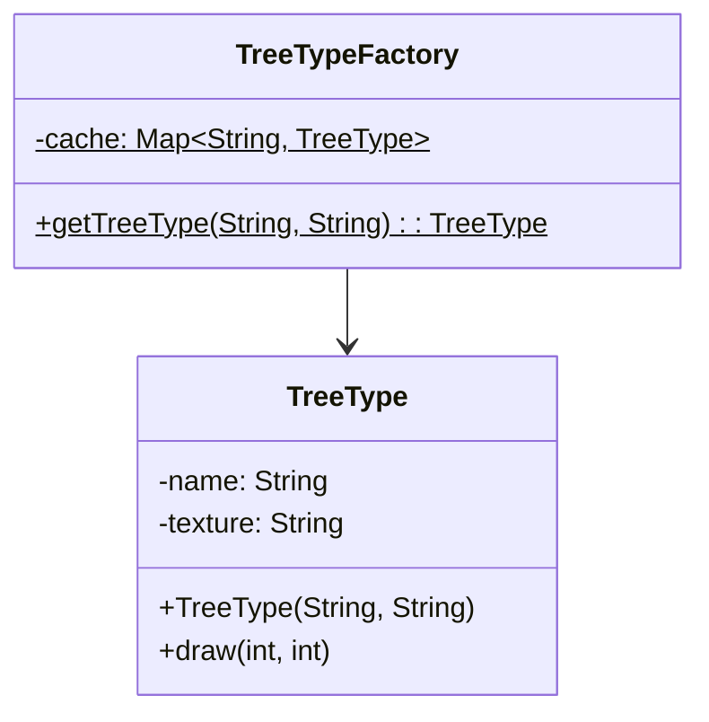
```mermaid
classDiagram
    class TreeType {
        -name: String
        -texture: String
        +TreeType(String, String)
        +draw(int, int)
    }
    class TreeTypeFactory {
        -cache: Map~String, TreeType~$
        +getTreeType(String, String): TreeType$
    }
    TreeTypeFactory --> TreeType
```

**When to use:**

- When an application must support a very large number of objects and the storage cost of each is prohibitive (e.g., rendering thousands of trees or particles in a game).
- When many objects share identical intrinsic state that can be factored out and cached.

**When not to use:**

- When objects are few or largely unique — shared state provides no benefit and the factory adds unnecessary overhead.
- When the complexity of separating intrinsic and extrinsic state outweighs the memory savings.

---

### Proxy

Provides a surrogate or placeholder for another object to control access to it. The proxy implements the same interface as the real subject, making it transparent to the client. Common proxy variants include: **Virtual Proxy** (defers expensive object creation until needed — lazy loading), **Protection Proxy** (controls access based on permissions), **Remote Proxy** (represents an object in a different address space or server), and **Caching Proxy** (stores results of expensive operations and returns them for repeated requests).

**Example (Java):**
```java
public interface Subject {
    void request();
}

public class RealSubject implements Subject {
    public RealSubject() {
        // Simulate expensive initialisation
        System.out.println("RealSubject: Initialising (expensive operation)...");
    }
    public void request() { System.out.println("RealSubject: Handling request."); }
}

// Virtual + Protection Proxy — lazy-loads RealSubject and checks access
public class Proxy implements Subject {
    private RealSubject realSubject;
    private final String accessLevel;

    public Proxy(String accessLevel) { this.accessLevel = accessLevel; }

    public void request() {
        if (!accessLevel.equals("ADMIN")) {
            System.out.println("Proxy: Access denied.");
            return;
        }
        if (realSubject == null) {
            realSubject = new RealSubject(); // lazy initialisation
        }
        System.out.println("Proxy: Logging request.");
        realSubject.request();
    }
}
```

**Class Diagram**
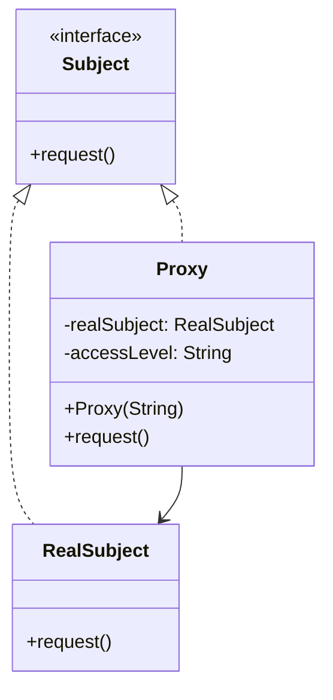
```mermaid
classDiagram
    class Subject {
        <<interface>>
        +request()
    }
    class RealSubject {
        +request()
    }
    class Proxy {
        -realSubject: RealSubject
        -accessLevel: String
        +Proxy(String)
        +request()
    }
    Subject <|.. RealSubject
    Subject <|.. Proxy
    Proxy --> RealSubject
```

**When to use:**

- For access control (protection proxy), lazy initialisation of expensive objects (virtual proxy), logging and monitoring, caching results, or representing remote objects.

**When not to use:**

- When direct access to the object is acceptable and the additional layer of indirection adds latency or complexity without any benefit.

---

## Behavioral Patterns

Behavioural patterns are concerned with algorithms and the assignment of responsibilities between objects. They describe how objects communicate, how control flows, and how responsibilities are distributed.

### Chain of Responsibility

Passes a request along a chain of potential handlers until one of them handles it (or the chain is exhausted). Each handler in the chain decides either to process the request or to forward it to the next handler. This decouples the sender of a request from its receiver and allows the chain to be assembled dynamically at runtime.

**Example (Java):**
```java
// Abstract Handler — defines the interface and holds the next handler reference
public abstract class SupportHandler {
    protected SupportHandler next;

    public SupportHandler setNext(SupportHandler next) {
        this.next = next;
        return next; // enables fluent chaining: h1.setNext(h2).setNext(h3)
    }

    public abstract void handle(String issue, int priority);
}

// Concrete Handlers
public class FrontlineSupport extends SupportHandler {
    public void handle(String issue, int priority) {
        if (priority <= 1) {
            System.out.println("Frontline resolving: " + issue);
        } else if (next != null) {
            next.handle(issue, priority);
        }
    }
}

public class TechnicalSupport extends SupportHandler {
    public void handle(String issue, int priority) {
        if (priority <= 2) {
            System.out.println("Technical support resolving: " + issue);
        } else if (next != null) {
            next.handle(issue, priority);
        }
    }
}

public class Management extends SupportHandler {
    public void handle(String issue, int priority) {
        System.out.println("Management resolving critical issue: " + issue);
    }
}
```

**Class Diagram**
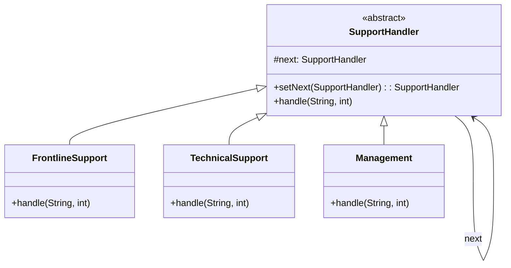
```mermaid
classDiagram
    class SupportHandler {
        <<abstract>>
        #next: SupportHandler
        +setNext(SupportHandler): SupportHandler
        +handle(String, int)
    }
    class FrontlineSupport {
        +handle(String, int)
    }
    class TechnicalSupport {
        +handle(String, int)
    }
    class Management {
        +handle(String, int)
    }
    SupportHandler <|-- FrontlineSupport
    SupportHandler <|-- TechnicalSupport
    SupportHandler <|-- Management
    SupportHandler --> SupportHandler : next
```

**When to use:**

- When more than one handler may process a request and the handler is not known a priori.
- When you want to issue a request to one of several objects without specifying the receiver explicitly, and you want the chain to be configurable at runtime.

**When not to use:**

- When only one handler will ever process the request — simpler direct invocation is clearer.
- When requests must be guaranteed to be handled — a chain can silently drop requests if no handler matches.

---

### Command

Encapsulates a request as a standalone object, containing all information needed to execute the action: the receiver, the method, and any parameters. This decouples the object that invokes the operation from the object that performs it. The Command object can be stored, queued, logged, or passed around, enabling powerful features like undo/redo, macro recording, transactional behaviour, and scheduling.

**Example (Java):**
```java
// Command interface
public interface Command {
    void execute();
    void undo();
}

// Receiver — the object that knows how to perform the actual work
public class Light {
    public void turnOn() { System.out.println("Light is ON"); }
    public void turnOff() { System.out.println("Light is OFF"); }
}

// Concrete Command
public class LightOnCommand implements Command {
    private final Light light;
    public LightOnCommand(Light light) { this.light = light; }
    public void execute() { light.turnOn(); }
    public void undo() { light.turnOff(); }
}

// Invoker — stores and fires commands without knowing their implementation
import java.util.ArrayDeque;
import java.util.Deque;

public class RemoteControl {
    private final Deque<Command> history = new ArrayDeque<>();

    public void execute(Command command) {
        command.execute();
        history.push(command);
    }

    public void undo() {
        if (!history.isEmpty()) {
            history.pop().undo();
        }
    }
}
```

**Class Diagram**
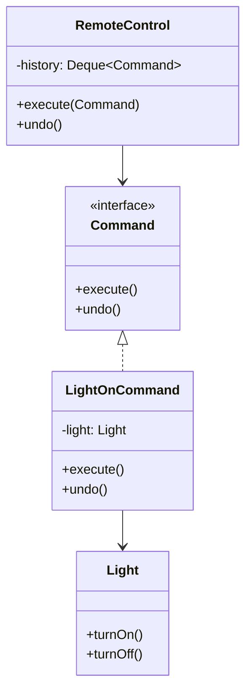
```mermaid
classDiagram
    class Command {
        <<interface>>
        +execute()
        +undo()
    }
    class LightOnCommand {
        -light: Light
        +execute()
        +undo()
    }
    class Light {
        +turnOn()
        +turnOff()
    }
    class RemoteControl {
        -history: Deque~Command~
        +execute(Command)
        +undo()
    }
    Command <|.. LightOnCommand
    LightOnCommand --> Light
    RemoteControl --> Command
```

**When to use:**

- When you need to parameterise objects with actions, support undoable operations, implement transactional behaviour, or queue and schedule operations for later execution.
- For implementing macro recording or logging of executed operations.

**When not to use:**

- When a simple method call suffices and there is no need for undo, queuing, or decoupling the invoker from the receiver.

---

### Interpreter

Defines a representation for a language's grammar and provides an interpreter that uses that representation to interpret sentences in the language. Each grammar rule is mapped to a class, and the abstract syntax tree (AST) of an expression is composed of these classes. The `interpret` method on each node evaluates the expression in context.

**Example (Java):**
```java
import java.util.Map;

// Abstract Expression
public interface Expression {
    int interpret(Map<String, Integer> context);
}

// Terminal Expressions
public class NumberExpression implements Expression {
    private final int value;
    public NumberExpression(int value) { this.value = value; }
    public int interpret(Map<String, Integer> context) { return value; }
}

public class VariableExpression implements Expression {
    private final String name;
    public VariableExpression(String name) { this.name = name; }
    public int interpret(Map<String, Integer> context) {
        return context.getOrDefault(name, 0);
    }
}

// Non-Terminal Expressions
public class AddExpression implements Expression {
    private final Expression left, right;
    public AddExpression(Expression left, Expression right) {
        this.left = left; this.right = right;
    }
    public int interpret(Map<String, Integer> context) {
        return left.interpret(context) + right.interpret(context);
    }
}
```

**Class Diagram**
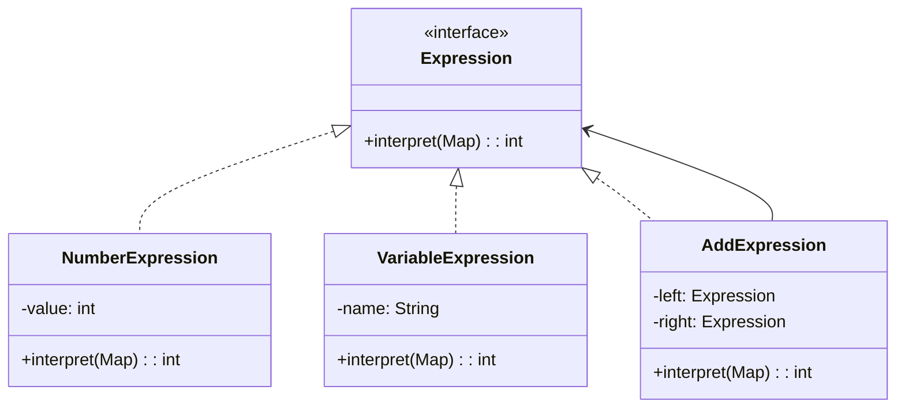
```mermaid
classDiagram
    class Expression {
        <<interface>>
        +interpret(Map): int
    }
    class NumberExpression {
        -value: int
        +interpret(Map): int
    }
    class VariableExpression {
        -name: String
        +interpret(Map): int
    }
    class AddExpression {
        -left: Expression
        -right: Expression
        +interpret(Map): int
    }
    Expression <|.. NumberExpression
    Expression <|.. VariableExpression
    Expression <|.. AddExpression
    AddExpression --> Expression
```

**When to use:**

- When you need to interpret sentences in a simple language or evaluate expressions that can be represented as an abstract syntax tree (e.g., mathematical expressions, SQL queries, regular expressions, rule engines).

**When not to use:**

- When the grammar is complex — a large number of rules leads to an equally large number of classes, making the system hard to manage. Use a parser generator instead.
- When performance is critical — AST traversal is slower than purpose-built compiled solutions.

---

### Iterator

Provides a standard way to sequentially access elements of a collection without exposing its underlying representation (array, linked list, tree, etc.). By abstracting traversal behind an interface, the same client code can iterate over different collection types uniformly, and multiple iterators can traverse the same collection concurrently with independent cursors.

**Example (Java):**
```java
import java.util.Iterator;
import java.util.List;
import java.util.NoSuchElementException;

public class NameCollection implements Iterable<String> {
    private final List<String> names;

    public NameCollection(List<String> names) { this.names = names; }

    @Override
    public Iterator<String> iterator() {
        return new NameIterator();
    }

    private class NameIterator implements Iterator<String> {
        private int index = 0;

        @Override
        public boolean hasNext() { return index < names.size(); }

        @Override
        public String next() {
            if (!hasNext()) throw new NoSuchElementException();
            return names.get(index++);
        }
    }
}
```

**Class Diagram**
```mermaid
classDiagram
    class Iterator~T~ {
        <<interface>>
        +hasNext(): boolean
        +next(): T
    }
    class Iterable~T~ {
        <<interface>>
        +iterator(): Iterator~T~
    }
    class NameCollection {
        -names: List~String~
        +iterator(): Iterator~String~
    }
    class NameIterator {
        -index: int
        +hasNext(): boolean
        +next(): String
    }
    Iterable <|.. NameCollection
    Iterator <|.. NameIterator
    NameCollection +-- NameIterator
```

**When to use:**

- When you need a uniform way to traverse different types of collections without exposing their internal structure.
- When you need multiple simultaneous traversals of the same collection with independent state.

**When not to use:**

- When the collection is simple (e.g., a plain array) and direct index-based access is clearer and sufficient.

---

### Mediator

Defines an object that encapsulates how a set of objects interact, promoting loose coupling by preventing objects from referring to each other directly. Instead of many-to-many dependencies between components, each component only knows about the mediator and communicates through it. This centralises complex interaction logic in one place and makes individual components easier to reuse and test.

**Example (Java):**
```java
// Mediator interface
public interface ChatMediator {
    void sendMessage(String message, ChatUser sender);
    void addUser(ChatUser user);
}

// Colleague
public abstract class ChatUser {
    protected final ChatMediator mediator;
    protected final String name;

    public ChatUser(ChatMediator mediator, String name) {
        this.mediator = mediator;
        this.name = name;
    }

    public abstract void send(String message);
    public abstract void receive(String message, String fromName);
}

// Concrete Colleague
public class ConcreteUser extends ChatUser {
    public ConcreteUser(ChatMediator mediator, String name) { super(mediator, name); }

    public void send(String message) {
        System.out.println(name + " sends: " + message);
        mediator.sendMessage(message, this);
    }

    public void receive(String message, String fromName) {
        System.out.println(name + " received from " + fromName + ": " + message);
    }
}

// Concrete Mediator
import java.util.ArrayList;
import java.util.List;

public class ChatRoom implements ChatMediator {
    private final List<ChatUser> users = new ArrayList<>();

    public void addUser(ChatUser user) { users.add(user); }

    public void sendMessage(String message, ChatUser sender) {
        for (ChatUser user : users) {
            if (user != sender) {
                user.receive(message, sender.name);
            }
        }
    }
}
```

**Class Diagram**
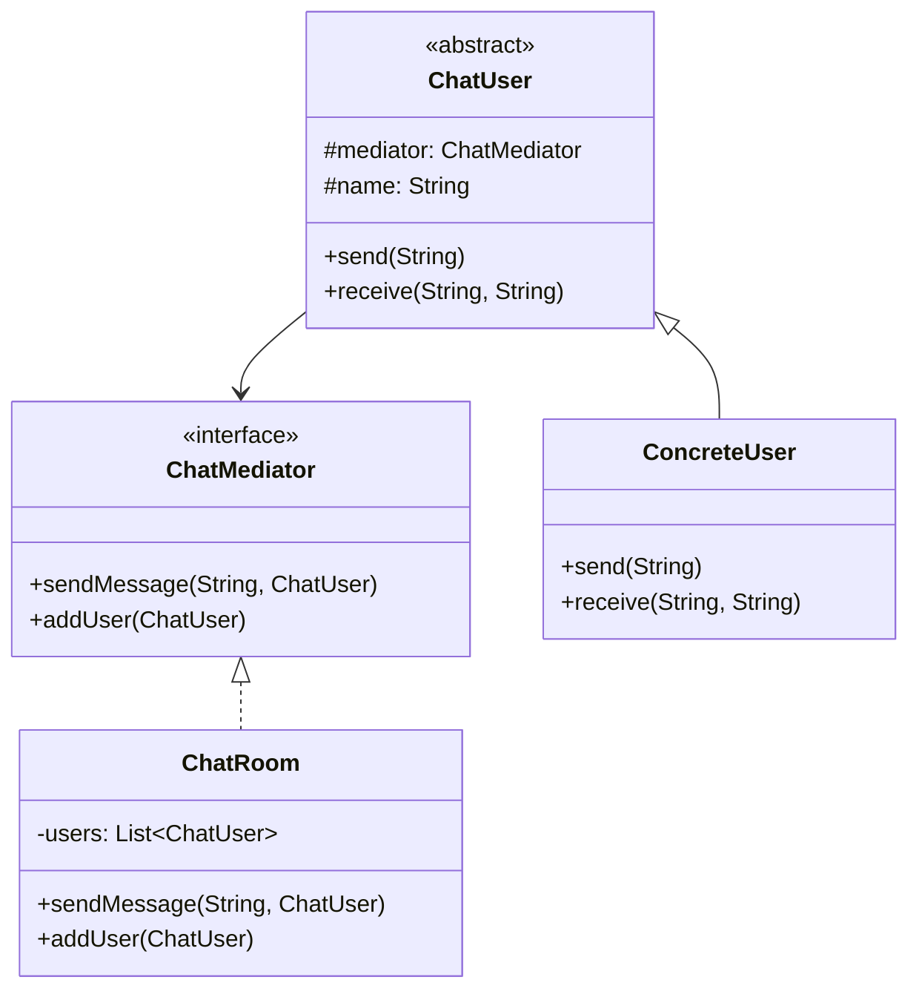
```mermaid
classDiagram
    class ChatMediator {
        <<interface>>
        +sendMessage(String, ChatUser)
        +addUser(ChatUser)
    }
    class ChatRoom {
        -users: List~ChatUser~
        +sendMessage(String, ChatUser)
        +addUser(ChatUser)
    }
    class ChatUser {
        <<abstract>>
        #mediator: ChatMediator
        #name: String
        +send(String)
        +receive(String, String)
    }
    class ConcreteUser {
        +send(String)
        +receive(String, String)
    }
    ChatMediator <|.. ChatRoom
    ChatUser <|-- ConcreteUser
    ChatUser --> ChatMediator
```

**When to use:**

- When many objects communicate in complex, tightly coupled ways, making the system hard to understand and change.
- When you want to promote reuse of individual components by removing their direct dependencies on each other.

**When not to use:**

- When communication between objects is simple — introducing a mediator becomes an unnecessary, over-engineered bottleneck.
- When the mediator itself accumulates so much logic that it becomes a "god object".

---

### Memento

Captures and externalises an object's internal state at a point in time so that the object can be restored to that state later, **without violating encapsulation**. The originator creates a memento containing a snapshot of its state; a caretaker stores and manages the memento but cannot inspect its contents. This is the canonical mechanism for implementing undo/redo.

**Example (Java):**
```java
// Memento — stores a snapshot of the Originator's state; opaque to the Caretaker
public class EditorMemento {
    private final String content;  // immutable snapshot
    public EditorMemento(String content) { this.content = content; }
    public String getContent() { return content; }
}

// Originator — creates and restores from mementos
public class TextEditor {
    private String content = "";

    public void type(String text) { content += text; }
    public String getContent() { return content; }

    public EditorMemento save() { return new EditorMemento(content); }
    public void restore(EditorMemento memento) { content = memento.getContent(); }
}

// Caretaker — manages memento history without inspecting it
import java.util.ArrayDeque;
import java.util.Deque;

public class UndoManager {
    private final Deque<EditorMemento> history = new ArrayDeque<>();

    public void backup(TextEditor editor) { history.push(editor.save()); }

    public void undo(TextEditor editor) {
        if (!history.isEmpty()) {
            editor.restore(history.pop());
        }
    }
}
```

**Class Diagram**
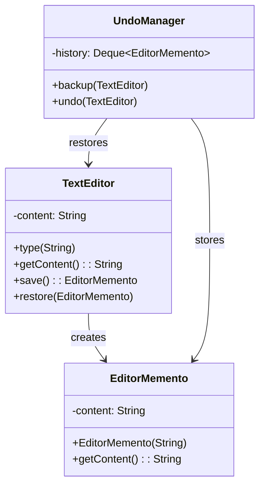
```mermaid
classDiagram
    class EditorMemento {
        -content: String
        +EditorMemento(String)
        +getContent(): String
    }
    class TextEditor {
        -content: String
        +type(String)
        +getContent(): String
        +save(): EditorMemento
        +restore(EditorMemento)
    }
    class UndoManager {
        -history: Deque~EditorMemento~
        +backup(TextEditor)
        +undo(TextEditor)
    }
    TextEditor --> EditorMemento : creates
    UndoManager --> EditorMemento : stores
    UndoManager --> TextEditor : restores
```

**When to use:**

- When you need to implement undo/redo, snapshots, rollback, or save-state functionality.
- When capturing an object's state directly would break encapsulation because the state fields are private.

**When not to use:**

- When the state to be saved is very large — storing many mementos can consume significant memory.
- When the originator's state changes frequently and the cost of snapshotting on every change is prohibitive.

---

### Observer

Defines a one-to-many dependency between objects so that when one object (the **subject** or **publisher**) changes state, all its dependents (**observers** or **subscribers**) are notified and updated automatically. This establishes a push-based event mechanism that promotes loose coupling — the subject knows nothing about its observers beyond the observer interface.

**Example (Java):**
```java
import java.util.ArrayList;
import java.util.List;

// Observer interface
public interface Observer {
    void update(String eventType, Object data);
}

// Subject (Publisher)
public class EventSource {
    private final List<Observer> observers = new ArrayList<>();

    public void subscribe(Observer observer) { observers.add(observer); }
    public void unsubscribe(Observer observer) { observers.remove(observer); }

    protected void notifyObservers(String eventType, Object data) {
        for (Observer observer : observers) {
            observer.update(eventType, data);
        }
    }

    // Example: triggers notification when data changes
    public void changeData(Object newData) {
        System.out.println("EventSource: Data changed to " + newData);
        notifyObservers("DATA_CHANGED", newData);
    }
}

// Concrete Observer
public class Logger implements Observer {
    public void update(String eventType, Object data) {
        System.out.println("Logger [" + eventType + "]: " + data);
    }
}
```

**Class Diagram**
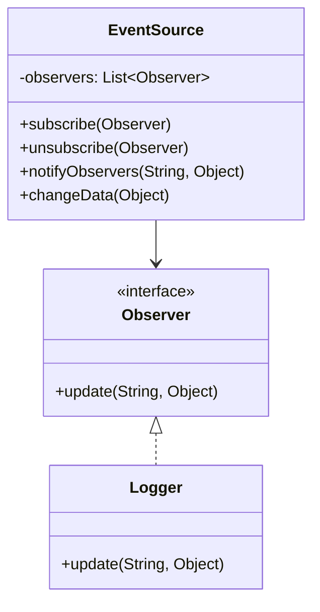
```mermaid
classDiagram
    class Observer {
        <<interface>>
        +update(String, Object)
    }
    class Logger {
        +update(String, Object)
    }
    class EventSource {
        -observers: List~Observer~
        +subscribe(Observer)
        +unsubscribe(Observer)
        +notifyObservers(String, Object)
        +changeData(Object)
    }
    Observer <|.. Logger
    EventSource --> Observer
```

**When to use:**

- For event handling systems, UI data-binding, publish-subscribe messaging, and any scenario where multiple objects need to react to changes in a shared source of truth.

**When not to use:**

- When only one object needs notification — a direct method call is simpler.
- When the order of notification matters and cannot be guaranteed — observer notification order is typically undefined.
- When observers are expensive to update and updates are very frequent — consider batching or throttling.

---

### State

Allows an object to alter its behaviour when its internal state changes, appearing to change its class. State-specific behaviour is delegated to separate state objects, removing large conditional (`if`/`switch`) blocks from the context class. Transitions between states are managed either by the context or by the state objects themselves.

**Example (Java):**
```java
// State interface
public interface TrafficLightState {
    void handle(TrafficLight context);
    String getColour();
}

// Concrete States
public class GreenState implements TrafficLightState {
    public void handle(TrafficLight context) {
        System.out.println("Green: Go!");
        context.setState(new YellowState());
    }
    public String getColour() { return "GREEN"; }
}

public class YellowState implements TrafficLightState {
    public void handle(TrafficLight context) {
        System.out.println("Yellow: Slow down!");
        context.setState(new RedState());
    }
    public String getColour() { return "YELLOW"; }
}

public class RedState implements TrafficLightState {
    public void handle(TrafficLight context) {
        System.out.println("Red: Stop!");
        context.setState(new GreenState());
    }
    public String getColour() { return "RED"; }
}

// Context — delegates behaviour to the current state
public class TrafficLight {
    private TrafficLightState state;

    public TrafficLight() { this.state = new GreenState(); }

    public void setState(TrafficLightState state) { this.state = state; }

    public void change() { state.handle(this); }
}
```

**Class Diagram**
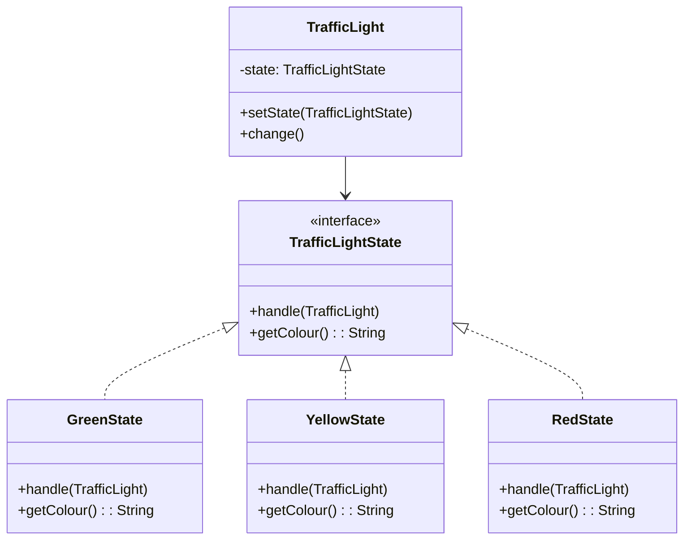
```mermaid
classDiagram
    class TrafficLightState {
        <<interface>>
        +handle(TrafficLight)
        +getColour(): String
    }
    class GreenState {
        +handle(TrafficLight)
        +getColour(): String
    }
    class YellowState {
        +handle(TrafficLight)
        +getColour(): String
    }
    class RedState {
        +handle(TrafficLight)
        +getColour(): String
    }
    class TrafficLight {
        -state: TrafficLightState
        +setState(TrafficLightState)
        +change()
    }
    TrafficLightState <|.. GreenState
    TrafficLightState <|.. YellowState
    TrafficLightState <|.. RedState
    TrafficLight --> TrafficLightState
```

**When to use:**

- When an object's behaviour depends on its state and must change at runtime, especially when there are many states and large conditional blocks that switch on state.

**When not to use:**

- When the object has only a few states that change rarely — conditional logic is simpler and does not justify the additional classes.

---

### Strategy

Defines a family of algorithms, encapsulates each one in a separate class, and makes them interchangeable. The client selects and injects a strategy at runtime, allowing the algorithm to vary independently from the client that uses it. This eliminates conditional logic that selects between algorithms and makes it easy to add new algorithms without modifying existing code (Open/Closed Principle).

**Example (Java):**
```java
// Strategy interface
public interface SortStrategy {
    void sort(int[] data);
}

// Concrete Strategies
public class BubbleSortStrategy implements SortStrategy {
    public void sort(int[] data) {
        System.out.println("Sorting with Bubble Sort");
        // ... bubble sort implementation
    }
}

public class QuickSortStrategy implements SortStrategy {
    public void sort(int[] data) {
        System.out.println("Sorting with Quick Sort");
        java.util.Arrays.sort(data); // simplified
    }
}

// Context — uses a strategy without knowing its implementation
public class Sorter {
    private SortStrategy strategy;

    public Sorter(SortStrategy strategy) { this.strategy = strategy; }

    public void setStrategy(SortStrategy strategy) { this.strategy = strategy; }

    public void sort(int[] data) { strategy.sort(data); }
}

// Usage: sorter.setStrategy(new QuickSortStrategy());
```

**Class Diagram**
```mermaid
classDiagram
    class SortStrategy {
        <<interface>>
        +sort(int[])
    }
    class BubbleSortStrategy {
        +sort(int[])
    }
    class QuickSortStrategy {
        +sort(int[])
    }
    class Sorter {
        -strategy: SortStrategy
        +Sorter(SortStrategy)
        +setStrategy(SortStrategy)
        +sort(int[])
    }
    SortStrategy <|.. BubbleSortStrategy
    SortStrategy <|.. QuickSortStrategy
    Sorter --> SortStrategy
```

**When to use:**

- When multiple related algorithms exist and you want to switch between them at runtime or make them independently testable and replaceable.
- When you want to eliminate large `if`/`switch` conditionals that select behaviour based on a type flag.

**When not to use:**

- When only one algorithm is ever used — the abstraction adds no value.
- When clients do not need to be aware of the different strategies — simpler encapsulation within the class may suffice.

---

### Template Method

Defines the **skeleton** of an algorithm in a base class, deferring one or more steps to subclasses. The overall structure and sequence of the algorithm are fixed in the base class (`final` method), but certain steps are declared abstract, allowing subclasses to provide specific implementations without altering the algorithm's structure. This is a classic application of the Hollywood Principle: "Don't call us, we'll call you."

**Example (Java):**
```java
public abstract class DataProcessor {
    // Template method — defines the fixed algorithm skeleton; cannot be overridden
    public final void process() {
        readData();
        processData();
        writeResult();
        cleanup(); // hook method — has a default implementation, optionally overridden
    }

    // Primitive operations — must be implemented by subclasses
    protected abstract void readData();
    protected abstract void processData();
    protected abstract void writeResult();

    // Hook — subclasses may override if needed, but are not required to
    protected void cleanup() {
        System.out.println("Default cleanup.");
    }
}

public class CSVDataProcessor extends DataProcessor {
    protected void readData() { System.out.println("Reading CSV file."); }
    protected void processData() { System.out.println("Parsing CSV rows."); }
    protected void writeResult() { System.out.println("Writing output to database."); }
}
```

**Class Diagram**
```mermaid
classDiagram
    class DataProcessor {
        <<abstract>>
        +process()
        #readData()*
        #processData()*
        #writeResult()*
        #cleanup()
    }
    class CSVDataProcessor {
        #readData()
        #processData()
        #writeResult()
    }
    DataProcessor <|-- CSVDataProcessor
```

**When to use:**

- When multiple classes share the same algorithm structure but differ in specific steps, and you want to avoid code duplication while allowing controlled customisation.
- When you want to control which parts of an algorithm subclasses can customise (via abstract methods vs hook methods).

**When not to use:**

- When the algorithm steps rarely change across subclasses — a single concrete implementation is simpler.
- When clients require more flexibility than inheritance allows — consider Strategy instead, which achieves similar variation through composition.

---

### Visitor

Represents an operation to be performed on elements of an object structure, defined separately from the elements themselves. A visitor object is passed to each element, which calls back the visitor with itself (`accept`/`visit` double dispatch). This allows you to add new operations to an existing object structure without modifying the element classes — instead, you add a new visitor class.

**Example (Java):**
```java
// Visitor interface — declares a visit method for each concrete element type
public interface TaxVisitor {
    void visit(Food food);
    void visit(Electronics electronics);
}

// Element interface
public interface Product {
    double getPrice();
    void accept(TaxVisitor visitor);
}

// Concrete Elements
public class Food implements Product {
    private final double price;
    public Food(double price) { this.price = price; }
    public double getPrice() { return price; }
    public void accept(TaxVisitor visitor) { visitor.visit(this); }
}

public class Electronics implements Product {
    private final double price;
    public Electronics(double price) { this.price = price; }
    public double getPrice() { return price; }
    public void accept(TaxVisitor visitor) { visitor.visit(this); }
}

// Concrete Visitor — implements a new operation without touching element classes
public class TaxCalculator implements TaxVisitor {
    public void visit(Food food) {
        System.out.println("Food tax (0%): $0.00");
    }
    public void visit(Electronics electronics) {
        double tax = electronics.getPrice() * 0.15;
        System.out.printf("Electronics tax (15%%): $%.2f%n", tax);
    }
}
```

**Class Diagram**
```mermaid
classDiagram
    class TaxVisitor {
        <<interface>>
        +visit(Food)
        +visit(Electronics)
    }
    class TaxCalculator {
        +visit(Food)
        +visit(Electronics)
    }
    class Product {
        <<interface>>
        +getPrice(): double
        +accept(TaxVisitor)
    }
    class Food {
        -price: double
        +getPrice(): double
        +accept(TaxVisitor)
    }
    class Electronics {
        -price: double
        +getPrice(): double
        +accept(TaxVisitor)
    }
    TaxVisitor <|.. TaxCalculator
    Product <|.. Food
    Product <|.. Electronics
```

**When to use:**

- When you need to perform many distinct and unrelated operations on an object structure and don't want to pollute element classes with these operations.
- When the object structure is stable (element classes rarely change) but you frequently need to add new operations.

**When not to use:**

- When the object structure changes frequently — adding a new element type requires updating every visitor, violating the Open/Closed Principle.
- When the elements need to keep strict encapsulation — visitors often need access to internal state, which may require weakening access modifiers.

---

## Summary

The 23 core design patterns (Gang of Four) are essential tools for software engineers. They provide proven, battle-tested solutions to common structural and behavioural problems in object-oriented design. Understanding when and why to apply each pattern — and equally, when **not** to — is what separates a good engineer from a great one. These patterns improve code maintainability, promote the SOLID principles, and are a standard topic in software engineering interviews. Applying them thoughtfully leads to flexible, scalable, and robust systems.