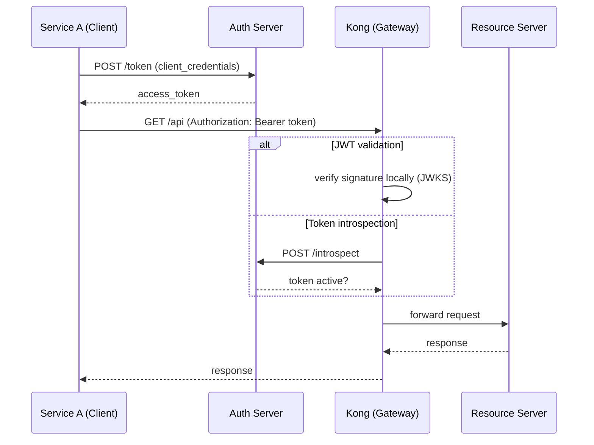

+++
date = '2025-06-18T10:00:00-04:00'
draft = false
title = 'Kong API Gateway'
tags = ['Kong', 'API Gateway', 'System Design', 'Microservices']
summary = "Kong is an open-source cloud-native API gateway for managing securing and orchestrating API traffic"
+++

## What is Kong

- Kong is an open-source cloud-native API gateway built on top of **Nginx** with **Lua** scripting for extensibility. 
- It acts as a reverse proxy that sits in front of your APIs and handles routing, authentication, rate limiting, load balancing, observability and more.
  - Forward proxy (aka just "proxy"): sits in front of clients/Hides the client. Example: when in your office network (or connecting using VPN from home), when you browse the web traffic goes through a forward proxy that filters/caches/logs outbound HTTP requests. Thats how they block chatgpt, gemini etc..
  - Reverse proxy: sits in front of servers/Hides the server. The client talks to the reverse proxy and has no idea the backend exists. 

## Core Architecture

Kong splits its responsibilities into two logical roles:

- **Control Plane (CP)** — the management side. Exposes the Admin API for creating/reading/updating/deleting entities (Services, Routes, Plugins, etc.). Owns the database (PostgreSQL). Pushes config to DPs. Does not proxy traffic.
- **Data Plane (DP)** — the proxy side. Runs the Nginx + Lua engine that processes every request. Reads configuration from the CP (or directly from the database in Traditional mode). Stateless — you can scale DPs horizontally without worrying about config consistency. Does not expose the Admin API.

In **Traditional mode** both planes run in the same process. In **Hybrid mode** they are separated — one CP pushes config to many DP nodes.

```
                    ┌─────────────┐
                    │  Admin API  │
                    │  (Control   │
                    │   Plane)    │
                    └──────┬──────┘
                           │ config push
              ┌────────────┼────────────┐
              │            │            │
         ┌────▼───┐   ┌────▼───┐   ┌────▼───┐
         │ Data   │   │ Data   │   │ Data   │
         │ Plane  │   │ Plane  │   │ Plane  │
         └────────┘   └────────┘   └────────┘
```

## Key Entities

All six are **configuration objects**. You define them via the Admin API (REST calls) or a declarative YAML/JSON file (DB-less mode). Kong stores them in PostgreSQL and the Data Plane reads them at runtime.

| Entity | What it is |
|--------|------------|
| **Service** | A config entry that tells Kong: "there is a backend at this address." Points to a URL or **Upstream** object. Kong is the proxy; Service is just a label that abstracts the backend. |
| **Route** | "If an incoming request matches these rules (path, method, host, headers), send it to this **Service**." Routes are how Kong decides where traffic goes. |
| **Upstream** | "Treat these backend instances as a load-balanced pool." An **Upstream** names the pool and configures the algorithm (round-robin, least-connections, etc.) and health checks. |
| **Target** | A single backend instance (IP:port) inside an **Upstream** pool. Kong health-checks each Target and routes only to healthy ones. |
| **Consumer** | An API user. You attach auth credentials, rate-limit tiers, or ACLs to a Consumer so Kong can enforce who gets what. |
| **Plugin** | Code that runs at a specific phase in the request pipeline (before forwarding, after response, etc.). Plugins add auth, logging, rate limiting, transformation, CORS, etc. — without touching the backend code. |

Example — all six entities in a single declarative config:

```yaml
_format_version: "3.0"
services:
  - name: user-service
    url: http://user-svc:8080
    routes:
      - name: user-route
        paths:
          - /users
        methods:
          - GET
    plugins:
      - name: key-auth
  - name: order-service
    host: order-svc
    port: 8080
    protocol: http
    routes:
      - name: order-route
        paths:
          - /orders
    upstream:
      name: order-upstream
      algorithm: least-connections
      targets:
        - target: order-svc-1:8080
          weight: 100
        - target: order-svc-2:8080
          weight: 50
consumers:
  - username: alice
    keyauth_credentials:
      - key: secret-key-123
```

What happens when a request arrives:

1. `GET /users` → matches **Route** `user-route` → Kong forwards to **Service** `user-service` at `http://user-svc:8080`
2. `GET /orders` → matches **Route** `order-route` → Kong load-balances across **Upstream** `order-upstream` (least-connections) → distributes between **Targets** `order-svc-1:8080` and `order-svc-2:8080`
3. Both routes have plugins — `key-auth` on `user-service` checks the API key against **Consumer** `alice`'s credentials

Request flow:

```
Client → Route → Service → Plugin Chain → Upstream → Target
```

## Deployment Modes

### Traditional (DB-backed)

Kong nodes connect to a shared **PostgreSQL** database for configuration. Every node has both CP and DP capabilities running in the same process. Simplest to set up but requires database management. (Cassandra was supported before Kong 3.4 but is now removed — PostgreSQL is the only supported database.)

```
┌──────────┐     ┌──────────┐
│ Kong DB  │     │ Kong DB  │
│ Node     │     │ Node     │
└──────────┘     └──────────┘
       │               │
       └───────┬───────┘
               │
         ┌─────▼─────┐
         │ PostgreSQL│
         └───────────┘
```

### DB-less Mode

No database. Configuration is loaded from a declarative YAML/JSON file via the Admin API `/config` endpoint or at startup with `--dbless`. Ideal for immutable infrastructure and CI/CD.

```yaml
_format_version: "3.0"
services:
  - name: my-service
    url: http://backend:8080
    routes:
      - name: my-route
        paths:
          - /api
```

### Hybrid Mode

Separates CP and DP. The CP manages the database and Admin API. DPs are stateless and receive config from the CP over a TLS-secured connection. This is the production-recommended topology for horizontal scaling.

```
┌─────────────┐
│   Control   │ ← Admin API, DB
│   Plane     │
└──────┬──────┘
       │ (cluster port)
  ┌────┴────┐
  │   DP    │  ... scale horizontally
  └─────────┘
```

### Kubernetes Ingress Controller

Kong runs as a Kubernetes Ingress Controller. It watches Ingress and CRD resources and dynamically configures itself. This is the most common deployment for cloud-native stacks.

```yaml
apiVersion: networking.k8s.io/v1
kind: Ingress
metadata:
  name: my-ingress
spec:
  ingressClassName: kong
  rules:
    - host: example.com
      http:
        paths:
          - path: /api
            pathType: Prefix
            backend:
              service:
                name: my-service
                port:
                  number: 8080
```

## Key Features

- **Routing** — path, method, host, header, and regex-based matching
- **Load balancing** — round-robin, least-connections, consistent hashing across upstream targets with active/passive health checks
- **Authentication** — Key Auth, JWT, OAuth 2.0, Basic Auth, LDAP, OpenID Connect, mTLS
- **Rate limiting** — per consumer, route, service; local (in-memory) or cluster-wide (Redis)
- **Request/response transformation** — add, rename, or remove headers; modify bodies
- **Observability** — logging (TCP, UDP, HTTP, Syslog, File Log), metrics via Prometheus/OpenTelemetry, distributed tracing (Zipkin, Jaeger)
- **AI Gateway** — proxy and load-balance across LLM providers (OpenAI, Anthropic, Bedrock, Gemini, Mistral, etc.) with semantic caching, semantic security and MCP traffic governance
- **Serverless** — invoke AWS Lambda, Azure Functions or Google Cloud Functions from the plugin chain

## Plugin Architecture

Plugins run in phases within Kong's Nginx worker:

```
Certificate → Rewrite → Access → (upstream proxy) → Header Filter → Body Filter → Log
```

Plugins can be applied globally or scoped to a Service, Route, or Consumer. Custom plugins are written in Lua (or Go using Go PDK).

Popular plugins:

| Plugin | Purpose |
|--------|---------|
| `rate-limiting` | Rate limit requests per consumer or IP |
| `key-auth` | API key authentication |
| `jwt` | JWT validation |
| `cors` | Cross-Origin Resource Sharing |
| `ip-restriction` | Allow/deny by IP or CIDR |
| `prometheus` | Expose metrics in Prometheus format |
| `file-log` / `http-log` | Request logging to files or HTTP endpoints |
| `aws-lambda` | Proxy requests to AWS Lambda |

## M2M Authentication

Kong supports several approaches for machine-to-machine (service-to-service) authentication, applied via plugins on the Service or Route:

| Approach | Plugin / Method | What happens |
|----------|----------------|--------------|
| **API Key** | `key-auth` | Service A sends a static key in a header (`apikey: <key>`). Kong validates against the Consumer's stored credentials. Simple but key rotation is manual. |
| **JWT** | `jwt` | Service A presents a signed JWT. Kong verifies the signature (HS256/RS256), expiry and claims before proxying. |
| **OAuth2 / OIDC with external Auth Server** | `openid-connect` | Service A gets a token from a separate Auth Server (Keycloak, Okta, Auth0, etc.) via `client_credentials` grant. Kong introspects or validates the JWT locally. |
| **Kong as OAuth2 provider** | `oauth2` | Kong acts as its own mini Auth Server — Service A calls Kong's token endpoint with `client_id` + `client_secret`, Kong issues and validates tokens itself. No external Auth Server needed. |
| **mTLS** | built-in TCP/TLS layer | Both sides present TLS client certificates. Kong verifies the client cert against a trusted CA. No shared secrets but requires certificate management. |
| **Basic Auth** | `basic-auth` | Service A sends `Authorization: Basic base64(username:password)`. Kong decodes and matches against the Consumer's stored credentials. Works for M2M but less common — credentials are static with no expiry and the base64 decode step adds nothing over `key-auth`. |

The two most common in practice: **OAuth2 Client Credentials** (token-based, short-lived, revocable) and **API Key** (simple, static).

### OAuth2 with External Auth Server — Request Flow

When a separate Auth Server handles token issuance and Kong only validates. The Auth Server is the OAuth2/OIDC token endpoint — it is part of a larger **IdP (Identity Provider)** that manages users, service accounts, policies and MFA. In practice the terms are used interchangeably because an IdP almost always includes an Auth Server, but the IdP is the broader system.

Examples of products that are IdPs (with built-in Auth Servers): Keycloak, Okta, Auth0, Azure AD, Google Identity Platform.



1. **Service A** gets a token from the Auth Server (`POST /token` with `client_credentials` grant)
2. **Service A** calls the API through Kong: `Authorization: Bearer <token>`
3. **Kong** validates the token via one of two paths:
   - **JWT validation** (`jwt` plugin) — verifies the signature locally using the Auth Server's published JWKS. No call to Auth Server per request. Fast, but tokens can't be revoked until they expire.
   - **Token introspection** (`openid-connect` plugin) — Kong calls the Auth Server's `/introspect` endpoint on every request. Adds latency but enables instant revocation.
4. If valid → Kong forwards the request to the **Resource Server** (optionally stripping or transforming the token)
5. The **Resource Server** either trusts Kong's validation or re-validates the token for defense in depth

### JWT Signing with JWK Private Keys

When using the `jwt` plugin with asymmetric algorithms (RS256, ES256, ES384, etc.), the client signs the JWT with a **private key** and Kong verifies with the corresponding **public key**. The private key is often distributed in **JWK (JSON Web Key)** format:

```json
{
  "kty": "EC",
  "crv": "P-256",
  "x": "MKBCTNIcKUSDii11ySs3526iDZ8AiTo7Tu6KPAqv7D4",
  "y": "4Etl6SRW2YiLUrN5vfvVHuhp7x8PxltmWWlbbM4IFyM",
  "d": "870MB6gfuTJ4HtUnUvYMyJpr5eUZNP4Bk43bVdj3eAE",
  "alg": "ES256"
}
```

| Field | Meaning |
|-------|---------|
| `kty` | Key type — `"EC"` (elliptic curve) or `"RSA"` |
| `crv` | Curve (for EC keys) — e.g. `"P-256"`, `"P-384"` |
| `x`, `y` | Public point coordinates (base64url-encoded) |
| `d` | Private key scalar (base64url-encoded) — keep secret! |
| `alg` | Intended algorithm — `"RS256"`, `"ES256"`, `"ES384"`, etc. |

**Why asymmetric signing?** The client signs with the private key (kept secret on its side). Anyone with the public key can verify. No shared secret to leak or rotate. Kong stores only the public JWK (no `d` field) on the Consumer — if Kong is compromised, the signing keys are not exposed.

**In Kong**, you register the **public key JWK** (without `d`) on the Consumer via the Admin API or declarative config. The `jwt` plugin fetches it at runtime to verify incoming JWT signatures:

```bash
curl -X POST http://localhost:8001/consumers/my-service/jwt \
  -d algorithm=ES256 \
  -d key=https://my-service.example.com \
  -d rsa_public_key='{"kty":"EC","crv":"P-256","x":"MKBCTNIcKUSDii11ySs3526iDZ8AiTo7Tu6KPAqv7D4","y":"4Etl6SRW2YiLUrN5vfvVHuhp7x8PxltmWWlbbM4IFyM","alg":"ES256"}'
```

The client uses the full JWK (with `d`) to sign JWT tokens and sends them with each request. Kong decodes the payload, verifies the signature against the stored public key, checks expiry and claims — all without talking to any external service.

